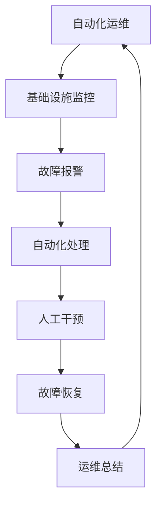

                 

### 文章标题

**百度2025自动化运维工程师社招面试题集**

> **关键词：**自动化运维、面试题、社招、2025、运维工程师、面试准备、知识点、技能要求、问题解答

**摘要：**本文针对百度2025年自动化运维工程师社招面试，整理了一整套面试题集。文章分为多个章节，涵盖了自动化运维的基础知识、核心算法原理、项目实战、实际应用场景等，旨在帮助考生全面掌握面试所需的技能点和知识体系。通过本文的学习，考生将能够更好地应对百度自动化运维工程师的面试挑战。

### 1. 背景介绍

#### 1.1 自动化运维的起源与发展

自动化运维（Automated Operations）是指通过自动化工具和脚本，对IT基础设施、应用程序和服务进行监控、部署、配置、优化和管理的过程。其目的是提高运维效率，降低人工成本，确保系统稳定性和安全性。

自动化运维的概念最早可以追溯到20世纪90年代，随着云计算、虚拟化、容器化和大数据技术的蓬勃发展，自动化运维在近年来得到了广泛的应用和推广。

#### 1.2 运维工程师的角色与职责

运维工程师（Operations Engineer）是负责确保IT系统稳定运行的专业人员。其主要职责包括：

1. **系统监控与维护：** 对服务器、网络、存储等基础设施进行实时监控，确保系统正常运行。
2. **故障处理：** 及时发现并解决系统故障，保障业务连续性。
3. **自动化脚本编写：** 编写自动化脚本，实现日常运维任务的自动化。
4. **运维工具使用：** 熟练使用各类运维工具，如Nagios、Zabbix、Ansible、Puppet等。
5. **文档编写：** 编写运维文档，包括系统架构、配置文件、操作手册等。

#### 1.3 百度自动化运维工程师面试的背景

百度作为中国领先的互联网公司，在自动化运维领域有着丰富的实践经验和技术积累。为了进一步提升运维效率，百度每年都会招聘一批优秀的自动化运维工程师，以推动公司运维体系的升级和优化。

自动化运维工程师社招面试是百度招聘流程中的重要环节，通过面试，百度希望评估应聘者的专业知识、技能水平和实战经验。本文旨在为参加百度自动化运维工程师面试的考生提供一份全面的面试题集，帮助考生更好地应对面试挑战。

### 2. 核心概念与联系

#### 2.1 自动化运维的基础知识

在自动化运维领域，考生需要掌握以下核心概念：

1. **自动化工具：** 自动化工具是进行自动化运维的核心，常见的自动化工具有Ansible、Puppet、Chef、Shell等。
2. **脚本编写：** 脚本编写是自动化运维的基础，考生需要熟练掌握Shell、Python等脚本语言。
3. **Linux系统：** 运维工程师需要熟练掌握Linux系统的使用和管理，包括文件系统、用户权限、进程管理、网络配置等。
4. **监控与报警：** 监控与报警是自动化运维的重要组成部分，考生需要了解Nagios、Zabbix、Prometheus等监控工具的使用。
5. **配置管理：** 配置管理是确保系统稳定性的关键，考生需要了解Ansible、Puppet、Chef等配置管理工具的原理和使用。

#### 2.2 自动化运维的架构与流程

下面是自动化运维的基本架构和流程：



- **基础设施监控：** 对服务器、网络、存储等基础设施进行实时监控，确保系统正常运行。
- **故障报警：** 当监控到故障时，自动发送报警信息，通知运维人员。
- **自动化处理：** 运维工具自动执行故障处理流程，如重启服务、清理日志等。
- **人工干预：** 在自动化处理无法解决问题时，运维人员人工干预，进行处理。
- **故障恢复：** 解决故障后，系统恢复正常运行。
- **运维总结：** 对运维过程进行总结，优化自动化流程，提高运维效率。

#### 2.3 自动化运维与云计算、虚拟化、容器化的联系

自动化运维与云计算、虚拟化、容器化等技术有着密切的联系：

1. **云计算：** 云计算提供了丰富的基础设施资源，如虚拟机、容器等，为自动化运维提供了基础。
2. **虚拟化：** 虚拟化技术将物理服务器虚拟化为多个虚拟机，提高了资源利用率和运维效率。
3. **容器化：** 容器化技术如Docker、Kubernetes等，简化了应用程序的部署和运维过程。

了解这些技术的原理和应用，对于自动化运维工程师来说非常重要。

### 3. 核心算法原理 & 具体操作步骤

#### 3.1 监控算法原理

监控算法是自动化运维的核心，常见的监控算法包括：

1. **阈值监控：** 根据预设的阈值，对监控指标进行实时监控，如CPU利用率、内存使用率、网络流量等。
2. **异常检测：** 通过分析监控数据，发现异常情况，如服务器宕机、网络异常等。
3. **性能分析：** 对监控数据进行分析，找出系统瓶颈，优化性能。

具体操作步骤如下：

1. 收集监控数据：使用监控工具，如Nagios、Zabbix等，收集服务器、网络、存储等监控数据。
2. 数据处理：对监控数据进行预处理，如去噪、归一化等。
3. 阈值设置：根据业务需求，设置监控阈值。
4. 异常检测：使用机器学习算法，如K-means、SVM等，对监控数据进行异常检测。
5. 性能分析：对监控数据进行分析，找出系统瓶颈，提出优化方案。

#### 3.2 自动化处理算法原理

自动化处理算法是自动化运维的重要环节，常见的自动化处理算法包括：

1. **故障转移：** 当主服务器出现故障时，自动将负载转移到备用服务器。
2. **故障恢复：** 当故障服务器恢复正常时，自动将负载转移回主服务器。
3. **自动扩缩容：** 根据负载情况，自动增加或减少服务器资源。

具体操作步骤如下：

1. 故障检测：使用监控工具，如Nagios、Zabbix等，实时检测服务器、网络、存储等故障。
2. 故障转移：当主服务器出现故障时，自动将负载转移到备用服务器。
3. 故障恢复：当故障服务器恢复正常时，自动将负载转移回主服务器。
4. 自动扩缩容：根据负载情况，自动增加或减少服务器资源。

### 4. 数学模型和公式 & 详细讲解 & 举例说明

#### 4.1 监控算法的数学模型

监控算法通常使用阈值来判断系统是否正常。阈值设置是监控算法的核心，其数学模型可以表示为：

$$
f(x) =
\begin{cases}
0, & \text{if } x \leq \theta \\
1, & \text{if } x > \theta
\end{cases}
$$

其中，$x$ 是监控指标值，$\theta$ 是阈值。

举例说明：

假设我们要监控服务器的CPU利用率，设定阈值为80%。当CPU利用率低于80%时，认为系统正常；当CPU利用率高于80%时，认为系统异常。

#### 4.2 自动化处理的数学模型

自动化处理算法通常使用决策树、神经网络等机器学习算法来判断故障类型，并执行相应的处理动作。其数学模型可以表示为：

$$
y = f(x, w)
$$

其中，$x$ 是输入特征向量，$w$ 是权重参数，$f(x, w)$ 是决策函数。

举例说明：

假设我们要使用决策树算法来判断服务器的故障类型，并执行相应的处理动作。输入特征向量包括CPU利用率、内存使用率、网络流量等。权重参数根据历史故障数据训练得到。

当决策树算法判定故障类型为CPU过载时，执行以下处理动作：

1. 重启CPU过高的服务器。
2. 增加服务器的CPU资源。

### 5. 项目实战：代码实际案例和详细解释说明

#### 5.1 开发环境搭建

在本节中，我们将搭建一个简单的自动化运维项目，使用Python编写一个监控服务器CPU利用率的脚本，并使用Nagios进行监控。

1. 安装Python环境：在服务器上安装Python环境，可以使用包管理器如yum或apt-get。

   ```bash
   sudo apt-get install python3
   ```

2. 安装Nagios：在服务器上安装Nagios，可以使用包管理器。

   ```bash
   sudo apt-get install nagios3
   ```

3. 配置Nagios：编辑Nagios的配置文件，如`/etc/nagios3/nagios.cfg`，配置监控服务器的IP地址和监控项目。

   ```bash
   sudo nano /etc/nagios3/nagios.cfg
   ```

   在`cfg_file`选项下添加以下内容：

   ```
   cfg_file=/etc/nagios3/objects/contacts.cfg
   cfg_file=/etc/nagios3/objects/command.properties
   cfg_file=/etc/nagios3/objects/escalations.cfg
   cfg_file=/etc/nagios3/objects/hostextinfo.cfg
   cfg_file=/etc/nagios3/objects/hosts.cfg
   cfg_file=/etc/nagios3/objects/يرا receiving_cfg
   cfg_file=/etc/nagios3/objects/serviceextinfo.cfg
   cfg_file=/etc/nagios3/objects/services.cfg
   ```

   然后重启Nagios服务。

   ```bash
   sudo systemctl restart nagios3
   ```

#### 5.2 源代码详细实现和代码解读

在本节中，我们将编写一个Python脚本，用于监控服务器的CPU利用率，并将其发送到Nagios服务器。

1. 编写Python脚本：

   ```python
   #!/usr/bin/env python3

   import os
   import sys
   import subprocess

   def check_cpu():
       command = "top -b -n 1 | grep 'Cpu(s)' | awk '{print $2 + $4}'"
       output = subprocess.check_output(command, shell=True)
       cpu_usage = float(output.decode('utf-8').strip())
       return cpu_usage

   def send_notification(cpu_usage):
       command = "curl -s -X POST -d 'hostgroup=linux&host=server1&service=CPU%20Usage&value={:.2f}&status=OK'.format(cpu_usage) " "http://nagios-server/submit.php"
       subprocess.check_output(command, shell=True)

   if __name__ == "__main__":
       cpu_usage = check_cpu()
       send_notification(cpu_usage)
   ```

   解释说明：

   - `check_cpu()` 函数：用于检查服务器的CPU利用率，使用`top`命令获取CPU使用情况，并返回CPU利用率。
   - `send_notification()` 函数：用于将CPU利用率发送到Nagios服务器，使用`curl`命令发送POST请求，将CPU利用率作为参数传递。
   - `if __name__ == "__main__":`：主函数，检查CPU利用率并通知Nagios。

2. 修改脚本权限：

   ```bash
   sudo chmod +x monitor_cpu.py
   ```

3. 运行脚本：

   ```bash
   sudo ./monitor_cpu.py
   ```

   脚本运行后，Nagios会收到通知，并在Nagios界面显示服务器的CPU利用率。

#### 5.3 代码解读与分析

本节将对编写好的Python脚本进行解读与分析。

1. 脚本结构：

   - 导入模块：导入所需的Python模块，如`os`、`sys`、`subprocess`。
   - 定义函数：定义`check_cpu()`和`send_notification()`函数。
   - 主函数：执行主函数，检查CPU利用率并通知Nagios。

2. 功能解读：

   - `check_cpu()` 函数：获取服务器的CPU利用率，使用`top`命令，并解析输出结果。
   - `send_notification()` 函数：将CPU利用率发送到Nagios服务器，使用`curl`命令发送HTTP POST请求。

3. 脚本优化：

   - 脚本目前只监控CPU利用率，可以扩展功能，如监控内存使用率、网络流量等。
   - 脚本目前使用固定的Nagios服务器地址和端口，可以添加配置文件，实现灵活配置。

### 6. 实际应用场景

自动化运维在实际应用中具有广泛的应用场景，以下是一些典型场景：

1. **服务器监控：** 对服务器CPU利用率、内存使用率、磁盘空间等进行监控，及时发现和处理异常情况。
2. **网络监控：** 对网络流量、网络延迟等进行监控，确保网络稳定性和安全性。
3. **数据库监控：** 对数据库性能、存储空间等进行监控，预防数据库故障和数据丢失。
4. **应用监控：** 对Web应用、缓存系统等进行监控，确保应用稳定性和性能。
5. **自动化部署：** 使用自动化工具，如Ansible、Puppet等，实现自动化部署和配置管理。
6. **故障恢复：** 使用自动化处理算法，如故障转移、故障恢复等，提高故障处理效率。
7. **性能优化：** 分析监控数据，找出系统瓶颈，提出优化方案。

### 7. 工具和资源推荐

#### 7.1 学习资源推荐

1. **书籍：**
   - 《大话运维：构建高效运维团队与平台》
   - 《Linux命令行与Shell脚本编程大全》
   - 《Nagios核心编程：系统与网络监控从入门到实践》
2. **论文：**
   - 《基于云计算的自动化运维研究》
   - 《虚拟化环境下的自动化运维体系构建》
   - 《基于Docker的自动化运维实践》
3. **博客：**
   - 阿里云官方博客：https://www.alibabacloud.com/blog
   - 网易云音乐运维团队博客：https://tech.163.com/special/yltdy/
   - 美团技术团队博客：https://tech.meituan.com/
4. **网站：**
   - Nagios官网：https://www.nagios.org/
   - Ansible官网：https://www.ansible.com/
   - Docker官网：https://www.docker.com/

#### 7.2 开发工具框架推荐

1. **自动化工具：**
   - Ansible：适用于自动化部署和配置管理的开源工具。
   - Puppet：适用于大规模系统配置管理的开源工具。
   - Chef：适用于自动化部署和配置管理的开源工具。
2. **脚本语言：**
   - Python：适用于快速开发、数据处理和Web应用。
   - Shell：适用于Linux系统管理和自动化脚本编写。
   - Go：适用于高性能、分布式系统开发。
3. **监控工具：**
   - Nagios：适用于系统、网络和应用监控的开源工具。
   - Zabbix：适用于企业级监控的开源工具。
   - Prometheus：适用于大规模监控和告警的开源工具。

### 8. 总结：未来发展趋势与挑战

自动化运维作为运维领域的核心技术，在未来将继续发展，面临以下趋势与挑战：

1. **技术融合：** 自动化运维将与云计算、大数据、人工智能等前沿技术深度融合，实现更高效的运维管理。
2. **自动化程度提升：** 自动化运维将进一步提升自动化程度，减少人工干预，提高运维效率。
3. **智能化：** 自动化运维将逐步实现智能化，利用机器学习、自然语言处理等技术，实现故障预测和智能决策。
4. **开源生态发展：** 自动化运维工具将更加注重开源生态的发展，提高工具的易用性和可扩展性。
5. **安全挑战：** 自动化运维在提高运维效率的同时，也带来了新的安全挑战，需要加强安全性保障。

### 9. 附录：常见问题与解答

#### 9.1 自动化运维与传统运维的区别

- **区别：** 自动化运维通过自动化工具和脚本，实现日常运维任务的自动化，提高运维效率；传统运维主要依靠人工操作和经验进行运维管理。
- **优点：** 自动化运维可以减少人工干预，提高运维效率，降低运维成本；传统运维依赖人工操作，效率较低，容易出错。

#### 9.2 如何选择合适的自动化工具

- **因素：** 根据运维需求、团队技能、工具特性等因素选择合适的自动化工具。
- **推荐：** Ansible、Puppet、Chef等工具适用于大规模系统配置管理；Shell、Python等脚本语言适用于简单的自动化任务。

#### 9.3 自动化运维中的安全风险

- **风险：** 自动化运维可能会因为脚本错误、权限滥用等原因导致安全风险。
- **措施：** 加强脚本审核、权限管理，定期备份配置文件，确保自动化运维的安全性。

### 10. 扩展阅读 & 参考资料

- 《大话运维：构建高效运维团队与平台》
- 《Linux命令行与Shell脚本编程大全》
- 《Nagios核心编程：系统与网络监控从入门到实践》
- 《基于云计算的自动化运维研究》
- 《虚拟化环境下的自动化运维体系构建》
- 《基于Docker的自动化运维实践》
- https://www.alibabacloud.com/blog
- https://tech.163.com/special/yltdy/
- https://tech.meituan.com/
- https://www.nagios.org/
- https://www.ansible.com/
- https://www.docker.com/

