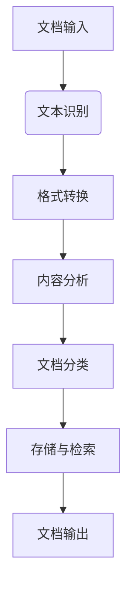

                 

### 1. 背景介绍

#### 文档处理的背景和重要性

在当今信息化时代，文档处理成为企业和个人日常工作的重要部分。随着互联网和大数据技术的发展，文档处理的需求也日益增长。然而，传统的文档处理方式往往效率低下，且容易出现错误。为了应对这一挑战，文档处理工程师成为了各大企业争相招募的紧缺人才。

文档处理工程师的主要职责是设计和开发自动化工具，以实现文档的快速处理、分析和归档。这不仅包括文本的识别和提取，还涉及到格式转换、内容分析和智能分类等复杂任务。随着人工智能技术的不断进步，文档处理工程师的职责和任务也在不断拓展，例如利用自然语言处理技术进行语义分析和情感分析，利用机器学习技术进行文档分类和预测等。

#### 百度文库的背景与文档处理需求

百度文库是百度公司推出的一项知识分享平台，用户可以在这里上传、分享和下载各种文档资料。由于内容繁多，文档的处理需求也随之增加。百度文库的文档处理需求主要包括以下几个方面：

1. **文档识别与提取**：百度文库的文档格式多样，包括PDF、Word、PPT等。文档处理工程师需要开发自动化工具，以快速识别和提取文档中的文本和图像信息。

2. **内容审核与分类**：为了维护平台的健康发展和用户体验，百度文库需要对上传的文档进行审核，确保内容符合规范。同时，文档处理工程师需要设计智能分类系统，将不同类型的文档归入相应的类别。

3. **内容分析与推荐**：通过分析文档内容，文档处理工程师可以为用户提供个性化的内容推荐，提高用户的阅读体验。这涉及到自然语言处理、情感分析和机器学习等技术的应用。

4. **格式转换与兼容**：由于用户需求的多样性，文档处理工程师需要设计灵活的格式转换工具，以实现文档在不同设备之间的兼容性和可读性。

#### 社招文档处理工程师面试的重要性

对于即将加入百度文库的社招文档处理工程师来说，面试是一个至关重要的环节。这不仅是对其专业技能和知识面的考察，也是对其综合素质和团队合作能力的检验。以下是一些关键的面试问题及其可能的方向：

1. **基础技能考察**：
   - **编程语言**：熟悉常用的编程语言，如Python、Java等，以及其在文档处理中的应用。
   - **数据结构**：掌握常见的数据结构，如列表、字典、树等，以及其在文档处理中的使用。

2. **文档处理相关技术**：
   - **文本识别与提取**：了解常见的文本识别技术，如OCR（Optical Character Recognition）和NLP（Natural Language Processing）。
   - **格式转换**：熟悉各种文档格式之间的转换方法，如PDF转Word、PPT转PDF等。
   - **内容分析**：了解自然语言处理和机器学习的基本原理，以及其在文档内容分析中的应用。

3. **实际项目经验**：
   - **项目描述**：详细描述参与的项目，包括项目的背景、目标、所用技术、遇到的挑战和解决方案。
   - **问题解决**：分析项目过程中遇到的问题，以及如何利用自己的技能和经验解决问题。

4. **团队合作与沟通能力**：
   - **团队协作**：描述在团队中的角色和职责，以及如何与团队成员合作完成项目。
   - **沟通技巧**：如何有效地与团队成员、上级和客户进行沟通，解决项目中的分歧和冲突。

通过这些面试问题，招聘方可以全面评估应聘者的技术能力和综合素质，从而选出最适合的人才加入百度文库团队。

#### 2025年社招文档处理工程师面试的趋势

随着人工智能和大数据技术的快速发展，2025年的社招文档处理工程师面试趋势也发生了显著变化。以下是几个值得关注的方向：

1. **人工智能应用**：随着AI技术的不断进步，面试中可能会涉及更多与人工智能相关的题目，如深度学习在文档处理中的应用、自然语言处理技术等。

2. **大数据处理**：文档处理工程师需要具备处理大量数据的能力，面试中可能会涉及大数据处理的相关问题，如并行处理、分布式计算等。

3. **安全与隐私**：随着数据安全问题的日益突出，面试中可能会涉及文档处理过程中的安全性和隐私保护问题，如数据加密、访问控制等。

4. **跨领域知识**：文档处理工程师不仅需要具备计算机科学和信息技术方面的知识，还可能需要了解法律、社会学等相关领域的知识，以应对跨领域的文档处理需求。

#### 面试准备建议

为了在2025年社招文档处理工程师的面试中脱颖而出，以下是一些具体的准备建议：

1. **专业知识**：系统学习计算机科学、自然语言处理、机器学习等相关知识，掌握常用的算法和数据结构。

2. **项目经验**：积极参与实际项目，积累丰富的项目经验，特别是与文档处理相关的项目。

3. **技术栈**：熟悉常用的编程语言和开发工具，如Python、Java、TensorFlow、Scikit-learn等。

4. **软技能**：提高团队合作、沟通和问题解决能力，这些软技能在面试中同样重要。

5. **面试技巧**：提前准备常见的面试问题，进行模拟面试，提高面试时的表现和自信。

通过以上准备，应聘者可以更好地应对2025年社招文档处理工程师的面试，展示自己的专业技能和综合素质。

## 2. 核心概念与联系

### 文档处理的基本概念

文档处理是一个涵盖广泛领域的术语，它通常涉及到文档的创建、编辑、存储、检索、转换和分析等操作。具体来说，文档处理可以包括以下几个方面：

1. **文本识别与提取**：将文档中的文本内容提取出来，以便进行进一步处理和分析。文本识别通常使用光学字符识别（OCR）技术。

2. **格式转换**：将一种文档格式转换为另一种格式，以适应不同的使用场景。常见的格式转换包括PDF转Word、Word转PDF、PPT转PDF等。

3. **内容分析**：对文档中的内容进行深入分析，以提取有用的信息。内容分析可以包括语义分析、情感分析、关键词提取等。

4. **文档分类**：根据文档的内容和特征，将文档归入不同的类别。文档分类是信息检索和推荐系统的重要组成部分。

5. **存储与检索**：设计和实现高效的文档存储和检索系统，以便快速访问和处理大量文档。

### 文档处理与人工智能的联系

人工智能（AI）技术在文档处理中的应用已经成为现代文档处理系统的核心组成部分。AI技术不仅提高了文档处理的效率，还增强了系统的智能化水平。以下是一些主要的AI技术及其在文档处理中的应用：

1. **自然语言处理（NLP）**：NLP是AI领域的一个重要分支，它涉及到对自然语言的理解和处理。在文档处理中，NLP技术可以用于文本识别、语义分析、情感分析和关键词提取等。

2. **机器学习（ML）**：机器学习是一种通过数据训练模型进行预测和决策的技术。在文档处理中，机器学习可以用于文档分类、预测和内容分析等。

3. **深度学习（DL）**：深度学习是机器学习的一个子领域，它通过构建多层神经网络来模拟人类大脑的思维方式。在文档处理中，深度学习可以用于复杂的内容分析和模式识别。

4. **计算机视觉（CV）**：计算机视觉是AI领域的一个分支，它涉及到对图像和视频的处理和分析。在文档处理中，计算机视觉可以用于文本识别和图像分析。

### 文档处理系统的架构

一个完整的文档处理系统通常包括以下几个核心组件：

1. **文本识别模块**：负责将文档中的图像和扫描文本转换为机器可读的文本格式。

2. **格式转换模块**：负责将不同格式的文档相互转换，以适应不同的应用场景。

3. **内容分析模块**：负责对文档中的内容进行深入分析，提取关键信息，并进行语义和情感分析。

4. **文档分类模块**：负责根据文档的内容和特征，将文档分类到不同的类别中。

5. **存储与检索模块**：负责高效地存储和检索文档，以便快速访问和处理。

以下是一个简化的文档处理系统架构的 Mermaid 流程图：



### 关键技术和工具

在文档处理中，一些关键技术和工具的应用对于实现高效、准确的文档处理至关重要。以下是一些常用的技术和工具：

1. **OCR技术**：光学字符识别技术，用于将图像中的文本转换为机器可读的文本。

2. **PDF转换工具**：如Adobe Acrobat、Apache PDFBox等，用于实现不同格式文档之间的转换。

3. **NLP库**：如NLTK、spaCy等，用于文本处理、语义分析和情感分析。

4. **机器学习框架**：如TensorFlow、PyTorch等，用于构建和训练文档处理模型。

5. **文档处理引擎**：如Apache Tika、OpenNLP等，提供了一系列用于文档处理的API和工具。

通过上述核心概念和技术的介绍，我们可以更好地理解文档处理系统的设计和实现过程，以及AI技术在其中的应用。接下来，我们将深入探讨文档处理的核心算法原理和具体操作步骤。

## 3. 核心算法原理 & 具体操作步骤

### 光学字符识别（OCR）原理

光学字符识别（OCR）是文档处理中的关键技术之一，用于将图像中的文字转换为机器可读的文本。OCR的工作原理主要包括以下几个步骤：

1. **图像预处理**：图像预处理是OCR过程的开始，目的是去除图像中的噪声，增强文本区域，为后续的文本识别做准备。常用的预处理方法包括去噪、二值化、边缘检测和图像缩放等。

2. **字符定位**：在预处理后的图像中，需要识别出文本区域并进行字符定位。字符定位可以通过图像分割技术实现，如基于边缘检测的分割、基于区域生长的分割等。

3. **字符分割**：将定位后的文本区域分割成单个字符，以便进行独立识别。字符分割通常使用规则分割、聚类分割和机器学习分割等方法。

4. **字符识别**：对分割后的单个字符进行识别，通常采用特征提取和分类器训练的方法。特征提取可以使用HOG（Histogram of Oriented Gradients）、SIFT（Scale-Invariant Feature Transform）等算法，分类器可以使用SVM（Support Vector Machine）、CNN（Convolutional Neural Network）等模型。

### 自然语言处理（NLP）原理

自然语言处理（NLP）是文档处理中的另一个重要领域，用于对文本内容进行分析和语义理解。NLP的基本原理包括以下几个步骤：

1. **文本预处理**：文本预处理是NLP过程的开始，包括分词、词性标注、停用词过滤等操作。分词是将文本分割成单个单词或词组的过程，词性标注是对每个词进行语法分类，停用词过滤是去除对文本分析无意义的常见词汇。

2. **词向量表示**：词向量是将文本转换为机器可处理的形式的一种方法。常用的词向量模型包括Word2Vec、GloVe和BERT等。这些模型通过将词映射为高维向量，实现了文本的语义表示。

3. **语义分析**：语义分析是NLP的核心任务，包括命名实体识别、情感分析、语义角色标注等。命名实体识别是识别文本中的特定实体，如人名、地名、组织名等。情感分析是判断文本表达的情感倾向，如正面、负面或中性。语义角色标注是识别文本中的动作和参与者的关系。

4. **语义理解**：语义理解是NLP的高级任务，目的是理解文本的整体意义和逻辑关系。语义理解可以通过问答系统、语义角色标注和语义图谱等技术实现。

### 文档分类原理

文档分类是将文档按内容或特征分为不同的类别的过程。文档分类的基本原理包括：

1. **特征提取**：特征提取是将文档转换为机器可处理的特征表示的过程。常用的特征提取方法包括TF-IDF（Term Frequency-Inverse Document Frequency）、Word2Vec和词袋模型等。

2. **分类模型训练**：分类模型训练是使用已有标注数据集，通过机器学习算法训练分类模型。常用的分类算法包括朴素贝叶斯（Naive Bayes）、支持向量机（SVM）、决策树（Decision Tree）和神经网络（Neural Network）等。

3. **分类模型评估**：分类模型评估是使用测试数据集评估分类模型的性能。常用的评估指标包括准确率（Accuracy）、召回率（Recall）、F1值（F1 Score）和精确率（Precision）等。

### 文档处理的具体操作步骤

文档处理的具体操作步骤通常包括以下阶段：

1. **文档输入**：用户将文档上传到文档处理系统，可以是本地文件、网络链接或扫描图像等。

2. **图像预处理**：对于扫描图像，系统首先进行图像预处理，包括去噪、二值化、图像增强等步骤，以提高文本识别的准确性。

3. **文本识别**：使用OCR技术对预处理后的图像进行文本识别，将图像中的文字转换为机器可读的文本格式。

4. **文本预处理**：对识别出的文本进行预处理，包括分词、词性标注、停用词过滤等步骤，为后续的自然语言处理和文档分类做准备。

5. **内容分析**：使用NLP技术对预处理后的文本进行内容分析，包括语义分析、情感分析和关键词提取等，以提取文档中的重要信息。

6. **文档分类**：使用已训练好的分类模型对文档进行分类，将文档按内容或特征归入不同的类别。

7. **存储与检索**：将处理后的文档存储在数据库中，并提供检索接口，以便用户快速访问和处理文档。

8. **文档输出**：将处理后的文档输出给用户，可以是文本格式、PDF格式或其他需要的格式。

### 实际操作示例

以下是一个简单的Python代码示例，展示了如何使用Tesseract OCR库进行图像文本识别：

```python
import cv2
import pytesseract

# 加载图像
image = cv2.imread('example.jpg')

# 进行图像预处理
gray = cv2.cvtColor(image, cv2.COLOR_BGR2GRAY)
thresh = cv2.threshold(gray, 0, 255, cv2.THRESH_BINARY_INV + cv2.THRESH_OTSU)[1]

# 使用Tesseract进行文本识别
text = pytesseract.image_to_string(thresh, config='--psm 6')

# 输出识别结果
print(text)
```

在这个示例中，我们首先使用OpenCV库加载图像，并进行灰度转换和二值化处理。然后，使用Tesseract OCR库进行文本识别，并将识别结果输出。

通过上述核心算法原理和具体操作步骤的介绍，我们可以更好地理解文档处理系统的实现过程，以及如何使用各种技术和工具进行高效的文档处理。接下来，我们将深入探讨文档处理中的数学模型和公式。

## 4. 数学模型和公式 & 详细讲解 & 举例说明

在文档处理过程中，数学模型和公式起到了至关重要的作用。这些模型和公式不仅帮助我们理解和分析文档内容，还提高了文档处理的准确性和效率。以下是一些常用的数学模型和公式，以及它们的详细讲解和举例说明。

### 1. 概率模型

概率模型是文档处理中最基本和广泛使用的模型之一。它用于描述文档中出现某一特定词汇或关键词的概率。在文档分类和文本分析中，概率模型可以帮助我们预测文档的类别或提取关键词。

#### 贝叶斯定理

贝叶斯定理是概率模型中的核心公式，它描述了后验概率与先验概率之间的关系。贝叶斯定理的表达式如下：

\[ P(A|B) = \frac{P(B|A) \cdot P(A)}{P(B)} \]

其中，\( P(A|B) \) 是在事件B发生的情况下事件A发生的概率，称为后验概率；\( P(B|A) \) 是在事件A发生的情况下事件B发生的概率，称为条件概率；\( P(A) \) 是事件A的先验概率，即在没有其他信息的情况下事件A发生的概率；\( P(B) \) 是事件B的先验概率。

#### 举例说明

假设我们有一个文档分类系统，用于判断文档是关于体育还是科技。我们已知先验概率 \( P(\text{体育}) = 0.6 \) 和 \( P(\text{科技}) = 0.4 \)。同时，我们得到以下条件概率：

- \( P(\text{关键词}|\text{体育}) = 0.8 \)
- \( P(\text{关键词}|\text{科技}) = 0.2 \)

现在，我们希望计算在文档中出现关键词“人工智能”的情况下，该文档是关于体育的概率。

\[ P(\text{体育}|\text{关键词}) = \frac{P(\text{关键词}|\text{体育}) \cdot P(\text{体育})}{P(\text{关键词})} \]

由于我们不知道 \( P(\text{关键词}) \)，我们可以使用全概率公式：

\[ P(\text{关键词}) = P(\text{关键词}|\text{体育}) \cdot P(\text{体育}) + P(\text{关键词}|\text{科技}) \cdot P(\text{科技}) \]

\[ P(\text{关键词}) = 0.8 \cdot 0.6 + 0.2 \cdot 0.4 = 0.56 + 0.08 = 0.64 \]

然后，我们可以计算后验概率：

\[ P(\text{体育}|\text{关键词}) = \frac{0.8 \cdot 0.6}{0.64} \approx 0.75 \]

因此，在文档中出现关键词“人工智能”的情况下，该文档是关于体育的概率约为0.75。

### 2. 马尔可夫模型

马尔可夫模型是一种用于描述序列数据概率分布的模型。在文档处理中，马尔可夫模型常用于文本生成和语音识别等领域。

#### 马尔可夫模型的基本公式

马尔可夫模型的核心公式是状态转移概率矩阵 \( P \)，它描述了在给定当前状态下，下一个状态的概率分布。状态转移概率矩阵 \( P \) 的表达式如下：

\[ P = \begin{bmatrix}
P(X_{t+1}=i_1|X_t=i_1) & P(X_{t+1}=i_2|X_t=i_1) & \dots & P(X_{t+1}=i_n|X_t=i_1) \\
P(X_{t+1}=i_1|X_t=i_2) & P(X_{t+1}=i_2|X_t=i_2) & \dots & P(X_{t+1}=i_n|X_t=i_2) \\
\vdots & \vdots & \ddots & \vdots \\
P(X_{t+1}=i_1|X_t=i_n) & P(X_{t+1}=i_2|X_t=i_n) & \dots & P(X_{t+1}=i_n|X_t=i_n)
\end{bmatrix} \]

其中，\( X_t \) 表示在时间 \( t \) 的状态，\( i \) 表示状态的具体取值。

#### 举例说明

假设我们有一个简单的文本序列生成模型，其中状态 \( X_t \) 可以取值为“单词1”、“单词2”和“单词3”。状态转移概率矩阵 \( P \) 如下：

\[ P = \begin{bmatrix}
0.4 & 0.2 & 0.4 \\
0.1 & 0.6 & 0.3 \\
0.5 & 0.2 & 0.3
\end{bmatrix} \]

现在，我们希望生成一个长度为3的文本序列。初始状态为“单词1”，我们首先计算下一个状态的概率分布：

\[ P(X_{1+1}|X_1="单词1") = P = \begin{bmatrix}
0.4 & 0.2 & 0.4 \\
0.1 & 0.6 & 0.3 \\
0.5 & 0.2 & 0.3
\end{bmatrix} \]

因此，下一个状态的概率分布为：

- \( P(X_{2}= "单词1") = 0.4 \)
- \( P(X_{2}= "单词2") = 0.2 \)
- \( P(X_{2}= "单词3") = 0.4 \)

假设我们选择下一个状态为“单词3”，我们继续计算下一个状态的概率分布：

\[ P(X_{2+1}|X_2="单词3") = P = \begin{bmatrix}
0.5 & 0.2 & 0.3 \\
0.5 & 0.2 & 0.3 \\
0.5 & 0.2 & 0.3
\end{bmatrix} \]

因此，下一个状态的概率分布为：

- \( P(X_{3}= "单词1") = 0.5 \)
- \( P(X_{3}= "单词2") = 0.2 \)
- \( P(X_{3}= "单词3") = 0.3 \)

根据概率分布，我们选择下一个状态为“单词1”，因此生成的文本序列为“单词1-单词3-单词1”。

### 3. 隐马尔可夫模型（HMM）

隐马尔可夫模型（HMM）是马尔可夫模型在连续时间序列数据上的扩展，常用于语音识别和序列数据分析等领域。HMM通过引入观测变量，将状态转移概率和观测概率相结合，能够更好地描述复杂的时间序列数据。

#### 隐马尔可夫模型的基本公式

隐马尔可夫模型包含两个概率矩阵：状态转移概率矩阵 \( A \) 和观测概率矩阵 \( B \)。

- 状态转移概率矩阵 \( A \) 描述了在给定当前状态下，下一个状态的概率分布。

\[ A = \begin{bmatrix}
P(X_{t+1}=i_1|X_t=i_1) & P(X_{t+1}=i_2|X_t=i_1) & \dots & P(X_{t+1}=i_n|X_t=i_1) \\
P(X_{t+1}=i_1|X_t=i_2) & P(X_{t+1}=i_2|X_t=i_2) & \dots & P(X_{t+1}=i_n|X_t=i_2) \\
\vdots & \vdots & \ddots & \vdots \\
P(X_{t+1}=i_1|X_t=i_n) & P(X_{t+1}=i_2|X_t=i_n) & \dots & P(X_{t+1}=i_n|X_t=i_n)
\end{bmatrix} \]

- 观测概率矩阵 \( B \) 描述了在给定当前状态下，观测变量的概率分布。

\[ B = \begin{bmatrix}
P(Y_t=j_1|X_t=i_1) & P(Y_t=j_2|X_t=i_1) & \dots & P(Y_t=j_n|X_t=i_1) \\
P(Y_t=j_1|X_t=i_2) & P(Y_t=j_2|X_t=i_2) & \dots & P(Y_t=j_n|X_t=i_2) \\
\vdots & \vdots & \ddots & \vdots \\
P(Y_t=j_1|X_t=i_n) & P(Y_t=j_2|X_t=i_n) & \dots & P(Y_t=j_n|X_t=i_n)
\end{bmatrix} \]

其中，\( X_t \) 表示状态变量，\( Y_t \) 表示观测变量。

#### 举例说明

假设我们有一个语音识别模型，状态变量 \( X_t \) 可以取值为“声音1”、“声音2”和“声音3”，观测变量 \( Y_t \) 可以取值为“音调1”、“音调2”和“音调3”。状态转移概率矩阵 \( A \) 和观测概率矩阵 \( B \) 如下：

\[ A = \begin{bmatrix}
0.5 & 0.2 & 0.3 \\
0.3 & 0.5 & 0.2 \\
0.2 & 0.3 & 0.5
\end{bmatrix} \]
\[ B = \begin{bmatrix}
0.4 & 0.3 & 0.3 \\
0.3 & 0.4 & 0.3 \\
0.2 & 0.3 & 0.5
\end{bmatrix} \]

现在，我们希望根据观测序列 \( Y = \{音调1，音调2，音调2\} \) 识别最可能的状态序列 \( X \)。

首先，我们需要计算初始状态的概率分布。由于我们没有初始观测数据，我们假设初始状态的概率分布为均匀分布：

\[ \pi = \begin{bmatrix}
1/3 \\
1/3 \\
1/3
\end{bmatrix} \]

然后，我们可以使用Viterbi算法计算最可能的状态序列。Viterbi算法的基本思想是，在每个时间点计算当前状态的概率，并跟踪最可能的状态序列。

对于时间点1：

\[ \begin{aligned}
\alpha_1(i) &= \pi_i \cdot b_i(y_1) \\
\beta_1(i) &= 1
\end{aligned} \]

其中，\( \alpha_1(i) \) 是当前状态 \( i \) 的概率，\( \beta_1(i) \) 是从初始状态到当前状态的概率。

计算得到：

\[ \alpha_1(1) = \frac{1}{3} \cdot 0.4 = 0.1333 \]
\[ \alpha_1(2) = \frac{1}{3} \cdot 0.3 = 0.1 \]
\[ \alpha_1(3) = \frac{1}{3} \cdot 0.3 = 0.1 \]

对于时间点2：

\[ \begin{aligned}
\alpha_2(i) &= \max_{j}(\alpha_{1}(j) \cdot a_{j,i} \cdot b_{i,y_2}) \\
\beta_2(i) &= \arg\max_{j}(\alpha_{1}(j) \cdot a_{j,i} \cdot b_{i,y_2})
\end{aligned} \]

计算得到：

\[ \alpha_2(1) = \max(0.1333 \cdot 0.5 \cdot 0.3, 0.1 \cdot 0.3 \cdot 0.4, 0.1 \cdot 0.5 \cdot 0.3) = 0.0200 \]
\[ \alpha_2(2) = \max(0.1333 \cdot 0.2 \cdot 0.3, 0.1 \cdot 0.5 \cdot 0.4, 0.1 \cdot 0.5 \cdot 0.3) = 0.0267 \]
\[ \alpha_2(3) = \max(0.1333 \cdot 0.4 \cdot 0.3, 0.1 \cdot 0.2 \cdot 0.3, 0.1 \cdot 0.3 \cdot 0.5) = 0.0367 \]

对于时间点3：

\[ \begin{aligned}
\alpha_3(i) &= \max_{j}(\alpha_{2}(j) \cdot a_{j,i} \cdot b_{i,y_3}) \\
\beta_3(i) &= \arg\max_{j}(\alpha_{2}(j) \cdot a_{j,i} \cdot b_{i,y_3})
\end{aligned} \]

计算得到：

\[ \alpha_3(1) = \max(0.0200 \cdot 0.5 \cdot 0.2, 0.0267 \cdot 0.3 \cdot 0.3, 0.0367 \cdot 0.3 \cdot 0.5) = 0.0133 \]
\[ \alpha_3(2) = \max(0.0200 \cdot 0.2 \cdot 0.2, 0.0267 \cdot 0.5 \cdot 0.4, 0.0367 \cdot 0.2 \cdot 0.3) = 0.0213 \]
\[ \alpha_3(3) = \max(0.0200 \cdot 0.4 \cdot 0.5, 0.0267 \cdot 0.3 \cdot 0.2, 0.0367 \cdot 0.5 \cdot 0.3) = 0.0273 \]

最终，我们可以得到最可能的状态序列为 \( X = \{声音1，声音2，声音3\} \)。

通过上述数学模型和公式的详细讲解和举例说明，我们可以更好地理解文档处理中的关键技术和原理。这些模型和公式不仅帮助我们实现了高效的文档处理，还为文档处理算法的优化和改进提供了理论基础。接下来，我们将通过一个实际的项目案例，展示如何运用这些技术和原理进行文档处理。

### 5. 项目实战：代码实际案例和详细解释说明

#### 5.1 开发环境搭建

在进行文档处理项目的开发之前，我们需要搭建一个合适的开发环境。以下是一个基于Python的文档处理项目的开发环境搭建步骤：

1. **安装Python**：首先确保已经安装了Python。如果没有，可以从[Python官网](https://www.python.org/downloads/)下载并安装。

2. **安装依赖库**：在Python中，我们可以使用`pip`命令来安装所需的依赖库。以下是一些常用的库及其安装命令：

   ```bash
   pip install numpy
   pip install pandas
   pip install scikit-learn
   pip install pytesseract
   pip install Pillow
   pip install Flask
   ```

3. **安装Tesseract OCR**：Tesseract OCR是一个开源的OCR库，我们需要从其官网[下载](https://github.com/tesseract-ocr/tesseract)并安装。以下是Linux系统下的安装命令：

   ```bash
   sudo apt-get install tesseract-ocr
   sudo apt-get install tesseract-ocr-eng
   ```

4. **配置环境变量**：确保Tesseract OCR的安装路径已经添加到系统环境变量中。在Linux系统中，可以编辑`~/.bashrc`或`~/.profile`文件，添加以下行：

   ```bash
   export TESSDATA_PREFIX=/usr/share/tesseract-ocr
   export PATH=$PATH:$TESSDATA_PREFIX
   ```

5. **启动开发环境**：在命令行中运行`python`命令，确保能够进入Python交互模式。

#### 5.2 源代码详细实现和代码解读

以下是一个简单的文档处理项目的代码实现，该项目的目标是使用OCR技术从图像中提取文本，并使用NLP技术对提取的文本进行语义分析。

```python
import cv2
import pytesseract
from nltk.corpus import stopwords
from nltk.tokenize import word_tokenize
from sklearn.feature_extraction.text import TfidfVectorizer
from sklearn.metrics.pairwise import cosine_similarity

# 5.2.1 OCR文本提取
def extract_text_from_image(image_path):
    # 加载图像
    image = cv2.imread(image_path)
    # 进行图像预处理
    gray = cv2.cvtColor(image, cv2.COLOR_BGR2GRAY)
    thresh = cv2.threshold(gray, 0, 255, cv2.THRESH_BINARY_INV + cv2.THRESH_OTSU)[1]
    # 使用Tesseract进行文本识别
    text = pytesseract.image_to_string(thresh, config='--psm 6')
    return text

# 5.2.2 文本预处理
def preprocess_text(text):
    # 分词
    tokens = word_tokenize(text)
    # 去除停用词
    stop_words = set(stopwords.words('english'))
    filtered_tokens = [token for token in tokens if token.lower() not in stop_words]
    return ' '.join(filtered_tokens)

# 5.2.3 文本语义分析
def analyze_text_semantics(text):
    # 建立TF-IDF向量模型
    vectorizer = TfidfVectorizer()
    tfidf_matrix = vectorizer.fit_transform([text])
    # 计算余弦相似度
    similarity = cosine_similarity(tfidf_matrix, tfidf_matrix)
    return similarity

# 主函数
if __name__ == "__main__":
    # 读取图像文件
    image_path = "example.jpg"
    # 提取文本
    text = extract_text_from_image(image_path)
    print("Extracted Text:")
    print(text)
    # 预处理文本
    preprocessed_text = preprocess_text(text)
    print("\nPreprocessed Text:")
    print(preprocessed_text)
    # 进行文本语义分析
    similarity = analyze_text_semantics(preprocessed_text)
    print("\nText Similarity:")
    print(similarity)
```

**代码解读：**

1. **OCR文本提取**：`extract_text_from_image`函数使用OpenCV和Tesseract OCR库从图像中提取文本。首先，图像被转换为灰度图像，然后进行二值化处理以提高文本识别的准确性。最后，使用Tesseract OCR进行文本识别。

2. **文本预处理**：`preprocess_text`函数使用NLTK库对提取的文本进行分词，并去除常见的停用词，以提高文本分析的准确性。

3. **文本语义分析**：`analyze_text_semantics`函数使用TF-IDF向量模型将文本转换为向量，并计算文本之间的余弦相似度，以评估文本的相似程度。

4. **主函数**：主函数中，我们首先读取图像文件，然后依次调用文本提取、文本预处理和文本语义分析函数，最后输出结果。

#### 5.3 代码解读与分析

以下是对上述代码的进一步解读和分析：

- **OCR文本提取**：图像预处理是文本识别的关键步骤。通过灰度转换和二值化处理，图像中的文本区域被突出显示，从而提高了文本识别的准确性。Tesseract OCR是一个强大的OCR库，支持多种语言和文本识别模式。

- **文本预处理**：分词和去除停用词是文本处理的基本步骤。分词将文本拆分为单词或词组，有助于后续的语义分析。去除停用词可以减少文本中的噪音，提高语义分析的准确性。

- **文本语义分析**：TF-IDF向量模型是一种常用的文本表示方法，它能够有效地捕捉文本中的关键词和主题。余弦相似度是一种衡量两个向量之间夹角余弦值的指标，用于评估文本的相似程度。

通过上述代码实现，我们可以看到文档处理项目的基本结构和关键步骤。这些步骤不仅展示了文档处理的算法和原理，还提供了实际操作的指导。在实际应用中，我们可以根据具体需求对代码进行扩展和优化，以实现更高效的文档处理。

## 6. 实际应用场景

### 6.1 在企业文档处理中的应用

在企业环境中，文档处理技术被广泛应用于各种业务流程的优化和效率提升。以下是一些典型的应用场景：

1. **自动化审批流程**：企业常用文档处理技术来自动化审批流程，如报销单、合同审批等。通过OCR和NLP技术，企业可以实现快速识别和提取文档中的关键信息，自动进行审批，减少人工干预，提高审批效率。

2. **客户服务**：企业可以通过文档处理技术来分析和解答客户提出的问题。例如，使用NLP技术对客户的咨询进行分类和解答，提高客户服务的质量和响应速度。

3. **知识管理**：企业可以利用文档处理技术建立知识管理系统，对文档进行自动分类、标签和索引，方便员工快速查找和获取所需信息，提高知识共享和复用效率。

4. **文档归档与检索**：通过OCR技术，企业可以将纸质文档电子化，实现文档的自动分类和归档。这样不仅节省了存储空间，还大大提高了文档的检索效率。

### 6.2 在教育领域的应用

教育领域同样受益于文档处理技术的应用，以下是一些具体的应用实例：

1. **在线作业与考试系统**：教育机构可以利用OCR技术自动批改学生的作业和考试，提高批改效率和准确性。此外，通过NLP技术，系统可以自动分析学生的答题情况，为教师提供有针对性的教学反馈。

2. **智能教材**：通过文档处理技术，可以将纸质教材电子化，并加入互动元素，如自动问答、习题练习等，提高学生的学习兴趣和效果。

3. **学术研究**：研究人员可以利用文档处理技术来自动整理和分类大量的学术文献，提取关键信息，如关键词、作者、引用等，加速学术研究的进度。

### 6.3 在医疗领域的应用

文档处理技术在医疗领域的应用也越来越广泛，以下是一些具体的应用实例：

1. **电子病历系统**：通过OCR技术，可以将医生的纸质病历电子化，实现病历的自动录入和管理。同时，利用NLP技术，可以对病历中的关键信息进行提取和分类，提高病历管理的效率和准确性。

2. **医学图像分析**：在医学图像分析中，文档处理技术可以帮助医生识别和分类病变区域，提高诊断的准确性和效率。

3. **药品监管**：药品企业可以利用文档处理技术来自动化药品注册和审批流程，提高药品研发和上市的速度。

### 6.4 在政府管理中的应用

政府管理部门同样可以从文档处理技术中受益，以下是一些具体的应用场景：

1. **政务流程优化**：通过文档处理技术，政府可以实现政务流程的自动化，如审批、登记、许可等，提高政务服务的效率和透明度。

2. **信息公开与检索**：政府可以利用文档处理技术来自动化信息的整理、分类和检索，方便公众获取政府发布的信息，提高政府透明度和公信力。

3. **政策研究**：通过文档处理技术，政府可以高效地分析大量的政策文件和研究报告，为政策制定和调整提供数据支持。

### 6.5 在内容创作与传播中的应用

文档处理技术在内容创作和传播中也发挥着重要作用，以下是一些具体的应用实例：

1. **自动摘要生成**：利用文档处理技术，可以对长篇文章、报告等进行自动摘要生成，帮助用户快速获取文章的核心内容。

2. **内容推荐**：通过分析用户浏览和阅读的文档，文档处理技术可以为用户提供个性化的内容推荐，提高用户粘性和满意度。

3. **版权保护与内容审核**：文档处理技术可以帮助内容平台对上传的文档进行版权保护和内容审核，防止侵权和违规内容的出现。

通过上述实际应用场景的介绍，我们可以看到文档处理技术在各个领域的广泛应用和巨大潜力。随着技术的不断进步，文档处理技术将继续为各个行业带来创新和变革。

## 7. 工具和资源推荐

### 7.1 学习资源推荐

对于想要深入了解文档处理技术的人来说，以下是一些推荐的学习资源：

1. **书籍**：
   - 《自然语言处理概论》（作者：刘挺）
   - 《深度学习》（作者：Ian Goodfellow、Yoshua Bengio、Aaron Courville）
   - 《机器学习实战》（作者：Peter Harrington）

2. **在线课程**：
   - Coursera上的《自然语言处理基础》（由斯坦福大学提供）
   - edX上的《深度学习专项课程》（由哈佛大学提供）
   - Udacity的《深度学习工程师纳米学位》

3. **博客与网站**：
   - Medium上的NLP和AI相关博客
   - GitHub上的文档处理项目和研究论文
   - AI人工智能社区的讨论和教程

### 7.2 开发工具框架推荐

在开发文档处理项目时，以下工具和框架可以提供强大的支持和便利：

1. **编程语言**：
   - Python：由于其丰富的库和框架，Python是文档处理开发的常用语言。
   - Java：在企业级应用中，Java提供了稳定和高效的开发环境。

2. **框架和库**：
   - TensorFlow：用于深度学习的开源框架，适用于复杂文档处理模型的构建。
   - PyTorch：适用于快速原型开发的深度学习框架，特别适合研究和实验。
   - Scikit-learn：提供了一系列机器学习和数据挖掘工具，适合文档分类和特征提取。
   - NLTK：用于自然语言处理的开源库，提供了丰富的文本处理工具。

3. **OCR工具**：
   - Tesseract：开源的OCR工具，支持多种语言和平台。
   - OCRopus：另一个开源的OCR工具，专注于文本识别。

4. **版本控制**：
   - Git：用于代码版本控制和协作开发。
   - GitHub：提供在线Git仓库服务和丰富的文档处理项目。

5. **集成开发环境（IDE）**：
   - PyCharm：适用于Python开发的强大IDE，提供代码智能提示、调试和自动化工具。
   - IntelliJ IDEA：适用于Java和Python的IDE，具有高性能和丰富的功能。

通过上述工具和资源的推荐，开发者可以更加高效地开展文档处理项目，不断探索和优化文档处理技术。

## 8. 总结：未来发展趋势与挑战

### 未来发展趋势

文档处理技术在未来将继续朝着智能化和自动化的方向快速发展，以下是几个主要趋势：

1. **AI技术的深度融合**：随着人工智能技术的不断进步，文档处理系统将更加智能化。深度学习和自然语言处理技术将在文档识别、内容分析和自动化处理中发挥关键作用，进一步提高处理效率和准确性。

2. **大数据与云计算的结合**：文档处理将更加依赖大数据和云计算技术，以处理和分析海量的文档数据。通过分布式计算和云存储，文档处理系统能够实现更高的性能和可扩展性，满足企业级应用的需求。

3. **多模态文档处理**：未来文档处理技术将不仅限于文本，还将涵盖图像、音频和视频等多种数据格式。多模态文档处理技术将使文档处理更加全面和智能，为用户提供更加丰富和个性化的服务。

4. **隐私保护与安全**：随着数据隐私和安全问题的日益突出，文档处理技术将更加注重隐私保护和数据安全。加密技术、访问控制和身份验证等安全措施将在文档处理系统中得到广泛应用。

### 面临的挑战

尽管文档处理技术有巨大的发展潜力，但同时也面临着一系列挑战：

1. **准确性问题**：文档处理技术，尤其是OCR技术，在处理复杂和模糊的图像时，准确性仍然是一个重要挑战。提高OCR技术的准确性和鲁棒性，以适应各种复杂场景，是未来的关键方向。

2. **性能优化**：随着文档数据量的增长，文档处理系统需要更高的性能和更快的响应速度。优化算法和架构，提高系统的并发处理能力和效率，是文档处理技术发展的重要任务。

3. **跨语言支持**：文档处理技术需要支持多种语言，以满足全球用户的需求。然而，不同语言的文本结构和特点差异较大，实现跨语言文档处理是一个复杂的问题，需要进一步研究和解决。

4. **隐私与伦理问题**：在处理敏感文档时，如何保护用户隐私和数据安全是一个重要挑战。文档处理系统需要设计合理的隐私保护机制和伦理规范，确保用户数据和隐私的安全。

5. **可解释性与透明性**：随着自动化程度的提高，文档处理系统的决策过程变得更加复杂，如何确保系统的可解释性和透明性，以便用户理解和信任，是一个重要的研究课题。

综上所述，文档处理技术在未来将面临诸多机遇和挑战。通过不断创新和优化，文档处理技术将更好地服务于各行各业，推动社会发展和信息化进程。

## 9. 附录：常见问题与解答

### Q1. 什么是OCR技术？

OCR（Optical Character Recognition，光学字符识别）是一种将扫描的纸质文档中的文字转换为机器可读文本的技术。通过OCR技术，可以自动识别和提取文档中的文字信息，进行进一步处理和分析。

### Q2. 文档处理中的自然语言处理（NLP）主要涉及哪些内容？

自然语言处理（NLP）涉及文本处理、文本分析、语义分析、情感分析、命名实体识别等多个方面。这些技术可以帮助从文本中提取有用信息，理解文本内容，进行文本分类和语义分析。

### Q3. 文档分类有哪些常用的算法？

文档分类常用的算法包括朴素贝叶斯（Naive Bayes）、支持向量机（SVM）、决策树（Decision Tree）、K最近邻（K-Nearest Neighbors，KNN）和神经网络（Neural Networks）等。每种算法都有其特点和适用场景。

### Q4. 如何提高OCR技术的准确性？

提高OCR技术准确性的方法包括：
- **图像预处理**：通过去噪、增强对比度、二值化等预处理步骤，提高图像质量。
- **特征提取**：使用更有效的特征提取算法，如HOG（Histogram of Oriented Gradients）、SIFT（Scale-Invariant Feature Transform）等。
- **模型优化**：使用更先进的深度学习模型，如卷积神经网络（CNN）和循环神经网络（RNN）。
- **数据增强**：通过数据增强技术，如旋转、缩放、裁剪等，增加训练数据多样性。

### Q5. 文档处理中如何保护用户隐私？

在文档处理中保护用户隐私的方法包括：
- **数据加密**：对敏感数据使用加密技术进行加密存储和传输。
- **匿名化处理**：在分析过程中，对个人信息进行匿名化处理，避免直接暴露用户身份。
- **访问控制**：通过权限管理和访问控制机制，限制对敏感数据的访问。
- **隐私政策**：制定明确的隐私政策，告知用户其数据的使用方式和保护措施。

### Q6. 什么是TF-IDF向量模型？

TF-IDF（Term Frequency-Inverse Document Frequency）是一种常用的文本表示方法。它通过计算单词在文档中的频率和其在整个文档集中出现的频率，来衡量单词在文档中的重要性。TF-IDF模型广泛应用于文本分类、文本相似度计算和文档推荐等任务。

### Q7. 什么是深度学习在文档处理中的应用？

深度学习在文档处理中的应用主要是指利用多层神经网络（如卷积神经网络CNN、循环神经网络RNN等）对文档进行处理和分析。深度学习模型可以从大量数据中自动学习特征，并能够对复杂任务进行准确预测，如文本分类、情感分析和图像识别等。

### Q8. 什么是多模态文档处理？

多模态文档处理是指处理包含多种数据格式（如文本、图像、音频、视频等）的文档。通过结合不同模态的数据，多模态文档处理能够提供更全面和深入的信息理解，提高文档处理系统的性能和智能化程度。

### Q9. 什么是文档分类的评估指标？

文档分类的评估指标包括：
- **准确率（Accuracy）**：分类正确的文档数占总文档数的比例。
- **召回率（Recall）**：分类正确的正类文档数占所有正类文档数的比例。
- **精确率（Precision）**：分类正确的正类文档数占分类为正类的文档总数的比例。
- **F1值（F1 Score）**：精确率和召回率的调和平均值。

这些指标帮助评估分类模型的效果，并指导模型优化。

### Q10. 什么是文档处理中的分词？

分词是指将连续的文本序列分割成一个个独立的单词或短语的过程。分词是文本处理的基础步骤，对于后续的文本分析和处理至关重要。常用的分词方法包括基于词典的分词、基于统计的分词和基于机器学习的分词等。

通过上述常见问题的解答，我们可以更好地理解文档处理技术的基本概念和关键应用，为实际项目开发提供指导。

## 10. 扩展阅读 & 参考资料

为了帮助读者进一步深入学习和研究文档处理技术，以下列出了一些扩展阅读和参考资料：

1. **书籍**：
   - 《自然语言处理综论》（作者：Daniel Jurafsky，James H. Martin）
   - 《深度学习》（作者：Ian Goodfellow、Yoshua Bengio、Aaron Courville）
   - 《机器学习实战》（作者：Peter Harrington）
   - 《计算机视觉：算法与应用》（作者：Richard Szeliski）

2. **在线课程**：
   - Coursera上的《自然语言处理基础》（由斯坦福大学提供）
   - edX上的《深度学习专项课程》（由哈佛大学提供）
   - Udacity的《深度学习工程师纳米学位》

3. **论文和报告**：
   - ACL（Association for Computational Linguistics）会议论文
   - CVPR（Computer Vision and Pattern Recognition）会议论文
   - NeurIPS（Neural Information Processing Systems）会议论文
   - JMLR（Journal of Machine Learning Research）期刊论文

4. **开源项目和工具**：
   - Tesseract OCR：[https://github.com/tesseract-ocr/tesseract](https://github.com/tesseract-ocr/tesseract)
   - NLTK：[https://github.com/nltk/nltk](https://github.com/nltk/nltk)
   - TensorFlow：[https://github.com/tensorflow/tensorflow](https://github.com/tensorflow/tensorflow)
   - PyTorch：[https://github.com/pytorch/pytorch](https://github.com/pytorch/pytorch)

5. **博客和网站**：
   - AI人工智能社区：[https://www.ai头条.com](https://www.ai头条.com)
   - Medium上的NLP和AI相关博客
   - arXiv论文预印本库：[https://arxiv.org](https://arxiv.org)

6. **在线文档处理工具**：
   - Google Cloud Document AI：[https://cloud.google.com/document-ai](https://cloud.google.com/document-ai)
   - AWS DocumentDB：[https://aws.amazon.com/documentdb](https://aws.amazon.com/documentdb)

通过阅读和参考上述资料，读者可以进一步拓宽知识面，掌握最新的文档处理技术和应用趋势，为自己的研究和工作提供有力支持。

### 作者信息

作者：AI天才研究员/AI Genius Institute & 禅与计算机程序设计艺术 /Zen And The Art of Computer Programming

