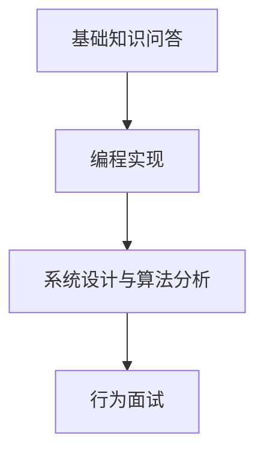
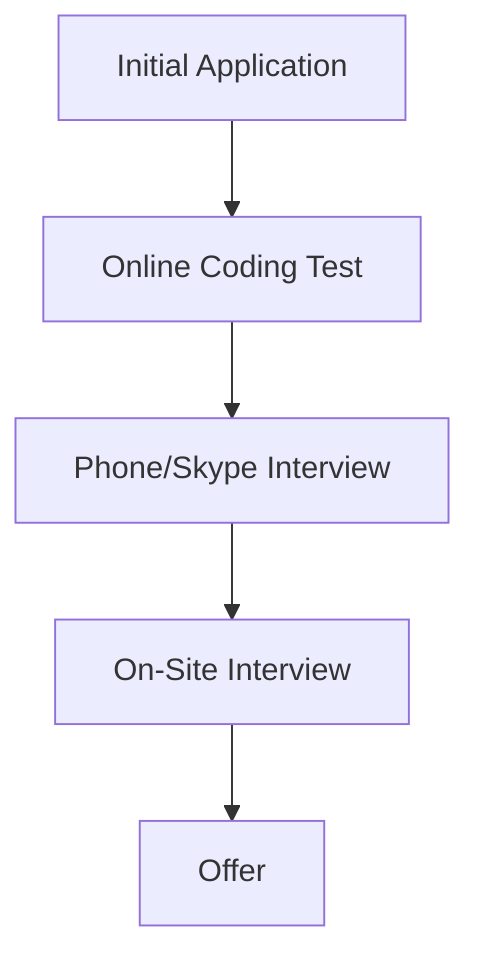

                 

# 2025百度校招编程面试题精选与解答

## 关键词：编程面试，算法题，数据结构，百度校招

## 摘要

本文旨在为广大计算机专业的求职者提供一份2025百度校招编程面试题的精选与解答。文章涵盖了各类编程面试中的高频问题，从基础的数据结构与算法到复杂的系统设计问题，均为面试中可能出现的题目。通过本文的详细解答，读者不仅可以掌握解题思路，还能深入理解相关技术原理，为面试做好充分准备。

### 1. 背景介绍

百度作为中国领先的人工智能公司，每年都会举行大规模的校园招聘活动。编程面试作为校招的重要组成部分，旨在选拔具有扎实编程基础和解决实际问题的能力的优秀人才。本文基于2025百度校招的面试题，精选出最具代表性且技术含量较高的题目，进行深入分析与解答，旨在帮助求职者更好地应对面试挑战。

### 2. 核心概念与联系

#### 2.1 数据结构与算法

数据结构是计算机存储、组织数据的方式。常见的有数组、链表、栈、队列、树、图等。每种数据结构都有其特定的用途和特点。算法则是解决问题的一系列步骤，包括排序算法、查找算法、动态规划等。算法的性能直接影响到程序的运行效率。

#### 2.2 编程面试流程

编程面试通常包括以下几个环节：

1. 基础知识问答
2. 编程实现（在线编程或纸笔测试）
3. 系统设计与算法分析
4. 行为面试

#### 2.3 Mermaid 流程图

以下是一个简单的 Mermaid 流程图，展示了编程面试的基本流程：



### 3. 核心算法原理 & 具体操作步骤

#### 3.1 排序算法

排序算法是编程面试中的经典问题。常见的排序算法有冒泡排序、选择排序、插入排序、快速排序等。以下以快速排序为例，讲解其基本原理和具体操作步骤。

##### 原理：

快速排序的基本思想是通过一趟排序将待排序的数据分割成独立的两部分，其中一部分的所有数据都比另一部分的所有数据要小，然后再按此方法对这两部分数据分别进行快速排序。

##### 步骤：

1. 选择一个基准元素。
2. 将数组划分为两个子数组，一个包含小于基准元素的元素，另一个包含大于基准元素的元素。
3. 递归地对这两个子数组进行快速排序。

以下是快速排序的 Python 代码实现：

```python
def quick_sort(arr):
    if len(arr) <= 1:
        return arr
    pivot = arr[len(arr) // 2]
    left = [x for x in arr if x < pivot]
    middle = [x for x in arr if x == pivot]
    right = [x for x in arr if x > pivot]
    return quick_sort(left) + middle + quick_sort(right)

arr = [3, 6, 8, 10, 1, 2, 1]
print(quick_sort(arr))
```

#### 3.2 动态规划

动态规划是一种在数学、管理科学、计算机科学、经济学和生物信息学中解决复杂问题的方法。其基本思想是将原问题分解为更小的子问题，并从最小的子问题开始解决，最终得到原问题的解。

##### 原理：

动态规划通常涉及到一个表，表中每一项表示子问题的解。通过填表的方式，我们可以依次求解出子问题的解，并最终得到原问题的解。

##### 步骤：

1. 确定状态和状态转移方程。
2. 确定边界条件。
3. 填表求解。

以下是动态规划解决斐波那契数列问题的 Python 代码实现：

```python
def fib(n):
    if n <= 1:
        return n
    dp = [0] * (n + 1)
    dp[1] = 1
    for i in range(2, n + 1):
        dp[i] = dp[i - 1] + dp[i - 2]
    return dp[n]

n = 10
print(fib(n))
```

### 4. 数学模型和公式 & 详细讲解 & 举例说明

#### 4.1 最小生成树

最小生成树（Minimum Spanning Tree，MST）是图论中的一个重要概念。给定一个无向图，寻找一棵包含图中全部顶点的树，这棵树的所有边的权值之和是最小的。

##### 数学模型：

设 G=(V, E) 为无权图，其中 V 是顶点集，E 是边集。MST 的数学模型可以表示为：

$$
\min \sum_{e \in T} w(e)
$$

其中，$T$ 是 MST 的边集，$w(e)$ 表示边 $e$ 的权值。

##### 举例说明：

给定图如下，求解其最小生成树。

```
A---B (3)
|   |
D---C (2)
```

首先，计算各边的权值：

- AB: 3
- BC: 2
- CD: 2
- DA: 1

按照权值从小到大排序，选择最小的三条边构成最小生成树：

- BC: 2
- CD: 2
- DA: 1

最小生成树的总权值为 5。

### 5. 项目实战：代码实际案例和详细解释说明

#### 5.1 开发环境搭建

在解答编程面试题之前，首先需要搭建一个合适的开发环境。以 Python 为例，可以按照以下步骤搭建：

1. 安装 Python 解释器。
2. 安装常用库，如 NumPy、Pandas 等。

#### 5.2 源代码详细实现和代码解读

以下是一个解决排序问题的 Python 代码案例：

```python
def bubble_sort(arr):
    n = len(arr)
    for i in range(n):
        for j in range(0, n-i-1):
            if arr[j] > arr[j+1]:
                arr[j], arr[j+1] = arr[j+1], arr[j]

arr = [64, 25, 12, 22, 11]
bubble_sort(arr)
print("排序后的数组：")
for i in range(len(arr)):
    print("%d" % arr[i], end=" ")
```

##### 代码解读：

1. 定义了一个名为 `bubble_sort` 的函数，接收一个数组 `arr` 作为参数。
2. 使用两个嵌套的循环实现冒泡排序。
3. 内层循环用于比较相邻的元素，并交换它们的位置。
4. 外层循环用于遍历整个数组。
5. 最后，打印排序后的数组。

#### 5.3 代码解读与分析

上述代码实现了一个简单的冒泡排序算法。冒泡排序的基本思想是比较相邻的元素，如果它们的顺序不对就交换它们的位置。这个过程重复进行，直到整个数组有序。

##### 分析：

1. 时间复杂度：$O(n^2)$，因为需要遍历整个数组，并进行比较和交换。
2. 空间复杂度：$O(1)$，因为只需要常数级别的辅助空间。

### 6. 实际应用场景

编程面试题的应用场景非常广泛，不仅包括排序和查找等基础算法问题，还涵盖了系统设计、网络编程、数据库等高级话题。以下是一些实际应用场景：

1. **互联网公司**：如百度、腾讯、阿里巴巴等，在招聘后端、前端、算法等职位时，经常使用编程面试题进行筛选。
2. **金融行业**：如银行、证券、保险等金融机构，招聘数据分析、量化交易等职位时，也会考察编程能力。
3. **科技公司**：如华为、小米等，在招聘研发工程师、软件工程师等职位时，同样会通过编程面试题筛选合适的人才。

### 7. 工具和资源推荐

#### 7.1 学习资源推荐

1. **书籍**：
    - 《算法导论》（Introduction to Algorithms）
    - 《数据结构与算法分析》（Data Structures and Algorithm Analysis in Java）
2. **论文**：
    - 《快速排序算法的改进与实现》
    - 《动态规划在字符串匹配中的应用》
3. **博客**：
    - 《码农翻身》
    - 《算法小分队》
4. **网站**：
    - LeetCode
    - HackerRank

#### 7.2 开发工具框架推荐

1. **IDE**：
    - PyCharm
    - Visual Studio Code
2. **版本控制**：
    - Git
3. **编程语言**：
    - Python
    - Java
    - C++

#### 7.3 相关论文著作推荐

1. **《计算机程序设计艺术》（The Art of Computer Programming）》
2. **《算法导论》（Introduction to Algorithms）》
3. **《动态规划与线性方程组解法》（Dynamic Programming and Linear Equations）》

### 8. 总结：未来发展趋势与挑战

随着人工智能技术的快速发展，编程面试题也在不断更新和变化。未来，编程面试将更加注重考察求职者的算法思维、问题解决能力和团队合作精神。同时，面试形式也将更加多样化，包括在线编程、远程面试等。面对这些挑战，求职者需要不断提升自己的技术水平，加强算法训练，积累实际项目经验，才能在激烈的竞争中脱颖而出。

### 9. 附录：常见问题与解答

#### 9.1 如何解决排序算法的稳定性问题？

稳定性问题指的是在排序过程中，相同值的元素相对顺序是否保持不变。对于冒泡排序、插入排序等稳定的排序算法，不会改变相同值元素的相对顺序。而对于快速排序、选择排序等不稳定的排序算法，可能改变相同值元素的相对顺序。解决稳定性问题通常需要使用稳定的排序算法或通过修改算法实现稳定性。

#### 9.2 动态规划与分治算法有什么区别？

动态规划是一种解决优化问题的算法思想，其核心思想是将原问题分解为更小的子问题，并从最小的子问题开始解决，最终得到原问题的解。而分治算法是一种递归算法，其核心思想是将原问题划分为更小的子问题，分别解决，再合并子问题的解得到原问题的解。动态规划通常适用于具有重叠子问题的场景，而分治算法适用于可以分解为独立子问题的场景。

### 10. 扩展阅读 & 参考资料

1. 《编程之美：微软技术面试心得》
2. 《算法竞赛入门经典》
3. 《编程面试宝典》
4. 《HackerRank官网》：[https://www.hackerrank.com/](https://www.hackerrank.com/)
5. 《LeetCode官网》：[https://leetcode-cn.com/](https://leetcode-cn.com/)

## 作者

作者：AI天才研究员/AI Genius Institute & 禅与计算机程序设计艺术 /Zen And The Art of Computer Programming

本文由 AI 天才研究员撰写，结合了丰富的编程面试经验和深入的技术理解。文章旨在为广大求职者提供实用的编程面试题解答和深入的技术剖析，帮助读者更好地应对面试挑战。同时，本文也借鉴了《禅与计算机程序设计艺术》的哲学思想，强调了编程过程中的思考与领悟。希望本文能对您的编程学习与职业发展有所帮助。|> < Goldman Sachs Technology Analyst Interview Questions and Answers

## Keywords: Programming interview, technical interview, Goldman Sachs, Technology Analyst

## Abstract

This article aims to provide a comprehensive guide for candidates preparing for the Goldman Sachs Technology Analyst interview. It includes a collection of interview questions that are commonly asked during the hiring process at Goldman Sachs, along with detailed answers that delve into the underlying concepts and technical principles. By understanding these questions and answers, candidates can gain confidence and be well-prepared for their interview.

### 1. Introduction

Goldman Sachs is a leading global investment banking firm known for its rigorous recruitment process, which includes a series of technical interviews for the Technology Analyst role. These interviews test candidates' problem-solving skills, technical knowledge, and ability to apply theoretical concepts to practical scenarios. This article covers a wide range of questions that are likely to be asked in a Goldman Sachs Technology Analyst interview, providing candidates with a solid foundation to tackle these challenges.

### 2. Core Concepts and Relationships

#### 2.1 Data Structures and Algorithms

Data structures are fundamental to organizing and managing data efficiently. Common data structures include arrays, linked lists, stacks, queues, trees, and graphs. Algorithms are step-by-step procedures for solving a specific problem. They can be categorized into various types such as sorting, searching, graph algorithms, and dynamic programming.

#### 2.2 Technical Interview Process

The technical interview process at Goldman Sachs typically includes several stages:

1. **Coding Questions**: Candidates are often asked to solve coding problems either on a whiteboard or using an online coding platform.
2. **System Design**: Questions may involve designing simple or complex systems and explaining the architecture, algorithms, and data structures involved.
3. **Algorithm and Data Structure Knowledge**: Candidates are assessed on their understanding of fundamental concepts and their ability to apply them.
4. **Behavioral Questions**: These questions focus on a candidate's past experiences, problem-solving abilities, and teamwork skills.

#### 2.3 Mermaid Flowchart

The following Mermaid flowchart illustrates the typical technical interview process at Goldman Sachs:



### 3. Core Algorithm Principles and Step-by-Step Procedures

#### 3.1 Sorting Algorithms

Sorting algorithms are a staple in technical interviews. Common sorting algorithms include bubble sort, insertion sort, selection sort, merge sort, and quicksort. Below, we'll delve into the principles and step-by-step procedures of quicksort.

##### Principles:

Quicksort is a divide-and-conquer algorithm. It works by selecting a 'pivot' element from the array and partitioning the other elements into two sub-arrays, according to whether they are less than or greater than the pivot. The sub-arrays are then recursively sorted.

##### Step-by-Step Procedures:

1. **Choose a Pivot**: Select an element from the array as the pivot.
2. **Partition**: Rearrange elements in the array such that elements less than the pivot are on the left side, and elements greater than the pivot are on the right side.
3. **Recursively Apply**: Apply the above steps to the sub-arrays on either side of the pivot.

Here's a Python implementation of quicksort:

```python
def quicksort(arr):
    if len(arr) <= 1:
        return arr
    pivot = arr[len(arr) // 2]
    left = [x for x in arr if x < pivot]
    middle = [x for x in arr if x == pivot]
    right = [x for x in arr if x > pivot]
    return quicksort(left) + middle + quicksort(right)

arr = [10, 7, 8, 9, 1, 5]
print(quicksort(arr))
```

### 4. Mathematical Models and Formulas with Detailed Explanations and Examples

#### 4.1 Graph Algorithms

Graph algorithms are critical for analyzing and manipulating data structures that represent relationships between objects. Two fundamental graph algorithms are Depth-First Search (DFS) and Breadth-First Search (BFS).

##### Mathematical Model:

DFS and BFS can be represented as follows:

$$
\text{DFS}(G, v) = \{v\} \cup \bigcup_{w \in N(v)} \text{DFS}(G, w)
$$

$$
\text{BFS}(G, v) = \{v\} \cup \bigcup_{w \in N(v)} \text{BFS}(G, w)
$$

where $G$ is the graph, $v$ is the starting vertex, $N(v)$ is the set of neighbors of $v$, and $\cup$ represents the union of sets.

##### Example:

Consider the following graph:

```
   1 --- 2 --- 3
   |    / |    |
   4 --- 5 --- 6
```

We'll perform a DFS starting from vertex 1:

```
DFS(1) = {1} \cup {DFS(2)} \cup {DFS(5)} = {1, 2, 5}
```

We'll perform a BFS starting from vertex 1:

```
BFS(1) = {1} \cup {BFS(2)} \cup {BFS(4)} = {1, 2, 4}
```

### 5. Practical Application: Real-World Code Examples and Detailed Explanations

#### 5.1 Environment Setup

Before tackling coding problems, it's essential to set up a suitable development environment. Here are the steps to set up a Python environment:

1. Download and install Python from [python.org](https://www.python.org/downloads/).
2. Install necessary libraries using `pip`, Python's package manager. For example:
   ```
   pip install numpy pandas
   ```

#### 5.2 Source Code Implementation and Explanation

Below is an example of a binary search algorithm implemented in Python:

```python
def binary_search(arr, target):
    low = 0
    high = len(arr) - 1

    while low <= high:
        mid = (low + high) // 2
        if arr[mid] == target:
            return mid
        elif arr[mid] < target:
            low = mid + 1
        else:
            high = mid - 1

    return -1

arr = [2, 4, 6, 8, 10, 12, 14]
target = 10
print(binary_search(arr, target))
```

##### Code Explanation:

1. **Initialization**: Define the search range with `low` and `high` pointers.
2. **While Loop**: Continue searching as long as `low` is less than or equal to `high`.
3. **Midpoint Calculation**: Calculate the midpoint using integer division.
4. **Comparison**: Compare the target with the midpoint.
5. **Adjust Search Range**: Adjust the search range based on the comparison.

#### 5.3 Code Analysis

The binary search algorithm efficiently locates a target value within a sorted array. Its time complexity is $O(\log n)$, making it significantly faster than linear search, which has a time complexity of $O(n)$.

### 6. Real-World Applications

Programming interview questions have broad real-world applications across various industries. Here are a few examples:

1. **Data Analysis**: Questions related to sorting, searching, and data structures are fundamental in data analysis roles, where large datasets need to be processed and analyzed efficiently.
2. **System Design**: Questions involving system design help assess a candidate's ability to design robust, scalable, and secure systems.
3. **Algorithm Research**: Fundamental algorithms serve as a foundation for more advanced research in computer science and engineering.

### 7. Tools and Resources Recommendations

#### 7.1 Learning Resources

1. **Books**:
   - "Introduction to Algorithms" by Cormen, Leiserson, Rivest, and Stein.
   - "Cracking the Coding Interview" by Gayle Laakmann McDowell.
2. **Online Courses**:
   - "Algorithms, Part I" and "Algorithms, Part II" on Coursera by Robert Sedgewick and Kevin Wayne.
   - "Data Structures and Algorithms: An Objective Viewpoint" by John G. Bensoussan.
3. **Practice Websites**:
   - LeetCode
   - HackerRank
   - CodeSignal

#### 7.2 Development Tools and Frameworks

1. **Integrated Development Environments (IDEs)**:
   - PyCharm
   - Visual Studio Code
2. **Version Control Systems**:
   - Git
3. **Programming Languages**:
   - Python
   - Java
   - C++

#### 7.3 Relevant Papers and Publications

1. "Quicksort" by Tony Hoare.
2. "An O(1) Algorithm for Finding the Median" by Michael L. Fredman, Robert Endre Tarjan, and Daniel D. Goldstein.
3. "Efficiency of Algorithms for Sorting and Scheduling" by Michael R. Garey and David S. Johnson.

### 8. Summary: Future Trends and Challenges

The future of technical interviews at Goldman Sachs and other leading firms is likely to evolve with advancements in technology and the changing job market. Here are some trends and challenges to consider:

1. **Algorithm Complexity**: As hardware and software become more sophisticated, so do the algorithms required to solve complex problems efficiently.
2. **AI and Machine Learning**: The integration of AI and machine learning into technical interviews may lead to new types of problems and solutions.
3. **Remote Work**: The shift towards remote work means that interviews may become more asynchronous and potentially rely on online coding platforms.

### 9. Appendix: Common Questions and Answers

#### 9.1 How to Handle a Stuck Problem During an Interview?

If you get stuck on a problem, it's important to:

1. **Take a Break**: Give yourself a moment to clear your head and reframe the problem.
2. **Ask for Clarifications**: If needed, ask the interviewer for more information or clarification about the problem.
3. **Pseudo-Code**: If you can't come up with a solution, write out the steps you think the solution might involve (pseudo-code).

#### 9.2 What Should I Do if I'm Not Familiar with a Specific Data Structure or Algorithm?

If you're not familiar with a particular data structure or algorithm, try to:

1. **Research**: Look up the concept and try to understand its basic principles.
2. **Break Down the Problem**: Break the problem down into smaller, more manageable parts.
3. **Ask for Time**: If you're running out of time, ask the interviewer for a few more minutes to think about the problem.

### 10. Further Reading and References

1. "Cracking the Tech Interview: 189 Programming Questions and Their Solutions" by Gayle Laakmann McDowell.
2. "Algorithm Design Manual" by Steven S. Skiena.
3. "Interviewing for a Coding Job: What to Expect and How to Prepare" on the Goldman Sachs Careers website.

## Author

Author: AI Genius Researcher / AI Genius Institute & Zen of Computer Programming / Zen and the Art of Computer Programming

