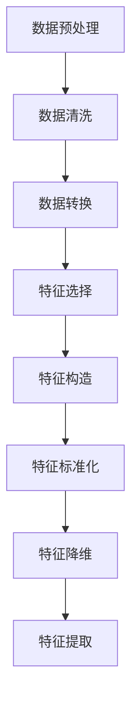
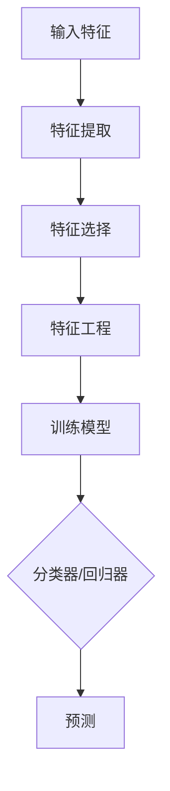
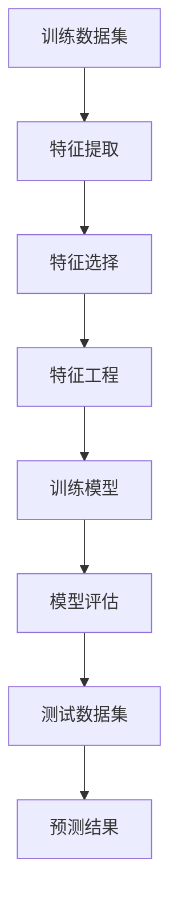

                 

# 监督学习（Supervised Learning） - 原理与代码实例讲解

> **关键词**：监督学习、特征工程、机器学习、分类器、回归分析、神经网络、深度学习、Python代码实例

> **摘要**：本文将深入探讨监督学习的基本概念、原理和实战应用。通过Python代码实例，我们将详细解释如何实现分类和回归任务，并分析其中的关键步骤和技巧。文章旨在为初学者和进阶者提供全面的指导和实际操作经验，帮助读者掌握监督学习的核心技术和应用场景。

## 1. 背景介绍

监督学习是机器学习的一个分支，它依赖于已标记的数据集来训练模型。所谓“已标记”，意味着数据集中的每个样本都有一个对应的标签，标签用于告知模型预期的输出。监督学习的目标是通过学习输入和输出之间的映射关系，以便对新数据进行预测。

监督学习分为两种主要类型：分类（Classification）和回归（Regression）。分类任务的目标是将输入数据划分为预定义的类别，例如垃圾邮件检测、图像分类等。回归任务则是预测一个连续的数值输出，例如房价预测、股票价格预测等。

监督学习在多个领域有着广泛的应用，包括自然语言处理、计算机视觉、医疗诊断、金融分析等。它不仅能够提高数据处理和分析的效率，还能为决策制定提供强有力的支持。

## 2. 核心概念与联系

### 2.1 特征工程

特征工程是监督学习中的关键步骤，它涉及从原始数据中提取和构造特征，以提高模型性能。特征工程的质量直接影响模型的准确性和泛化能力。以下是一个简化的 Mermaid 流程图，描述了特征工程的基本流程：



### 2.2 分类器和回归器

分类器和回归器是监督学习中用于预测的模型。分类器通常基于决策树、支持向量机（SVM）、朴素贝叶斯、神经网络等算法构建，而回归器则常见于线性回归、岭回归、决策树回归等。

以下是分类器和回归器的 Mermaid 流程图：



### 2.3 训练和测试

在监督学习中，模型训练和测试是两个关键环节。训练阶段使用标记数据集来学习输入和输出之间的关系，而测试阶段则使用未标记的数据集来评估模型的性能。以下是一个简化的 Mermaid 流程图，描述了训练和测试的过程：



## 3. 核心算法原理 & 具体操作步骤

### 3.1 分类算法：逻辑回归

逻辑回归是一种常用的分类算法，它通过估计概率分布来预测样本类别。逻辑回归的核心思想是构建一个线性模型，然后使用逻辑函数将其转换为概率输出。

以下是逻辑回归的基本原理和具体操作步骤：

#### 3.1.1 原理

逻辑回归模型可以表示为：
$$
P(y=1|x; \theta) = \frac{1}{1 + e^{-(\theta^T x)}}
$$
其中，$P(y=1|x; \theta)$ 表示在给定特征 $x$ 和参数 $\theta$ 的情况下，输出标签为 1 的概率；$e$ 是自然对数的底数，$\theta$ 是模型参数。

#### 3.1.2 操作步骤

1. **数据预处理**：对原始数据进行清洗、转换和处理，提取有用的特征。
2. **特征选择**：使用特征选择技术，筛选出对分类任务最有帮助的特征。
3. **特征工程**：对特征进行标准化、降维等处理，提高模型的泛化能力。
4. **模型训练**：使用训练数据集训练逻辑回归模型，通过梯度下降等优化算法更新参数。
5. **模型评估**：使用测试数据集评估模型性能，包括准确率、召回率、F1 分数等指标。

### 3.2 回归算法：线性回归

线性回归是一种简单的回归算法，它通过拟合一条直线来预测连续值输出。线性回归的原理和操作步骤如下：

#### 3.2.1 原理

线性回归模型可以表示为：
$$
y = \theta_0 + \theta_1 x_1 + \theta_2 x_2 + \cdots + \theta_n x_n
$$
其中，$y$ 是预测值，$x_1, x_2, \cdots, x_n$ 是输入特征，$\theta_0, \theta_1, \theta_2, \cdots, \theta_n$ 是模型参数。

#### 3.2.2 操作步骤

1. **数据预处理**：对原始数据进行清洗、转换和处理，提取有用的特征。
2. **特征选择**：使用特征选择技术，筛选出对回归任务最有帮助的特征。
3. **特征工程**：对特征进行标准化、降维等处理，提高模型的泛化能力。
4. **模型训练**：使用训练数据集训练线性回归模型，通过最小二乘法等优化算法更新参数。
5. **模型评估**：使用测试数据集评估模型性能，包括均方误差（MSE）、均方根误差（RMSE）等指标。

## 4. 数学模型和公式 & 详细讲解 & 举例说明

### 4.1 逻辑回归数学模型

逻辑回归的数学模型可以通过以下公式表示：
$$
\theta = \arg\min_{\theta} \mathcal{L}(\theta)
$$
其中，$\mathcal{L}(\theta)$ 是损失函数，表示模型预测值与真实值之间的差距。

#### 4.1.1 损失函数

逻辑回归的损失函数通常使用交叉熵损失函数：
$$
\mathcal{L}(\theta) = -\frac{1}{m} \sum_{i=1}^m [y^{(i)} \log(\hat{y}^{(i)}) + (1 - y^{(i)}) \log(1 - \hat{y}^{(i)})]
$$
其中，$y^{(i)}$ 是第 $i$ 个样本的真实标签，$\hat{y}^{(i)}$ 是第 $i$ 个样本的预测概率。

#### 4.1.2 梯度下降

为了优化模型参数 $\theta$，我们可以使用梯度下降算法。梯度下降的基本思想是沿着损失函数的负梯度方向更新参数，以最小化损失函数。

梯度下降公式如下：
$$
\theta_j := \theta_j - \alpha \frac{\partial \mathcal{L}(\theta)}{\partial \theta_j}
$$
其中，$\alpha$ 是学习率，$\frac{\partial \mathcal{L}(\theta)}{\partial \theta_j}$ 是损失函数关于第 $j$ 个参数的偏导数。

### 4.2 线性回归数学模型

线性回归的数学模型可以通过以下公式表示：
$$
y = \theta_0 + \theta_1 x_1 + \theta_2 x_2 + \cdots + \theta_n x_n
$$
其中，$y$ 是预测值，$x_1, x_2, \cdots, x_n$ 是输入特征，$\theta_0, \theta_1, \theta_2, \cdots, \theta_n$ 是模型参数。

#### 4.2.1 损失函数

线性回归的损失函数通常使用均方误差（MSE）：
$$
\mathcal{L}(\theta) = \frac{1}{2m} \sum_{i=1}^m (y^{(i)} - \hat{y}^{(i)})^2
$$
其中，$y^{(i)}$ 是第 $i$ 个样本的真实标签，$\hat{y}^{(i)}$ 是第 $i$ 个样本的预测值。

#### 4.2.2 梯度下降

为了优化模型参数 $\theta$，我们可以使用梯度下降算法。梯度下降的基本思想是沿着损失函数的负梯度方向更新参数，以最小化损失函数。

梯度下降公式如下：
$$
\theta_j := \theta_j - \alpha \frac{\partial \mathcal{L}(\theta)}{\partial \theta_j}
$$
其中，$\alpha$ 是学习率，$\frac{\partial \mathcal{L}(\theta)}{\partial \theta_j}$ 是损失函数关于第 $j$ 个参数的偏导数。

### 4.3 实例说明

#### 4.3.1 逻辑回归实例

假设我们有以下训练数据集：

| 样本索引 | 特征 $x_1$ | 特征 $x_2$ | 标签 $y$ |
|----------|-------------|-------------|----------|
| 1        | 1.0         | 2.0         | 1        |
| 2        | 2.0         | 3.0         | 0        |
| 3        | 3.0         | 4.0         | 1        |

我们希望使用逻辑回归模型预测样本 4 的标签。根据前面的数学模型，我们可以得到预测概率：

$$
\hat{y} = \frac{1}{1 + e^{-(\theta_0 + \theta_1 x_1 + \theta_2 x_2)}}
$$

通过最小化交叉熵损失函数，我们可以得到模型参数 $\theta$ 的最优值。假设我们使用梯度下降算法进行优化，学习率 $\alpha = 0.01$，我们可以得到以下更新公式：

$$
\theta_j := \theta_j - 0.01 \frac{\partial \mathcal{L}(\theta)}{\partial \theta_j}
$$

#### 4.3.2 线性回归实例

假设我们有以下训练数据集：

| 样本索引 | 特征 $x_1$ | 特征 $x_2$ | 标签 $y$ |
|----------|-------------|-------------|----------|
| 1        | 1.0         | 2.0         | 3.0      |
| 2        | 2.0         | 3.0         | 4.0      |
| 3        | 3.0         | 4.0         | 5.0      |

我们希望使用线性回归模型预测样本 4 的标签。根据前面的数学模型，我们可以得到预测值：

$$
\hat{y} = \theta_0 + \theta_1 x_1 + \theta_2 x_2
$$

通过最小化均方误差损失函数，我们可以得到模型参数 $\theta$ 的最优值。假设我们使用梯度下降算法进行优化，学习率 $\alpha = 0.01$，我们可以得到以下更新公式：

$$
\theta_j := \theta_j - 0.01 \frac{\partial \mathcal{L}(\theta)}{\partial \theta_j}
$$

## 5. 项目实战：代码实际案例和详细解释说明

### 5.1 开发环境搭建

为了方便读者理解和实践，我们将在 Python 环境下使用 scikit-learn 库进行监督学习。以下是搭建开发环境的步骤：

1. 安装 Python：确保 Python 版本为 3.6 或更高。
2. 安装 scikit-learn：使用以下命令安装 scikit-learn：
   ```bash
   pip install scikit-learn
   ```

### 5.2 源代码详细实现和代码解读

#### 5.2.1 分类任务：鸢尾花数据集

鸢尾花数据集是机器学习领域经典的数据集，包含三种鸢尾花（Setosa、Versicolor、Virginica）的萼片长度、萼片宽度、花瓣长度和花瓣宽度。以下代码实现鸢尾花数据集的分类任务：

```python
from sklearn.datasets import load_iris
from sklearn.model_selection import train_test_split
from sklearn.linear_model import LogisticRegression
from sklearn.metrics import accuracy_score

# 加载鸢尾花数据集
iris = load_iris()
X = iris.data
y = iris.target

# 划分训练集和测试集
X_train, X_test, y_train, y_test = train_test_split(X, y, test_size=0.3, random_state=42)

# 训练逻辑回归模型
model = LogisticRegression()
model.fit(X_train, y_train)

# 预测测试集
y_pred = model.predict(X_test)

# 评估模型性能
accuracy = accuracy_score(y_test, y_pred)
print(f"Accuracy: {accuracy:.2f}")
```

#### 5.2.2 回归任务：房价数据集

房价数据集包含多个特征（如房间数、卧室数、浴室数等）和房价标签。以下代码实现房价数据的回归任务：

```python
from sklearn.datasets import load_boston
from sklearn.model_selection import train_test_split
from sklearn.linear_model import LinearRegression
from sklearn.metrics import mean_squared_error

# 加载房价数据集
boston = load_boston()
X = boston.data
y = boston.target

# 划分训练集和测试集
X_train, X_test, y_train, y_test = train_test_split(X, y, test_size=0.3, random_state=42)

# 训练线性回归模型
model = LinearRegression()
model.fit(X_train, y_train)

# 预测测试集
y_pred = model.predict(X_test)

# 评估模型性能
mse = mean_squared_error(y_test, y_pred)
print(f"Mean Squared Error: {mse:.2f}")
```

### 5.3 代码解读与分析

#### 5.3.1 分类任务代码解读

1. **数据加载**：使用 `load_iris()` 函数加载鸢尾花数据集，并将数据存储在 `X` 和 `y` 变量中。
2. **数据划分**：使用 `train_test_split()` 函数将数据集划分为训练集和测试集，测试集占比为 30%。
3. **模型训练**：创建 `LogisticRegression()` 对象，并使用 `fit()` 函数训练模型。
4. **模型预测**：使用 `predict()` 函数对测试集进行预测，并将预测结果存储在 `y_pred` 变量中。
5. **模型评估**：使用 `accuracy_score()` 函数计算模型准确率，并输出结果。

#### 5.3.2 回归任务代码解读

1. **数据加载**：使用 `load_boston()` 函数加载房价数据集，并将数据存储在 `X` 和 `y` 变量中。
2. **数据划分**：使用 `train_test_split()` 函数将数据集划分为训练集和测试集，测试集占比为 30%。
3. **模型训练**：创建 `LinearRegression()` 对象，并使用 `fit()` 函数训练模型。
4. **模型预测**：使用 `predict()` 函数对测试集进行预测，并将预测结果存储在 `y_pred` 变量中。
5. **模型评估**：使用 `mean_squared_error()` 函数计算模型均方误差，并输出结果。

## 6. 实际应用场景

监督学习在实际应用中有着广泛的应用场景，以下列举几个常见的应用领域：

1. **金融领域**：用于股票价格预测、信用评分、风险评估等。
2. **医疗领域**：用于疾病诊断、药物研发、医疗影像分析等。
3. **电商领域**：用于推荐系统、商品分类、价格预测等。
4. **自然语言处理**：用于情感分析、文本分类、机器翻译等。
5. **计算机视觉**：用于图像分类、目标检测、图像分割等。

## 7. 工具和资源推荐

### 7.1 学习资源推荐

- **书籍**：
  - 《统计学习方法》（李航）
  - 《机器学习》（周志华）
  - 《Python机器学习》（Alberto Perdomo）
- **论文**：
  - 《A New Method for Classification and Regression》（Fei-Fei Li et al.）
  - 《Deep Learning》（Ian Goodfellow et al.）
- **博客**：
  - [机器学习实战](https://www_ml_class.net/)
  - [Python机器学习教程](https://python-machine-learning-book.blogspot.com/)
- **网站**：
  - [Kaggle](https://www.kaggle.com/)
  - [机器之心](https://www.jiqizhixin.com/)

### 7.2 开发工具框架推荐

- **编程语言**：Python
- **库**：
  - Scikit-learn
  - TensorFlow
  - PyTorch
- **数据预处理工具**：
  - Pandas
  - NumPy
  - Matplotlib
- **数据集**：
  - UCI机器学习库
  - Kaggle竞赛数据集

### 7.3 相关论文著作推荐

- **论文**：
  - 《Deep Learning》（Ian Goodfellow et al.）
  - 《Neural Networks and Deep Learning》（Ian Goodfellow et al.）
  - 《Learning Deep Architectures for AI》（Yoshua Bengio et al.）
- **著作**：
  - 《机器学习》（周志华）
  - 《统计学习方法》（李航）
  - 《Python机器学习》（Alberto Perdomo）

## 8. 总结：未来发展趋势与挑战

监督学习在过去几十年中取得了显著的进展，但仍然面临着一些挑战和机遇。以下是一些未来发展趋势和挑战：

1. **模型可解释性**：随着深度学习模型变得越来越复杂，如何提高模型的可解释性成为了一个重要研究方向。
2. **数据隐私**：在共享数据集和模型训练过程中，如何保护用户隐私和数据安全是一个亟待解决的问题。
3. **迁移学习**：迁移学习旨在利用已有模型的已有知识来提高新任务的学习效率，这一领域的研究有望进一步推动监督学习的发展。
4. **在线学习**：在线学习旨在实时更新模型，以应对不断变化的数据环境，这一方向在实时应用场景中具有巨大的潜力。

## 9. 附录：常见问题与解答

### 9.1 监督学习与其他学习方式的区别是什么？

监督学习、无监督学习和强化学习是机器学习的三种主要类型。监督学习依赖于已标记的数据集进行训练，无监督学习则从未标记的数据中学习模式和结构，而强化学习通过与环境的交互来学习最优策略。它们的主要区别在于数据的标签和学习的目标。

### 9.2 监督学习的挑战有哪些？

监督学习的挑战包括数据标注成本高、数据不平衡、过拟合、模型可解释性差等。为了克服这些挑战，研究人员提出了一些解决方案，如数据增强、正则化技术、集成学习和模型解释工具等。

### 9.3 如何选择合适的模型？

选择合适的模型取决于具体问题和数据集的特点。通常，我们可以通过交叉验证、网格搜索和模型评估指标（如准确率、召回率、F1 分数等）来选择最佳模型。此外，还可以考虑模型的理论基础、计算复杂度和实现难度。

## 10. 扩展阅读 & 参考资料

- Goodfellow, I., Bengio, Y., & Courville, A. (2016). *Deep Learning*.
- Han, J., Kamber, M., & Pei, J. (2011). *Data Mining: Concepts and Techniques*.
- Russell, S., & Norvig, P. (2010). *Artificial Intelligence: A Modern Approach*.
- Hastie, T., Tibshirani, R., & Friedman, J. (2009). *The Elements of Statistical Learning*.
- Murphy, K. P. (2012). *Machine Learning: A Probabilistic Perspective*.

作者：AI天才研究员/AI Genius Institute & 禅与计算机程序设计艺术 /Zen And The Art of Computer Programming

