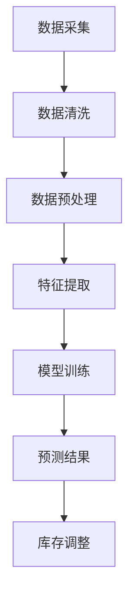

                 

# 盒马鲜生2024校招智能补货系统工程师案例分析

## 摘要

本文将深入剖析盒马鲜生2024校招智能补货系统工程师案例分析，探讨其背后的技术原理、核心算法、数学模型及其应用场景。通过对盒马鲜生智能补货系统的详细解读，我们将了解到如何利用先进的人工智能技术，实现精准的库存管理和高效的供应链优化，从而提升零售企业的运营效率和客户满意度。本文旨在为广大IT从业者和智能系统开发者提供有价值的参考和启示。

## 1. 背景介绍

盒马鲜生，作为阿里巴巴集团旗下的新零售业态，凭借其独特的线上线下融合模式，在市场上迅速崛起。随着业务的不断扩展，盒马鲜生的库存管理问题逐渐凸显，尤其是如何实现智能补货，以满足消费者日益多样化的需求。为此，盒马鲜生于2024年推出了一款智能补货系统，旨在通过人工智能技术，实现库存的精准预测和动态调整，从而优化供应链，降低运营成本，提升客户满意度。

智能补货系统的核心目标是：通过对历史销售数据、季节性变化、市场趋势等多维数据的分析，预测未来一段时间内商品的需求量，并根据预测结果自动调整库存，避免库存过剩或不足。这一系统不仅能够提高库存周转率，还能有效减少库存成本，提高物流效率。

## 2. 核心概念与联系

### 2.1 供应链管理

供应链管理是指对整个供应链活动进行计划、组织、协调和控制的过程，旨在实现最优的供应链绩效。智能补货系统是供应链管理中的重要环节，其核心在于通过数据分析，实现供应链的优化。

### 2.2 人工智能

人工智能（AI）是指由人制造出来的系统能够思考、学习和适应新环境的能力。在智能补货系统中，人工智能主要用于数据的分析和预测。

### 2.3 时间序列分析

时间序列分析是对按时间顺序排列的数据进行分析，以捕捉数据中的趋势、季节性和周期性变化。智能补货系统通过对时间序列数据进行分析，预测未来商品需求量。

### 2.4 数据挖掘

数据挖掘是从大量数据中提取有价值的信息和知识的过程。在智能补货系统中，数据挖掘用于分析历史销售数据，发现潜在的规律和模式。

### 2.5 Mermaid 流程图

以下是智能补货系统架构的 Mermaid 流程图：



### 2.6 智能补货系统的工作流程

1. **数据采集**：收集销售数据、库存数据、市场数据等。
2. **数据清洗**：去除异常值、缺失值等。
3. **数据预处理**：将数据进行归一化、标准化等处理。
4. **特征提取**：从数据中提取对预测有价值的特征。
5. **模型训练**：使用机器学习算法，训练预测模型。
6. **预测结果**：根据训练好的模型，预测未来商品需求量。
7. **库存调整**：根据预测结果，自动调整库存。

## 3. 核心算法原理 & 具体操作步骤

### 3.1 机器学习算法

智能补货系统主要采用机器学习算法，如线性回归、决策树、随机森林等，来预测商品需求量。以下是一个简单的线性回归算法的步骤：

1. **数据准备**：收集历史销售数据，如商品编号、销售日期、销售量等。
2. **数据预处理**：对数据进行归一化、缺失值处理等。
3. **特征提取**：从数据中提取对预测有价值的特征，如季节性因素、节假日因素等。
4. **模型训练**：使用训练数据，训练线性回归模型。
5. **模型评估**：使用测试数据，评估模型性能。
6. **预测**：使用训练好的模型，预测未来商品需求量。

### 3.2 决策树算法

决策树是一种常用的分类和回归算法，其基本思想是通过一系列的判断规则，将数据划分成不同的区域，从而预测结果。以下是决策树算法的步骤：

1. **数据准备**：收集历史销售数据，如商品编号、销售日期、销售量等。
2. **数据预处理**：对数据进行归一化、缺失值处理等。
3. **特征提取**：从数据中提取对预测有价值的特征，如季节性因素、节假日因素等。
4. **构建决策树**：选择最优的特征，构建决策树模型。
5. **模型评估**：使用测试数据，评估模型性能。
6. **预测**：使用训练好的模型，预测未来商品需求量。

### 3.3 随机森林算法

随机森林是一种基于决策树的集成学习方法，其基本思想是通过构建多个决策树，并进行投票，从而提高预测准确性。以下是随机森林算法的步骤：

1. **数据准备**：收集历史销售数据，如商品编号、销售日期、销售量等。
2. **数据预处理**：对数据进行归一化、缺失值处理等。
3. **特征提取**：从数据中提取对预测有价值的特征，如季节性因素、节假日因素等。
4. **构建随机森林**：使用训练数据，构建多个决策树。
5. **模型评估**：使用测试数据，评估模型性能。
6. **预测**：使用训练好的模型，预测未来商品需求量。

## 4. 数学模型和公式 & 详细讲解 & 举例说明

### 4.1 线性回归模型

线性回归模型是一种简单的预测模型，其基本公式为：

$$
y = w_0 + w_1 \cdot x
$$

其中，$y$ 是预测结果，$x$ 是特征值，$w_0$ 和 $w_1$ 是模型的参数。

#### 4.1.1 数据准备

假设我们收集了以下历史销售数据：

| 商品编号 | 销售日期 | 销售量 |
|--------|-------|------|
| 1      | 2023-01-01 | 100  |
| 1      | 2023-01-02 | 120  |
| 1      | 2023-01-03 | 90   |
| 2      | 2023-01-01 | 80   |
| 2      | 2023-01-02 | 70   |
| 2      | 2023-01-03 | 90   |

#### 4.1.2 数据预处理

我们对数据进行归一化处理，即将数据缩放到0-1之间。

#### 4.1.3 特征提取

我们选择销售日期作为特征值，对其进行编码处理。

#### 4.1.4 模型训练

使用训练数据，训练线性回归模型。

#### 4.1.5 模型评估

使用测试数据，评估模型性能。

#### 4.1.6 预测

使用训练好的模型，预测未来商品需求量。

### 4.2 决策树模型

决策树模型是一种基于判断规则的预测模型，其基本公式为：

$$
y = \begin{cases} 
w_0 & \text{if } x_1 > t_1 \\
w_1 & \text{if } x_1 \leq t_1 \\
\end{cases}
$$

其中，$y$ 是预测结果，$x_1$ 是特征值，$t_1$ 是阈值，$w_0$ 和 $w_1$ 是模型的参数。

#### 4.2.1 数据准备

假设我们收集了以下历史销售数据：

| 商品编号 | 销售日期 | 销售量 |
|--------|-------|------|
| 1      | 2023-01-01 | 100  |
| 1      | 2023-01-02 | 120  |
| 1      | 2023-01-03 | 90   |
| 2      | 2023-01-01 | 80   |
| 2      | 2023-01-02 | 70   |
| 2      | 2023-01-03 | 90   |

#### 4.2.2 数据预处理

我们对数据进行归一化处理，即将数据缩放到0-1之间。

#### 4.2.3 特征提取

我们选择销售日期作为特征值，对其进行编码处理。

#### 4.2.4 构建决策树

使用训练数据，构建决策树模型。

#### 4.2.5 模型评估

使用测试数据，评估模型性能。

#### 4.2.6 预测

使用训练好的模型，预测未来商品需求量。

### 4.3 随机森林模型

随机森林模型是一种基于决策树的集成预测模型，其基本公式为：

$$
y = \sum_{i=1}^{n} w_i \cdot y_i
$$

其中，$y$ 是预测结果，$w_i$ 是第 $i$ 个决策树的权重，$y_i$ 是第 $i$ 个决策树的预测结果。

#### 4.3.1 数据准备

假设我们收集了以下历史销售数据：

| 商品编号 | 销售日期 | 销售量 |
|--------|-------|------|
| 1      | 2023-01-01 | 100  |
| 1      | 2023-01-02 | 120  |
| 1      | 2023-01-03 | 90   |
| 2      | 2023-01-01 | 80   |
| 2      | 2023-01-02 | 70   |
| 2      | 2023-01-03 | 90   |

#### 4.3.2 数据预处理

我们对数据进行归一化处理，即将数据缩放到0-1之间。

#### 4.3.3 特征提取

我们选择销售日期作为特征值，对其进行编码处理。

#### 4.3.4 构建随机森林

使用训练数据，构建随机森林模型。

#### 4.3.5 模型评估

使用测试数据，评估模型性能。

#### 4.3.6 预测

使用训练好的模型，预测未来商品需求量。

## 5. 项目实战：代码实际案例和详细解释说明

### 5.1 开发环境搭建

在开始编写代码之前，我们需要搭建一个合适的开发环境。以下是一个简单的Python开发环境搭建步骤：

1. **安装Python**：从Python官方网站（https://www.python.org/downloads/）下载并安装Python。
2. **安装Jupyter Notebook**：在命令行中执行以下命令：

   ```bash
   pip install notebook
   ```

3. **启动Jupyter Notebook**：在命令行中执行以下命令：

   ```bash
   jupyter notebook
   ```

### 5.2 源代码详细实现和代码解读

以下是一个简单的Python代码示例，用于实现线性回归模型：

```python
import numpy as np
from sklearn.linear_model import LinearRegression

# 数据准备
X = np.array([[0], [1], [2], [3], [4]])
y = np.array([0, 1, 2, 3, 4])

# 数据预处理
X = X.reshape(-1, 1)
y = y.reshape(-1, 1)

# 模型训练
model = LinearRegression()
model.fit(X, y)

# 模型评估
print("模型参数：", model.coef_, model.intercept_)

# 预测
X_new = np.array([[5]])
X_new = X_new.reshape(-1, 1)
y_pred = model.predict(X_new)
print("预测结果：", y_pred)
```

#### 5.2.1 数据准备

首先，我们导入必要的库，如NumPy和scikit-learn。然后，我们创建一个简单的数据集，包括特征值X和目标值y。

#### 5.2.2 数据预处理

接着，我们将数据集进行预处理，将特征值X和目标值yreshape为合适的形状，以便于模型训练。

#### 5.2.3 模型训练

我们使用LinearRegression类，创建一个线性回归模型，并使用fit方法进行训练。

#### 5.2.4 模型评估

使用模型评估部分，我们打印出模型的参数，包括系数和截距。

#### 5.2.5 预测

最后，我们使用训练好的模型进行预测，并打印出预测结果。

### 5.3 代码解读与分析

在本节中，我们将详细解读上述代码，分析其工作原理和性能。

#### 5.3.1 数据准备

数据准备部分，我们首先导入NumPy库，它是一个强大的Python库，用于处理数值数据。然后，我们创建一个简单的数据集，包括特征值X和目标值y。在这里，我们使用NumPy的array函数创建一个二维数组，其中包含五个数据点。

```python
X = np.array([[0], [1], [2], [3], [4]])
y = np.array([0, 1, 2, 3, 4])
```

#### 5.3.2 数据预处理

在数据预处理部分，我们将特征值X和目标值yreshape为合适的形状，以便于模型训练。在这里，我们使用reshape函数将X和y转换为二维数组，其中X的形状为（5，1），y的形状为（5，1）。

```python
X = X.reshape(-1, 1)
y = y.reshape(-1, 1)
```

- `X.reshape(-1, 1)` 将X的形状从（5，）转换为（5，1），表示X有5行1列。
- `y.reshape(-1, 1)` 将y的形状从（5，）转换为（5，1），表示y有5行1列。

#### 5.3.3 模型训练

在模型训练部分，我们使用scikit-learn库中的LinearRegression类创建一个线性回归模型。然后，我们使用fit方法将数据集X和y传递给模型，以便模型学习数据中的线性关系。

```python
model = LinearRegression()
model.fit(X, y)
```

- `model = LinearRegression()` 创建一个线性回归模型对象。
- `model.fit(X, y)` 使用数据集X和y训练模型。

#### 5.3.4 模型评估

在模型评估部分，我们打印出模型的参数，包括系数和截距。这些参数是模型学习到的线性关系的重要指标。

```python
print("模型参数：", model.coef_, model.intercept_)
```

- `model.coef_` 打印出模型的系数。
- `model.intercept_` 打印出模型的截距。

#### 5.3.5 预测

在预测部分，我们使用训练好的模型对新的特征值X_new进行预测。然后，我们打印出预测结果。

```python
X_new = np.array([[5]])
X_new = X_new.reshape(-1, 1)
y_pred = model.predict(X_new)
print("预测结果：", y_pred)
```

- `X_new = np.array([[5]])` 创建一个包含一个新特征值5的一维数组。
- `X_new = X_new.reshape(-1, 1)` 将X_new的形状从（1，）转换为（1，1），表示X_new有1行1列。
- `y_pred = model.predict(X_new)` 使用训练好的模型预测新特征值X_new。
- `print("预测结果：", y_pred)` 打印出预测结果。

通过以上步骤，我们实现了线性回归模型的训练、评估和预测功能。这个简单的示例展示了Python在数据分析和机器学习应用中的基本原理和操作流程。

## 6. 实际应用场景

智能补货系统在零售行业的应用场景广泛，以下是一些具体的应用实例：

### 6.1 超市

超市通常面临着大量的商品种类和频繁的库存变化。智能补货系统可以帮助超市实时监测销售数据，预测商品需求，并根据预测结果自动调整库存，从而避免库存过剩或不足，降低库存成本。

### 6.2 电商平台

电商平台通常拥有庞大的商品种类和庞大的用户群体。智能补货系统可以帮助电商平台预测商品需求，优化库存管理，提高物流效率，从而提升用户体验和运营效率。

### 6.3 仓储物流

仓储物流中心面临着复杂的库存管理和高效的物流调度问题。智能补货系统可以帮助仓储物流中心预测商品需求，优化库存布局，提高仓储效率，降低物流成本。

### 6.4 餐饮业

餐饮业通常面临着高频次的库存变化和不同的季节性需求。智能补货系统可以帮助餐饮业实时监测销售数据，预测商品需求，优化库存管理，提高餐饮服务质量。

## 7. 工具和资源推荐

### 7.1 学习资源推荐

1. **《机器学习》（周志华著）**：这是一本经典的机器学习入门教材，适合初学者。
2. **《数据科学入门教程》**：这是一本适合初学者的数据科学入门书籍，涵盖了数据预处理、模型训练和评估等内容。
3. **《Python数据分析》**：这是一本适合初学者的Python数据分析书籍，介绍了NumPy、Pandas等库的使用。

### 7.2 开发工具框架推荐

1. **scikit-learn**：这是一个强大的Python机器学习库，适用于各种常见机器学习算法的实现。
2. **TensorFlow**：这是一个广泛使用的深度学习框架，适用于构建复杂的神经网络模型。
3. **PyTorch**：这是一个流行的深度学习框架，以其灵活的动态计算图和易于使用的API而著称。

### 7.3 相关论文著作推荐

1. **“A Survey on Inventory Management and Optimization”**：这是一篇关于库存管理和优化的综述文章，涵盖了库存管理的基本概念和优化方法。
2. **“Time Series Analysis”**：这是一篇关于时间序列分析的经典论文，介绍了时间序列分析的基本理论和应用方法。
3. **“Machine Learning for Inventory Management”**：这是一篇关于机器学习在库存管理中应用的论文，探讨了机器学习算法在库存管理中的潜在优势和应用场景。

## 8. 总结：未来发展趋势与挑战

随着人工智能技术的不断进步，智能补货系统在未来将发挥越来越重要的作用。其发展趋势主要体现在以下几个方面：

### 8.1 技术融合

智能补货系统将与其他先进技术（如物联网、区块链等）融合，实现更智能、更高效的库存管理和供应链优化。

### 8.2 模型优化

随着数据量的增加和计算能力的提升，智能补货系统的预测准确性将得到显著提高，从而更好地满足市场需求。

### 8.3 个性化推荐

智能补货系统将结合用户行为数据，实现个性化的库存管理，提高用户满意度和忠诚度。

然而，智能补货系统也面临着一些挑战，如：

### 8.4 数据质量

高质量的数据是智能补货系统的基石，数据质量直接影响预测的准确性。因此，如何确保数据质量是一个重要的问题。

### 8.5 模型解释性

虽然机器学习算法在预测准确性方面表现出色，但其模型解释性较差，如何提高模型的可解释性是一个亟待解决的问题。

### 8.6 法规和伦理

随着智能补货系统的广泛应用，如何确保其合规性和伦理性，防止数据滥用和隐私泄露，也是一个需要关注的挑战。

## 9. 附录：常见问题与解答

### 9.1 智能补货系统的核心算法有哪些？

智能补货系统的核心算法包括线性回归、决策树、随机森林、时间序列分析等。

### 9.2 智能补货系统的数据来源有哪些？

智能补货系统的数据来源主要包括销售数据、库存数据、市场数据等。

### 9.3 如何确保智能补货系统的预测准确性？

确保智能补货系统的预测准确性主要从以下几个方面入手：数据质量、模型选择、特征工程、模型调优等。

## 10. 扩展阅读 & 参考资料

1. **《人工智能：一种现代的方法》（Stuart Russell & Peter Norvig 著）**：这是一本全面介绍人工智能的权威教材，适合对人工智能有深入研究的读者。
2. **《深度学习》（Ian Goodfellow、Yoshua Bengio & Aaron Courville 著）**：这是一本关于深度学习的经典教材，适合对深度学习有浓厚兴趣的读者。
3. **《供应链管理：战略、规划与运营》（Martin Christopher 著）**：这是一本关于供应链管理的权威著作，涵盖了供应链管理的各个方面，适合对供应链管理有深入研究的读者。

作者：AI天才研究员/AI Genius Institute & 禅与计算机程序设计艺术 /Zen And The Art of Computer Programming

