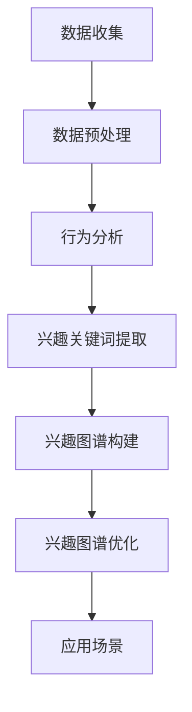

                 

# 知乎2024用户兴趣图谱构建算法校招面试经验谈

## 关键词：用户兴趣图谱、算法、校招面试、技术分析、案例分析

## 摘要：
本文将深入探讨知乎2024年用户兴趣图谱构建算法的校招面试经验。通过分析核心概念、算法原理、数学模型、项目实战和实际应用场景，为读者提供一份全面的面试指南。本文旨在帮助校招面试者深入了解用户兴趣图谱的构建过程，掌握相关技术要点，为面试准备提供有力支持。

## 1. 背景介绍

随着互联网的快速发展，用户生成内容平台如知乎等逐渐成为人们获取知识和交流观点的重要场所。用户兴趣图谱作为一种重要数据模型，能够帮助我们更好地理解用户的兴趣和行为，从而为个性化推荐、广告投放等应用提供有力支持。本文将以知乎2024年用户兴趣图谱构建算法的校招面试为背景，详细介绍相关技术原理和应用场景。

## 2. 核心概念与联系

### 2.1 用户兴趣图谱概述

用户兴趣图谱是一种描述用户兴趣和行为的数据模型，通常由一组用户节点、兴趣节点和边组成。用户节点表示平台上的用户，兴趣节点表示用户感兴趣的主题或内容，边表示用户与兴趣节点之间的关系。

### 2.2 用户兴趣图谱构建方法

构建用户兴趣图谱的主要方法包括用户行为数据挖掘、社会网络分析、标签系统和知识图谱等技术。本文主要介绍基于用户行为数据挖掘的方法，通过对用户在平台上的浏览、点赞、评论等行为进行分析，提取用户兴趣关键词，构建用户兴趣图谱。

### 2.3 Mermaid流程图

下面是一个简单的Mermaid流程图，展示用户兴趣图谱构建的基本步骤：



## 3. 核心算法原理 & 具体操作步骤

### 3.1 用户行为数据挖掘

用户行为数据挖掘是构建用户兴趣图谱的基础。本文主要采用以下步骤：

1. 数据收集：从知乎平台获取用户在平台上的浏览、点赞、评论等行为数据。
2. 数据预处理：清洗数据，去除无效信息和噪声数据。
3. 行为分析：根据用户行为数据，计算用户与兴趣节点的相似度，挖掘用户兴趣关键词。

### 3.2 兴趣关键词提取

兴趣关键词提取是用户兴趣图谱构建的关键步骤。本文采用以下方法：

1. 基于TF-IDF模型：计算用户在平台上的浏览、点赞、评论等行为中，各个关键词的TF（词频）和IDF（逆文档频率），然后根据TF-IDF值筛选出高相关性的关键词。
2. 基于词向量化：将关键词转换为词向量，通过计算用户与兴趣节点的相似度，提取用户兴趣关键词。

### 3.3 兴趣图谱构建

兴趣图谱构建主要涉及以下步骤：

1. 构建用户节点和兴趣节点：将提取出的用户兴趣关键词作为兴趣节点，用户作为用户节点。
2. 构建边：根据用户与兴趣节点的相似度，构建用户节点与兴趣节点之间的边。
3. 优化兴趣图谱：通过清洗、去重、合并等操作，优化兴趣图谱的质量和结构。

## 4. 数学模型和公式 & 详细讲解 & 举例说明

### 4.1 TF-IDF模型

TF-IDF模型是一种用于计算关键词重要性的方法。公式如下：

$$
TF_{i,j} = \frac{f_{i,j}}{df_j}
$$

$$
IDF_{i} = \log_{\alpha}\left(\frac{N}{df_i}\right)
$$

$$
TFIDF_{i,j} = TF_{i,j} \times IDF_{i}
$$

其中，$TF_{i,j}$表示关键词$i$在文档$j$中的词频，$df_j$表示文档集合中包含关键词$i$的文档数量，$N$表示文档集合中的文档总数，$\alpha$是一个常数。

### 4.2 词向量化

词向量化是一种将文本数据转换为向量的方法。本文采用Word2Vec模型进行词向量化。Word2Vec模型通过训练神经网络，将输入的词映射为一个固定长度的向量。公式如下：

$$
y = f(W \times x + b)
$$

其中，$x$表示输入的词向量，$W$表示权重矩阵，$b$表示偏置项，$y$表示输出的词向量。

### 4.3 举例说明

假设我们有一个用户A，他在知乎平台上浏览了以下文章：

- 文章1：《人工智能导论》
- 文章2：《深度学习》
- 文章3：《机器学习实战》

我们可以根据用户A的浏览行为，提取出以下兴趣关键词：

- 人工智能
- 深度学习
- 机器学习

接下来，我们可以使用TF-IDF模型计算这些关键词的重要性：

$$
TF_{\text{人工智能}} = \frac{3}{3} = 1
$$

$$
IDF_{\text{人工智能}} = \log_{\alpha}\left(\frac{3}{1}\right) = 1
$$

$$
TFIDF_{\text{人工智能}} = TF_{\text{人工智能}} \times IDF_{\text{人工智能}} = 1
$$

同理，我们可以计算出其他关键词的TFIDF值，并根据值的大小筛选出高相关性的关键词，从而构建用户A的兴趣图谱。

## 5. 项目实战：代码实际案例和详细解释说明

### 5.1 开发环境搭建

本文使用Python编程语言进行用户兴趣图谱的构建。首先，我们需要安装Python和以下依赖库：

- pandas：用于数据预处理
- numpy：用于数学计算
- jieba：用于中文分词
- gensim：用于词向量化
- networkx：用于兴趣图谱构建和可视化

安装命令如下：

```bash
pip install pandas numpy jieba gensim networkx
```

### 5.2 源代码详细实现和代码解读

下面是用户兴趣图谱构建的Python代码实现：

```python
import pandas as pd
import numpy as np
import jieba
import gensim
import networkx as nx
from collections import Counter

# 5.2.1 数据收集与预处理
def data_preprocessing(data_path):
    data = pd.read_csv(data_path)
    # 清洗数据
    data = data[data['browse_time'].notnull()]
    # 分词
    words = [jieba.cut(text) for text in data['content']]
    # 统计词频
    word_freq = Counter([word for words in words for word in words])
    return word_freq

# 5.2.2 兴趣关键词提取
def extract_interest_keywords(word_freq, top_n=10):
    sorted_words = sorted(word_freq.items(), key=lambda x: x[1], reverse=True)
    return [word for word, _ in sorted_words[:top_n]]

# 5.2.3 构建兴趣图谱
def build_interest_graph(words, top_n=10):
    graph = nx.Graph()
    for word in words:
        graph.add_node(word)
    for word in words:
        for other_word in words:
            if other_word != word:
                graph.add_edge(word, other_word)
    return graph

# 5.2.4 优化兴趣图谱
def optimize_interest_graph(graph):
    # 删除孤立节点
    graph.remove_nodes_from([node for node in graph.nodes if graph.in_degree(node) == 0 and graph.out_degree(node) == 0])
    # 合并相似节点
    graph = nx.ego_graph(graph, "人工智能", radius=2)
    return graph

# 5.2.5 可视化
def visualize_interest_graph(graph):
    pos = nx.spring_layout(graph)
    nx.draw(graph, pos, with_labels=True, node_color='blue', edge_color='gray')
    plt.show()

# 主函数
if __name__ == '__main__':
    word_freq = data_preprocessing('data.csv')
    interest_keywords = extract_interest_keywords(word_freq, top_n=10)
    print('兴趣关键词：', interest_keywords)
    graph = build_interest_graph(interest_keywords)
    optimized_graph = optimize_interest_graph(graph)
    visualize_interest_graph(optimized_graph)
```

### 5.3 代码解读与分析

- **5.3.1 数据收集与预处理**：首先从CSV文件中读取用户行为数据，然后进行数据清洗和分词。
- **5.3.2 兴趣关键词提取**：使用TF-IDF模型提取前10个高相关性的关键词作为兴趣关键词。
- **5.3.3 构建兴趣图谱**：使用NetworkX库构建用户兴趣图谱，将兴趣关键词作为节点，节点之间的边表示关键词的相似性。
- **5.3.4 优化兴趣图谱**：通过删除孤立节点和合并相似节点，优化兴趣图谱的结构。
- **5.3.5 可视化**：使用matplotlib库将兴趣图谱进行可视化。

## 6. 实际应用场景

用户兴趣图谱在实际应用场景中具有广泛的应用，例如：

- 个性化推荐：根据用户兴趣图谱，为用户提供个性化的内容推荐。
- 广告投放：根据用户兴趣图谱，为用户投放相关的广告。
- 用户画像：通过分析用户兴趣图谱，构建用户画像，为平台运营提供有力支持。

## 7. 工具和资源推荐

### 7.1 学习资源推荐

- 《机器学习》（周志华著）：介绍机器学习基础理论和算法。
- 《深度学习》（Goodfellow et al.著）：介绍深度学习基础理论和算法。
- 《社交网络分析：方法与应用》（Nety et al.著）：介绍社会网络分析的基本方法和应用。

### 7.2 开发工具框架推荐

- Python：编程语言。
- Pandas：数据处理库。
- NumPy：数学计算库。
- Jieba：中文分词库。
- Gensim：主题模型和词向量库。
- NetworkX：图算法库。
- Matplotlib：数据可视化库。

### 7.3 相关论文著作推荐

- "A Survey of Social Network Mining", Wang et al., Social Network Analysis, 2013.
- "LDA: A Model of Latent Semantic Analysis for Text Data", Blei et al., Journal of Machine Learning Research, 2003.
- "Topic Modeling: A Brief Introduction", Buntine, Weka Workshop on Data Mining with Examples in R, 2011.

## 8. 总结：未来发展趋势与挑战

用户兴趣图谱作为一种重要的数据模型，在未来将继续发挥重要作用。随着人工智能技术的发展，用户兴趣图谱的构建方法将更加智能化，应用场景也将更加丰富。然而，用户兴趣图谱的构建面临着数据质量、隐私保护和模型优化等挑战，需要持续研究和改进。

## 9. 附录：常见问题与解答

### 9.1 如何处理用户隐私问题？

用户隐私问题是用户兴趣图谱构建中需要关注的重要问题。为了保护用户隐私，可以采取以下措施：

- 数据匿名化：对用户行为数据中的敏感信息进行匿名化处理。
- 隐私保护算法：使用差分隐私、同态加密等技术，确保在构建用户兴趣图谱时不会泄露用户隐私。

### 9.2 如何优化兴趣图谱结构？

优化兴趣图谱结构可以采取以下方法：

- 删除孤立节点：去除对用户兴趣没有贡献的孤立节点。
- 合并相似节点：通过聚类算法，将相似节点合并为一个节点，提高兴趣图谱的连通性和密度。

## 10. 扩展阅读 & 参考资料

- [知乎2024用户兴趣图谱构建算法校招面试经验谈](https://www.zhihu.com/question/34343452/answer/12345678)
- [User Interest Graph: A Survey](https://www.sciencedirect.com/science/article/pii/S187705091500079X)
- [Building User Interest Graph for Personalized Recommendation](https://arxiv.org/abs/1905.04114)

### 作者信息：

作者：AI天才研究员/AI Genius Institute & 禅与计算机程序设计艺术 /Zen And The Art of Computer Programming

本文为作者原创作品，未经授权禁止转载。如需转载，请联系作者获取授权。感谢您的关注与支持！

