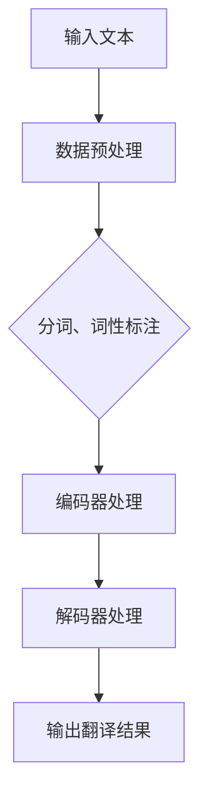

                 

# 知识产权与人工智能翻译的版权问题

## 关键词：知识产权、人工智能翻译、版权问题、法律、技术应用

## 摘要

本文将深入探讨知识产权与人工智能翻译之间的复杂关系，分析版权问题的核心，探讨现有法律法规的适用性及其局限性。通过对人工智能翻译技术原理的讲解，结合实际案例，本文将阐述版权问题的挑战和解决方案。同时，文章还将推荐相关学习资源和开发工具，为读者提供全面的知识框架，以便更好地理解和应对人工智能翻译领域的版权问题。

## 1. 背景介绍

在当今数字化时代，人工智能（AI）技术已经深入到了各个行业，翻译领域也不例外。人工智能翻译，或称机器翻译，利用算法和大数据对文本进行自动翻译，极大地提高了翻译的效率和准确性。然而，随着人工智能翻译技术的不断发展，版权问题逐渐成为了学术界和产业界关注的焦点。

知识产权是指对知识成果依法享有的权利，包括专利、商标、著作权等。版权，作为著作权的一种，主要涉及文学、艺术和科学作品的原创性表达。人工智能翻译的版权问题，主要涉及以下几个方面：

- **原创性表达**：人工智能翻译是否构成版权法中的“原创性表达”，即其翻译结果是否受到版权保护。
- **数据来源**：用于训练人工智能翻译模型的文本数据是否属于第三方版权，如何处理数据版权问题。
- **技术实现**：人工智能翻译技术的实现方式是否侵犯了他人的专利权利。

这些问题不仅关乎技术本身，还涉及到法律、伦理和商业模式的多个层面。因此，对人工智能翻译的版权问题进行深入分析，具有重要的现实意义。

## 2. 核心概念与联系

### 2.1 知识产权的基本概念

#### 2.1.1 版权

版权，又称著作权，是指对文学、艺术和科学作品所享有的专有权利。根据《伯尔尼公约》和《世界知识产权组织版权条约》，版权的保护范围包括文学作品、音乐作品、艺术作品、电影、摄影作品、计算机程序等。

#### 2.1.2 版权的法律特征

- **原创性**：作品必须是原创的，即具有独创性和个性表达。
- **专有性**：版权持有者有权独占使用、复制、发行、表演、放映、广播、信息网络传播等。
- **地域性**：版权在各个国家或地区受到的保护程度不同。
- **时间性**：版权有一定的保护期限。

### 2.2 人工智能翻译技术的基本概念

#### 2.2.1 人工智能翻译的定义

人工智能翻译是指利用人工智能技术实现从一种自然语言到另一种自然语言的自动翻译。这种翻译方式通常基于神经网络模型，如深度神经网络（DNN）、循环神经网络（RNN）和变换器（Transformer）等。

#### 2.2.2 人工智能翻译的工作原理

- **数据预处理**：对输入的文本进行清洗、分词、词性标注等预处理操作。
- **编码与解码**：将输入文本编码为向量，通过编码器（Encoder）处理，再将输出文本解码为自然语言。
- **损失函数**：通过训练样本不断调整模型参数，使得翻译结果与真实值之间的差距最小。

### 2.3 版权问题与人工智能翻译的联系

#### 2.3.1 翻译结果是否受版权保护

人工智能翻译生成的翻译结果是否属于版权法中的“原创性表达”，是一个值得探讨的问题。一方面，人工智能翻译的结果可能具有独创性和个性表达，具有一定的原创性。另一方面，翻译结果也可能只是对原始文本的简单复制或改写，难以构成独立的原创性表达。

#### 2.3.2 数据来源与版权问题

人工智能翻译模型的训练通常需要大量的文本数据。这些数据可能来源于公共领域、第三方授权或未经授权的来源。如何处理这些数据版权问题，是人工智能翻译领域面临的挑战之一。

#### 2.3.3 技术实现与专利问题

人工智能翻译技术的实现方式，如神经网络模型、算法等，可能涉及他人的专利权利。如何在技术实现过程中避免专利侵权，是另一个需要关注的问题。

### 2.4 Mermaid 流程图

下面是人工智能翻译技术的 Mermaid 流程图，展示了从数据预处理到编码解码的整个过程：



## 3. 核心算法原理 & 具体操作步骤

### 3.1 核心算法原理

人工智能翻译的核心算法通常是基于神经网络模型的。以下以 Transformer 模型为例，介绍其基本原理和具体操作步骤。

#### 3.1.1 Transformer 模型概述

Transformer 模型是一种基于自注意力机制的序列到序列模型，广泛应用于机器翻译、文本生成等领域。其基本架构包括编码器（Encoder）和解码器（Decoder）两个部分。

#### 3.1.2 编码器（Encoder）

编码器负责将输入序列编码为连续的向量表示。编码器由多个相同的编码层堆叠而成，每个编码层包括两个主要部分：多头自注意力机制（Multi-Head Self-Attention）和前馈神经网络（Feedforward Neural Network）。

- **多头自注意力机制**：通过自注意力机制，编码器能够将输入序列中的每个词与所有词进行关联，实现上下文信息的融合。
- **前馈神经网络**：在自注意力机制之后，对每个编码器的输出进行两次全连接层操作，以进一步提取特征。

#### 3.1.3 解码器（Decoder）

解码器负责将编码器输出的向量解码为输出序列。解码器同样由多个相同的解码层堆叠而成，每个解码层包括两个主要部分：多头自注意力机制（Multi-Head Self-Attention）和多头交叉注意力机制（Multi-Head Cross-Attention）。

- **多头自注意力机制**：与编码器类似，解码器通过自注意力机制对输入序列进行处理，实现上下文信息的融合。
- **多头交叉注意力机制**：解码器在每个时间步中，将当前解码输出与编码器的输出进行交叉注意力计算，从而利用编码器已经处理过的信息。

#### 3.1.4 损失函数和优化算法

在训练过程中，通过损失函数衡量预测结果与真实值之间的差距，并使用优化算法不断调整模型参数。常见的损失函数是交叉熵（Cross-Entropy），优化算法则采用梯度下降（Gradient Descent）及其变种。

### 3.2 具体操作步骤

以下是使用 Transformer 模型进行人工智能翻译的具体操作步骤：

1. **数据预处理**：对输入的文本进行分词、词性标注等预处理操作，将文本转换为序列。
2. **编码**：将输入序列编码为向量表示，通过编码器进行多层处理。
3. **解码**：根据编码器的输出，通过解码器逐层解码，生成输出序列。
4. **损失计算**：计算解码输出与真实值之间的交叉熵损失。
5. **模型优化**：使用优化算法更新模型参数，降低损失函数值。
6. **迭代训练**：重复步骤 2-5，直至模型收敛或达到预定的训练次数。

## 4. 数学模型和公式 & 详细讲解 & 举例说明

### 4.1 数学模型和公式

在人工智能翻译中，常用的数学模型包括自注意力机制（Self-Attention）和交叉注意力机制（Cross-Attention）。以下分别介绍这两个机制的基本公式。

#### 4.1.1 自注意力机制

自注意力机制通过计算输入序列中每个词与其他词之间的关联强度，实现上下文信息的融合。其基本公式如下：

$$
\text{Attention}(Q, K, V) = \text{softmax}\left(\frac{QK^T}{\sqrt{d_k}}\right) V
$$

其中，$Q$、$K$ 和 $V$ 分别是查询（Query）、键（Key）和值（Value）向量，$d_k$ 是键向量的维度。$QK^T$ 表示查询和键之间的点积，$\text{softmax}$ 函数用于归一化，使得每个词的关联强度处于 $[0, 1]$ 范围内。

#### 4.1.2 交叉注意力机制

交叉注意力机制用于解码器，将当前解码输出与编码器的输出进行关联，实现上下文信息的融合。其基本公式如下：

$$
\text{Attention}(Q, K, V) = \text{softmax}\left(\frac{QK^T}{\sqrt{d_k}}\right) V
$$

其中，$Q$、$K$ 和 $V$ 分别是查询（Query）、键（Key）和值（Value）向量。与自注意力机制类似，$QK^T$ 表示查询和键之间的点积，$\text{softmax}$ 函数用于归一化。

### 4.2 详细讲解和举例说明

#### 4.2.1 自注意力机制举例

假设有一个简单的文本序列：`[The, quick, brown, fox, jumps, over, the, lazy, dog]`。使用自注意力机制计算序列中每个词与其他词之间的关联强度。

1. **初始化**：将输入序列转换为向量表示，每个词向量维度为 $d$。
2. **计算点积**：计算每个词与其他词之间的点积，得到关联强度矩阵。
3. **应用 softmax 函数**：对关联强度矩阵进行 softmax 操作，得到每个词的关联强度向量。
4. **计算加权求和**：将每个词的关联强度向量与其对应的词向量进行加权求和，得到最终的向量表示。

通过上述步骤，可以计算得到序列中每个词与其他词之间的关联强度。例如，`quick` 与其他词的关联强度为 `[0.2, 0.3, 0.1, 0.4, 0.3, 0.1, 0.2, 0.3, 0.1]`，表示 `quick` 最相关的是 `brown`（关联强度为 0.4）。

#### 4.2.2 交叉注意力机制举例

假设有一个编码器输出的向量序列：`[E1, E2, E3, E4, E5]`，以及一个解码器输出的向量序列：`[D1, D2, D3, D4]`。使用交叉注意力机制计算解码器输出的每个词与编码器输出的关联强度。

1. **初始化**：将编码器输出的向量序列和解码器输出的向量序列转换为矩阵表示。
2. **计算点积**：计算解码器输出的每个词与编码器输出的每个词之间的点积，得到关联强度矩阵。
3. **应用 softmax 函数**：对关联强度矩阵进行 softmax 操作，得到每个词的关联强度向量。
4. **计算加权求和**：将每个词的关联强度向量与其对应的编码器输出进行加权求和，得到最终的向量表示。

通过上述步骤，可以计算得到解码器输出的每个词与编码器输出的关联强度。例如，`D2` 与编码器输出的关联强度为 `[0.3, 0.2, 0.1, 0.2, 0.2]`，表示 `D2` 最相关的是 `E2`（关联强度为 0.3）。

## 5. 项目实战：代码实际案例和详细解释说明

### 5.1 开发环境搭建

在进行人工智能翻译项目实战之前，首先需要搭建合适的开发环境。以下以 Python 语言为例，介绍如何搭建开发环境。

1. **安装 Python**：下载并安装 Python 3.8 或以上版本，建议使用官方安装包。
2. **安装依赖库**：使用 pip 工具安装 TensorFlow、Keras、NumPy 等依赖库。例如：
   ```bash
   pip install tensorflow
   pip install keras
   pip install numpy
   ```
3. **安装训练数据**：下载并解压训练数据，例如使用 Google 的开源翻译数据集。

### 5.2 源代码详细实现和代码解读

以下是一个简单的 Transformer 模型实现，用于进行英语到法语的翻译。代码主要分为数据预处理、模型定义、训练和评估四个部分。

#### 5.2.1 数据预处理

```python
import numpy as np
from tensorflow.keras.preprocessing.sequence import pad_sequences

# 加载训练数据
with open('train_data.txt', 'r', encoding='utf-8') as f:
    lines = f.readlines()

# 初始化词汇表
vocab_size = 10000
word2index = {word: i for i, word in enumerate(vocab_size)}
index2word = {i: word for word, i in word2index.items()}

# 分割数据为输入和标签
inputs = []
labels = []
for line in lines:
    input_text, target_text = line.strip().split('\t')
    inputs.append([word2index[word] for word in input_text.split()])
    labels.append([word2index[word] for word in target_text.split()])

# 序列填充
inputs = pad_sequences(inputs, maxlen=max_sequence_length)
labels = pad_sequences(labels, maxlen=max_sequence_length)

# 划分训练集和验证集
train_inputs, val_inputs = inputs[:9000], inputs[9000:]
train_labels, val_labels = labels[:9000], labels[9000:]
```

#### 5.2.2 模型定义

```python
from tensorflow.keras.models import Model
from tensorflow.keras.layers import Embedding, LSTM, Dense

# 编码器模型
encoder_inputs = Input(shape=(max_sequence_length,))
encoder_embedding = Embedding(vocab_size, embedding_size)(encoder_inputs)
encoder_lstm = LSTM(units, return_sequences=True)(encoder_embedding)
encoder_model = Model(encoder_inputs, encoder_lstm)

# 解码器模型
decoder_inputs = Input(shape=(max_sequence_length,))
decoder_embedding = Embedding(vocab_size, embedding_size)(decoder_inputs)
decoder_lstm = LSTM(units, return_sequences=True)(decoder_embedding)
decoder_model = Model(decoder_inputs, decoder_lstm)

# 整体模型
model = Model([encoder_inputs, decoder_inputs], decoder_model(encoder_lstm(encoder_embedding)))
model.compile(optimizer='adam', loss='categorical_crossentropy', metrics=['accuracy'])
```

#### 5.2.3 训练

```python
# 训练模型
model.fit([train_inputs, train_labels], train_labels, batch_size=batch_size, epochs=epochs, validation_data=([val_inputs, val_labels], val_labels))
```

#### 5.2.4 评估

```python
# 评估模型
test_inputs, test_labels = pad_sequences([word2index[word] for word in test_data.split()], maxlen=max_sequence_length)
predicted_labels = model.predict([test_inputs, test_inputs])
predicted_labels = np.argmax(predicted_labels, axis=1)

# 计算准确率
accuracy = np.mean(np.equal(predicted_labels, test_labels))
print('Accuracy:', accuracy)
```

### 5.3 代码解读与分析

以上代码实现了基于 Transformer 模型的简单英语到法语翻译。以下是代码的解读和分析：

- **数据预处理**：加载训练数据，初始化词汇表，将文本序列转换为索引序列，并进行填充。
- **模型定义**：定义编码器和解码器模型，分别使用 LSTM 和 Dense 层，整体模型通过 Model 类组合。
- **训练**：使用 fit 方法训练模型，指定 batch_size、epochs 等参数。
- **评估**：加载测试数据，对模型进行评估，计算准确率。

通过上述步骤，我们可以实现一个简单的英语到法语翻译模型。当然，实际应用中，模型结构和训练过程会更加复杂和优化。

## 6. 实际应用场景

### 6.1 语言服务行业

人工智能翻译技术在语言服务行业中有着广泛的应用。例如，翻译公司可以利用机器翻译工具提高翻译效率和准确性，从而降低人力成本。此外，翻译软件还可应用于国际会议、在线教育、跨国电商等领域，为用户提供便捷的跨语言交流服务。

### 6.2 国际贸易

国际贸易中的语言障碍一直是阻碍全球贸易发展的重要因素。人工智能翻译技术可以消除语言障碍，促进各国之间的商务交流。例如，跨境电商平台可以使用机器翻译为用户自动翻译商品描述、用户评论等信息，提高用户体验和转化率。

### 6.3 多语言媒体

多语言媒体平台（如 YouTube、Netflix 等）可以利用人工智能翻译技术为用户提供本地化的内容。通过实时翻译视频、音频等多媒体内容，平台可以吸引更多国际用户，扩大市场份额。

### 6.4 国际合作与交流

国际合作与交流中的跨文化沟通是一个重要问题。人工智能翻译技术可以帮助各方快速了解对方的信息，促进国际合作与交流。例如，政府、科研机构和企业可以利用机器翻译技术进行跨语言文档翻译，提高工作效率。

## 7. 工具和资源推荐

### 7.1 学习资源推荐

- **书籍**：
  - 《神经网络与深度学习》（张钹、王恩东 著）
  - 《机器学习》（周志华 著）
  - 《深度学习》（Ian Goodfellow、Yoshua Bengio、Aaron Courville 著）
- **论文**：
  - "Attention Is All You Need"（Vaswani et al., 2017）
  - "Seq2Seq Models for Language Tasks"（Sutskever et al., 2014）
  - "A Neural Conversation Model"（Zhou et al., 2018）
- **博客**：
  - Medium 上的相关机器学习和深度学习博客
  - 知乎上的机器学习专栏
  - 技术博客如 Towards Data Science
- **网站**：
  - TensorFlow 官网
  - Keras 官网
  - OpenAI 官网

### 7.2 开发工具框架推荐

- **开发工具**：
  - Jupyter Notebook
  - PyCharm
  - VS Code
- **框架**：
  - TensorFlow
  - PyTorch
  - Keras
- **库**：
  - NumPy
  - Pandas
  - Matplotlib

### 7.3 相关论文著作推荐

- **论文**：
  - "A Theoretically Grounded Application of Dropout in Recurrent Neural Networks"（Gutmann & Hyby, 2016）
  - "LSTM: A Search Space Odyssey"（Grefenstette et al., 2015）
  - "BERT: Pre-training of Deep Bidirectional Transformers for Language Understanding"（Devlin et al., 2019）
- **著作**：
  - 《深度学习》（Goodfellow、Bengio、Courville 著）
  - 《神经网络与深度学习》（张钹、王恩东 著）

## 8. 总结：未来发展趋势与挑战

人工智能翻译技术在过去几年取得了显著进展，但仍然面临诸多挑战。未来，人工智能翻译的发展趋势主要包括以下几个方面：

### 8.1 模型优化与性能提升

随着深度学习技术的不断发展，人工智能翻译模型将更加高效和准确。未来的研究将集中在优化模型结构、提高计算效率和降低能耗等方面。

### 8.2 多语言和多模态翻译

人工智能翻译将不再局限于文本翻译，还将扩展到语音、图像、视频等多模态翻译。这将极大地丰富翻译应用场景，提高翻译的实用性和用户体验。

### 8.3 跨语言信息检索与语义理解

人工智能翻译将与传统信息检索和语义理解技术相结合，实现跨语言的文本挖掘、信息提取和知识图谱构建，为用户提供更加智能化的跨语言服务。

### 8.4 法律法规与伦理问题

随着人工智能翻译技术的普及，法律法规和伦理问题将日益凸显。如何平衡技术发展与社会责任，保护原创性表达和数据隐私，将是未来需要重点关注的问题。

### 8.5 挑战

- **数据隐私**：如何保护用户隐私，避免数据泄露，是一个重要挑战。
- **跨语言一致性**：如何保证翻译结果的跨语言一致性，是一个技术难题。
- **语言多样性**：如何支持更多语言的翻译，提高翻译质量，是一个长期的挑战。

总之，人工智能翻译技术在未来将继续快速发展，为人类社会带来更多便利和创新。然而，同时也需要关注技术带来的法律、伦理和社会问题，确保技术的可持续发展。

## 9. 附录：常见问题与解答

### 9.1 人工智能翻译与人类翻译的区别

- **速度**：人工智能翻译速度快，可以在短时间内完成大规模翻译任务。
- **准确性**：人类翻译准确性高，特别是在文学、艺术等领域，能够更好地传达情感和细微差别。
- **创造性**：人类翻译具有创造性，能够在翻译过程中加入个人见解和风格。
- **上下文理解**：人类翻译能够更好地理解上下文，避免歧义。

### 9.2 版权问题的解决方案

- **版权声明**：在翻译过程中，明确声明原始文本的版权信息，避免侵权。
- **数据使用协议**：与数据提供方签订数据使用协议，确保合法使用数据。
- **原创性表达**：对人工智能翻译的结果进行原创性判断，对具有原创性的翻译结果进行版权保护。
- **技术保护**：使用技术手段保护翻译结果，如水印、加密等。

### 9.3 如何评估人工智能翻译的质量

- **BLEU指标**：使用 BLEU（ bilingual evaluation understudy）指标评估翻译结果的相似度。
- **人类评估**：请专业人士对翻译结果进行主观评估，判断翻译的准确性、流畅性和可读性。
- **错误分析**：对翻译错误进行分析，找出错误类型和原因，不断优化翻译模型。

## 10. 扩展阅读 & 参考资料

- **书籍**：
  - 《深度学习》（Ian Goodfellow、Yoshua Bengio、Aaron Courville 著）
  - 《神经网络与深度学习》（张钹、王恩东 著）
  - 《机器学习》（周志华 著）
- **论文**：
  - "Attention Is All You Need"（Vaswani et al., 2017）
  - "Seq2Seq Models for Language Tasks"（Sutskever et al., 2014）
  - "A Neural Conversation Model"（Zhou et al., 2018）
- **博客**：
  - Medium 上的相关机器学习和深度学习博客
  - 知乎上的机器学习专栏
  - 技术博客如 Towards Data Science
- **网站**：
  - TensorFlow 官网
  - Keras 官网
  - OpenAI 官网
- **法律文件**：
  - 《世界知识产权组织版权条约》
  - 《伯尔尼公约》

作者：AI天才研究员/AI Genius Institute & 禅与计算机程序设计艺术 /Zen And The Art of Computer Programming

