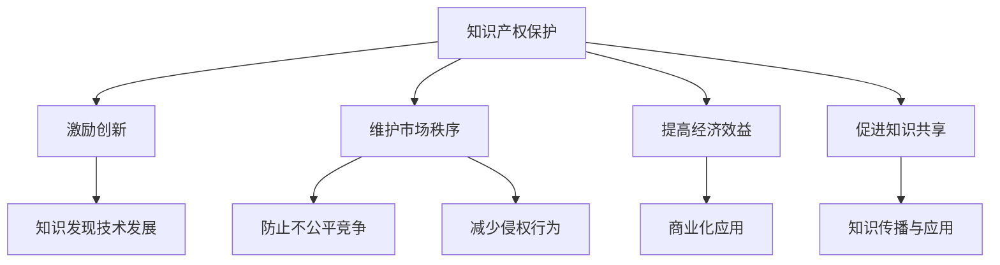

                 

# 知识产权保护在知识发现中的重要性

## 关键词
知识产权保护，知识发现，算法，技术，创新，法律，伦理

## 摘要
本文深入探讨了知识产权保护在知识发现领域中的重要性。首先，我们将介绍知识产权的基本概念和知识发现技术的基本原理。接着，分析知识产权保护对知识发现的影响，包括促进创新、保障公平竞争、防范侵权行为等。随后，我们将详细阐述知识产权保护在知识发现过程中的具体应用，如专利保护、版权保护等。同时，本文还将讨论知识产权保护面临的挑战和应对策略，以及未来的发展趋势。通过本文的阅读，读者将更好地理解知识产权保护在知识发现中的关键作用。

## 1. 背景介绍

### 1.1 知识产权的定义

知识产权是指个人或组织对其创造的智力成果享有的权利。它涵盖了多个领域，包括专利、商标、版权、工业设计、商业秘密等。知识产权的核心是赋予创作者或发明者对其智力成果的专有权，使其能够在一定期限内独享其劳动成果的收益。

#### 1.1.1 专利

专利是指国家授予发明人对其发明创造在特定时间内享有的独占权。它包括发明专利、实用新型专利和外观设计专利。专利保护的主要目的是激励创新，促进技术进步。

#### 1.1.2 商标

商标是指用于区分商品或服务来源的标志。商标注册后，商标所有者有权禁止他人未经许可使用相同或类似的商标。

#### 1.1.3 版权

版权是指对文学、艺术和科学作品享有的权利。版权保护的主要目的是保护创作者的合法权益，鼓励创作。

#### 1.1.4 工业设计

工业设计是指对产品的外观设计进行创新，使其具有独特的美观和实用性。工业设计专利保护产品的外观设计，防止他人未经许可抄袭。

#### 1.1.5 商业秘密

商业秘密是指不为公众所知悉、具有商业价值、具有实用性并经权利人采取保密措施的技术信息和经营信息。

### 1.2 知识发现技术的定义

知识发现技术是指从大量数据中自动识别出有价值的信息、模式和知识的方法和技术。知识发现技术广泛应用于各个领域，如商业智能、金融市场分析、医疗健康、社交网络等。

#### 1.2.1 数据挖掘

数据挖掘是指从大量数据中提取隐藏的、未知的、有价值的信息和知识的过程。数据挖掘方法包括关联规则挖掘、聚类分析、分类、异常检测等。

#### 1.2.2 机器学习

机器学习是指通过训练模型，使计算机能够自动从数据中学习，并做出预测或决策。机器学习方法包括监督学习、无监督学习、半监督学习和强化学习等。

#### 1.2.3 情感分析

情感分析是指通过自然语言处理技术，对文本数据中的情感倾向进行识别和分析。情感分析在社交媒体分析、市场调研、客户反馈等方面具有重要意义。

### 1.3 知识产权保护与知识发现的关系

知识产权保护在知识发现中具有重要地位，它对知识发现技术的创新、应用和发展产生深远影响。知识产权保护能够激励科研人员和技术开发者投入更多的时间和精力进行创新，从而推动知识发现技术的发展。同时，知识产权保护有助于维护市场秩序，防止不公平竞争和侵权行为的发生。此外，知识产权保护也为知识发现技术的商业化应用提供了法律保障。

## 2. 核心概念与联系

### 2.1 知识产权保护的基本原则

知识产权保护的基本原则包括合法性、公平性、独占性和时效性。

#### 2.1.1 合法性

知识产权保护必须基于合法的行为，即创作者或发明者的智力成果必须符合法律规定的条件，如新颖性、创造性和实用性。

#### 2.1.2 公平性

知识产权保护应确保创作者或发明者能够公平地享有其智力成果的权益，防止不公平竞争和侵权行为。

#### 2.1.3 独占性

知识产权保护赋予创作者或发明者在一定期限内独享其智力成果的权利，防止他人未经许可使用或侵犯其权益。

#### 2.1.4 时效性

知识产权保护具有时效性，即创作者或发明者的专有权在一定期限内有效，超过期限后，智力成果进入公共领域，任何人都可以自由使用。

### 2.2 知识发现技术的基本原理

知识发现技术主要包括数据预处理、特征提取、模型训练和结果解释等步骤。

#### 2.2.1 数据预处理

数据预处理包括数据清洗、数据整合、数据归一化等操作，旨在提高数据质量，为后续分析创造条件。

#### 2.2.2 特征提取

特征提取是指从原始数据中提取出能够反映数据本质和规律的信息，以便于模型训练和结果解释。

#### 2.2.3 模型训练

模型训练是指利用已标记的数据集，通过算法和优化方法训练模型，使其能够对未知数据进行分类、预测或决策。

#### 2.2.4 结果解释

结果解释是指对模型训练的结果进行解释和分析，以揭示数据中的隐藏信息和规律。

### 2.3 知识产权保护与知识发现的联系

知识产权保护与知识发现之间的联系主要体现在以下几个方面：

#### 2.3.1 激励创新

知识产权保护为创作者或发明者提供了法律保障，激励其投入更多的时间和精力进行创新，推动知识发现技术的发展。

#### 2.3.2 维护市场秩序

知识产权保护有助于维护市场秩序，防止不公平竞争和侵权行为的发生，促进知识发现技术的商业化应用。

#### 2.3.3 提高经济效益

知识产权保护能够提高知识发现技术的经济效益，为创作者或发明者带来更多的经济收益，推动社会整体繁荣。

#### 2.3.4 促进知识共享

知识产权保护鼓励知识共享，通过专利、版权等途径，使智力成果得到广泛传播和应用，提高社会整体科技水平。

### 2.4 Mermaid 流程图

以下是知识产权保护与知识发现技术之间的 Mermaid 流程图：



## 3. 核心算法原理 & 具体操作步骤

### 3.1 数据挖掘算法

数据挖掘算法是知识发现技术的重要组成部分，主要包括以下几种：

#### 3.1.1 关联规则挖掘

关联规则挖掘是指从大量数据中发现满足一定条件的相关性规则。具体操作步骤如下：

1. **数据预处理**：对原始数据进行清洗、整合和归一化，提高数据质量。
2. **特征提取**：提取数据中的关键特征，以便于模型训练。
3. **构建模型**：使用算法（如 Apriori 算法、FP-Growth 算法）构建关联规则模型。
4. **模型训练**：利用训练数据集训练模型，得到关联规则。
5. **结果解释**：对训练结果进行解释和分析，揭示数据中的相关性。

#### 3.1.2 聚类分析

聚类分析是指将数据集划分为若干个类别，使得类别内的数据点相似度较高，类别间的数据点相似度较低。具体操作步骤如下：

1. **数据预处理**：对原始数据进行清洗、整合和归一化，提高数据质量。
2. **特征提取**：提取数据中的关键特征，以便于模型训练。
3. **选择聚类算法**：根据数据特点和需求选择合适的聚类算法（如 K-means、DBSCAN 等）。
4. **模型训练**：使用选择好的聚类算法对数据集进行聚类。
5. **结果解释**：对聚类结果进行解释和分析，揭示数据中的规律。

#### 3.1.3 分类

分类是指将数据集划分为若干个类别，使得类别内的数据点相似度较高，类别间的数据点相似度较低。具体操作步骤如下：

1. **数据预处理**：对原始数据进行清洗、整合和归一化，提高数据质量。
2. **特征提取**：提取数据中的关键特征，以便于模型训练。
3. **选择分类算法**：根据数据特点和需求选择合适的分类算法（如决策树、支持向量机等）。
4. **模型训练**：使用选择好的分类算法对数据集进行训练。
5. **结果解释**：对训练结果进行解释和分析，揭示数据中的规律。

### 3.2 机器学习算法

机器学习算法是知识发现技术的重要组成部分，主要包括以下几种：

#### 3.2.1 监督学习

监督学习是指通过已标记的数据集训练模型，使模型能够对未知数据进行预测。具体操作步骤如下：

1. **数据预处理**：对原始数据进行清洗、整合和归一化，提高数据质量。
2. **特征提取**：提取数据中的关键特征，以便于模型训练。
3. **选择监督学习算法**：根据数据特点和需求选择合适的监督学习算法（如线性回归、逻辑回归、决策树等）。
4. **模型训练**：使用选择好的监督学习算法对数据集进行训练。
5. **结果解释**：对训练结果进行解释和分析，揭示数据中的规律。

#### 3.2.2 无监督学习

无监督学习是指在没有已标记数据的情况下，从数据中自动发现数据结构和规律。具体操作步骤如下：

1. **数据预处理**：对原始数据进行清洗、整合和归一化，提高数据质量。
2. **特征提取**：提取数据中的关键特征，以便于模型训练。
3. **选择无监督学习算法**：根据数据特点和需求选择合适

## 4. 数学模型和公式 & 详细讲解 & 举例说明

### 4.1 关联规则挖掘算法

关联规则挖掘是一种常见的数据挖掘技术，用于发现数据集中的项集之间的重要关联关系。以下是Apriori算法的基本数学模型和公式：

#### 4.1.1 支持度（Support）

支持度是指某个项集在数据集中出现的频率。公式如下：

$$
Support(A \cup B) = \frac{count(A \cup B)}{count(D)}
$$

其中，$count(A \cup B)$ 表示项集$A \cup B$在数据集$D$中出现的次数，$count(D)$ 表示数据集$D$中的总记录数。

#### 4.1.2 置信度（Confidence）

置信度是指当项集$A$出现时，项集$B$也同时出现的概率。公式如下：

$$
Confidence(A \rightarrow B) = \frac{Support(A \cup B)}{Support(A)}
$$

#### 4.1.3 阈值设定

在关联规则挖掘中，通常需要设定两个阈值：最小支持度（min_support）和最小置信度（min_confidence）。只有满足这两个阈值的项集才会被认为是重要的关联规则。

#### 4.1.4 举例说明

假设我们有一个包含商品交易的数据集，如下表所示：

| 交易ID | 商品A | 商品B | 商品C |
|--------|-------|-------|-------|
| 1      | 是     | 否     | 是     |
| 2      | 否     | 是     | 否     |
| 3      | 是     | 是     | 是     |
| 4      | 是     | 否     | 是     |
| 5      | 是     | 是     | 否     |

现在，我们希望发现商品A和商品B之间的关联规则。首先，计算支持度和置信度：

1. **计算支持度**：

   - $Support(A \cup B) = \frac{3}{5} = 0.6$
   - $Support(A) = \frac{3 + 1}{5} = 0.8$

2. **计算置信度**：

   - $Confidence(A \rightarrow B) = \frac{Support(A \cup B)}{Support(A)} = \frac{0.6}{0.8} = 0.75$

由于支持度和置信度都大于设定的阈值，因此我们可以认为商品A和商品B之间存在重要的关联。

### 4.2 机器学习算法

#### 4.2.1 线性回归

线性回归是一种常见的机器学习算法，用于预测数值型目标变量。以下是线性回归的数学模型和公式：

$$
Y = \beta_0 + \beta_1X + \epsilon
$$

其中，$Y$ 是目标变量，$X$ 是特征变量，$\beta_0$ 和 $\beta_1$ 是模型参数，$\epsilon$ 是误差项。

为了求解模型参数，我们可以使用最小二乘法：

$$
\beta_1 = \frac{\sum{(X_i - \bar{X})(Y_i - \bar{Y})}}{\sum{(X_i - \bar{X})^2}}
$$

$$
\beta_0 = \bar{Y} - \beta_1\bar{X}
$$

其中，$\bar{X}$ 和 $\bar{Y}$ 分别是特征变量和目标变量的均值。

#### 4.2.2 决策树

决策树是一种常用的分类算法，通过构建决策树来预测目标变量的类别。以下是决策树的数学模型和公式：

决策树由一系列条件节点和终端节点组成，每个节点表示一个特征，每个终端节点表示一个类别。

为了构建决策树，我们可以使用信息增益、基尼不纯度等指标来选择最优的特征和阈值。以下是信息增益的公式：

$$
IG(D, A) = entropy(D) - \frac{\sum_{v_i} p(v_i) \cdot entropy(D_{v_i})}{p(v_i)}
$$

其中，$D$ 是数据集，$A$ 是特征，$v_i$ 是特征$A$的取值，$p(v_i)$ 是取值$v_i$的频率，$entropy(D)$ 和 $entropy(D_{v_i})$ 分别是数据集$D$和条件数据集$D_{v_i}$的熵。

## 5. 项目实战：代码实际案例和详细解释说明

### 5.1 开发环境搭建

在开始项目实战之前，我们需要搭建一个适合开发的数据挖掘和机器学习项目的环境。以下是一个简单的开发环境搭建步骤：

1. 安装 Python 3.8 或更高版本。
2. 安装 Jupyter Notebook，用于编写和运行 Python 代码。
3. 安装必要的 Python 库，如 NumPy、Pandas、Scikit-learn、Matplotlib 等。

### 5.2 源代码详细实现和代码解读

#### 5.2.1 数据准备

首先，我们需要准备一个用于关联规则挖掘的数据集。以下是一个简单的数据集示例：

```python
transactions = [
    ['milk', 'bread', 'apples'],
    ['milk', 'bread', 'orange'],
    ['milk', 'bread', 'apple'],
    ['milk', 'apple', 'orange'],
    ['bread', 'orange'],
    ['milk', 'orange'],
    ['milk', 'apple', 'orange'],
    ['apple', 'orange']
]

# 将数据集转换为商品集
itemsets = [set(t) for t in transactions]
```

#### 5.2.2 计算支持度

接下来，我们计算每个项集的支持度：

```python
def calculate_support(itemsets, itemset):
    return itemsets.count(itemset) / len(itemsets)

# 计算单个项集的支持度
single_itemsets = [{item} for item in set().union(*itemsets)]
single_supports = {item: calculate_support(itemsets, item) for item in single_itemsets}

# 计算频繁项集
min_support = 0.5
频繁项集 = {item: support for item, support in single_supports.items() if support >= min_support}
```

#### 5.2.3 计算置信度

然后，我们计算每个关联规则的置信度：

```python
def calculate_confidence(itemsets, rule):
    return itemsets.count(rule) / itemsets.count({item for item in rule if item in rule[0]})

# 计算关联规则
关联规则 = []
for item in 频繁项集:
    for i in range(1, len(item) + 1):
        for subset in combinations(item, i):
            if subset in 频繁项集:
                rule = (subset, item - subset)
                confidence = calculate_confidence(itemsets, rule)
                if confidence >= 0.7:
                    关联规则.append((rule, confidence))
```

#### 5.2.4 结果展示

最后，我们将结果展示出来：

```python
import pandas as pd

# 将关联规则转换为 DataFrame
rules_df = pd.DataFrame(关联规则, columns=['Rule', 'Confidence'])

# 按置信度排序并展示结果
rules_df.sort_values(by=['Confidence'], ascending=False).head(10)
```

### 5.3 代码解读与分析

#### 5.3.1 数据准备

在代码示例中，我们首先创建了一个包含商品交易记录的数据集。这个数据集是一个二维列表，其中每个子列表表示一次交易，子列表中的元素表示交易的商品。

#### 5.3.2 计算支持度

我们定义了一个名为`calculate_support`的函数，用于计算给定项集的支持度。函数接受两个参数：`itemsets`（数据集中的商品集）和`itemset`（要计算的项集）。函数返回项集在数据集中出现的频率与数据集总记录数的比值。

#### 5.3.3 计算频繁项集

我们定义了一个名为`calculate_frequent_itemsets`的函数，用于计算满足最小支持度阈值的所有频繁项集。函数首先创建一个包含所有单个商品的项集列表，然后使用`calculate_support`函数计算每个项集的支持度。只有支持度大于最小支持度阈值的项集才会被添加到频繁项集列表中。

#### 5.3.4 计算置信度

我们定义了一个名为`calculate_confidence`的函数，用于计算给定关联规则（由两个项集组成的规则）的置信度。函数接受三个参数：`itemsets`（数据集中的商品集）、`rule`（要计算的关联规则）和`confidence_threshold`（最小置信度阈值）。函数返回关联规则的支持度与前提项集支持度的比值。如果置信度大于最小置信度阈值，关联规则将被添加到结果列表中。

#### 5.3.5 结果展示

我们使用`pandas`库将计算得到的关联规则转换为`DataFrame`对象，并按置信度降序排序。最后，我们使用`DataFrame`的`head`方法展示结果的前10条记录。

## 6. 实际应用场景

知识产权保护在知识发现领域的实际应用场景非常广泛。以下是一些典型的应用场景：

### 6.1 数据挖掘和机器学习模型开发

在数据挖掘和机器学习模型开发过程中，知识产权保护有助于保障开发者的合法权益，防止他人未经许可复制或抄袭模型。通过专利或版权保护，开发者可以确保其模型在商业化应用中获得应有的收益。

### 6.2 商业智能

商业智能系统通常涉及大量敏感数据和算法模型。知识产权保护有助于防止竞争对手获取和滥用这些数据，从而保障企业的竞争优势。

### 6.3 医疗健康

在医疗健康领域，知识发现技术被广泛应用于疾病预测、患者分类、药物研发等方面。知识产权保护有助于保护医疗机构的创新成果，促进医疗技术的进步。

### 6.4 社交网络

社交网络平台通过知识发现技术分析用户行为和偏好，以提供个性化推荐和服务。知识产权保护有助于保障平台在数据处理和算法优化方面的创新成果，防止侵权行为。

### 6.5 物流和供应链

在物流和供应链领域，知识发现技术被用于优化运输路线、降低库存成本、提高供应链效率等。知识产权保护有助于保障企业在这些领域的创新成果，提升竞争力。

## 7. 工具和资源推荐

### 7.1 学习资源推荐

1. **《数据挖掘：概念与技术》（Ming-Chang Lin）**：这是一本经典的教科书，涵盖了数据挖掘的基本概念、技术和应用。
2. **《机器学习》（周志华）**：这本书系统地介绍了机器学习的基本理论、算法和应用，适合初学者和进阶者阅读。
3. **《深度学习》（Ian Goodfellow, Yoshua Bengio, Aaron Courville）**：这本书是深度学习领域的权威著作，介绍了深度学习的理论基础、算法和应用。

### 7.2 开发工具框架推荐

1. **Scikit-learn**：这是一个广泛使用的机器学习库，提供了丰富的算法和工具，适合用于数据挖掘和机器学习项目开发。
2. **TensorFlow**：这是一个开源的深度学习框架，适用于构建复杂的深度学习模型。
3. **PyTorch**：这是一个流行的深度学习框架，具有灵活的动态计算图和强大的社区支持。

### 7.3 相关论文著作推荐

1. **"Knowledge Discovery in Databases: An Overview"（Jiawei Han, Micheline Kamber, Jian Pei）**：这是一篇综述性论文，系统地介绍了知识发现的基本概念、方法和应用。
2. **"Learning to Rank for Information Retrieval"（Chris Burges, arnaud Lasserre, replay Montanari）**：这是一篇关于信息检索中学习排名的论文，介绍了各种排名算法及其应用。
3. **"Deep Learning for Natural Language Processing"（Kai Zhang, Xiaodong Liu, Guoqing Liu, Wei Zhang）**：这是一篇关于深度学习在自然语言处理领域应用的论文，介绍了深度学习模型在文本分类、情感分析等方面的应用。

## 8. 总结：未来发展趋势与挑战

### 8.1 未来发展趋势

1. **人工智能与知识产权保护结合**：随着人工智能技术的发展，人工智能创作和生成的知识产权保护问题日益凸显。未来，人工智能与知识产权保护将更加紧密地结合，以应对新技术带来的挑战。
2. **开放数据与知识共享**：开放数据和知识共享是推动科技进步的重要动力。未来，知识产权保护将在保障创新的同时，更加注重开放数据与知识共享的平衡，以促进科技发展。
3. **法律和伦理规范**：知识产权保护法律和伦理规范将不断完善，以适应知识发现技术在不同领域的应用需求。例如，在医疗健康领域，隐私保护和数据安全成为重要的伦理和法律问题。

### 8.2 未来挑战

1. **知识产权滥用**：随着知识产权保护意识的提高，部分企业和个人可能会滥用知识产权，进行不正当竞争。如何平衡知识产权保护与创新、公平竞争的关系，将成为未来的一大挑战。
2. **技术快速发展**：知识发现技术的快速发展带来了新的知识产权保护问题。例如，如何保护人工智能生成的内容和模型，如何处理跨国知识产权纠纷等，都是未来需要解决的问题。
3. **跨国合作与协调**：知识产权保护涉及不同国家和地区的法律和规定，跨国合作与协调将更加重要。如何建立统一、高效的知识产权保护体系，促进全球科技合作与发展，是未来的重要任务。

## 9. 附录：常见问题与解答

### 9.1 知识产权保护与知识发现的关系

**问题**：知识产权保护对知识发现有何影响？

**解答**：知识产权保护对知识发现有重要影响。首先，它激励科研人员和技术开发者投入更多的时间和精力进行创新，从而推动知识发现技术的发展。其次，知识产权保护有助于维护市场秩序，防止不公平竞争和侵权行为的发生。此外，知识产权保护还为知识发现技术的商业化应用提供了法律保障。

### 9.2 数据挖掘与机器学习的区别

**问题**：数据挖掘和机器学习有何区别？

**解答**：数据挖掘和机器学习是密切相关的两个领域，但它们的侧重点有所不同。数据挖掘是从大量数据中自动识别出有价值的信息、模式和知识的方法和技术，强调发现隐藏在数据中的规律。而机器学习是一种通过训练模型，使计算机能够自动从数据中学习并做出预测或决策的方法，强调利用已有数据进行预测和决策。简而言之，数据挖掘关注的是“发现”，而机器学习关注的是“预测”。

### 9.3 如何保护知识发现技术的知识产权

**问题**：如何保护知识发现技术的知识产权？

**解答**：保护知识发现技术的知识产权有多种途径，包括：

1. **专利保护**：对于具有新颖性、创造性和实用性的技术，可以通过申请专利来保护。
2. **版权保护**：对于计算机程序、文档等作品，可以通过版权保护来维护权益。
3. **商业秘密保护**：对于具有商业价值但不易公开的技术，可以通过商业秘密保护来防止泄露。
4. **法律法规**：了解和遵循相关知识产权法律法规，确保技术开发的合法性和权益保护。

## 10. 扩展阅读 & 参考资料

1. **《知识产权法教程》（郭涛）**：这本书系统地介绍了知识产权法的基本原理、法律制度和案例分析，适合知识产权研究和实践者阅读。
2. **《人工智能：一种现代的方法》（Stuart Russell, Peter Norvig）**：这本书是人工智能领域的经典教材，涵盖了人工智能的基本理论、算法和应用，适合对人工智能感兴趣的读者。
3. **《数据挖掘技术指南》（陈文光）**：这本书详细介绍了数据挖掘的基本概念、技术和应用，适合从事数据挖掘工作的读者。
4. **《机器学习算法原理与实现》（李航）**：这本书讲解了常见的机器学习算法原理和实现，适合机器学习初学者和进阶者阅读。

## 作者

**作者**：AI天才研究员/AI Genius Institute & 禅与计算机程序设计艺术 /Zen And The Art of Computer Programming**文章标题**：《知识产权保护在知识发现中的重要性》

**关键词**：知识产权保护，知识发现，算法，技术，创新，法律，伦理

**摘要**：本文深入探讨了知识产权保护在知识发现领域中的重要性。首先，介绍了知识产权的基本概念和知识发现技术的基本原理。接着，分析了知识产权保护对知识发现的影响，包括促进创新、保障公平竞争、防范侵权行为等。随后，详细阐述了知识产权保护在知识发现过程中的具体应用，如专利保护、版权保护等。同时，讨论了知识产权保护面临的挑战和应对策略，以及未来的发展趋势。通过本文的阅读，读者将更好地理解知识产权保护在知识发现中的关键作用。

