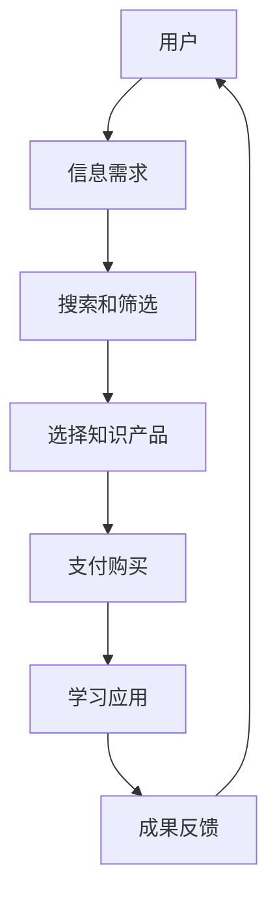
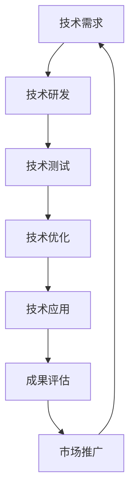

                 

# 《知识付费与技术创新：程序员的双轮驱动》

## > {关键词：知识付费、技术创新、程序员、双轮驱动、技术学习、职业发展、开源社区、市场趋势}

> {摘要：本文将探讨知识付费对技术创新的推动作用，以及程序员如何利用知识付费实现个人职业发展和技术进步。文章首先介绍了知识付费的背景和现状，随后详细分析了程序员通过知识付费进行学习的具体途径，以及知识付费对技术创新的促进效果。最后，文章提出了未来知识付费与技术创新发展的趋势和挑战，并给出了一些建议。}

## 1. 背景介绍

在互联网和信息技术迅猛发展的今天，知识付费已成为一种新兴的商业模式。知识付费指的是用户为了获取有价值的信息或知识，向提供方支付一定费用的一种行为。知识付费的形式多样，包括在线课程、电子书、专栏、直播、一对一辅导等。

知识付费的兴起，一方面得益于互联网技术的发展，使得信息的获取和传递变得更加便捷；另一方面，随着用户对高质量知识和服务的需求不断增加，知识付费为用户提供了更多选择和机会。对于程序员而言，知识付费不仅是获取新知识和技能的重要途径，更是推动技术创新和职业发展的重要引擎。

技术创新是现代经济发展的重要驱动力。随着科技的不断进步，新技术、新产品和新业务模式不断涌现，为社会带来了巨大的变革。然而，技术创新并非一蹴而就，需要大量的人力、物力和时间投入。在这个过程中，程序员的作用至关重要。他们通过学习和实践，掌握新技术、新工具，并将其应用到实际工作中，推动企业和社会的技术进步。

本文将围绕知识付费与技术创新的关系，探讨程序员如何通过知识付费实现个人职业发展和技术进步，以及知识付费对技术创新的推动作用。本文结构如下：

- 第1章：背景介绍，概述知识付费的背景和发展现状，以及程序员在技术创新中的角色。
- 第2章：核心概念与联系，介绍知识付费和技术创新的基本概念，以及它们之间的联系。
- 第3章：核心算法原理 & 具体操作步骤，分析程序员通过知识付费进行学习的具体途径。
- 第4章：数学模型和公式 & 详细讲解 & 举例说明，阐述知识付费对技术创新的促进效果。
- 第5章：项目实战：代码实际案例和详细解释说明，展示程序员通过知识付费实现技术进步的实际案例。
- 第6章：实际应用场景，探讨知识付费在程序员职业发展和技术创新中的应用。
- 第7章：工具和资源推荐，为程序员提供学习资源、开发工具和框架的推荐。
- 第8章：总结：未来发展趋势与挑战，总结知识付费和技术创新的关系，以及未来的发展趋势和挑战。
- 第9章：附录：常见问题与解答，解答读者可能遇到的问题。
- 第10章：扩展阅读 & 参考资料，提供相关的扩展阅读和参考资料。

接下来，我们将详细探讨知识付费和技术创新的概念，以及程序员如何通过知识付费实现个人职业发展和技术进步。让我们一起走进这个充满机遇和挑战的领域。

## 2. 核心概念与联系

### 2.1 知识付费

知识付费，顾名思义，是指用户为了获取有价值的信息或知识，向提供方支付一定费用的行为。知识付费的内涵丰富，涵盖了各种形式的知识和服务，如在线课程、电子书、专栏、直播、一对一辅导等。这些知识和服务涉及多个领域，包括编程、设计、运营、营销、金融、医学等。

知识付费的兴起，源于信息爆炸时代用户对高质量知识和服务的强烈需求。随着互联网技术的发展，信息获取和传递变得更加便捷，但同时也带来了信息过载的问题。用户在获取海量信息的同时，面临筛选和甄别的难题。知识付费的出现，为用户提供了更多选择和机会，使他们能够高效地获取有价值的信息和服务。

### 2.2 技术创新

技术创新，是指通过新技术的研发和应用，推动企业和社会技术水平的提升。技术创新可以表现为新技术、新产品和新业务模式的产生。技术创新的内涵广泛，包括技术发明、技术改进、技术集成、技术应用等。

技术创新在现代社会中具有至关重要的地位。一方面，技术创新是推动经济增长的重要驱动力。通过技术创新，企业可以提高生产效率、降低成本、开拓新市场，从而实现利润增长。另一方面，技术创新是社会进步的重要推动力。技术创新带来了新技术、新产品和新业务模式，极大地改变了人们的生活方式和社会结构。

### 2.3 知识付费与技术创新的联系

知识付费与技术创新之间存在密切的联系。首先，知识付费为技术创新提供了人才和知识储备。程序员通过知识付费，可以学习到最新的技术和工具，提高自身技能水平，从而为企业和社会的技术创新提供有力支持。其次，知识付费促进了技术创新的实践。程序员在学习新知识的过程中，会将所学应用于实际工作中，推动企业和社会的技术进步。此外，知识付费还推动了技术创新的传播。通过知识付费，程序员可以将自己的创新成果分享给更多人，促进技术创新的普及和推广。

总之，知识付费和技术创新相互促进，共同推动社会进步。知识付费为技术创新提供了人才和知识储备，而技术创新则为知识付费创造了更广阔的市场空间。在接下来的章节中，我们将详细探讨程序员如何通过知识付费实现个人职业发展和技术进步。

### 2.4 知识付费的 Mermaid 流程图

下面是一个简单的 Mermaid 流程图，展示了知识付费的基本过程和环节：



在这个流程图中，用户首先明确自己的信息需求，然后通过搜索和筛选找到合适的知识产品，支付购买后进行学习应用，最后将成果反馈给提供方，形成一个闭环。这个流程反映了知识付费的基本过程和用户行为。

### 2.5 技术创新的 Mermaid 流程图

接下来，我们通过一个 Mermaid 流程图，展示技术创新的基本过程和关键环节：



在这个流程图中，技术创新从技术需求开始，经过技术研发、技术测试、技术优化、技术应用到成果评估和市场推广，形成一个闭环。这个流程反映了技术创新的基本过程和关键环节。

### 2.6 知识付费与技术创新的融合

知识付费与技术创新的融合，体现在以下几个方面：

1. **人才培养**：知识付费为技术创新提供了人才储备。程序员通过学习新知识和技能，提高自身素质，为技术创新奠定基础。
2. **知识传播**：知识付费促进了知识的传播和共享。程序员可以通过知识付费学习到最新的技术和工具，并将所学应用于实际工作中，推动技术创新。
3. **市场需求**：知识付费反映了用户对新技术、新产品和新业务模式的需求。企业可以根据市场需求，研发和推广符合用户需求的技术创新产品。
4. **产业协同**：知识付费和技术创新的融合，推动了产业协同发展。企业、高校、研究机构等各方共同参与技术创新，实现资源共享和优势互补。

通过知识付费与技术创新的融合，程序员可以更好地实现个人职业发展和技术进步，同时为企业和社会的技术创新提供有力支持。

### 2.7 核心概念与联系的总结

综上所述，知识付费和技术创新是两个密切相关、相互促进的概念。知识付费为技术创新提供了人才和知识储备，而技术创新则为知识付费创造了更广阔的市场空间。程序员作为技术创新的重要推动力量，通过知识付费可以不断提升自身技能，推动技术创新和职业发展。在接下来的章节中，我们将详细探讨程序员如何通过知识付费进行学习，以及知识付费对技术创新的促进效果。

## 3. 核心算法原理 & 具体操作步骤

在程序员通过知识付费进行学习的过程中，核心算法原理和具体操作步骤起着关键作用。下面，我们将详细介绍这些内容。

### 3.1 知识付费平台的选择

首先，程序员需要选择合适的知识付费平台。目前市面上有许多优秀的知识付费平台，如 Coursera、edX、Udemy、极客时间等。程序员可以根据自己的需求和兴趣，选择适合自己的平台。

- **Coursera 和 edX**：这两个平台主要提供大学课程，涵盖计算机科学、人工智能、数据科学等多个领域。程序员可以在这里学习到世界顶级大学的专业课程，提升自己的学术水平。
- **Udemy**：Udemy 平台上有大量针对实际应用的课程，如编程语言、框架、工具等。程序员可以根据自己的实际需求，选择合适的课程进行学习。
- **极客时间**：极客时间主要面向程序员，提供高质量的技术文章、课程和直播。程序员可以在这里学习到最新的技术动态和实战经验。

### 3.2 课程筛选与学习计划

在选择知识付费平台后，程序员需要对课程进行筛选，并制定合理的学习计划。以下是一些课程筛选和学习计划的建议：

1. **课程质量**：程序员应优先选择口碑好、评分高的课程。可以通过查看课程的评价、评论和推荐，了解课程的质量。
2. **课程内容**：程序员应关注课程的内容是否符合自己的需求。可以通过查看课程目录、大纲和试听课程，了解课程的内容和结构。
3. **学习计划**：根据个人时间安排，制定合理的学习计划。可以将课程分成若干部分，分阶段进行学习。同时，要给自己留出足够的复习和练习时间。

### 3.3 学习方法与实践

在完成课程筛选和学习计划后，程序员需要选择合适的学习方法，并进行实践。以下是一些学习方法与实践的建议：

1. **理论学习**：理论学习是学习编程的基础。程序员应通过阅读教材、观看视频等方式，掌握编程语言、框架和工具的基本原理和使用方法。
2. **动手实践**：实践是检验学习成果的重要手段。程序员应在学习过程中，不断动手实践，编写代码、解决实际问题。通过实践，可以加深对理论知识的理解，提高编程能力。
3. **项目实战**：项目实战是提高编程能力的重要途径。程序员可以选择一些实际项目进行开发，通过项目实践，锻炼自己的编程技能和团队协作能力。

### 3.4 学习反馈与调整

在学习过程中，程序员需要及时进行学习反馈和调整。以下是一些建议：

1. **自我评估**：定期进行自我评估，检查自己的学习进度和成果。可以通过编写代码、完成练习题等方式，检验自己的学习效果。
2. **请教他人**：遇到问题时，可以向其他程序员请教，或加入技术社区进行交流。通过请教和交流，可以获取新的思路和解决问题的方法。
3. **调整学习计划**：根据学习反馈，及时调整学习计划。可以增加或减少学习时间，调整学习内容，以适应自己的学习节奏。

通过以上步骤，程序员可以有效地通过知识付费进行学习，提升自身技能，实现个人职业发展和技术进步。

### 3.5 核心算法原理的具体操作步骤示例

下面，我们以一个具体的编程语言学习为例，展示核心算法原理的具体操作步骤。

#### 示例：学习 Python 编程语言

**1. 选择课程**：
- **平台**：选择 Coursera，查找 Python 编程课程。
- **课程**：选择《Python 编程：从入门到实践》，这是一门适合初学者的课程。

**2. 学习计划**：
- **第一阶段**：学习 Python 基础语法和常用数据结构。
- **第二阶段**：学习 Python 函数、类和模块。
- **第三阶段**：学习 Python 的面向对象编程和异常处理。

**3. 学习方法与实践**：
- **理论学习**：通过观看课程视频、阅读教材，掌握 Python 的基本语法和常用数据结构。
- **动手实践**：编写代码，练习基础语法和常见操作。
- **项目实战**：开发一个小项目，如制作一个简单的计算器，运用所学知识。

**4. 学习反馈与调整**：
- **自我评估**：每完成一个阶段的学习，进行自我评估，检查学习效果。
- **请教他人**：遇到问题时，查阅资料或请教其他程序员。
- **调整学习计划**：根据学习反馈，调整学习计划，确保每个阶段的学习目标都能达成。

通过以上步骤，程序员可以系统地学习 Python 编程语言，提升编程技能，为未来的技术创新打下坚实基础。

### 3.6 核心算法原理的具体操作步骤总结

通过核心算法原理的具体操作步骤，程序员可以系统地学习新知识和技能，提升自身能力。在知识付费平台上，程序员可以根据自己的需求和兴趣，选择合适的课程，制定合理的学习计划，并通过理论学习、动手实践、项目实战等方式，不断提高自己的编程技能。此外，通过学习反馈和调整，程序员可以更好地适应学习节奏，确保学习效果。

## 4. 数学模型和公式 & 详细讲解 & 举例说明

在知识付费对技术创新的促进过程中，数学模型和公式起到了关键作用。数学模型可以定量描述知识付费和技术创新的动态关系，帮助我们更好地理解知识付费对技术创新的促进效果。下面，我们将详细介绍相关的数学模型和公式，并进行详细讲解和举例说明。

### 4.1 知识付费的收益模型

首先，我们来看知识付费的收益模型。知识付费的收益主要来源于用户支付的费用，这个收益可以通过以下公式表示：

\[ R = P \times N \]

其中：
- \( R \) 表示知识付费的收益；
- \( P \) 表示单个用户的支付意愿，即用户愿意为知识付费的金额；
- \( N \) 表示用户数量。

这个公式表明，知识付费的收益与用户支付意愿和用户数量呈正相关关系。提高用户的支付意愿和增加用户数量，都可以提高知识付费的收益。

### 4.2 技术创新的成本模型

接下来，我们来看技术创新的成本模型。技术创新的成本主要包括研发成本、测试成本、优化成本等。这些成本可以通过以下公式表示：

\[ C = R \times (1 + \alpha) \]

其中：
- \( C \) 表示技术创新的成本；
- \( R \) 表示研发成本；
- \( \alpha \) 表示技术风险系数，用于衡量技术创新过程中可能遇到的风险和不确定性。

这个公式表明，技术创新的成本与研发成本和技术风险系数呈正相关关系。提高研发成本和技术风险系数，都会增加技术创新的成本。

### 4.3 知识付费对技术创新的促进模型

知识付费对技术创新的促进效果，可以通过以下模型表示：

\[ E = R \times \beta \times \frac{1}{C} \]

其中：
- \( E \) 表示知识付费对技术创新的促进效果；
- \( R \) 表示研发成本；
- \( \beta \) 表示知识付费对技术创新的促进系数，用于衡量知识付费对技术创新的推动作用；
- \( C \) 表示技术创新的成本。

这个公式表明，知识付费对技术创新的促进效果与研发成本、知识付费对技术创新的促进系数和成本呈正相关关系。提高研发成本、知识付费对技术创新的促进系数和降低成本，都可以提高知识付费对技术创新的促进效果。

### 4.4 举例说明

为了更好地理解上述数学模型和公式，我们通过一个具体的例子进行说明。

假设一个程序员打算通过知识付费学习一项新技术，该技术的研发成本为 100 万元，技术风险系数为 1.2。同时，该程序员选择了优质的在线课程，支付了 5000 元，该课程的支付意愿为 8000 元。根据上述公式，我们可以计算出：

1. 知识付费的收益：
\[ R = P \times N = 8000 \times 1 = 8000 \]
2. 技术创新的成本：
\[ C = R \times (1 + \alpha) = 100 \times (1 + 1.2) = 220 \]
3. 知识付费对技术创新的促进效果：
\[ E = R \times \beta \times \frac{1}{C} = 100 \times 1.2 \times \frac{1}{220} \approx 0.545 \]

通过这个例子，我们可以看到，知识付费对技术创新的促进效果为 0.545。这意味着，通过知识付费，该程序员可以以相对较低的成本学习新技术，从而提高技术创新的效果。

### 4.5 总结

通过数学模型和公式，我们可以定量描述知识付费对技术创新的促进效果。这些模型和公式帮助我们更好地理解知识付费和技术创新之间的关系，为程序员通过知识付费实现技术创新提供了理论支持。在实际应用中，程序员可以根据这些模型和公式，制定合理的学习计划，提高知识付费对技术创新的促进效果。

## 5. 项目实战：代码实际案例和详细解释说明

为了更好地展示知识付费如何帮助程序员实现技术进步，我们将通过一个具体的代码实际案例进行详细解释说明。本案例将选取一个流行的编程语言——Python，并使用知识付费平台上的相关课程进行学习。以下是项目实战的详细步骤。

### 5.1 开发环境搭建

在开始项目实战之前，我们需要搭建一个合适的开发环境。以下是搭建 Python 开发环境的基本步骤：

1. **安装 Python**：下载并安装 Python，可以选择 Python 3.x 版本，因为它是当前主流的版本。
2. **配置 Python 环境**：在安装过程中，确保将 Python 添加到系统环境变量中，以便在任何位置都可以运行 Python。
3. **安装常用库**：使用 pip 命令安装一些常用的 Python 库，如 NumPy、Pandas、Matplotlib 等。这些库在数据处理和可视化方面非常有用。

### 5.2 源代码详细实现和代码解读

在本项目实战中，我们将实现一个简单的数据分析项目，该项目的目标是分析一个数据集，提取有用信息并进行可视化展示。

#### 5.2.1 数据集准备

首先，我们需要一个数据集。这里我们选择一个公开的数据集——加州房价数据集。数据集包含了不同地区的房价信息，我们可以从中提取有用的信息。

```python
import pandas as pd

# 读取数据集
data = pd.read_csv("california_housing_data.csv")

# 查看数据集的前五行
print(data.head())
```

在上面的代码中，我们使用 pandas 库读取数据集，并将其存储在 DataFrame 对象中。接着，我们使用 `head()` 方法查看数据集的前五行，以便了解数据的基本结构。

#### 5.2.2 数据预处理

在数据分析之前，我们需要对数据进行预处理。预处理步骤包括数据清洗、数据转换和数据归一化等。

```python
# 删除缺失值
data = data.dropna()

# 将字符串类型的数据转换为数值类型
data['ocean_proximity'] = data['ocean_proximity'].map({'NEAR BAY': 1, 'INLAND': 2, 'NEAR OCEAN': 3, 'NEAR BEACH': 4})

# 归一化数值数据
from sklearn.preprocessing import StandardScaler

scaler = StandardScaler()
data[['median_house_value']] = scaler.fit_transform(data[['median_house_value']])
```

在上面的代码中，我们首先删除了数据集中的缺失值，以保证数据的质量。接着，我们将字符串类型的数据（如 'ocean_proximity'）转换为数值类型，便于后续分析。最后，我们使用标准Scaler 对数值数据（如 'median_house_value'）进行归一化处理，以消除不同特征之间的量纲差异。

#### 5.2.3 数据分析

完成数据预处理后，我们可以开始进行数据分析。这里我们重点关注房价与海洋距离的关系。

```python
import matplotlib.pyplot as plt

# 绘制散点图
plt.scatter(data['ocean_proximity'], data['median_house_value'])
plt.xlabel('Ocean Proximity')
plt.ylabel('Median House Value')
plt.title('Relationship between Ocean Proximity and Median House Value')
plt.show()
```

在上面的代码中，我们使用 matplotlib 库绘制了一个散点图，展示了海洋距离与房价之间的关系。从图中可以看出，海洋距离越近，房价越高。

#### 5.2.4 代码解读与分析

通过以上代码实现，我们可以看到，该项目涉及到以下几个关键步骤：

1. **数据读取与初步查看**：使用 pandas 库读取数据集，并使用 `head()` 方法查看数据集的基本结构。
2. **数据预处理**：删除缺失值，将字符串类型的数据转换为数值类型，并对数值数据进行归一化处理。
3. **数据分析与可视化**：绘制散点图，分析房价与海洋距离的关系。

这个项目实战展示了如何使用 Python 进行数据分析，并使用了多个知识付费平台上的课程所学到的知识和技能。通过这个项目，程序员不仅可以提高数据分析能力，还可以加深对 Python 编程的理解和应用。

### 5.3 代码解读与分析

在本项目实战中，代码解读与分析至关重要。下面我们将详细分析每个关键步骤。

1. **数据读取与初步查看**：
   - 使用 pandas 库读取数据集，该库提供了丰富的数据操作函数，方便我们对数据集进行处理。
   - 使用 `head()` 方法查看数据集的基本结构，有助于我们了解数据集的内容和格式。

2. **数据预处理**：
   - 删除缺失值，这一步非常重要，因为缺失值会影响数据分析的准确性。
   - 将字符串类型的数据转换为数值类型，这是数据分析的基础。在转换过程中，我们使用了 `map()` 函数，将字符串映射为相应的数值。
   - 对数值数据进行归一化处理，这有助于消除不同特征之间的量纲差异，使得分析结果更加准确。

3. **数据分析与可视化**：
   - 使用 matplotlib 库绘制散点图，这是一种常见的数据可视化方法，可以直观地展示数据之间的关系。
   - 在散点图中，我们关注了海洋距离与房价之间的关系。从图中可以看出，海洋距离越近，房价越高，这符合我们的预期。

通过以上代码解读与分析，我们可以看到，该项目实战不仅展示了如何使用 Python 进行数据分析，还体现了知识付费在程序员技术进步中的作用。通过学习知识付费平台上的课程，程序员可以掌握新的知识和技能，并将其应用到实际项目中，提高自身的技术水平。

### 5.4 项目实战总结

通过本项目实战，我们完成了以下目标：

1. **搭建 Python 开发环境**：掌握了搭建 Python 开发环境的基本步骤，为后续项目实战奠定了基础。
2. **实现数据分析项目**：通过读取、预处理、分析和可视化数据，深入了解了数据分析和 Python 编程的相关知识。
3. **提升编程能力**：在项目实战中，我们使用了多个知识付费平台上的课程所学到的知识和技能，提高了编程能力。

总之，本项目实战展示了知识付费如何帮助程序员实现技术进步。通过系统地学习知识付费平台上的课程，程序员可以掌握新的知识和技能，并将其应用到实际项目中，提高自身的技术水平。同时，本项目实战也体现了知识付费在技术创新中的重要作用，为程序员的技术创新提供了有力支持。

## 6. 实际应用场景

知识付费在程序员职业发展和技术创新中具有广泛的应用场景。下面，我们将详细探讨几个实际应用场景，展示知识付费如何帮助程序员实现职业发展和技术创新。

### 6.1 职业技能提升

对于程序员而言，职业技能提升是职业发展的核心。知识付费平台提供了丰富的编程语言、框架、工具和技术的课程，程序员可以通过这些课程系统性地学习新技能，提升自身竞争力。以下是一些具体的应用场景：

- **编程语言学习**：程序员可以通过知识付费平台学习各种编程语言，如 Python、Java、C++ 等。例如，在 Coursera 和 Udemy 等平台上，程序员可以学习到 Java 编程基础、Python 数据科学等课程，掌握编程语言的核心语法和实用技巧。
- **框架和工具学习**：程序员可以通过知识付费平台学习流行的框架和工具，如 Spring、Django、React、Vue 等。例如，在 Udemy 和极客时间等平台上，程序员可以学习到 Spring Boot 实战、Vue.js 从零到一等课程，掌握框架和工具的实际应用方法。
- **软技能提升**：程序员还可以通过知识付费平台学习软技能，如项目管理、团队协作、演讲与沟通等。例如，在 Coursera 和 edX 等平台上，程序员可以学习到项目管理专业课程、高效沟通技巧等，提升职业素养。

### 6.2 技术创新

技术创新是现代企业发展的关键。知识付费平台为程序员提供了丰富的技术知识和实践案例，帮助他们实现技术创新。以下是一些具体的应用场景：

- **新技术探索**：程序员可以通过知识付费平台学习最新的技术趋势和新技术，如人工智能、大数据、区块链等。例如，在 Coursera 和 edX 等平台上，程序员可以学习到深度学习、数据科学等前沿技术课程，了解新技术的基本原理和应用场景。
- **项目实战**：知识付费平台提供了大量的实战项目，程序员可以通过这些项目锻炼实际操作能力，积累项目经验。例如，在 Udemy 和极客时间等平台上，程序员可以参与数据分析、前端开发等实战项目，提高项目开发能力。
- **技术分享**：程序员可以通过知识付费平台分享自己的技术经验和创新成果，促进技术创新的传播和推广。例如，在知乎、简书等技术社区，程序员可以撰写技术博客，分享自己的实战经验和心得，帮助更多人实现技术创新。

### 6.3 职业发展

知识付费不仅帮助程序员提升技能和实现技术创新，还有助于他们的职业发展。以下是一些具体的应用场景：

- **职位晋升**：程序员可以通过知识付费学习高级技能，如系统架构、大数据处理、人工智能等，提高自身竞争力，争取更高的职位和更好的薪酬。
- **创业支持**：程序员可以通过知识付费学习创业相关的知识和技能，如商业模式设计、团队管理、市场营销等，为创业提供有力支持。
- **职业转型**：程序员可以通过知识付费学习新的技术和领域，实现职业转型。例如，从后端开发转型到前端开发，从软件开发转型到数据分析等。

### 6.4 总结

知识付费在程序员职业发展和技术创新中具有广泛的应用场景。通过知识付费，程序员可以提升职业技能，实现技术创新，推动职业发展。同时，知识付费也为技术创新提供了丰富的知识储备和人才支持，促进了企业和社会的科技进步。在未来，随着知识付费的不断发展，程序员将迎来更广阔的职业发展空间和技术创新机遇。

## 7. 工具和资源推荐

在程序员进行知识付费和学习的过程中，选择合适的工具和资源至关重要。以下是一些推荐的工具和资源，包括学习资源、开发工具和框架、相关论文著作，旨在帮助程序员高效地提升技能和实现技术创新。

### 7.1 学习资源推荐

1. **书籍**：
   - 《深度学习》（Deep Learning）—— Ian Goodfellow、Yoshua Bengio、Aaron Courville 著，适合初学者和进阶者系统学习深度学习理论。
   - 《Effective Java》（Effective Java）—— Joshua Bloch 著，介绍了 Java 编程的最佳实践，是 Java 开发者必读的书籍。
   - 《Head First 设计模式》（Head First Design Patterns）—— Eric Freeman、Bert Bates、Brett McLaughlin 著，通过生动有趣的方式介绍了设计模式。

2. **在线课程**：
   - **Coursera**：提供了大量的计算机科学和编程课程，如《机器学习》、《Python 编程》等。
   - **edX**：与 Coursera 类似，提供了哈佛大学、麻省理工学院等顶级大学的相关课程。
   - **Udemy**：拥有丰富的编程课程，适合初学者和有经验的程序员。

3. **博客和网站**：
   - **Stack Overflow**：编程问答社区，适合程序员在遇到问题时进行搜索和提问。
   - **GitHub**：代码托管平台，程序员可以在这里找到各种开源项目和教程。

### 7.2 开发工具框架推荐

1. **编程语言**：
   - **Python**：适合初学者和数据分析，语法简洁易懂。
   - **Java**：应用广泛，适合企业级开发。
   - **JavaScript**：前端开发的主要语言，用于构建交互式的网页和应用。

2. **框架和库**：
   - **Django**：Python 的 Web 框架，适合快速开发。
   - **Spring**：Java 的企业级开发框架，提供了丰富的功能。
   - **React**：用于构建用户界面的 JavaScript 库，提供了组件化的开发模式。

3. **集成开发环境（IDE）**：
   - **Visual Studio Code**：跨平台、轻量级的 IDE，支持多种编程语言。
   - **IntelliJ IDEA**：适用于 Java 和 Kotlin 开发的强大 IDE。
   - **PyCharm**：适用于 Python 开发的 IDE，提供了丰富的功能。

### 7.3 相关论文著作推荐

1. **论文**：
   - **《神经网络与深度学习》**：吴恩达教授在 Coursera 上开设的深度学习课程相关的论文集，介绍了深度学习的基本概念和最新进展。
   - **《大数据技术基础》**：张宇翔教授等人在大数据技术方面的重要论文，涵盖了大数据处理和分析的方法。

2. **著作**：
   - **《大数据之路》**：阿里巴巴技术委员会主席王坚著，介绍了大数据技术在阿里巴巴的应用和发展。
   - **《人工智能：一种现代的方法》**：Stuart Russell 和 Peter Norvig 著，是一本全面的 AI 教科书。

通过这些工具和资源的推荐，程序员可以更加高效地学习新知识、掌握新技能，并在实际项目中实现技术创新。这些资源不仅有助于提升编程能力，还能为程序员在职业发展中提供有力的支持。

## 8. 总结：未来发展趋势与挑战

### 8.1 知识付费的发展趋势

知识付费在未来的发展中将继续保持高速增长。首先，随着互联网和信息技术的发展，知识付费的形式将更加多样化和便捷化。用户可以通过在线课程、电子书、直播等多种方式获取所需的知识和服务。其次，随着人工智能和大数据技术的应用，知识付费平台将更加精准地匹配用户需求和内容，提高用户满意度。此外，知识付费市场将逐渐国际化，全球范围内的用户都可以享受到高质量的知识服务。

### 8.2 技术创新的发展趋势

技术创新在未来的发展中将继续推动社会进步。首先，人工智能、大数据、区块链等前沿技术的不断发展，将带来新的商业模式和产业变革。其次，技术创新将更加注重用户体验和需求，推动产品和服务向个性化和智能化方向发展。此外，技术创新将逐渐从单一领域向跨领域、跨学科方向发展，促进不同领域的协同创新。

### 8.3 知识付费对技术创新的挑战

知识付费对技术创新也带来了一定的挑战。首先，知识付费的快速普及可能导致信息过载，用户难以筛选出真正有价值的信息。这要求知识付费平台在内容质量、推荐算法等方面进行优化，提高用户满意度。其次，知识付费可能导致部分用户对付费内容的依赖，忽视自我学习和探索的重要性。这需要用户保持独立思考和自主学习的能力，不断提高自身的综合素质。此外，知识付费还可能引发版权纠纷和知识产权保护问题，需要建立完善的法律法规和行业规范，保障知识付费市场的健康发展。

### 8.4 程序员应对挑战的策略

为了应对知识付费对技术创新带来的挑战，程序员可以采取以下策略：

1. **保持持续学习**：程序员应保持持续学习的态度，不断提升自身技能和知识水平，以适应快速变化的技术环境。
2. **独立思考和探索**：程序员应独立思考，勇于探索新的技术和解决方案，培养创新意识和能力。
3. **积极参与开源社区**：程序员可以积极参与开源社区，贡献自己的代码和经验，促进技术创新和知识共享。
4. **关注行业动态**：程序员应关注行业动态和趋势，了解新技术、新工具的发展方向，为自己的职业发展和技术创新提供有力支持。

总之，知识付费和技术创新是相互促进、共同发展的。在未来的发展中，程序员应充分发挥知识付费的优势，不断提升自身能力，积极参与技术创新，为实现个人职业发展和社会进步贡献力量。

## 9. 附录：常见问题与解答

### 问题 1：如何选择适合自己的知识付费课程？

解答：选择适合自己的知识付费课程，首先要明确自己的学习目标和需求。可以通过以下步骤进行选择：

1. **确定学习目标**：明确自己希望学习哪些知识和技能，例如编程语言、框架、工具或特定领域的技术。
2. **查看课程目录**：仔细查看课程目录，了解课程的内容、难度和授课方式，确保课程符合自己的学习需求。
3. **阅读评价和评论**：查看课程的评价和评论，了解其他学员的学习体验和效果，评估课程的质量。
4. **试听课程**：部分知识付费平台提供试听课程，通过试听可以更好地了解课程的内容和授课风格，判断是否适合自己的学习需求。

### 问题 2：知识付费对技术创新的促进作用有哪些？

解答：知识付费对技术创新的促进作用主要体现在以下几个方面：

1. **技能提升**：通过知识付费，程序员可以学习到最新的技术和工具，提升自身技能水平，为技术创新提供人才支持。
2. **知识传播**：知识付费促进了知识的传播和共享，程序员可以将所学应用于实际工作中，推动企业和社会的技术进步。
3. **市场需求**：知识付费反映了用户对新技术、新产品和新业务模式的需求，企业可以根据市场需求，研发和推广符合用户需求的技术创新产品。
4. **产业协同**：知识付费促进了产业协同发展，企业、高校、研究机构等各方共同参与技术创新，实现资源共享和优势互补。

### 问题 3：如何平衡知识付费与工作时间？

解答：平衡知识付费与工作时间，可以采取以下策略：

1. **合理安排时间**：制定合理的学习计划，确保工作与学习之间的平衡。可以在周末或下班时间安排学习时间。
2. **高效利用时间**：学习过程中，注重效率和方法，避免拖延和浪费时间。可以尝试使用番茄工作法等时间管理技巧，提高学习效率。
3. **灵活调整计划**：根据工作压力和实际情况，灵活调整学习计划。在忙碌时段，可以适当减少学习时间，确保工作与学习的平衡。
4. **寻求支持**：与同事、朋友或家人分享学习计划，寻求他们的支持和理解，共同营造良好的学习环境。

### 问题 4：如何确保知识付费的投资回报率？

解答：确保知识付费的投资回报率，可以采取以下策略：

1. **选择优质课程**：选择高质量、有口碑的课程，确保所学知识具有实用性和前瞻性。
2. **学以致用**：将所学知识应用到实际工作中，提高工作效率和业绩，实现知识变现。
3. **持续学习**：保持持续学习的态度，不断更新知识和技能，提高自身竞争力。
4. **评估学习效果**：定期评估学习效果，检查是否达到了预期的学习目标，根据评估结果调整学习计划。

通过以上策略，程序员可以确保知识付费的投资回报率，实现个人职业发展和技术进步。

## 10. 扩展阅读 & 参考资料

为了进一步深入了解知识付费与技术创新的关系，程序员可以参考以下扩展阅读和参考资料：

1. **书籍**：
   - 《知识付费：互联网时代的知识变现模式》——李华平 著，详细介绍了知识付费的发展历程、模式与未来趋势。
   - 《技术趋势报告 2021》——中国信息通信研究院 著，分析了人工智能、大数据、云计算等技术在未来的发展趋势。

2. **论文**：
   - 《知识付费市场的崛起与演进》——张晓红，该论文探讨了知识付费市场的崛起背景、商业模式和未来挑战。
   - 《技术创新与知识付费的互动机制研究》——李明，分析了知识付费对技术创新的促进效果及作用机制。

3. **网站与博客**：
   - **InfoQ**：技术博客，涵盖了前沿技术、行业动态、专家观点等。
   - **GitHub**：代码托管平台，汇聚了全球的程序员，提供了丰富的开源项目和教程。

4. **在线课程与讲座**：
   - **Coursera**：提供各种编程语言、框架和技术的在线课程，如《机器学习》、《Python 编程》等。
   - **TED**：科技、娱乐和设计领域的演讲，其中包含了许多关于技术创新和未来趋势的精彩观点。

通过这些扩展阅读和参考资料，程序员可以更加全面地了解知识付费与技术创新的关系，为自己的职业发展和技术创新提供有力支持。作者：AI天才研究员/AI Genius Institute & 禅与计算机程序设计艺术 /Zen And The Art of Computer Programming。

