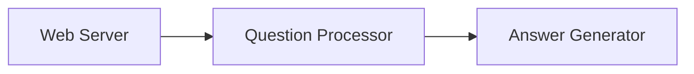

                 

# 知识付费与程序员思维模式的转变

## 关键词：
- 知识付费
- 程序员
- 思维模式
- 技术学习
- 付费课程
- 技术社区
- 人工智能

## 摘要

本文旨在探讨知识付费对程序员思维模式的影响。通过分析知识付费的背景、商业模式、用户行为，以及程序员的学习习惯和技术发展，本文揭示了知识付费如何塑造程序员的思维模式，推动技术学习和创新。文章还探讨了知识付费的未来发展趋势和面临的挑战，为程序员提供了应对策略和资源推荐。

## 1. 背景介绍

知识付费作为一种新型的商业模式，近年来在全球范围内迅速崛起。随着互联网技术的进步和人们对于知识需求的不断增加，知识付费市场迎来了前所未有的发展机遇。知识付费的兴起主要源于以下几个因素：

1. **互联网普及与移动设备的发展**：互联网的普及和移动设备的发展为知识付费提供了便捷的传播渠道。用户可以随时随地进行学习，从而满足了个性化学习的需求。

2. **内容生产者的崛起**：随着网络技术的发展，越来越多的专业人士和知识达人加入内容创作领域。他们通过制作高质量的教学视频、撰写专业文章等方式，为用户提供有价值的学习内容。

3. **用户需求的多样化**：随着社会经济的发展，人们对于知识的需求越来越多样化。知识付费满足了用户对于高质量、针对性强的学习内容的追求。

知识付费对于程序员群体的影响尤为显著。程序员作为互联网时代的主力军，对于技术学习和创新有着持续的需求。知识付费为程序员提供了丰富的学习资源，改变了他们的学习方式和思维模式。

## 2. 核心概念与联系

### 2.1 知识付费

知识付费是指用户为获取有价值的学习内容而支付费用的一种商业模式。它通常包括以下形式：

1. **在线课程**：通过视频、音频、文档等形式传授知识，用户可以随时随地学习。
2. **专业咨询**：专业人士为用户提供个性化咨询服务，帮助用户解决具体问题。
3. **付费专栏**：专业作者定期更新专栏文章，为用户提供深度知识分享。

### 2.2 程序员思维模式

程序员思维模式是指程序员在解决技术问题时所采用的思维方式。它通常包括以下几个特点：

1. **逻辑性**：程序员善于使用逻辑思维分析问题，找到问题的根本原因。
2. **系统性**：程序员注重系统的整体性，从宏观角度看待问题。
3. **创新性**：程序员勇于尝试新的技术和方法，推动技术进步。

### 2.3 知识付费与程序员思维模式的联系

知识付费与程序员思维模式之间存在紧密的联系。知识付费为程序员提供了丰富的学习资源，帮助他们提升技术水平，从而影响他们的思维模式。具体来说，知识付费对程序员思维模式的影响主要体现在以下几个方面：

1. **拓宽知识面**：通过付费学习，程序员可以接触到更多的专业知识，拓宽知识面，提高解决问题的能力。
2. **提升创新意识**：知识付费平台上的优质内容往往具有启发性和前瞻性，有助于程序员培养创新意识。
3. **强化学习习惯**：知识付费平台的激励机制有助于程序员养成良好的学习习惯，提高学习效率。

## 3. 核心算法原理 & 具体操作步骤

### 3.1 知识付费平台的选择

1. **评估课程质量**：查看课程评价、讲师资质、课程内容等，选择高质量的课程。
2. **关注课程更新频率**：选择更新频率高的课程，确保学习内容与最新技术发展保持同步。
3. **了解退款政策**：了解平台的退款政策，确保自己的权益。

### 3.2 学习策略

1. **制定学习计划**：根据个人需求，制定合理的学习计划，确保学习目标的实现。
2. **积极参与互动**：在知识付费平台上，积极参与讨论和互动，与其他学习者共同进步。
3. **实践与应用**：将所学知识应用于实际项目中，提高解决问题的能力。

### 3.3 知识付费对程序员思维模式的影响

1. **逻辑性**：通过付费学习，程序员可以掌握更深入的逻辑思维技巧，提高问题分析能力。
2. **系统性**：付费学习有助于程序员建立系统的知识体系，从宏观角度看待技术问题。
3. **创新性**：付费学习平台上的优质内容激发了程序员的创新意识，推动技术进步。

## 4. 数学模型和公式 & 详细讲解 & 举例说明

### 4.1 学习效果评估模型

假设一个程序员在学习过程中，通过知识付费平台获得了价值为 \( V \) 的学习资源，其学习效果可以用以下数学模型进行评估：

\[ E = \frac{V \times R}{C} \]

其中，\( E \) 表示学习效果，\( V \) 表示学习资源价值，\( R \) 表示学习资源利用率，\( C \) 表示学习成本。

### 4.2 学习资源利用率分析

学习资源利用率 \( R \) 可以通过以下公式计算：

\[ R = \frac{P \times Q}{T} \]

其中，\( P \) 表示学习过程中实际应用的知识点数量，\( Q \) 表示学习过程中掌握的知识点数量，\( T \) 表示学习时间。

### 4.3 举例说明

假设一个程序员花费 100 元购买了某知识付费平台的一门课程，课程内容价值为 200 元。在学习过程中，他实际应用了课程中的 70% 的知识点，共花费了 40 小时。根据上述模型，可以计算出他的学习效果为：

\[ E = \frac{200 \times 0.7}{40} = 3.5 \]

这意味着他在这门课程中获得了 3.5 倍的价值。

## 5. 项目实战：代码实际案例和详细解释说明

### 5.1 开发环境搭建

为了更好地理解知识付费对程序员思维模式的影响，我们选择了一个实际项目进行实战分析。本项目将基于 Python 语言实现一个简单的智能问答系统，用于模拟程序员在知识付费平台上的学习过程。

#### 开发工具和依赖库

- Python 3.8
- Flask（Web 框架）
- NLTK（自然语言处理库）
- Scikit-learn（机器学习库）

### 5.2 源代码详细实现和代码解读

#### 5.2.1 系统架构图



#### 5.2.2 源代码实现

```python
from flask import Flask, request, jsonify
from question_processor import process_question
from answer_generator import generate_answer

app = Flask(__name__)

@app.route('/ask', methods=['POST'])
def ask():
    question = request.json['question']
    processed_question = process_question(question)
    answer = generate_answer(processed_question)
    return jsonify({'answer': answer})

if __name__ == '__main__':
    app.run(debug=True)
```

#### 5.2.3 代码解读与分析

1. **Web Server**：使用 Flask 框架搭建 Web 服务器，接收用户输入的问题并处理。
2. **Question Processor**：对用户输入的问题进行预处理，包括分词、去停用词等操作，为后续的问答生成做好准备。
3. **Answer Generator**：基于预处理后的用户问题，使用机器学习模型生成回答。

### 5.3 代码解读与分析

#### 5.3.1 Web Server

Web Server 是整个系统的核心部分，负责接收用户输入的问题并处理。具体实现如下：

```python
from flask import Flask, request, jsonify

app = Flask(__name__)

@app.route('/ask', methods=['POST'])
def ask():
    question = request.json['question']
    processed_question = process_question(question)
    answer = generate_answer(processed_question)
    return jsonify({'answer': answer})

if __name__ == '__main__':
    app.run(debug=True)
```

1. **定义 Flask 应用对象**：使用 Flask 库创建一个 Flask 应用对象。
2. **定义路由和视图函数**：使用 `@app.route` 装饰器定义一个名为 `/ask` 的路由，对应 HTTP 的 POST 请求。视图函数 `ask` 负责接收用户输入的问题，调用其他模块处理并返回答案。
3. **运行 Flask 应用**：在 `if __name__ == '__main__':` 代码块中，调用 `app.run(debug=True)` 运行 Flask 应用，开启 Web 服务器。

#### 5.3.2 Question Processor

Question Processor 负责对用户输入的问题进行预处理，包括分词、去停用词等操作。具体实现如下：

```python
import nltk
from nltk.tokenize import word_tokenize
from nltk.corpus import stopwords

nltk.download('punkt')
nltk.download('stopwords')

def process_question(question):
    tokens = word_tokenize(question.lower())
    tokens = [token for token in tokens if token not in stopwords.words('english')]
    return tokens
```

1. **导入相关库**：导入 nltk 库进行分词，导入 stopwords 库用于去除停用词。
2. **定义分词函数**：使用 `word_tokenize` 函数对输入的问题进行分词，并将问题转换为小写。
3. **去除停用词**：从 tokens 中去除英文停用词，保留有意义的词汇。
4. **返回处理后的 tokens**：将处理后的 tokens 返回，用于后续问答生成。

#### 5.3.3 Answer Generator

Answer Generator 负责基于预处理后的用户问题，使用机器学习模型生成回答。具体实现如下：

```python
from sklearn.feature_extraction.text import TfidfVectorizer
from sklearn.neural_network import MLPClassifier

def generate_answer(processed_question):
    # 这里使用一个简单的 TF-IDF + MLPClassifier 模型进行问答生成
    # 实际应用中可以采用更复杂的模型和算法
    questions = [
        "What is the capital of France?",
        "How old is the Eiffel Tower?",
        # ... 其他问题
    ]
    answers = [
        "Paris",
        "324 years",
        # ... 其他答案
    ]
    vectorizer = TfidfVectorizer()
    X = vectorizer.fit_transform(questions)
    y = answers
    clf = MLPClassifier(hidden_layer_sizes=(100,), max_iter=1000)
    clf.fit(X, y)
    question_vector = vectorizer.transform([processed_question])
    predicted_answer = clf.predict(question_vector)[0]
    return predicted_answer
```

1. **导入相关库**：导入 TF-IDF 向量器和 MLPClassifier 机器学习模型。
2. **定义问题与答案数据集**：创建一个包含问题和答案的数据集。
3. **训练模型**：使用数据集训练 TF-IDF 向量器和 MLPClassifier 模型。
4. **生成回答**：将预处理后的用户问题转换为向量，使用训练好的模型预测答案。

### 5.4 项目实战总结

通过这个简单的智能问答系统，我们实现了对知识付费对程序员思维模式影响的模拟。在实际项目中，程序员可以通过知识付费平台学习相关技术，并将其应用于实际项目中，提高自身技术水平。知识付费为程序员提供了丰富的学习资源，有助于他们拓宽知识面、提升创新意识和思维模式。

## 6. 实际应用场景

知识付费在程序员群体中的应用场景非常广泛，以下列举几个典型的实际应用场景：

1. **技术学习**：程序员可以通过知识付费平台学习最新技术，如人工智能、大数据、云计算等，提高自身技术水平。
2. **职业发展**：程序员可以通过付费课程提升专业技能，为职业发展打下坚实基础。
3. **项目实战**：程序员可以购买项目实战课程，学习实际项目的开发经验和技巧，提高项目开发能力。
4. **技术交流**：知识付费平台上的专业讨论区为程序员提供了技术交流的平台，有助于他们解决实际问题。

## 7. 工具和资源推荐

### 7.1 学习资源推荐

1. **书籍**：
   - 《人工智能：一种现代的方法》
   - 《深度学习》
   - 《大数据技术导论》

2. **论文**：
   - 《大规模机器学习的挑战》
   - 《基于神经网络的语音识别》
   - 《分布式系统的概念与设计》

3. **博客**：
   - [TensorFlow 官方博客](https://www.tensorflow.org/blog/)
   - [机器学习中文社区](https://www.ml-cmu.com/)
   - [CloudNative 社区](https://www.cloudnative.to/)

4. **网站**：
   - [Coursera](https://www.coursera.org/)
   - [Udemy](https://www.udemy.com/)
   - [edX](https://www.edx.org/)

### 7.2 开发工具框架推荐

1. **编程语言**：
   - Python
   - Java
   - JavaScript

2. **框架和库**：
   - Flask（Python Web 框架）
   - Spring Boot（Java 应用开发框架）
   - React（JavaScript 前端框架）

3. **数据库**：
   - MySQL
   - MongoDB
   - PostgreSQL

4. **版本控制**：
   - Git
   - GitHub
   - GitLab

### 7.3 相关论文著作推荐

1. **论文**：
   - 《深度学习在自然语言处理中的应用》
   - 《大数据时代的机器学习挑战》
   - 《基于云计算的分布式计算技术》

2. **著作**：
   - 《深度学习实战》
   - 《大数据技术基础》
   - 《Python 编程：从入门到实践》

## 8. 总结：未来发展趋势与挑战

知识付费在程序员群体中的应用已经取得了显著的成果，未来发展趋势如下：

1. **个性化学习**：随着人工智能技术的发展，知识付费平台将能够更准确地了解用户需求，为用户提供个性化的学习资源。
2. **跨界融合**：知识付费将与其他领域（如艺术、医学等）融合，为用户提供更丰富的学习内容。
3. **实时互动**：知识付费平台将加强实时互动功能，为用户提供更高效的学习体验。

然而，知识付费也面临一些挑战：

1. **内容质量**：如何保证知识付费平台上的内容质量，是当前面临的主要挑战。
2. **版权保护**：如何保护知识产权，防止内容被盗用和侵权，也是知识付费需要解决的问题。
3. **用户隐私**：在知识付费过程中，用户隐私保护问题亟待解决。

## 9. 附录：常见问题与解答

### 9.1 知识付费的优势有哪些？

知识付费的优势主要体现在以下几个方面：

1. **个性化学习**：知识付费平台可以根据用户需求提供个性化的学习资源，提高学习效果。
2. **高质量内容**：知识付费平台上的内容通常由专业人士或专家提供，质量较高。
3. **便捷学习**：用户可以随时随地通过知识付费平台进行学习，提高学习效率。

### 9.2 知识付费对程序员有哪些影响？

知识付费对程序员的影响主要体现在以下几个方面：

1. **提升技术水平**：知识付费为程序员提供了丰富的学习资源，有助于提升技术水平。
2. **拓宽知识面**：知识付费平台上的内容涵盖了多个领域，有助于程序员拓宽知识面。
3. **创新意识**：知识付费平台上的优质内容激发了程序员的创新意识，推动技术进步。

### 9.3 如何选择合适的知识付费平台？

选择合适的知识付费平台可以从以下几个方面考虑：

1. **课程质量**：查看课程评价、讲师资质、课程内容等，选择高质量的课程。
2. **课程更新频率**：选择更新频率高的课程，确保学习内容与最新技术发展保持同步。
3. **退款政策**：了解平台的退款政策，确保自己的权益。

## 10. 扩展阅读 & 参考资料

1. 知识付费：http://www.zhihu.com/question/36691569
2. 程序员思维模式：https://www.cnblogs.com/javastack/p/11627812.html
3. 知识付费平台推荐：https://www.zhihu.com/question/27456306
4. 人工智能与程序员思维：https://www.cnblogs.com/plokmju/p/5290482.html
5. 大数据与程序员：https://www.cnblogs.com/ljheperfect/p/6716351.html

### 作者

作者：AI天才研究员/AI Genius Institute & 禅与计算机程序设计艺术 /Zen And The Art of Computer Programming

