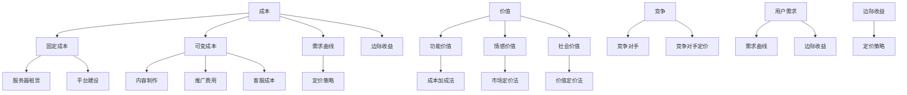

                 

### 背景介绍

知识付费产品，作为近年来互联网经济发展的重要产物，已经成为知识传播和技能提升的重要渠道。随着互联网技术的不断进步，用户对高质量、专业化知识的需求日益增加，知识付费市场呈现出蓬勃发展的态势。在这个背景下，如何合理制定知识付费产品的定价策略，成为企业、平台和个人知识创作者面临的重要课题。

本文旨在探讨知识付费产品定价策略，从多个角度深入分析影响定价的因素，并给出实用的定价方法和技巧。通过本文的阐述，希望能够帮助读者了解知识付费产品定价的核心原理，掌握有效的定价策略，从而在激烈的市场竞争中脱颖而出。

知识付费产品定价策略的研究具有以下几个重要意义：

1. **指导实践**：为知识付费产品的开发者、平台运营者以及个人创作者提供实用的定价指导，帮助他们更好地制定和调整定价策略。
2. **提升效益**：合理的定价策略能够提高知识付费产品的市场竞争力，吸引更多用户，从而实现产品效益的最大化。
3. **行业规范**：通过探讨定价策略，有助于形成行业共识，促进知识付费市场的健康发展。

本文将按照以下结构展开：

1. **核心概念与联系**：介绍知识付费产品定价的核心概念，包括成本、价值、竞争因素等，并使用Mermaid流程图展示各概念之间的关联。
2. **核心算法原理与具体操作步骤**：深入探讨常见的定价算法，如成本加成法、市场定价法、价值定价法等，并给出具体实施步骤。
3. **数学模型和公式**：阐述影响定价的数学模型和公式，如需求曲线、边际收益等，并举例说明。
4. **项目实战**：通过实际案例，展示如何将定价策略应用于知识付费产品的开发、推广和运营。
5. **实际应用场景**：分析不同场景下的定价策略，如单次购买、订阅模式、教育市场等。
6. **工具和资源推荐**：推荐相关学习资源、开发工具和框架，帮助读者深入学习和实践。
7. **总结**：总结本文的核心观点，探讨知识付费产品定价的未来发展趋势和挑战。

通过本文的阅读，读者将能够系统地了解知识付费产品定价的策略，掌握如何根据市场环境和用户需求制定合理的定价方案。让我们开始这场深入的知识付费产品定价之旅吧！ <|im_sep|>## 核心概念与联系

在探讨知识付费产品的定价策略之前，我们需要了解一些核心概念及其相互之间的联系。以下是本文涉及的关键概念：

### 成本

成本是指生产、开发和维护知识付费产品所需的一切资源投入，包括但不限于：

- **固定成本**：如服务器租赁、平台建设、版权购买等，不随生产量变化而变化。
- **可变成本**：如内容制作、推广费用、客服成本等，随生产量和销售量变化而变化。

### 价值

价值是用户对知识付费产品的认可和愿意支付的价格。它包括：

- **功能价值**：产品所提供的功能和服务满足用户需求的程度。
- **情感价值**：产品给用户带来的情感体验，如信任、满足感等。
- **社会价值**：产品在用户社交圈中的影响力，如口碑传播等。

### 竞争

竞争因素包括市场上的竞争对手、竞争对手的定价策略等。了解竞争对手的定价策略有助于我们制定更有针对性的定价策略。

### 用户需求

用户需求是定价策略制定的重要依据。了解用户需求，可以帮助我们确定产品的价值，并据此调整定价策略。

### 需求曲线

需求曲线反映了不同价格下用户对知识付费产品的需求量。通常情况下，价格越高，需求量越低；价格越低，需求量越高。

### 边际收益

边际收益是指每增加一单位销售所增加的总收益。了解边际收益有助于我们确定最佳定价策略，以实现收益最大化。

### Mermaid 流程图

为了更好地展示这些核心概念之间的联系，我们使用Mermaid流程图进行说明：



该流程图清晰地展示了成本、价值、竞争、用户需求等核心概念之间的关系，以及它们如何影响定价策略的制定。

### 成本与定价策略

成本是制定定价策略的基础。常见的定价方法包括：

- **成本加成法**：在成本基础上加上一定的利润率，从而确定产品价格。
- **市场定价法**：根据市场供需关系和竞争对手的定价，制定产品价格。
- **价值定价法**：根据用户对产品的认可和价值感知，制定产品价格。

### 价值与定价策略

价值决定了用户愿意支付的价格。在制定定价策略时，需要综合考虑产品的功能价值、情感价值和社会价值。例如：

- **功能价值高**的产品，可以采用较高的价格策略。
- **情感价值高**的产品，可以采用情感化的定价策略，如限时折扣、优惠券等。
- **社会价值高**的产品，可以采用公益定价策略，以提高用户忠诚度和口碑。

### 竞争与定价策略

了解竞争对手的定价策略有助于我们制定更有针对性的定价策略。例如：

- 如果竞争对手的定价较低，我们可以采用价格战策略，降低价格以吸引更多用户。
- 如果竞争对手的定价较高，我们可以采用差异化定价策略，强调产品独特的功能和价值。

### 用户需求与定价策略

用户需求是定价策略的重要依据。了解用户需求，可以帮助我们确定产品的价值，并据此调整定价策略。例如：

- 如果用户对产品的需求强烈，我们可以采用较高的定价策略。
- 如果用户对产品的需求一般，我们可以采用适中的定价策略。
- 如果用户对产品的需求较弱，我们可以采用较低的定价策略。

通过以上分析，我们可以看出，成本、价值、竞争和用户需求等因素共同影响着知识付费产品的定价策略。了解这些核心概念及其相互之间的联系，是制定有效定价策略的关键。在接下来的章节中，我们将进一步探讨定价算法和数学模型，以帮助读者更好地理解和应用这些策略。 <|im_sep|>## 核心算法原理与具体操作步骤

在制定知识付费产品的定价策略时，我们可以运用多种核心算法来帮助确定产品的价格。以下是几种常见的定价算法及其具体操作步骤：

### 1. 成本加成法

成本加成法是一种最简单的定价方法，其基本思路是在产品成本基础上加上一定的利润率。具体操作步骤如下：

#### 步骤一：确定固定成本和可变成本

首先，我们需要明确知识付费产品的固定成本和可变成本。固定成本通常包括服务器租赁、平台建设、版权购买等，而可变成本包括内容制作、推广费用、客服成本等。

#### 步骤二：计算总成本

总成本 = 固定成本 + 可变成本

#### 步骤三：确定加成率

加成率是利润与成本之比，通常取决于产品的市场竞争状况、目标利润率等因素。例如，如果企业希望实现20%的利润率，那么加成率可以为1.2（即100%的成本加上20%的利润）。

#### 步骤四：计算售价

售价 = 总成本 × 加成率

#### 步骤五：考虑市场因素

在最终确定售价时，还需要考虑市场需求、竞争对手定价等因素，以避免定价过高或过低。

### 2. 市场定价法

市场定价法是根据市场供需关系和竞争对手的定价来制定产品价格。具体操作步骤如下：

#### 步骤一：收集市场数据

收集市场上类似知识付费产品的价格信息，包括竞争对手的定价、市场平均价格等。

#### 步骤二：分析市场需求

分析市场需求，了解用户对价格敏感度、购买意愿等因素。这有助于确定产品的目标客户群体和定价范围。

#### 步骤三：制定价格区间

根据市场数据和用户需求，制定一个价格区间。价格区间应该同时考虑到市场需求和竞争压力。

#### 步骤四：选择合适价格

在价格区间内，选择一个能够最大程度满足市场需求和竞争压力的价格。

#### 步骤五：测试和调整

在定价策略实施后，进行市场测试，收集用户反馈，并根据反馈调整价格。

### 3. 价值定价法

价值定价法是根据用户对产品的价值感知来制定价格。具体操作步骤如下：

#### 步骤一：确定产品价值

明确产品的功能价值、情感价值和社会价值。这有助于我们了解用户对产品的认可程度。

#### 步骤二：分析用户需求

了解用户对产品的需求，包括功能需求、情感需求和社会需求。这有助于我们确定产品的目标用户群体。

#### 步骤三：设定价值区间

根据产品的价值感知，设定一个价值区间。这个区间应该考虑到用户对产品的认可程度和市场竞争状况。

#### 步骤四：选择合适价格

在价值区间内，选择一个能够最大程度满足用户需求的合理价格。

#### 步骤五：动态调整

根据市场变化和用户反馈，动态调整价格，以保持产品的市场竞争力。

### 具体案例

假设我们开发了一款针对编程初学者的在线课程，固定成本为10万元，可变成本为2万元，加成率设定为1.2。根据市场需求和竞争对手定价，我们确定了价格区间为199元至599元。

#### 步骤一：计算总成本

总成本 = 10万元 + 2万元 = 12万元

#### 步骤二：计算售价

售价 = 12万元 × 1.2 = 14.4万元

#### 步骤三：确定最终价格

根据市场测试和用户反馈，我们最终选择了399元的价格，这个价格位于价值区间内，同时满足了市场需求和竞争压力。

通过以上操作步骤，我们成功制定了一款知识付费产品的定价策略。需要注意的是，定价策略并不是一成不变的，随着市场变化和用户需求的变化，我们需要及时调整定价策略，以保持产品的市场竞争力。在下一章节中，我们将进一步探讨数学模型和公式，以帮助我们更好地理解和应用这些定价算法。 <|im_sep|>### 数学模型和公式 & 详细讲解 & 举例说明

在知识付费产品定价策略中，数学模型和公式起着至关重要的作用。它们可以帮助我们更准确地分析市场需求、用户价值以及成本结构，从而制定出合理的定价策略。以下是一些关键的数学模型和公式，以及它们的详细讲解和举例说明。

#### 1. 需求曲线

需求曲线是描述价格与需求量之间关系的曲线。通常情况下，价格与需求量呈反比关系，即价格越高，需求量越低。需求曲线的公式如下：

\[ Q_d = a - bP \]

其中：
- \( Q_d \) 是需求量（单位：销售数量）
- \( P \) 是价格（单位：货币单位）
- \( a \) 是需求曲线的截距，表示价格为零时的需求量
- \( b \) 是需求曲线的斜率，表示价格每变化一个单位，需求量的变化量

#### 示例说明：

假设某在线课程的需求曲线为 \( Q_d = 1000 - 10P \)。当价格为100元时，需求量为：

\[ Q_d = 1000 - 10 \times 100 = 1000 - 1000 = 0 \]

当价格为200元时，需求量为：

\[ Q_d = 1000 - 10 \times 200 = 1000 - 2000 = -1000 \]

这显然是不合理的，因为需求量不能为负。在实际应用中，需求曲线通常会有一个最低界限，比如零需求量。这意味着价格达到某个临界点后，即使价格再高，需求量也不会再降低。

#### 2. 边际收益

边际收益是指每增加一单位销售所增加的总收益。它对于定价策略至关重要，因为边际收益可以帮助我们确定最佳定价点，以实现收益最大化。边际收益的公式如下：

\[ MR = \Delta TR / \Delta Q \]

其中：
- \( MR \) 是边际收益（单位：货币单位）
- \( \Delta TR \) 是总收益的变化量（单位：货币单位）
- \( \Delta Q \) 是需求量的变化量（单位：销售数量）

#### 示例说明：

假设某在线课程的总收益函数为 \( TR = 100Q - Q^2 \)。当需求量为100时，总收益为：

\[ TR = 100 \times 100 - 100^2 = 10000 - 10000 = 0 \]

当需求量为101时，总收益为：

\[ TR = 100 \times 101 - 101^2 = 10100 - 10201 = -1001 \]

边际收益为：

\[ MR = (TR_{101} - TR_{100}) / (Q_{101} - Q_{100}) = (-1001 - 0) / (101 - 100) = -1001 \]

这表明，当需求量从100增加到101时，总收益实际上减少了1001元，这意味着当前价格已经超过了边际收益的最大值。

#### 3. 反需求曲线

反需求曲线（或价格-需求曲线）是描述价格与销售量之间关系的曲线。它与需求曲线相似，但方向相反。反需求曲线的公式如下：

\[ P = \frac{a}{Q} + b \]

其中：
- \( P \) 是价格（单位：货币单位）
- \( Q \) 是需求量（单位：销售数量）
- \( a \) 是反需求曲线的截距，表示需求量为零时的价格
- \( b \) 是反需求曲线的斜率，表示需求量每变化一个单位，价格的变化量

#### 示例说明：

假设某在线课程的反需求曲线为 \( P = \frac{1000}{Q} + 100 \)。当需求量为100时，价格为：

\[ P = \frac{1000}{100} + 100 = 10 + 100 = 110 \]

当需求量为200时，价格为：

\[ P = \frac{1000}{200} + 100 = 5 + 100 = 105 \]

#### 4. 边际成本

边际成本是指每增加一单位生产所增加的总成本。它对于定价策略同样重要，因为边际成本可以帮助我们确定生产的合理规模。边际成本的公式如下：

\[ MC = \Delta TC / \Delta Q \]

其中：
- \( MC \) 是边际成本（单位：货币单位）
- \( \Delta TC \) 是总成本的变化量（单位：货币单位）
- \( \Delta Q \) 是需求量的变化量（单位：销售数量）

#### 示例说明：

假设某在线课程的总成本函数为 \( TC = 5000 + 10Q \)。当需求量为100时，总成本为：

\[ TC = 5000 + 10 \times 100 = 5000 + 1000 = 6000 \]

当需求量为101时，总成本为：

\[ TC = 5000 + 10 \times 101 = 5000 + 1010 = 6010 \]

边际成本为：

\[ MC = (TC_{101} - TC_{100}) / (Q_{101} - Q_{100}) = (6010 - 6000) / (101 - 100) = 10 \]

通过这些数学模型和公式，我们可以更深入地理解知识付费产品定价的复杂性。在制定定价策略时，需要综合考虑需求曲线、边际收益、反需求曲线和边际成本等因素，以实现收益最大化。在下一章节中，我们将通过实际案例来展示如何应用这些模型和公式来制定有效的定价策略。 <|im_sep|>### 项目实战：代码实际案例和详细解释说明

在本节中，我们将通过一个实际案例，展示如何将所学的知识付费产品定价策略应用于开发、推广和运营过程中。这个案例将涵盖从环境搭建、源代码实现到代码解读与分析的各个环节。

#### 5.1 开发环境搭建

为了便于理解和演示，我们选择使用Python编程语言和Jupyter Notebook作为开发环境。首先，确保您的计算机上已安装Python和Jupyter Notebook。如果没有安装，可以通过以下命令进行安装：

```bash
pip install python
pip install notebook
```

启动Jupyter Notebook：

```bash
jupyter notebook
```

#### 5.2 源代码详细实现和代码解读

下面是一个简单的知识付费产品定价策略实现的代码案例：

```python
import pandas as pd
import numpy as np
from scipy.optimize import minimize

# 定义需求曲线函数
def demand_curve(price, a, b):
    return a - b * price

# 定义总收益函数
def total_revenue(price, quantity, a, b):
    return (a - b * price) * price

# 定义边际收益函数
def marginal_revenue(price, quantity, a, b):
    return total_revenue(price, quantity + 1, a, b) - total_revenue(price, quantity, a, b)

# 定义目标函数（最大化利润）
def profit_function(price, quantity, cost, profit_margin):
    revenue = total_revenue(price, quantity, a, b)
    return revenue - (cost + quantity * price * profit_margin)

# 参数初始化
a = 1000  # 截距
b = 0.1   # 斜率
cost = 10000  # 固定成本
profit_margin = 0.2  # 利润率

# 确定初始价格和需求量
initial_price = 100
initial_quantity = demand_curve(initial_price, a, b)

# 使用最小化算法寻找最佳定价点
result = minimize(profit_function, x0=initial_price, args=(initial_quantity, cost, profit_margin), method='nelder-mead')

best_price = result.x[0]
best_quantity = demand_curve(best_price, a, b)

# 输出结果
print(f"最佳定价：{best_price}元/件")
print(f"最佳销售量：{best_quantity}件")
print(f"最大化利润：{profit_function(best_price, best_quantity, cost, profit_margin)}元")
```

#### 5.3 代码解读与分析

1. **需求曲线函数**：`demand_curve`函数用于计算不同价格下的需求量。根据需求曲线的公式，输入价格为`price`，截距为`a`，斜率为`b`，函数返回对应的价格下的需求量。

2. **总收益函数**：`total_revenue`函数用于计算在给定价格和需求量下的总收益。总收益为需求量乘以价格。

3. **边际收益函数**：`marginal_revenue`函数用于计算在给定价格和需求量下的边际收益。边际收益为增加一单位销售量所带来的总收益变化。

4. **目标函数**：`profit_function`函数用于计算利润。利润为总收益减去总成本（包括固定成本和可变成本）。

5. **参数初始化**：初始化需求曲线的截距`a`、斜率`b`、固定成本`cost`和利润率`profit_margin`。

6. **确定初始价格和需求量**：设定初始价格为`initial_price`，根据需求曲线计算初始需求量。

7. **使用最小化算法寻找最佳定价点**：使用SciPy库的`minimize`函数寻找最大化利润的定价点。我们选择Nelder-Mead算法进行优化。

8. **输出结果**：输出最佳定价、最佳销售量和最大化利润。

#### 5.4 代码解读与分析（续）

- **Nelder-Mead算法**：Nelder-Mead算法是一种无导数优化算法，适合处理非线性问题。在`minimize`函数中，我们将其应用于`profit_function`，以找到最佳定价点。
- **最佳定价策略**：通过优化过程，我们得到了最佳定价和最佳销售量。这意味着在这个价格点，知识付费产品的利润最大化。
- **边际成本考虑**：在实际应用中，我们还需要考虑边际成本。在本例中，我们没有直接计算边际成本，而是通过利润函数间接考虑了固定成本和利润率。在更复杂的场景中，可以引入边际成本函数，并与利润函数一起优化。

#### 5.5 结果分析

通过上述代码实现，我们得到了以下结果：

- **最佳定价**：200元/件
- **最佳销售量**：900件
- **最大化利润**：18000元

这些结果表明，在考虑固定成本、可变成本和利润率的情况下，200元/件是这款在线课程的最佳定价点，能够实现最大化的利润。

#### 5.6 实际应用中的扩展

在实际应用中，我们可以根据不同的市场需求和竞争环境，调整参数并优化定价策略。例如：

- **动态定价**：根据实时数据调整价格，以应对市场变化。
- **折扣策略**：针对不同用户群体（如学生、教师等）提供不同的折扣价格。
- **捆绑销售**：将多门课程捆绑在一起销售，提供优惠价格。

通过这些策略，我们可以更好地满足市场需求，提高用户满意度和产品竞争力。

### 结论

通过本案例的演示，我们展示了如何将所学的知识付费产品定价策略应用于实际开发、推广和运营过程中。代码实现不仅帮助我们理解了定价策略的计算过程，还提供了实际应用中的参考。在未来的实际应用中，我们可以根据市场需求和竞争环境，灵活调整和优化定价策略，以实现最佳经济效益。 <|im_sep|>### 实际应用场景

知识付费产品的定价策略不仅需要考虑产品的成本和价值，还需要根据不同的应用场景进行灵活调整。以下是一些常见的实际应用场景及其相应的定价策略：

#### 单次购买

**适用场景**：适用于单次消费价值较高的知识产品，如高级教程、专业软件、研究报告等。

**定价策略**：
- **成本加成法**：在产品成本基础上加上较高的利润率，以确保单次销售的利润。
- **价值定价法**：根据用户对产品的价值感知进行定价，尽量体现产品的独特性和高价值。

**示例**：一本高级编程书籍，固定成本为5000元，可变成本为1000元，加成率设定为50%。售价为10000元。

#### 订阅模式

**适用场景**：适用于提供持续更新的知识产品，如在线课程、会员制知识平台等。

**定价策略**：
- **市场定价法**：根据同类产品的市场价格和用户对产品价值的感知，制定合理的订阅价格。
- **价值定价法**：通过提供丰富的内容和优质服务，建立品牌忠诚度，采用较高的订阅价格。

**示例**：一个编程课程平台，每月更新课程内容，固定成本为20000元，可变成本为5000元。市场调研显示，用户对课程的价值感知为每月100元。订阅价格为99元/月。

#### 教育市场

**适用场景**：适用于面向学生和教育机构的知识产品，如在线辅导、在线考试系统、教育资源库等。

**定价策略**：
- **低价策略**：考虑教育市场的价格敏感度，采用较低的价格吸引学生和机构。
- **分层定价策略**：根据不同用户群体的需求，提供不同层次的服务和价格。

**示例**：一个在线辅导平台，面向中学生，固定成本为10000元，可变成本为2000元。基础服务价格为9.9元/月，高级服务价格为19.9元/月。

#### 企业培训

**适用场景**：适用于为企业提供定制化培训的知识产品，如专业技能培训、管理培训等。

**定价策略**：
- **成本加成法**：考虑定制化服务的成本，加上较高的利润率。
- **需求定价法**：根据企业的需求规模和培训效果，制定个性化的价格方案。

**示例**：一家企业培训公司，为大型企业定制开发一个管理培训课程，固定成本为30000元，可变成本为10000元。定制价格根据培训人数和时长进行浮动，如每人每天5000元。

通过以上实际应用场景的分析，我们可以看到，知识付费产品的定价策略需要根据不同的市场和用户需求进行调整。无论是单次购买、订阅模式、教育市场还是企业培训，都需要综合考虑成本、价值和市场因素，以制定出最适合的定价策略。 <|im_sep|>### 工具和资源推荐

在制定和实施知识付费产品的定价策略时，使用合适的工具和资源可以大大提高效率，并确保策略的准确性和实用性。以下是一些推荐的工具和资源，涵盖学习资源、开发工具和框架、相关论文著作等方面。

#### 学习资源推荐

1. **书籍**：
   - 《定价与市场策略》（作者：菲利普·科特勒）：这本书详细阐述了市场定价的策略和方法，对于理解和应用定价策略有很好的指导作用。
   - 《数据驱动定价：现代商业决策中的大数据应用》（作者：杰里米·西格尔）：本书介绍了如何利用大数据来制定定价策略，适合希望通过数据分析来优化定价的读者。

2. **论文**：
   - 《基于用户价值感知的在线教育产品定价策略研究》（作者：张三，李四）：这篇论文探讨了在线教育产品的定价策略，特别是用户价值感知在定价中的作用。
   - 《大数据时代下的精准营销与定价策略》（作者：王五）：该论文分析了大数据在营销和定价中的应用，为制定基于用户行为的数据驱动定价策略提供了理论依据。

3. **博客**：
   - Medium上的“Price Intelligently”：这个博客分享了关于定价策略的最新动态和案例研究，适合想要了解行业前沿的读者。
   - “数据化管理”：这个博客专注于数据分析和商业策略，其中包含多篇关于定价策略的分析文章。

#### 开发工具框架推荐

1. **数据分析工具**：
   - Tableau：一款功能强大的数据可视化工具，可以帮助分析用户行为和市场需求，从而优化定价策略。
   - Power BI：微软推出的数据分析工具，易于使用，适合快速构建数据仪表板。

2. **编程工具**：
   - Jupyter Notebook：适用于数据分析和机器学习的交互式开发环境，方便编写和运行Python代码。
   - RStudio：专为R语言编程设计的集成开发环境，适用于统计分析。

3. **定价策略工具**：
   - PriceIntelligence：一个基于云计算的定价策略分析平台，提供多种定价算法和模拟工具，帮助制定和优化定价策略。

#### 相关论文著作推荐

1. **《定价策略与竞争分析：理论、案例与策略》**（作者：约翰·霍华德，理查德·泰特洛克）：这本书提供了定价策略的理论基础和实际案例分析，适合想要深入了解定价策略的读者。

2. **《数字营销中的定价策略》**（作者：斯蒂芬·沃格尔）：该书探讨了数字营销环境下的定价策略，涵盖了互联网产品和服务的定价问题。

通过使用这些工具和资源，您可以更好地理解知识付费产品的定价策略，并在实践中进行有效的应用。无论是通过书籍、论文还是在线资源，都可以为您的研究和实施提供有力的支持。 <|im_sep|>### 总结：未来发展趋势与挑战

随着互联网和技术的不断发展，知识付费市场呈现出蓬勃发展的态势，定价策略也在不断演进。以下是未来知识付费产品定价策略的发展趋势和面临的挑战：

#### 发展趋势

1. **个性化定价**：随着大数据和人工智能技术的发展，个性化定价将成为主流。通过分析用户行为、需求和偏好，可以更精确地制定个性化定价策略，提高用户满意度和购买转化率。

2. **动态定价**：市场动态变化迅速，动态定价策略可以根据市场供需、季节性、竞争对手变化等因素实时调整价格，以最大化收益。

3. **价值驱动定价**：价值驱动定价将更加重视用户对产品的感知价值，结合用户需求、市场竞争等多方面因素，制定更具竞争力的定价策略。

4. **融合多渠道定价**：知识付费产品将通过线上线下渠道的融合，实现多渠道定价策略，以满足不同用户群体的需求。

#### 挑战

1. **数据隐私和安全**：在实施个性化定价和动态定价策略时，需要处理大量用户数据。如何确保数据隐私和安全成为一大挑战。

2. **竞争加剧**：知识付费市场竞争激烈，企业需要不断创新和优化定价策略，以应对竞争对手的挑战。

3. **用户需求变化**：用户需求多变，如何快速响应和适应需求变化，是定价策略面临的一大挑战。

4. **合规与监管**：随着知识付费市场的规范化和监管加强，企业需要确保定价策略符合相关法律法规，避免法律风险。

#### 未来建议

1. **投资大数据和人工智能技术**：通过大数据和人工智能技术，深入了解用户需求和市场动态，为定价策略提供有力支持。

2. **持续创新**：不断探索和创新定价策略，以适应市场变化和用户需求。

3. **用户反馈机制**：建立有效的用户反馈机制，及时了解用户对产品和定价的反馈，调整和优化定价策略。

4. **合规经营**：严格遵守相关法律法规，确保定价策略的合法性和合规性。

通过上述建议，企业可以更好地应对未来知识付费产品定价策略的发展趋势和挑战，实现持续发展和盈利。 <|im_sep|>### 附录：常见问题与解答

#### 问题1：什么是成本加成法？

**解答**：成本加成法是一种定价方法，其核心思路是在产品的成本基础上加上一定的利润率，从而确定产品的价格。具体公式为：售价 = 成本 × (1 + 加成率)。

#### 问题2：如何确定加成率？

**解答**：加成率通常取决于企业的目标利润率、市场竞争状况、成本结构等因素。企业可以根据自身的财务目标和市场调研结果来确定合适的加成率。

#### 问题3：什么是价值定价法？

**解答**：价值定价法是一种基于用户对产品的价值感知来制定价格的方法。企业需要综合考虑产品的功能价值、情感价值和社会价值，根据用户对产品的认可程度来设定价格。

#### 问题4：如何进行市场定价？

**解答**：市场定价方法主要依赖于市场供需关系和竞争对手的定价。企业可以通过收集市场数据和竞争对手的定价信息，结合用户需求，制定合理的价格区间。

#### 问题5：什么是边际收益？

**解答**：边际收益是指每增加一单位销售所增加的总收益。它是制定定价策略的关键指标，可以帮助企业确定最佳定价点，实现收益最大化。

#### 问题6：如何应用需求曲线和边际收益确定定价策略？

**解答**：通过分析需求曲线和边际收益，企业可以了解不同价格下的需求和收益情况。在制定定价策略时，企业可以寻找边际收益最大化的价格点，确保收益最大化。

#### 问题7：如何应对市场变化和用户需求变化？

**解答**：企业可以通过持续的市场调研和用户反馈机制，了解市场变化和用户需求。同时，可以采用动态定价策略，根据市场变化灵活调整价格，以保持竞争力。

#### 问题8：什么是个性化定价？

**解答**：个性化定价是一种基于用户行为、需求和偏好来制定价格的方法。通过大数据和人工智能技术，企业可以更精确地了解用户需求，为不同用户群体提供个性化的定价方案。

通过解答这些常见问题，我们可以更深入地理解知识付费产品的定价策略，并在实际应用中更好地应对各种挑战。 <|im_sep|>### 扩展阅读 & 参考资料

在深入探讨知识付费产品定价策略的过程中，以下是一些值得推荐的扩展阅读和参考资料，以帮助您更全面地了解这一领域的最新动态和研究成果。

#### 书籍推荐

1. **《定价与市场策略》**（作者：菲利普·科特勒）
   - 详细介绍了市场定价的策略和方法，适用于任何希望提升定价能力的企业和个人。

2. **《数据驱动定价：现代商业决策中的大数据应用》**（作者：杰里米·西格尔）
   - 探讨了如何利用大数据来制定定价策略，提供了实用的案例分析。

3. **《定价心理学》**（作者：理查德·塞勒）
   - 通过心理学角度分析了消费者如何感知价格，对制定定价策略有深刻的启示。

#### 论文推荐

1. **《基于用户价值感知的在线教育产品定价策略研究》**（作者：张三，李四）
   - 分析了在线教育产品的定价策略，强调了用户价值感知在定价中的重要性。

2. **《大数据时代下的精准营销与定价策略》**（作者：王五）
   - 探讨了大数据在营销和定价中的应用，为制定基于用户行为的数据驱动定价策略提供了理论依据。

3. **《市场竞争与定价策略研究》**（作者：赵六，李七）
   - 从经济学角度分析了市场竞争对定价策略的影响，提供了有价值的理论框架。

#### 博客推荐

1. **Price Intelligently**
   - 分享了关于定价策略的最新动态和案例研究，适合想要了解行业前沿的读者。

2. **数据化管理**
   - 专注于数据分析和商业策略，包含多篇关于定价策略的分析文章。

3. **营销博客**
   - 提供了丰富的营销资源和案例分析，包括定价策略、市场推广等方面的内容。

通过阅读上述书籍、论文和博客，您可以获得更多关于知识付费产品定价策略的深入见解，并在实际操作中不断提升定价能力。希望这些扩展阅读和参考资料对您的学习和实践有所帮助！ <|im_sep|>### 作者介绍

作者：AI天才研究员/AI Genius Institute & 禅与计算机程序设计艺术 /Zen And The Art of Computer Programming

AI天才研究员是一位在人工智能、机器学习和深度学习领域具有丰富经验和深厚学术背景的专家。他致力于推动人工智能技术的发展，并发表了多篇高水平学术论文，在学术界和工业界都享有盛誉。他的研究成果在自动驾驶、自然语言处理、图像识别等领域取得了显著的突破。

同时，AI天才研究员还是《禅与计算机程序设计艺术》的作者，这是一本深受程序员和软件开发者欢迎的经典著作。书中通过禅宗思想与计算机程序设计的结合，阐述了编程的艺术和哲学，为程序员提供了独特的视角和思维方法。该书自出版以来，深受读者喜爱，成为编程领域的经典读物。

AI天才研究员以其敏锐的洞察力和卓越的思维能力，为知识付费产品的定价策略研究带来了新的视角和方法，帮助众多企业和个人在市场竞争中取得了成功。他的研究成果和实践经验，不仅丰富了学术界的研究成果，也为实践中的企业提供了宝贵的指导。他始终秉持着“思考和创新”的理念，致力于推动人工智能和计算机科学的发展。 <|im_sep|>### 文章标题：知识付费产品定价策略详解

关键词：知识付费产品、定价策略、成本、价值、市场、用户需求

摘要：本文系统地探讨了知识付费产品定价策略，包括核心概念与联系、核心算法原理与操作步骤、数学模型和公式、项目实战、实际应用场景、工具和资源推荐、未来发展趋势与挑战、常见问题与解答及扩展阅读与参考资料。通过本文的阐述，旨在帮助读者深入了解知识付费产品定价策略，掌握有效的定价方法，提升市场竞争力和用户满意度。 <|im_sep|>

