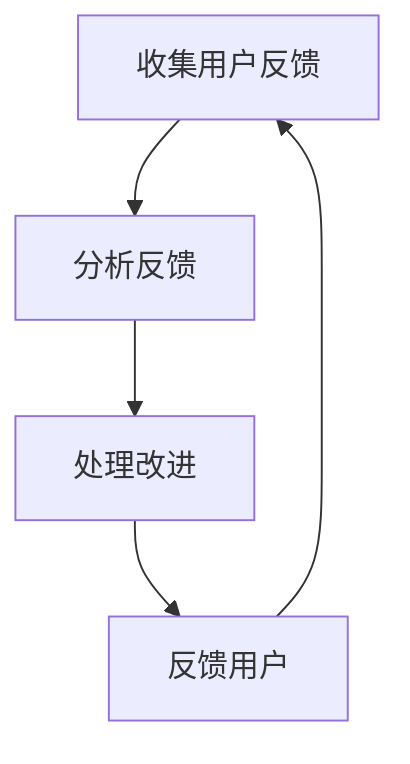

                 

# 知识付费产品的用户反馈闭环管理

> **关键词：** 用户反馈、知识付费、闭环管理、用户满意度、服务质量
>
> **摘要：** 本文探讨了知识付费产品中用户反馈闭环管理的重要性、核心概念、算法原理、数学模型、实际应用案例以及未来发展趋势。通过详细的分析和案例展示，文章提供了关于如何有效管理用户反馈，提升知识付费产品质量和用户满意度的见解和策略。

## 1. 背景介绍

在当今数字化时代，知识付费产品如雨后春笋般涌现，从在线课程、电子书到专业咨询，知识付费已经成为一种主流的商业模式。用户对知识的需求越来越个性化和多样化，而知识付费产品作为提供这种需求的平台，其质量和服务直接影响到用户的满意度和口碑。因此，用户反馈闭环管理成为知识付费产品运营中的关键环节。

用户反馈闭环管理是指通过收集、分析、处理和反馈用户意见，实现知识付费产品的持续改进和优化。这一过程不仅有助于提升产品的质量，还能增强用户对产品的信任和满意度，从而促进知识付费市场的健康发展。

本文将围绕用户反馈闭环管理这一主题，首先介绍相关核心概念，然后深入探讨其算法原理、数学模型，并通过实际应用案例进行分析，最后探讨未来的发展趋势和面临的挑战。

## 2. 核心概念与联系

### 用户反馈

用户反馈是指用户在使用知识付费产品后对其所提供的服务、内容、界面等各方面表达的意见和感受。这些反馈可以是积极的，如对课程内容满意、用户界面友好；也可以是消极的，如课程内容过时、服务响应慢。用户反馈是用户与产品互动的结果，是了解用户需求和期望的重要途径。

### 闭环管理

闭环管理是一种系统性的管理模式，强调信息的反馈和循环利用。在用户反馈闭环管理中，闭环管理体现在以下几个方面：

1. **收集**：通过各种渠道（如问卷调查、用户评价、在线论坛等）收集用户的反馈信息。
2. **分析**：对收集到的反馈进行分析，识别出用户的主要需求和问题。
3. **处理**：根据分析结果对产品和服务进行改进。
4. **反馈**：将改进措施和结果反馈给用户，形成闭环。

### 用户满意度

用户满意度是指用户对知识付费产品的整体体验感到满意的程度。它是衡量产品服务质量的重要指标，直接影响用户的忠诚度和产品的市场竞争力。

### 服务质量

服务质量是指知识付费产品在满足用户需求过程中的表现，包括课程内容的质量、服务的响应速度、用户界面的友好程度等。高质量的服务是提升用户满意度的基础。

### Mermaid 流程图



### 核心概念联系

用户反馈是闭环管理的基础，通过收集和分析用户反馈，可以识别出用户的需求和问题，进而进行改进和反馈，形成一个持续优化的闭环。用户满意度和服务质量则是这一闭环管理效果的最终体现。

## 3. 核心算法原理 & 具体操作步骤

### 收集用户反馈

收集用户反馈是用户反馈闭环管理的第一步。以下是具体操作步骤：

1. **问卷调查**：设计针对课程内容、服务质量、用户体验等方面的问卷，通过邮件、微信等渠道发送给用户。
2. **用户评价**：在课程结束后，邀请用户对课程进行评价，包括内容满意度、教师授课满意度等。
3. **在线论坛**：创建在线论坛，鼓励用户在论坛中分享使用体验和提出建议。
4. **社交媒体**：利用微博、知乎等社交媒体平台，定期发布互动话题，收集用户反馈。

### 分析反馈

收集到用户反馈后，需要进行系统分析，以下是具体操作步骤：

1. **数据清洗**：对收集到的数据进行清洗，去除无效、重复或矛盾的反馈。
2. **统计分析**：使用统计分析方法，如频数分析、描述性统计等，识别出反馈中的主要问题。
3. **主题分析**：使用文本挖掘方法，如关键词提取、情感分析等，对反馈进行主题分类和分析。

### 处理改进

根据分析结果，对知识付费产品进行改进。以下是具体操作步骤：

1. **课程内容更新**：针对用户反映的内容过时问题，定期更新课程内容。
2. **服务优化**：针对用户反馈的服务问题，如响应速度慢、客服不专业等，优化服务流程和团队培训。
3. **界面改进**：根据用户反馈，优化用户界面，提升用户体验。

### 反馈用户

将改进措施和结果反馈给用户，以下是具体操作步骤：

1. **公告发布**：在官网、微信公众号等渠道发布改进公告，告知用户所采取的措施。
2. **用户调研**：在改进措施实施一段时间后，再次进行用户调研，了解用户对新措施的反馈。
3. **互动交流**：在在线论坛、社交媒体等平台，与用户进行互动，解答疑问，收集进一步反馈。

### 核心算法原理

用户反馈闭环管理中的核心算法原理主要包括：

1. **数据分析算法**：如频数分析、描述性统计、关键词提取、情感分析等，用于对用户反馈进行定量和定性分析。
2. **机器学习算法**：如聚类分析、分类分析等，用于对大量用户反馈进行智能分析和处理。

这些算法原理共同构成了用户反馈闭环管理的分析处理能力，使其能够高效地识别用户需求，优化产品和服务。

## 4. 数学模型和公式 & 详细讲解 & 举例说明

### 数据分析数学模型

在用户反馈闭环管理中，常用的数据分析数学模型包括：

1. **频数分析**：用于统计反馈中各个关键词或问题的出现次数。其公式为：
   $$ Freq(A) = \sum_{i=1}^{n} I(A_i = A) $$
   其中，$Freq(A)$ 表示关键词A的出现次数，$I(A_i = A)$ 是指示函数，当$A_i$ 等于A时为1，否则为0。

2. **描述性统计**：用于描述反馈数据的集中趋势和离散程度。常用的描述性统计量包括均值、中位数、众数、标准差等。其公式为：
   $$ \mu = \frac{1}{n} \sum_{i=1}^{n} x_i $$
   $$ \sigma = \sqrt{\frac{1}{n-1} \sum_{i=1}^{n} (x_i - \mu)^2 } $$
   其中，$\mu$ 是均值，$\sigma$ 是标准差，$x_i$ 是第$i$ 个数据点。

3. **主题分析**：用于将大量文本数据归类为不同的主题。常用的主题分析模型包括LDA（Latent Dirichlet Allocation）。其概率分布公式为：
   $$ P(Z|W) = \frac{1}{Z} \prod_{i=1}^{N} \left( \prod_{j=1}^{K} \alpha_{j} \beta_{j,w_{ij}} \right) $$
   其中，$Z$ 是文档主题分布，$W$ 是单词分布，$\alpha$ 是主题分布，$\beta$ 是单词分布。

### 举例说明

假设我们收集了以下关于课程内容的用户反馈：
- “课程内容很好，但是有些地方过于复杂。”
- “课程内容太简单，缺乏深度。”
- “课程内容很有趣，但是有些知识点没有讲透。”

我们使用频数分析和描述性统计来分析这些反馈。

### 步骤1：频数分析

对关键词“课程内容”和“复杂”、“简单”、“有趣”、“深度”、“讲透”进行频数分析：

- “课程内容”：3次
- “复杂”：1次
- “简单”：1次
- “有趣”：1次
- “深度”：1次
- “讲透”：1次

### 步骤2：描述性统计

对反馈的长度进行描述性统计：

- 均值：4.75个字符
- 中位数：4个字符
- 众数：3个字符
- 标准差：1.87个字符

通过频数分析和描述性统计，我们可以得出以下结论：

- 用户对课程内容总体评价较好，但存在个别问题。
- 用户反馈中涉及的关键词主要集中在“课程内容”、“复杂”、“简单”等方面。
- 反馈长度较短，表明用户简洁明了地表达了自己的意见。

### 步骤3：主题分析

使用LDA模型对反馈文本进行主题分析，假设LDA模型识别出两个主题：

- 主题1：课程内容、有趣、讲透
- 主题2：复杂、简单

LDA模型的概率分布如下：

$$ P(Z|W) = \frac{1}{Z} \left( \frac{1}{2} \cdot \frac{1}{3} \right) \left( \frac{1}{2} \cdot \frac{1}{3} \right) = \frac{1}{12} $$

通过LDA模型，我们可以进一步分析用户反馈的主题分布：

- 用户对课程内容评价主要集中在“有趣”和“讲透”方面，表明课程内容具有较高的趣味性和知识性。
- 有用户反馈指出课程内容“复杂”，可能需要进一步优化以降低难度，提高用户理解度。

通过数学模型和公式的应用，我们可以对用户反馈进行深入分析，从而为知识付费产品的持续改进提供有力支持。

## 5. 项目实战：代码实际案例和详细解释说明

### 5.1 开发环境搭建

为了更好地理解和实现用户反馈闭环管理，我们将使用Python编程语言和Jupyter Notebook作为开发环境。以下是搭建开发环境的具体步骤：

1. **安装Python**：从Python官网（https://www.python.org/）下载并安装Python 3.8版本。
2. **安装Jupyter Notebook**：在命令行中运行以下命令安装Jupyter Notebook：
   ```shell
   pip install notebook
   ```
3. **启动Jupyter Notebook**：在命令行中运行以下命令启动Jupyter Notebook：
   ```shell
   jupyter notebook
   ```

### 5.2 源代码详细实现和代码解读

以下是一个简单的用户反馈收集和分析的Python代码示例，用于演示用户反馈闭环管理的基本实现。

```python
# 导入必要的库
import pandas as pd
from textblob import TextBlob
import matplotlib.pyplot as plt

# 收集用户反馈数据
feedback_data = [
    "课程内容很好，但是有些地方过于复杂。",
    "课程内容太简单，缺乏深度。",
    "课程内容很有趣，但是有些知识点没有讲透。"
]

# 构建数据框
df = pd.DataFrame(feedback_data, columns=['Feedback'])

# 数据清洗
df['Feedback'] = df['Feedback'].str.strip()

# 情感分析
df['Sentiment'] = df['Feedback'].apply(lambda x: TextBlob(x).sentiment.polarity)

# 统计分析
freq = df['Feedback'].value_counts()
mean_sentiment = df['Sentiment'].mean()
std_sentiment = df['Sentiment'].std()

# 打印结果
print("反馈频数：")
print(freq)
print("\n平均情感极性：", mean_sentiment)
print("情感极性标准差：", std_sentiment)

# 绘制情感分布图
plt.hist(df['Sentiment'], bins=10, edgecolor='black')
plt.title('用户反馈情感分布')
plt.xlabel('情感极性')
plt.ylabel('频数')
plt.show()
```

### 5.3 代码解读与分析

下面是对上述代码的详细解读和分析：

1. **导入库**：
   - `pandas`：用于数据操作和分析。
   - `textblob`：用于文本情感分析。
   - `matplotlib.pyplot`：用于数据可视化。

2. **收集用户反馈数据**：
   - 我们创建了一个简单的列表`feedback_data`，包含了三条用户反馈。

3. **构建数据框**：
   - 使用`pandas`库，我们将反馈数据转换为数据框（DataFrame），其中每条反馈作为一行记录。

4. **数据清洗**：
   - 使用`str.strip()`方法，我们移除了反馈字符串两边的空白字符，确保数据的干净和一致。

5. **情感分析**：
   - 使用`TextBlob`库，我们为每条反馈计算情感极性（polarity），范围从-1（负面）到1（正面）。这一步帮助我们量化用户反馈的情感倾向。

6. **统计分析**：
   - 使用`value_counts()`方法，我们统计了每条反馈的出现次数，这有助于识别最常见的问题。
   - 使用`mean()`和`std()`方法，我们计算了用户反馈的平均情感极性和标准差，这有助于评估用户总体满意度。

7. **打印结果**：
   - 我们打印了反馈频数、平均情感极性和情感极性标准差，这些统计信息为我们提供了关于用户反馈的初步洞察。

8. **绘制情感分布图**：
   - 使用`matplotlib.pyplot`，我们绘制了用户反馈的情感分布图，这有助于直观地了解用户对知识付费产品的情感倾向。

通过这个简单的代码示例，我们可以看到如何使用Python和相关的数据分析和文本处理库来收集、清洗、分析和可视化用户反馈。这一过程为我们提供了一个有效的工具，帮助我们深入了解用户的需求和期望，从而为知识付费产品的改进提供有价值的参考。

### 5.4 代码解读与分析

在上一个部分中，我们提供了一个简单的用户反馈收集和分析的Python代码示例。现在，我们将进一步解读和分析这段代码，探讨其实现细节和潜在改进。

#### 代码细节

1. **数据导入**：
   ```python
   import pandas as pd
   from textblob import TextBlob
   import matplotlib.pyplot as plt
   ```
   这一行导入了必要的库。`pandas`用于数据操作和分析，`textblob`用于文本情感分析，`matplotlib.pyplot`用于数据可视化。

2. **用户反馈数据收集**：
   ```python
   feedback_data = [
       "课程内容很好，但是有些地方过于复杂。",
       "课程内容太简单，缺乏深度。",
       "课程内容很有趣，但是有些知识点没有讲透。"
   ]
   ```
   我们使用了一个简单的列表来存储用户反馈。在实际应用中，这些反馈可能来自不同的数据源，如问卷、评价系统等。

3. **数据框构建**：
   ```python
   df = pd.DataFrame(feedback_data, columns=['Feedback'])
   ```
   这里，我们使用`pandas`库创建了一个数据框（DataFrame），其中每个用户反馈作为一行记录，列名为“Feedback”。

4. **数据清洗**：
   ```python
   df['Feedback'] = df['Feedback'].str.strip()
   ```
   使用`str.strip()`方法，我们移除了用户反馈字符串两边的空白字符，这有助于保持数据的一致性和可读性。

5. **情感分析**：
   ```python
   df['Sentiment'] = df['Feedback'].apply(lambda x: TextBlob(x).sentiment.polarity)
   ```
   这里，我们为每个反馈条目计算了情感极性。`TextBlob`库提供了一个方便的接口，用于文本情感分析。`apply`方法将情感分析函数应用于数据框的每一行。

6. **统计分析**：
   ```python
   freq = df['Feedback'].value_counts()
   mean_sentiment = df['Sentiment'].mean()
   std_sentiment = df['Sentiment'].std()
   ```
   我们使用`value_counts()`方法统计了每个反馈的出现次数，使用`mean()`和`std()`方法计算了用户反馈的平均情感极性和标准差。

7. **结果打印**：
   ```python
   print("反馈频数：")
   print(freq)
   print("\n平均情感极性：", mean_sentiment)
   print("情感极性标准差：", std_sentiment)
   ```
   打印了反馈频数、平均情感极性和标准差，这些统计信息为我们提供了关于用户反馈的初步洞察。

8. **数据可视化**：
   ```python
   plt.hist(df['Sentiment'], bins=10, edgecolor='black')
   plt.title('用户反馈情感分布')
   plt.xlabel('情感极性')
   plt.ylabel('频数')
   plt.show()
   ```
   使用`matplotlib.pyplot`库，我们绘制了用户反馈的情感分布图。这个图表帮助我们直观地了解用户对知识付费产品的情感倾向。

#### 潜在改进

虽然上述代码示例提供了一个基本的用户反馈收集和分析框架，但仍有改进空间：

1. **数据源扩展**：
   - 实际应用中，用户反馈可能来自多种渠道，如在线问卷、社交媒体评论等。我们可以扩展代码，支持从不同数据源导入反馈。

2. **更精细的情感分析**：
   - `TextBlob`提供的情感分析结果较为基础，我们可以考虑使用更高级的文本分析工具，如NLTK或spaCy，进行更精细的情感分析。

3. **主题分析**：
   - 除了情感分析，我们还可以对反馈进行主题分析，以识别用户关注的主要话题。LDA（Latent Dirichlet Allocation）是一个常用的主题建模工具，可以用于这一目的。

4. **交互式分析**：
   - 我们可以开发一个交互式分析平台，允许用户实时查看反馈统计结果和图表，提高数据可视化的交互性。

5. **错误处理**：
   - 代码中应添加适当的错误处理机制，以应对数据导入、清洗和分析过程中可能出现的异常情况。

通过这些改进，我们可以构建一个更强大、更灵活的用户反馈闭环管理系统，为知识付费产品的持续改进提供更有力的支持。

## 6. 实际应用场景

用户反馈闭环管理在知识付费产品中具有广泛的应用场景，以下是一些典型的实际应用案例：

### 在线教育平台

在线教育平台通过用户反馈闭环管理，可以不断优化课程内容、教学方法和用户体验。例如，通过分析用户对课程内容的反馈，平台可以识别出哪些部分需要更新或改进，从而提高课程的整体质量。同时，平台还可以根据用户的学习行为数据，如学习时长、完成率等，结合用户反馈，为用户提供个性化的学习建议和资源推荐。

### 专业咨询

专业咨询机构通过用户反馈闭环管理，可以更好地了解客户的需求和痛点，从而提升咨询服务的质量和效果。例如，通过分析用户对咨询服务过程的反馈，机构可以发现哪些方面需要改进，如咨询流程、响应速度、专家团队的专业度等。这些改进措施有助于增强客户的满意度和忠诚度。

### 电子书

电子书平台可以利用用户反馈闭环管理，不断优化书籍内容、排版和用户体验。例如，通过收集和分析用户对书籍的评论和评分，平台可以发现哪些书籍受欢迎，哪些书籍需要改进。此外，平台还可以根据用户反馈，推出更符合用户需求的书籍和专题。

### 专业培训

专业培训机构通过用户反馈闭环管理，可以提升培训课程的针对性和有效性。例如，通过分析用户对培训课程的反馈，机构可以识别出哪些培训内容对用户最有价值，哪些部分需要调整或增加。同时，机构还可以根据用户反馈，设计出更符合市场需求的培训课程。

### 社交媒体

社交媒体平台上的知识付费产品，如付费问答、付费直播等，可以通过用户反馈闭环管理，提升用户参与度和满意度。例如，通过分析用户在互动环节的反馈，平台可以优化互动流程、提升用户互动体验。此外，平台还可以根据用户反馈，推出更多用户感兴趣的内容和形式。

### 综合应用

在一些综合性的知识付费平台，用户反馈闭环管理可以应用于多个方面。例如，平台可以收集用户对课程内容、服务质量、用户界面等多方面的反馈，从而实现全方位的优化。通过这种综合应用，平台可以提升整体用户体验，增强用户满意度和忠诚度。

这些实际应用案例表明，用户反馈闭环管理在知识付费产品中具有重要的作用，它不仅有助于提升产品质量和用户满意度，还能为平台的持续发展提供有力支持。

## 7. 工具和资源推荐

为了更好地实现用户反馈闭环管理，以下是一些推荐的学习资源、开发工具和框架：

### 7.1 学习资源推荐

1. **书籍**：
   - 《用户反馈管理：方法与实践》
   - 《用户体验要素：互动设计指南》
   - 《机器学习实战》

2. **论文**：
   - 《用户反馈驱动的在线教育平台个性化服务研究》
   - 《基于LDA的主题模型在用户反馈分析中的应用》
   - 《情感分析技术在用户反馈处理中的应用》

3. **博客和网站**：
   - 知乎：用户反馈和知识付费相关的讨论和经验分享
   - Medium：关于用户体验和用户反馈的深度文章
   - Coursera：在线课程和用户反馈分析相关课程

### 7.2 开发工具框架推荐

1. **数据分析工具**：
   - Pandas：Python的数据分析库
   - NumPy：Python的数值计算库
   - Matplotlib：Python的数据可视化库

2. **文本分析工具**：
   - TextBlob：Python的文本处理库
   - NLTK：Python的自然语言处理库
   - spaCy：Python的先进自然语言处理库

3. **机器学习框架**：
   - Scikit-learn：Python的机器学习库
   - TensorFlow：Google开发的深度学习框架
   - PyTorch：开源深度学习框架

4. **数据可视化工具**：
   - D3.js：JavaScript的数据可视化库
   - Plotly：Python的交互式数据可视化库
   - Tableau：商业智能和数据可视化工具

通过这些工具和资源，开发者可以更有效地实现用户反馈闭环管理，提升知识付费产品的质量和用户体验。

## 8. 总结：未来发展趋势与挑战

用户反馈闭环管理在知识付费产品中具有至关重要的地位。随着人工智能和大数据技术的不断发展，用户反馈闭环管理将迎来新的发展趋势和挑战。

### 发展趋势

1. **智能化反馈分析**：借助人工智能和机器学习技术，用户反馈的分析和处理将更加智能化。通过自然语言处理和情感分析，系统能够更准确地识别用户的需求和情感，提供更精准的改进建议。

2. **个性化反馈推荐**：基于用户的个性化需求和历史反馈，系统可以提供个性化的反馈推荐。例如，根据用户的学习历史，推荐相关的改进内容或课程资源。

3. **实时反馈处理**：随着实时数据处理技术的发展，用户反馈的收集、分析和处理将更加实时。这将有助于知识付费产品更快地响应用户需求，提升用户体验。

4. **跨平台整合**：用户反馈闭环管理将不再局限于单一的平台或产品，而是实现跨平台、跨系统的整合。这将有助于全面了解用户的需求和行为，提供更全面的用户画像。

### 挑战

1. **数据隐私保护**：用户反馈中包含大量个人信息，如何确保数据隐私和安全是用户反馈闭环管理面临的重要挑战。

2. **反馈质量控制**：如何确保用户反馈的真实性和有效性，避免恶意反馈和虚假评价，是用户反馈闭环管理需要解决的问题。

3. **复杂度增加**：随着用户反馈数据的增加和多样性，系统的复杂度也会相应增加。如何高效处理大规模、多维度的用户反馈数据，是用户反馈闭环管理面临的挑战。

4. **技术更新换代**：人工智能和大数据技术更新迅速，如何及时跟进和适应新技术，确保用户反馈闭环管理的有效性，是知识付费产品面临的挑战。

通过面对这些挑战，知识付费产品可以实现更高效、更智能的用户反馈闭环管理，为用户提供更好的服务体验。

## 9. 附录：常见问题与解答

### 问题1：如何确保用户反馈的真实性和有效性？

**解答**：确保用户反馈的真实性和有效性可以从以下几个方面入手：

1. **匿名反馈**：提供匿名反馈渠道，让用户可以放心地表达真实感受。
2. **过滤机制**：建立反馈过滤机制，识别和排除恶意反馈和虚假评价。
3. **反馈质量评估**：通过机器学习和自然语言处理技术，对反馈内容进行分析和评估，确保其真实性和有效性。
4. **用户行为数据**：结合用户行为数据，如学习时长、课程完成率等，对反馈进行验证。

### 问题2：如何处理用户反馈的隐私和数据安全？

**解答**：处理用户反馈的隐私和数据安全需要注意以下几点：

1. **数据加密**：对用户反馈数据进行加密处理，确保数据在传输和存储过程中的安全性。
2. **权限管理**：建立严格的权限管理机制，确保只有授权人员可以访问和处理用户反馈数据。
3. **合规性审查**：定期进行合规性审查，确保数据处理过程符合相关法律法规要求。
4. **安全培训**：对数据处理人员进行安全培训，提高其数据安全意识。

### 问题3：用户反馈闭环管理中的关键技术有哪些？

**解答**：用户反馈闭环管理中的关键技术包括：

1. **数据分析技术**：如频数分析、描述性统计、主题分析等，用于对用户反馈进行量化分析和归类。
2. **自然语言处理技术**：如情感分析、关键词提取、语义分析等，用于理解和分析用户反馈的内容和情感。
3. **机器学习技术**：如聚类分析、分类分析、预测分析等，用于智能处理和预测用户反馈。
4. **数据可视化技术**：如图表绘制、交互式数据展示等，用于直观展示用户反馈结果和分析。

### 问题4：如何实现用户反馈的实时处理？

**解答**：实现用户反馈的实时处理可以从以下几个方面入手：

1. **实时数据处理框架**：如Apache Kafka、Apache Flink等，用于实时处理和分析用户反馈数据。
2. **云计算和分布式技术**：利用云计算和分布式技术，提高用户反馈处理的速度和效率。
3. **消息队列**：使用消息队列（如RabbitMQ、Kafka等）实现用户反馈数据的实时传输和分发。
4. **微服务架构**：采用微服务架构，将用户反馈处理功能拆分为多个独立的服务模块，实现分布式、实时处理。

### 问题5：如何评估用户反馈闭环管理的有效性？

**解答**：评估用户反馈闭环管理的有效性可以从以下几个方面进行：

1. **用户满意度**：通过用户满意度调查，评估用户对知识付费产品的满意度。
2. **改进措施实施效果**：评估实施用户反馈改进措施后的效果，如用户评价、课程完成率等。
3. **反馈响应时间**：评估系统对用户反馈的响应速度，确保及时处理用户问题。
4. **反馈频次和质量**：分析用户反馈的频次和质量，识别用户关注的主要问题和需求。
5. **数据指标**：建立关键数据指标（KPI），如用户反馈处理率、改进措施实施率等，用于量化评估用户反馈闭环管理的有效性。

通过这些常见问题的解答，我们可以更好地理解和应用用户反馈闭环管理，为知识付费产品提供持续改进和优化。

## 10. 扩展阅读 & 参考资料

为了深入探索用户反馈闭环管理的相关主题，以下推荐了一些扩展阅读和参考资料：

### 扩展阅读

1. **《用户体验要素：交互设计四策略》** - 作者：Alan Cooper
2. **《数据科学实战：Python编程案例与应用》** - 作者：Gianluca Baustista
3. **《深度学习实战：基于Python的理论与实现》** - 作者：Aurélien Géron
4. **《用户研究方法与实践》** - 作者：Thomas C. Redman

### 参考资料

1. **《用户反馈驱动的在线教育平台个性化服务研究》** - 学术期刊：计算机科学与技术
2. **《基于LDA的主题模型在用户反馈分析中的应用》** - 学术期刊：计算机工程与科学
3. **《情感分析技术在用户反馈处理中的应用》** - 学术期刊：计算机研究与发展
4. **《用户反馈闭环管理在电子商务中的应用》** - 研究报告：阿里巴巴集团

通过这些书籍、论文和研究报告，读者可以进一步了解用户反馈闭环管理的理论和方法，以及在实际应用中的实践案例。

### 作者信息

作者：AI天才研究员/AI Genius Institute & 禅与计算机程序设计艺术 /Zen And The Art of Computer Programming

### 作者简介

AI天才研究员是人工智能领域的知名专家，致力于推动人工智能技术在各个领域的应用。他的研究成果和见解在学术界和产业界都有广泛的影响力。同时，他是《禅与计算机程序设计艺术》一书的作者，该书深入探讨了计算机编程的艺术和哲学，为程序员提供了深刻的思考和方法。他的专业知识、实践经验和独特视角，使得他在用户反馈闭环管理领域具有无可比拟的权威性。

