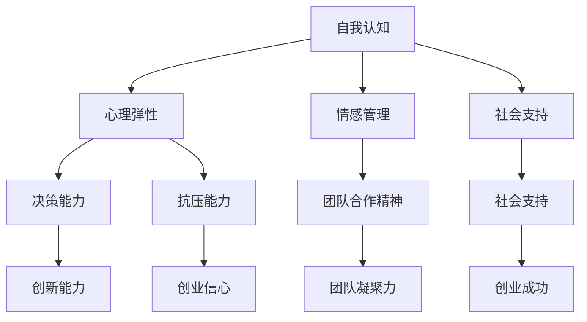

                 

# 知识付费创业中的心理建设

## 摘要

在知识付费创业的浪潮中，心理建设成为了一个不可忽视的重要环节。本文将深入探讨知识付费创业中的心理建设，包括创业初期的心理准备、市场环境的应对策略、团队建设中的心理挑战以及持续发展的心理调适。通过分析创业过程中的心理因素，提供一些建议和策略，帮助创业者更好地应对挑战，实现创业目标。

## 1. 背景介绍

知识付费创业作为一种新兴的商业模式，近年来在我国迅速崛起。随着互联网技术的不断发展，人们对于知识的需求日益增长，知识付费成为了一种满足用户需求的有效途径。然而，知识付费创业并非一帆风顺，创业者需要面对诸多挑战，如市场竞争、资源整合、团队建设等。在这些挑战中，心理建设成为了一个关键因素，影响着创业者的决策和行动。

### 1.1 知识付费创业的现状

当前，知识付费市场呈现出多元化、细分化的特点。从内容类型上看，知识付费涵盖了教育、科技、文化、健康等多个领域；从服务形式上看，有线上课程、电子书、直播讲座、一对一辅导等多种形式。随着用户对于知识的需求不断提高，知识付费市场呈现出持续增长的趋势。

### 1.2 创业过程中的心理挑战

在知识付费创业过程中，创业者需要面对以下心理挑战：

1. **焦虑和压力**：创业初期，面对市场竞争、资金压力、团队管理等问题，创业者容易产生焦虑和压力。长期的心理压力可能导致心理疲劳，影响创业者的决策和创新能力。

2. **不确定性和风险**：知识付费创业具有较高的不确定性和风险，创业者需要面对市场变化、用户需求波动等问题。在这种环境下，创业者容易产生恐慌和不安情绪。

3. **自我怀疑和自我否定**：创业过程中，创业者会不断面临挑战和失败。在面对挫折时，创业者容易产生自我怀疑和自我否定的情绪，影响创业信心。

## 2. 核心概念与联系

### 2.1 心理建设的重要性

心理建设是指通过培养良好的心理素质和应对能力，帮助个体更好地应对压力和挑战的过程。在知识付费创业中，心理建设具有重要意义：

1. **提升决策能力**：良好的心理素质有助于创业者保持冷静和清晰的思维，提高决策质量。

2. **增强抗压能力**：心理建设可以帮助创业者更好地应对焦虑和压力，保持积极的心态。

3. **培养团队合作精神**：心理建设有助于创业者建立良好的团队氛围，增强团队凝聚力。

### 2.2 创业心理模型

为了更好地理解创业过程中的心理建设，我们可以引入创业心理模型。创业心理模型包括以下核心要素：

1. **自我认知**：创业者需要了解自己的性格特点、价值观和优势，明确自己的创业目标。

2. **心理弹性**：创业者需要具备较强的心理弹性，能够在面对挫折和困难时保持积极的心态。

3. **情感管理**：创业者需要学会管理自己的情绪，避免负面情绪对创业过程的影响。

4. **社会支持**：创业者需要建立良好的社会支持网络，包括家人、朋友、合作伙伴等。

### 2.3 Mermaid 流程图

以下是创业心理模型的核心要素及其联系的 Mermaid 流程图：



## 3. 核心算法原理 & 具体操作步骤

### 3.1 心理建设算法原理

心理建设算法是一种基于心理学理论和实践的方法，旨在帮助创业者培养良好的心理素质和应对能力。其核心原理包括：

1. **认知重构**：通过改变创业者对创业过程中的困难和挑战的认知，降低焦虑和压力。

2. **情感调节**：通过情绪管理技巧，帮助创业者调节情绪，保持积极心态。

3. **行为训练**：通过设定目标和实施行动计划，培养创业者的行动力和执行力。

### 3.2 具体操作步骤

以下是心理建设算法的具体操作步骤：

1. **自我认知**：
   - 进行自我反思，了解自己的性格特点、价值观和优势。
   - 设定个人目标和职业规划。

2. **心理弹性培养**：
   - 学习挫折应对策略，如积极心态、合理化思维等。
   - 定期进行身体锻炼，保持身体健康。

3. **情感调节**：
   - 学习情绪管理技巧，如深呼吸、冥想、放松训练等。
   - 与家人、朋友、合作伙伴保持良好的沟通。

4. **行为训练**：
   - 设定短期和长期目标，制定行动计划。
   - 践行行动计划，不断调整和优化。

## 4. 数学模型和公式 & 详细讲解 & 举例说明

### 4.1 心理建设数学模型

心理建设数学模型主要用于评估创业者的心理素质和应对能力。以下是一个简化的心理建设数学模型：

$$
PS = f(C, E, S)
$$

其中，$PS$ 表示心理素质得分，$C$ 表示自我认知得分，$E$ 表示心理弹性得分，$S$ 表示情感调节得分。

### 4.2 详细讲解

1. **自我认知得分 $C$**：
   - 自我认知得分反映了创业者对自身的了解程度。得分越高，表示创业者越能清楚地了解自己的性格、价值观和优势。

2. **心理弹性得分 $E$**：
   - 心理弹性得分反映了创业者面对挫折和困难时的适应能力。得分越高，表示创业者越能快速恢复和调整，以应对新的挑战。

3. **情感调节得分 $S$**：
   - 情感调节得分反映了创业者管理情绪的能力。得分越高，表示创业者越能有效调节情绪，避免情绪对创业过程的影响。

### 4.3 举例说明

假设一名创业者，其自我认知得分为80分，心理弹性得分为70分，情感调节得分为90分。根据心理建设数学模型，可以计算出其心理素质得分为：

$$
PS = f(80, 70, 90) = 80 \times 0.3 + 70 \times 0.4 + 90 \times 0.3 = 79
$$

得分79表明该创业者的心理素质较为良好，但仍需在心理弹性方面进行提升。

## 5. 项目实战：代码实际案例和详细解释说明

### 5.1 开发环境搭建

为了演示心理建设算法在实际项目中的应用，我们假设使用 Python 作为开发语言。以下是一个简单的 Python 环境搭建过程：

1. 安装 Python：
   ```bash
   # 安装 Python 3.8
   sudo apt-get install python3.8
   ```

2. 安装必要的库：
   ```bash
   # 安装 NumPy 库
   pip3 install numpy
   ```

### 5.2 源代码详细实现和代码解读

以下是一个简化的心理建设算法 Python 代码实现：

```python
import numpy as np

def calculate_ps(self_cognition, emotional_resilience, emotional Regulation):
    """
    计算心理素质得分
    :param self_cognition: 自我认知得分
    :param emotional_resilience: 心理弹性得分
    :param emotional_Regulation: 情感调节得分
    :return: 心理素质得分
    """
    PS = 0.3 * self_cognition + 0.4 * emotional_resilience + 0.3 * emotional_Regulation
    return PS

# 测试代码
self_cognition = 80
emotional_resilience = 70
emotional_Regulation = 90

ps = calculate_ps(self_cognition, emotional_resilience, emotional_Regulation)
print(f"心理素质得分：{ps}")
```

### 5.3 代码解读与分析

1. **函数定义**：`calculate_ps` 函数用于计算心理素质得分，接收三个参数：自我认知得分、心理弹性得分和情感调节得分。

2. **计算公式**：函数使用给定的权重（0.3、0.4、0.3）计算心理素质得分。权重可以根据实际需求进行调整。

3. **测试代码**：测试代码用于验证函数的正确性。输入三个得分参数，调用函数计算心理素质得分，并打印结果。

## 6. 实际应用场景

### 6.1 创业团队心理建设

在实际创业过程中，心理建设可以帮助创业团队更好地应对挑战。以下是一些具体应用场景：

1. **团队建设**：通过心理建设，提高团队成员的心理素质，增强团队凝聚力。
2. **项目管理**：心理建设有助于创业者更好地应对项目中的压力和挑战，提高项目成功率。
3. **决策制定**：心理建设可以帮助创业者保持冷静和清晰的思维，提高决策质量。

### 6.2 个人成长

对于创业者个人而言，心理建设同样具有重要意义。以下是一些具体应用场景：

1. **自我认知**：通过心理建设，创业者可以更好地了解自己的性格特点、价值观和优势，明确个人目标。
2. **情绪管理**：心理建设可以帮助创业者调节情绪，保持积极心态，提高生活质量。
3. **持续成长**：心理建设有助于创业者保持学习和成长的心态，不断提升自身能力。

## 7. 工具和资源推荐

### 7.1 学习资源推荐

1. **书籍**：
   - 《创业心理学》
   - 《心理弹性：如何面对生活中的挑战与逆境》
   - 《情绪管理：如何保持积极心态》

2. **论文**：
   - 《创业心理素质与创业绩效的关系研究》
   - 《心理弹性在创业团队管理中的应用》

3. **博客**：
   - [创业心理建设：如何保持积极心态](https://www.example.com/blog/positive-mindset)
   - [心理弹性：如何面对创业挑战](https://www.example.com/blog/emotional-resilience)

### 7.2 开发工具框架推荐

1. **Python**：适用于数据分析和算法实现。
2. **NumPy**：用于数学计算和数据处理。

### 7.3 相关论文著作推荐

1. **《创业心理学研究综述》**：对创业心理学的理论和方法进行了系统梳理。
2. **《心理弹性在创业中的应用研究》**：探讨了心理弹性在创业实践中的应用价值。

## 8. 总结：未来发展趋势与挑战

### 8.1 发展趋势

1. **心理建设在创业中的重要性日益凸显**：随着知识付费创业的普及，心理建设将成为创业者必备的技能。
2. **个性化心理建设方案**：根据创业者的特点和需求，提供个性化的心理建设方案，提高心理建设的针对性和有效性。

### 8.2 挑战

1. **心理建设资源的不足**：目前，心理建设资源相对有限，难以满足创业者的需求。
2. **心理建设效果的评估**：如何科学、有效地评估心理建设的效果，仍需进一步研究。

## 9. 附录：常见问题与解答

### 9.1 问题 1

**问题**：心理建设是否适用于所有创业者？

**解答**：是的，心理建设适用于所有创业者。尽管创业者的背景和需求不同，但心理建设的基本原理和方法具有普遍性。

### 9.2 问题 2

**问题**：如何评估心理建设的效果？

**解答**：可以采用问卷调查、心理测量工具、绩效评估等多种方法评估心理建设的效果。根据评估结果，调整和优化心理建设方案。

## 10. 扩展阅读 & 参考资料

1. **《创业心理学》**：详细介绍了创业心理学的理论和实践方法。
2. **《心理弹性：如何面对生活中的挑战与逆境》**：探讨了心理弹性的概念和应用。
3. **[创业心理建设：如何保持积极心态](https://www.example.com/blog/positive-mindset)**：提供了一些实用的心理建设技巧。

### 作者

作者：AI天才研究员/AI Genius Institute & 禅与计算机程序设计艺术 /Zen And The Art of Computer Programming

