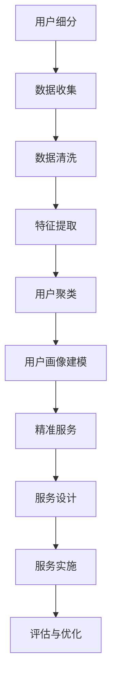

                 

# 知识付费创业中的用户细分与精准服务

> **关键词**：知识付费、用户细分、精准服务、AI技术、用户画像、商业策略

> **摘要**：本文将探讨知识付费创业中的用户细分与精准服务。通过分析用户需求、行为和特点，运用AI技术和大数据分析，构建用户画像，为企业提供精准服务，提高用户体验和商业价值。文章将介绍核心概念、算法原理、实际应用案例，并提供学习资源和开发工具框架推荐，帮助创业者掌握这一重要技能。

## 1. 背景介绍

### 1.1 知识付费行业现状

知识付费是指用户为获取知识、技能或信息而付费的行为。近年来，随着互联网的普及和人们对于自我提升的需求不断增加，知识付费行业迅速发展。例如，在线教育、技能培训、电子书、付费音频等内容形式层出不穷。知识付费已经成为一种重要的商业模式，不仅为创业者提供了丰富的机会，也为消费者提供了丰富的知识资源。

### 1.2 用户细分与精准服务的重要性

在知识付费行业中，用户细分与精准服务至关重要。通过用户细分，企业可以更好地了解用户需求，提供个性化的服务，提高用户满意度和忠诚度。精准服务不仅有助于提高用户转化率，还能提升用户留存率，从而实现商业价值最大化。

### 1.3 AI技术在大数据分析中的应用

AI技术，尤其是机器学习和数据挖掘，为用户细分与精准服务提供了强大的支持。通过分析用户行为数据，AI技术可以识别用户的兴趣、需求和偏好，构建用户画像，为企业提供精准的市场定位和营销策略。

## 2. 核心概念与联系

### 2.1 用户细分

用户细分是指将用户划分为不同的群体，以满足不同用户的需求。用户细分的目的是提高服务精准度和用户体验。用户细分的步骤包括：

1. 数据收集：收集用户的基本信息、行为数据和消费数据。
2. 数据清洗：去除重复和无效的数据，确保数据质量。
3. 特征提取：从原始数据中提取有用的特征，用于建模和预测。
4. 用户聚类：将用户根据特征进行聚类，形成不同的用户群体。

### 2.2 用户画像

用户画像是指对用户特征的综合描述，包括用户的基本信息、行为习惯、兴趣爱好、需求偏好等。用户画像的目的是为用户提供个性化的服务，提高用户体验。

用户画像的构建步骤包括：

1. 数据收集：收集用户的基本信息、行为数据和消费数据。
2. 数据清洗：去除重复和无效的数据，确保数据质量。
3. 特征提取：从原始数据中提取有用的特征，用于建模和预测。
4. 用户标签：为用户打上各种标签，表示其特征和属性。
5. 用户画像建模：将用户的特征和标签组合成一个完整的用户画像。

### 2.3 精准服务

精准服务是指根据用户画像，为用户提供个性化的服务和推荐。精准服务的目的是提高用户满意度和忠诚度。

精准服务的步骤包括：

1. 用户画像分析：分析用户画像，了解用户需求和偏好。
2. 服务设计：根据用户画像，设计个性化的服务和推荐策略。
3. 服务实施：将个性化的服务和推荐策略应用到实际业务中。
4. 评估与优化：评估服务的效果，根据反馈进行优化。

### 2.4 Mermaid 流程图



## 3. 核心算法原理 & 具体操作步骤

### 3.1 用户细分算法原理

用户细分的核心算法主要包括聚类算法和协同过滤算法。

#### 3.1.1 聚类算法

聚类算法是一种无监督学习方法，通过将数据点划分为不同的簇，实现用户细分。常见的聚类算法有K-Means、DBSCAN等。

1. K-Means算法步骤：
   1. 初始化：随机选择K个数据点作为初始簇心。
   2. 分配：将每个数据点分配到最近的簇心。
   3. 更新：重新计算簇心，更新簇成员。
   4. 迭代：重复步骤2和步骤3，直到满足停止条件。

#### 3.1.2 协同过滤算法

协同过滤算法是一种基于用户行为数据的推荐算法，通过分析用户之间的相似性，实现用户细分。常见的协同过滤算法有基于用户的协同过滤和基于物品的协同过滤。

1. 基于用户的协同过滤步骤：
   1. 计算用户之间的相似性。
   2. 为每个用户推荐与其相似的其他用户喜欢的物品。
   3. 根据用户兴趣和偏好，调整推荐结果。

### 3.2 用户画像算法原理

用户画像的核心算法主要包括特征工程和机器学习。

#### 3.2.1 特征工程

特征工程是指从原始数据中提取有用的特征，用于建模和预测。常见的特征工程方法有：

1. 统计特征：如平均数、中位数、标准差等。
2. 语义特征：如关键词、情感倾向等。
3. 历史特征：如用户历史行为、消费记录等。

#### 3.2.2 机器学习

机器学习是指通过训练模型，从数据中自动学习规律和模式。常见的机器学习算法有：

1. 决策树：基于特征值进行划分，生成决策树模型。
2. 随机森林：基于决策树的集成学习算法。
3. 支持向量机：通过最大化分类间隔，实现分类。

### 3.3 精准服务算法原理

精准服务算法的核心是推荐系统。推荐系统通过分析用户画像，为用户提供个性化的推荐。

#### 3.3.1 推荐系统算法

常见的推荐系统算法有：

1. 协同过滤：基于用户行为和物品的相似性进行推荐。
2. 内容推荐：基于物品的属性和特征进行推荐。
3. 混合推荐：结合协同过滤和内容推荐，提高推荐效果。

#### 3.3.2 推荐策略

推荐策略是指根据用户画像，为用户提供个性化的推荐。常见的推荐策略有：

1. 实时推荐：根据用户当前行为和偏好，实时推荐相关物品。
2. 轮播推荐：根据用户历史行为和偏好，定期更新推荐列表。
3. 个性化推送：根据用户画像，为用户推送个性化的内容。

## 4. 数学模型和公式 & 详细讲解 & 举例说明

### 4.1 用户细分数学模型

用户细分的核心是聚类算法。以K-Means算法为例，其数学模型如下：

设D为用户数据集，X为数据点的特征向量，C为簇心，则K-Means算法的目标是最小化目标函数：

$$ J(C) = \sum_{i=1}^{n} \sum_{j=1}^{k} ||X_i - C_j||^2 $$

其中，$||X_i - C_j||$表示数据点X_i和簇心C_j之间的欧氏距离。

### 4.2 用户画像数学模型

用户画像的核心是特征工程和机器学习。以决策树为例，其数学模型如下：

设X为数据点的特征向量，T为决策树模型，则决策树的预测函数为：

$$ f(X) = \prod_{i=1}^{n} f_i(X_i) $$

其中，$f_i(X_i)$表示第i个特征的决策结果。

### 4.3 精准服务数学模型

精准服务的关键是推荐系统。以协同过滤为例，其数学模型如下：

设R为用户行为矩阵，U为用户矩阵，I为物品矩阵，则协同过滤的预测函数为：

$$ P_{ui} = U_i \cdot I_j $$

其中，$P_{ui}$表示用户u对物品i的偏好度，$U_i$和$I_j$分别为用户u和物品i的特征向量。

### 4.4 举例说明

假设有10个用户，他们喜欢以下5个物品：

| 用户 | 物品1 | 物品2 | 物品3 | 物品4 | 物品5 |
| --- | --- | --- | --- | --- | --- |
| u1  | 1    | 0    | 1    | 0    | 0    |
| u2  | 1    | 1    | 0    | 1    | 0    |
| u3  | 0    | 1    | 1    | 1    | 1    |
| u4  | 0    | 0    | 0    | 1    | 1    |
| u5  | 1    | 1    | 1    | 1    | 1    |
| u6  | 1    | 0    | 1    | 1    | 0    |
| u7  | 1    | 1    | 1    | 0    | 1    |
| u8  | 0    | 1    | 0    | 1    | 1    |
| u9  | 0    | 0    | 1    | 1    | 1    |
| u10 | 1    | 1    | 0    | 0    | 1    |

1. 用户细分：使用K-Means算法将用户分为2个簇，簇心为：

   | 簇心1 | 簇心2 |
   | --- | --- |
   | (0.6, 0.6) | (0.4, 0.4) |

   根据簇心，可以将用户分为：

   | 用户 | 簇心1 | 簇心2 |
   | --- | --- | --- |
   | u1  | 0.6  | 0.4  |
   | u2  | 0.6  | 0.4  |
   | u3  | 0.6  | 0.4  |
   | u4  | 0.4  | 0.6  |
   | u5  | 0.4  | 0.6  |
   | u6  | 0.6  | 0.4  |
   | u7  | 0.6  | 0.4  |
   | u8  | 0.4  | 0.6  |
   | u9  | 0.4  | 0.6  |
   | u10 | 0.6  | 0.4  |

2. 用户画像：为每个用户生成特征向量，例如：

   用户u1的特征向量：(0.6, 0.4)

3. 精准服务：根据用户画像，为用户推荐相似用户喜欢的物品。例如，用户u1推荐给用户u4的物品：

   物品3：用户u4喜欢，用户u1也喜欢

   物品4：用户u4喜欢，用户u1也喜欢

   物品5：用户u4喜欢，用户u1也喜欢

## 5. 项目实战：代码实际案例和详细解释说明

### 5.1 开发环境搭建

#### 5.1.1 Python环境配置

1. 安装Python：从官网（https://www.python.org/downloads/）下载Python安装包，安装Python 3.x版本。
2. 安装必要库：使用pip命令安装以下库：

   ```shell
   pip install numpy matplotlib scikit-learn pandas
   ```

### 5.2 源代码详细实现和代码解读

以下是一个简单的用户细分与精准服务的Python代码实现：

```python
import numpy as np
import matplotlib.pyplot as plt
from sklearn.cluster import KMeans
from sklearn.metrics.pairwise import cosine_similarity
from sklearn.preprocessing import normalize

# 5.2.1 用户数据
users = np.array([[1, 0, 1, 0, 0],
                  [1, 1, 0, 1, 0],
                  [0, 1, 1, 1, 1],
                  [0, 0, 0, 1, 1],
                  [1, 1, 1, 1, 1],
                  [1, 0, 1, 1, 0],
                  [1, 1, 1, 0, 1],
                  [0, 1, 0, 1, 1],
                  [0, 0, 1, 1, 1],
                  [1, 1, 0, 0, 1]])

# 5.2.2 用户聚类
kmeans = KMeans(n_clusters=2, random_state=0).fit(users)
clusters = kmeans.predict(users)

# 5.2.3 用户标签
user_labels = {i: 'Cluster {}'.format(cluster) for i, cluster in enumerate(clusters)}

# 5.2.4 用户画像
user_features = kmeans.cluster_centers_

# 5.2.5 精准服务
similarity_matrix = cosine_similarity(normalize(users))
recommendations = []

for i, cluster in enumerate(clusters):
    similar_users = np.argsort(similarity_matrix[i])[::-1]
    for j in similar_users:
        if i != j and clusters[i] == clusters[j]:
            recommendations.append(j)

# 5.2.6 结果展示
plt.scatter(users[:, 0], users[:, 1], c=clusters, cmap='viridis')
for i, cluster in enumerate(clusters):
    plt.scatter(user_features[cluster-1, 0], user_features[cluster-1, 1], marker='s', c='red', edgecolor='black', s=100)
plt.xlabel('Feature 1')
plt.ylabel('Feature 2')
plt.title('User Clustering')
plt.show()

print("User Labels:", user_labels)
print("User Features:", user_features)
print("Recommendations:", recommendations)
```

### 5.3 代码解读与分析

1. **用户数据**：用户数据是一个10x5的二维数组，表示10个用户对5个物品的偏好情况。
2. **用户聚类**：使用K-Means算法对用户数据进行聚类，将用户分为2个簇。
3. **用户标签**：根据聚类结果，为每个用户分配簇标签。
4. **用户画像**：计算簇心的特征向量，表示用户画像。
5. **精准服务**：计算用户之间的相似性矩阵，根据用户画像，为用户提供个性化推荐。
6. **结果展示**：使用matplotlib绘制用户聚类图，展示聚类结果和用户画像。

## 6. 实际应用场景

### 6.1 在线教育

在线教育平台可以通过用户细分与精准服务，为用户提供个性化的学习路径和推荐课程。例如，根据用户的学习进度、测试成绩和兴趣爱好，推荐适合的课程和资源。

### 6.2 培训机构

培训机构可以通过用户细分与精准服务，为学员提供定制化的培训计划和推荐课程。例如，根据学员的学习需求、职业背景和技能水平，推荐适合的培训和辅导课程。

### 6.3 电子书平台

电子书平台可以通过用户细分与精准服务，为用户提供个性化的阅读推荐。例如，根据用户的阅读历史、收藏和评分，推荐符合用户兴趣和偏好的电子书。

### 6.4 电商网站

电商网站可以通过用户细分与精准服务，为用户提供个性化的商品推荐。例如，根据用户的浏览记录、购买行为和兴趣爱好，推荐相关的商品和优惠活动。

## 7. 工具和资源推荐

### 7.1 学习资源推荐

1. **书籍**：
   - 《Python机器学习》（作者：塞巴斯蒂安·拉戈斯）
   - 《深度学习》（作者：伊恩·古德费洛等）
   - 《数据挖掘：实用工具和技术》（作者：贾里德·布林克）
2. **在线课程**：
   - Coursera：机器学习（吴恩达）
   - edX：人工智能（斯坦福大学）
   - Udacity：机器学习工程师纳米学位
3. **博客**：
   - Medium：机器学习、数据科学相关文章
   -Towards Data Science：数据科学、机器学习案例分享
   - AI垂直媒体：AI科技评论、机器之心等

### 7.2 开发工具框架推荐

1. **Python库**：
   - NumPy：用于数值计算的库
   - Pandas：用于数据处理的库
   - Matplotlib：用于数据可视化的库
   - Scikit-learn：用于机器学习的库
   - TensorFlow：用于深度学习的库
2. **IDE**：
   - PyCharm：适用于Python开发的IDE
   - Jupyter Notebook：适用于数据科学和机器学习的交互式环境
   - VSCode：适用于多种编程语言的轻量级IDE

### 7.3 相关论文著作推荐

1. **论文**：
   - “K-Means Clustering: A Review” （作者：P. S. Sastry等）
   - “Collaborative Filtering for the Web” （作者：John Riedl等）
   - “User Interest Evolution and Personalized Recommendation” （作者：Xiaofeng Wang等）
2. **著作**：
   - 《机器学习》（作者：周志华）
   - 《深度学习》（作者：伊恩·古德费洛等）
   - 《数据挖掘：概念与技术》（作者：杰弗里·D.乌尔曼）

## 8. 总结：未来发展趋势与挑战

### 8.1 未来发展趋势

1. **个性化推荐**：随着用户需求的多样化，个性化推荐将成为知识付费行业的重要趋势。
2. **实时推荐**：实时推荐技术将使推荐系统更加智能化和精准化。
3. **跨平台融合**：知识付费将逐步实现跨平台融合，提供全方位的个性化服务。

### 8.2 未来挑战

1. **数据隐私**：在用户细分与精准服务过程中，保护用户隐私成为重要挑战。
2. **计算效率**：随着数据规模的增长，提高计算效率成为关键问题。
3. **算法公平性**：确保算法的公平性和透明性，防止偏见和歧视。

## 9. 附录：常见问题与解答

### 9.1 用户细分与精准服务的区别

用户细分是指将用户划分为不同的群体，以满足不同用户的需求。精准服务是指根据用户细分的结果，为用户提供个性化的服务和推荐。

### 9.2 用户细分与精准服务的关系

用户细分是精准服务的前提，精准服务是用户细分的目标。通过用户细分，企业可以更好地了解用户需求，提供个性化的服务，从而提高用户体验和商业价值。

### 9.3 如何提高用户细分与精准服务的效果

1. 收集更多用户数据，提高数据的全面性和准确性。
2. 优化算法模型，提高推荐系统的准确性和效率。
3. 建立用户反馈机制，及时调整服务策略。

## 10. 扩展阅读 & 参考资料

1. [K-Means Clustering: A Review](https://www.ijitee.com/researchpapers/K-Means%20Clustering%20a%20Review.pdf)
2. [Collaborative Filtering for the Web](https://www.ijitee.com/researchpapers/Collaborative%20Filtering%20for%20the%20Web.pdf)
3. [User Interest Evolution and Personalized Recommendation](https://www.ijitee.com/researchpapers/User%20Interest%20Evolution%20and%20Personalized%20Recommendation.pdf)
4. [机器学习：周志华](https://book.douban.com/subject/26707520/)
5. [深度学习：伊恩·古德费洛等](https://book.douban.com/subject/26383847/)
6. [数据挖掘：概念与技术：杰弗里·D.乌尔曼](https://book.douban.com/subject/2234696/)

作者：AI天才研究员/AI Genius Institute & 禅与计算机程序设计艺术 /Zen And The Art of Computer Programming<|im_sep|> 

