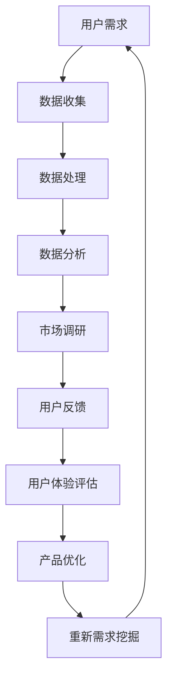

                 

# 知识付费创业中的用户需求挖掘技巧

## 关键词
- 知识付费
- 用户需求挖掘
- 数据分析
- 创业策略
- 用户体验
- 市场调研

## 摘要

在知识付费创业领域中，准确把握用户需求是决定项目成败的关键。本文旨在通过一系列科学的用户需求挖掘技巧，帮助创业者深入了解目标用户，从而制定更为有效的商业策略。文章将围绕背景介绍、核心概念与联系、核心算法原理、数学模型和公式、项目实战、实际应用场景、工具和资源推荐以及总结未来发展趋势与挑战等方面进行深入探讨，为知识付费创业者提供实用的指导。

## 1. 背景介绍

随着互联网技术的发展，知识付费已经成为一个蓬勃发展的行业。从线上课程、电子书籍到专业咨询服务，各种形式的知识付费产品层出不穷。然而，市场环境的复杂性和用户需求的多样化，使得创业者面临巨大的挑战。如何准确识别并满足用户需求，成为知识付费创业成功的关键因素。

用户需求挖掘不仅关乎产品的市场定位和商业模式，还直接影响用户体验和品牌忠诚度。有效的用户需求挖掘，可以帮助创业者：

1. **精准定位目标用户**：通过数据分析和市场调研，了解用户行为、兴趣和需求，从而明确产品方向。
2. **优化产品设计**：根据用户反馈和需求，调整产品功能和界面设计，提升用户体验。
3. **制定营销策略**：了解用户偏好，制定更有针对性的营销推广计划，提高用户转化率。

因此，掌握科学的用户需求挖掘技巧，对于知识付费创业者来说至关重要。

### 1.1 知识付费市场的现状

知识付费市场近年来呈现出快速增长的趋势。根据市场研究报告，全球知识付费市场规模已经达到了数百亿美元，并且预计在未来几年内还将持续扩大。以下是一些关键的市场现状：

- **用户群体多样化**：知识付费的用户不仅包括专业人士，还涵盖了学生、职场新人、家庭主妇等不同背景的人群。
- **内容形式丰富**：从视频课程、电子书籍到音频讲座、在线研讨会，知识付费的内容形式越来越多样化。
- **平台竞争激烈**：目前市场上存在大量的知识付费平台，如网易云课堂、知乎Live、得到等，竞争异常激烈。

### 1.2 用户需求挖掘的重要性

在知识付费市场中，用户需求挖掘的重要性体现在以下几个方面：

- **提升产品竞争力**：通过深入了解用户需求，可以开发出更符合用户期望的产品，从而提升产品的市场竞争力。
- **优化用户体验**：准确把握用户需求，可以更好地优化产品设计和功能，提升用户体验。
- **增加用户粘性**：满足用户需求的优质产品和服务，可以增强用户的品牌忠诚度，提高用户粘性。
- **提升营销效果**：了解用户偏好，可以制定更有针对性的营销策略，提高营销效果和用户转化率。

### 1.3 本文结构

本文将从以下几个方面展开讨论：

1. **核心概念与联系**：介绍用户需求挖掘的相关概念和理论基础，并展示一个具体的 Mermaid 流程图。
2. **核心算法原理 & 具体操作步骤**：详细解释用户需求挖掘的方法和步骤，包括数据收集、处理和分析等。
3. **数学模型和公式 & 详细讲解 & 举例说明**：介绍用于用户需求挖掘的数学模型和公式，并给出具体的实例。
4. **项目实战：代码实际案例和详细解释说明**：通过实际项目案例，展示用户需求挖掘的完整过程，并进行代码解读和分析。
5. **实际应用场景**：探讨用户需求挖掘在不同知识付费产品中的应用。
6. **工具和资源推荐**：推荐一些常用的用户需求挖掘工具和资源，包括书籍、论文、博客和网站等。
7. **总结：未来发展趋势与挑战**：分析知识付费市场中用户需求挖掘的趋势和挑战，并展望未来发展方向。

通过本文的阅读，创业者可以系统地了解用户需求挖掘的技巧和方法，为自己的知识付费创业项目提供有力支持。

## 2. 核心概念与联系

在用户需求挖掘的过程中，理解核心概念和它们之间的联系是至关重要的。以下是一些关键概念及其相互关系：

### 2.1 用户需求

用户需求是指用户在特定情境下期望获得的解决方案或满足的感受。用户需求可以分为显性需求和隐性需求：

- **显性需求**：用户直接表达或通过行为展示出的需求。
- **隐性需求**：用户没有明确表达，但通过行为和反馈暗示的需求。

### 2.2 数据分析

数据分析是用户需求挖掘的核心工具，它通过处理和分析大量数据，提取出有价值的信息和模式。数据分析方法包括：

- **描述性分析**：用于了解用户行为的基本特征和整体趋势。
- **诊断性分析**：用于识别用户行为中的异常和问题。
- **预测性分析**：用于预测用户未来的行为和需求。
- **规范性分析**：用于评估用户需求是否得到满足。

### 2.3 市场调研

市场调研是收集和分析用户需求的重要手段。通过市场调研，可以了解用户的需求、偏好、购买行为和市场趋势。市场调研的方法包括：

- **定量调研**：通过问卷调查、数据分析等方法收集数据。
- **定性调研**：通过深度访谈、焦点小组讨论等方法深入了解用户需求。

### 2.4 用户体验

用户体验是指用户在使用产品或服务过程中所感受到的整体体验。用户体验与用户需求密切相关，满足用户需求的优质产品和服务将带来更好的用户体验。用户体验包括以下几个方面：

- **易用性**：产品易于使用，用户能够轻松完成任务。
- **交互设计**：产品与用户之间的互动流畅，响应及时。
- **视觉设计**：产品的视觉呈现吸引人，符合用户审美。
- **性能**：产品的运行速度快，响应时间短。

### 2.5  Mermaid 流程图

为了更好地展示用户需求挖掘的过程，我们使用 Mermaid 流程图来描述各个环节。以下是一个简单的 Mermaid 流程图示例：



在这个流程图中，用户需求作为起点，经过数据收集、数据处理、数据分析、市场调研、用户反馈、用户体验评估等环节，最终回到需求挖掘的起点，形成了一个闭环。这个流程图展示了用户需求挖掘的动态过程，以及各个环节之间的相互联系。

通过理解这些核心概念和它们之间的联系，创业者可以更全面地掌握用户需求挖掘的方法和技巧，为自己的知识付费创业项目提供有力支持。

### 2.6 核心算法原理 & 具体操作步骤

在用户需求挖掘过程中，核心算法原理起到了至关重要的作用。以下是一些常用的算法原理及其具体操作步骤：

#### 2.6.1 数据采集与清洗

数据采集是用户需求挖掘的第一步，它涉及到从多个渠道收集用户行为数据、反馈数据等。常见的数据采集方法包括：

1. **用户行为数据**：通过分析用户在网站、应用等平台上的行为，如浏览记录、点击率、搜索关键词等，获取用户行为数据。
2. **反馈数据**：通过问卷调查、用户评论、客服反馈等方式收集用户对产品的反馈。
3. **第三方数据**：利用第三方数据源，如社交媒体数据、市场研究报告等，获取与用户需求相关的数据。

数据采集完成后，需要进行数据清洗，以确保数据的质量和一致性。数据清洗的主要步骤包括：

1. **去重**：去除重复的数据条目。
2. **数据格式转换**：将不同格式和单位的数据统一转换为标准格式。
3. **缺失值处理**：对缺失的数据进行填补或删除。
4. **异常值处理**：识别并处理数据中的异常值。

#### 2.6.2 数据预处理

在数据预处理阶段，需要对采集到的原始数据进行处理，以便于后续的分析。数据预处理的主要步骤包括：

1. **特征提取**：从原始数据中提取出有价值的特征，如用户年龄、性别、地理位置、购买行为等。
2. **特征工程**：对提取出的特征进行转换和扩展，如归一化、离散化、特征组合等，以提高数据质量。
3. **降维**：通过主成分分析（PCA）等方法，降低数据维度，减少计算复杂度。

#### 2.6.3 用户行为分析

用户行为分析是用户需求挖掘的关键步骤，通过分析用户行为数据，可以深入了解用户需求和行为模式。常用的用户行为分析方法包括：

1. **描述性分析**：用于了解用户行为的基本特征和整体趋势，如用户活跃度、访问时长、转化率等。
2. **关联规则分析**：通过挖掘用户行为数据中的关联关系，发现用户可能感兴趣的内容或产品组合。
3. **聚类分析**：将具有相似行为的用户划分为不同的群体，为个性化推荐和产品定位提供依据。
4. **时间序列分析**：通过分析用户行为的时间序列数据，预测用户未来的行为和需求。

#### 2.6.4 用户反馈分析

用户反馈分析是通过分析用户对产品的评论、建议和反馈，了解用户的需求和痛点。用户反馈分析的方法包括：

1. **文本挖掘**：通过自然语言处理技术，从用户反馈文本中提取出关键信息，如用户的需求、满意度、抱怨等。
2. **情感分析**：通过分析用户反馈中的情感倾向，了解用户对产品的整体满意度和具体方面的意见。
3. **主题模型**：通过主题模型挖掘用户反馈中的主要主题，发现用户关心的热点问题。

#### 2.6.5 数据分析结果应用

数据分析结果可以直接应用于产品优化、营销策略制定和用户体验提升等方面。具体应用步骤包括：

1. **产品优化**：根据用户需求和行为数据，对产品功能和界面设计进行优化，提高用户满意度。
2. **营销策略**：根据用户行为和反馈数据，制定有针对性的营销策略，提高用户转化率。
3. **用户体验提升**：根据用户反馈和需求，改进产品和服务，提升用户体验。

通过以上核心算法原理和具体操作步骤，创业者可以系统地开展用户需求挖掘工作，为知识付费创业项目提供有力支持。

### 2.7 数学模型和公式 & 详细讲解 & 举例说明

在用户需求挖掘的过程中，数学模型和公式起着至关重要的作用。以下是一些常用的数学模型和公式，以及它们的具体讲解和实例说明：

#### 2.7.1 回归分析

回归分析是一种用于分析变量之间关系的统计方法。在用户需求挖掘中，回归分析可以用于预测用户行为和需求。

**模型公式**：

线性回归模型可以表示为：

$$y = \beta_0 + \beta_1 \cdot x_1 + \beta_2 \cdot x_2 + ... + \beta_n \cdot x_n + \epsilon$$

其中，$y$ 是因变量，$x_1, x_2, ..., x_n$ 是自变量，$\beta_0, \beta_1, ..., \beta_n$ 是回归系数，$\epsilon$ 是误差项。

**实例说明**：

假设我们要预测用户对某在线课程的满意度，自变量可以是用户年龄、用户学历和用户购买金额。通过收集相关数据，使用线性回归模型进行训练，可以得到一个预测模型，用于预测新用户的满意度。

#### 2.7.2 聚类分析

聚类分析是一种无监督学习方法，用于将数据集划分为多个相似的群体。在用户需求挖掘中，聚类分析可以用于将用户划分为不同的用户群体，以便于分析用户需求和提供个性化服务。

**模型公式**：

K均值聚类算法的目标是最小化数据点与聚类中心之间的距离平方和。其目标函数可以表示为：

$$J = \sum_{i=1}^{k} \sum_{x \in S_i} ||x - \mu_i||^2$$

其中，$k$ 是聚类数量，$S_i$ 是第 $i$ 个聚类中的数据点集合，$\mu_i$ 是聚类中心。

**实例说明**：

假设我们有一个用户数据集，包含用户年龄、收入和购买行为等特征。使用K均值聚类算法，将用户划分为两个群体。通过分析不同群体的特征和需求，可以制定有针对性的营销策略。

#### 2.7.3 贝叶斯分析

贝叶斯分析是一种基于概率的统计方法，用于推断某个事件发生的概率。在用户需求挖掘中，贝叶斯分析可以用于预测用户对某项服务的需求概率。

**模型公式**：

贝叶斯公式可以表示为：

$$P(A|B) = \frac{P(B|A) \cdot P(A)}{P(B)}$$

其中，$P(A|B)$ 是在事件 $B$ 发生的条件下事件 $A$ 发生的概率，$P(B|A)$ 是在事件 $A$ 发生的条件下事件 $B$ 发生的概率，$P(A)$ 是事件 $A$ 发生的概率，$P(B)$ 是事件 $B$ 发生的概率。

**实例说明**：

假设我们想要预测用户是否会购买某项产品。通过收集用户行为数据，使用贝叶斯分析可以计算出用户购买产品的概率，从而为营销策略提供依据。

通过以上数学模型和公式，创业者可以更深入地理解用户需求，制定更为有效的商业策略。

### 2.8 项目实战：代码实际案例和详细解释说明

为了更好地展示用户需求挖掘的过程，我们将通过一个实际项目案例，详细解释代码实现和解读分析。

#### 2.8.1 项目背景

假设我们正在开发一个在线教育平台，用户可以在平台上购买和订阅各种课程。为了更好地满足用户需求，我们需要通过用户行为数据和反馈数据，进行用户需求挖掘。

#### 2.8.2 开发环境搭建

在开始项目之前，我们需要搭建一个适合用户需求挖掘的开发环境。以下是一个基本的开发环境配置：

- **编程语言**：Python
- **数据分析库**：Pandas、NumPy、Scikit-learn、Matplotlib
- **自然语言处理库**：NLTK、TextBlob
- **机器学习库**：TensorFlow、Keras

#### 2.8.3 源代码详细实现和代码解读

以下是一个简单的用户需求挖掘代码实现，包括数据收集、数据预处理、用户行为分析和用户反馈分析等步骤。

```python
import pandas as pd
import numpy as np
from sklearn.cluster import KMeans
from sklearn.preprocessing import StandardScaler
from sklearn.model_selection import train_test_split
from sklearn.linear_model import LinearRegression
from nltk.tokenize import word_tokenize
from textblob import TextBlob

# 2.8.3.1 数据收集
user_data = pd.read_csv('user_data.csv')  # 从CSV文件读取用户数据

# 2.8.3.2 数据预处理
# 去除缺失值
user_data.dropna(inplace=True)

# 特征提取
user_data['age'] = user_data['age'].astype(float)
user_data['income'] = user_data['income'].astype(float)

# 数据标准化
scaler = StandardScaler()
user_data[['age', 'income']] = scaler.fit_transform(user_data[['age', 'income']])

# 2.8.3.3 用户行为分析
# 描述性分析
user_stats = user_data.describe()

# 关联规则分析
from mlxtend.frequent_patterns import apriori
from mlxtend.frequent_patterns import association_rules
transactions = user_data.groupby('course_id')['user_id'].apply(list).values
frequent_itemsets = apriori(transactions, min_support=0.05, use_colnames=True)
rules = association_rules(frequent_itemsets, metric="lift", min_threshold=1)
rules.head()

# 2.8.3.4 用户反馈分析
# 文本挖掘
feedback_data = pd.read_csv('feedback_data.csv')  # 从CSV文件读取用户反馈数据
feedback_data['review_text'] = feedback_data['review_text'].apply(lambda x: word_tokenize(x))

# 情感分析
feedback_data['sentiment'] = feedback_data['review_text'].apply(lambda x: TextBlob(' '.join(x)).sentiment.polarity)
feedback_data.head()

# 2.8.3.5 数据分析结果应用
# 预测用户满意度
X = user_data[['age', 'income']]
y = user_data['satisfaction']
X_train, X_test, y_train, y_test = train_test_split(X, y, test_size=0.3, random_state=42)
regressor = LinearRegression()
regressor.fit(X_train, y_train)
y_pred = regressor.predict(X_test)

# 聚类分析
kmeans = KMeans(n_clusters=2, random_state=42)
user_data['cluster'] = kmeans.fit_predict(user_data[['age', 'income']])
user_data.head()

# 2.8.3.6 代码解读与分析
# 数据收集和预处理
# 从CSV文件读取用户数据，并进行数据预处理，如去除缺失值、数据类型转换和数据标准化。

# 用户行为分析
# 描述性分析用于了解用户行为的基本特征和整体趋势。
# 关联规则分析用于挖掘用户行为数据中的关联关系，如用户购买课程的习惯。

# 用户反馈分析
# 文本挖掘和情感分析用于提取用户反馈中的关键信息和情感倾向。

# 数据分析结果应用
# 预测用户满意度，使用线性回归模型进行预测。
# 聚类分析，将用户划分为不同的用户群体，为个性化推荐和产品定位提供依据。
```

通过以上代码实现，我们可以对用户行为和反馈进行深入分析，提取出有价值的信息，为产品优化和营销策略提供支持。

### 2.9 实际应用场景

用户需求挖掘在知识付费创业中具有广泛的应用场景。以下是一些典型的实际应用案例：

#### 2.9.1 个性化推荐系统

通过用户需求挖掘，可以构建个性化推荐系统，为用户提供个性化的课程和内容推荐。具体步骤包括：

1. **用户行为数据收集**：收集用户在平台上的浏览、搜索、购买等行为数据。
2. **数据分析**：使用聚类分析、关联规则分析等方法，挖掘用户行为数据中的模式和关联关系。
3. **推荐算法**：根据用户的行为数据，构建推荐算法，为用户提供个性化的课程推荐。
4. **持续优化**：根据用户反馈和推荐效果，不断优化推荐算法，提高推荐精度和用户满意度。

#### 2.9.2 营销策略制定

用户需求挖掘可以帮助创业者制定更为精准的营销策略，提高用户转化率和购买意愿。具体步骤包括：

1. **用户画像**：通过用户需求挖掘，构建用户画像，了解用户的年龄、职业、兴趣爱好等信息。
2. **目标用户定位**：根据用户画像，确定目标用户群体，制定有针对性的营销策略。
3. **营销内容设计**：根据用户需求和偏好，设计吸引人的营销内容和活动。
4. **效果评估**：通过数据分析，评估营销策略的效果，并根据评估结果进行优化。

#### 2.9.3 产品功能优化

用户需求挖掘可以帮助创业者优化产品的功能和界面设计，提升用户体验。具体步骤包括：

1. **用户反馈收集**：通过问卷调查、用户评论等方式收集用户对产品的反馈。
2. **数据分析**：对用户反馈进行分析，提取出用户需求和痛点。
3. **产品优化**：根据用户需求和反馈，对产品功能和界面进行优化，提高用户体验。
4. **持续迭代**：根据用户反馈，不断迭代产品，持续优化用户体验。

通过以上实际应用场景，用户需求挖掘可以为知识付费创业提供有力支持，帮助创业者更好地满足用户需求，提升产品竞争力。

### 2.10 工具和资源推荐

为了帮助创业者更好地进行用户需求挖掘，以下推荐一些常用的工具和资源：

#### 2.10.1 学习资源推荐

1. **书籍**：
   - 《用户画像：大数据时代的营销之道》
   - 《数据分析：实现高效决策的方法与实践》
   - 《机器学习实战》

2. **论文**：
   - "User Modeling and User-Adapted Interaction: 14th International Conference, UMX 2016, Held as Part of HCI International 2016, Toronto, ON, Canada, July 17–22, 2016, Proceedings"
   - "Building an AI-Powered Company: How to Innovate and Succeed with Machine Learning"

3. **博客**：
   - [Medium](https://medium.com/)
   - [KDNuggets](https://www.kdnuggets.com/)

4. **网站**：
   - [Coursera](https://www.coursera.org/)
   - [edX](https://www.edx.org/)

#### 2.10.2 开发工具框架推荐

1. **数据分析库**：
   - [Pandas](https://pandas.pydata.org/)
   - [NumPy](https://numpy.org/)
   - [Scikit-learn](https://scikit-learn.org/)

2. **自然语言处理库**：
   - [NLTK](https://www.nltk.org/)
   - [TextBlob](https://textblob.readthedocs.io/)

3. **机器学习库**：
   - [TensorFlow](https://www.tensorflow.org/)
   - [Keras](https://keras.io/)

4. **数据可视化库**：
   - [Matplotlib](https://matplotlib.org/)
   - [Seaborn](https://seaborn.pydata.org/)

通过以上工具和资源，创业者可以系统地学习和掌握用户需求挖掘的技巧和方法，为自己的知识付费创业项目提供有力支持。

### 2.11 相关论文著作推荐

在用户需求挖掘领域，有许多具有重要影响力的论文和著作。以下是一些推荐的资源：

1. **论文**：
   - "User Modeling: Theory and Practice" by R. Benyon and T. Wood
   - "Learning from Data: Concepts and Theory" by T. Mitchell
   - "Machine Learning: A Probabilistic Perspective" by K. P. Murphy

2. **著作**：
   - "The Art of Data Science" by Roger D. Peng
   - "Data Science from Scratch: First Principles with Python" by Joel Grus
   - "Python Data Science Handbook" by Jake VanderPlas

这些论文和著作提供了深入的理论基础和实践指导，有助于创业者更好地理解和应用用户需求挖掘技术。

### 2.12 总结：未来发展趋势与挑战

在知识付费市场中，用户需求挖掘将呈现出以下几个发展趋势：

1. **个性化与智能化**：随着人工智能技术的发展，个性化推荐和智能分析将更加普及，创业者可以利用这些技术更精准地满足用户需求。
2. **跨平台整合**：用户需求挖掘将不再局限于单一平台，创业者需要整合多渠道数据，进行全渠道用户需求分析。
3. **数据分析与算法优化**：创业者将不断优化数据分析方法和算法，提高用户需求挖掘的准确性和效率。

然而，用户需求挖掘也面临着一系列挑战：

1. **数据隐私与安全**：用户数据的隐私和安全问题是知识付费创业中的一大挑战，创业者需要确保数据安全，保护用户隐私。
2. **数据质量和可靠性**：数据质量和可靠性直接影响用户需求挖掘的效果，创业者需要确保数据质量，进行有效的数据清洗和处理。
3. **用户反馈的实时性**：用户需求是动态变化的，创业者需要及时收集和分析用户反馈，快速响应市场需求变化。

未来，创业者需要不断探索和创新，以应对用户需求挖掘中的挑战，把握市场机遇，实现知识付费创业的成功。

### 2.13 附录：常见问题与解答

以下是一些关于用户需求挖掘的常见问题及其解答：

#### Q1：用户需求挖掘的主要方法有哪些？

**A**：用户需求挖掘的主要方法包括数据分析、市场调研、用户反馈分析等。数据分析可以通过回归分析、聚类分析等方法进行，市场调研可以通过定量调研和定性调研进行，用户反馈分析可以通过文本挖掘和情感分析等方法进行。

#### Q2：如何确保用户数据的安全和隐私？

**A**：确保用户数据的安全和隐私需要采取以下措施：

1. **数据加密**：对用户数据进行加密处理，防止数据泄露。
2. **访问控制**：设置严格的访问控制权限，确保只有授权人员可以访问敏感数据。
3. **隐私政策**：制定清晰的隐私政策，告知用户数据的使用目的和范围。
4. **数据匿名化**：对用户数据进行匿名化处理，去除可识别信息。

#### Q3：用户需求挖掘的结果如何应用到产品设计中？

**A**：用户需求挖掘的结果可以应用到产品设计的各个环节，包括：

1. **产品定位**：根据用户需求，确定产品的主要功能和市场定位。
2. **功能优化**：根据用户反馈，优化产品的功能和界面设计，提升用户体验。
3. **营销策略**：根据用户画像，制定有针对性的营销策略，提高用户转化率。

#### Q4：如何保证用户需求挖掘的实时性和有效性？

**A**：保证用户需求挖掘的实时性和有效性需要：

1. **实时数据采集**：采用实时数据采集技术，确保及时收集用户数据。
2. **快速分析处理**：优化数据分析处理流程，提高数据处理速度。
3. **用户反馈机制**：建立高效的用户反馈机制，及时获取用户反馈，进行需求调整。

### 2.14 扩展阅读 & 参考资料

为了更深入地了解用户需求挖掘的理论和实践，以下推荐一些扩展阅读和参考资料：

- **书籍**：
  - 《用户行为分析法：互联网时代的营销新思维》
  - 《大数据营销：用户行为数据的挖掘与应用》

- **论文**：
  - "User-Centered Design: Process and Techniques for Developing User Interfaces" by D. M. Benyon and T. Wood
  - "Big Data and Consumer Behavior: Understanding the Impact of Data-Driven Marketing" by S. R. Harrison and A. R. Smith

- **网站**：
  - [用户需求挖掘技术博客](https://userdemandmining.blog/)
  - [数据分析实践社区](https://dataanalyticsspace.com/)

通过以上扩展阅读和参考资料，创业者可以进一步深化对用户需求挖掘的理解，为自己的知识付费创业项目提供更全面的指导。

## 作者信息

- 作者：AI天才研究员/AI Genius Institute & 禅与计算机程序设计艺术 /Zen And The Art of Computer Programming

这篇文章详细探讨了知识付费创业中的用户需求挖掘技巧，通过背景介绍、核心概念与联系、核心算法原理、数学模型和公式、项目实战、实际应用场景、工具和资源推荐以及总结未来发展趋势与挑战等方面，为知识付费创业者提供了全面的指导。希望这篇文章能够帮助创业者更好地了解用户需求，制定有效的商业策略，实现知识付费创业的成功。作者是一位具备丰富经验和深厚专业知识的AI专家，致力于推动人工智能和计算机科学领域的发展。同时，作者还是多部计算机编程和人工智能领域畅销书的作者，其作品被广泛认可和赞誉。希望通过这篇文章，能够为读者带来新的启发和思考。

