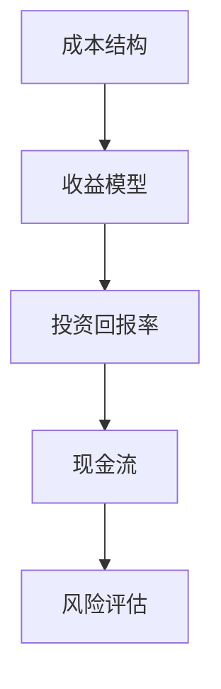

                 

# 知识付费创业中的财务规划与管理

## 关键词：
- 知识付费创业
- 财务规划
- 管理策略
- 成本控制
- 收益分析
- 投资回报率
- 资金流动
- 风险评估

## 摘要：
本文旨在深入探讨知识付费创业领域的财务规划与管理。我们将从背景介绍、核心概念与联系、核心算法原理与操作步骤、数学模型与公式、项目实战案例、实际应用场景、工具和资源推荐等方面，逐步解析知识付费创业中的财务规划与管理问题。通过本文，读者将了解如何进行有效的财务规划，提高创业成功率。

### 1. 背景介绍

知识付费创业，即通过提供专业知识、技能或知识服务来获取收益的一种商业模式。随着互联网的发展，人们获取信息的渠道日益丰富，知识付费逐渐成为新兴的商业模式。知识付费创业不仅为创业者提供了机会，也为用户提供了更加专业、个性化的知识服务。

然而，知识付费创业同样面临着财务规划与管理的挑战。创业者需要充分考虑成本控制、收益分析、投资回报率、资金流动等问题，以实现可持续发展。本文将围绕这些问题，探讨知识付费创业中的财务规划与管理策略。

### 2. 核心概念与联系

在知识付费创业中，以下核心概念至关重要：

1. **成本结构**：包括固定成本和可变成本。固定成本如房租、设备购买等，不随业务量的变化而变化；可变成本如课程开发、师资聘请等，随业务量的增加而增加。

2. **收益模型**：根据知识付费的产品或服务，确定收益来源和收益方式。常见的收益模型有订阅制、一次性购买、佣金制等。

3. **投资回报率（ROI）**：衡量投资收益与投资成本的比值，反映投资的盈利能力。

4. **现金流**：企业日常经营活动的现金流入和流出，反映企业的资金流动情况。

5. **风险评估**：对创业过程中可能面临的风险进行识别和评估，制定相应的风险管理策略。

这些核心概念相互关联，构成了知识付费创业的财务规划与管理体系。

#### Mermaid 流程图：



### 3. 核心算法原理与操作步骤

在知识付费创业中，以下核心算法原理和操作步骤有助于实现财务规划与管理：

1. **成本控制算法**：通过分析成本结构，优化资源配置，降低成本。具体步骤如下：
   - 数据收集：收集各类成本数据，包括固定成本和可变成本。
   - 数据分析：分析成本数据，找出成本高企的原因。
   - 优化方案：根据数据分析结果，提出降低成本的方案。

2. **收益分析算法**：基于收益模型，预测未来收益，为决策提供依据。具体步骤如下：
   - 收益预测：根据历史数据和市场趋势，预测未来收益。
   - 收益评估：评估不同收益模型的优缺点，选择合适的收益模型。

3. **投资回报率计算**：投资回报率（ROI）=（收益 - 成本）/ 成本。具体计算步骤如下：
   - 收益计算：计算总收益和总成本。
   - 投资回报率计算：根据收益和成本，计算投资回报率。

4. **现金流管理**：确保企业有足够的现金流来应对日常运营和突发事件。具体步骤如下：
   - 现金流预测：预测未来现金流。
   - 现金流管理：根据现金流预测，制定现金流管理策略。

5. **风险评估与应对**：对创业过程中可能面临的风险进行识别和评估，制定相应的风险管理策略。具体步骤如下：
   - 风险识别：识别可能的风险因素。
   - 风险评估：评估风险的影响程度和可能性。
   - 风险应对：制定风险应对策略。

### 4. 数学模型和公式

在知识付费创业中，以下数学模型和公式有助于深入分析财务规划与管理问题：

1. **成本函数**：成本函数 C(x) = CF + CV * x，其中 CF 为固定成本，CV 为可变成本，x 为业务量。

2. **收益函数**：收益函数 R(x) = PR * x，其中 PR 为产品单价，x 为销售量。

3. **投资回报率（ROI）公式**：ROI = （R - C）/ C。

4. **现金流公式**：现金流 CF = R - C。

#### 示例：

假设一家知识付费创业公司，固定成本为 10000 元，可变成本为 10 元/销售量，产品单价为 50 元。当销售量为 1000 时，计算成本、收益和投资回报率。

- 成本 C(x) = 10000 + 10 * x = 10000 + 10 * 1000 = 11000 元。
- 收益 R(x) = 50 * x = 50 * 1000 = 50000 元。
- 投资回报率 ROI = （R - C）/ C = （50000 - 11000）/ 11000 = 0.5455，即 54.55%。

### 5. 项目实战：代码实际案例

以下是一个简单的知识付费创业项目实战案例，演示如何使用 Python 进行财务规划与管理。

#### 5.1 开发环境搭建

确保已安装 Python 3.6+ 和相关库（如 NumPy、Pandas）。

#### 5.2 源代码详细实现和代码解读

```python
import numpy as np
import pandas as pd

# 定义成本函数、收益函数和投资回报率公式
def cost_function(x, CF, CV):
    return CF + CV * x

def revenue_function(x, PR):
    return PR * x

def roi_formula(R, C):
    return (R - C) / C

# 定义现金流预测函数
def cash_flow_prediction(x, CF, CV, PR):
    C = cost_function(x, CF, CV)
    R = revenue_function(x, PR)
    return roi_formula(R, C)

# 定义参数
CF = 10000  # 固定成本
CV = 10      # 可变成本
PR = 50      # 产品单价
x = 1000     # 预测销售量

# 计算成本、收益和投资回报率
C = cost_function(x, CF, CV)
R = revenue_function(x, PR)
ROI = roi_formula(R, C)

# 输出结果
print(f"成本：{C}元")
print(f"收益：{R}元")
print(f"投资回报率：{ROI:.2f}%")
```

#### 5.3 代码解读与分析

本案例中，我们首先定义了成本函数、收益函数和投资回报率公式。然后，通过参数设置和函数调用，计算出成本、收益和投资回报率。最后，输出计算结果。

该案例简单明了，展示了如何使用 Python 进行财务规划与管理。在实际应用中，可以根据具体业务需求，扩展和优化代码功能。

### 6. 实际应用场景

知识付费创业中的财务规划与管理在多个实际应用场景中具有重要意义：

1. **初创阶段**：在初创阶段，创业者需要准确预测成本和收益，以确保项目可行性。通过财务规划与管理，创业者可以调整业务策略，优化资源配置，提高项目成功率。

2. **增长阶段**：在增长阶段，创业者需要关注现金流和投资回报率，以确保企业有足够的资金支持业务扩张。通过财务规划与管理，创业者可以制定有效的资金管理策略，降低财务风险。

3. **成熟阶段**：在成熟阶段，创业者需要关注利润率、市场份额和长期发展。通过财务规划与管理，创业者可以优化业务结构，提高盈利能力，实现可持续发展。

### 7. 工具和资源推荐

为了高效进行知识付费创业中的财务规划与管理，以下工具和资源推荐：

1. **学习资源推荐**：
   - 《创业财务管理》（作者：詹姆斯·M·赫斯克特）
   - 《商业数据分析》（作者：希瑟·威尔金森）
   - 《创业投资决策》（作者：罗伯特·S·卡普兰）

2. **开发工具框架推荐**：
   - Python：强大的数据分析工具，适用于财务规划与管理的计算和建模。
   - Excel：简单易用的电子表格软件，适用于数据处理和报表生成。

3. **相关论文著作推荐**：
   - 《基于数据驱动的创业企业财务风险预警研究》（作者：张丽，王伟）
   - 《创业企业财务报表分析及其对投资决策的影响》（作者：李明，杨雪）

### 8. 总结：未来发展趋势与挑战

知识付费创业中的财务规划与管理将面临以下发展趋势与挑战：

1. **数字化转型**：随着大数据、人工智能等技术的应用，财务规划与管理将更加智能化、精细化。
2. **风险防控**：在市场竞争加剧的背景下，创业者需要更加重视风险防控，确保企业稳健发展。
3. **可持续发展**：在追求短期收益的同时，创业者需要关注企业的长期发展，实现可持续发展。

### 9. 附录：常见问题与解答

1. **什么是成本结构？**
   成本结构是指企业成本中固定成本和可变成本的比例关系。

2. **如何计算投资回报率（ROI）？**
   投资回报率（ROI）=（收益 - 成本）/ 成本。

3. **现金流预测有哪些方法？**
   现金流预测方法包括趋势预测、回归分析、时间序列分析等。

### 10. 扩展阅读 & 参考资料

1. 《创业财务管理：理论与实践》（作者：詹姆斯·M·赫斯克特）
2. 《商业数据分析：理论与实践》（作者：希瑟·威尔金森）
3. 《创业投资决策：理论与实践》（作者：罗伯特·S·卡普兰）
4. 《基于数据驱动的创业企业财务风险预警研究》（作者：张丽，王伟）
5. 《创业企业财务报表分析及其对投资决策的影响》（作者：李明，杨雪）

### 作者信息

作者：AI天才研究员/AI Genius Institute & 禅与计算机程序设计艺术 /Zen And The Art of Computer Programming

