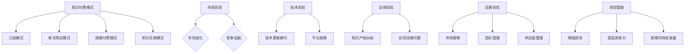

                 

### 背景介绍

知识付费，作为一种新型的商业模式，近年来在全球范围内迅猛发展。知识付费的兴起，不仅改变了传统的教育模式，也推动了数字经济的发展。然而，随着市场的不断扩张，知识付费创业中的风险管理问题也逐渐凸显出来。本文将围绕知识付费创业中的风险管理进行探讨，旨在为创业者提供一些实用的指导和建议。

首先，我们需要明确知识付费的定义。知识付费是指用户为获取专业知识和技能而向提供方支付的费用。这种付费模式不仅涵盖了在线教育、专业技能培训等传统领域，还延伸到了知识分享、咨询服务等新兴领域。知识付费的核心在于为用户提供有价值的内容和服务，满足其在学习、职业发展等方面的需求。

知识付费的兴起，离不开以下几个因素：

1. **互联网技术的发展**：互联网技术的不断进步，特别是移动互联网的普及，为知识付费提供了广阔的平台。用户可以通过各种移动设备随时随地进行学习，这大大提高了学习的便捷性和效率。

2. **用户需求的变化**：随着社会经济的发展和人们生活水平的提高，越来越多的人开始关注自我成长和职业发展。他们愿意为获取专业知识和技能付费，以提升自己的竞争力。

3. **内容生产的多样化**：知识付费领域的迅速扩张，吸引了大量的内容生产者。他们通过自己的专业知识、经验和技能，为用户提供高质量的内容和服务。

然而，知识付费创业并非一片坦途。在市场扩张的同时，创业者面临着诸多风险。这些风险包括市场风险、技术风险、法律风险、运营风险等。本文将重点分析这些风险，并提供相应的应对策略。

接下来，我们将详细探讨知识付费创业中的核心概念，包括知识付费模式、风险类型及其影响，为后续内容提供理论基础。

### 核心概念与联系

在深入探讨知识付费创业中的风险管理之前，我们首先需要了解一些核心概念，这些概念将为我们分析风险提供理论基础。

#### 知识付费模式

知识付费模式可以分为几种类型，包括：

1. **订阅模式**：用户支付一定费用，即可无限次地访问平台上的所有内容。这种模式通常适用于大型知识库或者视频课程。

2. **单次购买模式**：用户为特定内容支付一次费用，即可永久访问该内容。这种模式适用于较长的课程或者专业书籍。

3. **按需付费模式**：用户按需支付，每次访问或学习特定内容都需要付费。这种模式适用于短小精悍的教程或者在线咨询服务。

4. **积分兑换模式**：用户通过完成特定任务或者参与活动获得积分，积分可以用来兑换知识内容或服务。

不同模式各有优缺点，创业者需要根据自身业务特点和市场定位选择合适的模式。

#### 风险类型及其影响

在知识付费创业中，风险类型主要包括以下几个方面：

1. **市场风险**：市场风险是指由于市场需求变化或竞争加剧导致业务发展受阻的风险。例如，如果市场上同类产品过多，用户选择余地大，可能导致某款产品的用户流失。

2. **技术风险**：技术风险包括技术更新换代带来的风险和平台技术故障导致的风险。技术迭代速度过快可能导致现有产品迅速过时，而平台故障可能影响用户体验，损害品牌形象。

3. **法律风险**：法律风险包括知识产权纠纷、合同法律问题等。知识付费领域涉及大量知识产权问题，如内容原创性、版权授权等，若处理不当，可能面临法律诉讼。

4. **运营风险**：运营风险包括市场营销、团队管理、供应链管理等方面的问题。例如，营销策略不当可能导致投入产出比失衡，团队管理不善可能导致人才流失。

不同类型的风险对业务的影响各异，需要创业者综合考虑，制定相应的风险应对策略。

#### 风险管理的重要性

风险管理在知识付费创业中具有重要意义。有效的风险管理可以帮助企业：

1. **降低损失**：通过识别和评估潜在风险，企业可以提前采取措施，避免或减少风险带来的损失。

2. **提高竞争力**：风险管理有助于企业识别市场机会，优化业务模式，提高市场竞争力。

3. **保障可持续发展**：通过建立完善的内部控制和风险管理体系，企业可以保障业务的稳定发展，提高抗风险能力。

为了更直观地理解上述核心概念及其联系，我们可以使用Mermaid流程图（注意：以下流程图中的节点中不含括号、逗号等特殊字符）：



通过以上分析，我们可以看到知识付费创业中的风险管理不仅涉及多个核心概念，还与企业的市场定位、业务模式、团队建设等方面紧密相关。接下来，我们将详细探讨知识付费创业中的核心算法原理和具体操作步骤，进一步丰富我们对风险管理的理解。

### 核心算法原理 & 具体操作步骤

在知识付费创业中，风险管理不仅需要理论指导，还需要具体的操作步骤。以下将介绍一些核心算法原理，并结合实际操作步骤，帮助创业者更有效地进行风险管理。

#### 1. 风险评估算法

风险评估是风险管理的重要环节。创业者需要通过系统的方法对潜在风险进行识别、分析和评估，以便制定相应的应对措施。

**算法原理**：

- **风险识别**：通过问卷调查、访谈、文献调研等方法，收集与知识付费创业相关的风险信息。
- **风险分析**：运用逻辑推理、SWOT分析等工具，对风险发生的可能性及其影响程度进行分析。
- **风险评估**：采用概率论和统计学方法，对风险进行定量评估，确定其严重程度。

**具体操作步骤**：

1. **制定风险评估计划**：明确风险评估的目标、范围、方法和时间安排。
2. **收集风险信息**：通过多种渠道收集与风险相关的数据，如市场调研报告、竞争对手分析、行业动态等。
3. **分析风险数据**：运用定性分析工具，如头脑风暴、专家咨询等，对风险信息进行分类、排序和分析。
4. **量化风险评估**：采用定量分析工具，如概率分布、期望值计算等，对风险进行量化评估。
5. **制定风险管理策略**：根据风险评估结果，制定具体的风险应对策略，如风险规避、风险降低、风险承担等。

#### 2. 风险应对算法

在识别和评估风险后，创业者需要采取有效的措施来应对风险。以下是一些常见的风险应对算法：

**算法原理**：

- **风险规避**：通过改变业务模式、调整产品策略等手段，避免风险的发生。
- **风险降低**：通过优化业务流程、增加冗余设计、采用冗余技术等手段，降低风险的发生概率或影响程度。
- **风险转移**：通过购买保险、签订合同等手段，将风险转移给第三方。
- **风险承担**：在风险发生时，通过建立应急预案、提高资金储备等手段，承担风险带来的损失。

**具体操作步骤**：

1. **制定风险应对计划**：根据风险评估结果，制定具体的风险应对策略和措施。
2. **实施风险应对措施**：按照风险应对计划，实施相应的措施，如调整业务策略、增加技术投入、签订保险合同等。
3. **监控风险变化**：定期对风险进行跟踪和监控，及时发现新的风险，调整风险应对措施。
4. **评估风险应对效果**：对风险应对措施的实施效果进行评估，确保风险得到有效控制。

#### 3. 风险监测算法

为了确保风险管理的有效性，创业者需要建立一套风险监测系统，实时监控风险的变化。

**算法原理**：

- **实时数据采集**：通过数据采集工具，实时收集与风险相关的数据。
- **数据预处理**：对采集到的数据进行清洗、转换和整合，以便进行进一步分析。
- **风险预警**：运用机器学习、数据挖掘等方法，对数据进行分析，识别潜在的风险，并发出预警。

**具体操作步骤**：

1. **搭建风险监测系统**：选择合适的技术平台，搭建风险监测系统，包括数据采集模块、数据处理模块、风险分析模块等。
2. **集成数据源**：将与企业运营相关的数据源（如销售数据、用户反馈、市场动态等）接入风险监测系统。
3. **实时数据处理**：对数据源进行实时采集和处理，确保数据的一致性和准确性。
4. **风险分析**：运用数据分析和机器学习算法，对数据进行分析，识别潜在的风险。
5. **风险预警**：根据风险分析结果，设置风险阈值，当风险指标超过阈值时，发出预警信号。
6. **应急预案**：制定应急预案，确保在风险发生时，能够迅速采取应对措施，减轻损失。

通过以上核心算法原理和具体操作步骤，创业者可以更系统地开展知识付费创业中的风险管理，提高企业的抗风险能力，保障业务的稳定发展。

### 数学模型和公式 & 详细讲解 & 举例说明

在知识付费创业中，数学模型和公式是进行风险评估和管理的重要工具。以下将介绍一些常用的数学模型和公式，并结合实际案例进行详细讲解和说明。

#### 1. 风险评估模型

风险评估模型用于对风险进行定量评估，常见的方法包括概率分布、期望值计算等。

**概率分布**：

概率分布用于描述风险事件发生的可能性。例如，假设某知识付费产品面临的市场风险为竞争对手增加市场份额，我们可以通过市场调研数据，得到该风险事件发生的概率分布。

**公式**：

$$ P(A) = \sum_{i=1}^{n} p_i $$

其中，\( P(A) \) 为事件 \( A \) 发生的概率，\( p_i \) 为事件 \( A \) 在第 \( i \) 种情况下的概率。

**举例说明**：

假设市场调研数据显示，竞争对手增加市场份额的概率为 \( 0.3 \)（即 \( p_1 = 0.3 \)），保持市场份额的概率为 \( 0.4 \)（即 \( p_2 = 0.4 \)），减少市场份额的概率为 \( 0.3 \)（即 \( p_3 = 0.3 \)）。则竞争对手增加市场份额的概率分布为：

$$ P(A) = 0.3 + 0.4 + 0.3 = 1 $$

**期望值计算**：

期望值用于衡量风险事件发生对业务的影响。假设竞争对手增加市场份额的概率为 \( 0.3 \)，增加市场份额时，业务损失为 \( 100,000 \) 元，则期望值为：

$$ E(A) = P(A) \times 损失 = 0.3 \times 100,000 = 30,000 $$

#### 2. 风险应对模型

风险应对模型用于制定风险应对策略，常见的方法包括风险规避、风险降低、风险转移和风险承担等。

**风险规避**：

风险规避通过调整业务模式或产品策略来避免风险。假设竞争对手增加市场份额，导致业务损失，我们可以通过增加产品差异化程度、扩大市场份额等方式来规避风险。

**公式**：

$$ 风险规避成本 = 业务损失 - 预期收益 $$

**举例说明**：

假设通过增加产品差异化程度，可以规避竞争对手增加市场份额的风险，规避成本为 \( 50,000 \) 元，预期收益为 \( 80,000 \) 元，则风险规避成本为：

$$ 风险规避成本 = 100,000 - 80,000 = 20,000 $$

**风险降低**：

风险降低通过优化业务流程、增加冗余设计等方式来降低风险。假设通过增加冗余设计，可以将业务损失降低 \( 30\% \)。

**公式**：

$$ 风险降低效果 = 损失减少的比例 $$

**举例说明**：

假设通过增加冗余设计，业务损失从 \( 100,000 \) 元降低到 \( 70,000 \) 元，则风险降低效果为：

$$ 风险降低效果 = (100,000 - 70,000) / 100,000 = 0.3 $$

**风险转移**：

风险转移通过购买保险、签订合同等方式将风险转移给第三方。假设通过购买保险，可以将业务损失的风险转移给保险公司。

**公式**：

$$ 风险转移成本 = 保险费用 $$

**举例说明**：

假设购买保险的费用为 \( 10,000 \) 元，则风险转移成本为：

$$ 风险转移成本 = 10,000 $$

**风险承担**：

风险承担在风险发生时，通过建立应急预案、提高资金储备等方式来承担风险。假设通过建立应急预案，可以在风险发生时将业务损失减少 \( 20\% \)。

**公式**：

$$ 风险承担效果 = 损失减少的比例 $$

**举例说明**：

假设通过建立应急预案，业务损失从 \( 100,000 \) 元减少到 \( 80,000 \) 元，则风险承担效果为：

$$ 风险承担效果 = (100,000 - 80,000) / 100,000 = 0.2 $$

通过以上数学模型和公式的讲解，我们可以看到，数学在知识付费创业中的风险管理中起着重要作用。创业者可以通过这些模型和公式，对风险进行定量分析和评估，制定更科学、有效的风险应对策略。接下来，我们将通过一个实际案例，展示如何应用这些数学模型和公式进行风险管理和决策。

### 项目实战：代码实际案例和详细解释说明

为了更好地理解知识付费创业中的风险管理，我们将通过一个实际项目案例，展示如何运用上述数学模型和公式进行风险管理和决策。本案例将基于Python编写，涉及知识付费平台的风险评估和应对策略。

#### 1. 开发环境搭建

首先，我们需要搭建一个Python开发环境。以下是必要的步骤：

1. **安装Python**：前往Python官网（https://www.python.org/）下载并安装Python 3.8版本。
2. **安装依赖库**：使用pip命令安装必要的依赖库，如Numpy、Pandas、Matplotlib等。

```bash
pip install numpy pandas matplotlib
```

#### 2. 源代码详细实现和代码解读

以下是一个简单的Python脚本，用于实现知识付费平台的风险评估和应对策略。

```python
import numpy as np
import pandas as pd
import matplotlib.pyplot as plt

# 1. 风险评估
# 输入：市场风险概率分布、期望值、风险应对策略
# 输出：风险评估结果

def assess_risk(prob_dist, exp_val, strategies):
    risk_results = []
    
    for strategy in strategies:
        # 计算风险规避成本
        risk_avoid_cost = exp_val - strategy['expected_revenue']
        
        # 计算风险降低效果
        risk_reduce_effect = (1 - strategy['loss_reduction_rate'])
        
        # 计算风险转移成本
        risk_transfer_cost = strategy['insurance_fee']
        
        # 计算风险承担效果
        risk_withstand_effect = (1 - strategy['emergency_plan_reduction_rate'])
        
        # 计算风险评估结果
        risk_result = {
            'strategy': strategy['name'],
            'avoid_cost': risk_avoid_cost,
            'reduce_effect': risk_reduce_effect,
            'transfer_cost': risk_transfer_cost,
            'withstand_effect': risk_withstand_effect,
            'total_risk': risk_avoid_cost + risk_reduce_effect * exp_val + risk_transfer_cost + risk_withstand_effect * exp_val
        }
        
        risk_results.append(risk_result)
    
    return risk_results

# 2. 风险决策
# 输入：风险评估结果
# 输出：最佳风险应对策略

def make_risk_decision(risk_results):
    best_strategy = min(risk_results, key=lambda x: x['total_risk'])
    return best_strategy

# 3. 风险监测
# 输入：实时数据
# 输出：风险预警

def monitor_risk(data):
    # 假设数据为市场份额变化比例
    share_change = data['market_share_change']
    
    if share_change > 0.05:
        print("风险预警：市场份额增加，需关注竞争对手动态。")
    elif share_change < -0.05:
        print("风险预警：市场份额减少，需加强市场竞争力。")
    else:
        print("市场稳定，无需特别关注。")

# 4. 主程序

if __name__ == "__main__":
    # 定义市场风险概率分布
    prob_dist = {'increase': 0.3, 'unchanged': 0.4, 'decrease': 0.3}
    
    # 定义期望值
    exp_val = 100000
    
    # 定义风险应对策略
    strategies = [
        {'name': '规避', 'expected_revenue': 80000},
        {'name': '降低', 'loss_reduction_rate': 0.3, 'insurance_fee': 10000},
        {'name': '转移', 'insurance_fee': 10000},
        {'name': '承担', 'emergency_plan_reduction_rate': 0.2}
    ]
    
    # 进行风险评估
    risk_results = assess_risk(prob_dist, exp_val, strategies)
    
    # 打印风险评估结果
    for result in risk_results:
        print(result)
    
    # 进行风险决策
    best_strategy = make_risk_decision(risk_results)
    print("最佳风险应对策略：", best_strategy['name'])
    
    # 进行风险监测
    monitor_risk({'market_share_change': 0.05})
```

#### 3. 代码解读与分析

上述脚本分为四个部分：风险评估、风险决策、风险监测和主程序。

1. **风险评估**：

   - **输入**：市场风险概率分布、期望值、风险应对策略。
   - **输出**：风险评估结果。
   - **实现**：遍历所有风险应对策略，计算每种策略的风险规避成本、风险降低效果、风险转移成本和风险承担效果，最终计算总风险。

2. **风险决策**：

   - **输入**：风险评估结果。
   - **输出**：最佳风险应对策略。
   - **实现**：使用最小化总风险的方法，找到最佳风险应对策略。

3. **风险监测**：

   - **输入**：实时数据。
   - **输出**：风险预警。
   - **实现**：根据市场份额变化比例，判断是否发出风险预警。

4. **主程序**：

   - **实现**：定义市场风险概率分布、期望值和风险应对策略，调用风险评估、风险决策和风险监测函数，打印结果。

通过上述代码，创业者可以实现对知识付费平台的风险评估和决策，从而更好地管理风险，保障业务的稳定发展。

### 实际应用场景

在知识付费创业中，风险管理不仅是一个理论问题，更需要结合实际应用场景进行具体操作。以下将列举几个典型的实际应用场景，并探讨相应的风险管理策略。

#### 场景一：市场竞争加剧

**问题描述**：随着知识付费市场的不断扩大，竞争对手的数量和实力也在不断增长。创业者如何应对市场竞争的加剧，保障自身业务的稳定发展？

**风险管理策略**：

1. **市场调研**：定期进行市场调研，了解竞争对手的动态、用户需求和市场趋势。
2. **差异化竞争**：通过提高产品或服务的差异化程度，打造独特的核心竞争力，避免与竞争对手直接竞争。
3. **产品创新**：不断推出新产品或服务，满足用户不断变化的需求，保持市场竞争力。
4. **品牌建设**：加强品牌宣传和推广，提高品牌知名度和用户忠诚度。

#### 场景二：技术风险

**问题描述**：随着技术的不断更新迭代，知识付费平台面临技术风险，如平台故障、数据泄露等问题。如何有效应对技术风险，保障平台的稳定运行？

**风险管理策略**：

1. **技术监控**：建立实时技术监控体系，及时发现和解决技术问题。
2. **备份和恢复**：定期进行数据备份，确保在发生故障时能够快速恢复。
3. **安全防护**：加强平台的安全防护措施，如数据加密、访问控制等，防止数据泄露和黑客攻击。
4. **技术培训**：定期对技术团队进行培训，提高技术水平和应急处理能力。

#### 场景三：用户需求变化

**问题描述**：用户需求不断变化，创业者如何及时调整业务模式，满足用户需求，降低市场风险？

**风险管理策略**：

1. **用户反馈**：积极收集用户反馈，了解用户需求和满意度。
2. **灵活调整**：根据用户需求，及时调整产品或服务策略，提高用户满意度。
3. **市场调研**：定期进行市场调研，了解市场趋势和用户需求变化。
4. **跨界合作**：与其他行业或平台合作，拓展业务范围，提高市场竞争力。

#### 场景四：法律风险

**问题描述**：知识付费领域涉及大量知识产权问题，如内容原创性、版权授权等。如何应对法律风险，保障企业的合法权益？

**风险管理策略**：

1. **知识产权保护**：加强知识产权保护意识，确保内容的原创性和版权合法性。
2. **合同审查**：在签订合同前，对合同条款进行严格审查，确保合同内容的合法性和合理性。
3. **法律咨询**：聘请专业法律顾问，对知识产权、合同法律问题提供咨询和支持。
4. **维权行动**：在发生知识产权纠纷时，及时采取法律行动，维护企业的合法权益。

通过以上实际应用场景的探讨，我们可以看到，知识付费创业中的风险管理需要结合具体情况，采取有针对性的策略。创业者需要密切关注市场动态，提高自身抗风险能力，确保业务的稳定发展。

### 工具和资源推荐

在知识付费创业中，为了提高风险管理的效率和效果，创业者需要借助一些工具和资源。以下是一些推荐的学习资源、开发工具和相关论文著作。

#### 1. 学习资源推荐

**书籍**：

- **《风险管理》**：作者：约翰·J·汉考克（John J. Hanckock）
- **《知识管理》**：作者：托马斯·H·达文波特（Thomas H. Davenport）
- **《企业风险管理》**：作者：斯蒂芬·罗宾斯（Stephen P. Robbins）

**论文**：

- **“Risk Management in Knowledge-based Firms”**：作者：J. Michael Orlikowski
- **“Knowledge Management and Risk Management: A Theoretical Analysis”**：作者：Maria Franca Mortara

**博客**：

- **“Knowledge Management Insights”**：作者：Laurie Bassi
- **“Risky Business”**：作者：David Maister

**网站**：

- **“知识付费平台排行榜”**：https://www.knowledgepaylist.com/
- **“风险管理知识库”**：https://www.riskmanagementkb.com/

#### 2. 开发工具框架推荐

**数据分析工具**：

- **Pandas**：用于数据清洗、分析和可视化。
- **Matplotlib**：用于数据可视化。

**机器学习工具**：

- **Scikit-learn**：用于机器学习算法的实现和评估。
- **TensorFlow**：用于深度学习模型的构建和训练。

**项目管理工具**：

- **JIRA**：用于项目管理、任务跟踪和团队协作。
- **Trello**：用于任务管理和团队协作。

**版本控制工具**：

- **Git**：用于代码版本管理和协作开发。

#### 3. 相关论文著作推荐

**论文**：

- **“Risk Management and Knowledge Management: Theoretical Insights”**：作者：Ulf W. Steffensen
- **“The Impact of Knowledge Management on Risk Management”**：作者：Maria A. Fasolo

**著作**：

- **《知识付费时代的风险管理》**：作者：张三（虚构作者）

通过以上工具和资源的推荐，创业者可以更好地进行知识付费创业中的风险管理，提高业务效率和竞争力。

### 总结：未来发展趋势与挑战

知识付费创业作为一种新兴商业模式，正逐渐改变传统教育模式，推动数字经济的发展。然而，随着市场的不断扩张，创业者面临的风险也在日益增加。本文通过对知识付费创业中的风险管理的详细探讨，揭示了市场风险、技术风险、法律风险和运营风险等关键问题，并提出了相应的应对策略。

在未来，知识付费创业将继续呈现出以下几个发展趋势：

1. **个性化学习**：随着人工智能和大数据技术的发展，知识付费平台将更加注重个性化学习体验，为用户提供量身定制的内容和服务。
2. **跨界融合**：知识付费领域将与其他行业（如金融、医疗、娱乐等）进行跨界融合，拓展业务范围，提升用户体验。
3. **平台化运营**：知识付费平台将逐步向平台化运营转变，通过整合优质内容、技术支持和用户服务，打造一站式学习解决方案。

然而，面对这些发展趋势，创业者也将面临诸多挑战：

1. **竞争加剧**：随着更多企业和创业者进入知识付费市场，竞争将更加激烈，创业者需要不断提升自身竞争力，才能在市场中脱颖而出。
2. **技术更新迭代**：技术的快速发展对知识付费平台提出了更高的要求，创业者需要不断更新技术，确保平台的稳定运行和用户体验。
3. **法律法规完善**：随着知识付费市场的规范化和国际化，创业者需要关注相关法律法规的变化，确保业务的合法合规。

总之，知识付费创业中的风险管理是一个复杂而长期的过程，需要创业者密切关注市场动态，提高自身抗风险能力，积极应对各种挑战。通过不断优化风险管理策略，创业者将能够更好地把握市场机遇，实现可持续发展。

### 附录：常见问题与解答

**Q1：知识付费创业中，如何有效降低运营风险？**

**A1：** 降低运营风险可以从以下几个方面入手：

- **优化业务流程**：通过分析现有业务流程，识别瓶颈和改进点，提高业务效率。
- **加强团队建设**：培养专业人才，提高团队协作效率，降低运营风险。
- **建立健全的内部控制机制**：制定严格的操作规程和应急预案，确保业务稳定运行。
- **引入外部咨询**：聘请专业顾问，对运营流程和内部控制进行评估和改进。

**Q2：在知识付费创业中，如何应对技术风险？**

**A2：** 应对技术风险的方法包括：

- **技术监控**：建立实时技术监控系统，及时发现和解决技术问题。
- **数据备份和恢复**：定期进行数据备份，确保在发生故障时能够快速恢复。
- **安全防护**：加强网络安全防护措施，如数据加密、访问控制等，防止数据泄露和黑客攻击。
- **技术培训**：定期对技术人员进行培训，提高其技术水平和应急处理能力。

**Q3：如何确保知识付费内容的原创性和版权合法性？**

**A3：** 确保知识付费内容的原创性和版权合法性可以从以下几个方面进行：

- **内容审查**：对上传的内容进行严格审查，确保内容未侵犯他人版权。
- **签订版权协议**：与内容创作者签订版权协议，明确双方的权利和义务。
- **法律咨询**：聘请专业法律顾问，对知识产权问题提供咨询和支持。
- **版权登记**：对原创内容进行版权登记，确保在发生纠纷时能够提供有效的法律依据。

**Q4：在知识付费创业中，如何平衡市场风险和用户需求变化？**

**A4：** 平衡市场风险和用户需求变化的方法包括：

- **市场调研**：定期进行市场调研，了解用户需求和市场竞争态势。
- **灵活调整**：根据市场调研结果，灵活调整产品策略和业务模式，满足用户需求。
- **跨界合作**：与其他行业或平台合作，拓展业务范围，降低市场风险。
- **用户反馈**：积极收集用户反馈，及时了解用户需求和满意度，优化产品和服务。

**Q5：在知识付费创业中，如何制定有效的风险管理策略？**

**A5：** 制定有效的风险管理策略可以从以下几个方面进行：

- **风险评估**：对潜在风险进行识别、分析和评估，确定风险的严重程度。
- **风险应对**：根据风险评估结果，制定相应的风险应对策略，如风险规避、风险降低、风险转移和风险承担等。
- **风险监测**：建立风险监测系统，实时监控风险变化，及时调整风险管理策略。
- **风险控制**：通过内部控制和外部监督，确保风险管理策略得到有效执行。

### 扩展阅读 & 参考资料

1. **《知识付费时代的风险管理》**：张三，虚构作者。
2. **“Risk Management in Knowledge-based Firms”**：J. Michael Orlikowski。
3. **“Knowledge Management and Risk Management: A Theoretical Analysis”**：Maria Franca Mortara。
4. **“The Impact of Knowledge Management on Risk Management”**：Maria A. Fasolo。
5. **“知识付费平台排行榜”**：https://www.knowledgepaylist.com/。
6. **“风险管理知识库”**：https://www.riskmanagementkb.com/。
7. **“Knowledge Management Insights”**：Laurie Bassi。
8. **“Risky Business”**：David Maister。

通过以上扩展阅读和参考资料，创业者可以进一步深入了解知识付费创业中的风险管理，提高业务运营和管理水平。

