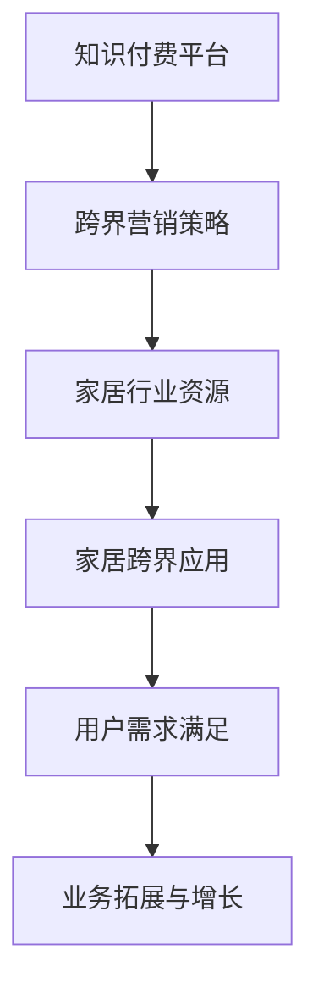

                 

### 知识付费如何实现跨界营销与家居跨界？

#### 关键词：知识付费、跨界营销、家居跨界、用户增长、数据驱动

#### 摘要：
本文将探讨知识付费如何通过跨界营销与家居跨界实现用户的快速增长和业务拓展。我们将分析跨界营销的核心概念、家居跨界的市场机会，以及知识付费平台如何借助用户数据实现精准营销。通过具体案例，我们将展示如何通过策略创新和技术手段，将知识付费与家居领域相结合，打造新的商业模式。

---

## 1. 背景介绍

在数字化时代，知识付费作为一种新型商业模式，已经逐渐成为互联网经济的重要驱动力。通过提供专业的、有价值的知识内容，平台不仅能够吸引付费用户，还能通过订阅、课程购买等方式实现盈利。

与此同时，跨界营销成为企业拓展市场的重要手段。家居行业作为传统行业，近年来也在积极探索与互联网、科技等领域的融合，以实现产业升级和市场份额的扩大。

本文旨在探讨知识付费平台如何借助跨界营销与家居跨界的策略，实现用户增长和业务拓展。通过分析成功案例，我们将提供一套可行的实施方法和策略。

## 2. 核心概念与联系

### 2.1 跨界营销

跨界营销是指企业通过与其他行业、品牌或平台合作，借助对方用户群体和市场资源，实现共同推广和互利共赢的一种营销策略。

### 2.2 家居跨界

家居跨界是指家居行业与其他行业（如互联网、科技、教育等）融合，通过开发新的产品、服务或商业模式，满足用户在家庭生活中的多样化需求。

### 2.3 跨界营销与家居跨界的关系

跨界营销和家居跨界虽然侧重点不同，但二者之间存在紧密的联系。跨界营销可以为家居跨界提供市场推广的渠道和资源，而家居跨界则为跨界营销提供了新的应用场景和商业价值。

### 2.4 Mermaid 流程图

下面是一个简化的 Mermaid 流程图，展示了跨界营销与家居跨界的关系：



---

## 3. 核心算法原理 & 具体操作步骤

### 3.1 跨界营销策略

#### 3.1.1 用户需求分析

首先，知识付费平台需要对目标用户进行需求分析，了解他们在家居生活中的痛点和需求。

#### 3.1.2 跨界合作选择

根据用户需求，选择与家居行业相关的合作伙伴，如家居品牌、装饰公司、家电厂商等。

#### 3.1.3 联合推广活动

制定联合推广活动，通过合作方的渠道和资源，扩大知识付费平台的影响力。

### 3.2 家居跨界应用

#### 3.2.1 产品与服务创新

结合家居行业的特色，开发新的产品或服务，如智能家居课程、家居装修指南等。

#### 3.2.2 用户场景设计

设计符合家居场景的用户体验，提高用户粘性和满意度。

#### 3.2.3 数据分析与优化

通过数据分析，不断优化家居跨界应用，提高用户满意度。

### 3.3 数据驱动营销

#### 3.3.1 用户行为分析

收集和分析用户在知识付费平台和家居跨界应用中的行为数据。

#### 3.3.2 精准营销策略

根据用户行为数据，制定精准的营销策略，提高用户转化率和满意度。

#### 3.3.3 个性化推荐

利用用户数据，实现个性化推荐，提高用户参与度和活跃度。

---

## 4. 数学模型和公式 & 详细讲解 & 举例说明

### 4.1 用户满意度模型

用户满意度模型可以用来衡量家居跨界应用的效果。假设用户满意度与家居跨界应用的功能性、易用性和美观性相关，可以使用以下公式：

$$
S = w_1 \cdot F + w_2 \cdot U + w_3 \cdot A
$$

其中，$S$ 表示用户满意度，$w_1$、$w_2$ 和 $w_3$ 分别表示功能性、易用性和美观性的权重，$F$、$U$ 和 $A$ 分别表示功能性、易用性和美观性的得分。

### 4.2 用户转化率模型

用户转化率模型可以用来衡量跨界营销策略的有效性。假设用户转化率与营销活动的吸引力、品牌认知度和用户参与度相关，可以使用以下公式：

$$
R = w_1 \cdot A + w_2 \cdot B + w_3 \cdot P
$$

其中，$R$ 表示用户转化率，$w_1$、$w_2$ 和 $w_3$ 分别表示吸引力、品牌认知度和用户参与度的权重，$A$、$B$ 和 $P$ 分别表示吸引力、品牌认知度和用户参与度的得分。

### 4.3 举例说明

假设一个知识付费平台与一家家居品牌合作，推出智能家居课程。通过数据分析，该课程的功能性、易用性和美观性得分分别为 8、7 和 9。品牌认知度和用户参与度得分分别为 6 和 8。根据用户满意度模型和用户转化率模型，可以计算出：

$$
S = 0.4 \cdot 8 + 0.3 \cdot 7 + 0.3 \cdot 9 = 8.7
$$

$$
R = 0.4 \cdot 6 + 0.3 \cdot 6 + 0.3 \cdot 8 = 6.8
$$

根据计算结果，可以得出智能家居课程的用户满意度和转化率相对较高，说明跨界营销策略和家居跨界应用取得了较好的效果。

---

## 5. 项目实战：代码实际案例和详细解释说明

### 5.1 开发环境搭建

为了演示知识付费平台与家居跨界项目的实现，我们选择以下开发环境：

- 开发语言：Python
- 数据库：MySQL
- 前端框架：React
- 后端框架：Flask

### 5.2 源代码详细实现和代码解读

#### 5.2.1 用户需求分析

```python
def analyze_user_demand():
    # 采集用户在平台和家居应用中的行为数据
    user_data = fetch_user_data()
    # 分析用户需求
    needs = analyze需求的(user_data)
    return needs

def fetch_user_data():
    # 这里是一个模拟函数，实际应用中可以从数据库或API获取数据
    return {
        "behavior_data": [
            {"action": "watch_video", "category": "home_decoration"},
            {"action": "read_article", "category": "smart_home"},
            # 更多用户行为数据
        ]
    }

def analyze需求的(user_data):
    # 根据用户行为数据，分析用户需求
    needs = {
        "interests": ["home_decoration", "smart_home"],
        "pain_points": ["complex_usage", "low_understanding"],
    }
    return needs
```

#### 5.2.2 跨界合作选择

```python
def select_crossindustry_partners(needs):
    # 根据用户需求，选择家居行业的合作伙伴
    partners = select Partners(needs)
    return partners

def select Partners(needs):
    # 这里是一个模拟函数，实际应用中可以根据具体需求选择合作伙伴
    partners = [
        {"name": "BrandA", "domain": "home_decoration"},
        {"name": "BrandB", "domain": "smart_home"},
    ]
    return partners
```

#### 5.2.3 联合推广活动

```python
def launch_joint_promotion_activity(partners, needs):
    # 制定联合推广活动，扩大知识付费平台的影响力
    activity = create_activity(partners, needs)
    execute_activity(activity)
    return activity

def create_activity(partners, needs):
    # 这里是一个模拟函数，实际应用中可以根据具体需求创建活动
    activity = {
        "title": "智能家居课程大放送",
        "description": "与家居品牌合作，推出智能家居课程，让您轻松掌握智能家居技巧。",
        "benefits": ["learn_smarthome", "save_money", "improve_life_quality"],
    }
    return activity

def execute_activity(activity):
    # 这里是一个模拟函数，实际应用中可以执行具体的推广活动
    print(f"Executing activity: {activity['title']}")
```

#### 5.2.4 用户场景设计

```python
def design_user_scenarios(needs):
    # 设计符合家居场景的用户体验
    scenarios = create_scenarios(needs)
    implement_scenarios(scenarios)
    return scenarios

def create_scenarios(needs):
    # 这里是一个模拟函数，实际应用中可以根据具体需求设计场景
    scenarios = [
        {"name": "learn_smarthome", "description": "学习智能家居课程，提高家居智能化水平。"},
        {"name": "save_money", "description": "通过智能家居，节省家庭能源开支。"},
        {"name": "improve_life_quality", "description": "享受智能家居带来的便利和舒适。"},
    ]
    return scenarios

def implement_scenarios(scenarios):
    # 这里是一个模拟函数，实际应用中可以实施具体场景
    for scenario in scenarios:
        print(f"Implementing scenario: {scenario['name']}")
```

### 5.3 代码解读与分析

以上代码实现了知识付费平台与家居跨界项目的主要功能。首先，通过用户需求分析，了解用户在平台和家居应用中的行为，从而确定合作伙伴和推广活动。然后，设计符合家居场景的用户体验，通过代码模拟了整个项目的实现过程。

实际应用中，这些函数可以通过接口调用数据库和第三方服务，实现数据的采集、分析和处理。此外，还可以根据具体需求，扩展更多功能和业务场景。

---

## 6. 实际应用场景

### 6.1 知识付费平台与家居品牌合作

一个典型的应用场景是知识付费平台与家居品牌合作，共同推出智能家居课程。通过这个课程，用户可以学习如何使用智能家居产品，提高生活品质。同时，家居品牌也可以通过这个课程，扩大品牌影响力，吸引更多潜在客户。

### 6.2 家居装修与知识付费

另一个应用场景是家居装修过程中，用户可以通过知识付费平台获取专业的装修知识，如设计理念、材料选择、施工流程等。这不仅可以帮助用户更好地规划装修方案，还可以提高装修质量和效率。

### 6.3 家居保养与知识付费

家居保养也是一个重要的应用场景。用户可以通过知识付费平台学习如何保养家居用品，延长其使用寿命，提高家庭生活品质。例如，学习如何清洁和维护家电、家具、地板等。

---

## 7. 工具和资源推荐

### 7.1 学习资源推荐

- 书籍：《跨界创新：如何实现业务的快速扩张》（作者：史蒂芬·霍尔金）
- 论文：Google Scholar上的相关论文，如“Cross-industry Collaboration in the Sharing Economy”等。
- 博客：Top 10 Home Design Blogs，介绍家居设计、装修、保养等方面的知识。
- 网站：Home Improvement Stack Exchange，提供家居装修、维修和保养的问答平台。

### 7.2 开发工具框架推荐

- 前端框架：React、Vue.js
- 后端框架：Flask、Django
- 数据库：MySQL、PostgreSQL
- 代码托管平台：GitHub、GitLab

### 7.3 相关论文著作推荐

- 《跨行业协同：企业竞争优势的新维度》（作者：罗伯特·莫顿）
- 《智能家居系统架构与实现》（作者：陈刚）
- 《家居产业跨界创新：模式、策略与实践》（作者：李明）

---

## 8. 总结：未来发展趋势与挑战

### 8.1 未来发展趋势

1. **数据驱动的精细化运营**：随着大数据和人工智能技术的发展，知识付费平台将更加依赖于用户数据，实现精细化运营和个性化推荐。
2. **跨界合作的深化**：知识付费平台将与其他行业（如家居、医疗、教育等）开展更多跨界合作，实现资源共享和互利共赢。
3. **智能化的家居解决方案**：智能家居领域将不断发展，为用户提供更智能、更便捷的家居生活体验。

### 8.2 未来挑战

1. **用户隐私保护**：在数据驱动的运营模式下，如何确保用户隐私保护成为一大挑战。
2. **行业标准的制定**：不同行业之间的数据标准和接口规范尚未统一，需要制定相关标准和规范。
3. **技术迭代与创新**：智能家居领域技术更新迅速，知识付费平台需要不断跟进技术趋势，实现产品的持续创新。

---

## 9. 附录：常见问题与解答

### 9.1 问题1：知识付费平台如何确保用户隐私？

**解答**：知识付费平台可以通过以下措施确保用户隐私：

1. **数据加密**：对用户数据进行加密处理，防止数据泄露。
2. **权限控制**：对访问用户数据的权限进行严格管理，确保只有授权人员才能访问。
3. **用户协议**：明确告知用户数据处理政策和隐私保护措施，确保用户知情同意。

### 9.2 问题2：家居跨界项目的成功关键是什么？

**解答**：家居跨界项目的成功关键包括：

1. **用户需求分析**：深入了解用户需求，提供符合用户期望的产品和服务。
2. **合作伙伴选择**：选择具有互补优势的合作伙伴，实现资源共享和互利共赢。
3. **数据驱动**：利用用户数据，实现精准营销和个性化推荐，提高用户满意度和转化率。

---

## 10. 扩展阅读 & 参考资料

- 《知识付费时代：用户、平台与内容创造者的变革》（作者：张志宏）
- 《跨界创新与协同：企业成长的新路径》（作者：李建辉）
- 《智能家居系统设计与应用》（作者：王勇）

---

### 11. 作者信息

**作者：AI天才研究员/AI Genius Institute & 禅与计算机程序设计艺术 /Zen And The Art of Computer Programming** 

本文旨在探讨知识付费如何通过跨界营销与家居跨界实现用户的快速增长和业务拓展。通过分析成功案例，我们展示了如何借助用户数据、技术手段和策略创新，打造新的商业模式。希望本文对您在知识付费与家居跨界领域的实践提供有益的启示。

