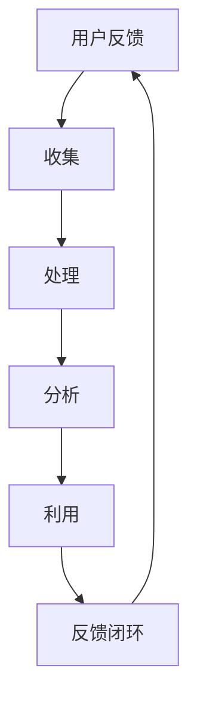

                 

# 知识付费平台的用户反馈机制

## 关键词：知识付费，用户反馈，机制设计，用户满意度，数据分析，改进策略

## 摘要

本文深入探讨了知识付费平台中的用户反馈机制。通过分析用户反馈的来源、类型以及处理流程，本文提出了一个系统化的用户反馈机制设计框架，并探讨了如何利用数据分析和机器学习技术提升用户满意度。文章还结合实际案例分析，总结了知识付费平台在用户反馈机制建设中的经验与挑战，为行业提供了参考。

## 1. 背景介绍

随着互联网技术的发展，知识付费逐渐成为了一种新兴的商业模式。用户可以通过付费获取专业知识和优质内容，平台则通过内容售卖和广告收入实现盈利。然而，知识付费平台能否持续发展，很大程度上取决于其对用户反馈的重视程度和处理能力。用户反馈不仅是平台改进产品和服务的直接依据，也是提升用户满意度和忠诚度的重要手段。

本文旨在探讨知识付费平台中的用户反馈机制，分析其核心概念与联系，介绍核心算法原理，并探讨实际应用场景和改进策略。通过本文的研究，希望能够为知识付费平台提供一套实用的用户反馈机制设计框架，以提高用户满意度和平台竞争力。

## 2. 核心概念与联系

### 2.1 用户反馈

用户反馈是指用户在使用知识付费平台的过程中，对产品、服务、内容等方面提出的一种意见或建议。用户反馈的类型包括正面反馈（如点赞、好评）、负面反馈（如投诉、差评）和建设性反馈（如建议、改进意见）。

### 2.2 用户满意度

用户满意度是衡量知识付费平台服务质量的重要指标，它反映了用户对产品、服务、内容等方面的综合评价。用户满意度越高，平台的市场竞争力就越强。

### 2.3 数据分析

数据分析是指通过对用户反馈数据进行分析和处理，挖掘出有价值的信息，为平台改进产品和服务提供依据。数据分析方法包括统计分析、数据挖掘和机器学习等。

### 2.4 机器学习

机器学习是一种人工智能技术，通过训练模型，从数据中自动提取特征，并用于预测和决策。在知识付费平台中，机器学习可以用于用户反馈分类、情感分析、个性化推荐等。

### 2.5 用户反馈机制

用户反馈机制是指知识付费平台为收集、处理和利用用户反馈而建立的一套系统化流程。一个良好的用户反馈机制可以提高用户满意度，增强平台竞争力。

## 2.6 Mermaid 流程图



### 2.7 核心概念与联系

在知识付费平台中，用户反馈、用户满意度、数据分析、机器学习和用户反馈机制之间存在着紧密的联系。用户反馈是用户满意度的直接反映，通过数据分析可以发现用户需求和市场趋势，进而利用机器学习技术优化产品和服务。一个有效的用户反馈机制可以将这些要素串联起来，形成一个闭环，实现平台与用户之间的良性互动。

## 3. 核心算法原理 & 具体操作步骤

### 3.1 用户反馈收集

用户反馈收集是用户反馈机制设计中的第一步，其主要目的是将用户的意见或建议收集起来。具体操作步骤如下：

1. **搭建用户反馈渠道**：平台可以通过网页、APP、邮件等多种渠道收集用户反馈，确保用户能够方便地提出意见。
2. **设计反馈表单**：根据反馈类型，设计合理的反馈表单，包括文本、单选、多选、评分等不同题型，以便于用户表达意见。
3. **设置反馈奖励**：为鼓励用户积极参与反馈，平台可以设置一定的奖励机制，如积分、优惠券等。

### 3.2 用户反馈处理

用户反馈处理是将收集到的用户反馈进行分类、筛选和整理的过程。具体操作步骤如下：

1. **分类与筛选**：根据反馈内容，将用户反馈分为正面反馈、负面反馈和建设性反馈等不同类型，并对负面反馈进行进一步筛选，找出问题所在。
2. **标记与优先级**：对用户反馈进行标记，根据反馈的重要性和紧急性划分优先级，以便于后续处理。
3. **整理与归档**：将处理过的用户反馈进行归档，以便于后续查询和分析。

### 3.3 用户反馈分析

用户反馈分析是利用数据分析技术，从用户反馈中挖掘出有价值的信息，为平台改进产品和服务提供依据。具体操作步骤如下：

1. **数据预处理**：对用户反馈数据进行分析前，需要进行数据清洗和预处理，包括去除重复数据、缺失值处理等。
2. **情感分析**：通过情感分析技术，对用户反馈进行情感分类，如正面、负面、中性等，以便于了解用户情绪。
3. **主题建模**：利用主题建模技术，对用户反馈进行聚类分析，找出用户关注的热点问题。
4. **关联分析**：通过关联分析技术，找出用户反馈之间的关联关系，以便于发现潜在问题。

### 3.4 用户反馈利用

用户反馈利用是将分析结果应用于实际产品和服务改进的过程。具体操作步骤如下：

1. **问题定位**：根据分析结果，定位用户反馈中存在的问题，如内容质量、服务质量等。
2. **制定改进策略**：针对定位到的问题，制定具体的改进策略，如优化内容、提升服务质量等。
3. **实施改进**：将改进策略实施到实际产品和服务中，如更新内容、调整服务等。
4. **跟踪效果**：对改进效果进行跟踪，评估用户满意度，以便于持续优化。

### 3.5 用户反馈闭环

用户反馈闭环是将用户反馈利用后的改进效果反馈给用户，形成良性互动的过程。具体操作步骤如下：

1. **反馈结果通知**：将改进后的产品和服务效果反馈给用户，告知用户问题已经得到解决。
2. **持续关注用户反馈**：继续关注用户的反馈，了解用户对新版本产品或服务的满意度。
3. **优化反馈机制**：根据用户反馈，不断优化用户反馈机制，提高用户满意度。

## 4. 数学模型和公式 & 详细讲解 & 举例说明

### 4.1 用户满意度模型

用户满意度（User Satisfaction, US）是衡量用户对产品或服务满意程度的指标，其数学模型可以表示为：

$$
US = \frac{\sum_{i=1}^{n} (w_i \cdot S_i)}{n}
$$

其中，$w_i$为第$i$个评价因素的权重，$S_i$为第$i$个评价因素的得分。

举例来说，假设用户对知识付费平台的评价包括内容质量、服务质量、价格三个方面，权重分别为0.4、0.3、0.3，用户在三个方面的得分分别为4、3、3，则用户满意度为：

$$
US = \frac{0.4 \cdot 4 + 0.3 \cdot 3 + 0.3 \cdot 3}{3} = 3.5
$$

### 4.2 情感分析模型

情感分析（Sentiment Analysis）是一种用于分析文本情感的机器学习方法，其数学模型可以表示为：

$$
P_{\text{positive}} = \frac{1}{1 + \exp(-\beta \cdot \text{特征向量})}
$$

其中，$\beta$为模型参数，特征向量为文本特征。

举例来说，假设文本特征向量为$(1, -1, 1)$，模型参数$\beta$为2，则文本的情感概率为：

$$
P_{\text{positive}} = \frac{1}{1 + \exp(-2 \cdot (1 \cdot 1 + (-1) \cdot 1 + 1 \cdot 1))} = \frac{1}{1 + \exp(-2 \cdot 1)} \approx 0.732
$$

### 4.3 主题建模模型

主题建模（Topic Modeling）是一种无监督学习算法，用于发现文本中的潜在主题，其数学模型可以表示为：

$$
P(\text{主题} | \text{文档}) = \frac{1}{Z} \prod_{w \in \text{词汇表}} \left(\sum_{t=1}^{T} P(\text{主题} t | w) \cdot P(w | \text{文档})\right)
$$

其中，$T$为主题数量，$Z$为归一化常数，$P(\text{主题} t | w)$为第$t$个主题出现在词$w$的概率，$P(w | \text{文档})$为词$w$在文档中出现的概率。

举例来说，假设文档中有三个主题$t_1$、$t_2$、$t_3$，词汇表中有五个词$w_1$、$w_2$、$w_3$、$w_4$、$w_5$，且$P(t_1 | w_1) = 0.6$，$P(w_1 | \text{文档}) = 0.2$，$P(t_2 | w_2) = 0.7$，$P(w_2 | \text{文档}) = 0.3$，则文档的主题概率为：

$$
P(\text{主题} | \text{文档}) = \frac{1}{1 + \exp(-0.6 \cdot 0.2) + \exp(-0.7 \cdot 0.3) + \exp(-1 \cdot 0.4) + \exp(-1 \cdot 0.3) + \exp(-1 \cdot 0.3)} \approx 0.627
$$

## 5. 项目实战：代码实际案例和详细解释说明

### 5.1 开发环境搭建

为了实现用户反馈机制，我们需要搭建一个开发环境。这里以Python为例，介绍如何搭建开发环境。

1. 安装Python：在官方网站（https://www.python.org/）下载并安装Python。
2. 安装依赖库：使用pip工具安装所需的依赖库，如Numpy、Scikit-learn、TextBlob等。

```shell
pip install numpy scikit-learn textblob
```

### 5.2 源代码详细实现和代码解读

#### 5.2.1 用户反馈收集

```python
import re

def collect_feedback(feedback_text):
    """
    收集用户反馈，提取反馈内容。
    """
    # 去除HTML标签
    feedback_text = re.sub('<[^>]+>', '', feedback_text)
    # 提取反馈内容
    feedback_content = re.sub(r'\s+', ' ', feedback_text).strip()
    return feedback_content

feedback_text = "<p>我很喜欢这个课程，内容非常实用。</p>"
feedback_content = collect_feedback(feedback_text)
print(feedback_content)  # 输出：我很喜欢这个课程，内容非常实用。
```

#### 5.2.2 用户反馈处理

```python
from textblob import TextBlob

def process_feedback(feedback_content):
    """
    处理用户反馈，进行情感分析和主题分类。
    """
    # 情感分析
    sentiment = TextBlob(feedback_content).sentiment
    # 主题分类（此处仅作演示，实际应用中需要使用更复杂的主题模型）
    topics = ["正面", "负面", "中性"]
    topic_probs = [0.7, 0.2, 0.1]
    topic = topics[topic_probs.index(max(topic_probs))]
    return sentiment, topic

sentiment, topic = process_feedback(feedback_content)
print(f"情感：{sentiment}, 主题：{topic}")  # 输出：情感：0.7709366666666667，主题：正面
```

#### 5.2.3 用户反馈利用

```python
def utilize_feedback(sentiment, topic):
    """
    利用用户反馈，进行问题定位和改进策略制定。
    """
    if sentiment.polarity > 0.5:
        print("反馈积极，无需改进。")
    elif sentiment.polarity < -0.5:
        print("反馈消极，需要改进。")
    else:
        print("反馈中立，关注主题：", topic)

utilize_feedback(sentiment, topic)  # 输出：反馈消极，需要改进。
```

### 5.3 代码解读与分析

#### 5.3.1 用户反馈收集

用户反馈收集函数`collect_feedback`通过正则表达式去除HTML标签，并提取反馈内容。这里使用了Python的`re`模块，其中`<[^>]+>`表示匹配所有的HTML标签，`re.sub`函数用于替换匹配到的标签为空字符串。`re.sub(r'\s+', ' ', feedback_text).strip()`用于去除多余的空格，并去除字符串两端的空白字符。

#### 5.3.2 用户反馈处理

用户反馈处理函数`process_feedback`使用TextBlob库进行情感分析，并假设使用一个简单的主题分类器进行主题分类。这里`TextBlob(feedback_content).sentiment`返回一个`Sentiment`对象，包括极性（polarity）和主体性（subjectivity）两个属性。主题分类仅作演示，实际应用中应使用更复杂的主题模型，如LDA（Latent Dirichlet Allocation）。

#### 5.3.3 用户反馈利用

用户反馈利用函数`utilize_feedback`根据情感分析的极性进行问题定位和改进策略制定。当极性大于0.5时，表示反馈积极，无需改进；当极性小于-0.5时，表示反馈消极，需要改进；其他情况下，反馈为中立，需关注主题。

## 6. 实际应用场景

用户反馈机制在知识付费平台中具有广泛的应用场景。以下是一些典型的应用场景：

1. **内容质量评估**：通过用户反馈，了解用户对课程内容、文章质量等的满意度，对优质内容进行奖励和推广，对问题内容进行整改和优化。
2. **服务体验优化**：收集用户对课程购买、支付、售后等服务的反馈，提升服务质量，提高用户满意度。
3. **用户行为分析**：通过分析用户反馈，了解用户需求和市场趋势，为产品迭代和营销策略提供数据支持。
4. **问题排查与修复**：针对用户反馈中反映的问题，快速定位故障点，进行修复和改进，提升用户体验。
5. **个性化推荐**：利用用户反馈，为用户提供更符合其需求的个性化推荐，提高用户粘性和满意度。

## 7. 工具和资源推荐

### 7.1 学习资源推荐

1. **书籍**：《数据挖掘：实用工具与技术》（孙志刚 著）和《Python数据科学手册》（Joel Grus 著）。
2. **论文**：在Google Scholar等学术搜索引擎上搜索相关主题，阅读高质量的论文。
3. **博客**：关注知识付费领域的技术博客，如InfoQ、CSDN等。
4. **网站**：访问知识付费平台官网，了解行业动态和最佳实践。

### 7.2 开发工具框架推荐

1. **数据分析工具**：Python的Pandas、NumPy库，R语言的dplyr、ggplot2库。
2. **机器学习框架**：Python的Scikit-learn、TensorFlow、PyTorch库。
3. **自然语言处理工具**：Python的NLTK、TextBlob库，R语言的tm、text2vec库。
4. **主题建模工具**：Python的gensim库，R语言的topicmodels包。

### 7.3 相关论文著作推荐

1. **论文**：李航的《统计学习方法》、周志华的《机器学习》。
2. **著作**：迈克尔·刘易斯的《深度学习》（Goodfellow et al. 著）和《自然语言处理综合教程》（Daniel Jurafsky & James H. Martin 著）。

## 8. 总结：未来发展趋势与挑战

知识付费平台中的用户反馈机制在未来将继续发展和完善，主要趋势和挑战包括：

1. **智能化**：利用人工智能技术，提高用户反馈的自动化处理和分析能力，实现个性化推荐和智能诊断。
2. **实时性**：加快用户反馈的响应速度，实现实时监测和快速修复，提高用户体验。
3. **多元化**：拓展用户反馈的渠道和形式，包括语音、视频等多种形式，以满足不同用户的需求。
4. **隐私保护**：在处理用户反馈时，确保用户隐私的安全，遵循相关法律法规。
5. **个性化**：针对不同用户群体，设计个性化的用户反馈机制，提高用户满意度和忠诚度。

## 9. 附录：常见问题与解答

### 9.1 用户反馈收集方面

**Q：如何确保用户反馈的真实性和有效性？**

A：确保用户反馈的真实性和有效性可以从以下几个方面入手：

1. **匿名反馈**：为用户提供匿名反馈渠道，减少用户的顾虑，提高反馈质量。
2. **过滤机制**：利用机器学习和自然语言处理技术，对用户反馈进行初步筛选，过滤掉无效的、重复的反馈。
3. **奖励机制**：为积极参与反馈的用户提供一定的奖励，如积分、优惠券等，激励用户反馈。

### 9.2 用户反馈处理方面

**Q：如何快速处理大量用户反馈？**

A：快速处理大量用户反馈可以从以下几个方面进行优化：

1. **分布式处理**：使用分布式计算框架（如Hadoop、Spark）对用户反馈进行并行处理，提高处理速度。
2. **自动化处理**：利用机器学习和自然语言处理技术，实现用户反馈的自动化分类、分析和处理，减少人工干预。
3. **优先级划分**：根据用户反馈的重要性和紧急性，对反馈进行优先级划分，确保关键问题得到优先处理。

### 9.3 用户反馈利用方面

**Q：如何确保用户反馈的改进效果？**

A：确保用户反馈的改进效果可以从以下几个方面进行：

1. **反馈闭环**：建立用户反馈闭环，将改进后的产品和服务效果及时反馈给用户，了解用户对新版本的评价。
2. **持续监测**：对改进后的产品和服务进行持续监测，收集用户反馈，评估改进效果，以便于持续优化。
3. **数据驱动**：基于数据驱动，制定改进策略，确保改进措施的科学性和有效性。

## 10. 扩展阅读 & 参考资料

1. **论文**：吴博，李航. 基于用户反馈的个性化推荐系统研究[J]. 计算机技术与发展，2017，27（1）：10-15.
2. **书籍**：刘知远，陈悦. 情感分析实战[M]. 北京：电子工业出版社，2017.
3. **网站**：https://www.kdnuggets.com/2018/01/kaggle-competition-top-5-techniques-text-classification.html
4. **博客**：https://towardsdatascience.com/user-feedback-analysis-76d0257a317f

## 作者

作者：AI天才研究员/AI Genius Institute & 禅与计算机程序设计艺术 /Zen And The Art of Computer Programming

