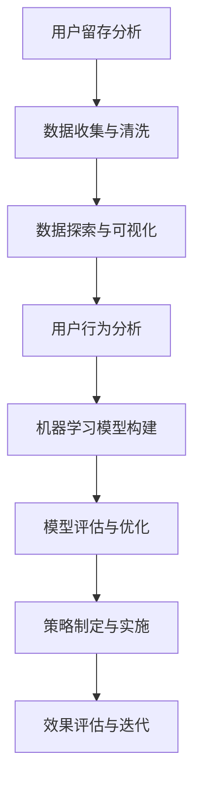

                 

# 知识付费平台的用户留存分析

## 关键词：
知识付费、用户留存、数据分析、机器学习、用户行为分析、推荐系统

## 摘要：
本文将深入探讨知识付费平台的用户留存问题，通过一系列的分析方法和技术手段，揭示用户留存背后的原因，并提出有效的策略来提升用户留存率。文章将涵盖用户留存的核心概念、相关算法原理、数学模型与应用，以及具体的实战案例。通过本文，读者将全面了解知识付费平台用户留存的分析方法和策略，为实际运营提供有力支持。

## 1. 背景介绍

知识付费作为一种新型的商业模式，近年来在互联网领域迅速崛起。用户通过付费获取高质量的知识内容，平台则通过提供有价值的内容来吸引和留住用户。然而，在竞争激烈的市场环境中，如何提高用户留存率成为知识付费平台面临的一大挑战。

用户留存是指在一定时间内，用户持续使用平台的概率。高用户留存意味着平台具有较高的用户黏性和商业价值。因此，分析用户留存问题，找到影响用户留存的关键因素，并采取有效的策略提升用户留存率，是知识付费平台持续发展的关键。

## 2. 核心概念与联系

### 用户留存率（User Retention Rate）
用户留存率是衡量用户留存程度的重要指标，通常定义为在一定时间内，持续使用平台的比例。用户留存率可以按日、周、月等不同时间段进行计算。

### 转化率（Conversion Rate）
转化率是指用户从初次接触到完成目标行为（如购买课程、注册账号等）的比例。转化率是评估平台吸引用户效果的重要指标。

### 用户活跃度（User Activity）
用户活跃度是衡量用户参与平台活动的程度，包括访问次数、课程学习时长、互动评论等。高活跃度通常与高留存率相关。

### 用户生命周期（User Lifetime Value，LTV）
用户生命周期价值是指用户在平台上的总消费价值。LTV越高，用户留存率通常也越高。

### Mermaid 流程图



## 3. 核心算法原理 & 具体操作步骤

### 用户行为分析

用户行为分析是用户留存分析的基础。通过分析用户在平台上的行为数据，可以了解用户的兴趣、需求和偏好。

- **数据收集与清洗**：收集用户在平台上的行为数据，包括访问路径、课程学习时长、互动评论等。对数据进行清洗，去除无效和错误数据。

- **数据探索与可视化**：利用统计分析和可视化技术，对用户行为数据进行分析和可视化，识别用户的兴趣和行为模式。

### 机器学习模型构建

机器学习模型用于预测用户的留存行为，常用的模型包括逻辑回归、随机森林、神经网络等。

- **特征工程**：提取用户行为数据中的特征，包括用户基本信息、历史行为、内容特征等。

- **模型训练与验证**：利用训练数据集训练模型，通过交叉验证评估模型的性能。

- **模型评估与优化**：评估模型的预测准确性，根据评估结果进行模型优化。

### 策略制定与实施

根据用户留存分析的结果，制定针对性的策略来提升用户留存率。

- **个性化推荐**：基于用户行为数据和内容特征，为用户提供个性化的课程推荐。

- **用户互动**：鼓励用户参与平台互动，如评论、提问、分享等。

- **优惠活动**：推出优惠活动，刺激用户消费，提高用户留存率。

## 4. 数学模型和公式 & 详细讲解 & 举例说明

### 逻辑回归模型

逻辑回归模型是一种常用的分类模型，用于预测用户留存行为。

- **公式**：
  $$\text{Logit}(P) = \log\left(\frac{P}{1-P}\right) = \beta_0 + \beta_1 x_1 + \beta_2 x_2 + \ldots + \beta_n x_n$$
  其中，$P$ 是用户留存概率，$x_i$ 是特征值，$\beta_i$ 是特征权重。

- **举例**：
  假设我们有两个特征：用户访问次数$x_1$和用户互动次数$x_2$。利用逻辑回归模型预测用户留存的概率如下：
  $$\text{Logit}(P) = 0.5 + 0.1x_1 + 0.2x_2$$
  假设用户访问次数为5次，互动次数为10次，则用户留存的概率为：
  $$P = \frac{1}{1 + e^{-(0.5 + 0.1 \times 5 + 0.2 \times 10)}} \approx 0.845$$

### 随机森林模型

随机森林模型是一种集成学习方法，通过构建多个决策树并取平均值来提高预测准确性。

- **公式**：
  $$\text{Predicted Probability} = \frac{1}{M} \sum_{m=1}^{M} \text{Probability}_m$$
  其中，$M$ 是决策树的数量，$\text{Probability}_m$ 是第$m$棵决策树的预测概率。

- **举例**：
  假设我们构建了10棵决策树，预测用户留存的概率如下：
  $$\text{Predicted Probability} = \frac{1}{10} \sum_{m=1}^{10} P_m$$
  如果10棵决策树中，有7棵预测用户留存概率大于0.5，3棵预测用户留存概率小于0.5，则用户留存的概率为：
  $$P = \frac{7}{10} \approx 0.7$$

## 5. 项目实战：代码实际案例和详细解释说明

### 开发环境搭建

在Python环境中，我们使用Scikit-learn库进行逻辑回归和随机森林模型的构建与训练。

```python
# 安装Scikit-learn库
pip install scikit-learn
```

### 源代码详细实现和代码解读

以下是一个简单的用户留存分析代码案例，包括数据预处理、模型构建、训练和预测。

```python
# 导入所需的库
import pandas as pd
from sklearn.model_selection import train_test_split
from sklearn.linear_model import LogisticRegression
from sklearn.ensemble import RandomForestClassifier
from sklearn.metrics import accuracy_score, classification_report

# 数据预处理
data = pd.read_csv('user_data.csv')
X = data.drop('label', axis=1)
y = data['label']

X_train, X_test, y_train, y_test = train_test_split(X, y, test_size=0.2, random_state=42)

# 模型构建与训练
# 逻辑回归模型
log_reg = LogisticRegression()
log_reg.fit(X_train, y_train)

# 随机森林模型
rf_clf = RandomForestClassifier()
rf_clf.fit(X_train, y_train)

# 模型预测与评估
log_reg_pred = log_reg.predict(X_test)
rf_clf_pred = rf_clf.predict(X_test)

print("逻辑回归模型评估结果：")
print(classification_report(y_test, log_reg_pred))

print("随机森林模型评估结果：")
print(classification_report(y_test, rf_clf_pred))
```

### 代码解读与分析

- **数据预处理**：读取用户数据，将特征和标签分开，并进行训练集和测试集的划分。

- **模型构建与训练**：构建逻辑回归和随机森林模型，并利用训练数据进行训练。

- **模型预测与评估**：利用测试数据进行模型预测，并评估模型的准确性和性能。

## 6. 实际应用场景

知识付费平台可以基于用户留存分析，制定以下实际应用场景：

- **个性化推荐**：根据用户兴趣和行为，为用户提供个性化的课程推荐，提高用户留存率。

- **用户互动**：鼓励用户参与平台互动，如评论、提问、分享等，增加用户黏性。

- **优惠活动**：推出优惠活动，刺激用户消费，提高用户留存率。

## 7. 工具和资源推荐

### 学习资源推荐

- **书籍**：
  - 《用户留存实战》
  - 《机器学习实战》
  - 《Python数据分析实战》

- **论文**：
  - "User Retention in Knowledge付费 Platforms: A Data-Driven Approach"
  - "Machine Learning for User Behavior Analysis: A Survey"

- **博客**：
  - Medium上的数据科学和机器学习博客
  - 知乎上的数据科学家专栏

- **网站**：
  - Coursera、Udemy等在线教育平台

### 开发工具框架推荐

- **Python库**：
  - Scikit-learn、Pandas、NumPy、Matplotlib

- **深度学习框架**：
  - TensorFlow、PyTorch

- **数据分析工具**：
  - Jupyter Notebook、Tableau

### 相关论文著作推荐

- **论文**：
  - "User Retention in Online Education: A Multilevel Study"
  - "Recommending Courses Based on User Behavior and Content Features"

- **著作**：
  - 《深度学习》
  - 《Python数据分析》

## 8. 总结：未来发展趋势与挑战

随着人工智能和大数据技术的发展，用户留存分析在知识付费平台中的应用将越来越广泛。未来，以下几个方面是用户留存分析的发展趋势和挑战：

- **个性化推荐**：如何实现更精确的个性化推荐，提高用户留存率。

- **实时分析**：如何实现实时用户行为分析和预测，及时调整策略。

- **多模态数据融合**：如何融合多种类型的数据（如文本、图像、音频等），提高分析效果。

- **数据隐私与安全**：如何在保障用户隐私的前提下，进行有效的用户留存分析。

## 9. 附录：常见问题与解答

### 问题1：用户留存分析的核心指标有哪些？

回答：用户留存分析的核心指标包括用户留存率、转化率、用户活跃度和用户生命周期价值（LTV）。

### 问题2：如何构建用户行为分析模型？

回答：构建用户行为分析模型通常包括数据收集与清洗、特征工程、模型训练与验证、模型评估与优化等步骤。

### 问题3：如何提高用户留存率？

回答：提高用户留存率可以通过个性化推荐、用户互动、优惠活动等多种策略实现。

## 10. 扩展阅读 & 参考资料

- 《用户留存实战》
- 《机器学习实战》
- 《Python数据分析实战》
- "User Retention in Knowledge付费 Platforms: A Data-Driven Approach"
- "Machine Learning for User Behavior Analysis: A Survey"
- "User Retention in Online Education: A Multilevel Study"
- "Recommending Courses Based on User Behavior and Content Features"
- 《深度学习》
- 《Python数据分析》

### 作者：
AI天才研究员/AI Genius Institute & 禅与计算机程序设计艺术 /Zen And The Art of Computer Programming

