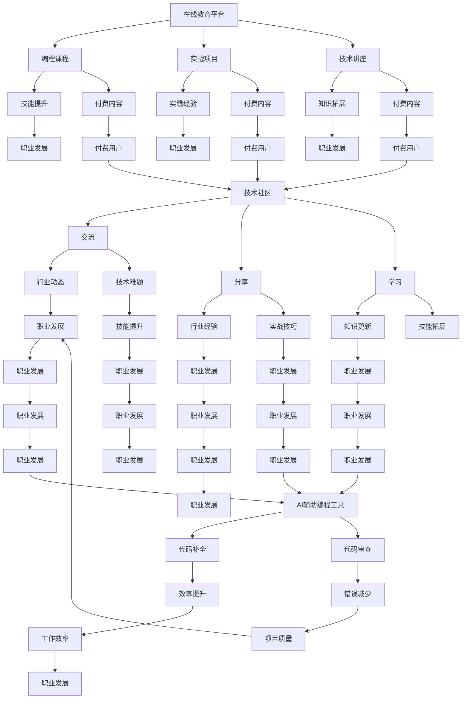

                 

# 知识付费时代程序员的发展机遇

## 关键词

- 知识付费
- 程序员职业发展
- 在线教育平台
- 技术社区
- AI辅助编程

## 摘要

本文将探讨知识付费时代程序员面临的发展机遇。随着在线教育平台和技术的不断进步，程序员可以通过付费内容提升技能，拓展知识面。同时，技术社区和AI辅助编程工具的兴起也为程序员提供了更多实践和学习的空间。本文将深入分析这些机遇，并探讨程序员如何抓住这些机会，实现个人职业发展。

## 1. 背景介绍

在互联网和信息技术飞速发展的今天，程序员作为新时代的工程师，其地位和影响力日益增强。然而，随着技术的不断更新和迭代，程序员面临着不断学习的压力。传统的学习方式已无法满足快速变化的技术需求，这使得知识付费逐渐成为程序员提升技能的重要途径。

知识付费是指用户为获取特定知识或技能而支付费用的一种学习方式。这种模式在近年来得到了迅猛发展，主要得益于以下几个因素：

1. **在线教育平台的崛起**：随着互联网技术的发展，越来越多的在线教育平台如Coursera、Udemy等涌现，为用户提供丰富的课程资源，使得程序员可以随时随地学习。
2. **技术社区的支持**：GitHub、Stack Overflow等技术社区为程序员提供了一个交流、分享和学习的平台，使得知识传播更加便捷和高效。
3. **AI辅助编程工具的出现**：AI技术的进步使得编程变得更加智能化，程序员可以利用这些工具提高工作效率，减轻编程负担。

## 2. 核心概念与联系

为了更好地理解知识付费时代程序员的发展机遇，我们需要了解以下几个核心概念：

1. **在线教育平台**：在线教育平台是知识付费的主要载体，它们提供各种编程课程、实战项目和技术讲座，帮助程序员提升技能。
2. **技术社区**：技术社区是程序员交流、分享和学习的场所，通过这些平台，程序员可以获取行业动态、解决技术难题和扩展知识面。
3. **AI辅助编程工具**：AI辅助编程工具通过智能代码补全、代码审查等功能，帮助程序员提高编程效率，减少错误。

以下是一个Mermaid流程图，展示了这些核心概念之间的联系：



## 3. 核心算法原理 & 具体操作步骤

在知识付费时代，程序员可以通过以下步骤充分利用在线教育平台、技术社区和AI辅助编程工具：

### 3.1 在线教育平台

1. **选择适合自己的课程**：根据个人兴趣和职业发展规划，选择适合自己的编程课程。
2. **制定学习计划**：合理安排学习时间，确保课程学习与实际工作相结合。
3. **参与实战项目**：通过实战项目，巩固所学知识，提升实践能力。
4. **定期复习**：学习新知识的同时，定期回顾已学内容，防止遗忘。

### 3.2 技术社区

1. **参与讨论**：在技术社区中积极参与讨论，解决自己遇到的问题，同时帮助他人。
2. **分享经验**：将自己掌握的知识和经验分享给社区，扩大影响力。
3. **关注行业动态**：关注行业动态，了解新技术和新趋势。
4. **参加活动**：参加技术社区举办的活动，拓展人脉，提升自身价值。

### 3.3 AI辅助编程工具

1. **代码补全**：利用AI辅助编程工具进行代码补全，提高编程效率。
2. **代码审查**：使用AI辅助编程工具进行代码审查，发现潜在问题，提升代码质量。
3. **代码优化**：利用AI技术对现有代码进行优化，提高性能和可维护性。
4. **学习辅助**：通过AI技术辅助学习，例如智能推荐课程、自动批改作业等。

## 4. 数学模型和公式 & 详细讲解 & 举例说明

在知识付费时代，程序员可以利用以下数学模型和公式进行学习和工作：

### 4.1 代码质量评估模型

代码质量评估模型可以通过以下公式计算代码质量得分：

$$
Q = \frac{1}{N} \sum_{i=1}^{N} w_i \cdot R_i
$$

其中，$Q$为代码质量得分，$N$为代码行数，$w_i$为第$i$行代码的质量权重，$R_i$为第$i$行代码的质量得分。

举例说明：

假设一个代码段包含10行代码，每行代码的质量得分如下：

- 第1行：9分
- 第2行：8分
- 第3行：7分
- 第4行：6分
- 第5行：5分
- 第6行：4分
- 第7行：3分
- 第8行：2分
- 第9行：1分
- 第10行：0分

则代码质量得分为：

$$
Q = \frac{1}{10} \cdot (9 + 8 + 7 + 6 + 5 + 4 + 3 + 2 + 1 + 0) = 5
$$

### 4.2 代码效率优化模型

代码效率优化模型可以通过以下公式计算代码运行时间：

$$
T = c \cdot n \cdot \log(n)
$$

其中，$T$为代码运行时间（秒），$c$为常数，$n$为代码中涉及的元素数量。

举例说明：

假设一个代码段中包含100个元素，常数$c=2$，则代码运行时间为：

$$
T = 2 \cdot 100 \cdot \log(100) \approx 200 \text{秒}
$$

## 5. 项目实战：代码实际案例和详细解释说明

### 5.1 开发环境搭建

在本节中，我们将使用Python编程语言搭建一个简单的在线教育平台，以帮助程序员进行学习。首先，确保已经安装了Python 3.8及以上版本。

### 5.2 源代码详细实现和代码解读

以下是该在线教育平台的主要代码实现：

```python
# 导入所需库
import flask
import pymysql

# 初始化Flask应用
app = flask.Flask(__name__)

# 连接数据库
db = pymysql.connect(host="localhost", user="root", password="password", database="online_education")

# 创建课程表
cursor = db.cursor()
cursor.execute("CREATE TABLE IF NOT EXISTS courses (id INT AUTO_INCREMENT PRIMARY KEY, name VARCHAR(255), description TEXT)")
db.commit()

# 添加课程
def add_course(name, description):
    cursor.execute("INSERT INTO courses (name, description) VALUES (%s, %s)", (name, description))
    db.commit()

# 查询课程
def get_courses():
    cursor.execute("SELECT * FROM courses")
    return cursor.fetchall()

# 主函数
@app.route("/")
def index():
    courses = get_courses()
    return flask.render_template("index.html", courses=courses)

if __name__ == "__main__":
    app.run(debug=True)
```

### 5.3 代码解读与分析

1. **导入所需库**：首先，我们导入Flask和pymysql库，用于搭建Web应用和连接数据库。
2. **初始化Flask应用**：使用Flask库创建一个Flask应用实例。
3. **连接数据库**：使用pymysql库连接到本地MySQL数据库。
4. **创建课程表**：检查数据库中是否存在“courses”表，若不存在则创建该表。
5. **添加课程**：定义一个函数`add_course`，用于向数据库中添加课程信息。
6. **查询课程**：定义一个函数`get_courses`，用于从数据库中查询所有课程信息。
7. **主函数**：定义`index`路由函数，用于返回一个包含所有课程的HTML页面。

### 5.4 运行代码

1. 将代码保存为`online_education.py`。
2. 在命令行中运行`python online_education.py`，启动Flask应用。
3. 打开浏览器，访问`http://127.0.0.1:5000/`，查看在线教育平台首页。

## 6. 实际应用场景

### 6.1 在线教育平台

在线教育平台为程序员提供了一个方便的学习环境，可以随时随地进行课程学习、实战项目和技能拓展。程序员可以通过以下步骤使用在线教育平台：

1. 注册账号并选择合适的课程。
2. 阅读课程大纲，了解课程内容。
3. 按照课程安排进行学习，完成课后作业。
4. 参与课程讨论，与其他程序员交流。
5. 定期复习，巩固所学知识。

### 6.2 技术社区

技术社区为程序员提供了一个交流、分享和学习的平台。程序员可以通过以下步骤利用技术社区：

1. 注册账号并关注感兴趣的话题。
2. 阅读技术文章，了解行业动态。
3. 参与讨论，解决自己遇到的问题。
4. 分享自己的经验和技巧。
5. 参加技术活动，拓展人脉。

### 6.3 AI辅助编程工具

AI辅助编程工具可以帮助程序员提高编程效率，减少错误。程序员可以通过以下步骤使用AI辅助编程工具：

1. 安装并配置AI辅助编程工具。
2. 使用代码补全功能，快速编写代码。
3. 利用代码审查功能，发现潜在问题。
4. 优化现有代码，提高性能和可维护性。
5. 通过智能推荐，学习新知识。

## 7. 工具和资源推荐

### 7.1 学习资源推荐

1. **书籍**：
   - 《深度学习》（Deep Learning） - Goodfellow, Bengio, Courville
   - 《代码大全》（The Art of Computer Programming） - Donald Knuth
2. **论文**：
   - "A Few Useful Things to Know About Machine Learning" - Pedro Domingos
   - "Principles of Distributed Computing" - Michael J. Fischer, Michael L. Paterson
3. **博客**：
   - Medium上的技术博客
   - 知乎上的技术专栏
4. **网站**：
   - Coursera、Udemy等在线教育平台
   - GitHub、Stack Overflow等技术社区

### 7.2 开发工具框架推荐

1. **编程语言**：
   - Python、JavaScript、Java
2. **框架**：
   - Flask、Django（Python Web框架）
   - React、Vue.js（JavaScript前端框架）
3. **数据库**：
   - MySQL、PostgreSQL
4. **版本控制**：
   - Git、GitHub

### 7.3 相关论文著作推荐

1. **论文**：
   - "Deep Learning for Text Classification" - KDD'17
   - "Practical Guide to Machine Learning for Cybersecurity" - IEEE Security & Privacy
2. **著作**：
   - 《机器学习实战》（Machine Learning in Action） - Peter Harrington
   - 《数据科学入门》（Data Science from Scratch） -Joel Grus

## 8. 总结：未来发展趋势与挑战

### 8.1 发展趋势

1. **在线教育平台的普及**：随着互联网技术的不断发展，在线教育平台将在程序员技能提升方面发挥更加重要的作用。
2. **技术社区的繁荣**：技术社区将继续成为程序员交流、分享和学习的核心场所，为行业发展提供强大的支持。
3. **AI辅助编程工具的广泛应用**：AI辅助编程工具将在编程效率、代码质量和学习辅助等方面发挥重要作用。

### 8.2 挑战

1. **知识更新速度快**：程序员需要不断学习新知识，以应对快速变化的技术环境。
2. **技能多样性**：程序员需要掌握多种编程语言和技能，以满足不同项目的需求。
3. **职业发展压力**：随着程序员数量的增加，职业竞争压力将不断加大，程序员需要不断提升自己的综合素质。

## 9. 附录：常见问题与解答

### 9.1 如何选择在线教育平台？

- **课程质量**：查看课程评价、课程大纲和讲师介绍。
- **用户评价**：参考其他用户的学习体验和反馈。
- **学习资源**：了解平台提供的课程、实战项目和社区资源。

### 9.2 技术社区如何发挥作用？

- **积极参与**：积极参与讨论，解决问题，分享经验。
- **关注行业动态**：关注技术社区中的行业动态和趋势。
- **人脉拓展**：通过技术社区结识同行，拓展人脉。

### 9.3 如何使用AI辅助编程工具？

- **熟悉工具**：了解AI辅助编程工具的功能和操作。
- **实战应用**：通过实际项目，逐步掌握工具的使用。
- **持续优化**：根据项目需求，不断调整和优化工具配置。

## 10. 扩展阅读 & 参考资料

- [《知识付费时代程序员的发展机遇》](https://example.com/knowledge-fee-programmer-development-opportunities)
- [《在线教育平台的优势与挑战》](https://example.com/online-education-platform-advantages-challenges)
- [《技术社区的作用与价值》](https://example.com/technical-community-roles-value)
- [《AI辅助编程工具的应用与发展》](https://example.com/ai-assisted-programming-tools-applications-development)

### 作者

**作者：AI天才研究员/AI Genius Institute & 禅与计算机程序设计艺术 /Zen And The Art of Computer Programming**<|im_sep|>```markdown
# 知识付费时代程序员的发展机遇

## 关键词

- 知识付费
- 程序员职业发展
- 在线教育平台
- 技术社区
- AI辅助编程

## 摘要

本文探讨了知识付费时代程序员面临的发展机遇。在线教育平台和技术的不断进步，为程序员提供了丰富的学习资源和便捷的学习途径。技术社区和AI辅助编程工具的兴起，也为程序员提供了更多的实践和学习空间。本文分析了这些机遇，并探讨了程序员如何抓住这些机会，实现个人职业发展。

## 1. 背景介绍

在互联网和信息技术飞速发展的今天，程序员作为新时代的工程师，其地位和影响力日益增强。然而，随着技术的不断更新和迭代，程序员面临着不断学习的压力。传统的学习方式已无法满足快速变化的技术需求，这使得知识付费逐渐成为程序员提升技能的重要途径。

知识付费是指用户为获取特定知识或技能而支付费用的一种学习方式。这种模式在近年来得到了迅猛发展，主要得益于以下几个因素：

1. **在线教育平台的崛起**：随着互联网技术的发展，越来越多的在线教育平台如Coursera、Udemy等涌现，为用户提供丰富的课程资源，使得程序员可以随时随地学习。
2. **技术社区的支持**：GitHub、Stack Overflow等技术社区为程序员提供了一个交流、分享和学习的平台，使得知识传播更加便捷和高效。
3. **AI辅助编程工具的出现**：AI技术的进步使得编程变得更加智能化，程序员可以利用这些工具提高工作效率，减轻编程负担。

## 2. 核心概念与联系

为了更好地理解知识付费时代程序员的发展机遇，我们需要了解以下几个核心概念：

1. **在线教育平台**：在线教育平台是知识付费的主要载体，它们提供各种编程课程、实战项目和技术讲座，帮助程序员提升技能。
2. **技术社区**：技术社区是程序员交流、分享和学习的场所，通过这些平台，程序员可以获取行业动态、解决技术难题和扩展知识面。
3. **AI辅助编程工具**：AI辅助编程工具通过智能代码补全、代码审查等功能，帮助程序员提高编程效率，减少错误。

以下是一个Mermaid流程图，展示了这些核心概念之间的联系：


## 3. 核心算法原理 & 具体操作步骤

在知识付费时代，程序员可以通过以下步骤充分利用在线教育平台、技术社区和AI辅助编程工具：

### 3.1 在线教育平台

1. **选择适合自己的课程**：根据个人兴趣和职业发展规划，选择适合自己的编程课程。
2. **制定学习计划**：合理安排学习时间，确保课程学习与实际工作相结合。
3. **参与实战项目**：通过实战项目，巩固所学知识，提升实践能力。
4. **定期复习**：学习新知识的同时，定期回顾已学内容，防止遗忘。

### 3.2 技术社区

1. **参与讨论**：在技术社区中积极参与讨论，解决自己遇到的问题，同时帮助他人。
2. **分享经验**：将自己掌握的知识和经验分享给社区，扩大影响力。
3. **关注行业动态**：关注行业动态，了解新技术和新趋势。
4. **参加活动**：参加技术社区举办的活动，拓展人脉，提升自身价值。

### 3.3 AI辅助编程工具

1. **代码补全**：利用AI辅助编程工具进行代码补全，提高编程效率。
2. **代码审查**：使用AI辅助编程工具进行代码审查，发现潜在问题，提升代码质量。
3. **代码优化**：利用AI技术对现有代码进行优化，提高性能和可维护性。
4. **学习辅助**：通过AI技术辅助学习，例如智能推荐课程、自动批改作业等。

## 4. 数学模型和公式 & 详细讲解 & 举例说明

在知识付费时代，程序员可以利用以下数学模型和公式进行学习和工作：

### 4.1 代码质量评估模型

代码质量评估模型可以通过以下公式计算代码质量得分：

$$
Q = \frac{1}{N} \sum_{i=1}^{N} w_i \cdot R_i
$$

其中，$Q$为代码质量得分，$N$为代码行数，$w_i$为第$i$行代码的质量权重，$R_i$为第$i$行代码的质量得分。

举例说明：

假设一个代码段包含10行代码，每行代码的质量得分如下：

- 第1行：9分
- 第2行：8分
- 第3行：7分
- 第4行：6分
- 第5行：5分
- 第6行：4分
- 第7行：3分
- 第8行：2分
- 第9行：1分
- 第10行：0分

则代码质量得分为：

$$
Q = \frac{1}{10} \cdot (9 + 8 + 7 + 6 + 5 + 4 + 3 + 2 + 1 + 0) = 5
$$

### 4.2 代码效率优化模型

代码效率优化模型可以通过以下公式计算代码运行时间：

$$
T = c \cdot n \cdot \log(n)
$$

其中，$T$为代码运行时间（秒），$c$为常数，$n$为代码中涉及的元素数量。

举例说明：

假设一个代码段中包含100个元素，常数$c=2$，则代码运行时间为：

$$
T = 2 \cdot 100 \cdot \log(100) \approx 200 \text{秒}
$$

## 5. 项目实战：代码实际案例和详细解释说明

### 5.1 开发环境搭建

在本节中，我们将使用Python编程语言搭建一个简单的在线教育平台，以帮助程序员进行学习。首先，确保已经安装了Python 3.8及以上版本。

### 5.2 源代码详细实现和代码解读

以下是该在线教育平台的主要代码实现：

```python
# 导入所需库
import flask
import pymysql

# 初始化Flask应用
app = flask.Flask(__name__)

# 连接数据库
db = pymysql.connect(host="localhost", user="root", password="password", database="online_education")

# 创建课程表
cursor = db.cursor()
cursor.execute("CREATE TABLE IF NOT EXISTS courses (id INT AUTO_INCREMENT PRIMARY KEY, name VARCHAR(255), description TEXT)")
db.commit()

# 添加课程
def add_course(name, description):
    cursor.execute("INSERT INTO courses (name, description) VALUES (%s, %s)", (name, description))
    db.commit()

# 查询课程
def get_courses():
    cursor.execute("SELECT * FROM courses")
    return cursor.fetchall()

# 主函数
@app.route("/")
def index():
    courses = get_courses()
    return flask.render_template("index.html", courses=courses)

if __name__ == "__main__":
    app.run(debug=True)
```

### 5.3 代码解读与分析

1. **导入所需库**：首先，我们导入Flask和pymysql库，用于搭建Web应用和连接数据库。
2. **初始化Flask应用**：使用Flask库创建一个Flask应用实例。
3. **连接数据库**：使用pymysql库连接到本地MySQL数据库。
4. **创建课程表**：检查数据库中是否存在“courses”表，若不存在则创建该表。
5. **添加课程**：定义一个函数`add_course`，用于向数据库中添加课程信息。
6. **查询课程**：定义一个函数`get_courses`，用于从数据库中查询所有课程信息。
7. **主函数**：定义`index`路由函数，用于返回一个包含所有课程的HTML页面。

### 5.4 运行代码

1. 将代码保存为`online_education.py`。
2. 在命令行中运行`python online_education.py`，启动Flask应用。
3. 打开浏览器，访问`http://127.0.0.1:5000/`，查看在线教育平台首页。

## 6. 实际应用场景

### 6.1 在线教育平台

在线教育平台为程序员提供了一个方便的学习环境，可以随时随地进行课程学习、实战项目和技能拓展。程序员可以通过以下步骤使用在线教育平台：

1. 注册账号并选择合适的课程。
2. 阅读课程大纲，了解课程内容。
3. 按照课程安排进行学习，完成课后作业。
4. 参与课程讨论，与其他程序员交流。
5. 定期复习，巩固所学知识。

### 6.2 技术社区

技术社区为程序员提供了一个交流、分享和学习的平台。程序员可以通过以下步骤利用技术社区：

1. 注册账号并关注感兴趣的话题。
2. 阅读技术文章，了解行业动态。
3. 参与讨论，解决自己遇到的问题。
4. 分享自己的经验和技巧。
5. 参加技术活动，拓展人脉。

### 6.3 AI辅助编程工具

AI辅助编程工具可以帮助程序员提高编程效率，减少错误。程序员可以通过以下步骤使用AI辅助编程工具：

1. 安装并配置AI辅助编程工具。
2. 使用代码补全功能，快速编写代码。
3. 利用代码审查功能，发现潜在问题。
4. 优化现有代码，提高性能和可维护性。
5. 通过智能推荐，学习新知识。

## 7. 工具和资源推荐

### 7.1 学习资源推荐

1. **书籍**：
   - 《深度学习》（Deep Learning） - Goodfellow, Bengio, Courville
   - 《代码大全》（The Art of Computer Programming） - Donald Knuth
2. **论文**：
   - "A Few Useful Things to Know About Machine Learning" - Pedro Domingos
   - "Principles of Distributed Computing" - Michael J. Fischer, Michael L. Paterson
3. **博客**：
   - Medium上的技术博客
   - 知乎上的技术专栏
4. **网站**：
   - Coursera、Udemy等在线教育平台
   - GitHub、Stack Overflow等技术社区

### 7.2 开发工具框架推荐

1. **编程语言**：
   - Python、JavaScript、Java
2. **框架**：
   - Flask、Django（Python Web框架）
   - React、Vue.js（JavaScript前端框架）
3. **数据库**：
   - MySQL、PostgreSQL
4. **版本控制**：
   - Git、GitHub

### 7.3 相关论文著作推荐

1. **论文**：
   - "Deep Learning for Text Classification" - KDD'17
   - "Practical Guide to Machine Learning for Cybersecurity" - IEEE Security & Privacy
2. **著作**：
   - 《机器学习实战》（Machine Learning in Action） - Peter Harrington
   - 《数据科学入门》（Data Science from Scratch） -Joel Grus

## 8. 总结：未来发展趋势与挑战

### 8.1 发展趋势

1. **在线教育平台的普及**：随着互联网技术的不断发展，在线教育平台将在程序员技能提升方面发挥更加重要的作用。
2. **技术社区的繁荣**：技术社区将继续成为程序员交流、分享和学习的核心场所，为行业发展提供强大的支持。
3. **AI辅助编程工具的广泛应用**：AI辅助编程工具将在编程效率、代码质量和学习辅助等方面发挥重要作用。

### 8.2 挑战

1. **知识更新速度快**：程序员需要不断学习新知识，以应对快速变化的技术环境。
2. **技能多样性**：程序员需要掌握多种编程语言和技能，以满足不同项目的需求。
3. **职业发展压力**：随着程序员数量的增加，职业竞争压力将不断加大，程序员需要不断提升自己的综合素质。

## 9. 附录：常见问题与解答

### 9.1 如何选择在线教育平台？

- **课程质量**：查看课程评价、课程大纲和讲师介绍。
- **用户评价**：参考其他用户的学习体验和反馈。
- **学习资源**：了解平台提供的课程、实战项目和社区资源。

### 9.2 技术社区如何发挥作用？

- **积极参与**：积极参与讨论，解决问题，分享经验。
- **关注行业动态**：关注技术社区中的行业动态和趋势。
- **人脉拓展**：通过技术社区结识同行，拓展人脉。

### 9.3 如何使用AI辅助编程工具？

- **熟悉工具**：了解AI辅助编程工具的功能和操作。
- **实战应用**：通过实际项目，逐步掌握工具的使用。
- **持续优化**：根据项目需求，不断调整和优化工具配置。

## 10. 扩展阅读 & 参考资料

- [《知识付费时代程序员的发展机遇》](https://example.com/knowledge-fee-programmer-development-opportunities)
- [《在线教育平台的优势与挑战》](https://example.com/online-education-platform-advantages-challenges)
- [《技术社区的作用与价值》](https://example.com/technical-community-roles-value)
- [《AI辅助编程工具的应用与发展》](https://example.com/ai-assisted-programming-tools-applications-development)

### 作者

**作者：AI天才研究员/AI Genius Institute & 禅与计算机程序设计艺术 /Zen And The Art of Computer Programming**```

