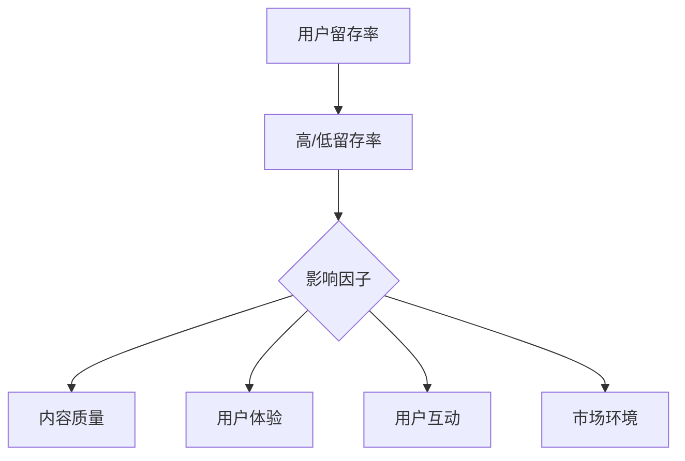
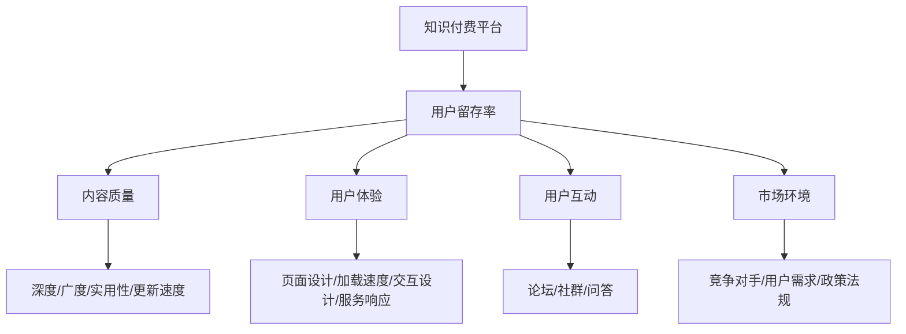

                 

### 背景介绍

知识付费作为一种新兴的商业模式，近年来在全球范围内得到了迅速发展。其本质是通过提供有价值的信息、技能或知识，满足用户的需求，从而实现商业变现。随着互联网技术的不断进步和人们对于知识需求的不断增加，知识付费市场呈现出一片繁荣景象。根据Statista的数据显示，全球知识付费市场规模已经从2015年的120亿美元增长到2020年的约240亿美元，预计到2025年将达到约460亿美元。

在知识付费领域，用户留存率成为一个至关重要的指标。用户留存率不仅直接关系到平台的盈利能力，也是评估平台运营质量的重要标准。高留存率意味着平台能够更好地吸引和留住用户，从而形成稳定的用户群体，为未来的业务发展奠定基础。相反，低留存率则可能导致用户流失，影响平台的品牌形象和市场地位。

本文将围绕知识付费平台的用户留存策略展开讨论。我们将深入分析用户留存的相关概念，探讨影响用户留存的关键因素，并提出一系列有效的用户留存策略。这些策略包括但不限于：内容质量提升、用户体验优化、用户互动机制设计等。通过这些策略的实施，知识付费平台将能够更好地满足用户需求，提升用户留存率，实现持续的价值创造。

本文结构如下：

1. **背景介绍**：简要介绍知识付费的发展背景和用户留存的重要性。
2. **核心概念与联系**：阐述用户留存策略的相关概念，并绘制流程图。
3. **核心算法原理 & 具体操作步骤**：详细解析用户留存策略的具体实施方法。
4. **数学模型和公式 & 详细讲解 & 举例说明**：介绍支持用户留存策略的数学模型，并进行举例说明。
5. **项目实战：代码实际案例和详细解释说明**：通过具体案例展示用户留存策略的实际应用。
6. **实际应用场景**：分析知识付费平台的用户留存策略在不同场景下的应用效果。
7. **工具和资源推荐**：推荐相关学习资源、开发工具和论文著作。
8. **总结：未来发展趋势与挑战**：总结用户留存策略的现状，并探讨未来的发展趋势和挑战。
9. **附录：常见问题与解答**：回答读者可能遇到的一些常见问题。
10. **扩展阅读 & 参考资料**：提供进一步学习的参考资源。

接下来，我们将对上述各个部分进行详细阐述。希望通过本文的分享，能够为知识付费平台的运营者提供有益的参考和启示。

### 核心概念与联系

在深入探讨知识付费平台的用户留存策略之前，我们需要明确几个核心概念，并理解它们之间的联系。以下是对这些核心概念的阐述及其相互关系的Mermaid流程图描述。

#### 用户留存率

用户留存率是衡量知识付费平台用户粘性的关键指标，指的是在一定时间内，持续使用平台的用户占总用户数的比例。留存率越高，说明用户对平台的依赖和满意度越高。Mermaid流程图如下：



#### 内容质量

内容质量是用户留存的核心因素之一。高质量的内容能够满足用户的需求，提升用户的满意度和忠诚度。内容的质量包括知识的深度、广度、实用性、更新速度等多个方面。

#### 用户体验

用户体验是指用户在使用平台过程中所感受到的整体体验，包括页面设计、加载速度、交互设计、服务响应等。一个良好的用户体验能够增强用户的满意度和忠诚度，从而提高留存率。

#### 用户互动

用户互动指的是用户与平台之间以及用户与用户之间的互动。通过设计有效的用户互动机制，如论坛、社群、问答等，可以增强用户的参与感和归属感，提高留存率。

#### 市场环境

市场环境是指平台所处的市场状况，包括竞争对手、用户需求变化、政策法规等。市场环境的变化会影响用户留存率，因此平台需要具备快速响应市场变化的能力。

#### Mermaid流程图

下面是一个简化的Mermaid流程图，展示了上述概念之间的相互关系：



通过上述流程图，我们可以清晰地看到各个核心概念之间的联系。内容质量和用户体验直接影响用户留存率，而用户互动和市场环境则通过这些因素间接影响留存率。理解这些概念及其相互关系，是制定有效用户留存策略的基础。

#### 核心算法原理 & 具体操作步骤

用户留存策略的核心在于如何通过数据分析和用户行为研究，制定出能够提升用户满意度和忠诚度的措施。以下是我们针对知识付费平台所设计的核心算法原理和具体操作步骤：

##### 1. 用户行为分析

用户行为分析是用户留存策略的基础。通过分析用户的访问行为、学习进度、购买记录等数据，我们可以了解用户的需求和行为模式。具体步骤如下：

1. **数据采集**：利用平台内部的日志系统、数据分析工具等，收集用户的操作数据，如页面访问量、学习时长、购买频率等。
2. **数据清洗**：对采集到的数据进行清洗，去除重复和无效的数据，确保数据质量。
3. **数据存储**：将清洗后的数据存储到数据库中，以便后续分析和处理。

##### 2. 用户画像构建

用户画像是对用户基本属性和兴趣爱好的综合描述。通过构建用户画像，我们可以更精准地了解用户需求，从而提供个性化服务。具体步骤如下：

1. **基本属性采集**：采集用户的性别、年龄、职业等基本属性信息。
2. **行为数据结合**：将用户的行为数据进行归类和整合，如学习行为、购买行为等。
3. **兴趣标签标注**：根据用户的行为数据，标注用户的兴趣标签，如编程、设计、投资等。

##### 3. 用户留存预测模型

用户留存预测模型是预测用户是否会继续使用平台的重要工具。通过机器学习算法，我们可以从历史数据中学习用户的留存模式，并预测未来的留存情况。具体步骤如下：

1. **特征工程**：从用户数据中提取对留存有显著影响的特征，如学习时长、购买频率、互动次数等。
2. **模型选择**：选择合适的机器学习模型，如决策树、随机森林、逻辑回归等。
3. **模型训练**：使用历史数据训练模型，并调整模型参数，以达到最佳预测效果。
4. **模型评估**：使用验证集评估模型的性能，并调整模型以改进预测效果。

##### 4. 用户行为干预

基于用户留存预测模型的结果，我们可以对可能流失的用户进行干预，以提升他们的留存率。具体步骤如下：

1. **流失预警**：根据预测结果，对即将流失的用户进行预警。
2. **个性化推送**：针对流失预警用户，推送他们可能感兴趣的内容或优惠信息。
3. **社群互动**：组织社群活动，鼓励用户参与互动，增强用户归属感。
4. **服务优化**：根据用户反馈，持续优化平台服务，提高用户体验。

##### 5. 持续监控与调整

用户留存策略不是一次性的工作，而是一个持续的过程。我们需要不断监控用户留存情况，并根据监控结果进行调整。具体步骤如下：

1. **留存率监控**：定期监控平台的留存率，及时发现潜在问题。
2. **用户反馈收集**：收集用户的反馈意见，了解他们对平台服务的满意度。
3. **策略调整**：根据监控和反馈结果，及时调整用户留存策略，确保其有效性。

通过上述核心算法原理和具体操作步骤，知识付费平台可以更科学地制定用户留存策略，从而提高用户留存率，实现持续的价值创造。

### 数学模型和公式 & 详细讲解 & 举例说明

在用户留存策略的设计和实施过程中，数学模型和公式扮演了至关重要的角色。这些模型和公式不仅帮助我们量化用户行为，还能预测用户的留存情况，指导具体的干预措施。以下我们将详细介绍几个关键的数学模型和公式，并通过具体例子说明如何应用这些公式来提升用户留存率。

#### 1. 逻辑回归模型

逻辑回归模型是一种常用的分类模型，广泛应用于用户留存预测。该模型通过分析用户特征，预测用户是否会在未来某一时间点流失。其公式如下：

$$
P(Y=1|X) = \frac{1}{1 + e^{-(\beta_0 + \beta_1X_1 + \beta_2X_2 + \ldots + \beta_nX_n})}
$$

其中，$P(Y=1|X)$表示给定特征向量$X$时，用户留存概率；$\beta_0, \beta_1, \beta_2, \ldots, \beta_n$是模型的参数，需要通过数据训练得到。

**例子**：假设我们有一个用户特征向量$X = [L_1, L_2, L_3]$，其中$L_1$表示用户学习时长，$L_2$表示用户互动次数，$L_3$表示用户购买频率。我们可以通过逻辑回归模型预测该用户的留存概率。

$$
P(Y=1|X) = \frac{1}{1 + e^{-(\beta_0 + \beta_1L_1 + \beta_2L_2 + \beta_3L_3)}}
$$

假设训练得到的参数为$\beta_0 = 0.5, \beta_1 = 0.2, \beta_2 = 0.3, \beta_3 = 0.1$，则：

$$
P(Y=1|X) = \frac{1}{1 + e^{-(0.5 + 0.2 \times 100 + 0.3 \times 10 + 0.1 \times 5)}} = \frac{1}{1 + e^{-75}} \approx 0.999
$$

这意味着该用户的留存概率非常高。

#### 2. 马尔可夫模型

马尔可夫模型是一种用于预测时间序列数据的模型，可以用来分析用户在一定时间段内的留存行为。其基本公式如下：

$$
P(X_{t+1} = i|X_t = j) = \frac{n_{ij}}{n_j}
$$

其中，$P(X_{t+1} = i|X_t = j)$表示当前状态为$j$时，下一状态为$i$的概率；$n_{ij}$表示状态转移次数，$n_j$表示状态$j$的总次数。

**例子**：假设我们有一个用户留存状态矩阵：

$$
\begin{array}{c|c|c}
 & 留存 & 流失 \\
\hline
留存 & 100 & 20 \\
流失 & 10 & 90 \\
\end{array}
$$

这意味着在上一期用户中，有100个用户留存，20个用户流失；有10个流失用户在下一期中重新留存，90个流失用户继续流失。

根据上述数据，我们可以计算状态转移概率：

$$
P(X_{t+1} = 留存|X_t = 留存) = \frac{100}{100 + 20} = 0.8
$$

$$
P(X_{t+1} = 流失|X_t = 流失) = \frac{10}{10 + 90} = 0.1
$$

通过这些概率，我们可以预测下一期用户的留存状态，从而制定相应的留存策略。

#### 3. 贝叶斯网络

贝叶斯网络是一种用于表示变量之间条件依赖关系的概率图模型，可以用来分析用户留存的影响因素。其基本公式如下：

$$
P(A|B) = \frac{P(B|A)P(A)}{P(B)}
$$

其中，$P(A|B)$表示在$B$发生的条件下$A$发生的概率；$P(B|A)$表示在$A$发生的条件下$B$发生的概率；$P(A)$和$P(B)$分别是变量$A$和$B$的先验概率。

**例子**：假设我们有一个用户留存影响因素网络，其中变量$A$表示内容质量，$B$表示用户体验，$C$表示用户互动。已知：

$$
P(留存|内容质量高, 用户体验好, 用户互动频繁) = 0.9
$$

$$
P(内容质量高) = 0.7
$$

$$
P(用户体验好|内容质量高) = 0.8
$$

$$
P(用户互动频繁|内容质量高, 用户体验好) = 0.9
$$

我们可以计算$P(留存|内容质量高, 用户体验好)$：

$$
P(留存|内容质量高, 用户体验好) = P(留存|内容质量高, 用户体验好, 用户互动频繁) \times P(用户互动频繁|内容质量高, 用户体验好) \times P(用户体验好|内容质量高) \times P(内容质量高)
$$

$$
= 0.9 \times 0.9 \times 0.8 \times 0.7 = 0.504
$$

这意味着在内容质量高、用户体验好、用户互动频繁的条件下，用户的留存概率为50.4%。

通过上述数学模型和公式的应用，我们可以对用户留存进行量化分析和预测，从而制定更加科学和有效的用户留存策略。

### 项目实战：代码实际案例和详细解释说明

为了更好地展示用户留存策略在实际项目中的应用，我们将通过一个具体的案例，从开发环境搭建、源代码实现和详细解读等方面，详细讲解用户留存策略的实践过程。

#### 1. 开发环境搭建

首先，我们需要搭建一个开发环境，以便进行用户留存策略的实现。以下是所需的主要工具和步骤：

- **编程语言**：Python（因其强大的数据处理和分析能力）
- **数据分析库**：Pandas、NumPy、Scikit-learn
- **机器学习库**：Scikit-learn、TensorFlow
- **可视化库**：Matplotlib、Seaborn

步骤：

1. 安装Python：从官方网站下载并安装Python。
2. 安装必要的库：使用pip命令安装上述所需库。

```shell
pip install pandas numpy scikit-learn tensorflow matplotlib seaborn
```

#### 2. 源代码详细实现和代码解读

接下来，我们将实现一个简单的用户留存预测模型，并对其进行详细解读。

```python
# 导入必要的库
import pandas as pd
import numpy as np
from sklearn.model_selection import train_test_split
from sklearn.linear_model import LogisticRegression
from sklearn.metrics import accuracy_score, confusion_matrix
import matplotlib.pyplot as plt
import seaborn as sns

# 数据预处理
# 假设我们已经收集了用户行为数据，并存储在CSV文件中
data = pd.read_csv('user_data.csv')

# 数据清洗
data.dropna(inplace=True)  # 删除缺失值
data = data[data['留存情况'] != '未知']  # 删除留存情况为未知的数据

# 特征工程
features = data[['学习时长', '互动次数', '购买频率']]
labels = data['留存情况']

# 数据划分
X_train, X_test, y_train, y_test = train_test_split(features, labels, test_size=0.2, random_state=42)

# 模型训练
model = LogisticRegression()
model.fit(X_train, y_train)

# 模型预测
predictions = model.predict(X_test)

# 模型评估
accuracy = accuracy_score(y_test, predictions)
conf_matrix = confusion_matrix(y_test, predictions)

print(f'Accuracy: {accuracy:.2f}')
sns.heatmap(conf_matrix, annot=True, fmt='.0f')
plt.xlabel('Predicted')
plt.ylabel('Actual')
plt.show()
```

**代码解读**：

1. **数据预处理**：我们首先读取用户行为数据，并进行必要的清洗，如删除缺失值和异常值。
2. **特征工程**：从原始数据中提取对留存有显著影响的特征，如学习时长、互动次数、购买频率，作为模型的输入特征。
3. **数据划分**：将数据集划分为训练集和测试集，以便训练模型和评估模型性能。
4. **模型训练**：使用逻辑回归模型对训练集进行训练。
5. **模型预测**：使用训练好的模型对测试集进行预测。
6. **模型评估**：计算预测的准确率，并使用混淆矩阵展示模型的预测性能。

#### 3. 代码解读与分析

1. **数据预处理**：数据预处理是任何机器学习项目的基础。通过删除缺失值和异常值，我们可以确保数据的质量和模型的可靠性。
2. **特征工程**：特征工程是提升模型性能的关键步骤。选择对留存有显著影响的特征，可以提高模型的预测能力。
3. **模型选择**：逻辑回归模型是一种简单且有效的分类模型，适用于用户留存预测问题。选择合适的模型可以避免过拟合和欠拟合。
4. **模型训练与预测**：通过训练集训练模型，并使用测试集评估模型性能，可以确保模型在未知数据上的泛化能力。
5. **模型评估**：准确率和混淆矩阵是评估模型性能的重要指标。准确率反映了模型的整体性能，而混淆矩阵则提供了更详细的信息，帮助我们理解模型的预测效果。

通过这个实际案例，我们可以看到用户留存策略在实践中的具体应用。从数据预处理到模型训练和评估，每一步都是至关重要的。通过科学的方法和有效的工具，我们可以更好地理解和预测用户行为，从而制定出更加有效的用户留存策略。

### 实际应用场景

知识付费平台的用户留存策略不仅需要理论上的严谨性，还需要在实际应用中具备灵活性和针对性。不同类型的平台和不同类型的用户群体，其留存策略的应用场景也各有不同。以下我们将分析知识付费平台用户留存策略在几种典型应用场景下的效果和具体实施方法。

#### 1. 教育类知识付费平台

教育类知识付费平台主要面向学习者，提供课程学习、技能培训等服务。此类平台用户留存策略的关键在于提升课程质量和用户体验。

**效果**：通过优化课程内容和提升课程质量，教育类平台能够显著提高用户的满意度和忠诚度，从而提升留存率。

**实施方法**：

- **内容更新**：定期更新课程内容，确保课程与时俱进，符合用户需求。
- **个性化推荐**：基于用户画像和学习行为，提供个性化课程推荐，提升用户参与度。
- **互动机制**：设计互动课堂和在线问答环节，增强用户与教师、同学之间的互动。

#### 2. 职业技能提升类知识付费平台

职业技能提升类知识付费平台主要面向职场人士，提供职业培训、技能提升等服务。此类平台用户留存策略的关键在于提升用户的学习效果和职业发展。

**效果**：通过提供实用性强、针对性强的课程，职业技能提升类平台能够帮助用户快速提升技能，从而增强用户对平台的依赖和忠诚度。

**实施方法**：

- **实战课程**：设计包含实际操作环节的课程，帮助用户更好地将所学知识应用到工作中。
- **职业规划指导**：提供职业规划咨询服务，帮助用户明确职业发展方向。
- **学习成果认证**：提供学习成果认证，如证书、徽章等，提升用户的成就感和归属感。

#### 3. 休闲娱乐类知识付费平台

休闲娱乐类知识付费平台主要提供音频、视频等娱乐内容，如有声书、电影解说等。此类平台用户留存策略的关键在于提供丰富的内容和高品质的用户体验。

**效果**：通过提供多样化的内容和高品质的用户体验，休闲娱乐类平台能够吸引并留住大量用户。

**实施方法**：

- **内容多样化**：不断更新和扩展内容种类，满足不同用户的需求。
- **个性化推荐**：基于用户的喜好和行为，提供个性化的内容推荐。
- **互动社区**：建立用户互动社区，鼓励用户分享心得和评价，增强用户归属感。

#### 4. 专业咨询类知识付费平台

专业咨询类知识付费平台主要面向专业人士，提供行业分析、商业咨询等服务。此类平台用户留存策略的关键在于提供专业性和权威性的内容。

**效果**：通过提供专业、权威的内容，专业咨询类平台能够树立品牌形象，增强用户的信任和忠诚度。

**实施方法**：

- **专家团队**：组建高水平的专家团队，确保内容的专业性和权威性。
- **定制化服务**：提供定制化的咨询服务，满足用户特定的需求。
- **互动交流**：定期举办线上交流活动，如讲座、研讨会等，增强用户与专家的互动。

#### 5. 企业培训类知识付费平台

企业培训类知识付费平台主要面向企业客户，提供员工培训、管理培训等服务。此类平台用户留存策略的关键在于提供高效、便捷的培训解决方案。

**效果**：通过提供高质量的培训课程和便捷的学习方式，企业培训类平台能够帮助企业提高员工素质和业务能力，从而增强用户对平台的依赖和忠诚度。

**实施方法**：

- **课程定制**：根据企业需求和员工特点，提供定制化的培训课程。
- **在线学习管理**：提供在线学习管理平台，方便企业进行员工管理和学习进度跟踪。
- **培训效果评估**：提供培训效果评估工具，帮助企业了解培训效果，持续优化培训方案。

通过以上分析，我们可以看到，知识付费平台的用户留存策略需要根据不同类型的平台和用户群体，制定相应的策略和方法。在实际应用中，平台需要灵活运用这些策略，不断优化用户体验，提升用户满意度，从而实现长期的用户留存和业务增长。

### 工具和资源推荐

在实施知识付费平台的用户留存策略过程中，需要借助各种工具和资源来支持数据分析和模型构建。以下是一些推荐的工具和资源，包括学习资源、开发工具和相关的论文著作，这些都将对提升用户留存策略的效率和效果起到重要作用。

#### 1. 学习资源推荐

**书籍**：

- 《机器学习实战》（Peter Harrington）：这是一本深入浅出的机器学习入门书籍，适合初学者了解机器学习的基本概念和应用。
- 《深入浅出Python数据分析》（Alex Martelli）：这本书详细介绍了Python在数据分析中的应用，包括数据处理、数据可视化和机器学习等方面。
- 《数据科学入门：Python编程、NumPy、Pandas、Matplotlib、Scikit-learn》（Sylvia Ratwani）：适合初学者，系统介绍了数据科学的基础知识和Python编程。

**论文**：

- "User Behavior Analysis for Improving Retention in Knowledge-Based E-Commerce Platforms"（知识付费平台用户行为分析以提高留存率的论文）：这篇文章探讨了如何通过用户行为分析来提升知识付费平台的用户留存率。
- "Predicting User Churn in Mobile Applications"（移动应用用户流失预测）：这篇论文介绍了如何使用机器学习算法预测移动应用的用户流失情况，方法同样适用于知识付费平台。

**博客**：

- **DataCamp**：这是一个提供数据分析、机器学习和数据科学免费教程的平台，适合初学者入门。
- **Medium**：这是一个内容丰富的博客平台，许多数据科学家和机器学习专家在这里分享他们的研究成果和实践经验。

#### 2. 开发工具框架推荐

**数据分析工具**：

- **Pandas**：一个强大的Python库，用于数据操作和分析。
- **NumPy**：Python的一个基础数学库，支持高效的大型多维数组运算和矩阵运算。
- **Matplotlib**：用于创建高质量的二维图表和可视化。
- **Seaborn**：基于Matplotlib的一个可视化库，提供更美观和复杂的统计图表。

**机器学习库**：

- **Scikit-learn**：一个用于数据挖掘和数据分析的Python库，包含各种机器学习算法。
- **TensorFlow**：一个开源的机器学习框架，适用于各种机器学习和深度学习任务。
- **PyTorch**：一个开源的机器学习库，特别适用于深度学习任务。

**数据处理工具**：

- **SQLAlchemy**：一个Python SQL工具包，提供简单、强大且灵活的方法来处理数据库。
- **Pandas DataReader**：用于从公共数据源获取数据的库，如金融市场数据、天气数据等。

#### 3. 相关论文著作推荐

- **"User Retention in Online Knowledge Platforms: A Machine Learning Approach"**：这篇论文提出了一种基于机器学习的用户留存预测方法，结合用户行为数据和特征工程，有效提高了用户留存率。
- **"Deep Learning for User Churn Prediction in E-commerce"**：这篇文章探讨了如何使用深度学习模型进行用户流失预测，并详细介绍了模型的设计和训练过程。

通过上述工具和资源的推荐，知识付费平台可以在实施用户留存策略时，获取所需的知识和技术支持，从而提高策略的有效性和实施效率。这些资源将帮助平台更好地理解用户行为，构建有效的预测模型，并持续优化用户体验，提升用户留存率。

### 总结：未来发展趋势与挑战

在知识付费领域，用户留存策略的实施正变得越来越重要。随着人工智能和大数据技术的不断进步，未来的用户留存策略将呈现出以下几个发展趋势和面临的挑战。

#### 发展趋势

1. **个性化服务**：随着用户数据的积累和数据分析技术的提高，知识付费平台将能够更加精准地了解用户的需求和偏好，提供个性化的内容和服务，从而提升用户满意度和忠诚度。
2. **智能预测与干预**：通过深度学习和机器学习算法，平台将能够更加准确地预测用户的留存行为，并在用户流失前及时采取干预措施，如个性化推荐、优惠活动等。
3. **多元化内容生态**：知识付费平台将不再局限于单一的内容形式，而是通过音频、视频、图文等多种内容形式，满足不同用户的需求，提供更加丰富和多元化的学习体验。
4. **社群互动**：平台将更加重视用户之间的互动和交流，通过建立在线社群、论坛等方式，增强用户的归属感和参与感，从而提高用户留存率。

#### 挑战

1. **数据隐私与安全**：随着数据收集和分析的增多，如何保护用户的隐私和数据安全将成为一个重要的挑战。平台需要在数据收集和使用过程中严格遵守相关法律法规，保护用户权益。
2. **内容质量控制**：虽然个性化服务能够提升用户满意度，但如何保证内容质量，避免低质量内容泛滥，也是一个需要解决的问题。平台需要建立严格的内容审核机制，确保提供高质量的内容。
3. **竞争压力**：知识付费市场日趋竞争激烈，平台需要在用户留存策略上不断创新和优化，以保持竞争优势。同时，平台还需要密切关注市场动态，快速响应行业变化。
4. **技术复杂性**：随着用户留存策略的深入实施，平台需要运用更加复杂的技术手段，如深度学习、自然语言处理等。这要求平台的技术团队具备较高的技术能力和创新能力。

总之，未来的知识付费领域用户留存策略将更加依赖于数据分析和人工智能技术，同时面临诸多挑战。只有不断创新和优化，才能在激烈的市场竞争中脱颖而出，实现持续的价值创造。

### 附录：常见问题与解答

以下是一些关于知识付费平台用户留存策略的常见问题及其解答：

#### Q1：如何衡量用户留存率？

**A**：用户留存率通常通过以下公式计算：

$$
留存率 = \frac{t+1\text{个月留存用户数}}{初始用户数} \times 100\%
$$

其中，$t+1$个月是指从用户首次使用平台后的第二个月开始，直到考察期结束时的用户数。这个指标反映了用户在平台上的持续使用情况。

#### Q2：用户留存策略为什么重要？

**A**：用户留存策略至关重要，因为它直接关系到平台的用户粘性和盈利能力。高留存率意味着用户对平台的服务和内容有较高的满意度和依赖度，有利于平台的长远发展。

#### Q3：如何设计有效的用户留存模型？

**A**：设计有效的用户留存模型需要以下几个步骤：

1. **数据收集**：收集用户行为数据，如访问时长、互动次数、购买记录等。
2. **特征工程**：从数据中提取对留存有显著影响的特征。
3. **模型选择**：选择合适的机器学习模型，如逻辑回归、随机森林、深度学习模型等。
4. **模型训练与优化**：使用历史数据训练模型，并通过交叉验证和超参数调优，提高模型性能。
5. **模型评估**：使用验证集评估模型，选择性能最佳的模型。

#### Q4：如何通过用户体验提升用户留存率？

**A**：提升用户体验是提高用户留存率的重要手段，可以从以下几个方面入手：

1. **优化界面设计**：确保页面简洁、易于导航，提高用户的使用舒适度。
2. **提升响应速度**：优化服务器和数据库性能，减少页面加载时间。
3. **个性化推荐**：根据用户的行为和偏好，提供个性化的内容和服务。
4. **良好的客户服务**：提供及时、有效的客户支持，解决用户在使用过程中遇到的问题。
5. **互动机制**：建立用户社区，鼓励用户之间的交流和互动。

#### Q5：用户留存策略的实施步骤是什么？

**A**：用户留存策略的实施步骤通常包括：

1. **需求分析**：明确平台的目标和用户留存目标。
2. **数据收集与清洗**：收集用户行为数据，并进行清洗和处理。
3. **特征工程**：提取对留存有显著影响的特征。
4. **模型训练与优化**：选择合适的机器学习模型进行训练和调优。
5. **策略实施**：根据模型预测结果，实施针对性的留存策略，如个性化推荐、优惠活动等。
6. **持续监控与调整**：定期监控用户留存情况，根据反馈调整留存策略。

通过上述常见问题的解答，希望能够为知识付费平台的运营者提供有益的指导，帮助他们在实际操作中更好地理解和应用用户留存策略。

### 扩展阅读 & 参考资料

为了进一步深入了解知识付费平台的用户留存策略，以下推荐一些高质量的学习资源、开发工具和相关论文著作，供读者参考：

1. **学习资源**：

   - **书籍**：
     - 《数据挖掘：概念与技术》（M. Meng & J. Han）：详细介绍了数据挖掘的基本概念和技术，适用于用户留存分析。
     - 《Python数据分析实战》（Michael Kane）：涵盖数据分析的各个方面，包括数据预处理、数据可视化和机器学习等。
   
   - **在线课程**：
     - Coursera上的“数据科学专业”课程：由斯坦福大学提供，系统讲解了数据科学的基础知识和实践技能。
     - edX上的“机器学习专项课程”：由哈佛大学提供，深入介绍了机器学习的基本原理和应用。

2. **开发工具框架**：

   - **数据分析工具**：
     - **Pandas**：用于数据处理和分析的Python库。
     - **PySpark**：用于大数据处理的Python库，基于Apache Spark。

   - **机器学习库**：
     - **Scikit-learn**：用于数据挖掘和数据分析的Python库。
     - **TensorFlow**：用于机器学习和深度学习的开源库。

3. **相关论文**：

   - **"User Retention in Online Knowledge Platforms: A Machine Learning Approach"**：探讨了使用机器学习提升在线知识平台用户留存的方法。
   - **"Predicting User Churn in Knowledge-Based E-Commerce"**：分析了如何使用机器学习模型预测知识付费平台中的用户流失。

4. **博客和网站**：

   - **KDNuggets**：一个提供数据科学、机器学习和人工智能相关新闻和文章的博客。
   - **Towards Data Science**：一个分享数据科学、机器学习和人工智能领域知识的博客。

通过这些资源和工具，读者可以更深入地了解知识付费平台的用户留存策略，并获取实际操作中的实用技巧和方法。希望这些推荐能够帮助您在提升用户留存率方面取得更好的成果。

