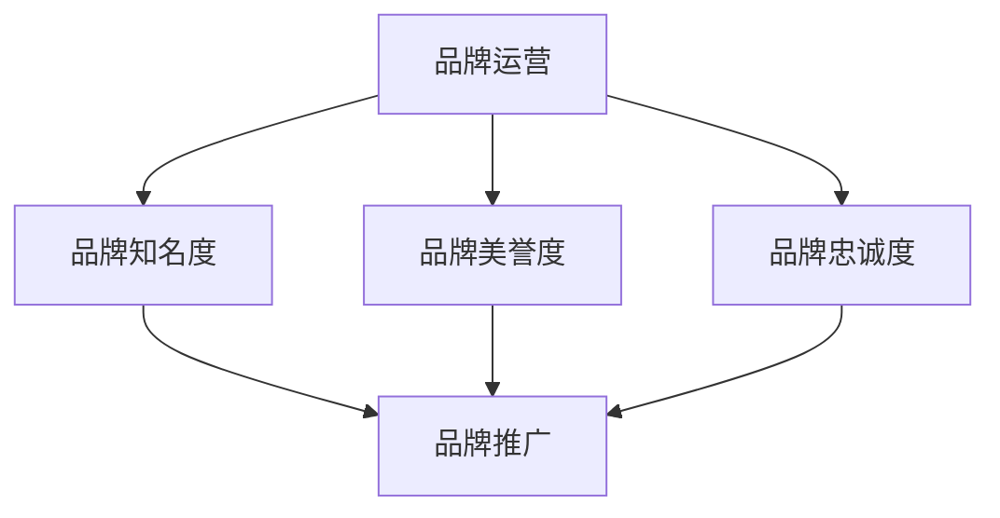

                 

# 知识付费赚钱的品牌运营与品牌推广策略

## 关键词：知识付费、品牌运营、品牌推广、策略

> 摘要：本文深入探讨了知识付费市场中的品牌运营与品牌推广策略。首先介绍了知识付费的背景和发展趋势，然后分析了品牌运营和品牌推广的基本概念和重要性。接着，本文提出了具体的品牌运营策略和品牌推广方法，并针对不同类型的知识产品给出了相应的推广策略。最后，文章总结了当前知识付费市场面临的挑战和未来发展的机遇，为读者提供了实用的指导意见。

## 1. 背景介绍

### 1.1 知识付费的起源与发展

知识付费，是指用户为获取知识服务而支付的费用。这一概念源于互联网的发展，特别是移动互联网的普及。在早期，互联网上的知识主要来源于公共领域，如维基百科、开源教程等，用户无需付费即可获取。然而，随着互联网内容日益泛滥，用户对高质量、专业化知识的渴望日益增长。知识付费因此应运而生。

知识付费的发展可以追溯到2010年代初期，当时知乎、分答等平台率先尝试知识付费模式。随后，得到APP、喜马拉雅等平台迅速崛起，为用户提供了丰富多样的知识服务，如音频课程、直播讲座、专业问答等。知识付费逐渐成为互联网行业的重要趋势。

### 1.2 知识付费市场的现状与趋势

近年来，知识付费市场呈现出爆发式增长。根据相关报告，全球知识付费市场规模已超过千亿元，并仍保持着较高的增长率。以下是一些关键数据：

- **用户规模**：知识付费用户群体不断扩大，覆盖了各个年龄层和职业领域。特别是职场人士、学生和家庭主妇等群体，对知识付费的接受度较高。
- **产品形态**：知识付费产品种类丰富，包括音频、视频、图文、直播等多种形式。其中，音频课程和视频课程最受欢迎。
- **付费习惯**：用户逐渐形成了定期付费的习惯，每月订阅、季度订阅等模式逐渐流行。

### 1.3 知识付费对品牌运营的影响

知识付费对品牌运营产生了深远的影响。首先，知识付费为品牌提供了新的商业模式，使得品牌可以通过知识服务实现盈利。其次，知识付费有助于提升品牌的知名度和美誉度，增强用户对品牌的信任和忠诚度。此外，知识付费还可以为品牌带来大量用户数据，为后续的品牌营销和产品优化提供有力支持。

## 2. 核心概念与联系

### 2.1 品牌运营的基本概念

品牌运营是指通过一系列策略和手段，提升品牌知名度、美誉度和忠诚度，进而实现品牌价值的最大化。品牌运营的核心目标包括：

- 提高品牌知名度：通过广告、营销活动等方式，让更多的潜在用户了解和记住品牌。
- 增强品牌美誉度：通过优质的产品和服务，赢得用户的良好口碑，提升品牌形象。
- 提高品牌忠诚度：通过持续的用户互动和服务，培养用户的品牌忠诚度，降低用户流失率。

### 2.2 品牌推广的基本概念

品牌推广是指通过一系列推广活动，将品牌信息传递给目标受众，提高品牌知名度和影响力。品牌推广的核心手段包括：

- 广告投放：通过电视、网络、户外等渠道进行广告投放，扩大品牌曝光度。
- 公关活动：通过新闻发布会、行业论坛、赞助活动等方式，提升品牌形象和知名度。
- 社交媒体营销：利用微博、微信、抖音等社交媒体平台，进行内容营销和用户互动，增强品牌影响力。
- 线下活动：通过线下讲座、沙龙、展会等活动，与用户面对面交流，提升品牌认知和忠诚度。

### 2.3 品牌运营与品牌推广的联系

品牌运营和品牌推广密不可分。品牌运营为品牌推广提供了基础，通过提升品牌知名度、美誉度和忠诚度，为品牌推广创造了有利条件。而品牌推广则通过具体的推广活动，将品牌运营的效果转化为实际的市场反馈，进一步推动品牌价值的提升。

### 2.4 Mermaid 流程图

下面是一个简化的品牌运营与品牌推广的 Mermaid 流程图：



## 3. 核心算法原理 & 具体操作步骤

### 3.1 品牌运营策略

#### 3.1.1 明确品牌定位

品牌定位是品牌运营的首要任务。品牌定位明确了品牌在市场中的地位和目标受众，为后续的品牌运营提供了方向。具体操作步骤如下：

1. 分析市场：了解目标市场的竞争格局、用户需求和消费习惯。
2. 确定品牌差异化优势：分析自身产品或服务的独特卖点，形成差异化竞争优势。
3. 制定品牌定位：将差异化优势与目标市场相结合，明确品牌的核心价值主张。

#### 3.1.2 构建品牌形象

品牌形象是品牌运营的重要组成部分。品牌形象包括视觉元素、品牌口号、品牌故事等，它们共同构成了品牌的个性特征。具体操作步骤如下：

1. 设计视觉元素：包括品牌标志、色彩、字体等，确保视觉元素的一致性和识别度。
2. 确定品牌口号：品牌口号应简洁明了，突出品牌核心价值主张，便于传播。
3. 创作品牌故事：通过故事化的方式，讲述品牌的起源、发展历程和愿景，增强品牌的情感共鸣。

### 3.2 品牌推广方法

#### 3.2.1 内容营销

内容营销是品牌推广的重要手段之一。通过优质的内容，吸引目标受众，提升品牌知名度和美誉度。具体操作步骤如下：

1. 确定内容主题：围绕品牌定位和用户需求，确定内容主题和方向。
2. 创作优质内容：包括文章、视频、图片、音频等多种形式，确保内容的专业性和趣味性。
3. 发布和传播内容：在各大平台发布内容，通过社交媒体、邮件等方式传播，扩大内容影响力。

#### 3.2.2 社交媒体营销

社交媒体营销是品牌推广的另一种有效手段。通过社交媒体平台，与用户进行互动，提升品牌知名度和忠诚度。具体操作步骤如下：

1. 选择合适平台：根据品牌定位和用户特点，选择合适的社交媒体平台，如微博、微信、抖音等。
2. 制定社交媒体策略：包括内容发布计划、互动策略等，确保社交媒体营销的有效性。
3. 管理社交媒体账号：定期发布内容，与用户互动，回应用户评论和私信，提升用户满意度。

### 3.3 品牌推广策略

#### 3.3.1 线上推广策略

线上推广主要包括搜索引擎优化（SEO）、搜索引擎营销（SEM）、内容营销等。具体操作步骤如下：

1. **SEO**：优化网站结构、内容、关键词等，提高在搜索引擎中的排名，吸引更多流量。
2. **SEM**：通过付费广告，在搜索引擎结果页（SERP）上展示广告，提高品牌曝光度。
3. **内容营销**：创作优质内容，吸引目标受众，提升品牌知名度和美誉度。

#### 3.3.2 线下推广策略

线下推广主要包括活动营销、公关活动、广告投放等。具体操作步骤如下：

1. **活动营销**：举办线上线下活动，如讲座、研讨会、展览等，与用户面对面交流，提升品牌认知和忠诚度。
2. **公关活动**：通过新闻发布会、媒体采访、行业论坛等方式，提升品牌形象和知名度。
3. **广告投放**：在报纸、杂志、电视、户外等渠道进行广告投放，扩大品牌曝光度。

### 3.4 营销自动化工具

营销自动化工具可以帮助品牌运营和品牌推广更加高效。具体操作步骤如下：

1. **客户关系管理（CRM）系统**：通过CRM系统，管理客户信息、销售机会、营销活动等，提升客户满意度。
2. **营销自动化平台**：利用营销自动化平台，自动化执行营销任务，如邮件营销、社交媒体发布、广告投放等。
3. **数据分析工具**：通过数据分析工具，分析用户行为、市场趋势等，优化营销策略和推广效果。

### 3.5 品牌运营与品牌推广的持续优化

品牌运营和品牌推广不是一成不变的，而是需要不断调整和优化的。具体操作步骤如下：

1. **定期评估**：定期评估品牌运营和品牌推广的效果，识别问题并及时调整策略。
2. **用户反馈**：收集用户反馈，了解用户需求和期望，优化产品和服务。
3. **行业动态**：关注行业动态，及时调整品牌定位和品牌推广策略，适应市场变化。

## 4. 数学模型和公式 & 详细讲解 & 举例说明

### 4.1 用户留存率模型

用户留存率是衡量品牌运营效果的重要指标。假设有n个用户在时间t内使用过知识付费产品，其中留存用户数为x，则用户留存率r可以用以下公式计算：

\[ r = \frac{x}{n} \]

举例：假设有100个用户在一个月内使用过知识付费产品，其中80个用户在一个月后仍在使用，则用户留存率为80%。

### 4.2 用户流失率模型

用户流失率与用户留存率密切相关。假设在时间t内，有m个用户流失，则用户流失率l可以用以下公式计算：

\[ l = \frac{m}{n} \]

举例：假设在一个月内，有100个用户开始使用知识付费产品，其中20个用户在一个月后流失，则用户流失率为20%。

### 4.3 营销转化率模型

营销转化率是衡量品牌推广效果的重要指标。假设在营销活动中，有p个潜在用户参与，其中转化为实际购买的用户数为q，则营销转化率t可以用以下公式计算：

\[ t = \frac{q}{p} \]

举例：假设在一场线上活动中，有1000个潜在用户参与，其中200个用户最终购买了知识付费产品，则营销转化率为20%。

### 4.4 品牌知名度提升模型

品牌知名度提升模型可以用以下公式表示：

\[ 品牌知名度 = 品牌曝光度 \times 用户关注度 \]

其中，品牌曝光度可以表示为：

\[ 品牌曝光度 = 广告投放次数 \times 广告投放效果 \]

用户关注度可以表示为：

\[ 用户关注度 = 品牌口碑 \times 用户兴趣 \]

举例：假设一个品牌在一个月内进行了100次广告投放，每次投放效果为10%，品牌口碑为80%，用户兴趣为70%，则该品牌的品牌知名度为：

\[ 品牌知名度 = 100 \times 10\% \times 80\% \times 70\% = 56\% \]

## 5. 项目实战：代码实际案例和详细解释说明

### 5.1 开发环境搭建

在本节中，我们将搭建一个简单的知识付费平台，用于品牌运营与品牌推广。以下是开发环境搭建的步骤：

1. **选择开发语言**：Python，因为Python具有简洁易懂的语法和强大的第三方库支持。
2. **安装Python环境**：在本地计算机上安装Python环境，版本要求3.8及以上。
3. **安装第三方库**：使用pip命令安装必要的第三方库，如Flask、MySQL等。

```bash
pip install flask pymysql
```

### 5.2 源代码详细实现和代码解读

下面是一个简单的知识付费平台的核心代码实现：

```python
# 导入所需库
from flask import Flask, request, jsonify
import pymysql

# 初始化Flask应用
app = Flask(__name__)

# 连接MySQL数据库
db = pymysql.connect(host='localhost', user='root', password='password', database='knowledge')

# 创建用户
@app.route('/create_user', methods=['POST'])
def create_user():
    username = request.json['username']
    password = request.json['password']
    # 插入用户数据到数据库
    with db.cursor() as cursor:
        sql = "INSERT INTO users (username, password) VALUES (%s, %s)"
        cursor.execute(sql, (username, password))
    db.commit()
    return jsonify({"status": "success", "message": "用户创建成功"})

# 登录用户
@app.route('/login', methods=['POST'])
def login():
    username = request.json['username']
    password = request.json['password']
    # 验证用户登录
    with db.cursor() as cursor:
        sql = "SELECT * FROM users WHERE username = %s AND password = %s"
        cursor.execute(sql, (username, password))
        user = cursor.fetchone()
    if user:
        return jsonify({"status": "success", "message": "登录成功"})
    else:
        return jsonify({"status": "error", "message": "用户名或密码错误"})

# 查询用户购买记录
@app.route('/orders', methods=['GET'])
def get_orders():
    username = request.args.get('username')
    # 从数据库查询用户购买记录
    with db.cursor() as cursor:
        sql = "SELECT * FROM orders WHERE username = %s"
        cursor.execute(sql, (username,))
        orders = cursor.fetchall()
    return jsonify({"status": "success", "orders": orders})

# 运行Flask应用
if __name__ == '__main__':
    app.run(debug=True)
```

#### 5.2.1 代码解读与分析

1. **导入库**：首先，导入Flask库和MySQL库，用于搭建Web应用和连接数据库。
2. **初始化Flask应用**：使用Flask库创建一个Web应用实例。
3. **连接MySQL数据库**：使用pymysql库连接本地MySQL数据库。
4. **创建用户**：定义一个POST请求的API接口，用于创建用户。用户数据插入到数据库的users表。
5. **登录用户**：定义一个POST请求的API接口，用于验证用户登录。用户信息从数据库的users表中查询。
6. **查询用户购买记录**：定义一个GET请求的API接口，用于查询用户购买记录。购买记录从数据库的orders表中查询。
7. **运行Flask应用**：在if __name__ == '__main__':语句块中，启动Flask应用，开启调试模式。

### 5.3 代码解读与分析

1. **用户注册**：在`/create_user`接口中，接收用户提交的注册信息（用户名和密码），将数据插入到数据库的users表中。
2. **用户登录**：在`/login`接口中，接收用户提交的登录信息（用户名和密码），从数据库的users表中查询用户信息，验证登录成功。
3. **查询购买记录**：在`/orders`接口中，接收用户提交的用户名，从数据库的orders表中查询该用户的购买记录，返回给用户。

通过这个简单的知识付费平台，我们可以看到品牌运营和品牌推广的代码实现。在实际应用中，还可以加入更多的功能，如课程购买、课程评价、用户反馈等，进一步提升用户体验和品牌价值。

## 6. 实际应用场景

### 6.1 品牌运营在知识付费平台中的应用

知识付费平台作为知识服务的重要载体，品牌运营在其中发挥着关键作用。以下是一些实际应用场景：

1. **课程定位**：平台需要对课程进行精准定位，明确课程的目标受众和课程内容，以吸引更多的用户。
2. **课程推广**：平台可以通过内容营销、社交媒体营销等手段，推广课程，提升课程知名度。
3. **用户互动**：平台可以通过线上讲座、答疑直播等方式，与用户互动，增强用户粘性。
4. **品牌塑造**：平台需要通过优质的服务和课程内容，塑造良好的品牌形象，赢得用户的信任和忠诚。

### 6.2 品牌推广在知识付费平台中的应用

知识付费平台在品牌推广方面也有许多实际应用场景：

1. **广告投放**：平台可以在各大搜索引擎、社交媒体、新闻网站等渠道进行广告投放，扩大品牌知名度。
2. **公关活动**：平台可以参加行业论坛、展会等活动，提升品牌形象和知名度。
3. **内容营销**：平台可以创作优质内容，如课程笔记、专家观点等，吸引目标用户，提升品牌影响力。
4. **用户口碑**：平台可以通过用户评价、推荐等方式，提升品牌口碑，增强用户信任。

### 6.3 品牌运营与品牌推广的协同效应

在知识付费平台中，品牌运营和品牌推广并不是孤立的，而是相互促进、协同发展的。通过有效的品牌运营，平台可以提升用户满意度和忠诚度，为品牌推广创造有利条件。而通过有效的品牌推广，平台可以吸引更多用户，提升品牌知名度，进一步推动品牌运营。

## 7. 工具和资源推荐

### 7.1 学习资源推荐

1. **书籍**：
   - 《打造影响力：品牌传播与公关技巧》
   - 《内容营销实战手册》
   - 《品牌营销策略：从0到1打造超级品牌》

2. **论文**：
   - “知识付费市场的发展趋势及品牌运营策略研究”
   - “基于大数据的品牌推广策略研究”
   - “社交媒体在品牌推广中的应用研究”

3. **博客**：
   - 掘金（https://juejin.cn/）
   - 知乎（https://www.zhihu.com/）
   - 锤子科技博客（https://blog.smartisan.com/）

4. **网站**：
   - 新榜（http://www.newrank.cn/）
   - 艺龙网（http://www.elong.com/）
   - 腾讯企鹅媒体平台（https://mp.qq.com/）

### 7.2 开发工具框架推荐

1. **内容管理系统（CMS）**：
   - WordPress
   - Joomla
   - Drupal

2. **前端框架**：
   - React
   - Angular
   - Vue.js

3. **后端框架**：
   - Django
   - Flask
   - Spring Boot

4. **数据库**：
   - MySQL
   - MongoDB
   - PostgreSQL

5. **版本控制系统**：
   - Git
   - SVN

### 7.3 相关论文著作推荐

1. **《数字营销与品牌管理》**：作者：张志宏
   - 本书系统地介绍了数字营销与品牌管理的基本理论、方法和应用，包括搜索引擎优化、社交媒体营销、内容营销等。

2. **《品牌传播与影响力管理》**：作者：李东阳
   - 本书深入分析了品牌传播的原理和方法，以及如何通过有效的传播策略提升品牌影响力。

3. **《大数据营销：策略、方法与实践》**：作者：陈刚
   - 本书详细介绍了大数据营销的理论、方法和实践，包括数据挖掘、用户画像、精准营销等。

## 8. 总结：未来发展趋势与挑战

### 8.1 未来发展趋势

1. **知识付费市场的进一步扩展**：随着人们对高质量知识的需求不断增长，知识付费市场将继续保持高速增长，特别是在专业领域和垂直行业。
2. **品牌运营与品牌推广的数字化**：随着大数据、人工智能等技术的不断发展，品牌运营与品牌推广将更加依赖于数字化工具和平台，实现精准营销和高效推广。
3. **用户参与与互动的深化**：品牌将更加注重用户的参与和互动，通过线上线下的活动，增强用户粘性和忠诚度。

### 8.2 当前挑战

1. **市场竞争加剧**：随着知识付费市场的不断扩大，市场竞争将愈发激烈，品牌需要不断创新和提升核心竞争力。
2. **用户信任的建立**：品牌需要通过优质的产品和服务，赢得用户的信任，提升品牌美誉度。
3. **数据安全和隐私保护**：随着大数据的应用，数据安全和隐私保护成为品牌运营和品牌推广的重要挑战。

### 8.3 应对策略

1. **创新与差异化**：品牌应不断创新，提供差异化的知识产品和服务，以吸引和留住用户。
2. **用户导向**：品牌应深入了解用户需求，提供个性化的知识和服务，提升用户体验。
3. **合规与安全**：品牌应严格遵守相关法律法规，保护用户数据安全和隐私，树立良好的品牌形象。

## 9. 附录：常见问题与解答

### 9.1 什么是知识付费？

知识付费是指用户为获取知识服务而支付的费用。随着互联网的发展，用户对高质量、专业化知识的渴望日益增长，知识付费应运而生。

### 9.2 知识付费市场的前景如何？

知识付费市场前景广阔。根据相关报告，全球知识付费市场规模已超过千亿元，并仍保持着较高的增长率。预计未来几年，知识付费市场将继续保持高速增长。

### 9.3 如何进行品牌运营和品牌推广？

品牌运营和品牌推广包括以下几个关键步骤：

1. **明确品牌定位**：分析市场，确定品牌的差异化竞争优势，明确品牌的核心价值主张。
2. **构建品牌形象**：设计品牌视觉元素、品牌口号、品牌故事等，确保品牌的一致性和识别度。
3. **制定品牌推广策略**：通过内容营销、社交媒体营销、广告投放等方式，提升品牌知名度和影响力。
4. **持续优化和调整**：定期评估品牌运营和品牌推广的效果，及时调整策略，以适应市场变化。

### 9.4 品牌运营和品牌推广有哪些工具和资源可以参考？

品牌运营和品牌推广可以参考以下工具和资源：

1. **学习资源**：相关书籍、论文、博客和网站，如《打造影响力：品牌传播与公关技巧》、《内容营销实战手册》等。
2. **开发工具框架**：如内容管理系统（CMS）、前端框架、后端框架、数据库、版本控制系统等。
3. **相关论文著作**：如《数字营销与品牌管理》、《品牌传播与影响力管理》、《大数据营销：策略、方法与实践》等。

## 10. 扩展阅读 & 参考资料

### 10.1 扩展阅读

1. “知识付费市场分析报告”
2. “品牌运营与品牌推广：策略与实践”
3. “社交媒体营销：理论、方法与实践”

### 10.2 参考资料

1. “中国互联网发展报告”
2. “2022年知识付费行业报告”
3. “市场营销学：理论与实践”

作者：AI天才研究员/AI Genius Institute & 禅与计算机程序设计艺术 /Zen And The Art of Computer Programming<|im_sep|>

