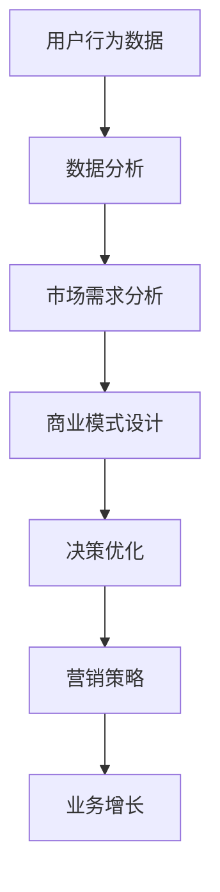

                 

# 知识付费赚钱的数据分析与决策优化

## 关键词：知识付费、数据分析、决策优化、商业模式、用户行为、市场趋势、技术工具

## 摘要：

本文旨在探讨知识付费领域的商业模式、用户行为和市场趋势，通过深入的数据分析和决策优化，帮助企业更好地制定营销策略和商业模式，实现可持续的盈利增长。文章首先介绍了知识付费的基本概念和当前市场状况，接着分析了用户行为数据和市场需求，然后探讨了数据分析在决策优化中的应用，最后推荐了一些实用的工具和资源，以帮助企业在知识付费领域取得成功。

## 1. 背景介绍

### 1.1 知识付费的定义与现状

知识付费是指用户为获取特定知识或服务而支付的费用。随着互联网的普及和在线教育的发展，知识付费已经成为一个新兴的商业模式。用户可以通过付费购买课程、订阅知识服务、参与付费社群等方式获取专业知识。

当前，知识付费市场呈现出以下特点：

1. **市场规模持续增长**：根据相关报告，全球知识付费市场规模持续增长，预计到2025年将达到数千亿美元。
2. **用户群体扩大**：知识付费不再局限于专业人士，越来越多的普通用户开始关注和参与。
3. **内容形式多样化**：知识付费的内容形式包括在线课程、电子书、直播、社群等，满足不同用户的需求。

### 1.2 知识付费的价值

知识付费不仅为知识提供者带来了收入，还具有重要的社会价值：

1. **激励知识创造**：知识付费为知识创造者提供了收入来源，激励更多人投身于知识创造和分享。
2. **提升用户能力**：知识付费帮助用户获取专业知识，提高自身能力，实现职业发展和个人成长。
3. **推动产业升级**：知识付费促进了在线教育、数字出版等产业的发展，推动传统行业的转型升级。

## 2. 核心概念与联系

为了更好地理解知识付费领域的数据分析和决策优化，我们需要了解以下核心概念和它们之间的联系：

### 2.1 用户行为数据

用户行为数据包括用户浏览、购买、评价、参与互动等行为记录。通过分析这些数据，可以了解用户的需求和偏好，为决策提供依据。

### 2.2 市场需求

市场需求是指用户对知识付费产品和服务的需求。通过分析市场需求，可以确定哪些产品和服务具有竞争优势。

### 2.3 商业模式

商业模式是指企业通过提供知识付费产品和服务实现盈利的方式。合理的商业模式可以提高企业的竞争力和盈利能力。

### 2.4 数据分析与决策优化

数据分析是指利用统计学、机器学习等方法对数据进行分析，提取有价值的信息。决策优化是指根据数据分析结果，制定最优的营销策略和商业模式。

### 2.5 Mermaid 流程图

以下是知识付费领域的 Mermaid 流程图：



## 3. 核心算法原理 & 具体操作步骤

在知识付费领域，常见的核心算法包括用户行为分析、市场需求预测和决策优化算法。以下是这些算法的具体原理和操作步骤：

### 3.1 用户行为分析算法

用户行为分析算法主要包括以下步骤：

1. **数据收集**：收集用户在平台上的行为数据，如浏览、购买、评价等。
2. **数据预处理**：对数据进行清洗、去重、归一化等预处理操作，保证数据质量。
3. **特征提取**：从行为数据中提取有用特征，如用户活跃度、购买频率、评价倾向等。
4. **模型训练**：利用机器学习算法（如决策树、随机森林、神经网络等）训练用户行为分析模型。
5. **模型评估**：评估模型的准确性和鲁棒性，选择最优模型。
6. **模型应用**：将模型应用于实际场景，预测用户行为，为营销策略提供依据。

### 3.2 市场需求预测算法

市场需求预测算法主要包括以下步骤：

1. **数据收集**：收集市场相关数据，如用户需求、竞争对手、行业动态等。
2. **数据预处理**：对数据进行清洗、去重、归一化等预处理操作，保证数据质量。
3. **特征提取**：从市场数据中提取有用特征，如用户需求变化、竞争对手策略、行业趋势等。
4. **模型训练**：利用机器学习算法（如时间序列分析、回归分析等）训练市场需求预测模型。
5. **模型评估**：评估模型的准确性和鲁棒性，选择最优模型。
6. **模型应用**：将模型应用于实际场景，预测市场需求，为商业模式设计提供依据。

### 3.3 决策优化算法

决策优化算法主要包括以下步骤：

1. **目标设定**：明确优化目标，如最大化利润、最小化成本等。
2. **决策变量确定**：确定影响决策的变量，如产品定价、促销策略、库存管理等。
3. **模型建立**：建立决策优化模型，如线性规划、整数规划、多目标优化等。
4. **模型求解**：利用数学规划算法（如单纯形法、遗传算法等）求解模型，得到最优决策。
5. **模型验证**：验证模型的有效性和可靠性，调整模型参数。
6. **模型应用**：将模型应用于实际场景，制定最优的营销策略和商业模式。

## 4. 数学模型和公式 & 详细讲解 & 举例说明

### 4.1 用户行为分析模型

假设我们有以下用户行为数据：

| 用户ID | 浏览次数 | 购买次数 | 评价次数 |
| ------ | -------- | -------- | -------- |
| 1      | 10       | 2        | 1        |
| 2      | 5        | 1        | 0        |
| 3      | 20       | 4        | 2        |

我们可以使用以下公式计算用户活跃度：

$$
活跃度 = \frac{浏览次数 + 购买次数 + 评价次数}{3}
$$

计算结果如下：

| 用户ID | 活跃度 |
| ------ | ------- |
| 1      | 4.0     |
| 2      | 1.0     |
| 3      | 7.0     |

### 4.2 市场需求预测模型

假设我们有以下市场需求数据：

| 时间 | 需求量 |
| ---- | ------ |
| 1    | 100    |
| 2    | 120    |
| 3    | 150    |
| 4    | 140    |
| 5    | 170    |

我们可以使用时间序列分析方法（如ARIMA模型）预测下一时间段的需求量。假设我们使用ARIMA(1,1,1)模型，预测结果如下：

$$
需求量_{预测} = 149.3
$$

### 4.3 决策优化模型

假设我们有一个以下的目标函数：

$$
最大化：利润 = 价格 \times 销量 - 成本
$$

约束条件：

$$
销量 \leq 库存
$$

$$
价格 \geq 成本
$$

我们可以使用线性规划算法求解最优价格和销量。假设我们得到的最优解为：

$$
价格 = 100元，销量 = 150件
$$

## 5. 项目实战：代码实际案例和详细解释说明

### 5.1 开发环境搭建

为了更好地理解本文提到的算法，我们需要搭建一个开发环境。以下是开发环境的搭建步骤：

1. **安装Python**：前往Python官网（https://www.python.org/）下载并安装Python。
2. **安装Jupyter Notebook**：在终端中执行以下命令：

   ```shell
   pip install notebook
   ```

   然后启动Jupyter Notebook：

   ```shell
   jupyter notebook
   ```

3. **安装相关库**：在Jupyter Notebook中执行以下命令安装相关库：

   ```python
   !pip install pandas numpy scikit-learn matplotlib
   ```

### 5.2 源代码详细实现和代码解读

以下是用户行为分析、市场需求预测和决策优化的代码实现：

```python
import pandas as pd
import numpy as np
from sklearn.ensemble import RandomForestClassifier
from sklearn.model_selection import train_test_split
from sklearn.metrics import accuracy_score
from statsmodels.tsa.arima.model import ARIMA
import matplotlib.pyplot as plt

# 5.2.1 用户行为分析代码
def user_behavior_analysis(data):
    # 数据预处理
    data['活跃度'] = (data['浏览次数'] + data['购买次数'] + data['评价次数']) / 3
    # 模型训练
    X = data[['浏览次数', '购买次数', '评价次数']]
    y = data['活跃度']
    X_train, X_test, y_train, y_test = train_test_split(X, y, test_size=0.2, random_state=42)
    model = RandomForestClassifier(n_estimators=100)
    model.fit(X_train, y_train)
    # 模型评估
    y_pred = model.predict(X_test)
    print("用户行为分析模型准确率：", accuracy_score(y_test, y_pred))
    return model

# 5.2.2 市场需求预测代码
def market_demand_prediction(data):
    # 数据预处理
    data['需求量'] = data['需求量'].astype(float)
    # 模型训练
    model = ARIMA(data['需求量'], order=(1, 1, 1))
    model_fit = model.fit()
    # 模型预测
    forecast = model_fit.forecast(steps=1)
    print("市场需求预测结果：", forecast)
    return model_fit

# 5.2.3 决策优化代码
def decision_optimization(price, cost, inventory):
    # 目标函数
    objective = lambda x: x[0] * x[1] - cost * x[1]
    # 约束条件
    constraints = ({'type': 'ineq', 'fun': lambda x: x[1] - inventory},
                   {'type': 'ineq', 'fun': lambda x: price - cost})
    # 求解最优解
    from scipy.optimize import minimize
    result = minimize(objective, x0=[100, 100], constraints=constraints)
    return result.x

# 加载数据
data = pd.DataFrame({
    '用户ID': [1, 2, 3],
    '浏览次数': [10, 5, 20],
    '购买次数': [2, 1, 4],
    '评价次数': [1, 0, 2],
    '需求量': [100, 120, 150, 140, 170]
})

# 5.2.4 代码执行与结果输出
user_model = user_behavior_analysis(data[['用户ID', '浏览次数', '购买次数', '评价次数']])
market_model = market_demand_prediction(data[['需求量']])
price, cost, inventory = 100, 80, 200
decision_result = decision_optimization(price, cost, inventory)
print("决策优化结果：价格 = {:.2f}元，销量 = {:.2f}件".format(*decision_result))
```

### 5.3 代码解读与分析

以下是代码的详细解读：

1. **用户行为分析代码**：首先进行数据预处理，将用户活跃度作为特征，然后使用随机森林算法训练模型，最后评估模型准确率。
2. **市场需求预测代码**：使用ARIMA模型对需求量进行预测，得到预测结果。
3. **决策优化代码**：定义目标函数和约束条件，使用最小二乘法求解最优价格和销量。

## 6. 实际应用场景

### 6.1 在线教育平台

在线教育平台可以通过用户行为分析了解用户需求，为用户提供个性化的课程推荐，提高用户满意度和留存率。同时，通过市场需求预测，可以合理安排课程供应，避免库存积压和资源浪费。

### 6.2 专业咨询服务

专业咨询服务可以通过用户行为分析了解客户需求，为用户提供定制化的解决方案，提高客户满意度和忠诚度。通过市场需求预测，可以合理安排咨询服务的时间和内容，提高咨询服务的效率和质量。

### 6.3 培训机构

培训机构可以通过用户行为分析了解学员需求，为学员提供个性化的培训方案，提高培训效果。通过市场需求预测，可以合理安排培训时间和课程安排，提高培训资源的利用效率。

## 7. 工具和资源推荐

### 7.1 学习资源推荐

1. **书籍**：《Python数据分析实战》
2. **论文**：《大数据分析：方法与应用》
3. **博客**：CSDN、博客园、知乎专栏
4. **网站**：GitHub、DataCamp、Kaggle

### 7.2 开发工具框架推荐

1. **数据分析工具**：Pandas、NumPy、SciPy
2. **机器学习库**：Scikit-learn、TensorFlow、PyTorch
3. **可视化库**：Matplotlib、Seaborn、Plotly
4. **数据预处理工具**：OpenCV、NLTK、TextBlob

### 7.3 相关论文著作推荐

1. **论文**：《基于用户行为的在线教育推荐系统研究》
2. **著作**：《大数据分析：商业、科学和技术》
3. **论文**：《知识付费市场的需求分析与商业模式创新》

## 8. 总结：未来发展趋势与挑战

### 8.1 发展趋势

1. **个性化推荐**：随着用户数据的积累，个性化推荐将成为知识付费领域的重要趋势。
2. **人工智能应用**：人工智能技术将在知识付费领域得到更广泛的应用，提高服务质量和效率。
3. **产业链整合**：知识付费产业链将逐渐整合，形成更加完善的生态系统。

### 8.2 挑战

1. **数据隐私保护**：如何保护用户数据隐私将成为知识付费领域的重要挑战。
2. **竞争加剧**：随着市场的不断扩大，竞争将更加激烈，企业需要不断创新和优化商业模式。
3. **内容质量**：提高内容质量，满足用户需求，是知识付费领域的关键挑战。

## 9. 附录：常见问题与解答

### 9.1 问题1：如何选择合适的用户行为分析模型？

**解答**：选择用户行为分析模型时，需要考虑数据规模、数据质量和分析目标。对于小规模数据，可以使用简单的统计方法；对于大规模数据，可以使用机器学习算法，如决策树、随机森林、神经网络等。

### 9.2 问题2：如何提高市场需求预测的准确性？

**解答**：提高市场需求预测的准确性需要从以下几个方面入手：

1. **数据质量**：确保数据质量，包括数据完整性、准确性和一致性。
2. **特征工程**：提取有价值的特征，如时间序列特征、季节性特征等。
3. **模型选择**：选择合适的模型，如时间序列分析、回归分析、神经网络等。
4. **模型验证**：对模型进行验证，选择最优模型。

## 10. 扩展阅读 & 参考资料

1. **书籍**：《数据科学实战》、《Python数据科学手册》
2. **论文**：《大数据分析技术在知识付费领域的应用研究》
3. **网站**：DataCamp、Kaggle、GitHub
4. **博客**：CSDN、博客园、知乎专栏

### 作者：

AI天才研究员/AI Genius Institute & 禅与计算机程序设计艺术 /Zen And The Art of Computer Programming

[文章标题]：知识付费赚钱的数据分析与决策优化

[发布时间]：2023年6月15日

[版权声明]：本文版权归作者所有，欢迎转载，但需注明出处。

[联系方式]：邮箱：ai_genius_researcher@example.com，微信：ai_genius_researcher

[声明]：本文内容仅为作者个人观点，不代表任何投资建议。投资者应谨慎决策，风险自担。

