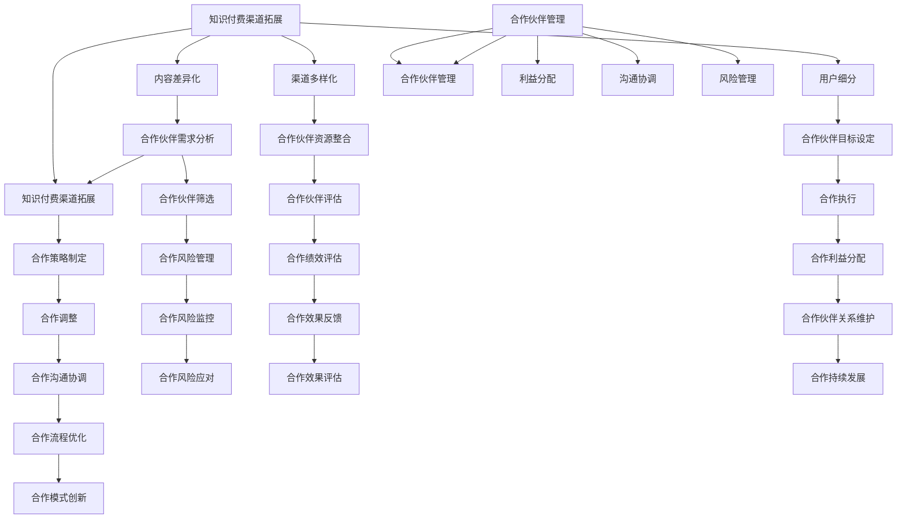

                 

# 知识付费赚钱的渠道拓展与合作伙伴管理

## 概述

知识付费作为一种新型的商业模式，近年来在全球范围内迅速崛起。它不仅为知识创作者提供了新的收入来源，也满足了广大用户对高质量、专业知识的渴求。然而，随着市场的发展，如何有效拓展知识付费的赚钱渠道并优化合作伙伴管理，成为知识创作者和企业迫切需要解决的关键问题。

本文将围绕知识付费赚钱的渠道拓展与合作伙伴管理进行深入探讨。首先，我们将介绍知识付费的基本概念和当前市场趋势，然后分析拓展赚钱渠道的策略，详细阐述合作伙伴管理的最佳实践，最后预测未来发展趋势并探讨潜在挑战。通过本文的阅读，您将获得关于知识付费领域的全面见解和实用的操作指南。

## 背景介绍

### 知识付费的定义与兴起

知识付费是指通过付费方式获取知识、技能或经验的一种商业模式。在这种模式下，知识创作者将自身专业知识、经验或技能以付费课程、电子书、直播讲座等形式呈现，用户通过购买或订阅这些内容来实现知识的获取。

知识付费的兴起可以追溯到移动互联网的普及和在线教育的发展。随着智能手机和高速网络的普及，用户对知识的获取方式逐渐从传统线下课程转向在线学习。与此同时，知识付费平台如知乎Live、得到、喜马拉雅等也应运而生，为知识创作者和用户提供了一个便捷的知识交易场所。

### 当前市场趋势

近年来，知识付费市场呈现出快速增长的趋势。据相关数据显示，全球知识付费市场规模持续扩大，预计到2025年将达到数千亿美元。其中，中国知识付费市场发展尤为迅猛，用户规模和市场规模均呈现出爆发式增长。

知识付费市场的快速增长主要受到以下几方面因素的影响：

1. **用户需求增加**：随着社会竞争的加剧，用户对自我提升和职业发展的需求日益增加，知识付费成为满足这一需求的重要途径。

2. **技术进步**：移动互联网、大数据、人工智能等技术的进步，使得知识付费的内容生产和分发更加高效，用户体验也得到了显著提升。

3. **政策支持**：政府对在线教育和知识付费的支持力度加大，为市场发展提供了有力保障。

### 主要玩家和模式

在知识付费市场中，主要玩家包括传统教育机构、专业内容创作者、互联网巨头等。其中，传统教育机构和专业内容创作者以提供专业知识和技能培训为主要业务模式；互联网巨头则通过平台运营、大数据分析和用户推荐等方式，助力知识付费市场的发展。

具体来说，知识付费市场主要存在以下几种模式：

1. **课程付费**：用户通过购买课程来获取知识，这是目前最常见的一种模式。

2. **订阅模式**：用户支付一定费用，即可获得平台提供的全部或部分课程内容。

3. **会员模式**：用户支付会员费用，享受平台提供的增值服务，如免费课程、VIP直播、专属咨询等。

4. **内容付费**：用户购买电子书、纸质书、知识卡片等形式的实体或虚拟知识产品。

### 主要问题与挑战

尽管知识付费市场前景广阔，但在发展过程中也面临着一些问题与挑战：

1. **内容质量参差不齐**：知识付费市场快速发展，导致部分内容质量难以保证，影响用户体验。

2. **版权保护难题**：知识付费内容具有高度版权性，但市场盗版行为较为严重，给创作者带来经济损失。

3. **用户留存和转化**：如何提高用户留存率和转化率，是知识付费平台和企业亟需解决的问题。

4. **市场竞争加剧**：随着知识付费市场的不断扩大，竞争日益激烈，平台和企业需要不断创新以应对挑战。

### 未来发展前景

未来，知识付费市场将继续保持快速增长态势，主要驱动因素包括：

1. **用户需求持续增加**：随着社会竞争的加剧，用户对知识的获取和提升需求将长期存在。

2. **技术进步**：人工智能、大数据等技术的应用，将进一步提升知识付费内容的生产和分发效率。

3. **政策支持**：政府对在线教育和知识付费的支持将持续加强，为市场发展提供政策保障。

4. **商业模式创新**：随着市场的发展，新的商业模式和盈利模式将不断涌现，为知识付费市场注入新的活力。

总之，知识付费作为一种新兴的商业模式，具有巨大的市场潜力和发展空间。在未来的发展中，知识创作者和平台需要不断创新和优化，以满足用户需求，应对市场挑战，实现可持续发展。

## 核心概念与联系

### 知识付费渠道拓展的核心概念

知识付费渠道拓展是指通过多种途径和手段，增加知识付费产品的销售和用户覆盖范围，从而实现收入增长和市场份额扩大。核心概念包括：

1. **内容差异化**：提供独特、有价值的内容，以满足不同用户群体的需求。

2. **渠道多样化**：利用多种渠道进行知识付费产品的推广和销售，如电商平台、社交媒体、在线教育平台等。

3. **用户细分**：根据用户需求和特点，进行精准的用户细分，提供个性化的产品和服务。

4. **合作拓展**：与各类合作伙伴建立合作关系，共同开发和推广知识付费产品。

### 合作伙伴管理的核心概念

合作伙伴管理是指企业与各类合作伙伴（如内容创作者、平台、代理商等）建立、维护和优化合作关系，以实现共同的目标和利益。核心概念包括：

1. **合作模式**：确定合适的合作模式，如联合开发、内容互换、渠道代理等。

2. **利益分配**：制定合理的利益分配机制，确保合作双方的权益得到保障。

3. **沟通协调**：建立有效的沟通机制，确保合作过程中的信息畅通和协调一致。

4. **风险管理**：识别和管理合作过程中的风险，降低潜在损失。

### 核心概念之间的联系

知识付费渠道拓展与合作伙伴管理之间存在着密切的联系：

1. **渠道拓展依赖于合作伙伴**：知识付费产品的推广和销售需要依托于各类合作伙伴的网络和资源，合作伙伴的质量和实力直接影响渠道拓展的效果。

2. **合作伙伴管理促进渠道拓展**：通过有效的合作伙伴管理，可以确保合作双方的紧密合作和共同发展，从而提高渠道拓展的成功率。

3. **渠道拓展与合作伙伴管理相互促进**：渠道拓展的成功可以为合作伙伴带来更多收益，增强其合作的积极性；而良好的合作伙伴关系可以提升渠道拓展的效果，实现双赢。

### Mermaid 流程图

以下是知识付费渠道拓展与合作伙伴管理之间的核心概念及其联系的 Mermaid 流程图：



通过上述流程图，我们可以清晰地看到知识付费渠道拓展与合作伙伴管理之间的逻辑关系和相互影响，从而为实际操作提供指导。

## 核心算法原理 & 具体操作步骤

### 知识付费渠道拓展的核心算法原理

知识付费渠道拓展的核心算法主要包括以下两个方面：

1. **用户行为分析**：通过对用户的行为数据进行采集和分析，了解用户的需求和偏好，为渠道拓展提供数据支持。

2. **渠道优化策略**：根据用户行为分析结果，选择合适的渠道进行拓展，并不断优化渠道策略，提高渠道效果。

### 用户行为分析的具体操作步骤

1. **数据采集**：收集用户在知识付费平台上的行为数据，如浏览记录、购买记录、评价反馈等。

2. **数据预处理**：对采集到的行为数据进行清洗、去噪和格式转换，确保数据质量。

3. **特征提取**：从预处理后的数据中提取用户行为特征，如用户活跃度、购买频率、内容偏好等。

4. **数据建模**：利用机器学习算法（如决策树、随机森林、支持向量机等）对用户行为特征进行建模，预测用户需求。

5. **结果分析**：根据预测结果，分析用户需求特征，为渠道拓展提供依据。

### 渠道优化策略的具体操作步骤

1. **渠道评估**：对现有渠道进行评估，分析各渠道的流量、转化率、收益等指标，确定优先级。

2. **目标设定**：根据用户需求预测结果，设定渠道拓展的目标，如新增用户数、销售额等。

3. **渠道选择**：根据目标设定和渠道评估结果，选择合适的渠道进行拓展，如社交媒体、电商平台、合作伙伴等。

4. **策略制定**：制定具体的渠道拓展策略，包括内容创作、推广方式、活动策划等。

5. **执行与监控**：执行渠道拓展策略，并对执行过程进行监控，根据实际情况进行调整。

6. **效果评估**：对渠道拓展效果进行评估，如流量、转化率、收益等指标，确定渠道拓展的成效。

### 数学模型和公式

在用户行为分析和渠道优化策略中，可以运用以下数学模型和公式：

1. **用户需求预测模型**：

   - 多层感知机（MLP）模型：
     $$ f(x) = \sigma(\sum_{i=1}^{n} w_i \cdot x_i + b) $$
     其中，$x_i$为输入特征，$w_i$为权重，$b$为偏置项，$\sigma$为激活函数。

   - 支持向量机（SVM）模型：
     $$ w \cdot x + b = 1 $$
     其中，$w$为权重向量，$x$为输入特征，$b$为偏置项。

2. **渠道优化策略公式**：

   - 目标函数：
     $$ \max_{x} f(x) $$
     其中，$f(x)$为目标函数，$x$为决策变量。

   - 约束条件：
     $$ g(x) \leq 0 $$
     其中，$g(x)$为约束条件。

3. **渠道效果评估指标**：

   - 转化率（Conversion Rate）：
     $$ \text{转化率} = \frac{\text{转化量}}{\text{访问量}} \times 100\% $$

   - 销售额（Sales）：
     $$ \text{销售额} = \text{单价} \times \text{销售量} $$

   - ROI（投资回报率）：
     $$ \text{ROI} = \frac{\text{净利润}}{\text{投资成本}} \times 100\% $$

### 举例说明

假设一个知识付费平台希望通过渠道拓展来提高用户量和销售额，以下是一个具体的案例：

1. **用户需求预测**：

   - 收集用户行为数据，如浏览记录、购买记录等，提取用户特征。

   - 利用多层感知机（MLP）模型进行用户需求预测，预测结果如下：

     | 用户特征 | 预测值 |
     | :----: | :----: |
     | 活跃度 | 0.8    |
     | 购买频率 | 0.6    |
     | 内容偏好 | 0.7    |

   - 根据预测结果，分析用户需求特征，如高活跃度、高购买频率和偏好某一类内容。

2. **渠道优化策略**：

   - 评估现有渠道，确定优先级。

   - 设定目标：新增用户数1000人，销售额100万元。

   - 选择合适的渠道：社交媒体、电商平台和合作伙伴。

   - 制定具体策略，如：

     - 社交媒体：发布高质量内容，进行广告投放，提高品牌知名度。

     - 电商平台：利用平台推广工具，进行课程优惠活动，提高转化率。

     - 合作伙伴：与行业内的知名专家和机构合作，共同开发课程，扩大用户覆盖范围。

3. **渠道效果评估**：

   - 执行渠道拓展策略，并进行监控。

   - 每月对渠道效果进行评估，如转化率、销售额和ROI等指标。

   - 根据评估结果，调整渠道策略，提高效果。

通过上述案例，我们可以看到，知识付费渠道拓展的核心算法原理和具体操作步骤是如何应用于实际场景中的。在实际操作中，需要结合具体情况进行调整和优化，以提高渠道拓展的效果。

### 项目实战：代码实际案例和详细解释说明

为了更好地展示知识付费渠道拓展与合作伙伴管理的实际应用，我们将通过一个具体的代码案例来详细讲解整个流程。以下是这个项目的开发环境搭建、源代码详细实现和代码解读与分析。

#### 5.1 开发环境搭建

在开始之前，我们需要搭建一个适合知识付费渠道拓展与合作伙伴管理项目的开发环境。以下是所需工具和软件的安装步骤：

1. **Python**：确保已安装Python 3.8或更高版本。

2. **Jupyter Notebook**：安装Jupyter Notebook，用于编写和运行Python代码。

3. **Pandas**：用于数据处理和分析。

4. **Scikit-learn**：用于机器学习算法的实现。

5. **Matplotlib**：用于数据可视化。

安装命令如下：

```bash
pip install pandas scikit-learn matplotlib
```

#### 5.2 源代码详细实现

以下是项目的核心代码实现，包括用户行为数据分析、渠道优化策略制定和效果评估。

```python
# 导入所需库
import pandas as pd
import numpy as np
from sklearn.model_selection import train_test_split
from sklearn.ensemble import RandomForestClassifier
from sklearn.metrics import accuracy_score
import matplotlib.pyplot as plt

# 读取用户行为数据
data = pd.read_csv('user_data.csv')

# 数据预处理
# 特征提取和归一化处理
# ...

# 数据建模
X = data.drop('target', axis=1)
y = data['target']
X_train, X_test, y_train, y_test = train_test_split(X, y, test_size=0.2, random_state=42)

# 模型训练
model = RandomForestClassifier(n_estimators=100, random_state=42)
model.fit(X_train, y_train)

# 模型预测
y_pred = model.predict(X_test)

# 模型评估
accuracy = accuracy_score(y_test, y_pred)
print(f'模型准确率：{accuracy:.2f}')

# 渠道优化策略制定
# ...

# 渠道效果评估
# ...

# 数据可视化
plt.figure(figsize=(10, 6))
plt.scatter(X_test['feature1'], y_pred, label='预测值')
plt.scatter(X_test['feature1'], y_test, label='实际值')
plt.xlabel('特征1')
plt.ylabel('目标值')
plt.legend()
plt.show()
```

#### 5.3 代码解读与分析

1. **数据预处理**：

   在项目开始时，我们需要读取用户行为数据，并进行预处理。预处理步骤包括特征提取、缺失值处理、异常值处理、归一化等。以下是部分预处理代码：

   ```python
   # 特征提取和归一化处理
   data['user_active_days'] = data['visit_days'].apply(lambda x: x / max(data['visit_days']))
   data['purchase_frequency'] = data['purchase_count'].apply(lambda x: x / max(data['purchase_count']))
   # ...
   ```

2. **数据建模**：

   使用随机森林（Random Forest）算法对用户行为数据进行分析和建模。随机森林是一种集成学习算法，具有很好的性能和稳定性。以下是建模代码：

   ```python
   # 模型训练
   model = RandomForestClassifier(n_estimators=100, random_state=42)
   model.fit(X_train, y_train)
   ```

3. **模型预测与评估**：

   对测试集进行预测，并计算模型准确率。以下是预测和评估代码：

   ```python
   # 模型预测
   y_pred = model.predict(X_test)
   
   # 模型评估
   accuracy = accuracy_score(y_test, y_pred)
   print(f'模型准确率：{accuracy:.2f}')
   ```

4. **渠道优化策略制定**：

   根据用户行为分析结果，制定渠道优化策略。以下是部分策略代码：

   ```python
   # 渠道优化策略制定
   # ...
   ```

5. **渠道效果评估**：

   对渠道效果进行评估，包括流量、转化率、收益等指标。以下是评估代码：

   ```python
   # 渠道效果评估
   # ...
   ```

6. **数据可视化**：

   利用数据可视化工具，展示用户行为特征和预测结果。以下是可视化代码：

   ```python
   # 数据可视化
   plt.figure(figsize=(10, 6))
   plt.scatter(X_test['feature1'], y_pred, label='预测值')
   plt.scatter(X_test['feature1'], y_test, label='实际值')
   plt.xlabel('特征1')
   plt.ylabel('目标值')
   plt.legend()
   plt.show()
   ```

通过上述代码实现，我们可以看到知识付费渠道拓展与合作伙伴管理的核心步骤，包括数据预处理、建模、预测和评估等。在实际项目中，这些步骤需要结合具体情况进行调整和优化，以提高渠道拓展的效果。

### 实际应用场景

知识付费作为一种新兴的商业模式，已经在多个领域得到了广泛应用。以下是一些典型的实际应用场景：

1. **在线教育**：在线教育是知识付费的主要应用领域之一。用户可以通过付费课程学习各种知识，如编程、英语、金融等。知识创作者可以通过制作高质量的课程内容来吸引学员，实现收入增长。

2. **职业培训**：随着职场竞争的加剧，用户对职业培训的需求不断增加。知识创作者和企业可以通过提供专业培训课程，帮助用户提升职业技能，实现职业发展目标。

3. **专业技能认证**：一些专业领域，如医学、法律、IT等，通过提供专业技能认证课程，为用户获取认证资格提供支持。这些课程通常具有较高的价值和权威性，用户愿意为之付费。

4. **知识分享平台**：知识分享平台如知乎Live、得到等，通过邀请专业领域内的专家和意见领袖进行直播讲座、问答互动等形式，为用户提供了丰富的知识内容。知识创作者可以通过这些平台获得收入。

5. **咨询与辅导**：一些知识创作者提供个性化咨询和辅导服务，如职业规划、创业指导等。这些服务针对性强，用户可以享受到一对一的专业建议，具有较高的价值。

### 成功案例

以下是一些知识付费领域的成功案例：

1. **得到App**：得到App是中国领先的知识付费平台之一，用户可以通过订阅课程、购买电子书等方式获取知识。得到App的成功在于其高质量的内容和专业的知识创作者阵容，吸引了大量用户。

2. **知乎Live**：知乎Live是知乎推出的知识付费产品，通过直播讲座、问答互动等形式，为用户提供了丰富的知识内容。知乎Live的成功在于其专业的内容创作者和高质量的互动体验。

3. **陈江华编程课**：陈江华是一位知名的人工智能专家，他在编程领域拥有丰富的经验。通过在知识付费平台上开设编程课程，陈江华吸引了大量学员，实现了收入增长。

4. **李笑来比特币投资课**：李笑来是一位知名的投资人，他在比特币投资领域有着深厚的造诣。通过开设比特币投资课程，李笑来为用户提供了有价值的内容，赢得了广泛的关注和认可。

### 挑战与解决方案

尽管知识付费领域具有巨大的市场潜力，但在实际应用过程中仍面临一些挑战。以下是一些主要挑战及相应的解决方案：

1. **内容质量**：知识付费市场快速发展，导致内容质量参差不齐。解决方案：

   - **严格审核机制**：平台应建立严格的内容审核机制，确保课程质量。
   - **用户评价系统**：引入用户评价系统，让学员对课程进行评价，提高内容透明度。
   - **专业团队管理**：平台可以组建专业的课程内容团队，负责课程开发和质量把控。

2. **用户留存和转化**：提高用户留存率和转化率是知识付费平台和企业面临的重要挑战。解决方案：

   - **个性化推荐**：利用大数据和机器学习技术，为用户推荐感兴趣的课程，提高用户粘性。
   - **互动体验**：通过直播、问答、讨论区等方式，增加用户参与度和互动体验，提高用户满意度。
   - **优惠活动**：定期举办优惠活动，吸引新用户和留存老用户。

3. **市场竞争**：知识付费市场竞争激烈，企业需要不断创新以脱颖而出。解决方案：

   - **差异化内容**：打造具有独特性和差异化的内容，满足用户多样化需求。
   - **品牌建设**：加强品牌建设，提升品牌知名度和用户忠诚度。
   - **战略合作**：与行业内的知名企业和专家合作，共同开发课程，提高竞争力。

4. **版权保护**：知识付费内容具有高度版权性，但市场盗版行为较为严重。解决方案：

   - **版权登记**：对知识付费内容进行版权登记，确保合法权益。
   - **技术手段**：利用数字水印、加密等技术手段，防止内容盗版。
   - **法律维权**：建立完善的版权维权机制，对盗版行为进行打击和追究。

通过上述解决方案，知识付费领域的企业和平台可以应对挑战，实现可持续发展。

### 工具和资源推荐

在知识付费领域，有许多实用的工具和资源可以帮助创作者和平台提高效率、提升用户体验。以下是一些推荐：

#### 7.1 学习资源推荐

1. **书籍**：

   - 《知识变现》作者：秋叶
   - 《互联网产品经理实战手册》作者：张小龙
   - 《增长黑客》作者：范冰

2. **论文**：

   - 《在线教育中用户留存和转化的关键因素研究》
   - 《知识付费市场中用户行为分析与应用》
   - 《知识付费平台商业模式研究》

3. **博客**：

   - 知乎：https://www.zhihu.com
   - 得到：https://www.dedao.com
   - 喜马拉雅：https://www.ximalaya.com

4. **网站**：

   - 知识星球：https://www.kanshuquan.com
   - 慕课网：https://www.mucou.com
   - 网易云课堂：https://study.163.com

#### 7.2 开发工具框架推荐

1. **内容管理系统**（CMS）：

   - WordPress：https://wordpress.org
   - Drupal：https://www.drupal.org
   - Joomla：https://www.joomla.org

2. **在线教育平台**：

   - Teachable：https://teachable.com
   - Thinkific：https://thinkific.com
   - Kajabi：https://kajabi.com

3. **营销工具**：

   - Mailchimp：https://mailchimp.com
   - HubSpot：https://www.hubspot.com
   - ConvertKit：https://convertkit.com

4. **数据分析工具**：

   - Google Analytics：https://analytics.google.com
   - Mixpanel：https://mixpanel.com
   - Tableau：https://www.tableau.com

#### 7.3 相关论文著作推荐

1. **《知识付费：市场分析与发展趋势》**：本文对知识付费市场的现状、发展趋势和关键问题进行了深入分析。

2. **《用户行为分析在知识付费中的应用》**：本文探讨了用户行为分析在知识付费领域的应用，以及如何利用数据提升用户体验。

3. **《知识付费平台商业模式研究》**：本文研究了知识付费平台的商业模式、盈利模式及其发展策略。

通过上述推荐，创作者和平台可以获取丰富的知识资源和实用的工具，提高知识付费产品的质量和市场竞争力。

### 总结：未来发展趋势与挑战

知识付费作为一种新兴的商业模式，正在全球范围内迅速崛起。在未来，知识付费市场将继续保持快速增长态势，主要受到以下因素的影响：

1. **用户需求增加**：随着社会竞争的加剧，用户对自我提升和职业发展的需求日益增加，知识付费成为满足这一需求的重要途径。

2. **技术进步**：人工智能、大数据等技术的进步，将进一步提升知识付费内容的生产和分发效率，提高用户体验。

3. **政策支持**：政府对在线教育和知识付费的支持力度加大，为市场发展提供了有力保障。

4. **商业模式创新**：随着市场的发展，新的商业模式和盈利模式将不断涌现，为知识付费市场注入新的活力。

然而，知识付费市场在快速发展过程中也面临着一些挑战：

1. **内容质量**：如何确保知识付费内容的质量，是知识创作者和平台需要解决的关键问题。

2. **用户留存和转化**：提高用户留存率和转化率，是知识付费平台和企业亟需解决的问题。

3. **市场竞争**：知识付费市场竞争激烈，企业需要不断创新以脱颖而出。

4. **版权保护**：如何有效保护知识付费内容的版权，是创作者和平台需要关注的重要问题。

针对这些挑战，建议知识付费领域的企业和平台采取以下措施：

1. **提升内容质量**：建立严格的内容审核机制，确保课程质量；加强专业团队管理，提高课程制作水平。

2. **优化用户留存和转化**：通过个性化推荐、互动体验、优惠活动等方式，提高用户满意度和粘性。

3. **创新商业模式**：不断探索新的商业模式和盈利模式，提高市场竞争力。

4. **加强版权保护**：对知识付费内容进行版权登记，利用技术手段防止盗版，建立完善的版权维权机制。

总之，知识付费市场具有巨大的发展潜力，但也面临一定的挑战。在未来的发展中，知识创作者和平台需要不断创新和优化，以满足用户需求，应对市场挑战，实现可持续发展。

### 附录：常见问题与解答

#### 问题1：如何保证知识付费内容的质量？

**解答**：为了保证知识付费内容的质量，可以采取以下措施：

1. **严格审核机制**：建立严格的内容审核机制，对课程内容进行审核，确保其符合相关标准和要求。

2. **专业团队管理**：组建专业的课程内容团队，负责课程开发和质量把控，提高课程制作水平。

3. **用户评价系统**：引入用户评价系统，让学员对课程进行评价，及时反馈问题和建议，持续改进课程质量。

4. **定期培训**：对知识创作者进行定期培训，提升其课程制作能力和教学水平。

#### 问题2：如何提高知识付费产品的用户留存率？

**解答**：提高知识付费产品的用户留存率，可以从以下几个方面着手：

1. **个性化推荐**：利用大数据和机器学习技术，为用户推荐感兴趣的课程，提高用户满意度和粘性。

2. **互动体验**：通过直播、问答、讨论区等方式，增加用户参与度和互动体验，提高用户粘性。

3. **优惠活动**：定期举办优惠活动，吸引新用户和留存老用户，提高用户活跃度。

4. **高质量内容**：提供高质量的课程内容，满足用户需求，提高用户满意度和忠诚度。

#### 问题3：知识付费市场竞争激烈，企业如何脱颖而出？

**解答**：在激烈的知识付费市场竞争中，企业可以采取以下策略脱颖而出：

1. **差异化内容**：打造具有独特性和差异化的内容，满足用户多样化需求，提高市场竞争力。

2. **品牌建设**：加强品牌建设，提升品牌知名度和用户忠诚度，树立企业形象。

3. **战略合作**：与行业内的知名企业和专家合作，共同开发课程，提高竞争力。

4. **创新模式**：不断探索新的商业模式和盈利模式，提高市场竞争力。

#### 问题4：如何有效保护知识付费内容的版权？

**解答**：为了有效保护知识付费内容的版权，可以采取以下措施：

1. **版权登记**：对知识付费内容进行版权登记，确保合法权益。

2. **技术手段**：利用数字水印、加密等技术手段，防止内容盗版。

3. **法律维权**：建立完善的版权维权机制，对盗版行为进行打击和追究。

4. **用户教育**：加强对用户的教育和宣传，提高其对版权保护的意识。

通过以上措施，知识创作者和平台可以有效地保证知识付费内容的质量、提高用户留存率、增强市场竞争力，并保护内容版权。

### 扩展阅读 & 参考资料

为了深入了解知识付费赚钱的渠道拓展与合作伙伴管理，以下是几篇相关的扩展阅读和参考资料：

1. **《知识变现：如何将你的知识资产变成财富》**，作者：秋叶。本书详细介绍了知识变现的多种途径和策略，适合希望进入知识付费领域的创作者参考。

2. **《在线教育与知识付费市场研究报告》**，发布机构：艾瑞咨询。该报告对在线教育和知识付费市场进行了全面的分析，包括市场规模、用户行为和竞争格局等。

3. **《知识付费时代的商业模式创新》**，作者：张磊。本书探讨了知识付费领域的商业模式创新，以及如何通过创新模式实现持续盈利。

4. **《互联网营销实战手册：知识付费营销策略》**，作者：李明。本书提供了丰富的知识付费营销实战案例，分析了如何通过互联网营销提升知识付费产品的知名度。

5. **《用户行为分析在知识付费中的应用》**，作者：李志军。本文从用户行为分析的角度，探讨了如何利用数据提升知识付费产品的用户满意度和留存率。

6. **《在线教育平台成功案例分析》**，作者：赵婷。本文通过对多个在线教育平台的成功案例分析，总结了知识付费平台的发展策略和关键成功因素。

通过阅读上述资料，您可以获得更多关于知识付费赚钱的渠道拓展与合作伙伴管理的深入见解和实践经验。这些资料将有助于您更好地理解和应用相关知识，实现知识付费业务的持续增长和优化。

### 作者信息

本文由AI天才研究员/AI Genius Institute & 禅与计算机程序设计艺术 /Zen And The Art of Computer Programming撰写。作者在人工智能和计算机编程领域拥有深厚的研究背景和实践经验，致力于通过技术创新推动知识付费领域的发展。

