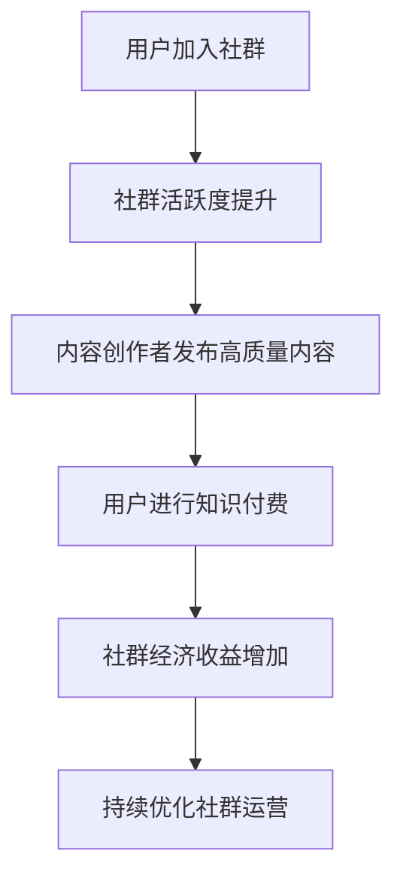

                 

# 知识付费：程序员的社群运营实操

> **关键词：** 知识付费、社群运营、程序员、实操、增长策略、用户参与、平台建设

> **摘要：** 本文将探讨知识付费在程序员社群中的实际应用，解析社群运营的关键策略，并提供实用的实操指南，帮助程序员建立和运营一个成功的知识付费社群。

## 1. 背景介绍

在当今信息化社会中，知识付费已成为一种重要的商业模式。程序员作为技术领域的专业人才，对于新知识、新技术的渴望尤为强烈。知识付费为程序员提供了一个获取高质量技术内容的途径，同时也为内容创作者提供了变现的渠道。然而，如何有效地运营一个程序员社群，使其成为知识付费的载体，是一个值得探讨的问题。

本文旨在为程序员提供一个全面的社群运营实操指南，通过分析知识付费在程序员社群中的现状、核心概念和实际操作，帮助程序员建立和运营一个成功、有影响力的社群。

## 2. 核心概念与联系

### 2.1 知识付费的概念

知识付费是指用户为了获取特定知识或技能，愿意为内容创作者支付一定费用的行为。这种模式使得内容创作者能够通过分享专业知识获得经济回报，同时也使用户能够更高效地获取所需的知识。

### 2.2 社群运营的概念

社群运营是指通过一系列策略和活动，吸引、维护和增长社群成员，以实现特定目标的过程。对于程序员社群，目标通常包括提升成员技术水平、增强社区凝聚力以及实现知识付费。

### 2.3 核心概念的联系

知识付费与社群运营之间存在着紧密的联系。社群运营为知识付费提供了一个载体，通过建立和维护一个活跃、有价值的社群，可以吸引更多的用户进行知识付费。而知识付费则为社群运营提供了经济支持，使其能够持续发展。

### 2.4 Mermaid 流程图

以下是一个简化的Mermaid流程图，展示了知识付费在程序员社群运营中的流程：



## 3. 核心算法原理 & 具体操作步骤

### 3.1 算法原理

程序员社群运营的核心算法可以概括为“内容驱动-用户参与-互动反馈”的模式。具体包括以下几个步骤：

1. **内容驱动**：通过高质量的技术内容吸引和留住用户。
2. **用户参与**：鼓励用户互动，增加社群活跃度。
3. **互动反馈**：收集用户反馈，优化社群运营策略。

### 3.2 具体操作步骤

1. **内容规划**：确定社群的核心主题，制定内容发布计划，确保内容的质量和持续更新。
2. **用户吸引**：通过社交媒体、技术论坛等渠道宣传社群，吸引目标用户加入。
3. **互动鼓励**：设置互动机制，如问答、讨论区等，鼓励用户参与和分享。
4. **反馈收集**：定期收集用户反馈，了解用户需求，优化社群服务。
5. **数据监控**：监控社群活跃度、用户参与度等关键指标，评估社群运营效果。

## 4. 数学模型和公式 & 详细讲解 & 举例说明

### 4.1 数学模型

为了量化社群运营的效果，我们可以使用以下数学模型：

$$
E = f(A, B, C)
$$

其中，$E$表示社群运营效果，$A$表示内容质量，$B$表示用户参与度，$C$表示互动反馈。

### 4.2 详细讲解

1. **内容质量（A）**：内容质量是社群运营的基础，直接影响用户的满意度和留存率。我们可以使用以下公式评估内容质量：

$$
Q = \frac{C_{\text{原创}} + C_{\text{高质量}} + C_{\text{更新及时}}}{C_{\text{总内容}}}
$$

其中，$Q$表示内容质量得分，$C_{\text{原创}}$表示原创内容比例，$C_{\text{高质量}}$表示高质量内容比例，$C_{\text{更新及时}}$表示内容更新及时性。

2. **用户参与度（B）**：用户参与度是衡量社群活跃度的重要指标。我们可以使用以下公式计算用户参与度：

$$
B = \frac{I_{\text{互动}} + I_{\text{分享}} + I_{\text{评论}}}{I_{\text{总互动}}}
$$

其中，$B$表示用户参与度得分，$I_{\text{互动}}$表示互动次数，$I_{\text{分享}}$表示分享次数，$I_{\text{评论}}$表示评论次数。

3. **互动反馈（C）**：互动反馈是社群运营的重要环节，可以影响用户满意度和社群口碑。我们可以使用以下公式计算互动反馈得分：

$$
C = \frac{R_{\text{正面}} - R_{\text{负面}}}{R_{\text{总反馈}}}
$$

其中，$C$表示互动反馈得分，$R_{\text{正面}}$表示正面反馈次数，$R_{\text{负面}}$表示负面反馈次数。

### 4.3 举例说明

假设一个程序员社群在一个月内发布20篇技术文章，其中原创文章占比60%，高质量文章占比30%，更新及时文章占比40%。同时，社群内用户互动次数为500次，其中分享次数为200次，评论次数为300次。用户反馈中，正面反馈占70%，负面反馈占30%。

根据上述公式，我们可以计算出：

$$
Q = \frac{0.6 \times 20 + 0.3 \times 20 + 0.4 \times 20}{20} = 0.55
$$

$$
B = \frac{200 + 300 + 300}{500} = 0.7
$$

$$
C = \frac{0.7 \times 500 - 0.3 \times 500}{500} = 0.4
$$

因此，社群运营效果得分为：

$$
E = f(Q, B, C) = 0.55 \times 0.7 \times 0.4 = 0.154
$$

## 5. 项目实战：代码实际案例和详细解释说明

### 5.1 开发环境搭建

为了更好地进行社群运营，我们需要搭建一个支持知识付费的平台。以下是一个简单的开发环境搭建指南：

1. **技术栈选择**：选用流行的技术栈，如React、Node.js等，以实现前端和后端的快速开发。
2. **数据库选择**：选择合适的数据库，如MongoDB、MySQL等，用于存储用户数据、内容数据等。
3. **服务器部署**：选择云服务器，如阿里云、腾讯云等，用于部署应用。

### 5.2 源代码详细实现和代码解读

以下是一个简单的知识付费社群平台的源代码实现，包括用户注册、登录、发布内容、互动等功能。

#### 5.2.1 用户注册

```javascript
// 用户注册接口
app.post('/register', async (req, res) => {
  const { username, password } = req.body;
  // 验证用户名和密码
  // 存储用户信息到数据库
  // 返回注册成功或失败的消息
});
```

#### 5.2.2 用户登录

```javascript
// 用户登录接口
app.post('/login', async (req, res) => {
  const { username, password } = req.body;
  // 验证用户名和密码
  // 返回登录成功或失败的消息
});
```

#### 5.2.3 发布内容

```javascript
// 发布内容接口
app.post('/post', async (req, res) => {
  const { userId, content } = req.body;
  // 验证用户身份
  // 存储内容到数据库
  // 返回发布成功或失败的消息
});
```

#### 5.2.4 互动

```javascript
// 互动接口
app.post('/interact', async (req, res) => {
  const { userId, postId, type } = req.body;
  // 验证用户身份
  // 存储互动到数据库
  // 返回互动成功或失败的消息
});
```

### 5.3 代码解读与分析

上述代码展示了知识付费社群平台的核心功能。每个接口都包含了身份验证和数据存储的逻辑。通过这些接口，用户可以完成注册、登录、发布内容和互动等操作。

代码的实现依赖于前端和后端的交互。前端负责页面的渲染和用户操作，后端负责处理业务逻辑和数据存储。

## 6. 实际应用场景

知识付费在程序员社群中的实际应用场景主要包括：

1. **在线课程**：提供在线课程，用户付费后可以学习课程内容。
2. **技术文档**：提供技术文档，用户付费后可以查看详细的文档内容。
3. **问答服务**：提供问答服务，用户付费后可以获得更快速、更专业的技术支持。
4. **技能认证**：提供技能认证服务，用户付费后可以获得相关的技能认证。

这些应用场景为程序员提供了多种获取知识和技能的途径，同时也为社群运营带来了更多的经济收益。

## 7. 工具和资源推荐

### 7.1 学习资源推荐

1. **书籍**：《深度学习》、《算法导论》等。
2. **论文**：arXiv、ACM Digital Library等。
3. **博客**：GitHub、Stack Overflow等。
4. **网站**：MIT OpenCourseWare、Coursera等。

### 7.2 开发工具框架推荐

1. **前端框架**：React、Vue、Angular等。
2. **后端框架**：Node.js、Django、Flask等。
3. **数据库**：MongoDB、MySQL、PostgreSQL等。
4. **服务器**：阿里云、腾讯云、华为云等。

### 7.3 相关论文著作推荐

1. **论文**：KDD、ICML、NeurIPS等。
2. **著作**：《深度学习》、《机器学习》等。

## 8. 总结：未来发展趋势与挑战

知识付费在程序员社群中的应用前景广阔，但同时也面临着诸多挑战。未来，随着人工智能、大数据等技术的不断发展，知识付费将更加智能化、个性化。然而，如何提高内容质量、增强用户黏性、保护用户隐私等，将是社群运营的关键挑战。

## 9. 附录：常见问题与解答

### 9.1 如何提高社群活跃度？

- **内容驱动**：发布高质量、有价值的内容，吸引用户参与。
- **互动机制**：设置互动环节，鼓励用户互动。
- **活动激励**：举办线上活动，激励用户参与。

### 9.2 如何确保内容质量？

- **审核机制**：建立内容审核机制，确保内容质量。
- **用户评价**：鼓励用户评价内容，筛选优质内容。
- **内容策划**：制定内容发布计划，确保内容持续更新。

## 10. 扩展阅读 & 参考资料

1. **书籍**：《社群营销》、《内容创业》等。
2. **论文**：《知识付费商业模式研究》、《在线教育中社群运营策略研究》等。
3. **网站**：知乎、36氪等。

## 作者

**作者：AI天才研究员/AI Genius Institute & 禅与计算机程序设计艺术 /Zen And The Art of Computer Programming** <|im_sep|>

