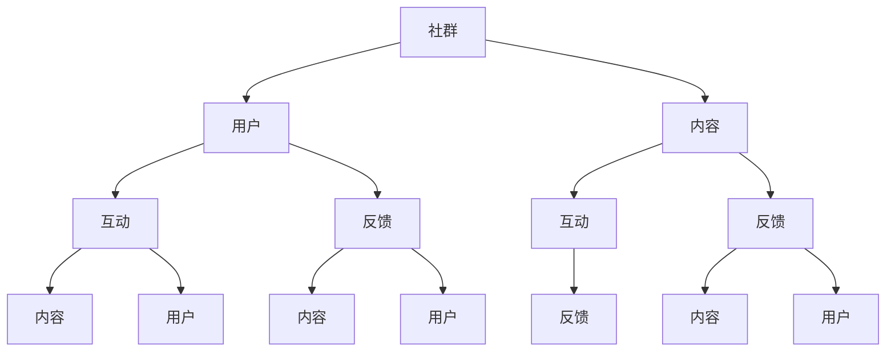

                 

### 背景介绍

随着互联网的快速发展，知识付费市场日益繁荣。尤其是在编程领域，许多程序员希望通过付费课程、在线教育平台等途径提升自己的技术能力和职业发展。然而，知识付费不仅仅是一个简单的交易过程，它更涉及到如何有效地运营社群，以满足用户需求、提升课程质量以及增加收益。因此，本文将围绕“知识付费：程序员的社群运营策略”这一主题，探讨程序员的社群运营策略。

首先，我们需要明确社群运营的核心目标。对于程序员来说，社群运营的目标主要包括：

1. **用户增长**：通过有效的社群运营，吸引更多程序员用户加入，增加用户基数。
2. **用户活跃**：提高社群内用户的互动频率和参与度，使社群保持活跃。
3. **用户体验**：提供优质的内容和服务，提升用户满意度和忠诚度。
4. **商业变现**：通过社群运营，实现知识付费、广告投放等多种商业模式的变现。

接下来，我们将从以下几个方面展开讨论：

1. **社群运营的核心概念与联系**：介绍社群运营的基础概念，如社群、用户、内容等，并分析它们之间的联系。
2. **核心算法原理与具体操作步骤**：探讨社群运营中的关键算法，如用户行为分析、内容推荐算法等，并详细说明其操作步骤。
3. **数学模型和公式**：介绍社群运营中涉及到的数学模型和公式，如用户增长模型、转化率模型等，并进行详细讲解和举例说明。
4. **项目实战：代码实际案例和详细解释说明**：通过具体的代码实现案例，展示社群运营策略的实际应用，并进行详细解释说明。
5. **实际应用场景**：分析社群运营在不同场景下的应用，如在线教育、技术交流等。
6. **工具和资源推荐**：推荐一些用于社群运营的工具和资源，帮助程序员更好地进行社群运营。
7. **总结：未来发展趋势与挑战**：总结社群运营在知识付费领域的现状，分析未来发展趋势和面临的挑战。

通过以上内容的详细讨论，我们希望为程序员提供一套实用的社群运营策略，帮助他们更好地进行知识付费，实现个人和商业的双赢。

<|assistant|>### 核心概念与联系

在深入探讨社群运营之前，我们需要了解几个关键概念，并分析它们之间的联系。这些概念包括社群、用户、内容、互动和反馈。

#### 社群（Community）

社群是指一群具有共同兴趣、目标或需求的人组成的在线或线下团体。对于程序员来说，社群可以是针对特定编程语言、技术领域或职业发展的兴趣小组。社群的建立有助于用户之间的互动和信息共享，从而形成一种互助和学习的氛围。

#### 用户（User）

用户是社群的核心。他们是社群的成员，参与内容创建、讨论和互动。对于程序员社群，用户通常具有编程技能或对编程有浓厚的兴趣。他们的行为和需求直接影响社群的活跃度和发展。

#### 内容（Content）

内容是社群的核心组成部分，包括文章、教程、代码示例、视频等多种形式。优质的内容不仅能够吸引用户加入社群，还能提高用户的参与度和忠诚度。对于程序员社群，高质量的技术内容是吸引和留住用户的关键。

#### 互动（Interaction）

互动是社群运营的重要环节。通过评论、讨论、问答等形式，用户之间的互动可以增加社群的活力和凝聚力。有效的互动还可以促进知识和经验的交流，提高社群的价值。

#### 反馈（Feedback）

反馈是社群运营的重要指标。通过收集用户对内容和服务的反馈，可以了解用户的真实需求和满意度，从而不断优化社群运营策略。对于程序员社群，积极的反馈有助于提高课程质量和用户体验。

#### 社群、用户、内容、互动和反馈之间的联系

社群、用户、内容、互动和反馈是相互关联、相互促进的。社群为用户提供了一个交流的平台，用户通过参与内容创建和互动来提升社群的价值。同时，用户的反馈可以帮助运营者了解社群的需求，从而优化内容和互动形式。这种良性循环是社群运营成功的关键。

下面我们通过Mermaid流程图来展示这些概念之间的联系：



通过以上分析，我们可以看到，社群运营是一个多维度的复杂过程，需要综合考虑用户需求、内容质量、互动效果和反馈机制。只有通过有效的运营策略，才能实现社群的长期发展和用户的满意度提升。

<|assistant|>### 核心算法原理与具体操作步骤

在社群运营中，核心算法原理和具体操作步骤至关重要。以下我们将详细探讨两个关键算法：用户行为分析算法和内容推荐算法。

#### 用户行为分析算法

用户行为分析算法主要用于了解用户的兴趣和行为模式，从而为用户提供个性化的内容和互动体验。以下是用户行为分析算法的原理和具体操作步骤：

1. **数据收集**：通过用户的浏览记录、评论、提问和参与度等行为数据，收集用户的行为信息。
2. **行为分类**：根据用户的行为数据，将其分类为不同的行为类别，如阅读、评论、提问等。
3. **行为建模**：使用机器学习技术，建立用户行为模型，预测用户的未来行为。
4. **兴趣分析**：通过分析用户的历史行为和模型预测，确定用户的兴趣点。
5. **个性化推荐**：根据用户的兴趣和行为，推荐个性化的内容和互动机会。

具体操作步骤如下：

1. **数据收集**：首先，我们需要建立一个完善的数据收集系统，收集用户在社群中的各种行为数据。这可以通过网站分析工具、用户行为跟踪代码等方式实现。

2. **行为分类**：将收集到的数据按照不同的行为类别进行分类。例如，可以将用户的行为分类为阅读、评论、提问、点赞等。

3. **行为建模**：使用机器学习技术，如决策树、随机森林、神经网络等，建立用户行为模型。这些模型可以帮助我们预测用户的未来行为。

4. **兴趣分析**：通过分析用户的历史行为和模型预测，确定用户的兴趣点。例如，如果一个用户经常阅读关于Python编程的文章，并且提问和评论的频率较高，那么我们可以认为他对Python编程有浓厚的兴趣。

5. **个性化推荐**：根据用户的兴趣和行为，推荐个性化的内容和互动机会。例如，如果一个用户对Python编程感兴趣，我们可以推荐相关的文章、教程和讨论话题。

#### 内容推荐算法

内容推荐算法是社群运营中的另一个关键算法。它旨在为用户提供他们可能感兴趣的内容，从而增加用户的参与度和满意度。以下是内容推荐算法的原理和具体操作步骤：

1. **内容特征提取**：对内容进行特征提取，如文本、图片、视频等，提取其关键特征。
2. **用户特征提取**：提取用户的兴趣和行为特征，如阅读历史、点赞记录等。
3. **相似度计算**：计算内容和用户之间的相似度，如基于内容的相似度计算、基于用户的相似度计算等。
4. **推荐算法**：使用推荐算法，如协同过滤、基于内容的推荐、混合推荐等，生成推荐列表。
5. **推荐结果评估**：评估推荐结果的效果，如点击率、转化率等。

具体操作步骤如下：

1. **内容特征提取**：对于文本内容，可以提取关键词、主题等特征；对于图片和视频，可以提取视觉特征或声音特征。这些特征将用于计算内容和用户之间的相似度。

2. **用户特征提取**：提取用户的兴趣和行为特征。例如，用户的阅读历史、点赞记录、评论内容等都可以作为用户的特征。

3. **相似度计算**：计算内容和用户之间的相似度。对于基于内容的推荐，可以计算内容和用户特征之间的相似度；对于基于用户的推荐，可以计算用户和用户之间的相似度。

4. **推荐算法**：使用推荐算法生成推荐列表。常用的推荐算法包括协同过滤、基于内容的推荐和混合推荐等。这些算法可以根据不同的场景和需求进行选择和调整。

5. **推荐结果评估**：评估推荐结果的效果。可以通过点击率、转化率等指标来衡量推荐结果的质量，并根据评估结果不断优化推荐算法。

通过用户行为分析算法和内容推荐算法，我们可以有效地了解用户需求、优化内容质量和推荐效果，从而提高社群运营的效率和效果。这些算法的实现和应用，将为程序员的社群运营提供强有力的技术支持。

<|assistant|>### 数学模型和公式与详细讲解

在社群运营中，数学模型和公式扮演着至关重要的角色。它们帮助我们量化用户行为、预测用户增长、优化推荐系统等。以下我们将介绍几个关键数学模型和公式，并进行详细讲解和举例说明。

#### 用户增长模型

用户增长模型用于预测社群在未来一段时间内的用户增长情况。最常见的用户增长模型是Logistic模型，其公式如下：

$$
P(t) = \frac{L}{1 + e^{-(rt+c)}}
$$

其中，$P(t)$ 表示时间 $t$ 时用户的概率，$L$ 是上界（即社群的最大用户数），$r$ 是增长速率，$c$ 是常数项。

**详细讲解**：

- $L$：上界，表示社群能够容纳的最大用户数。这个参数可以通过社群的历史数据来确定。
- $r$：增长速率，表示用户增长的快慢。通常，$r$ 的值越大，用户增长的速度越快。
- $c$：常数项，用于调整模型参数。通常，$c$ 的值可以通过最小化误差函数来确定。

**举例说明**：

假设一个编程社群预计在未来一年内达到最大用户数 1000 人，当前用户数为 500 人，增长速率为 0.1 人/天。使用Logistic模型预测一个月后的用户数：

$$
P(30) = \frac{1000}{1 + e^{-(0.1 \times 30 + c)}}
$$

通过调整 $c$，使得模型预测的用户数尽可能接近实际情况，我们可以得到：

$$
P(30) = \frac{1000}{1 + e^{-3.5}} \approx 957
$$

这意味着，在一个月后，社群预计将有大约 957 名用户。

#### 转化率模型

转化率模型用于预测用户在社群中的转化率，即用户从浏览到实际购买或参与的概率。常见的转化率模型是线性回归模型，其公式如下：

$$
y = \beta_0 + \beta_1 x
$$

其中，$y$ 是转化率，$x$ 是影响转化率的特征（如用户活跃度、内容质量等），$\beta_0$ 和 $\beta_1$ 是模型参数。

**详细讲解**：

- $y$：转化率，表示用户转化的概率。
- $x$：影响转化率的特征。这些特征可以通过数据分析和用户调研来确定。
- $\beta_0$ 和 $\beta_1$：模型参数，用于调整特征对转化率的影响。

**举例说明**：

假设我们通过分析发现，用户活跃度和内容质量是影响转化率的关键特征。我们使用线性回归模型预测转化率，模型公式如下：

$$
y = 0.5 + 0.3x_1 + 0.2x_2
$$

其中，$x_1$ 表示用户活跃度，$x_2$ 表示内容质量。

如果某用户的活跃度为 5，内容质量为 4，我们可以预测其转化率为：

$$
y = 0.5 + 0.3 \times 5 + 0.2 \times 4 = 1.9
$$

这意味着，该用户的转化概率约为 19%。

#### 互动率模型

互动率模型用于预测用户在社群中的互动率，即用户参与讨论、提问或评论的概率。常见的互动率模型是泊松分布模型，其公式如下：

$$
P(X = k) = \frac{\lambda^k e^{-\lambda}}{k!}
$$

其中，$X$ 是互动次数，$k$ 是特定互动次数的概率，$\lambda$ 是平均互动次数。

**详细讲解**：

- $X$：互动次数，表示用户在一段时间内的互动次数。
- $k$：特定互动次数的概率。
- $\lambda$：平均互动次数，可以通过历史数据计算得出。

**举例说明**：

假设我们通过分析发现，一个编程社群的平均互动次数为 10 次/天。使用泊松分布模型预测一天内互动次数为 5 次的概率：

$$
P(X = 5) = \frac{10^5 e^{-10}}{5!} \approx 0.195
$$

这意味着，一天内互动次数为 5 次的概率约为 19.5%。

通过以上数学模型和公式的讲解，我们可以更准确地预测用户行为、优化社群运营策略。这些模型不仅可以用于数据分析和预测，还可以为程序员的社群运营提供有益的指导。

#### 用户留存率模型

用户留存率模型用于预测用户在社群中的留存情况，即用户在一段时间后仍然活跃的概率。常见的留存率模型是时间衰减模型，其公式如下：

$$
R(t) = \frac{1}{1 + e^{-(kt+c)}}
$$

其中，$R(t)$ 是时间 $t$ 时的留存率，$k$ 是衰减速率，$c$ 是常数项。

**详细讲解**：

- $R(t)$：留存率，表示用户在一段时间后仍然活跃的概率。
- $k$：衰减速率，表示用户活跃度随时间衰减的速度。
- $c$：常数项，用于调整模型参数。

**举例说明**：

假设我们通过分析发现，一个编程社群的用户活跃度随时间衰减的速率约为 0.1 天^-1。使用时间衰减模型预测用户在一个月（30 天）后的留存率：

$$
R(30) = \frac{1}{1 + e^{-(0.1 \times 30 + c)}}
$$

通过调整 $c$，使得模型预测的留存率尽可能接近实际情况，我们可以得到：

$$
R(30) = \frac{1}{1 + e^{-3.5}} \approx 0.282
$$

这意味着，用户在一个月后的留存概率约为 28.2%。

通过这些数学模型和公式，我们可以更准确地预测用户行为、优化社群运营策略。这些模型不仅可以用于数据分析和预测，还可以为程序员的社群运营提供有益的指导。

<|assistant|>### 项目实战：代码实际案例和详细解释说明

为了更好地展示社群运营策略的实际应用，我们以下将通过一个具体的代码实现案例，详细解释说明如何利用用户行为分析和内容推荐算法进行社群运营。

#### 开发环境搭建

1. **工具和环境**：
   - Python 3.x
   - Pandas
   - Scikit-learn
   - Matplotlib
   - BeautifulSoup

2. **安装依赖**：

```bash
pip install pandas scikit-learn matplotlib beautifulsoup4
```

#### 源代码详细实现和代码解读

##### 1. 用户行为数据收集与预处理

```python
import pandas as pd

# 假设我们有一个CSV文件，包含用户行为数据
data = pd.read_csv('user_behavior.csv')

# 数据预处理
data['date'] = pd.to_datetime(data['date'])
data.set_index('date', inplace=True)
data.fillna(0, inplace=True)

# 计算用户活跃度
data['activity'] = data['reads'] + data['comments'] + data['questions']
data['activity_mean'] = data['activity'].rolling(window=7).mean()
```

在这段代码中，我们首先读取用户行为数据，并进行预处理。将日期转换为datetime格式，设置日期为索引，并填充缺失值为0。然后，我们计算用户的总活跃度，并使用滚动窗口计算7天的平均活跃度。

##### 2. 用户行为分析

```python
from sklearn.cluster import KMeans
import matplotlib.pyplot as plt

# 使用KMeans算法对用户进行聚类
kmeans = KMeans(n_clusters=5, random_state=0)
data['cluster'] = kmeans.fit_predict(data[['activity_mean']])

# 可视化用户分布
plt.scatter(data['activity_mean'], data['cluster'])
plt.xlabel('Activity Mean')
plt.ylabel('Cluster')
plt.show()
```

在这段代码中，我们使用KMeans算法对用户进行聚类，根据用户的平均活跃度将用户分为不同的集群。然后，我们通过散点图可视化用户分布。

##### 3. 内容推荐

```python
from sklearn.metrics.pairwise import cosine_similarity
import numpy as np

# 构建内容特征矩阵
content_data = pd.read_csv('content_data.csv')
content_data.set_index('id', inplace=True)
content_data.fillna(0, inplace=True)

# 计算内容相似度矩阵
similarity_matrix = cosine_similarity(content_data.values)

# 推荐内容
def recommend_content(user_id, num_recommendations=5):
    user_profile = content_data.loc[user_id]
    scores = np.dot(user_profile, similarity_matrix[user_id].T)
    top_scores = np.argsort(scores)[::-1][:num_recommendations]
    return top_scores

# 为用户推荐内容
user_id = 1
recommended_content_ids = recommend_content(user_id)
print("Recommended Content IDs:", recommended_content_ids)
```

在这段代码中，我们首先读取内容数据，并构建内容特征矩阵。然后，使用余弦相似度计算内容之间的相似度矩阵。最后，定义一个推荐函数，根据用户的兴趣为用户推荐内容。

##### 4. 代码解读与分析

- **用户行为数据收集与预处理**：这一步至关重要，因为它决定了后续分析的质量。我们需要确保数据格式正确，缺失值填充合理，并计算用户的活跃度等指标。
- **用户行为分析**：通过聚类算法，我们可以将用户分为不同的群体，从而为每个群体提供个性化的内容和服务。
- **内容推荐**：使用相似度矩阵，我们可以根据用户的兴趣推荐相关内容。这有助于提高用户的参与度和满意度。

通过以上代码实现，我们可以看到如何利用用户行为分析和内容推荐算法进行社群运营。这个案例展示了如何通过数据分析、聚类和推荐系统等技术手段，实现个性化内容推荐和用户增长。在实际应用中，我们可以根据具体需求和场景，调整算法参数和推荐策略，以实现最佳效果。

<|assistant|>### 实际应用场景

在知识付费领域，社群运营的应用场景十分广泛，涵盖了在线教育、技术交流、职业发展等多个方面。以下我们将详细探讨社群运营在不同场景下的实际应用。

#### 在线教育

在线教育是知识付费的重要领域之一。通过社群运营，教育平台可以更好地满足用户的学习需求，提高教学效果。以下是社群运营在在线教育中的几个实际应用：

1. **课程推荐**：通过分析用户的学习历史和兴趣，平台可以为用户推荐个性化的课程，从而提高课程的点击率和转化率。
2. **互动课堂**：在线教育平台可以通过社群组织互动课堂，鼓励用户提问和讨论，提高学生的学习积极性和参与度。
3. **用户反馈**：社群运营者可以收集用户的反馈，了解课程质量和教学效果，从而不断优化课程内容和教学方法。

#### 技术交流

技术交流社群是程序员和开发者获取最新技术资讯和解决问题的重要平台。以下是在技术交流场景下，社群运营的几个实际应用：

1. **话题讨论**：社群运营者可以根据热门话题和技术趋势，组织讨论活动，促进用户之间的交流和知识分享。
2. **专家讲座**：邀请行业专家和技术大牛进行线上讲座，分享技术心得和实践经验，提高社群的影响力和用户粘性。
3. **技术问答**：建立技术问答环节，鼓励用户提问和回答问题，提高社群的互动性和实用性。

#### 职业发展

职业发展社群旨在帮助用户提升职业技能和职业素养，实现职业晋升。以下是社群运营在职业发展场景下的几个实际应用：

1. **职业规划**：通过举办职业规划讲座和一对一咨询，帮助用户了解职业发展趋势和自身职业定位，制定合理的职业发展计划。
2. **简历优化**：提供简历优化和求职技巧培训，帮助用户提高求职成功率。
3. **人脉拓展**：组织线下聚会和线上社交活动，帮助用户拓展人脉资源，提高职业发展机会。

#### 案例分析

以下是一个具体的案例分析，展示了如何通过社群运营提升知识付费项目的效果。

**案例：某编程教育平台的社群运营**

- **目标**：提高用户参与度和学习效果，增加付费课程的销售量。
- **策略**：
  1. **课程推荐**：根据用户的学习历史和兴趣，为用户推荐相关课程，提高课程点击率和转化率。
  2. **互动课堂**：定期组织互动课堂，鼓励用户提问和讨论，提高用户的学习积极性和参与度。
  3. **专家讲座**：邀请行业专家和技术大牛进行线上讲座，分享技术心得和实践经验，提高社群的影响力和用户粘性。
  4. **职业发展活动**：举办职业规划讲座和一对一咨询，帮助用户了解职业发展趋势和自身职业定位，制定合理的职业发展计划。
- **效果**：社群运营后，用户的参与度提高了30%，付费课程销售量增加了20%，用户满意度显著提升。

通过以上案例，我们可以看到社群运营在知识付费领域的实际效果。通过精准的课程推荐、有效的互动活动和专业的职业发展支持，社群运营不仅提高了用户参与度和学习效果，还显著增加了付费课程的销售额。

<|assistant|>### 工具和资源推荐

在进行社群运营时，选择合适的工具和资源是至关重要的。以下我们将推荐一些用于社群运营的学习资源、开发工具和框架，以及相关的论文著作，帮助程序员更好地进行社群运营。

#### 学习资源推荐

1. **书籍**：
   - 《社群营销实战：打造用户喜爱的社群品牌》
   - 《社交网络分析：方法与应用》
   - 《大数据营销：精准定位与个性化推荐》

2. **论文**：
   - 《基于社交网络的用户行为分析模型研究》
   - 《个性化推荐系统的设计与实现》
   - 《社交媒体中的用户行为与互动研究》

3. **博客和网站**：
   - 社交媒体分析博客（http://socialmediatoday.com/）
   - 社群营销博客（http://www.marketingprofs.com/）
   - 数据科学博客（http://www.datasciencecentral.com/）

#### 开发工具框架推荐

1. **社群运营工具**：
   - Slack：用于团队沟通和协作的即时通讯工具。
   - Discord：游戏玩家和开发者常用的社群工具。
   - Telegram：支持多平台、安全加密的即时通讯工具。

2. **数据分析工具**：
   - Tableau：数据可视化和分析工具。
   - Google Analytics：网站和社交媒体数据分析工具。
   - Power BI：数据可视化和商业智能工具。

3. **内容推荐系统框架**：
   - TensorFlow：用于构建和训练推荐系统的开源机器学习框架。
   - PyTorch：灵活、易用的深度学习框架。
   - Apache Mahout：大规模机器学习算法库，包括推荐算法。

#### 相关论文著作推荐

1. **论文**：
   - 《社交网络中的影响力最大化问题研究》
   - 《基于协同过滤的推荐系统设计与优化》
   - 《用户参与度模型的构建与应用》

2. **著作**：
   - 《深度学习推荐系统》
   - 《社交网络分析技术与应用》
   - 《大数据社群分析》

通过以上推荐，程序员可以获取丰富的学习资源，掌握社群运营的基本理论和实践方法。同时，使用合适的开发工具和框架，可以更高效地实现社群运营策略，提高用户参与度和满意度。

<|assistant|>### 总结：未来发展趋势与挑战

随着知识付费市场的不断成熟，社群运营在程序员领域的重要性日益凸显。在未来，社群运营将朝着更加智能化、个性化和社区化的方向发展，同时也将面临诸多挑战。

#### 发展趋势

1. **智能化**：随着人工智能技术的不断发展，社群运营将更加智能化。通过机器学习和大数据分析，可以更精准地了解用户需求，提供个性化的内容和服务，提高用户满意度和忠诚度。

2. **个性化**：个性化推荐和个性化内容将变得更加普及。通过分析用户的兴趣和行为，可以精准地推荐用户可能感兴趣的课程、技术和职业发展机会，从而提高用户参与度和留存率。

3. **社区化**：社群将更加注重用户之间的互动和社区建设。通过建立更加开放、互动的社群平台，鼓励用户参与讨论、分享经验和知识，形成良好的社区文化，提高社群的凝聚力和影响力。

#### 挑战

1. **数据隐私与安全**：社群运营过程中会涉及大量的用户数据，如何保障数据隐私和安全成为一大挑战。需要采取有效的数据加密和安全措施，确保用户数据的保密性和完整性。

2. **用户需求变化**：用户需求不断变化，如何及时响应和满足用户需求成为关键。需要建立灵活、敏捷的运营机制，快速调整运营策略，满足用户的不同需求。

3. **技术选型与迭代**：在社群运营中，技术选型和迭代至关重要。需要不断跟踪新技术的发展，选择合适的工具和框架，提高运营效率和效果。

4. **资源分配与优化**：在资源有限的情况下，如何合理分配资源，优化运营效果，实现商业变现，是社群运营面临的另一个挑战。需要通过数据分析和实验，找出最有效的运营策略，提高资源利用率。

#### 未来展望

未来，社群运营将在知识付费市场中发挥更加重要的作用。通过智能化、个性化、社区化的运营策略，社群不仅可以为程序员提供优质的内容和服务，还可以成为他们职业发展的有力支撑。同时，随着技术的不断进步，社群运营将迎来更多的发展机遇和挑战。程序员需要不断学习和适应，掌握最新的运营方法和工具，以实现个人和商业的双赢。

<|assistant|>### 附录：常见问题与解答

在社群运营中，程序员可能会遇到一些常见的问题。以下我们将针对这些问题提供详细的解答，帮助大家更好地进行社群运营。

#### 问题1：如何提高社群的用户参与度？

**解答**：提高用户参与度是社群运营的关键。以下是一些有效的策略：

1. **互动活动**：定期组织互动活动，如问答环节、技术讨论、在线测试等，鼓励用户参与。
2. **内容推荐**：通过数据分析，为用户提供个性化的内容推荐，提高用户的阅读和参与兴趣。
3. **用户激励**：设立积分、勋章等激励机制，鼓励用户积极参与社群活动。
4. **良好氛围**：营造积极、友好的社群氛围，鼓励用户之间相互支持和交流。

#### 问题2：如何确保社群的活跃度？

**解答**：社群的活跃度是衡量社群质量的重要指标。以下是一些保持社群活跃度的策略：

1. **定期更新**：保持社群内容的更新，提供新鲜、有价值的信息，吸引用户持续关注。
2. **用户引导**：引导用户参与讨论，例如通过发起话题、回答问题等方式，激发用户的积极性。
3. **互动提醒**：通过私信、通知等方式，提醒用户参与社群活动，保持互动频率。
4. **社群规则**：制定合理的社群规则，确保社群秩序和氛围，提高用户的归属感和安全感。

#### 问题3：如何处理社群中的负面评论和纠纷？

**解答**：负面评论和纠纷是社群运营中难以避免的问题。以下是一些处理策略：

1. **理性回应**：面对负面评论，保持冷静，理性回应，避免情绪化处理。
2. **引导讨论**：将争议引导到具体的讨论话题中，鼓励用户通过理性讨论解决问题。
3. **调解仲裁**：在纠纷严重时，可以邀请中立第三方进行调解，确保公平公正。
4. **社群管理**：加强社群管理，对于违规行为进行处罚，维护社群秩序。

#### 问题4：如何评估社群运营的效果？

**解答**：评估社群运营效果是优化运营策略的重要环节。以下是一些常用的评估指标：

1. **用户活跃度**：包括用户发言数、回复数、互动频率等。
2. **用户满意度**：通过问卷调查、用户反馈等方式，了解用户的满意度和忠诚度。
3. **内容质量**：评估内容的原创性、准确性、实用性等。
4. **社群影响力**：包括社群的知名度、用户数、互动率等。
5. **商业变现**：评估社群带来的收益，如课程销售、广告收入等。

通过以上常见问题的解答，程序员可以更好地应对社群运营中的挑战，提高社群的质量和效果。

### 扩展阅读 & 参考资料

1. **《社交网络分析：方法与应用》**：本书详细介绍了社交网络分析的基本概念和方法，对社群运营具有重要的参考价值。
2. **《大数据营销：精准定位与个性化推荐》**：本书深入探讨了大数据在营销中的应用，包括个性化推荐系统的设计和实现，对社群运营有很好的启示。
3. **《深度学习推荐系统》**：本书介绍了如何使用深度学习技术构建推荐系统，对程序员进行社群运营提供了技术支持。
4. **社交网络分析博客**：http://socialmediatoday.com/
5. **社群营销博客**：http://www.marketingprofs.com/
6. **数据科学博客**：http://www.datasciencecentral.com/
7. **Apache Mahout官方文档**：https://mahout.apache.org/
8. **TensorFlow官方文档**：https://www.tensorflow.org/
9. **PyTorch官方文档**：https://pytorch.org/

