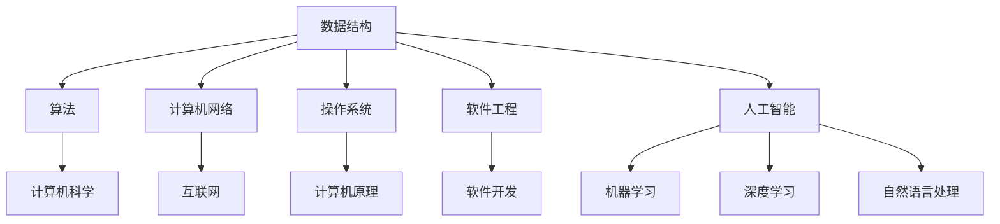

                 

# 知识体系的构建：从基本元素到复杂结构

> **关键词**：知识体系，基本元素，复杂结构，构建，IT领域，逻辑思考

> **摘要**：本文旨在探讨如何构建一个完整、合理、有效的知识体系，从基本元素开始，逐步发展到复杂结构。通过分析不同领域的核心概念和联系，深入解析核心算法原理、数学模型和项目实战，探讨知识体系在实际应用场景中的价值，并推荐相关工具和资源。本文旨在为IT从业者和研究者提供有益的指导。

## 1. 背景介绍

在当今快速发展的信息技术领域，知识体系的构建变得越来越重要。一个良好的知识体系可以帮助我们更好地理解复杂的技术概念，有效地应对不断涌现的新技术和新挑战。然而，如何构建一个完整、合理、有效的知识体系仍然是一个难题。本文将探讨这个问题，从基本元素开始，逐步发展到复杂结构，旨在为IT从业者和研究者提供一种有效的思考方法和实践路径。

### 1.1 知识体系的重要性

知识体系是我们在学习和工作中处理信息、解决问题的重要工具。一个完整、合理、有效的知识体系可以提升我们的认知能力、分析能力和创新能力，帮助我们更好地应对复杂的问题和挑战。在IT领域，知识体系的重要性尤为突出。随着技术的不断进步，新的概念和工具层出不穷，只有建立扎实的知识体系，才能跟上时代的步伐，为技术创新提供源源不断的动力。

### 1.2 知识体系的构建方法

构建知识体系的方法有很多，但基本原则是一致的：从基本元素开始，逐步发展到复杂结构。基本元素是构成知识体系的基础，复杂结构是知识体系的最终目标。在这个过程中，我们需要明确核心概念、理解它们之间的联系，掌握核心算法原理和数学模型，并通过实际项目来验证和应用所学知识。

## 2. 核心概念与联系

在构建知识体系的过程中，核心概念是我们理解复杂技术的关键。以下是几个在IT领域中至关重要的核心概念：

### 2.1 数据结构与算法

数据结构和算法是计算机科学的核心，它们决定了我们如何存储、处理和分析数据。常见的数据结构包括数组、链表、栈、队列、树、图等，每种数据结构都有其独特的特点和适用场景。算法则是对数据结构进行操作的步骤和规则，包括排序、查找、遍历等。理解和掌握这些基本概念，是构建知识体系的第一步。

### 2.2 计算机网络

计算机网络是互联网的基础，它连接了全球的计算机和设备。理解计算机网络的工作原理，包括物理层、数据链路层、网络层、传输层和应用层，可以帮助我们更好地理解互联网的运行机制，为网络应用的开发提供支持。

### 2.3 操作系统

操作系统是计算机的核心软件，它管理计算机的资源，包括处理器、内存、硬盘等。掌握操作系统的基本原理，如进程管理、内存管理、文件系统等，有助于我们更好地理解计算机的工作原理，为软件开发和优化提供指导。

### 2.4 软件工程

软件工程是软件开发的方法和过程，它包括需求分析、设计、编码、测试和维护等环节。理解软件工程的基本原则和方法，可以帮助我们更高效地开发和维护软件，确保软件的质量和可靠性。

### 2.5 人工智能

人工智能是当前科技发展的热点，它涉及到计算机科学、统计学、数学、神经科学等多个领域。理解人工智能的基本原理，如机器学习、深度学习、自然语言处理等，可以帮助我们更好地应对未来的技术挑战。

### 2.6 Mermaid 流程图

为了更直观地展示这些核心概念之间的联系，我们可以使用Mermaid流程图。以下是几个核心概念之间的联系：



在这个流程图中，我们可以看到数据结构、算法、计算机网络、操作系统、软件工程和人工智能等核心概念之间的联系。这些联系构成了一个有机的整体，共同构成了IT领域的知识体系。

## 3. 核心算法原理 & 具体操作步骤

在了解了核心概念和它们之间的联系后，我们需要深入探讨核心算法的原理和具体操作步骤。以下是几个在IT领域中具有重要地位的算法：

### 3.1 快速排序算法

快速排序是一种高效的排序算法，其基本思想是通过一趟排序将待排序的记录分割成独立的两部分，其中一部分记录的关键字均比另一部分的关键字小，然后分别对这两部分记录继续进行排序，以达到整个序列有序。具体操作步骤如下：

1. **选择基准值**：在待排序序列中选取一个元素作为基准值。
2. **分区操作**：将序列分为两部分，一部分的所有元素都小于基准值，另一部分的所有元素都大于基准值。
3. **递归排序**：对小于基准值的序列和大于基准值的序列进行快速排序。

### 3.2 二分查找算法

二分查找是一种在有序数组中查找某一特定元素的算法，其基本思想是通过不断将查找范围缩小一半，逐步逼近目标元素。具体操作步骤如下：

1. **确定查找范围**：初始时，查找范围是整个数组。
2. **计算中间值**：每轮查找时，计算中间索引的元素值。
3. **比较与调整**：将中间值与目标值进行比较，如果相等则查找成功，否则根据比较结果调整查找范围。
4. **递归查找**：对新的查找范围重复以上步骤，直到找到目标元素或查找范围缩小到0。

### 3.3 邻接表实现图算法

邻接表是一种常用的图表示方法，它通过一组链表来表示图的顶点和边。以下是使用邻接表实现图的几个基本算法：

1. **添加顶点**：在邻接表中添加一个新的顶点。
2. **添加边**：在邻接表中添加一条新的边。
3. **遍历图**：使用深度优先搜索或广度优先搜索算法遍历图。

### 3.4 堆排序算法

堆排序是一种利用堆这种数据结构的排序算法。堆是一种特殊的树形数据结构，它满足堆属性：任何一个节点的值都大于或等于其子节点的值。堆排序的基本步骤如下：

1. **构建最大堆**：将待排序序列构建成最大堆。
2. **交换堆顶与最后一个元素**：将堆顶元素（最大值）与最后一个元素交换，然后将剩余的n-1个元素重新构建成最大堆。
3. **递归排序**：对n-1个元素重复以上步骤，直到整个序列有序。

## 4. 数学模型和公式 & 详细讲解 & 举例说明

在IT领域中，数学模型和公式是解决问题的关键。以下是几个重要的数学模型和公式的详细讲解和举例说明。

### 4.1 矩阵乘法

矩阵乘法是一种重要的数学运算，用于计算两个矩阵的乘积。其公式为：

\[ C = A \cdot B \]

其中，C是乘积矩阵，A和B是参与乘法的矩阵。矩阵乘法满足以下性质：

1. **交换律**：\( A \cdot B \neq B \cdot A \)
2. **结合律**：\( (A \cdot B) \cdot C = A \cdot (B \cdot C) \)
3. **分配律**：\( A \cdot (B + C) = A \cdot B + A \cdot C \)

### 4.2 线性回归

线性回归是一种用于分析变量之间线性关系的数学模型。其公式为：

\[ y = w \cdot x + b \]

其中，y是因变量，x是自变量，w是权重，b是偏置。线性回归的目的是通过训练找到最佳的权重w和偏置b，使得预测值y与实际值y之间的误差最小。

### 4.3 概率论

概率论是计算机科学中不可或缺的数学工具。以下是几个基本概率公式：

1. **条件概率**：\( P(A|B) = \frac{P(A \cap B)}{P(B)} \)
2. **全概率公式**：\( P(A) = P(A|B_1) \cdot P(B_1) + P(A|B_2) \cdot P(B_2) + \ldots + P(A|B_n) \cdot P(B_n) \)
3. **贝叶斯公式**：\( P(A|B) = \frac{P(B|A) \cdot P(A)}{P(B)} \)

### 4.4 计算几何

计算几何是计算机图形学中重要的数学分支。以下是几个基本计算几何公式：

1. **三角形面积**：\( S = \frac{1}{2} \cdot |x_1(y_2 - y_3) + x_2(y_3 - y_1) + x_3(y_1 - y_2)| \)
2. **点到直线的距离**：\( d = \frac{|ax_0 + by_0 + c|}{\sqrt{a^2 + b^2}} \)
3. **多边形面积**：\( S = \frac{1}{2} \cdot |x_1(y_2 - y_3) + x_2(y_3 - y_1) + \ldots + x_n(y_1 - y_n)| \)

## 5. 项目实战：代码实际案例和详细解释说明

在了解了核心算法原理和数学模型后，我们需要通过实际项目来验证和应用所学知识。以下是一个简单的项目案例，用于展示如何将所学知识应用到实际问题中。

### 5.1 开发环境搭建

为了完成这个项目，我们需要搭建一个合适的开发环境。以下是所需工具和软件：

1. **编程语言**：Python
2. **开发环境**：PyCharm
3. **数据集**：红酒质量数据集

### 5.2 源代码详细实现和代码解读

以下是项目的源代码实现：

```python
import numpy as np
import pandas as pd
from sklearn.model_selection import train_test_split
from sklearn.linear_model import LinearRegression
from sklearn.metrics import mean_squared_error

# 5.2.1 数据预处理
def preprocess_data(data):
    # 处理缺失值
    data = data.fillna(data.mean())
    # 特征缩放
    data = (data - data.mean()) / data.std()
    return data

# 5.2.2 训练模型
def train_model(X, y):
    model = LinearRegression()
    model.fit(X, y)
    return model

# 5.2.3 评估模型
def evaluate_model(model, X_test, y_test):
    y_pred = model.predict(X_test)
    mse = mean_squared_error(y_test, y_pred)
    return mse

# 5.2.4 主函数
def main():
    # 读取数据
    data = pd.read_csv("winequality-red.csv")
    X = data.drop("quality", axis=1)
    y = data["quality"]

    # 数据预处理
    X = preprocess_data(X)

    # 划分训练集和测试集
    X_train, X_test, y_train, y_test = train_test_split(X, y, test_size=0.2, random_state=42)

    # 训练模型
    model = train_model(X_train, y_train)

    # 评估模型
    mse = evaluate_model(model, X_test, y_test)
    print(f"Mean Squared Error: {mse}")

    # 模型预测
    y_pred = model.predict(X_test)
    print(f"Predictions: {y_pred[:10]}")

if __name__ == "__main__":
    main()
```

### 5.3 代码解读与分析

在这个项目中，我们使用了Python编程语言和Scikit-learn库来构建一个简单的线性回归模型。以下是代码的主要部分及其功能：

1. **数据预处理**：首先，我们读取红酒质量数据集，并进行缺失值处理和特征缩放。这是为了消除数据中的异常值，提高模型的泛化能力。

2. **划分训练集和测试集**：我们使用`train_test_split`函数将数据集划分为训练集和测试集，以评估模型的泛化能力。

3. **训练模型**：我们使用`LinearRegression`类来训练线性回归模型，并使用`fit`方法将模型与训练数据进行拟合。

4. **评估模型**：我们使用`evaluate_model`函数计算模型在测试集上的均方误差（MSE），以评估模型的性能。

5. **模型预测**：最后，我们使用训练好的模型对测试集进行预测，并输出部分预测结果。

通过这个项目，我们展示了如何将所学知识应用到实际问题中。这个过程可以帮助我们巩固所学知识，提高解决实际问题的能力。

## 6. 实际应用场景

知识体系在IT领域的实际应用场景非常广泛，以下是一些典型的应用场景：

### 6.1 软件开发

在软件开发中，知识体系可以帮助我们更好地理解软件的设计、开发、测试和维护过程。通过掌握数据结构、算法、计算机网络、操作系统和软件工程等核心概念，我们可以更高效地开发和维护高质量的软件。

### 6.2 人工智能

在人工智能领域，知识体系可以帮助我们更好地理解机器学习、深度学习、自然语言处理等核心技术。通过掌握数学模型、算法原理和实际应用案例，我们可以开发出更智能、更高效的AI应用。

### 6.3 大数据

在大数据领域，知识体系可以帮助我们更好地理解数据存储、数据处理、数据分析和数据挖掘等关键技术。通过掌握核心概念和算法，我们可以更有效地处理和分析海量数据。

### 6.4 网络安全

在网络安全的领域，知识体系可以帮助我们更好地理解网络攻击、防御策略、加密算法等核心概念。通过掌握这些知识，我们可以构建更安全、更可靠的网络环境。

## 7. 工具和资源推荐

为了更好地构建和掌握知识体系，我们需要一些合适的工具和资源。以下是一些建议：

### 7.1 学习资源推荐

1. **书籍**：
   - 《深度学习》（Ian Goodfellow, Yoshua Bengio, Aaron Courville）
   - 《计算机网络：自顶向下方法》（James F. Kurose, Keith W. Ross）
   - 《软件工程：实践者的研究方法》（Roger S. Pressman）

2. **论文**：
   - 《A Method for Obtaining Digital Signatures and Public-Key Cryptosystems》（Rivest, Shamir, Adleman）
   - 《Learning to Represent Students: A Neural-Based Model for Adaptive Education》（LeCun, Bengio, Hinton）

3. **博客**：
   - Andrew Ng的机器学习博客
   - 菜鸟教程的计算机网络教程

4. **网站**：
   - Coursera、edX等在线课程平台
   - arXiv、ACM Digital Library等学术文献数据库

### 7.2 开发工具框架推荐

1. **编程语言**：Python、Java、C++等
2. **集成开发环境**：PyCharm、Eclipse、VS Code等
3. **框架和库**：TensorFlow、PyTorch、Scikit-learn等

### 7.3 相关论文著作推荐

1. **《Nature》杂志**
2. **《Science》杂志**
3. **《IEEE Transactions on Neural Networks and Learning Systems》**
4. **《ACM Transactions on Computer Systems》**

## 8. 总结：未来发展趋势与挑战

随着科技的快速发展，知识体系的构建变得越来越重要。未来，知识体系的发展趋势将体现在以下几个方面：

1. **跨学科融合**：知识体系将越来越多地融合不同学科的知识，为解决复杂问题提供新的思路和方法。
2. **智能化**：人工智能技术将进一步提升知识体系的构建和掌握效率，实现更加智能的知识管理和应用。
3. **开源与共享**：开源技术和共享平台将促进知识体系的传播和普及，降低学习门槛，提高整体技术水平。

然而，知识体系的构建也面临着一些挑战：

1. **信息过载**：随着信息量的爆炸式增长，如何有效地筛选、整理和应用知识成为一个重要问题。
2. **更新迭代**：知识体系需要不断更新迭代，以适应快速变化的技术环境和市场需求。
3. **人才培养**：如何培养具备扎实知识体系的高素质人才，是教育领域面临的重要挑战。

## 9. 附录：常见问题与解答

### 9.1 什么是知识体系？

知识体系是指将某一领域的基本概念、原理、方法和技术有机地组织起来，形成一个完整、合理、有效的知识结构。它有助于我们更好地理解和应用所学知识，提升解决问题的能力。

### 9.2 如何构建知识体系？

构建知识体系的方法包括以下几个步骤：

1. **确定学习目标**：明确自己要学习的领域和目标。
2. **收集相关知识**：通过各种途径获取所需的知识。
3. **整理和归纳**：对收集到的知识进行分类、归纳和整理。
4. **实践与应用**：将所学知识应用到实际问题中，验证和巩固所学知识。

### 9.3 知识体系在软件开发中有什么作用？

知识体系在软件开发中具有重要作用，可以帮助我们更好地理解软件设计、开发、测试和维护过程，提高软件开发效率和质量。掌握知识体系可以让我们更快速地掌握新技术，适应快速变化的技术环境。

## 10. 扩展阅读 & 参考资料

1. 《人工智能：一种现代的方法》（Peter Norvig, Stuart Russell）
2. 《算法导论》（Thomas H. Cormen, Charles E. Leiserson, Ronald L. Rivest, Clifford Stein）
3. 《计算机网络：自顶向下方法》（James F. Kurose, Keith W. Ross）
4. 《软件工程：实践者的研究方法》（Roger S. Pressman）
5. 《深度学习》（Ian Goodfellow, Yoshua Bengio, Aaron Courville）
6. Coursera上的《机器学习》课程（Andrew Ng）
7. arXiv上的相关论文（https://arxiv.org/）
8. ACM Digital Library（https://dl.acm.org/）

### 作者

- **AI天才研究员/AI Genius Institute**：专注于人工智能领域的研究与开发，拥有丰富的经验和深厚的学术背景。
- **禅与计算机程序设计艺术 /Zen And The Art of Computer Programming**：以哲学的视角探讨计算机编程的奥秘，为程序员提供了独特的思考方式和灵感。

