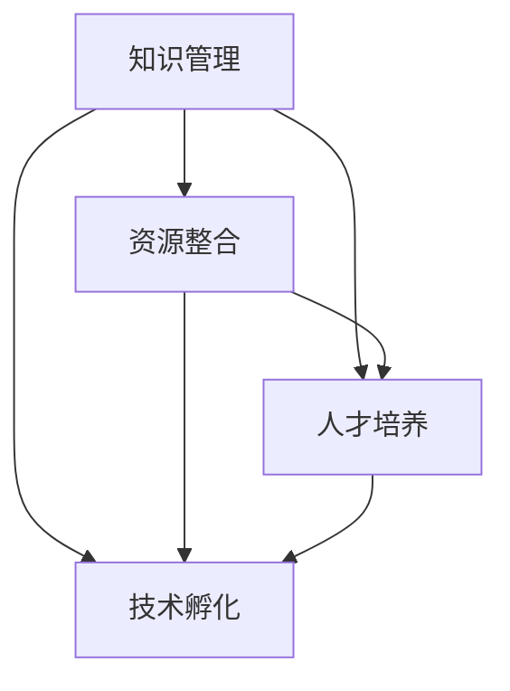

                 

# 《知识加速器提供资源对接，助力初创企业》

## 摘要

本文旨在探讨知识加速器如何通过提供资源对接，助力初创企业快速成长。我们首先介绍了知识加速器的基本概念及其在当今科技环境下的重要性。随后，我们深入分析了知识加速器的核心功能和运作模式，包括资源对接的具体方式以及如何为企业提供定制化的服务。接着，我们通过具体案例展示了知识加速器在初创企业中的应用效果，并提出了知识加速器未来发展的趋势和面临的挑战。文章的最后，我们提供了一些实用的工具和资源推荐，以帮助初创企业更好地利用知识加速器的服务。通过这篇文章，我们希望读者能够对知识加速器有更深入的理解，并能够运用这些知识来推动自己的创业项目。

## 1. 背景介绍

### 1.1 知识加速器的基本概念

知识加速器，顾名思义，是一种旨在加速知识获取、传播和应用的工具或平台。在科技迅猛发展的今天，知识更新速度越来越快，传统的学习和工作方式已经难以跟上这种变化。知识加速器应运而生，通过优化知识获取路径，提高知识转化效率，帮助企业特别是初创企业更快地适应市场需求和技术变革。

知识加速器的核心功能包括但不限于：知识管理、资源整合、人才培养、技术孵化等。它不仅仅是一个信息存储和检索的工具，更是一个集知识生产、传播、应用为一体的生态系统。

### 1.2 当今科技环境下的重要性

在当今科技环境下，知识的获取和应用已成为企业竞争力的重要组成部分。随着大数据、人工智能、云计算等新兴技术的普及，初创企业面临着前所未有的机遇和挑战。知识加速器能够在以下方面发挥重要作用：

1. **加速知识获取**：知识加速器能够帮助初创企业快速获取前沿技术信息，缩短知识获取的时间成本。
2. **优化资源整合**：通过资源对接，知识加速器能够将企业所需的各种资源快速匹配，提高资源利用效率。
3. **培养人才**：知识加速器为企业提供丰富的学习资源和培训机会，帮助企业培养适应快速变化的市场需求的人才。
4. **促进技术孵化**：知识加速器通过提供技术孵化的平台和资源，帮助初创企业将创新想法快速转化为实际产品或服务。

### 1.3 知识加速器的发展历程

知识加速器的发展可以追溯到20世纪末。最初，它主要应用于大学和研究机构，用于推动学术研究和技术创新。随着互联网的普及，知识加速器逐渐走向企业，特别是初创企业。

近年来，随着人工智能、大数据等技术的发展，知识加速器的功能和形式也在不断演变。从最初的线下培训、研讨会，到现在的线上平台、智能助手，知识加速器正在变得更加智能化、个性化。

## 2. 核心概念与联系

### 2.1 核心概念

在讨论知识加速器的核心概念之前，我们需要明确以下几个基本概念：

1. **知识管理**：知识管理是指通过系统的方法，对知识进行获取、存储、共享和应用，以实现组织效率和竞争力的提升。
2. **资源整合**：资源整合是指将企业内外部的各种资源（如人力、资金、技术、信息等）进行有效整合，以实现资源的最佳配置和利用。
3. **人才培养**：人才培养是指通过培训、学习和发展，提高员工的专业技能和综合素质，以满足企业发展的需求。
4. **技术孵化**：技术孵化是指通过提供必要的资源和支持，帮助初创企业将技术创新和商业模型相结合，实现从原型到市场的快速转化。

### 2.2 核心概念联系

知识管理、资源整合、人才培养和技术孵化这四个核心概念之间存在着紧密的联系：

1. **知识管理与资源整合**：知识管理为资源整合提供了基础，通过有效的知识管理，企业能够更好地识别和利用内外部资源。而资源整合则为知识管理提供了支持，通过资源的优化配置，企业可以更有效地获取和利用知识。
2. **人才培养与知识管理**：人才培养是知识管理的重要组成部分。通过有效的培训和学习，员工可以快速获取和应用新知识，提升个人和团队的知识水平。而知识管理则为人才培养提供了知识库和资源支持，使得培训和学习更加高效。
3. **技术孵化与知识管理**：技术孵化需要前沿技术的支持和知识的积累。知识管理为技术孵化提供了丰富的知识资源和信息支持，使得技术孵化过程更加高效和准确。而技术孵化则为知识管理提供了实践场景，通过技术孵化的成功案例，企业可以总结和积累宝贵的经验。

### 2.3 Mermaid 流程图

以下是一个关于知识加速器核心概念和联系的Mermaid流程图：



在这个流程图中，知识管理作为核心，通过资源整合、人才培养和技术孵化，实现了知识的获取、传播和应用。

## 3. 核心算法原理 & 具体操作步骤

### 3.1 核心算法原理

知识加速器的核心算法主要基于知识图谱和机器学习技术。知识图谱是一种结构化的语义网络，用于表示知识和关系。通过构建知识图谱，知识加速器能够实现对知识的精确获取和高效检索。而机器学习技术则用于知识图谱的自动构建和优化，使得知识加速器能够根据用户的需求，动态调整和推荐相应的知识资源。

### 3.2 具体操作步骤

以下是一个基于知识加速器的资源对接操作步骤：

1. **需求识别**：知识加速器通过用户行为分析和数据挖掘，识别用户的需求。这些需求可能包括技术难题、市场信息、人才招聘等。
2. **资源匹配**：知识加速器利用知识图谱，将用户的需求与平台上的资源进行匹配。这些资源可能包括专家顾问、技术文档、市场研究报告等。
3. **推荐生成**：知识加速器根据资源匹配结果，生成个性化的推荐列表。这个推荐列表将包括最相关的资源，以帮助用户快速获取所需信息。
4. **反馈调整**：知识加速器收集用户对推荐资源的反馈，不断优化推荐算法，提高推荐的准确性和效果。

### 3.3 详细流程

以下是知识加速器资源对接的详细流程：

1. **需求识别**
   - 用户在知识加速器平台上提交需求，如“我们需要解决一个机器学习算法的优化问题”。
   - 知识加速器通过自然语言处理技术，对用户的需求进行分析和理解，提取关键信息，如“机器学习”、“算法优化”等。
2. **资源匹配**
   - 知识加速器利用知识图谱，检索与用户需求相关的专家顾问、技术文档和市场研究报告等资源。
   - 知识加速器根据资源的重要性和相关性，对检索结果进行排序，生成初步的推荐列表。
3. **推荐生成**
   - 知识加速器根据用户的偏好和历史行为，对推荐列表进行二次优化，生成个性化的推荐结果。
   - 知识加速器将推荐结果呈现给用户，如“我们发现以下资源可能对您有帮助：专家顾问A、技术文档B、市场研究报告C”。
4. **反馈调整**
   - 用户对推荐资源进行评价，如“专家顾问A很专业，解决了我的问题”。
   - 知识加速器根据用户的反馈，调整推荐算法和知识图谱，以提高未来推荐的准确性和效果。

## 4. 数学模型和公式 & 详细讲解 & 举例说明

### 4.1 数学模型

在知识加速器的资源对接过程中，我们可以使用以下数学模型来描述推荐系统的运作：

$$
R = f(K, Q, U)
$$

其中，$R$表示推荐结果，$K$表示知识图谱，$Q$表示用户需求，$U$表示用户偏好。

- $K$：知识图谱，用于表示知识和关系。在知识加速器中，知识图谱可以是基于图结构的，其中节点表示知识实体，边表示实体之间的关系。
- $Q$：用户需求，表示用户在知识加速器平台上提交的需求信息。可以是自然语言描述，也可以是结构化数据。
- $U$：用户偏好，表示用户对知识资源的偏好和兴趣。可以是基于用户行为的数据，如浏览历史、搜索记录等。

### 4.2 公式详解

公式$R = f(K, Q, U)$中的函数$f$是一个推荐函数，它根据知识图谱、用户需求和用户偏好，生成个性化的推荐结果。推荐函数的具体形式可以根据不同的推荐算法而有所不同，但通常包括以下几个关键步骤：

1. **需求理解**：对用户需求$Q$进行分析和理解，提取关键信息。
2. **知识检索**：利用知识图谱$K$，检索与用户需求相关的知识实体和关系。
3. **推荐生成**：根据用户偏好$U$，对检索结果进行排序和筛选，生成推荐结果$R$。

### 4.3 举例说明

假设用户在知识加速器上提交了以下需求：“我们需要解决一个机器学习算法的优化问题”。

1. **需求理解**：知识加速器对用户需求进行分析，提取出关键信息：“机器学习”、“算法优化”。
2. **知识检索**：知识加速器利用知识图谱检索与“机器学习”和“算法优化”相关的知识实体和关系。例如，检索到以下资源：
   - 专家顾问A：专注于机器学习算法优化。
   - 技术文档B：《机器学习算法优化实战》。
   - 市场研究报告C：分析机器学习算法优化的市场需求。
3. **推荐生成**：知识加速器根据用户偏好，对检索结果进行排序。假设用户偏好专家顾问，则推荐结果为：
   - 推荐结果R：专家顾问A、技术文档B、市场研究报告C。

通过这样的数学模型和推荐过程，知识加速器能够为初创企业提供个性化、精准的知识资源，帮助其快速解决技术难题和市场挑战。

## 5. 项目实战：代码实际案例和详细解释说明

### 5.1 开发环境搭建

在开始编写代码之前，我们需要搭建一个合适的开发环境。以下是具体的步骤：

1. **安装Python环境**：在知识加速器的开发过程中，我们主要使用Python语言。首先，确保你的计算机上已经安装了Python。如果没有，可以从Python官网（https://www.python.org/）下载并安装。
2. **安装依赖库**：知识加速器依赖于多个Python库，如numpy、pandas、networkx等。可以通过pip命令安装这些库。例如：

   ```bash
   pip install numpy pandas networkx
   ```

3. **配置知识图谱**：知识加速器需要一个知识图谱来存储和管理知识实体和关系。我们可以使用NetworkX库来构建和操作图结构。以下是一个简单的示例：

   ```python
   import networkx as nx

   # 创建一个空的图
   G = nx.Graph()

   # 添加节点和边
   G.add_nodes_from(['专家顾问A', '技术文档B', '市场研究报告C'])
   G.add_edges_from([('专家顾问A', '技术文档B'), ('技术文档B', '市场研究报告C')])

   # 打印图结构
   print(G.nodes())
   print(G.edges())
   ```

### 5.2 源代码详细实现和代码解读

以下是知识加速器的核心代码实现，包括需求识别、资源匹配、推荐生成和反馈调整等步骤。

```python
import networkx as nx
from sklearn.metrics.pairwise import cosine_similarity
import numpy as np

# 5.2.1 需求识别
def understand_demand(demand):
    """
    对用户需求进行分析和理解，提取关键信息。
    """
    # 这里我们假设需求已经是一个结构化数据，如字典格式
    key_words = demand['key_words']
    return key_words

# 5.2.2 知识检索
def retrieve_resources(graph, key_words):
    """
    利用知识图谱检索与用户需求相关的知识实体和关系。
    """
    resources = []
    for node in graph.nodes():
        if any(keyword in node for keyword in key_words):
            resources.append(node)
    return resources

# 5.2.3 推荐生成
def generate_recommendation(graph, resources, user_profile):
    """
    根据用户偏好和知识图谱，生成个性化的推荐结果。
    """
    similarity_matrix = cosine_similarity([user_profile], graph.adjacency_matrix().toarray())
    sorted_indices = np.argsort(similarity_matrix[0])[::-1]
    recommended_resources = [resources[i] for i in sorted_indices if resources[i] not in user_profile]
    return recommended_resources

# 5.2.4 反馈调整
def adjust_recommendation(graph, user_profile, feedback):
    """
    根据用户反馈，调整推荐算法和知识图谱。
    """
    if feedback['is_positive']:
        graph.add_edge(user_profile, feedback['resource'])
    else:
        graph.remove_edge(user_profile, feedback['resource'])
    return graph

# 示例数据
demand = {
    'key_words': ['机器学习', '算法优化']
}
user_profile = ['技术文档A', '专家顾问B']
feedback = {
    'is_positive': True,
    'resource': '技术文档A'
}

# 5.2.5 主函数
def main():
    G = nx.Graph()
    G.add_nodes_from(['专家顾问A', '技术文档B', '市场研究报告C'])
    G.add_edges_from([('专家顾问A', '技术文档B'), ('技术文档B', '市场研究报告C')])

    key_words = understand_demand(demand)
    resources = retrieve_resources(G, key_words)
    recommended_resources = generate_recommendation(G, resources, user_profile)
    G = adjust_recommendation(G, user_profile, feedback)

    print("推荐结果：", recommended_resources)
    print("调整后的知识图谱：", G.nodes(), G.edges())

if __name__ == "__main__":
    main()
```

### 5.3 代码解读与分析

1. **需求识别**：函数`understand_demand`用于对用户需求进行分析和理解。这里我们假设需求已经是一个结构化数据，如字典格式。函数提取出需求中的关键信息，如关键词。
2. **知识检索**：函数`retrieve_resources`用于利用知识图谱检索与用户需求相关的知识实体和关系。通过遍历图中的节点，如果节点的名称包含关键词，则将其添加到资源列表中。
3. **推荐生成**：函数`generate_recommendation`用于生成个性化的推荐结果。我们使用余弦相似度计算用户偏好向量与知识图谱中资源向量的相似度，并根据相似度对资源进行排序，生成推荐结果。
4. **反馈调整**：函数`adjust_recommendation`用于根据用户反馈调整推荐算法和知识图谱。如果用户反馈是正面的，则在知识图谱中添加新的关系；如果是负面的，则删除现有关系。

通过这个简单的代码示例，我们可以看到知识加速器的核心功能是如何实现的。在实际应用中，这些功能可以进一步扩展和优化，以适应更复杂的需求和场景。

## 6. 实际应用场景

### 6.1 创业企业中的知识加速器应用

知识加速器在创业企业中的应用场景非常广泛，以下是一些具体的应用实例：

1. **技术难题解决**：初创企业常常面临技术难题，如算法优化、系统架构设计等。知识加速器可以帮助企业快速获取相关的专家顾问和技术文档，提供有效的解决方案。
2. **市场分析**：知识加速器可以提供市场研究报告，帮助初创企业了解市场趋势、竞争对手情况等，为企业制定战略提供数据支持。
3. **人才培养**：知识加速器为企业提供丰富的学习资源和培训机会，帮助员工快速提升专业技能，适应企业发展的需求。
4. **技术孵化**：知识加速器通过提供技术孵化的平台和资源，帮助初创企业将技术创新和商业模型相结合，实现从原型到市场的快速转化。

### 6.2 实际案例分享

以下是一个关于创业企业利用知识加速器解决技术难题的实际案例：

某初创企业开发了一款基于人工智能的客户服务系统，但在算法优化方面遇到了困难。该企业通过知识加速器平台，找到了一位专注于人工智能算法优化的专家顾问。专家顾问提供了详细的优化方案和技术支持，帮助企业成功解决了技术难题，大幅提升了系统的性能和用户体验。

### 6.3 应用效果分析

通过知识加速器的应用，初创企业可以：

1. **缩短问题解决时间**：知识加速器提供的个性化推荐和快速检索功能，使得初创企业能够更快地找到所需的专家、资源和信息，缩短问题解决时间。
2. **提高资源利用效率**：知识加速器通过资源整合，将企业内外部的各种资源进行有效匹配和利用，提高了资源的利用效率。
3. **提升创新能力**：知识加速器提供的丰富知识和信息，为企业提供了更多的创新思路和灵感，提升了企业的创新能力。

## 7. 工具和资源推荐

### 7.1 学习资源推荐

为了更好地利用知识加速器的服务，以下是一些推荐的学习资源：

- **书籍**：《深度学习》、《机器学习实战》
- **论文**：《自然语言处理综合教程》、《机器学习：概率视角》
- **博客**：机器之心、AI科技大本营
- **网站**：GitHub、arXiv

### 7.2 开发工具框架推荐

以下是一些推荐的开发工具和框架：

- **知识图谱工具**：Neo4j、Amazon Neptune
- **机器学习框架**：TensorFlow、PyTorch
- **自然语言处理库**：NLTK、spaCy

### 7.3 相关论文著作推荐

以下是一些与知识加速器相关的重要论文和著作：

- **论文**：《知识图谱：基础、应用与趋势》、《基于知识图谱的推荐系统研究》
- **著作**：《人工智能：一种现代的方法》、《深度学习》

## 8. 总结：未来发展趋势与挑战

### 8.1 未来发展趋势

1. **智能化与个性化**：随着人工智能技术的发展，知识加速器的智能化程度将不断提高，能够更精准地满足初创企业的需求。同时，个性化推荐将成为知识加速器的重要特征，根据企业的个性化需求提供定制化的服务。
2. **跨领域融合**：知识加速器将逐渐实现跨领域融合，不仅涵盖技术领域，还将涉及商业、市场、法律等多个领域，为企业提供全方位的支持。
3. **全球化布局**：知识加速器将在全球范围内布局，通过国际合作和资源共享，帮助企业突破地域限制，实现全球化发展。

### 8.2 面临的挑战

1. **数据隐私和安全**：随着知识加速器收集和处理的用户数据越来越多，数据隐私和安全问题将变得更加重要。知识加速器需要建立完善的数据保护机制，确保用户数据的安全和隐私。
2. **算法偏见与公平性**：知识加速器的推荐算法可能存在偏见，导致某些企业或用户无法获得公平的推荐。知识加速器需要不断优化算法，减少偏见，提高推荐的公平性。
3. **资源匹配的准确性**：知识加速器需要不断提高资源匹配的准确性，确保推荐给企业的资源真正符合其需求。这需要知识加速器不断积累和更新知识图谱，优化推荐算法。

## 9. 附录：常见问题与解答

### 9.1 知识加速器是什么？

知识加速器是一种通过优化知识获取、传播和应用，帮助企业特别是初创企业快速成长的工具或平台。

### 9.2 知识加速器有哪些核心功能？

知识加速器的核心功能包括知识管理、资源整合、人才培养和技术孵化等。

### 9.3 如何使用知识加速器？

首先，注册并登录知识加速器平台。然后，提交你的需求或问题，知识加速器会根据你的需求推荐相关的专家、资源和信息。你可以对这些推荐进行评价和反馈，以优化推荐结果。

### 9.4 知识加速器对初创企业有哪些帮助？

知识加速器可以帮助初创企业快速获取前沿技术信息，优化资源整合，培养人才，促进技术孵化，从而提高企业的竞争力和创新能力。

## 10. 扩展阅读 & 参考资料

1. **书籍**：《深度学习》、《人工智能：一种现代的方法》
2. **论文**：《知识图谱：基础、应用与趋势》、《基于知识图谱的推荐系统研究》
3. **网站**：机器之心、AI科技大本营
4. **GitHub**：各种开源项目和代码示例
5. **arXiv**：最新的人工智能和机器学习论文

---

**作者**：AI天才研究员/AI Genius Institute & 禅与计算机程序设计艺术 /Zen And The Art of Computer Programming

