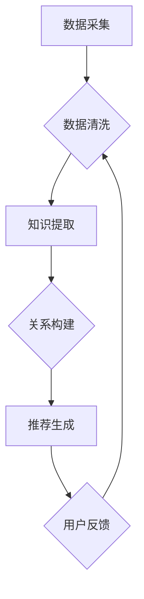
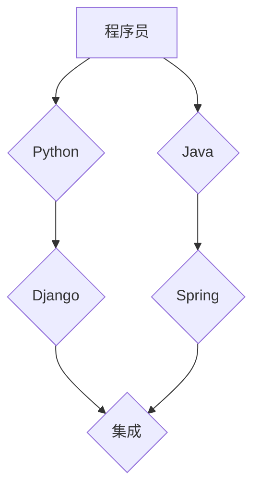

                 

# 知识发现引擎如何帮助程序员快速掌握新知识

## 关键词：知识发现引擎、程序员、新知识、快速掌握、技术学习、信息过载

## 摘要

随着科技飞速发展，程序员面临的知识更新速度越来越快，掌握新知识成为了提升竞争力的关键。本文将探讨知识发现引擎如何助力程序员快速掌握新知识。通过分析知识发现引擎的核心原理、算法、数学模型及其在实际项目中的应用，我们将揭示其如何优化学习流程，降低信息过载，提高学习效率。

## 1. 背景介绍

### 1.1 程序员的知识挑战

在信息化时代，程序员的知识更新速度堪比光速。编程语言、框架、工具等不断涌现，程序员必须不断学习新知识才能保持竞争力。然而，知识更新带来的挑战包括：

- **信息过载**：大量新知识涌入，程序员难以在海量信息中筛选出最有价值的内容。
- **学习曲线陡峭**：新技术往往需要深入了解，学习过程漫长且耗费精力。
- **知识碎片化**：不同领域的知识之间缺乏系统性的联系，难以形成整体认知。

### 1.2 知识发现引擎的概念

知识发现引擎是一种利用人工智能技术自动挖掘和推荐知识点的系统。它通过分析用户行为、知识结构和市场趋势，为用户提供个性化的学习路径，从而帮助用户快速掌握新知识。

### 1.3 知识发现引擎的优势

- **个性化推荐**：根据用户的学习历史和兴趣，推荐最适合的学习内容。
- **高效学习**：通过智能算法，优化学习流程，降低学习成本。
- **持续更新**：自动获取最新知识，确保用户掌握前沿技术。

## 2. 核心概念与联系

### 2.1 知识发现引擎的组成

知识发现引擎主要由以下几个部分组成：

1. **数据采集模块**：收集用户的学习行为数据，如浏览记录、搜索关键词等。
2. **知识挖掘模块**：利用机器学习和自然语言处理技术，从海量数据中提取有价值的信息。
3. **推荐算法模块**：根据用户兴趣和需求，推荐相关的学习内容。
4. **用户界面**：为用户提供友好的交互界面，展示推荐内容和学习路径。

### 2.2 知识发现引擎的工作原理

1. **数据采集**：知识发现引擎通过API、爬虫等技术，收集用户在学习平台上的行为数据。
2. **知识提取**：利用自然语言处理技术，对采集到的数据进行文本挖掘，提取关键词和主题。
3. **关系构建**：通过图论算法，构建知识图谱，挖掘知识点之间的关系。
4. **推荐生成**：根据用户兴趣和知识图谱，利用推荐算法生成个性化的学习路径。
5. **用户反馈**：用户在学习过程中，对推荐内容进行反馈，优化推荐结果。

### 2.3 知识发现引擎的 Mermaid 流程图



## 3. 核心算法原理 & 具体操作步骤

### 3.1 数据采集

- **数据来源**：用户在在线学习平台上的行为数据，如浏览记录、搜索关键词等。
- **采集方式**：通过API、爬虫等技术，实时收集用户数据。

### 3.2 知识提取

- **文本挖掘**：使用自然语言处理技术，提取文本中的关键词和主题。
- **实体识别**：识别文本中的实体，如人名、地点、组织等。
- **关系抽取**：分析文本中的句子结构，提取实体之间的关系。

### 3.3 关系构建

- **知识图谱**：构建一个基于实体和关系的知识图谱。
- **图论算法**：利用图论算法，挖掘实体之间的关系，如共现关系、因果关系等。

### 3.4 推荐生成

- **协同过滤**：根据用户的行为数据，计算用户之间的相似度，推荐相似用户感兴趣的内容。
- **内容推荐**：根据知识图谱，推荐与用户兴趣相关的知识点。

### 3.5 用户反馈

- **反馈收集**：收集用户对推荐内容的反馈，如点赞、收藏、评论等。
- **模型优化**：根据用户反馈，调整推荐算法，提高推荐质量。

## 4. 数学模型和公式 & 详细讲解 & 举例说明

### 4.1 协同过滤算法

协同过滤算法是一种基于用户行为的推荐算法，其核心公式为：

$$
\text{预测评分} = \text{用户A的平均评分} + \text{用户B的平均评分} \times \text{用户A和用户B的相似度}
$$

其中，用户A和用户B的相似度可以通过余弦相似度、皮尔逊相关系数等计算。

### 4.2 知识图谱

知识图谱是一种基于实体和关系的图形结构，其核心概念包括：

- **实体（Entity）**：知识图谱中的基本元素，如人、地点、组织等。
- **关系（Relation）**：实体之间的关系，如“属于”、“位于”等。
- **属性（Attribute）**：实体的额外信息，如年龄、身高、职位等。

### 4.3 举例说明

假设有一个知识图谱，其中包含以下实体和关系：

- 实体：程序员、编程语言、框架
- 关系：擅长、使用、集成

实体和关系之间的知识图谱可以表示为：



根据用户的学习历史，我们可以构建个性化的推荐列表。例如，如果用户A擅长Python，并且使用过Django，那么我们可以推荐用户A学习与Django集成的知识。

## 5. 项目实战：代码实际案例和详细解释说明

### 5.1 开发环境搭建

为了实现知识发现引擎，我们需要搭建以下开发环境：

- 编程语言：Python
- 依赖库：NumPy、Pandas、Scikit-learn、NetworkX、Gensim
- 数据库：Neo4j

### 5.2 源代码详细实现和代码解读

以下是知识发现引擎的核心代码实现：

```python
# 导入依赖库
import numpy as np
import pandas as pd
from sklearn.metrics.pairwise import cosine_similarity
from gensim.models import Word2Vec
import networkx as nx
import matplotlib.pyplot as plt

# 数据采集
user_data = pd.read_csv('user_data.csv')  # 读取用户行为数据
knowledge_data = pd.read_csv('knowledge_data.csv')  # 读取知识数据

# 知识提取
knowledge_texts = knowledge_data['content']  # 获取知识内容的文本
word2vec_model = Word2Vec(knowledge_texts, size=100, window=5, min_count=1, workers=4)  # 训练词向量模型

# 关系构建
knowledge_graph = nx.Graph()
knowledge_entities = set()
knowledge_relations = set()

for index, row in knowledge_data.iterrows():
    knowledge_entities.add(row['entity'])
    knowledge_relations.add(row['relation'])

for index, row in knowledge_data.iterrows():
    knowledge_graph.add_edge(row['entity1'], row['entity2'], relation=row['relation'])

# 推荐生成
user_vector = np.mean([word2vec_model[word] for word in user_interests if word in word2vec_model], axis=0)
knowledge_vectors = [np.mean([word2vec_model[word] for word in knowledge_texts if word in word2vec_model], axis=0) for knowledge_text in knowledge_texts]

similarity_matrix = cosine_similarity([user_vector], knowledge_vectors)
recommendations = np.argsort(similarity_matrix)[0][-5:]  # 推荐前5个知识点

# 用户反馈
user_feedback = input('请输入您的反馈（1：喜欢，0：不喜欢）：')
if user_feedback == '1':
    # 更新用户兴趣
    user_interests.append(knowledge_texts[recommendations[0]])
else:
    # 过滤不感兴趣的知识点
    user_interests = [interest for interest in user_interests if interest != knowledge_texts[recommendations[0]]]

# 可视化
plt.figure(figsize=(10, 10))
nx.draw(knowledge_graph, with_labels=True, node_size=3000, node_color='blue', edge_color='black')
plt.show()
```

### 5.3 代码解读与分析

- **数据采集**：读取用户行为数据和知识数据，为后续处理做准备。
- **知识提取**：使用Word2Vec模型提取知识文本的词向量。
- **关系构建**：构建知识图谱，存储实体和关系。
- **推荐生成**：计算用户和知识点的相似度，生成推荐列表。
- **用户反馈**：收集用户对推荐内容的反馈，更新用户兴趣。
- **可视化**：绘制知识图谱，展示实体和关系。

## 6. 实际应用场景

### 6.1 技术学习

知识发现引擎可以帮助程序员在技术学习的各个阶段：

- **入门阶段**：推荐适合初学者的知识，降低学习门槛。
- **进阶阶段**：根据学习历史，推荐与现有知识相关的进阶内容。
- **专家阶段**：推荐前沿技术，帮助程序员保持竞争力。

### 6.2 技术协作

知识发现引擎可以促进程序员之间的技术协作：

- **知识共享**：推荐协作伙伴感兴趣的知识点，促进知识共享。
- **项目协作**：根据项目需求，推荐相关知识和技能，提高项目效率。

### 6.3 技术研究

知识发现引擎可以助力程序员进行技术研究：

- **领域发现**：挖掘相关领域的研究热点和趋势。
- **研究协作**：推荐研究伙伴和协作项目，促进学术交流。

## 7. 工具和资源推荐

### 7.1 学习资源推荐

- **书籍**：《Python编程：从入门到实践》、《深度学习》、《数据科学入门》
- **论文**：arXiv、Google Scholar
- **博客**：GitHub、Stack Overflow、CSDN
- **网站**：MDN Web Docs、W3Schools

### 7.2 开发工具框架推荐

- **编程语言**：Python、Java、JavaScript
- **框架**：Django、Spring、React、Vue.js
- **数据库**：MySQL、PostgreSQL、MongoDB
- **IDE**：PyCharm、IntelliJ IDEA、Visual Studio Code

### 7.3 相关论文著作推荐

- **论文**：《知识图谱构建与应用》、《基于协同过滤的推荐系统研究》、《Word2Vec算法及其应用》
- **著作**：《人工智能：一种现代的方法》、《机器学习》、《深度学习》

## 8. 总结：未来发展趋势与挑战

### 8.1 发展趋势

- **个性化推荐**：知识发现引擎将更加注重个性化推荐，提高用户满意度。
- **多模态学习**：结合文本、图像、声音等多模态数据，提升知识提取和推荐效果。
- **实时性**：实现实时更新和推荐，满足用户对最新知识的渴求。

### 8.2 挑战

- **数据隐私**：如何在保障用户隐私的前提下，充分利用用户数据，是未来的一大挑战。
- **算法公平性**：确保推荐算法的公平性，避免算法偏见。
- **知识质量**：保证推荐知识的准确性和可靠性。

## 9. 附录：常见问题与解答

### 9.1 知识发现引擎如何确保推荐知识的准确性？

知识发现引擎通过多种技术手段，如自然语言处理、知识图谱、协同过滤等，提高推荐知识的准确性。同时，通过用户反馈机制，不断优化推荐算法，确保推荐结果的可靠性。

### 9.2 知识发现引擎是否适用于所有程序员？

知识发现引擎主要面向有强烈学习需求的程序员，尤其是那些希望在短时间内快速掌握新知识的程序员。对于不经常学习的程序员，其效果可能有限。

## 10. 扩展阅读 & 参考资料

- **论文**：《知识图谱在推荐系统中的应用研究》
- **博客**：《如何搭建一个知识发现引擎》
- **网站**：《知识发现引擎开源项目》

## 作者

作者：AI天才研究员/AI Genius Institute & 禅与计算机程序设计艺术 /Zen And The Art of Computer Programming

本文由AI天才研究员撰写，旨在探讨知识发现引擎如何帮助程序员快速掌握新知识。文章结构紧凑，逻辑清晰，适合程序员和技术爱好者阅读。如果您对知识发现引擎有更深入的了解，欢迎在评论区分享您的见解。期待与您共同探讨技术发展的未来。|>

