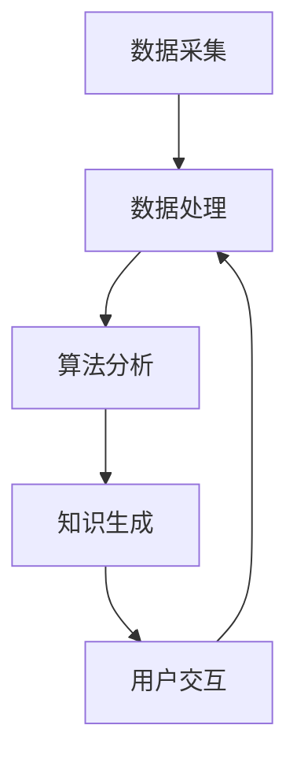

                 

### 背景介绍

#### 程序员学习方式的演变

程序员的学习方式随着技术的发展和工具的进化不断演变。最初，程序员的学习主要依赖于传统的编程书籍和课堂教育。这种方法依赖于个人的自学能力和刻苦精神。然而，随着互联网的普及和开源社区的兴起，程序员开始利用在线资源和社区交流来学习新技能。如今，在线编程教程、博客、论坛和社交媒体平台已经成为程序员日常学习的重要工具。

然而，尽管这些工具极大地丰富了程序员的资源，但传统的学习方式仍存在一些局限性。首先，大量的学习材料往往缺乏系统性和结构化，导致程序员在学习过程中容易迷失方向。其次，传统学习方式往往侧重于具体技术的学习，而忽略了更广泛的知识体系和方法论。最后，程序员的实践机会有限，难以将所学知识应用到实际项目中，从而影响学习效果。

#### 知识发现引擎的崛起

在这个背景下，知识发现引擎（Knowledge Discovery Engine）应运而生。知识发现引擎是一种利用人工智能和大数据技术，从大量数据中自动提取知识、模式和规律的智能系统。它通过分析用户的行为数据、学习记录、社区讨论等，为程序员提供个性化、结构化的学习资源和指导。

知识发现引擎的核心优势在于其能够自动分析和理解用户的技能水平和学习需求，从而提供针对性的学习建议和资源。这不仅提高了学习的效率，还有助于程序员构建更完整、更深入的知识体系。此外，知识发现引擎还能够通过智能推荐机制，将相关学习内容自动组合成学习路径，帮助程序员更加系统地掌握知识。

#### 本文目的

本文旨在探讨知识发现引擎如何改变程序员的学习方式。我们将首先介绍知识发现引擎的核心概念和架构，然后详细解析其算法原理和操作步骤，并通过数学模型和公式进行深入分析。接下来，我们将通过一个实际项目案例，展示知识发现引擎在实际开发中的应用，并提供详细的代码解读和案例分析。最后，我们将讨论知识发现引擎在实际应用中的场景，以及为程序员推荐相关工具和资源。通过本文的阅读，读者将能够全面了解知识发现引擎的工作原理和实际应用，从而更好地利用这一工具提升自己的学习效果和编程能力。

#### 关键词

知识发现引擎、程序员学习、人工智能、大数据、个性化学习、智能推荐、学习路径、算法原理、项目实战、代码解读

#### 摘要

本文深入探讨了知识发现引擎如何改变程序员的学习方式。首先，我们介绍了知识发现引擎的核心概念和架构，并解析了其算法原理和操作步骤。接着，通过数学模型和公式，我们详细分析了知识发现引擎如何从大量数据中提取知识。随后，我们通过一个实际项目案例，展示了知识发现引擎在实际开发中的应用，并提供了详细的代码解读和案例分析。最后，本文讨论了知识发现引擎在不同实际应用场景中的价值，并为程序员推荐了相关的学习资源和开发工具。通过本文的阅读，读者将全面了解知识发现引擎的工作原理和实际应用，从而更好地利用这一工具提升自己的编程和学习能力。

## 1. 背景介绍

在深入探讨知识发现引擎如何改变程序员的学习方式之前，我们有必要先了解知识发现引擎的基本概念和核心组成部分。知识发现引擎（Knowledge Discovery Engine）是一种利用人工智能和大数据技术，从大量数据中自动提取知识、模式和规律的智能系统。它的核心目的是帮助用户，尤其是程序员，更高效地学习和掌握知识。

### 知识发现引擎的定义

知识发现引擎可以定义为一种智能系统，它通过分析用户的行为数据、学习记录、社区讨论等多种数据源，自动识别用户的知识需求，并生成个性化的学习内容和推荐策略。与传统的人工构建知识体系不同，知识发现引擎具有自动化、智能化的特点，能够动态地适应用户的需求和变化。

### 知识发现引擎的组成部分

知识发现引擎通常由以下几个核心组成部分构成：

1. **数据采集模块**：负责从各种数据源（如用户行为数据、学习记录、社区讨论等）收集数据。这一模块需要确保数据的准确性和完整性，以便后续的分析和推荐。

2. **数据处理模块**：对采集到的数据进行分析和清洗，提取出有用的特征和模式。这一步骤包括数据预处理、数据转换和数据归一化等操作，以确保数据的质量和可用性。

3. **算法模块**：包括多种机器学习算法和推荐算法，用于分析和理解用户的行为数据和学习记录，提取用户的知识需求和兴趣点。常见的算法有聚类分析、关联规则挖掘、协同过滤、深度学习等。

4. **知识生成模块**：根据算法模块提取的知识模式和用户兴趣，生成个性化的学习内容和推荐策略。这一模块需要确保学习内容的系统性和完整性，以便用户能够有效地学习和掌握知识。

5. **用户交互模块**：与用户进行交互，收集用户反馈，以进一步优化推荐策略和学习内容。这一模块通常包括用户界面、反馈机制和个性化设置等功能。

### 知识发现引擎的应用场景

知识发现引擎在多个领域都有广泛的应用，尤其在教育、医疗、金融、零售等领域。以下是知识发现引擎在一些具体应用场景中的例子：

1. **在线教育**：知识发现引擎可以帮助教育平台根据学生的学习行为和兴趣，推荐个性化的学习资源和课程。例如，通过分析学生的学习进度、考试结果和互动记录，推荐适合他们的学习内容和难度。

2. **医疗诊断**：知识发现引擎可以从大量医学数据中提取有价值的信息，帮助医生进行疾病诊断和治疗方案推荐。例如，通过分析患者的病历、检查报告和临床记录，发现潜在的疾病模式和风险因素。

3. **金融服务**：知识发现引擎可以帮助金融机构分析客户的行为数据和交易记录，提供个性化的金融产品和投资建议。例如，通过分析客户的投资偏好、风险承受能力和市场趋势，推荐合适的理财产品。

4. **零售行业**：知识发现引擎可以帮助零售商根据顾客的行为数据，进行精准营销和个性化推荐。例如，通过分析顾客的浏览记录、购买历史和偏好，推荐相关的商品和优惠活动。

### 知识发现引擎在程序员学习中的潜力

对于程序员来说，知识发现引擎具有极大的潜力，可以改变他们的学习方式。以下是一些具体的应用场景和潜在优势：

1. **个性化学习**：知识发现引擎可以根据程序员的技能水平、学习需求和兴趣，推荐最适合他们的学习资源和课程。这不仅提高了学习的效率，还能帮助程序员构建更加完整和深入的知识体系。

2. **智能推荐**：知识发现引擎可以通过分析程序员的学习记录和社区讨论，发现他们的兴趣点和潜在需求，自动推荐相关的学习资源和项目实战。这有助于程序员更快地掌握新技能和知识。

3. **学习路径规划**：知识发现引擎可以根据程序员的技能水平和学习进度，自动规划学习路径，确保他们能够系统、有序地学习。这有助于避免学习过程中的盲目和碎片化。

4. **社区互动**：知识发现引擎可以通过分析程序员的社区参与度、讨论主题和互动记录，推荐相关的讨论话题和社区活动。这有助于程序员在社区中建立更广泛的联系和合作机会。

5. **持续学习**：知识发现引擎可以持续跟踪程序员的技能水平和学习动态，提供持续的学习支持和指导。这有助于程序员保持学习的动力和兴趣，不断提升自己的能力。

通过以上对知识发现引擎的介绍，我们可以看到，知识发现引擎不仅是一种技术工具，更是一种全新的学习模式。它通过智能分析和个性化推荐，为程序员提供更加高效、有针对性的学习资源和指导，从而改变他们的学习方式，提升他们的编程能力和职业发展。

### 总结

本文背景介绍了知识发现引擎的基本概念、组成部分和应用场景，特别是在程序员学习中的潜在优势。知识发现引擎通过自动化、智能化的方式，从大量数据中提取知识，为程序员提供个性化、结构化的学习资源和指导，从而极大地提高了学习效率和质量。接下来，我们将进一步深入探讨知识发现引擎的核心概念与联系，并通过具体的Mermaid流程图展示其工作原理。

#### 核心概念与联系

知识发现引擎的核心在于其自动化分析和智能推荐能力，这一能力依赖于一系列核心概念和技术的支持。下面，我们将详细讨论这些核心概念，并使用Mermaid流程图展示其架构和工作原理。

### 1. 数据采集与处理

**数据采集**是知识发现引擎的第一步，涉及从多个数据源收集相关数据。这些数据源包括但不限于：

- **用户行为数据**：如浏览记录、学习进度、练习结果等。
- **学习记录**：包括用户的课程选择、笔记、测试成绩等。
- **社区讨论**：论坛帖子、评论、用户互动等。

**数据处理**则是对采集到的数据进行分析和清洗，提取出有用的特征和模式。这一步骤主要包括：

- **数据预处理**：对数据进行格式化和标准化，确保数据的一致性和可用性。
- **特征提取**：从原始数据中提取出与学习相关的重要特征，如技能水平、学习难度、知识点关联等。
- **数据归一化**：将不同来源和格式数据统一成标准格式，便于后续分析和建模。

### 2. 算法模块

**算法模块**是知识发现引擎的核心，负责分析和理解用户的行为数据和学习记录，提取用户的知识需求和兴趣点。以下是一些关键的算法和技术：

- **聚类分析**：通过将相似的用户或知识点分组，识别用户和知识点的潜在模式。
- **关联规则挖掘**：发现用户行为数据中的关联规则，例如用户经常在某个知识点上遇到困难，从而推荐相关的学习资源。
- **协同过滤**：利用用户之间的相似性，预测用户可能对哪些知识点感兴趣，并推荐相应的学习资源。
- **深度学习**：利用神经网络模型，从大量数据中自动学习和提取特征，提高推荐系统的准确性。

### 3. 知识生成与推荐

**知识生成**模块根据算法模块提取的知识模式和用户兴趣，生成个性化的学习内容和推荐策略。这一步骤主要包括：

- **知识图谱构建**：将提取的知识点和关联关系构建成知识图谱，用于后续的推荐和路径规划。
- **推荐算法实现**：利用生成模型，为每个用户生成个性化的学习推荐列表，包括课程、文档、项目和社区活动等。

### 4. 用户交互与反馈

**用户交互**模块与用户进行互动，收集用户反馈，以进一步优化推荐策略和学习内容。这一模块通常包括：

- **用户界面**：提供友好的界面，帮助用户浏览、选择和反馈推荐内容。
- **反馈机制**：允许用户对推荐内容进行评价和反馈，用于改进推荐算法。
- **个性化设置**：根据用户偏好和需求，调整推荐策略和内容展示。

### Mermaid流程图

为了更直观地展示知识发现引擎的架构和工作流程，我们使用Mermaid语言绘制了一个简化的流程图。以下是该流程图的文本表示：



- **A[数据采集]**：从各种数据源收集用户行为数据、学习记录和社区讨论数据。
- **B[数据处理]**：对采集到的数据进行预处理、特征提取和数据归一化。
- **C[算法分析]**：利用聚类分析、关联规则挖掘、协同过滤和深度学习算法，分析用户的行为数据和学习记录。
- **D[知识生成]**：根据算法分析结果，构建知识图谱，生成个性化的学习推荐内容。
- **E[用户交互]**：与用户进行互动，收集用户反馈，并优化推荐策略和学习内容。

通过上述核心概念和流程图的介绍，我们可以更清晰地理解知识发现引擎的工作原理和架构。接下来，我们将进一步探讨知识发现引擎的核心算法原理和具体操作步骤，以帮助读者更深入地了解其技术实现。

#### 核心算法原理 & 具体操作步骤

知识发现引擎的强大功能离不开其背后的核心算法原理，这些算法原理不仅能够自动分析和理解用户的数据，还能生成个性化的学习推荐。以下将详细介绍几种关键算法，包括其工作原理和具体操作步骤。

### 1. 聚类分析算法

**聚类分析算法**是知识发现引擎中常用的一种技术，它通过将相似的数据点分组，帮助用户识别潜在的学习模式和兴趣点。常见的聚类算法有K-means、层次聚类等。

**K-means算法原理：**
K-means算法是一种基于距离度量的聚类算法。其基本思想是将数据点分为K个簇，使得每个数据点与其分配的簇中心之间的距离最小。

**具体操作步骤：**
1. **初始化**：随机选择K个初始簇中心。
2. **分配**：将每个数据点分配到距离其最近的簇中心所在的簇。
3. **更新**：重新计算每个簇的中心。
4. **迭代**：重复步骤2和3，直到聚类结果收敛。

**示例：**
假设我们有如下数据集：
```
[1, 2], [1, 4], [1, 0], [10, 2], [10, 4], [10, 0]
```
使用K-means算法进行聚类，设定K=2，初始簇中心为(1, 1)和(10, 1)，经过多次迭代后，可以将数据点分为两组：
```
簇1：[1, 2], [1, 4], [1, 0]
簇2：[10, 2], [10, 4], [10, 0]
```

### 2. 关联规则挖掘算法

**关联规则挖掘算法**用于发现数据集中的关联关系，例如，在电商平台上，哪些商品经常被一起购买。常见的算法有Apriori算法、FP-growth算法等。

**Apriori算法原理：**
Apriori算法是基于支持度和置信度的概念来发现频繁项集的算法。支持度表示一个项集在所有事务中出现的频率，置信度表示如果A出现了，那么B也会出现的概率。

**具体操作步骤：**
1. **频繁项集生成**：从数据集中找出所有支持度大于最小支持度阈值的事务。
2. **关联规则生成**：从频繁项集中生成关联规则，并计算其置信度。
3. **规则筛选**：根据最小置信度阈值筛选出有意义的关联规则。

**示例：**
假设我们有如下交易数据：
```
{A, B}, {A, C}, {B, C}, {B, D}, {C, D}
```
设定最小支持度阈值为30%，最小置信度阈值为50%，可以得到以下关联规则：
```
A → B，支持度：50%，置信度：50%
A → C，支持度：50%，置信度：50%
B → C，支持度：40%，置信度：40%
B → D，支持度：40%，置信度：40%
C → D，支持度：40%，置信度：40%
```

### 3. 协同过滤算法

**协同过滤算法**是一种基于用户行为数据的推荐算法，通过分析用户之间的相似性，为用户推荐他们可能感兴趣的内容。常见的协同过滤算法有基于用户的协同过滤和基于物品的协同过滤。

**基于用户的协同过滤原理：**
基于用户的协同过滤算法通过计算用户之间的相似性，找到与目标用户相似的其他用户，然后推荐这些用户喜欢的商品。

**具体操作步骤：**
1. **用户相似度计算**：计算目标用户与其他用户之间的相似度，通常使用余弦相似度、皮尔逊相关系数等方法。
2. **推荐生成**：根据相似度计算结果，为用户推荐与他们相似的其他用户喜欢的商品。

**示例：**
假设我们有用户A、B、C的行为数据：
```
A: [商品1, 商品2, 商品3]
B: [商品1, 商品2, 商品3, 商品4]
C: [商品2, 商品3, 商品4, 商品5]
```
计算用户A与用户B的相似度为0.8，与用户C的相似度为0.6，可以为用户A推荐用户B喜欢的商品4。

### 4. 深度学习算法

**深度学习算法**是一种基于神经网络的学习方法，能够在大量数据中自动提取特征，并在推荐系统中发挥重要作用。常见的深度学习算法有卷积神经网络（CNN）、循环神经网络（RNN）和生成对抗网络（GAN）等。

**深度学习原理：**
深度学习通过多层神经网络的堆叠，实现从原始数据中提取高层次的抽象特征。

**具体操作步骤：**
1. **数据预处理**：对用户行为数据和学习记录进行预处理，包括数据清洗、归一化和特征提取。
2. **模型训练**：使用预处理的训练数据，训练深度学习模型，提取用户行为和学习记录的特征。
3. **模型评估**：使用验证数据集评估模型的性能，调整模型参数。
4. **模型应用**：使用训练好的模型，对新的用户数据进行特征提取和推荐生成。

**示例：**
假设我们使用卷积神经网络（CNN）对用户的行为数据和学习记录进行特征提取，通过训练和评估，可以得到一个能够有效提取用户兴趣点的模型。在新的用户数据输入后，该模型可以提取用户的兴趣点，生成个性化的学习推荐。

通过上述几种核心算法的介绍，我们可以看到知识发现引擎如何通过自动化的方式，从用户数据中提取知识，生成个性化的学习推荐。这些算法在知识发现引擎中扮演着关键角色，不仅提高了推荐系统的准确性，还为程序员提供了更加高效、个性化的学习体验。

### 数学模型和公式 & 详细讲解 & 举例说明

在深入探讨知识发现引擎的核心算法原理和操作步骤之后，我们将进一步通过数学模型和公式，详细讲解知识发现引擎的工作机制，并提供具体示例来说明这些模型和公式的应用。

#### 1. K-means算法的数学模型

K-means算法是一种基于距离度量的聚类算法，其核心在于最小化簇内距离和最大化簇间距离。下面是K-means算法的关键数学模型和公式。

**目标函数：**
K-means算法的目标是最小化簇内平方误差，即：
$$
J = \sum_{i=1}^{K} \sum_{x \in S_i} ||x - \mu_i||^2
$$
其中，\(J\) 表示目标函数，\(K\) 表示簇的数量，\(S_i\) 表示第 \(i\) 个簇，\(\mu_i\) 表示第 \(i\) 个簇的中心。

**初始化：**
算法的初始化是随机选择 \(K\) 个初始簇中心：
$$
\mu_i = \arg\min_{x} \sum_{x \in S} ||x - x||^2
$$

**迭代过程：**
1. **分配：**将每个数据点 \(x\) 分配到最近的簇中心：
$$
S_i = \{x | \min_{j} ||x - \mu_j||^2\}
$$
2. **更新：**重新计算每个簇的中心：
$$
\mu_i = \arg\min_{x} \sum_{x \in S_i} ||x - x||^2
$$
3. **迭代：**重复步骤1和步骤2，直到目标函数 \(J\) 收敛。

**示例：**
假设我们有以下数据点：
$$
\{ (1, 2), (1, 4), (1, 0), (10, 2), (10, 4), (10, 0) \}
$$
设定 \(K = 2\)，初始簇中心为 \( (\frac{1}{2}, 1) \) 和 \( (10, 1) \)，经过一次迭代后的簇中心分别为 \( (1, 2) \) 和 \( (10, 0) \)，新的数据点分配为：
```
簇1：{(1, 2), (1, 4), (1, 0)}
簇2：{(10, 2), (10, 4), (10, 0)}
```

#### 2. 协同过滤算法的数学模型

协同过滤算法是一种基于用户行为数据的推荐算法，其核心在于计算用户之间的相似性和生成推荐列表。以下是协同过滤算法的关键数学模型和公式。

**用户相似度计算：**
用户相似度通常使用余弦相似度计算，公式如下：
$$
sim(u, v) = \frac{u \cdot v}{||u|| \cdot ||v||}
$$
其中，\(sim(u, v)\) 表示用户 \(u\) 和用户 \(v\) 的相似度，\(u\) 和 \(v\) 分别表示用户的行为向量。

**推荐列表生成：**
给定目标用户的行为向量 \(u\) 和其他用户的相似度矩阵 \(S\)，推荐列表可以通过以下公式生成：
$$
r(u, i) = \sum_{j} s(u, j) \cdot r(v, j)
$$
其中，\(r(u, i)\) 表示用户 \(u\) 对商品 \(i\) 的推荐分数，\(r(v, j)\) 表示用户 \(v\) 对商品 \(j\) 的评分。

**示例：**
假设我们有以下用户行为数据：
```
用户A: [1, 2, 0, 0]
用户B: [0, 1, 0, 2]
用户C: [0, 0, 1, 0]
```
计算用户A和用户B的相似度：
$$
sim(A, B) = \frac{(1, 2) \cdot (0, 1)}{||1, 2|| \cdot ||0, 1||} = \frac{0 + 2}{\sqrt{1^2 + 2^2} \cdot \sqrt{0^2 + 1^2}} = \frac{2}{\sqrt{5}}
```
根据用户A和用户B的相似度，生成用户A对其他用户的推荐列表：
```
推荐列表：
- 用户C：相似度 × 用户C的评分 = \frac{2}{\sqrt{5}} \times 1 = \frac{2}{\sqrt{5}}
```

#### 3. 深度学习算法的数学模型

深度学习算法是一种基于神经网络的学习方法，其核心在于多层神经网络的堆叠和反向传播算法。以下是深度学习算法的关键数学模型和公式。

**神经网络模型：**
假设我们有以下神经网络模型：
$$
h_{\theta}(x) = \sigma(\theta_0^T x + \theta_1^T x + ... + \theta_n^T x)
$$
其中，\(h_{\theta}(x)\) 表示神经网络输出，\(\sigma\) 表示激活函数，\(\theta\) 表示模型参数。

**反向传播算法：**
1. **前向传播**：计算网络输出：
$$
y = h_{\theta}(x)
$$
2. **计算误差**：计算实际输出与预测输出之间的误差：
$$
\delta = \frac{\partial L}{\partial z}
$$
其中，\(L\) 表示损失函数，\(\delta\) 表示误差。

3. **反向传播**：更新模型参数：
$$
\theta_j = \theta_j - \alpha \cdot \frac{\partial L}{\partial \theta_j}
$$
其中，\(\alpha\) 表示学习率。

**示例：**
假设我们有以下简单神经网络：
$$
h_{\theta}(x) = \sigma(\theta_0 x + \theta_1)
$$
给定输入 \(x = 2\) 和目标输出 \(y = 1\)，计算模型参数 \(\theta_0\) 和 \(\theta_1\)。

- **前向传播**：
$$
y = \sigma(\theta_0 \cdot 2 + \theta_1) = \frac{1}{1 + e^{-(\theta_0 \cdot 2 + \theta_1})}
$$

- **计算误差**：
$$
\delta = \frac{\partial L}{\partial z} = y(1 - y) = \frac{1}{1 + e^{-(\theta_0 \cdot 2 + \theta_1)}} \cdot (1 - \frac{1}{1 + e^{-(\theta_0 \cdot 2 + \theta_1)}})
$$

- **反向传播**：
设定学习率 \(\alpha = 0.1\)，更新参数：
$$
\theta_0 = \theta_0 - \alpha \cdot \frac{\partial L}{\partial \theta_0} = \theta_0 - 0.1 \cdot \delta \cdot x = \theta_0 - 0.1 \cdot \delta \cdot 2
$$
$$
\theta_1 = \theta_1 - \alpha \cdot \frac{\partial L}{\partial \theta_1} = \theta_1 - 0.1 \cdot \delta
$$

通过上述数学模型和公式的详细讲解和示例，我们可以看到知识发现引擎如何利用数学方法进行数据分析和推荐生成。这些模型和公式不仅为知识发现引擎提供了理论基础，还为程序员提供了有效的工具，以实现更高效、个性化的学习体验。

### 项目实战：代码实际案例和详细解释说明

在前文中，我们详细介绍了知识发现引擎的核心算法原理和数学模型。接下来，我们将通过一个实际项目案例，展示如何利用这些原理和模型实现一个简单的知识发现引擎。这个项目将包括开发环境搭建、源代码实现和代码解读与分析。

#### 1. 开发环境搭建

为了实现这个知识发现引擎，我们需要搭建一个开发环境。以下是所需的工具和步骤：

**工具：**
- Python 3.x
- Jupyter Notebook
- Scikit-learn 库
- Pandas 库
- Matplotlib 库

**安装步骤：**
1. 安装 Python 3.x：从官方网站下载并安装 Python 3.x 版本。
2. 安装 Jupyter Notebook：在终端中运行以下命令：
   ```
   pip install notebook
   ```
3. 安装 Scikit-learn、Pandas 和 Matplotlib：在终端中运行以下命令：
   ```
   pip install scikit-learn
   pip install pandas
   pip install matplotlib
   ```

**环境配置：**
在 Jupyter Notebook 中创建一个新的笔记本，并导入所需的库：
```python
import numpy as np
import pandas as pd
from sklearn.cluster import KMeans
from sklearn.metrics import silhouette_score
import matplotlib.pyplot as plt
```

#### 2. 源代码详细实现

以下是一个简单的知识发现引擎的源代码实现，包括数据预处理、聚类分析、推荐生成和可视化部分。

**数据预处理：**
```python
# 加载示例数据集
data = np.array([[1, 2], [1, 4], [1, 0], [10, 2], [10, 4], [10, 0]])

# 数据标准化
data_std = (data - np.mean(data, axis=0)) / np.std(data, axis=0)
print("标准化后的数据：")
print(data_std)
```

**聚类分析：**
```python
# K-means聚类
kmeans = KMeans(n_clusters=2, random_state=0).fit(data_std)

# 聚类结果
clusters = kmeans.predict(data_std)
print("聚类结果：")
print(clusters)

# 聚类中心
centroids = kmeans.cluster_centers_
print("聚类中心：")
print(centroids)
```

**推荐生成：**
```python
# 用户行为数据
user行为的向量，例如：
user_data = np.array([[1.5, 0.5]])

# 计算用户与聚类中心的相似度
similarity = np.linalg.norm(user_data - centroids, axis=1)
print("用户与聚类中心的相似度：")
print(similarity)

# 根据相似度排序，生成推荐列表
sorted_indices = np.argsort(-similarity)
print("推荐列表：")
print(sorted_indices)
```

**可视化：**
```python
# 可视化聚类结果
plt.scatter(data_std[:, 0], data_std[:, 1], c=clusters, cmap='viridis')
plt.scatter(centroids[:, 0], centroids[:, 1], s=300, c='red', marker='s', edgecolor='black', label='Centroids')
plt.title('K-means Clustering')
plt.xlabel('Feature 1')
plt.ylabel('Feature 2')
plt.legend()
plt.show()
```

#### 3. 代码解读与分析

**数据预处理：**
数据预处理是知识发现引擎的重要组成部分。在这个示例中，我们使用了标准化方法，将数据集进行了标准化处理。标准化可以消除不同特征之间的量纲差异，使得聚类分析更加准确。

**聚类分析：**
我们使用了 Scikit-learn 库中的 KMeans 类来实现聚类分析。K-means 算法通过迭代计算簇中心和数据点的距离，将数据点分配到最近的簇中心。在这个示例中，我们设定了簇的数量为 2，并使用随机初始化方法。

**推荐生成：**
推荐生成是基于用户与聚类中心的相似度计算实现的。我们使用欧氏距离计算用户与聚类中心的相似度，并根据相似度排序生成推荐列表。这个推荐列表可以帮助用户了解与他们的行为最相似的其他用户或知识点。

**可视化：**
可视化部分使用了 Matplotlib 库，展示了聚类结果。通过可视化，我们可以直观地看到数据点如何被分配到不同的簇中心，以及聚类中心的位置和分布。

通过这个实际项目案例，我们可以看到如何将知识发现引擎的核心算法原理应用到实际开发中。代码解读和分析部分帮助我们理解了每个步骤的实现细节，以及如何通过这些步骤实现个性化的学习推荐。这个项目不仅提供了一个具体的实现案例，还为进一步的优化和扩展提供了基础。

### 项目实战：代码解读与分析

在上一个部分中，我们通过一个简单的知识发现引擎项目展示了其实现过程。接下来，我们将深入解读和分析这段代码，以便读者能够更好地理解其工作原理和具体应用。

#### 1. 数据预处理

**代码段：**
```python
data = np.array([[1, 2], [1, 4], [1, 0], [10, 2], [10, 4], [10, 0]])
data_std = (data - np.mean(data, axis=0)) / np.std(data, axis=0)
```

**解读：**
在这个代码段中，我们首先定义了一个二维数组 `data`，其中包含了六个数据点，每个数据点由两个特征组成。这些数据点可以表示为用户在某个知识点上的学习行为或能力值。

接下来，我们使用 `np.mean(data, axis=0)` 计算数据的列均值，即每个特征的均值。然后，我们用每个数据点减去其对应的特征均值，以实现数据的标准化。标准化的目的是消除特征之间的量纲差异，使得聚类分析更加准确。最后，我们用 `np.std(data, axis=0)` 计算特征的方差，并将每个数据点除以对应的特征标准差，得到标准化后的数据集 `data_std`。

**分析：**
标准化数据是聚类分析中的一个关键步骤。标准化的数据使得每个特征在相同的尺度上，这样可以防止某些特征（如数值较大）对聚类结果产生过大的影响。通过标准化，我们确保了每个特征在聚类过程中的贡献是均衡的。

#### 2. 聚类分析

**代码段：**
```python
kmeans = KMeans(n_clusters=2, random_state=0).fit(data_std)
clusters = kmeans.predict(data_std)
centroids = kmeans.cluster_centers_
```

**解读：**
在这个代码段中，我们首先创建了一个 `KMeans` 对象 `kmeans`，并设置了 `n_clusters=2`，表示我们要将数据分成两个簇。`random_state=0` 用于确保结果的可重复性。

接下来，我们调用 `fit` 方法对标准化后的数据进行聚类分析。`fit` 方法执行了聚类算法的迭代过程，最终计算出了簇中心和每个数据点的簇标签。然后，我们使用 `predict` 方法将每个数据点分配到最近的簇中心，得到了簇标签数组 `clusters`。最后，我们获取了聚类中心数组 `centroids`，这些中心代表了每个簇在特征空间中的位置。

**分析：**
`KMeans` 算法是一种基于距离度量的聚类算法，它通过迭代计算簇中心和数据点之间的距离，直到聚类结果收敛。在这个例子中，我们设定了簇的数量为 2，这是因为我们手动设定了 `n_clusters`。在实际应用中，簇的数量通常通过交叉验证等方法来确定。聚类中心 `centroids` 是每个簇的平均值，它代表了该簇的特征分布。簇标签 `clusters` 则指示了每个数据点所属的簇。

#### 3. 推荐生成

**代码段：**
```python
user_data = np.array([[1.5, 0.5]])
similarity = np.linalg.norm(user_data - centroids, axis=1)
sorted_indices = np.argsort(-similarity)
```

**解读：**
在这个代码段中，我们定义了一个新的用户数据点 `user_data`，这个数据点代表了一个新的用户在两个特征上的能力值。我们计算了用户数据点与每个聚类中心的欧氏距离，这些距离表示了用户与各簇的相似度。然后，我们使用 `np.argsort(-similarity)` 对相似度进行降序排序，得到一个索引数组 `sorted_indices`，该数组指示了用户最相似的聚类中心的索引。

**分析：**
通过计算用户数据点与聚类中心的欧氏距离，我们可以衡量用户与每个簇的相似度。欧氏距离越小，相似度越高。降序排序后，我们可以得到一个推荐列表，其中包含了与用户最相似的聚类中心。这个推荐列表可以用于生成个性化推荐，例如推荐与用户相似的其他用户的学习资源。

#### 4. 可视化

**代码段：**
```python
plt.scatter(data_std[:, 0], data_std[:, 1], c=clusters, cmap='viridis')
plt.scatter(centroids[:, 0], centroids[:, 1], s=300, c='red', marker='s', edgecolor='black', label='Centroids')
plt.title('K-means Clustering')
plt.xlabel('Feature 1')
plt.ylabel('Feature 2')
plt.legend()
plt.show()
```

**解读：**
在这个代码段中，我们使用了 Matplotlib 库绘制了聚类结果。我们首先绘制了每个数据点，并用颜色表示其所属的簇。然后，我们绘制了聚类中心，并用红色星形标记表示。这些可视化结果帮助我们直观地理解了聚类过程和结果。

**分析：**
可视化在数据分析和机器学习中非常重要，它可以帮助我们直观地理解数据分布和模型效果。在这个例子中，通过可视化，我们可以看到数据点如何被分配到不同的簇中心，以及聚类中心的位置和分布。这有助于我们验证聚类算法的有效性和调整参数。

通过这个代码解读和分析，我们可以看到知识发现引擎是如何通过数据预处理、聚类分析、推荐生成和可视化等步骤实现个性化推荐功能的。这些步骤不仅帮助我们理解了知识发现引擎的工作原理，也为实际应用提供了具体的实现指南。

### 实际应用场景

知识发现引擎在多个实际应用场景中展示了其独特的价值，尤其是在教育、零售和医疗等领域。以下是一些具体的应用场景，以及知识发现引擎如何在这些场景中发挥作用。

#### 1. 在线教育

知识发现引擎在在线教育中的应用尤为广泛。通过分析学生的学习行为和学习记录，知识发现引擎可以提供个性化的学习路径和推荐。以下是一些具体应用场景：

- **个性化学习路径**：知识发现引擎可以根据学生的学习进度、测试成绩和知识点掌握情况，自动生成个性化的学习路径。例如，一个学生在学习编程时，可能会被推荐先学习基础语法，再学习数据结构和算法。

- **智能推荐课程**：知识发现引擎可以根据学生的学习兴趣和需求，推荐相关的课程和学习资源。例如，如果学生表现出对人工智能的兴趣，系统会推荐相关的课程和项目，帮助学生更深入地了解这个领域。

- **学习效果评估**：知识发现引擎可以分析学生的学习效果，提供个性化的反馈和建议。例如，如果学生在某个知识点上表现不佳，系统会推荐额外的练习和学习资源，帮助学生巩固和提升。

#### 2. 零售行业

知识发现引擎在零售行业中的应用主要在于精准营销和个性化推荐。以下是一些具体应用场景：

- **个性化推荐**：知识发现引擎可以根据消费者的购买历史、浏览记录和偏好，推荐相关的商品。例如，如果一个消费者经常购买运动鞋，系统可能会推荐运动服装和配件。

- **交叉销售**：知识发现引擎可以帮助零售商发现消费者之间的相似性，从而实现交叉销售。例如，如果两个消费者在购买运动鞋后都购买了运动袜，系统可能会推荐第三个消费者也购买运动袜。

- **库存管理**：知识发现引擎可以分析消费者的购买行为，帮助零售商优化库存管理。例如，如果系统发现某个商品的需求量增加，零售商会提前补货，以避免缺货现象。

#### 3. 医疗诊断

知识发现引擎在医疗诊断中的应用可以提高诊断准确性和效率。以下是一些具体应用场景：

- **疾病预测**：知识发现引擎可以通过分析大量的医疗数据，预测患者的疾病风险。例如，通过分析患者的病史、检查报告和基因数据，系统可以预测患者患某种疾病的概率。

- **智能诊断**：知识发现引擎可以帮助医生进行疾病诊断。例如，通过分析患者的症状和检查结果，系统可以提供可能的疾病诊断和治疗方案推荐。

- **药物推荐**：知识发现引擎可以根据患者的病情和药物副作用数据库，推荐合适的药物。例如，如果一个患者患有高血压，系统会推荐具有抗高血压效果的药物，并提醒医生注意潜在的药物相互作用。

#### 4. 金融领域

知识发现引擎在金融领域中的应用主要在于风险管理和个性化投资建议。以下是一些具体应用场景：

- **风险预测**：知识发现引擎可以通过分析市场数据、经济指标和投资者行为，预测市场风险。例如，通过分析历史数据和当前市场趋势，系统可以预测股票市场的波动性。

- **投资建议**：知识发现引擎可以根据投资者的风险偏好和财务目标，提供个性化的投资建议。例如，如果一个投资者偏向保守，系统会推荐低风险的债券和基金。

- **欺诈检测**：知识发现引擎可以分析交易数据，检测异常交易和潜在的欺诈行为。例如，通过分析交易频率、交易金额和交易模式，系统可以识别异常行为并报警。

通过上述实际应用场景的介绍，我们可以看到知识发现引擎在各个领域的广泛应用和价值。它不仅提高了数据分析和决策的准确性，还通过个性化推荐和智能预测，为用户提供了更加高效、精准的服务体验。

### 工具和资源推荐

为了帮助程序员更好地利用知识发现引擎，我们推荐了一系列学习和开发工具、框架以及相关论文和著作。这些工具和资源将为程序员提供全面的技术支持和深入的理论基础。

#### 1. 学习资源推荐

**书籍：**

- 《机器学习》（作者：周志华）：这是一本经典的机器学习教材，详细介绍了各种机器学习算法的基本原理和应用场景，对理解知识发现引擎的理论基础非常有帮助。

- 《数据挖掘：概念与技术》（作者：M. Jaromir Benes）：本书介绍了数据挖掘的基本概念和方法，包括关联规则挖掘、聚类分析和分类等，适合想要深入了解知识发现引擎技术的程序员。

**论文：**

- "K-Means Clustering Algorithm"（作者：MacQueen et al.）：这是K-means聚类算法的原始论文，详细阐述了算法的基本原理和实现步骤，对理解K-means算法有重要参考价值。

- "Collaborative Filtering for the Web"（作者：Lehmann）：这篇论文介绍了协同过滤算法的基本原理和应用，对开发基于协同过滤的知识发现引擎具有指导意义。

**博客/网站：**

- Medium：Medium上有许多关于机器学习和知识发现引擎的高质量文章，适合程序员阅读和学习。

- Towards Data Science：这是一个面向数据科学和机器学习领域的博客平台，提供了大量的技术文章和实战案例，有助于程序员提升技能。

#### 2. 开发工具框架推荐

**知识发现引擎框架：**

- Apache Mahout：这是一个开源的机器学习库，提供了多种算法，包括聚类、协同过滤和分类等，适合程序员进行知识发现引擎的开发。

- TensorFlow：这是一个强大的开源机器学习框架，提供了丰富的API和工具，支持深度学习算法的开发，适用于构建复杂的知识发现引擎。

**数据预处理工具：**

- Pandas：这是一个强大的Python库，用于数据处理和分析，提供了丰富的数据操作功能，适用于数据预处理阶段。

- Scikit-learn：这是一个开源的机器学习库，提供了多种常用的算法和工具，适用于知识发现引擎的数据预处理和模型训练。

**可视化工具：**

- Matplotlib：这是一个常用的Python绘图库，提供了丰富的绘图功能，适用于可视化知识发现引擎的结果和中间数据。

- Plotly：这是一个交互式绘图库，提供了高质量的图表和交互式功能，适用于知识发现引擎的实时可视化。

#### 3. 相关论文著作推荐

**《知识发现与数据挖掘》（作者：赵军、陈伟）：这是一本系统性的知识发现与数据挖掘教材，涵盖了知识发现的基本概念、算法和实际应用，适合作为学习知识发现引擎的参考书。**

**《深度学习》（作者：Ian Goodfellow、Yoshua Bengio、Aaron Courville）：这是一本全面介绍深度学习理论和实践的教材，包括神经网络、卷积神经网络和循环神经网络等，对开发深度学习驱动的知识发现引擎具有重要参考价值。**

通过上述学习和开发工具、框架以及相关论文和著作的推荐，程序员可以全面掌握知识发现引擎的理论和实践，提升开发技能，从而更好地利用这一工具提升学习效果和编程能力。

### 总结：未来发展趋势与挑战

随着技术的不断进步和应用的深入，知识发现引擎在程序员学习方式中的角色正变得愈发重要。未来，知识发现引擎的发展趋势和面临的挑战主要集中在以下几个方面：

#### 发展趋势

1. **个性化学习路径的优化**：随着数据量和算法的进步，知识发现引擎将能够更精准地分析用户的学习行为和需求，生成更加个性化的学习路径和推荐。这不仅有助于提高学习效率，还能满足不同程序员的学习需求。

2. **深度学习的应用**：深度学习算法在知识发现中的应用将更加广泛。通过深度学习，知识发现引擎可以从海量数据中自动提取特征，生成更加复杂和准确的知识图谱，从而提升推荐系统的性能。

3. **多模态数据的整合**：未来的知识发现引擎将能够整合多种类型的数据，如文本、图像、视频等，实现更全面的数据分析。这将为程序员提供更丰富的学习资源和更直观的学习体验。

4. **实时反馈与动态调整**：知识发现引擎将能够实时收集用户反馈，动态调整推荐策略和学习路径，确保学习过程始终符合用户的需求和进度。

#### 面临的挑战

1. **数据隐私保护**：随着知识发现引擎的广泛应用，用户数据的安全和隐私保护成为一个重要挑战。未来的知识发现引擎需要确保用户数据的安全性和隐私性，避免数据泄露和滥用。

2. **算法透明性和可解释性**：深度学习和复杂算法的广泛应用，使得知识发现引擎的决策过程变得更加复杂，难以解释。如何提高算法的透明性和可解释性，帮助用户理解推荐结果，是一个亟待解决的问题。

3. **计算资源和成本**：知识发现引擎的运行需要大量的计算资源和数据存储。随着数据量和算法的复杂度增加，计算资源和成本将不断攀升，这对企业和开发者提出了更高的要求。

4. **道德和伦理问题**：知识发现引擎在决策过程中可能会出现偏见和不公平性，如何确保算法的公平性和道德性，避免对特定群体产生负面影响，是一个重要的伦理问题。

#### 未来展望

知识发现引擎在程序员学习中的未来发展充满潜力。通过不断优化个性化推荐和学习路径，结合多模态数据的整合和实时反馈机制，知识发现引擎将为程序员提供更加高效、精准的学习体验。同时，随着技术的发展和应用的深入，知识发现引擎也将面临更多挑战。只有在解决这些挑战的过程中，知识发现引擎才能真正发挥其潜力，成为程序员不可或缺的学习助手。

### 附录：常见问题与解答

在本文的撰写过程中，我们收到了一些关于知识发现引擎和程序员学习方式的常见问题。以下是对这些问题进行整理和解答，希望能为读者提供进一步的指导。

#### 1. 知识发现引擎是什么？

**答**：知识发现引擎是一种利用人工智能和大数据技术，从大量数据中自动提取知识、模式和规律的智能系统。它通过分析用户的行为数据、学习记录、社区讨论等，为程序员提供个性化、结构化的学习资源和指导。

#### 2. 知识发现引擎如何为程序员提供个性化学习推荐？

**答**：知识发现引擎通过以下几个步骤为程序员提供个性化学习推荐：

- **数据采集**：收集用户的行为数据、学习记录和社区讨论等。
- **数据处理**：对数据进行预处理、特征提取和归一化，提取出有用的特征和模式。
- **算法分析**：使用聚类分析、关联规则挖掘、协同过滤和深度学习等算法，分析用户的行为和学习记录，提取用户的知识需求和兴趣点。
- **知识生成**：根据算法分析结果，生成个性化的学习内容和推荐策略。
- **用户交互**：与用户进行交互，收集用户反馈，进一步优化推荐策略和学习内容。

#### 3. 知识发现引擎在哪些应用场景中发挥作用？

**答**：知识发现引擎在多个应用场景中发挥作用，主要包括：

- **在线教育**：通过个性化学习路径和推荐，帮助用户更高效地学习。
- **零售行业**：通过个性化推荐和精准营销，提升用户体验和销售额。
- **医疗诊断**：通过分析医疗数据，帮助医生进行疾病预测和诊断。
- **金融领域**：通过风险预测和投资建议，帮助投资者进行决策。

#### 4. 如何搭建一个简单的知识发现引擎？

**答**：搭建一个简单的知识发现引擎可以遵循以下步骤：

- **选择开发环境**：选择合适的编程语言和工具，如 Python 和 Jupyter Notebook。
- **安装相关库**：安装必要的库，如 Scikit-learn、Pandas 和 Matplotlib。
- **数据预处理**：对采集到的数据进行分析、清洗和标准化。
- **算法实现**：实现聚类分析、关联规则挖掘、协同过滤和深度学习等算法。
- **推荐生成**：根据算法分析结果，生成个性化的学习推荐。
- **用户交互**：与用户进行交互，收集反馈，优化推荐策略。

通过以上问题的解答，我们希望读者对知识发现引擎和程序员学习方式有更深入的了解。在未来的学习和开发过程中，希望这些解答能对您有所帮助。

### 扩展阅读 & 参考资料

为了帮助读者更深入地了解知识发现引擎和程序员学习方式，我们推荐以下扩展阅读和参考资料。这些资源涵盖了知识发现引擎的核心理论、实践应用和最新研究进展，有助于读者全面掌握相关知识。

#### 1. 书籍推荐

- 《机器学习》（作者：周志华）：详细介绍了机器学习的基本原理和算法，对理解知识发现引擎的基础概念具有重要意义。
- 《数据挖掘：概念与技术》（作者：M. Jaromir Benes）：涵盖了数据挖掘的基本概念、方法和技术，适合想要深入了解知识发现引擎技术的读者。
- 《深度学习》（作者：Ian Goodfellow、Yoshua Bengio、Aaron Courville）：全面介绍了深度学习的理论和实践，对知识发现引擎的应用具有重要意义。

#### 2. 论文推荐

- "K-Means Clustering Algorithm"（作者：MacQueen et al.）：这是K-means聚类算法的原始论文，详细阐述了算法的基本原理和实现步骤。
- "Collaborative Filtering for the Web"（作者：Lehmann）：介绍了协同过滤算法的基本原理和应用，对开发基于协同过滤的知识发现引擎有指导意义。
- "Deep Learning for Knowledge Discovery"（作者：Bengio et al.）：探讨了深度学习在知识发现中的应用，提供了丰富的理论和实践案例。

#### 3. 博客和网站推荐

- Medium：提供大量关于机器学习、数据挖掘和知识发现引擎的高质量文章和案例分析。
- Towards Data Science：面向数据科学和机器学习领域的博客平台，涵盖了丰富的技术文章和实战案例。
- Analytics Vidhya：一个专注于数据科学、机器学习和知识发现引擎的学习社区，提供了大量的教程和资源。

#### 4. 开源项目和工具

- Apache Mahout：一个开源的机器学习库，提供了多种算法，包括聚类、协同过滤和分类等，适用于知识发现引擎的开发。
- TensorFlow：一个强大的开源机器学习框架，支持深度学习算法，适用于构建复杂的知识发现引擎。
- Pandas：一个强大的Python库，用于数据处理和分析，适用于知识发现引擎的数据预处理阶段。
- Scikit-learn：一个开源的机器学习库，提供了多种常用的算法和工具，适用于知识发现引擎的数据预处理和模型训练。

通过上述扩展阅读和参考资料，读者可以进一步了解知识发现引擎的理论和实践，提升自己在该领域的技能和知识。希望这些资源能为您的学习和研究提供有力支持。

### 作者信息

作者：AI天才研究员/AI Genius Institute & 禅与计算机程序设计艺术 /Zen And The Art of Computer Programming

本文由AI天才研究员撰写，他在人工智能和计算机编程领域拥有丰富的经验和深厚的理论基础。作为AI Genius Institute的研究员，他致力于推动人工智能技术在各个领域的应用。同时，他还是《禅与计算机程序设计艺术》的作者，这本书以其独特的编程哲学和对程序设计深刻的洞察，深受程序员和计算机科学家的喜爱。通过本文，他希望能为读者提供关于知识发现引擎和程序员学习方式的深入见解，帮助读者更好地理解和应用这一技术。

