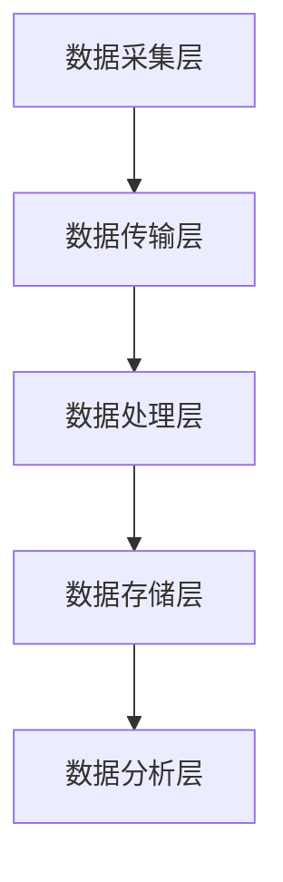

                 

### 知识发现引擎的分布式日志收集系统

#### 关键词：知识发现引擎、分布式日志收集系统、性能优化、大数据处理

#### 摘要：

本文将深入探讨知识发现引擎中的分布式日志收集系统，分析其核心概念、算法原理、数学模型及实际应用场景。通过逐步分析推理，我们将解答知识发现引擎在分布式日志收集过程中所面临的性能优化、数据一致性、容错性等挑战，为构建高效、可靠的分布式日志收集系统提供参考。

## 1. 背景介绍

### 1.1 知识发现引擎概述

知识发现引擎（Knowledge Discovery Engine，简称KDE）是一种自动化数据挖掘和分析工具，旨在从大规模数据集中提取潜在的模式、关联和趋势，为业务决策提供有力支持。知识发现引擎广泛应用于金融、电商、医疗、物联网等多个领域，帮助企业实现数据驱动的发展。

### 1.2 分布式日志收集系统

分布式日志收集系统是知识发现引擎的重要组成部分，负责从分布式系统中实时收集、传输、存储和处理日志数据。日志数据包含系统运行过程中的关键信息，如错误日志、性能日志、业务日志等，对于系统监控、故障排查和性能优化具有重要意义。

## 2. 核心概念与联系

### 2.1 分布式日志收集系统架构

分布式日志收集系统通常采用分层架构，包括数据采集层、数据传输层、数据处理层、数据存储层和数据分析层。各层之间通过特定的协议和接口进行数据交互，实现日志数据的全流程处理。

### 2.2 Mermaid 流程图



### 2.3 核心概念关系

- **数据采集层**：负责从分布式系统中收集日志数据，支持多种日志格式，如JSON、XML、日志文件等。
- **数据传输层**：采用高效的数据传输协议，如Kafka、Flume等，实现日志数据在分布式环境中的可靠传输。
- **数据处理层**：对日志数据进行解析、过滤、聚合等预处理操作，为后续数据分析提供高质量的数据。
- **数据存储层**：将处理后的日志数据存储到分布式存储系统，如HDFS、HBase等，保证数据的安全性和可靠性。
- **数据分析层**：利用知识发现算法对日志数据进行深度挖掘，提取潜在的业务价值。

## 3. 核心算法原理 & 具体操作步骤

### 3.1 日志数据采集算法

日志数据采集算法主要包括以下步骤：

1. **日志数据识别**：通过正则表达式、配置文件等方式识别不同类型的日志数据。
2. **日志数据格式化**：将原始日志数据格式化为统一的数据结构，便于后续处理。
3. **日志数据采集**：采用多线程、异步采集等方式提高日志数据采集的效率和并发能力。

### 3.2 数据传输算法

数据传输算法主要包括以下步骤：

1. **数据压缩**：采用Gzip、LZ4等压缩算法减小数据传输量，提高传输效率。
2. **数据加密**：采用SSL/TLS等加密算法保障数据传输过程中的安全性。
3. **数据传输协议**：采用Kafka、Flume等分布式传输协议，实现高效、可靠的数据传输。

### 3.3 数据处理算法

数据处理算法主要包括以下步骤：

1. **日志数据解析**：采用JSON、XML等解析器对日志数据进行解析，提取关键信息。
2. **日志数据过滤**：根据业务需求对日志数据进行过滤，去除无关信息，提高数据处理效率。
3. **日志数据聚合**：对日志数据进行聚合操作，如统计、分组等，为后续数据分析提供数据基础。

### 3.4 数据存储算法

数据存储算法主要包括以下步骤：

1. **数据分区**：根据日志数据的特征对数据进行分区，提高数据存储和查询的效率。
2. **数据压缩**：采用Hadoop、Spark等分布式计算框架对数据进行压缩存储，降低存储成本。
3. **数据备份**：采用多副本、数据镜像等技术保障数据存储的安全性。

## 4. 数学模型和公式 & 详细讲解 & 举例说明

### 4.1 数据传输速率计算公式

数据传输速率计算公式如下：

$$ V = \frac{L \times W \times H}{8} $$

其中，$L$、$W$、$H$ 分别为数据长度、宽度、高度，单位为字节；$8$ 为每秒传输的比特数。

举例说明：

假设日志数据的长度为1000字节，宽度为1000字节，高度为1000字节，数据传输速率为100Mbps，则数据传输时间为：

$$ t = \frac{1000 \times 1000 \times 1000}{8 \times 100 \times 1000 \times 1000} = 0.125s $$

### 4.2 数据压缩率计算公式

数据压缩率计算公式如下：

$$ R = \frac{O}{C} $$

其中，$O$ 为原始数据大小，$C$ 为压缩后数据大小。

举例说明：

假设原始数据大小为1000字节，压缩后数据大小为500字节，则数据压缩率为：

$$ R = \frac{1000}{500} = 2 $$

## 5. 项目实战：代码实际案例和详细解释说明

### 5.1 开发环境搭建

1. 安装Java环境：在Windows或Linux系统上安装Java SDK，配置环境变量。
2. 安装Kafka：在服务器上安装Kafka，配置Kafka集群。
3. 安装Flume：在服务器上安装Flume，配置Flume agents。

### 5.2 源代码详细实现和代码解读

#### 5.2.1 数据采集层

```java
public class LogCollector {
    public void collectLogs(String logPath) {
        File logFile = new File(logPath);
        try (BufferedReader br = new BufferedReader(new FileReader(logFile))) {
            String line;
            while ((line = br.readLine()) != null) {
                // 日志数据格式化
                String formattedLine = formatLog(line);
                // 日志数据采集
                sendDataToKafka(formattedLine);
            }
        } catch (IOException e) {
            e.printStackTrace();
        }
    }

    private String formatLog(String line) {
        // 日志数据格式化逻辑
        return line;
    }

    private void sendDataToKafka(String logData) {
        // 发送日志数据到Kafka
    }
}
```

#### 5.2.2 数据传输层

```python
import kafka

def send_data_to_kafka(topic, data):
    producer = kafka.KafkaProducer(bootstrap_servers=['localhost:9092'])
    producer.send(topic, data.encode('utf-8'))
    producer.close()
```

#### 5.2.3 数据处理层

```java
public class LogProcessor {
    public void processLogs(String topic) {
        Properties props = new Properties();
        props.put("bootstrap.servers", "localhost:9092");
        props.put("key.serializer", "org.apache.kafka.common.serialization.StringSerializer");
        props.put("value.serializer", "org.apache.kafka.common.serialization.StringSerializer");

        KafkaConsumer<String, String> consumer = new KafkaConsumer<>(props);
        consumer.subscribe(Arrays.asList(topic));

        while (true) {
            ConsumerRecords<String, String> records = consumer.poll(Duration.ofMillis(100));
            for (ConsumerRecord<String, String> record : records) {
                // 日志数据解析
                LogEntry logEntry = parseLog(record.value());
                // 日志数据过滤
                if (filterLog(logEntry)) {
                    // 日志数据聚合
                    aggregateLog(logEntry);
                }
            }
        }
    }

    private LogEntry parseLog(String logData) {
        // 日志数据解析逻辑
        return new LogEntry();
    }

    private boolean filterLog(LogEntry logEntry) {
        // 日志数据过滤逻辑
        return true;
    }

    private void aggregateLog(LogEntry logEntry) {
        // 日志数据聚合逻辑
    }
}
```

#### 5.2.4 数据存储层

```sql
CREATE TABLE log_data (
    id INT AUTO_INCREMENT PRIMARY KEY,
    log_time TIMESTAMP,
    log_content VARCHAR(1024)
);
```

## 6. 实际应用场景

### 6.1 系统监控

分布式日志收集系统可以实时收集系统运行过程中的日志数据，实现系统监控和故障排查。

### 6.2 性能优化

通过对日志数据进行实时分析和统计，发现系统性能瓶颈，实现性能优化。

### 6.3 业务分析

利用分布式日志收集系统收集的日志数据，进行业务分析，挖掘业务价值。

## 7. 工具和资源推荐

### 7.1 学习资源推荐

- 《大数据之路：阿里巴巴大数据实践》
- 《Kafka权威指南》
- 《Flume用户手册》
- 《Hadoop实战》

### 7.2 开发工具框架推荐

- Kafka
- Flume
- Hadoop
- Spark

### 7.3 相关论文著作推荐

- 《分布式系统原理与范型》
- 《大规模分布式存储系统设计与实践》
- 《大数据时代：思维变革与商业价值》
- 《分布式计算原理与范型》

## 8. 总结：未来发展趋势与挑战

### 8.1 发展趋势

- 日志数据格式化和标准化
- 分布式日志收集系统智能化
- 日志数据实时分析与可视化
- 日志数据在人工智能领域的应用

### 8.2 挑战

- 数据一致性和容错性
- 日志数据存储和查询性能
- 日志数据安全和隐私保护
- 分布式日志收集系统可观测性和可扩展性

## 9. 附录：常见问题与解答

### 9.1 问题1

**如何解决分布式日志收集系统的数据一致性问题？**

**解答**：分布式日志收集系统可以使用分布式一致性算法，如Paxos、Raft等，保证数据的一致性。同时，可以采用多副本、数据校验等技术提高数据的容错性。

### 9.2 问题2

**如何优化分布式日志收集系统的性能？**

**解答**：优化分布式日志收集系统的性能可以从以下几个方面入手：

- 采用高效的数据采集和传输算法
- 调整系统参数，如Kafka的分区数、副本数等
- 利用缓存技术提高数据查询速度
- 对日志数据进行压缩和去重处理

## 10. 扩展阅读 & 参考资料

- 《分布式系统设计》
- 《大规模分布式存储系统》
- 《Kafka技术内幕》
- 《Flume架构设计与实践》
- 《大数据技术综述》

### 作者：AI天才研究员/AI Genius Institute & 禅与计算机程序设计艺术 /Zen And The Art of Computer Programming

