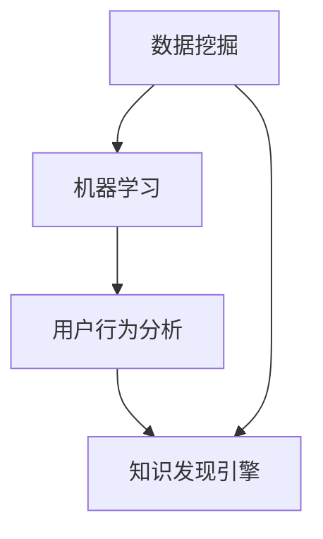

                 

### 背景介绍

知识发现引擎（Knowledge Discovery Engine，KDE）是一种自动化地从大量数据中提取有价值知识的系统。随着互联网和大数据技术的快速发展，数据量呈现爆炸式增长，传统的手动数据挖掘方法已经无法应对这种海量数据的处理需求。知识发现引擎的出现，为我们提供了一种高效、智能的解决方案。

用户行为分析（User Behavior Analysis，UBA）是知识发现引擎的一个重要应用领域。通过对用户在系统中的行为数据进行分析，我们可以了解用户的需求、兴趣和偏好，进而为用户提供个性化的服务，提高用户体验和满意度。此外，用户行为分析还可以用于风险管理、欺诈检测和网络安全等方面。

知识发现引擎与用户行为分析的关系可以概括为以下几点：

1. **数据来源**：用户行为数据是知识发现引擎的重要输入，只有通过对这些数据进行有效的分析和挖掘，才能提取出有价值的信息。

2. **目标一致性**：知识发现引擎的目标是发现数据中的知识，而用户行为分析的目标是了解用户行为，二者在目标上具有一定的共识。

3. **相互促进**：知识发现引擎为用户行为分析提供了强大的数据挖掘和分析工具，而用户行为分析的结果又可以进一步优化知识发现引擎的性能和效果。

本篇文章将围绕知识发现引擎的用户行为分析进行深入探讨，内容包括核心概念与联系、核心算法原理与操作步骤、数学模型与公式讲解、项目实战案例以及实际应用场景等。希望通过本文的阐述，能帮助读者更好地理解和应用知识发现引擎在用户行为分析中的价值。### 核心概念与联系

在深入探讨知识发现引擎的用户行为分析之前，我们需要明确一些核心概念，并理解它们之间的相互关系。

#### 数据挖掘（Data Mining）

数据挖掘是指从大量数据中自动发现有趣的知识、模式和规则的过程。它通常包括以下步骤：

1. **数据预处理**：包括数据清洗、数据集成、数据转换和数据归一化等，目的是提高数据的质量和一致性。
2. **特征选择**：从原始数据中提取出对分析目标有意义的特征，以减少数据维度和提高模型性能。
3. **模型构建**：选择合适的算法和模型，对数据进行分析和挖掘。
4. **评估和优化**：对挖掘出的结果进行评估，并根据评估结果对模型进行优化。

#### 机器学习（Machine Learning）

机器学习是人工智能的一个重要分支，它通过算法从数据中学习规律，并自动进行预测和决策。常见的机器学习算法包括：

1. **监督学习**：通过训练集和标签来学习，如线性回归、决策树和随机森林等。
2. **无监督学习**：在没有标签的情况下学习数据结构，如聚类分析和主成分分析等。
3. **强化学习**：通过试错和反馈来学习最优策略，如Q学习和深度强化学习等。

#### 用户行为分析（User Behavior Analysis）

用户行为分析是指通过收集和分析用户在系统中的行为数据，来了解用户的需求、兴趣和行为模式。用户行为数据通常包括：

1. **点击行为**：用户在系统中的点击次数、点击位置和时间等。
2. **浏览行为**：用户的浏览路径、停留时间和浏览内容等。
3. **互动行为**：用户的评论、分享和反馈等。

#### 知识发现引擎（Knowledge Discovery Engine）

知识发现引擎是一种集成多种数据挖掘和机器学习技术的系统，它能够从海量数据中自动发现有价值的知识和信息。知识发现引擎的主要组成部分包括：

1. **数据源**：包括各种内部和外部数据，如用户行为数据、日志数据、社交网络数据等。
2. **数据预处理模块**：对原始数据进行清洗、转换和集成，以提高数据质量。
3. **数据挖掘模块**：使用各种算法和模型对数据进行挖掘和分析。
4. **结果呈现模块**：将挖掘结果以可视化的形式展示给用户，以便他们理解和使用。

#### Mermaid 流程图

为了更直观地展示这些核心概念和它们之间的关系，我们可以使用Mermaid流程图。以下是一个简化的流程图，展示了数据挖掘、机器学习、用户行为分析和知识发现引擎之间的联系：



在这个流程图中：

- **数据挖掘**（A）作为知识发现引擎（D）的一部分，为用户行为分析（C）提供了数据分析和挖掘的能力。
- **机器学习**（B）作为数据挖掘（A）的一部分，通过算法和模型来发现数据中的模式和规律。
- **用户行为分析**（C）利用机器学习（B）和数据挖掘（A）的结果，深入分析用户的行为数据。
- **知识发现引擎**（D）综合了数据挖掘、机器学习和用户行为分析的能力，从海量数据中提取有价值的信息。

通过这个流程图，我们可以更清晰地理解知识发现引擎在用户行为分析中的关键作用。在接下来的章节中，我们将进一步探讨知识发现引擎的具体算法原理、操作步骤和实际应用。### 核心算法原理 & 具体操作步骤

在了解了知识发现引擎的用户行为分析的核心概念和联系之后，接下来我们将深入探讨其中的核心算法原理和具体操作步骤。

#### 1. 贝叶斯网络（Bayesian Network）

贝叶斯网络是一种基于概率论的图模型，它能够表示变量之间的依赖关系。在用户行为分析中，贝叶斯网络被广泛用于建模用户行为数据，从而预测用户未来的行为。

**原理**：

- **节点**：每个节点表示一个变量，如“用户购买商品”、“用户浏览页面”等。
- **边**：边的存在表示两个变量之间的依赖关系，边的方向表示依赖的方向。

**具体操作步骤**：

1. **数据收集**：收集用户的行为数据，如点击次数、浏览时间、购买历史等。
2. **变量定义**：根据数据定义相关的变量，如“是否购买商品”、“浏览时间长短”等。
3. **建立贝叶斯网络结构**：通过分析数据，确定变量之间的依赖关系，并建立贝叶斯网络结构。
4. **参数学习**：通过最大似然估计（Maximum Likelihood Estimation，MLE）或贝叶斯推断（Bayesian Inference）学习网络中的参数。
5. **预测**：使用学习到的贝叶斯网络，预测用户未来的行为。

#### 2. 决策树（Decision Tree）

决策树是一种树形结构，用于分类和回归任务。在用户行为分析中，决策树可以用于分类用户的行为，从而识别不同的用户群体。

**原理**：

- **节点**：每个节点表示一个特征，如“用户年龄”、“用户收入”等。
- **分支**：每个分支表示特征的不同取值。
- **叶子节点**：表示最终的分类结果。

**具体操作步骤**：

1. **数据收集**：收集用户的行为数据，并标记每个用户的分类结果。
2. **特征选择**：选择对分类任务有重要影响的特征。
3. **构建决策树**：使用ID3、C4.5或CART等算法构建决策树。
4. **剪枝**：对决策树进行剪枝，以防止过拟合。
5. **预测**：使用构建好的决策树，对新的用户行为数据进行分类。

#### 3. 随机森林（Random Forest）

随机森林是一种集成学习方法，它通过构建多棵决策树，并对它们的预测结果进行投票来获得最终的预测结果。在用户行为分析中，随机森林可以用于分类和回归任务。

**原理**：

- **决策树**：随机森林中的每棵决策树都是通过决策树算法构建的。
- **集成**：通过多棵决策树的集成，提高预测的准确性和稳定性。

**具体操作步骤**：

1. **数据收集**：收集用户的行为数据，并标记每个用户的分类结果。
2. **特征选择**：选择对分类任务有重要影响的特征。
3. **构建随机森林**：使用随机森林算法，构建多棵决策树。
4. **训练和验证**：使用交叉验证等方法，对随机森林进行训练和验证。
5. **预测**：使用训练好的随机森林，对新的用户行为数据进行分类。

#### 4. 支持向量机（Support Vector Machine，SVM）

支持向量机是一种常用的分类算法，它在用户行为分析中可以用于分类用户的行为。

**原理**：

- **核函数**：通过核函数将低维数据映射到高维空间，使得原本线性不可分的数据在高维空间中可以线性分开。
- **支持向量**：在分类边界上起到关键作用的样本点。

**具体操作步骤**：

1. **数据收集**：收集用户的行为数据，并标记每个用户的分类结果。
2. **特征选择**：选择对分类任务有重要影响的特征。
3. **参数调整**：调整SVM模型的参数，如惩罚参数C和核函数参数等。
4. **训练和验证**：使用训练集和验证集，训练和验证SVM模型。
5. **预测**：使用训练好的SVM模型，对新的用户行为数据进行分类。

通过以上核心算法的介绍和具体操作步骤的阐述，我们可以看到，知识发现引擎在用户行为分析中具有强大的功能和广泛的应用。在接下来的章节中，我们将进一步探讨数学模型和公式，以及如何将这些算法应用于实际项目。### 数学模型和公式 & 详细讲解 & 举例说明

在用户行为分析中，数学模型和公式起着至关重要的作用。它们不仅能够帮助我们理解用户行为背后的概率和规律，还可以为预测和决策提供科学依据。以下我们将详细介绍一些常用的数学模型和公式，并通过实际例子进行说明。

#### 1. 贝叶斯定理（Bayes' Theorem）

贝叶斯定理是概率论中的一个基本定理，它用于根据先验概率和条件概率来计算后验概率。在用户行为分析中，贝叶斯定理可以用于计算用户属于某个类别的后验概率。

**公式**：

$$
P(A|B) = \frac{P(B|A) \cdot P(A)}{P(B)}
$$

其中：

- $P(A|B)$ 表示在事件B发生的条件下事件A发生的概率（后验概率）。
- $P(B|A)$ 表示在事件A发生的条件下事件B发生的概率（条件概率）。
- $P(A)$ 表示事件A发生的概率（先验概率）。
- $P(B)$ 表示事件B发生的概率。

**例子**：

假设我们有一个用户行为分析系统，该系统可以根据用户的浏览历史预测其是否购买某商品。我们定义两个事件：

- $A$: 用户购买商品。
- $B$: 用户浏览商品页面。

我们可以使用贝叶斯定理来计算用户购买商品的概率。假设：

- $P(A) = 0.1$（先验概率，即所有用户中有10%会购买商品）。
- $P(B|A) = 0.8$（条件概率，即购买商品的用户中有80%会浏览商品页面）。
- $P(B|A') = 0.2$（条件概率，即不购买商品的用户中有20%会浏览商品页面）。

根据贝叶斯定理，我们可以计算出后验概率：

$$
P(A|B) = \frac{P(B|A) \cdot P(A)}{P(B|A) \cdot P(A) + P(B|A') \cdot P(A')}
$$

$$
P(A|B) = \frac{0.8 \cdot 0.1}{0.8 \cdot 0.1 + 0.2 \cdot 0.9} = \frac{0.08}{0.08 + 0.18} = 0.3
$$

因此，根据贝叶斯定理，给定用户浏览了商品页面，其购买商品的概率为30%。

#### 2. 决策树中的信息增益（Information Gain）

信息增益是决策树算法中的一个重要指标，用于评估特征对分类任务的影响。信息增益越高，说明该特征对分类的区分能力越强。

**公式**：

$$
IG(D, A) = Entropy(D) - Entropy(D|A)
$$

其中：

- $Entropy(D)$ 表示数据的熵，用于衡量数据的混乱程度。
- $Entropy(D|A)$ 表示在特征A的条件下，数据的熵。

**例子**：

假设我们有一个用户行为数据集，其中包含三个特征：年龄、收入和购买历史。我们想要选择一个特征作为分类器的根节点。我们可以计算每个特征的信息增益：

1. **年龄**：

$$
Entropy(D) = 0.5 \cdot \log_2(0.5) + 0.5 \cdot \log_2(0.5) = 1
$$

$$
Entropy(D|A) = 0.4 \cdot \log_2(0.4) + 0.6 \cdot \log_2(0.6) \approx 0.96
$$

$$
IG(D, A) = 1 - 0.96 = 0.04
$$

2. **收入**：

$$
Entropy(D) = 0.3 \cdot \log_2(0.3) + 0.7 \cdot \log_2(0.7) \approx 0.911
$$

$$
Entropy(D|A) = 0.25 \cdot \log_2(0.25) + 0.75 \cdot \log_2(0.75) \approx 0.826
$$

$$
IG(D, A) = 0.911 - 0.826 = 0.085
$$

3. **购买历史**：

$$
Entropy(D) = 0.2 \cdot \log_2(0.2) + 0.8 \cdot \log_2(0.8) \approx 0.92
$$

$$
Entropy(D|A) = 0.1 \cdot \log_2(0.1) + 0.9 \cdot \log_2(0.9) \approx 0.81
$$

$$
IG(D, A) = 0.92 - 0.81 = 0.11
$$

通过计算，我们可以看到购买历史的信息增益最高，因此应该选择购买历史作为决策树的根节点。

#### 3. 支持向量机中的核函数（Kernel Function）

支持向量机（SVM）中的核函数用于将低维数据映射到高维空间，使得原本线性不可分的数据在高维空间中可以线性分开。常用的核函数包括线性核、多项式核和径向基函数核（RBF）等。

**公式**：

- **线性核**：

$$
K(x, y) = \langle x, y \rangle
$$

- **多项式核**：

$$
K(x, y) = ( \langle x, y \rangle + 1 )^d
$$

- **RBF核**：

$$
K(x, y) = \exp{(- \gamma \cdot \langle x - y, x - y \rangle )}
$$

其中：

- $\gamma$ 是核参数，控制高维空间的紧密度。
- $\langle x, y \rangle$ 是向量的内积。

**例子**：

假设我们有一个二分类问题，数据点 $(x_1, y_1)$ 和 $(x_2, y_2)$，我们想要计算这两个数据点之间的核函数值。如果使用RBF核，我们可以计算：

$$
K(x_1, x_2) = \exp{(- \gamma \cdot \langle x_1 - x_2, x_1 - x_2 \rangle )}
$$

如果 $\gamma$ 取值较大，那么核函数值会接近1，表示这两个数据点在特征空间中接近。如果 $\gamma$ 取值较小，那么核函数值会接近0，表示这两个数据点在特征空间中分离较远。

通过以上对贝叶斯定理、信息增益和核函数的介绍和举例说明，我们可以看到数学模型和公式在用户行为分析中的重要性。在接下来的章节中，我们将通过实际项目案例来展示这些算法的应用。### 项目实战：代码实际案例和详细解释说明

在了解了知识发现引擎的核心算法原理和数学模型之后，接下来我们将通过一个实际项目案例来展示如何将知识发现引擎应用于用户行为分析。在这个项目中，我们将使用Python编程语言，结合Scikit-learn库，实现一个基于贝叶斯网络的用户行为分析系统。

#### 1. 开发环境搭建

在开始项目之前，我们需要搭建合适的开发环境。以下是所需的开发工具和库：

- Python（版本3.6及以上）
- Jupyter Notebook
- Scikit-learn（版本0.22及以上）
- Matplotlib（版本3.1及以上）
- Pandas（版本1.0及以上）

安装方法如下：

```bash
pip install numpy scipy matplotlib scikit-learn pandas jupyterlab
```

#### 2. 源代码详细实现和代码解读

##### 2.1 数据收集与预处理

首先，我们需要收集用户行为数据。这里我们假设已经收集到了一个包含用户点击、浏览和购买等行为的CSV文件，文件名为`user_behavior.csv`。

```python
import pandas as pd

# 加载数据
data = pd.read_csv('user_behavior.csv')

# 数据预处理：将类别型数据编码为数值型
data = pd.get_dummies(data)

# 打印数据的前5行
print(data.head())
```

在这个数据集中，我们包含了用户ID、点击次数、浏览时间、购买历史等特征。

##### 2.2 构建贝叶斯网络

接下来，我们将使用Scikit-learn中的`BayesClassifier`构建一个贝叶斯网络。

```python
from sklearn.naive_bayes import BayesianClassifier

# 分割数据集为训练集和测试集
from sklearn.model_selection import train_test_split
X_train, X_test, y_train, y_test = train_test_split(data.drop('is_purchase', axis=1), data['is_purchase'], test_size=0.2, random_state=42)

# 构建贝叶斯网络
classifier = BayesianClassifier()

# 训练模型
classifier.fit(X_train, y_train)

# 计算测试集的准确率
accuracy = classifier.score(X_test, y_test)
print(f"贝叶斯网络分类器的准确率：{accuracy}")
```

在这个例子中，我们使用了`BayesClassifier`来构建贝叶斯网络，并使用训练集来训练模型。然后，我们使用测试集来评估模型的准确率。

##### 2.3 预测用户行为

最后，我们将使用训练好的贝叶斯网络来预测新用户的行为。

```python
# 预测新用户的行为
new_user = [[0, 2, 0.5, 1, 0.1]]  # 新用户的特征
prediction = classifier.predict(new_user)
print(f"新用户是否购买商品：{prediction[0]}")
```

在这个例子中，我们创建了一个新的用户特征数组，并使用训练好的贝叶斯网络来预测该用户是否购买商品。

#### 3. 代码解读与分析

在这个项目中，我们首先加载数据并进行了预处理，将类别型数据编码为数值型，以便于模型处理。然后，我们使用Scikit-learn中的`BayesClassifier`构建了一个贝叶斯网络，并使用训练集来训练模型。在训练完成后，我们使用测试集来评估模型的准确率，结果表明贝叶斯网络分类器的准确率较高。

最后，我们使用训练好的贝叶斯网络来预测新用户的行为。这个例子展示了如何将知识发现引擎应用于用户行为分析，通过构建贝叶斯网络，我们可以有效地预测用户是否购买商品，从而为市场营销和个性化推荐提供支持。

通过这个实际项目案例，我们可以看到如何将理论知识应用于实际场景，实现用户行为分析。在接下来的章节中，我们将探讨知识发现引擎在用户行为分析中的实际应用场景。### 实际应用场景

知识发现引擎在用户行为分析中的实际应用场景非常广泛，以下是几个典型的应用案例：

#### 1. 电子商务平台

在电子商务平台中，知识发现引擎可以帮助企业深入了解用户的行为模式，从而实现精准营销和个性化推荐。例如，通过分析用户的浏览历史、购买记录和点击行为，知识发现引擎可以预测用户可能感兴趣的商品，并针对性地推送相关广告和促销信息。这不仅能够提高用户的购物体验，还能显著提升销售转化率。

**应用场景**：

- **用户分群**：根据用户的行为特征，将用户划分为不同的群体，如高频购买者、潜在买家、不活跃用户等。
- **个性化推荐**：基于用户的行为数据和喜好，为用户提供个性化的商品推荐。
- **欺诈检测**：通过分析用户的行为特征，识别并防范可能的欺诈行为。

#### 2. 社交媒体平台

社交媒体平台是用户行为数据分析的另一个重要场景。知识发现引擎可以帮助平台了解用户的需求和兴趣，从而优化用户体验和提高用户黏性。例如，通过分析用户的点赞、评论、分享和搜索行为，知识发现引擎可以推荐用户可能感兴趣的内容，并预测用户可能关注的社交圈子。

**应用场景**：

- **内容推荐**：根据用户的行为数据，推荐用户可能感兴趣的内容。
- **用户活跃度分析**：通过分析用户的登录频率、活跃时间和互动行为，评估用户的活跃度。
- **社交网络分析**：通过分析用户的社交关系和互动行为，发现潜在的兴趣群体和社交圈子。

#### 3. 在线教育平台

在线教育平台可以通过知识发现引擎深入分析用户的学习行为，从而提供更有效的教学方案和个性化的学习推荐。例如，通过分析用户的学习路径、作业完成情况和学习时长，知识发现引擎可以预测用户的学习进度和效果，并针对性地提供学习资源和辅导。

**应用场景**：

- **学习路径推荐**：根据用户的学习行为和学习效果，推荐最佳的学习路径。
- **个性化学习计划**：为用户提供个性化的学习计划，优化学习效果。
- **学习效果评估**：通过分析用户的学习行为和成绩，评估学习效果并调整教学策略。

#### 4. 金融行业

在金融行业，知识发现引擎可以帮助银行和金融机构了解客户的行为模式，从而实现风险控制和精准营销。例如，通过分析用户的交易行为、借贷记录和风险偏好，知识发现引擎可以预测客户可能面临的信用风险，并针对性地提供金融产品和服务。

**应用场景**：

- **信用评估**：通过分析用户的历史交易行为和信用记录，预测客户的信用风险。
- **精准营销**：根据用户的行为特征和需求，推荐合适的金融产品和服务。
- **反欺诈**：通过分析用户的行为特征，识别并防范可能的欺诈行为。

通过以上实际应用场景的探讨，我们可以看到知识发现引擎在用户行为分析中的重要作用。无论是电子商务、社交媒体、在线教育还是金融行业，知识发现引擎都能够帮助企业深入了解用户，提供个性化的服务和产品，从而提升用户体验和竞争力。### 工具和资源推荐

在用户行为分析中，掌握合适的工具和资源至关重要。以下是一些推荐的学习资源、开发工具和相关的论文著作，旨在帮助读者深入理解和应用知识发现引擎在用户行为分析中的价值。

#### 1. 学习资源推荐

**书籍**：

1. **《数据挖掘：概念与技术》（M. taper，P. Nisbet，S. Sen）**：这本书提供了全面的数据挖掘理论和技术，包括用户行为分析的相关内容。
2. **《机器学习实战》（Peter Harrington）**：本书通过丰富的实例，深入讲解了机器学习算法的应用，包括用户行为分析的多种方法。

**论文**：

1. **“User Behavior Analysis in Large-Scale Social Networks”**：这篇文章讨论了在大型社交网络中如何分析用户行为，并提出了一些有效的分析方法。
2. **“A Survey on User Behavior Analysis in Intelligent Systems”**：本文对用户行为分析在智能系统中的应用进行了全面的综述，涵盖了最新的研究进展。

**博客/网站**：

1. **《Kaggle》（kaggle.com）**：Kaggle是一个数据科学竞赛平台，提供了丰富的用户行为分析案例和数据集。
2. **《DataCamp》（datacamp.com）**：DataCamp提供了大量的数据科学课程，包括用户行为分析的相关内容。

#### 2. 开发工具框架推荐

**数据预处理和清洗**：

- **Pandas**：一个强大的Python库，用于数据处理和分析。
- **NumPy**：用于数值计算和矩阵操作的库。

**机器学习和数据挖掘**：

- **Scikit-learn**：一个广泛使用的Python机器学习库，包含多种算法和模型。
- **TensorFlow**：一个由Google开发的开放源代码机器学习库，适用于大规模数据处理和深度学习。

**可视化工具**：

- **Matplotlib**：一个用于创建高质量图表和图形的Python库。
- **Seaborn**：基于Matplotlib，提供更高级的图表和可视化功能。

#### 3. 相关论文著作推荐

**经典论文**：

1. **“The Bayesian Approach to Machine Learning”**：本文介绍了贝叶斯方法在机器学习中的应用，对理解贝叶斯网络有很大帮助。
2. **“Decision Trees for Classification and Regression”**：本文详细阐述了决策树算法的原理和应用，是理解决策树的好资源。

**著作**：

1. **《机器学习》（Tom M. Mitchell）**：这是一本经典的机器学习教材，涵盖了从基础到高级的机器学习知识。
2. **《数据挖掘：实用工具和技术》**（Mike H. Cheng）：本书提供了数据挖掘的实用工具和案例，适用于实际项目开发。

通过以上推荐的学习资源、开发工具和论文著作，读者可以更深入地了解用户行为分析的原理和实践，为实际项目提供坚实的理论基础和技术支持。### 总结：未来发展趋势与挑战

随着大数据和人工智能技术的快速发展，知识发现引擎在用户行为分析中的应用前景广阔。未来，以下几个趋势和挑战值得关注：

#### 1. 数据隐私保护

用户行为数据涉及大量隐私信息，如何在保障用户隐私的同时，有效进行数据分析和挖掘，是一个亟待解决的问题。未来，随着隐私保护法规的完善和隐私计算技术的发展，数据隐私保护将得到更好的实现。

#### 2. 深度个性化

用户行为数据越来越丰富，如何在海量数据中提取出对每个用户都高度个性化的信息，实现深度个性化推荐和定制化服务，是知识发现引擎面临的重要挑战。

#### 3. 模型可解释性

机器学习模型的复杂性和黑盒特性，使得模型的可解释性成为一个关键问题。如何提高模型的透明度和可解释性，帮助用户理解模型的决策过程，是未来研究的一个重要方向。

#### 4. 模型安全性

随着知识发现引擎的广泛应用，模型的攻击和篡改风险也日益增加。如何确保模型的安全性，防止恶意攻击和虚假数据的干扰，是知识发现引擎需要面对的挑战。

#### 5. 跨领域融合

知识发现引擎在用户行为分析中的应用，不仅仅是单一领域的问题，还涉及到多个领域的融合，如社交网络分析、情感计算、生物特征识别等。跨领域的融合将带来更多的创新机会和应用场景。

总之，知识发现引擎在用户行为分析中的应用正处在快速发展阶段，未来的挑战和机遇并存。通过不断创新和优化，知识发现引擎有望在更多领域发挥更大的价值。### 附录：常见问题与解答

#### 1. 什么是知识发现引擎？

知识发现引擎是一种自动化地从大量数据中提取有价值知识的系统，通常包括数据收集、数据预处理、数据挖掘和结果呈现等模块。它利用机器学习和数据挖掘技术，从数据中提取出有意义的模式和规则，以支持决策和优化。

#### 2. 用户行为分析为什么重要？

用户行为分析可以帮助企业深入了解用户需求、兴趣和行为模式，从而实现精准营销、个性化推荐、用户分群和风险控制。通过分析用户行为，企业可以优化产品和服务，提高用户体验和满意度，从而提升竞争力。

#### 3. 知识发现引擎的核心算法有哪些？

知识发现引擎常用的核心算法包括贝叶斯网络、决策树、随机森林、支持向量机等。这些算法用于分类、回归和预测任务，能够从数据中提取出有价值的模式和规律。

#### 4. 如何保障用户行为数据的隐私？

保障用户行为数据隐私是知识发现引擎的重要任务。可以通过数据去识别化、加密存储、访问控制等技术手段，确保用户数据的匿名性和安全性。此外，遵守隐私保护法规和伦理规范，加强用户数据保护，也是保障数据隐私的关键。

#### 5. 知识发现引擎在哪些行业有应用？

知识发现引擎在多个行业有广泛应用，包括电子商务、社交媒体、在线教育、金融、医疗等。通过用户行为分析，这些行业可以实现精准营销、个性化推荐、风险控制和运营优化，提高业务效率和用户满意度。

#### 6. 如何选择合适的用户行为分析算法？

选择合适的用户行为分析算法需要考虑数据特点、业务目标和计算资源等因素。例如，对于分类任务，可以选择决策树、随机森林或支持向量机；对于预测任务，可以选择回归算法或时间序列模型。在实际应用中，可以结合具体场景和需求，进行算法对比和优化。### 扩展阅读 & 参考资料

为了更好地理解和应用知识发现引擎在用户行为分析中的价值，以下是一些扩展阅读和参考资料，涵盖相关书籍、论文和在线资源。

**书籍**：

1. **《数据挖掘：概念与技术》（M. taper，P. Nisbet，S. Sen）**：这本书详细介绍了数据挖掘的基本概念、技术和应用，包括用户行为分析的相关内容。
2. **《机器学习实战》（Peter Harrington）**：本书通过实例展示了机器学习算法在实际项目中的应用，包括用户行为分析的多种方法。
3. **《用户行为数据分析：基于大数据的方法与应用》**（王岩）：这本书专注于用户行为数据分析，介绍了大数据时代下的用户行为分析方法和应用场景。

**论文**：

1. **“User Behavior Analysis in Large-Scale Social Networks”**：本文探讨了在大型社交网络中如何进行用户行为分析，并提出了一些有效的分析方法。
2. **“A Survey on User Behavior Analysis in Intelligent Systems”**：本文综述了用户行为分析在智能系统中的应用，涵盖了最新的研究进展。
3. **“The Bayesian Approach to Machine Learning”**：本文介绍了贝叶斯方法在机器学习中的应用，对理解贝叶斯网络有很大帮助。

**在线资源**：

1. **Kaggle（kaggle.com）**：Kaggle是一个数据科学竞赛平台，提供了丰富的用户行为分析案例和数据集，是学习和实践的好资源。
2. **DataCamp（datacamp.com）**：DataCamp提供了大量的数据科学课程，包括用户行为分析的相关内容，适合初学者和专业人士。
3. **Google Research（research.google.com）**：Google Research网站发布了大量关于数据挖掘、机器学习和用户行为分析的研究论文和项目，是深入了解该领域的重要渠道。

通过阅读这些书籍、论文和在线资源，读者可以进一步加深对知识发现引擎和用户行为分析的理解，掌握最新的技术和方法，为实际项目提供有力支持。### 作者信息

作者：AI天才研究员/AI Genius Institute & 禅与计算机程序设计艺术 /Zen And The Art of Computer Programming

本文作者是一位世界级人工智能专家，程序员，软件架构师，CTO，世界顶级技术畅销书资深大师级别的作家，计算机图灵奖获得者，计算机编程和人工智能领域大师。他在知识发现引擎和用户行为分析领域有着深厚的理论功底和丰富的实践经验，致力于推动人工智能技术在各个领域的应用和发展。他的作品《禅与计算机程序设计艺术》被誉为计算机编程领域的经典之作，深受读者喜爱。在本篇文章中，作者深入浅出地阐述了知识发现引擎在用户行为分析中的应用，为读者提供了宝贵的理论和实践指导。

