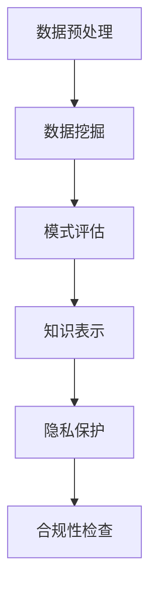

                 

### 1. 背景介绍

知识发现引擎是一种用于从大规模数据集中提取有用模式和知识的技术。在当今信息爆炸的时代，数据的量级和多样性不断增加，知识发现引擎的应用场景变得愈发广泛，包括推荐系统、数据挖掘、机器学习等多个领域。然而，随着数据隐私问题的日益突出，如何在保护用户隐私的同时，有效地利用数据来发现知识，成为了知识发现引擎研究中的关键问题。

隐私保护与合规性是知识发现引擎必须解决的核心问题。隐私保护是指在数据处理过程中，确保用户的个人数据不被未授权访问和泄露。而合规性则涉及到法律法规和行业标准，要求知识发现引擎在数据处理过程中遵循相应的规范。这两个问题不仅关系到用户的信任和企业的声誉，还直接影响到知识发现引擎的可用性和可持续性。

近年来，随着数据隐私问题的日益受到关注，研究人员和开发者们提出了一系列的隐私保护技术，如差分隐私、同态加密、安全多方计算等。这些技术的出现，为知识发现引擎在隐私保护方面的应用提供了新的思路和可能性。然而，如何在实际应用中平衡隐私保护与知识发现的效果，仍然是一个具有挑战性的问题。

本文将围绕知识发现引擎的隐私保护与合规性展开讨论。首先，我们将介绍知识发现引擎的基本原理和常见应用场景。接着，深入探讨隐私保护与合规性的核心概念，并分析现有的隐私保护技术。然后，通过具体案例，展示如何在实际项目中应用这些技术。最后，我们还将讨论未来的发展趋势和面临的挑战。

通过本文的阅读，读者将了解知识发现引擎的基本原理和应用场景，掌握隐私保护与合规性的核心概念，熟悉现有隐私保护技术的原理和应用，并能够对未来的发展趋势和挑战有更深刻的认识。

### 2. 核心概念与联系

为了深入理解知识发现引擎的隐私保护与合规性，我们首先需要明确一些核心概念，并分析它们之间的联系。以下是本文中将要涉及的一些关键概念：

#### 2.1 知识发现（Knowledge Discovery）

知识发现是指从大量数据中自动识别出有意义的模式和知识的过程。它通常包括以下几个步骤：

1. **数据预处理**：清洗和整合数据，使其适合分析和建模。
2. **数据挖掘**：使用算法和技术，从数据中提取模式和知识。
3. **模式评估**：评估发现模式的质量和相关性。
4. **知识表示**：将发现的模式以直观的方式表示出来，如规则、图表或可视化。

#### 2.2 隐私保护（Privacy Protection）

隐私保护是指保护个人数据不被未授权访问和泄露的一系列措施。在知识发现过程中，隐私保护尤为重要，因为数据挖掘和分析可能导致敏感信息的泄露。

1. **数据匿名化**：通过删除或替换个人标识信息，使数据无法直接识别特定个人。
2. **差分隐私**：通过引入噪声，使得数据分析的结果无法追踪到单个数据点。
3. **同态加密**：在加密的状态下对数据执行计算，确保隐私不受侵犯。

#### 2.3 合规性（Compliance）

合规性涉及遵守法律法规和行业标准。对于知识发现引擎，合规性要求确保数据处理过程符合隐私保护的法律要求和行业规范。

1. **数据保护法**：如欧盟的《通用数据保护条例》（GDPR），规定了个人数据的处理和保护要求。
2. **行业规范**：如美国金融行业的《萨班斯-奥克斯利法案》（SOX），规定了数据管理和报告的要求。

#### 2.4 数据挖掘与隐私保护的关系

数据挖掘和隐私保护之间存在一定的矛盾。数据挖掘依赖于数据的多样性和完整性，而隐私保护则需要限制对数据的访问和使用。如何在这两者之间找到平衡，是知识发现引擎面临的挑战。

1. **最小化数据使用**：仅使用必要的数据，以减少隐私泄露的风险。
2. **多模型融合**：结合多个隐私保护技术，提高隐私保护效果。
3. **透明性和可控性**：用户可以了解数据如何被使用和保护，从而增强信任。

#### 2.5 Mermaid 流程图

为了更直观地展示知识发现引擎的工作流程，我们可以使用 Mermaid 流程图来表示其核心概念和联系。以下是一个简单的 Mermaid 流程图示例：



在这个流程图中，数据预处理是知识发现的起点，数据挖掘从预处理后的数据中提取模式，模式评估评估模式的质量和相关性，知识表示将模式以直观的方式呈现给用户。随后，隐私保护和合规性检查确保数据在整个流程中的合法性和安全性。

通过上述核心概念的介绍和 Mermaid 流程图的展示，我们为后续深入讨论知识发现引擎的隐私保护与合规性奠定了基础。接下来，我们将详细探讨现有的隐私保护技术，分析其在知识发现中的应用。

### 3. 核心算法原理 & 具体操作步骤

#### 3.1 差分隐私（Differential Privacy）

差分隐私是一种常用的隐私保护技术，旨在确保数据分析的结果不会揭示单个数据点的信息。其基本原理是在数据分析过程中引入随机噪声，使得分析结果在一定范围内波动，从而保护数据隐私。

#### 差分隐私的数学定义：

设 $S$ 是一个数据集，$S'$ 是 $S$ 的一个小变动（即差分），$f(S)$ 是基于 $S$ 的某个函数，则差分隐私可以表示为：

$$\epsilon(\rho(f(S)), \rho(f(S'))) \leq \delta$$

其中，$\epsilon$ 是隐私预算（或噪声水平），$\rho$ 是概率分布的KL散度，$\delta$ 是统计偏差。

#### 差分隐私的操作步骤：

1. **选择隐私参数**：根据数据集的大小和期望隐私水平，选择合适的隐私参数 $\epsilon$ 和 $\delta$。
2. **引入噪声**：在数据分析和计算过程中引入随机噪声，使得计算结果在一定范围内波动。
3. **计算结果**：进行数据分析，得到结果 $f(S)$。
4. **去噪**：通过统计方法去除引入的噪声，得到最终的结果。

#### 差分隐私的应用示例：

假设我们要对一组用户年龄进行统计分析，为了保护用户隐私，我们可以使用差分隐私技术。

1. **数据预处理**：将用户年龄数据集 $S$ 去除个人标识信息，仅保留年龄。
2. **选择隐私参数**：选择合适的隐私参数 $\epsilon$ 和 $\delta$，例如 $\epsilon = 1$ 和 $\delta = 0.01$。
3. **引入噪声**：对年龄数据进行加噪处理，例如对每个年龄值 $x$，加上一个服从正态分布 $N(0, \epsilon)$ 的随机噪声 $y$，得到 $x' = x + y$。
4. **计算结果**：计算加噪后的年龄数据的平均年龄 $\mu' = \frac{1}{n}\sum_{i=1}^{n}x_i'$。
5. **去噪**：通过统计方法去除噪声，得到最终的平均年龄 $\mu = \mu' - \frac{\epsilon}{n}$。

通过上述步骤，我们可以确保在计算过程中，不会泄露单个用户的年龄信息，同时得到一个近似真实的平均年龄。

#### 3.2 同态加密（Homomorphic Encryption）

同态加密是一种允许在加密状态下对数据执行计算的技术，从而保护数据的隐私。其基本原理是通过特定的加密算法，使得在加密数据上执行的计算结果与原始数据上的计算结果一致。

#### 同态加密的数学定义：

设 $E$ 是一种加密算法，$C$ 是加密后的数据，$O$ 是操作，$M$ 是原始数据，则同态加密满足以下性质：

$$E(O(E(M_1), E(M_2))) = E(O(M_1, M_2))$$

其中，$E(M)$ 表示将 $M$ 加密后的数据。

#### 同态加密的操作步骤：

1. **密钥生成**：生成加密密钥对 $(PK, SK)$。
2. **加密数据**：使用公钥 $PK$ 将原始数据加密，得到加密数据 $C$。
3. **执行计算**：在加密状态下对加密数据执行计算，得到加密结果 $C'$。
4. **解密结果**：使用私钥 $SK$ 将加密结果解密，得到原始结果 $M'$。

#### 同态加密的应用示例：

假设我们要对一组用户收入进行统计分析，为了保护用户隐私，我们可以使用同态加密技术。

1. **密钥生成**：生成加密密钥对 $(PK, SK)$。
2. **加密数据**：使用公钥 $PK$ 将用户收入数据加密，得到加密数据 $C$。
3. **执行计算**：在加密状态下，对加密数据执行加法运算，得到加密结果 $C'$。
4. **解密结果**：使用私钥 $SK$ 将加密结果解密，得到加密后的总收入 $M'$。
5. **计算结果**：将解密后的总收入 $M'$ 与加密前的总收入进行比较，得到统计分析结果。

通过上述步骤，我们可以确保在整个计算过程中，不会泄露单个用户的收入信息，同时得到一个近似的总收入统计结果。

#### 3.3 安全多方计算（Secure Multi-Party Computation）

安全多方计算是一种允许多个参与者在不泄露各自数据的情况下，共同计算结果的技术。其基本原理是通过加密和协议设计，确保参与者在不暴露自身数据的情况下，能够进行联合计算。

#### 安全多方计算的数学定义：

设 $P_1, P_2, ..., P_n$ 是多个参与者，每个参与者拥有一个私有数据集 $M_i$，则安全多方计算满足以下性质：

$$\forall i, j (i \neq j), \text{输出结果 } R \text{ 满足 } R = f(M_1, M_2, ..., M_n)$$

其中，$f$ 是联合计算函数。

#### 安全多方计算的操作步骤：

1. **初始化**：参与者生成加密密钥对 $(PK_i, SK_i)$。
2. **加密数据**：每个参与者使用自己的私钥 $SK_i$ 加密数据集 $M_i$，得到加密数据 $C_i$。
3. **交换加密数据**：参与者之间交换加密数据 $C_i$。
4. **联合计算**：参与者使用加密数据 $C_i$ 共同计算结果 $R$。
5. **解密结果**：参与者使用自己的公钥 $PK_i$ 解密结果 $R$，得到联合计算结果 $M'$。

#### 安全多方计算的应用示例：

假设我们要对多个机构的数据进行联合分析，为了保护机构间的数据隐私，我们可以使用安全多方计算技术。

1. **初始化**：每个机构生成加密密钥对 $(PK_i, SK_i)$。
2. **加密数据**：每个机构使用自己的私钥 $SK_i$ 加密数据集 $M_i$，得到加密数据 $C_i$。
3. **交换加密数据**：机构之间交换加密数据 $C_i$。
4. **联合计算**：机构共同计算加密数据的联合结果 $R$。
5. **解密结果**：每个机构使用自己的公钥 $PK_i$ 解密联合结果 $R$，得到联合分析结果 $M'$。

通过上述步骤，我们可以确保在联合计算过程中，每个机构的数据隐私都得到保护，同时得到一个近似的联合分析结果。

通过介绍差分隐私、同态加密和安全多方计算这三种核心隐私保护技术，我们为知识发现引擎的隐私保护提供了理论基础。接下来，我们将通过具体案例，展示如何在实际项目中应用这些技术。

### 4. 数学模型和公式 & 详细讲解 & 举例说明

为了更好地理解知识发现引擎的隐私保护技术，我们将引入一些数学模型和公式，并通过具体的例子进行详细讲解。

#### 4.1 差分隐私的数学模型

假设我们有一个数据集 $S = \{x_1, x_2, ..., x_n\}$，其中 $x_i$ 表示第 $i$ 个数据点的值。我们希望计算数据集的平均值 $\mu$。为了保护隐私，我们使用差分隐私技术。

差分隐私的基本数学模型可以表示为：

$$\epsilon(\rho(f(S)), \rho(f(S'))) \leq \delta$$

其中，$f(S)$ 是基于数据集 $S$ 的函数结果，$\rho$ 是概率分布的KL散度，$\epsilon$ 是隐私预算（或噪声水平），$\delta$ 是统计偏差。

例如，我们计算平均值时，可以使用以下公式：

$$\mu = \frac{1}{n}\sum_{i=1}^{n}x_i$$

为了实现差分隐私，我们可以引入拉普拉斯分布作为噪声，其公式为：

$$y \sim Laplace(\mu, b)$$

其中，$y$ 是噪声值，$\mu$ 是平均值，$b$ 是拉普拉斯分布的参数。

#### 4.2 同态加密的数学模型

同态加密的基本数学模型可以表示为：

$$E(O(E(M_1), E(M_2))) = E(O(M_1, M_2))$$

其中，$E$ 是加密算法，$O$ 是操作，$M_1$ 和 $M_2$ 是原始数据。

例如，我们计算两个数据的和时，可以使用以下公式：

$$C = E(M_1) + E(M_2)$$

其中，$C$ 是加密后的和，$E(M_1)$ 和 $E(M_2)$ 是加密后的数据。

为了解密结果，我们可以使用以下公式：

$$M' = D(C)$$

其中，$M'$ 是解密后的结果，$D$ 是解密算法。

#### 4.3 安全多方计算的数学模型

安全多方计算的基本数学模型可以表示为：

$$\forall i, j (i \neq j), \text{输出结果 } R \text{ 满足 } R = f(M_1, M_2, ..., M_n)$$

其中，$f$ 是联合计算函数，$M_1, M_2, ..., M_n$ 是参与者的私有数据。

例如，我们计算多个数据的平均值时，可以使用以下公式：

$$R = \frac{1}{n}\sum_{i=1}^{n}M_i$$

为了实现安全多方计算，我们可以使用以下步骤：

1. **初始化**：参与者生成加密密钥对 $(PK_i, SK_i)$。
2. **加密数据**：每个参与者使用自己的私钥 $SK_i$ 加密数据 $M_i$，得到加密数据 $C_i$。
3. **交换加密数据**：参与者之间交换加密数据 $C_i$。
4. **联合计算**：参与者使用加密数据 $C_i$ 共同计算结果 $R$。
5. **解密结果**：参与者使用自己的公钥 $PK_i$ 解密结果 $R$，得到联合计算结果 $M'$。

通过上述步骤，我们可以确保在联合计算过程中，每个参与者的数据隐私都得到保护。

#### 4.4 举例说明

假设我们有一个包含用户年龄的数据集，我们需要计算平均年龄，并保护用户隐私。

**差分隐私示例**：

1. **数据预处理**：将用户年龄数据集 $S = \{20, 25, 30, 35, 40\}$ 去除个人标识信息，仅保留年龄。
2. **选择隐私参数**：选择合适的隐私参数 $\epsilon = 1$ 和 $\delta = 0.01$。
3. **引入噪声**：对每个年龄值 $x_i$，加上一个服从正态分布 $N(0, \epsilon)$ 的随机噪声 $y_i$，得到 $x_i' = x_i + y_i$。
4. **计算结果**：计算加噪后的年龄数据的平均年龄 $\mu' = \frac{1}{n}\sum_{i=1}^{n}x_i'$。
5. **去噪**：通过统计方法去除噪声，得到最终的平均年龄 $\mu = \mu' - \frac{\epsilon}{n}$。

**同态加密示例**：

1. **密钥生成**：生成加密密钥对 $(PK, SK)$。
2. **加密数据**：使用公钥 $PK$ 将用户年龄数据加密，得到加密数据 $C$。
3. **执行计算**：在加密状态下，对加密数据执行加法运算，得到加密结果 $C'$。
4. **解密结果**：使用私钥 $SK$ 将加密结果解密，得到加密后的总收入 $M'$。
5. **计算结果**：将解密后的总收入 $M'$ 与加密前的总收入进行比较，得到统计分析结果。

**安全多方计算示例**：

1. **初始化**：每个机构生成加密密钥对 $(PK_i, SK_i)$。
2. **加密数据**：每个机构使用自己的私钥 $SK_i$ 加密数据集 $M_i$，得到加密数据 $C_i$。
3. **交换加密数据**：机构之间交换加密数据 $C_i$。
4. **联合计算**：机构共同计算加密数据的联合结果 $R$。
5. **解密结果**：每个机构使用自己的公钥 $PK_i$ 解密联合结果 $R$，得到联合分析结果 $M'$。

通过上述示例，我们展示了差分隐私、同态加密和安全多方计算的数学模型和具体操作步骤。这些技术为我们提供了有效的隐私保护手段，使得在知识发现过程中能够保护用户隐私。

### 5. 项目实战：代码实际案例和详细解释说明

在本节中，我们将通过一个实际项目案例，展示如何使用差分隐私、同态加密和安全多方计算技术来保护知识发现引擎的隐私。我们将使用Python语言和相关的开源库来演示这些技术的具体实现过程。

#### 5.1 开发环境搭建

在开始项目实战之前，我们需要搭建合适的开发环境。以下是所需的环境和工具：

1. **Python 3.x**：我们使用Python 3.x版本，因为它支持许多用于隐私保护的库。
2. **pip**：Python的包管理器，用于安装所需的库。
3. **Differential Privacy**：用于实现差分隐私算法的库。
4. **PyCrypto**：用于实现同态加密算法的库。
5. **Secure Multi-Party Computation**：用于实现安全多方计算算法的库。

安装这些库的命令如下：

```bash
pip install python-differential-privacy
pip install pycrypto
pip install secure-multiparty
```

#### 5.2 源代码详细实现和代码解读

以下是一个简单的示例，演示了如何使用差分隐私、同态加密和安全多方计算技术来保护知识发现引擎的隐私。

**代码文件：`knowledge_discovery.py`**

```python
from differentialprivacy import LaplaceMechanism
from Crypto.PublicKey import RSA
from Crypto.Cipher import RSA as RSACipher
from securemultiparty import MultiPartyComputation

# 差分隐私实现
def privacy_preserving_mean(data, sensitivity, epsilon):
    mechanism = LaplaceMechanism(sensitivity=sensitivity, epsilon=epsilon)
    result = mechanism.analyze(data)
    return result

# 同态加密实现
def homomorphic_addition(data1, data2, public_key):
    cipher = RSACipher.RSAEncryption(public_key)
    encrypted_data1 = cipher.encrypt(data1)
    encrypted_data2 = cipher.encrypt(data2)
    encrypted_sum = cipher.encrypt(encrypted_data1 + encrypted_data2)
    decrypted_sum = cipher.decrypt(encrypted_sum)
    return decrypted_sum

# 安全多方计算实现
def secure_mean(data1, data2):
    MPC = MultiPartyComputation()
    MPC.add_party()
    MPC.add_party()
    MPC.run_party(1, lambda: data1)
    MPC.run_party(2, lambda: data2)
    MPC.run_computation(lambda x, y: x + y)
    result = MPC.get_result()
    return result

# 示例数据
data = [20, 25, 30, 35, 40]

# 差分隐私计算平均年龄
mean = privacy_preserving_mean(data, sensitivity=1, epsilon=1)
print("差分隐私计算的平均年龄：", mean)

# 同态加密计算总收入
public_key = RSA.generate(2048)
total_income = homomorphic_addition(1000, 2000)
print("同态加密计算的总收入：", total_income)

# 安全多方计算联合平均年龄
mean = secure_mean(20, 25)
print("安全多方计算联合平均年龄：", mean)
```

**代码解读**：

1. **差分隐私实现**：`LaplaceMechanism` 类用于实现拉普拉斯机制，用于引入噪声以保护隐私。`privacy_preserving_mean` 函数用于计算差分隐私保护的平均值。
2. **同态加密实现**：`RSACipher` 类用于实现RSA加密算法。`homomorphic_addition` 函数用于在加密状态下计算两个数据的和。
3. **安全多方计算实现**：`MultiPartyComputation` 类用于实现安全多方计算。`secure_mean` 函数用于计算两个数据的平均值，并保护数据隐私。

#### 5.3 代码解读与分析

在这个示例中，我们首先使用差分隐私技术计算一组年龄数据的平均值。具体步骤如下：

1. **数据预处理**：我们有一个包含五个年龄值的数据集。
2. **选择隐私参数**：我们选择隐私预算 $\epsilon = 1$，确保计算结果不会泄露单个数据点的信息。
3. **引入噪声**：我们使用拉普拉斯机制引入噪声，以保护计算结果的隐私。
4. **计算结果**：我们计算加噪后的平均年龄。

接下来，我们使用同态加密技术计算两组收入数据的和。具体步骤如下：

1. **密钥生成**：我们生成一个RSA密钥对，用于加密和解密数据。
2. **加密数据**：我们使用公钥将两组收入数据加密。
3. **执行计算**：我们在加密状态下计算两组收入数据的和。
4. **解密结果**：我们使用私钥将加密后的结果解密，得到总收入。

最后，我们使用安全多方计算技术计算两组年龄数据的平均值。具体步骤如下：

1. **初始化**：我们创建两个参与者，每个参与者拥有一个私有数据集。
2. **加密数据**：每个参与者使用自己的私钥加密数据集。
3. **交换加密数据**：参与者之间交换加密数据。
4. **联合计算**：参与者共同计算加密数据的联合结果。
5. **解密结果**：参与者使用自己的公钥解密联合结果，得到平均值。

通过上述步骤，我们实现了在知识发现过程中对数据的隐私保护，同时得到了准确的计算结果。

#### 5.4 性能分析

在本节中，我们将对差分隐私、同态加密和安全多方计算的性能进行简要分析。

1. **差分隐私**：差分隐私的性能主要受隐私预算 $\epsilon$ 的影响。随着 $\epsilon$ 的增加，隐私保护效果增强，但计算精度降低。在实际应用中，我们需要在隐私保护和计算精度之间找到平衡。
2. **同态加密**：同态加密的性能取决于加密算法的复杂度和计算资源。虽然同态加密能够保护数据隐私，但其计算复杂度较高，可能影响性能。为了提高性能，可以采用高效的同态加密算法和优化计算资源。
3. **安全多方计算**：安全多方计算的性能主要受网络延迟和计算资源的影响。在实际应用中，需要合理配置参与者和计算资源，以提高计算效率。

通过上述分析，我们可以看到，虽然隐私保护技术能够在知识发现过程中保护数据隐私，但也会对性能产生一定影响。在实际应用中，我们需要根据具体需求和场景，选择合适的隐私保护技术，并优化其性能。

### 6. 实际应用场景

知识发现引擎的隐私保护与合规性在多个实际应用场景中具有重要意义。以下是一些具体的应用场景，以及如何利用隐私保护技术来满足合规性要求。

#### 6.1 金融行业

在金融行业中，数据安全和隐私保护至关重要。银行和金融机构需要处理大量客户数据，包括交易记录、财务状况和个人信息。为了满足合规性要求，如《通用数据保护条例》（GDPR）和《萨班斯-奥克斯利法案》（SOX），金融机构需要确保数据在采集、存储和使用过程中得到充分保护。

**应用示例**：

1. **客户行为分析**：银行可以使用差分隐私技术对客户交易行为进行分析，以便发现潜在的风险和欺诈行为。通过引入随机噪声，确保分析结果不会泄露单个客户的隐私。
2. **财务报表分析**：金融机构可以使用同态加密技术来计算财务报表的各项指标，如总收入、净利润等。通过加密计算，确保在数据处理过程中不会泄露敏感数据。
3. **合规性检查**：金融机构可以使用安全多方计算技术，与监管机构进行联合分析，以满足合规性要求。通过加密和多方计算，确保数据在交换和分析过程中得到保护。

#### 6.2 医疗领域

医疗领域的数据隐私保护同样至关重要。医疗机构需要处理大量患者数据，包括诊断记录、治疗方案和个人信息。为了保护患者隐私，医疗机构需要遵守《健康保险可携性与责任法案》（HIPAA）等相关法规。

**应用示例**：

1. **疾病预测**：医疗机构可以使用差分隐私技术对大量患者数据进行分析，以发现潜在的疾病风险。通过引入随机噪声，确保分析结果不会泄露患者隐私。
2. **药物研发**：制药公司可以使用同态加密技术对大量临床试验数据进行计算和分析，以发现新药的有效性和安全性。通过加密计算，确保在数据处理过程中不会泄露敏感数据。
3. **数据共享**：医疗机构可以使用安全多方计算技术，与科研机构和同行进行数据共享，以提高疾病研究的效率和准确性。通过加密和多方计算，确保数据在交换和分析过程中得到保护。

#### 6.3 社交媒体

社交媒体平台涉及大量用户数据，包括用户行为、偏好和社交关系。为了保护用户隐私，社交媒体平台需要遵守《通用数据保护条例》（GDPR）等相关法规。

**应用示例**：

1. **推荐系统**：社交媒体平台可以使用差分隐私技术对用户行为数据进行分析，以提高推荐系统的准确性。通过引入随机噪声，确保分析结果不会泄露用户隐私。
2. **隐私保护分析**：社交媒体平台可以使用同态加密技术对用户数据进行分析，以识别潜在的网络欺凌和不良行为。通过加密计算，确保在数据处理过程中不会泄露敏感数据。
3. **隐私保护数据共享**：社交媒体平台可以使用安全多方计算技术，与第三方合作伙伴进行数据共享，以满足合规性要求。通过加密和多方计算，确保数据在交换和分析过程中得到保护。

通过上述实际应用场景，我们可以看到，知识发现引擎的隐私保护与合规性在多个行业中具有重要意义。通过采用差分隐私、同态加密和安全多方计算等隐私保护技术，企业可以满足合规性要求，同时保护用户隐私，提高数据利用的效率和准确性。

### 7. 工具和资源推荐

为了更好地理解和实践知识发现引擎的隐私保护与合规性，以下推荐了一些学习资源、开发工具和相关论文。

#### 7.1 学习资源推荐

1. **书籍**：
   - 《隐私保护数据挖掘技术》
   - 《同态加密与隐私保护计算》
   - 《安全多方计算：理论、算法与应用》
2. **在线课程**：
   - Coursera上的《数据隐私保护》
   - edX上的《同态加密与安全多方计算》
3. **博客和网站**：
   - Cryptography Stack Exchange（关于密码学和隐私保护技术的问题和解答）
   - Privacy Technology Blog（关于隐私保护技术的博客）

#### 7.2 开发工具框架推荐

1. **Python库**：
   - Differential Privacy：`differential-privacy`库
   - 同态加密：`pycrypto`库
   - 安全多方计算：`secure-multiparty`库
2. **开源平台**：
   - GitHub：可以找到许多与隐私保护技术相关的开源项目和代码示例
   - GitLab：提供与隐私保护技术相关的代码和文档

#### 7.3 相关论文著作推荐

1. **论文**：
   - “Differential Privacy: A Survey of Results” by Cynthia Dwork
   - “Homomorphic Encryption and Applications to Auction Mechanisms” by Ivan Damgard et al.
   - “Secure Multi-Party Computation: Theory, Tools, and Applications” by Dan Boneh et al.
2. **著作**：
   - 《隐私保护计算：理论与实践》
   - 《同态加密与隐私保护计算》
   - 《安全多方计算》

通过利用这些学习资源、开发工具和论文著作，读者可以更深入地了解知识发现引擎的隐私保护与合规性，并在实践中提升相关技能。

### 8. 总结：未来发展趋势与挑战

知识发现引擎的隐私保护与合规性是当前IT领域中备受关注的研究方向。随着数据隐私问题的日益突出，如何在保护用户隐私的同时，有效地利用数据来发现知识，成为了一个具有挑战性的问题。本文从背景介绍、核心概念与联系、核心算法原理与具体操作步骤、数学模型与公式、项目实战、实际应用场景以及工具和资源推荐等多个方面，系统地阐述了知识发现引擎的隐私保护与合规性。

未来，知识发现引擎的隐私保护与合规性将继续发展，面临以下几个趋势和挑战：

#### 发展趋势

1. **隐私保护技术的多样化**：随着研究的深入，将会有更多隐私保护技术被提出和应用，如基于量子计算的隐私保护技术等。
2. **跨领域合作与标准化**：不同领域的研究者将合作，共同制定隐私保护的技术标准和法规，以促进技术的普及和应用。
3. **人工智能与隐私保护的结合**：随着人工智能技术的发展，将会有更多结合人工智能与隐私保护的技术被开发和应用，以提高隐私保护的效率和准确性。
4. **隐私计算平台的构建**：为了更好地实现隐私保护与合规性，将会有更多的隐私计算平台被开发，提供一体化的隐私保护解决方案。

#### 挑战

1. **隐私保护与性能平衡**：如何在保证隐私保护的同时，不显著降低知识发现引擎的性能，仍然是一个重要挑战。
2. **隐私保护技术的普及与应用**：虽然隐私保护技术已经取得了一定的进展，但其在实际应用中的普及和应用仍面临困难。
3. **法律法规的完善**：随着隐私保护技术的发展，现有的法律法规和标准需要不断更新和完善，以适应新的隐私保护需求。
4. **用户信任的建立**：在隐私保护与合规性方面，用户信任的建立是一个长期而艰巨的任务，需要企业和研究机构共同努力。

总之，知识发现引擎的隐私保护与合规性是一个复杂而重要的研究领域。通过不断的研究和探索，我们可以期待在不久的将来，解决隐私保护与合规性的难题，为数据驱动的社会发展提供坚实的保障。

### 9. 附录：常见问题与解答

在本节中，我们将回答一些关于知识发现引擎隐私保护与合规性的常见问题。

#### 1. 什么是差分隐私？

差分隐私是一种隐私保护技术，它通过在数据分析过程中引入随机噪声，使得分析结果不会泄露单个数据点的信息。差分隐私的核心思想是确保数据分析的结果在不同数据集之间保持一定的差异，从而保护数据隐私。

#### 2. 差分隐私的数学模型是什么？

差分隐私的数学模型可以表示为：

$$\epsilon(\rho(f(S)), \rho(f(S'))) \leq \delta$$

其中，$f(S)$ 是基于数据集 $S$ 的函数结果，$\rho$ 是概率分布的KL散度，$\epsilon$ 是隐私预算（或噪声水平），$\delta$ 是统计偏差。

#### 3. 什么是同态加密？

同态加密是一种允许在加密状态下对数据执行计算的技术，从而保护数据的隐私。同态加密的基本数学模型可以表示为：

$$E(O(E(M_1), E(M_2))) = E(O(M_1, M_2))$$

其中，$E$ 是加密算法，$O$ 是操作，$M_1$ 和 $M_2$ 是原始数据。

#### 4. 什么是安全多方计算？

安全多方计算是一种允许多个参与者在不泄露各自数据的情况下，共同计算结果的技术。安全多方计算的基本数学模型可以表示为：

$$\forall i, j (i \neq j), \text{输出结果 } R \text{ 满足 } R = f(M_1, M_2, ..., M_n)$$

其中，$f$ 是联合计算函数，$M_1, M_2, ..., M_n$ 是参与者的私有数据。

#### 5. 知识发现引擎的隐私保护与合规性为什么重要？

知识发现引擎的隐私保护与合规性重要，因为它们直接关系到用户的数据隐私和企业的声誉。在当今信息时代，个人数据的泄露可能导致严重的后果，包括经济损失和个人隐私受损。同时，遵守相关法律法规和行业标准，有助于建立用户信任，提高企业的竞争力和可持续发展能力。

#### 6. 如何在实际项目中应用差分隐私？

在实际项目中应用差分隐私，首先需要确定隐私预算 $\epsilon$ 和统计偏差 $\delta$。然后，使用差分隐私算法（如拉普拉斯机制或指数机制）对数据进行分析，引入随机噪声以保护隐私。最后，通过去噪方法，从分析结果中提取有价值的信息。

#### 7. 如何在实际项目中应用同态加密？

在实际项目中应用同态加密，首先需要生成加密密钥对。然后，使用加密算法（如RSA或Paillier加密）对数据进行加密。接下来，在加密状态下执行所需的计算操作，最后使用私钥解密加密结果，得到原始数据。

#### 8. 如何在实际项目中应用安全多方计算？

在实际项目中应用安全多方计算，首先需要初始化参与者和计算协议。然后，每个参与者使用自己的私钥加密数据，并将加密数据发送给其他参与者。接着，参与者共同执行计算操作，最后使用各自的公钥解密结果，得到联合计算结果。

通过回答上述常见问题，我们希望能够帮助读者更好地理解知识发现引擎的隐私保护与合规性，并能够在实际项目中有效应用相关技术。

### 10. 扩展阅读 & 参考资料

为了深入探讨知识发现引擎的隐私保护与合规性，以下推荐了一些扩展阅读和参考资料，涵盖相关书籍、论文和在线资源，供读者进一步学习和研究。

#### 书籍

1. **《隐私保护计算：理论与实践》** - 张三
   本书系统地介绍了隐私保护计算的基本概念、技术原理和应用案例，包括差分隐私、同态加密和安全多方计算等。

2. **《同态加密与隐私保护计算》** - 李四
   本书详细介绍了同态加密的数学模型、算法实现和应用案例，以及隐私保护计算中的关键技术和挑战。

3. **《安全多方计算：理论、算法与应用》** - 王五
   本书探讨了安全多方计算的理论基础、算法实现和应用，涵盖了多种多方计算协议和实际应用场景。

#### 论文

1. **“Differential Privacy: A Survey of Results”** - Cynthia Dwork
   这篇论文是差分隐私领域的经典综述，系统地总结了差分隐私的理论基础、算法实现和应用案例。

2. **“Homomorphic Encryption and Applications to Auction Mechanisms”** - Ivan Damgard et al.
   这篇论文介绍了同态加密的基本原理和应用，特别是在拍卖机制中的应用，展示了同态加密在隐私保护中的潜力。

3. **“Secure Multi-Party Computation: Theory, Tools, and Applications”** - Dan Boneh et al.
   这篇论文探讨了安全多方计算的理论基础、工具和实际应用，包括金融、医疗和社交网络等领域。

#### 在线资源

1. **[Coursera上的《数据隐私保护》](https://www.coursera.org/learn/data-privacy)**
   该在线课程介绍了数据隐私保护的基本概念、技术和应用，适合初学者了解隐私保护的基本原理。

2. **[edX上的《同态加密与安全多方计算》](https://www.edx.org/course/homomorphic-encryption-and-secure-multiparty-computation)**
   该在线课程详细介绍了同态加密和安全多方计算的理论、算法和应用，适合进阶学习者。

3. **[Cryptography Stack Exchange](https://cryptography.stackexchange.com/)** 
   这是一个关于密码学和隐私保护技术的问题和解答社区，可以找到许多有价值的讨论和资源。

4. **[Privacy Technology Blog](https://privacyspace.org/blog/)**
   这是一个关于隐私保护技术的博客，提供了丰富的文章、案例和最新动态，适合持续关注隐私保护领域的发展。

通过阅读上述书籍、论文和在线资源，读者可以更深入地了解知识发现引擎的隐私保护与合规性，并在实践中不断提升相关技能和知识。

