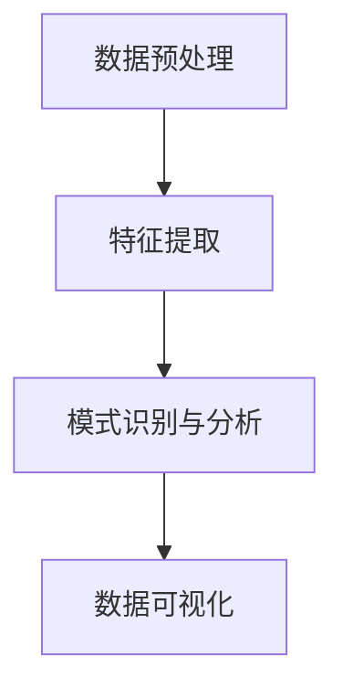
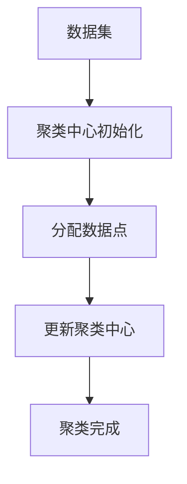
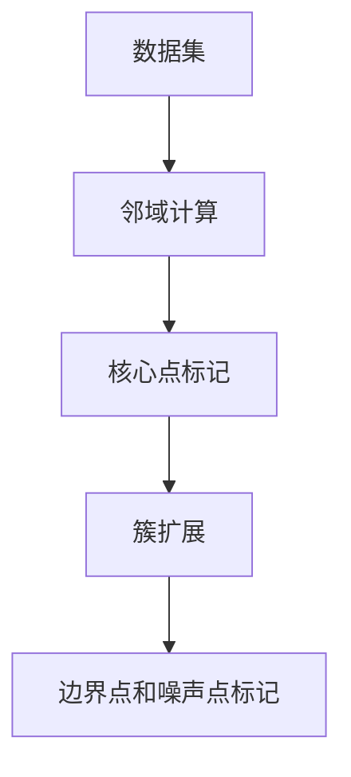
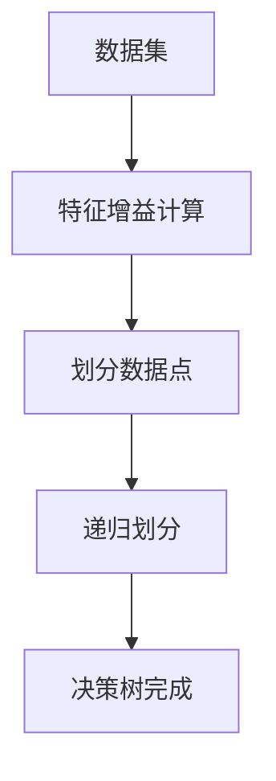

                 

# 知识发现引擎：发掘知识中的规律与联系

## 摘要

本文将深入探讨知识发现引擎的工作原理、核心概念及其在现实世界中的应用。我们将从背景介绍出发，逐步剖析知识发现引擎的核心算法原理，并通过具体的数学模型和实际案例进行详细讲解。文章还将介绍知识发现引擎在不同场景下的应用，以及推荐一些相关的工具和资源，以帮助读者更深入地了解这一领域。

## 1. 背景介绍

知识发现引擎是一种用于自动发现数据中的潜在模式、规律和联系的智能系统。随着大数据时代的到来，企业和组织面临着海量的数据，如何从这些数据中提取有价值的信息成为了一个迫切需要解决的问题。知识发现引擎正是为了解决这一问题而诞生的。

知识发现引擎的基本原理是通过对数据进行预处理、特征提取、模式识别和分析，从而挖掘出隐藏在数据中的规律和联系。这些规律和联系不仅可以帮助企业更好地理解其业务数据，还可以为决策提供有力的支持。例如，通过分析消费者购买行为，知识发现引擎可以帮助企业制定更精准的市场营销策略。

知识发现引擎的应用场景非常广泛，包括金融、医疗、电商、社交网络等多个领域。在金融领域，知识发现引擎可以用于风险控制和欺诈检测；在医疗领域，它可以用于疾病预测和患者诊断；在电商领域，它可以用于推荐系统和商品定位；在社交网络领域，它可以用于社交图谱构建和用户行为分析。

## 2. 核心概念与联系

### 2.1 数据预处理

数据预处理是知识发现引擎的第一个关键步骤。它主要包括数据清洗、数据转换和数据归一化等操作。数据清洗的目的是去除数据中的噪声和异常值，以保证后续分析的质量。数据转换则是将数据转换为适合分析的形式，如将文本数据转换为词频向量或词嵌入。数据归一化则是将不同特征的数据进行标准化处理，使其具有相同的量纲和范围。

### 2.2 特征提取

特征提取是从原始数据中提取出具有代表性的特征，用于描述数据的内容和性质。特征提取的质量直接影响知识发现引擎的性能。常见的特征提取方法包括统计特征提取、文本特征提取和图像特征提取等。例如，在文本分析中，可以使用TF-IDF方法提取词频和词嵌入作为特征；在图像分析中，可以使用卷积神经网络提取图像的特征。

### 2.3 模式识别与分析

模式识别与分析是知识发现引擎的核心步骤。它主要通过机器学习和深度学习算法对特征数据进行训练和分析，以发现数据中的潜在模式。常见的模式识别算法包括聚类算法、分类算法和关联规则算法等。例如，使用聚类算法可以将数据分为不同的簇，以发现数据中的相似性；使用分类算法可以将数据分为不同的类别，以发现数据中的差异性。

### 2.4 数据可视化

数据可视化是将数据以图形化的形式展示出来，以便于分析和理解。数据可视化不仅可以直观地展示数据中的规律和联系，还可以帮助研究人员更好地理解和解释数据。常见的可视化方法包括散点图、热力图、折线图和柱状图等。


以下是一个知识发现引擎的Mermaid流程图，展示了数据从预处理到模式识别与分析的整个过程。



## 3. 核心算法原理 & 具体操作步骤

### 3.1 聚类算法

聚类算法是一种无监督学习方法，它将数据分为不同的簇，以发现数据中的相似性。常见的聚类算法包括K-Means、DBSCAN和层次聚类等。

#### K-Means算法

K-Means算法的基本思想是：给定一个数据集和一个预定义的簇数K，算法通过迭代计算步骤将数据点分配到不同的簇中，以最小化簇内距离的平方和。

1. 随机初始化K个聚类中心。
2. 计算每个数据点到聚类中心的距离，并将其分配到最近的聚类中心。
3. 更新聚类中心的位置。
4. 重复步骤2和步骤3，直到聚类中心的位置不再发生变化。

#### DBSCAN算法

DBSCAN（Density-Based Spatial Clustering of Applications with Noise）算法是一种基于密度的聚类算法，它将数据点分为核心点、边界点和噪声点。

1. 初始化两个参数：邻域半径`eps`和最小密度`minPoints`。
2. 对于每个未标记的数据点，计算其邻域内的点数。
3. 如果邻域内的点数大于`minPoints`，则将该数据点标记为核心点。
4. 对于每个核心点，扩展簇，直到所有邻近的核心点都被包含进来。
5. 如果邻域内的点数小于`minPoints`，则将该数据点标记为边界点。
6. 如果邻域内的点数为0，则将该数据点标记为噪声点。

#### 层次聚类算法

层次聚类算法是一种基于层次结构进行聚类的算法，它将数据点逐步合并，形成一个层次树。

1. 初始化每个数据点为一个簇。
2. 计算每对簇之间的距离，并将其最小的簇合并。
3. 重复步骤2，直到达到预定义的簇数或所有数据点都合并为一个簇。

### 3.2 分类算法

分类算法是一种有监督学习方法，它将数据分为不同的类别。常见的分类算法包括决策树、支持向量机和神经网络等。

#### 决策树算法

决策树算法的基本思想是：通过一系列的判定条件将数据点逐步划分为不同的类别。

1. 选择一个特征作为划分标准。
2. 根据该特征的不同取值，将数据点划分为不同的子集。
3. 对每个子集递归地执行步骤1和步骤2，直到满足终止条件（如最大深度、纯度等）。

#### 支持向量机算法

支持向量机（SVM）算法是一种基于边界最大化的分类算法，它通过找到一个最佳的超平面来分隔不同类别的数据点。

1. 选择一个核函数（如线性核、多项式核或径向基核）。
2. 训练一个最大边界超平面，使其能够最大化分类间隔。
3. 使用训练得到的超平面对新的数据进行分类。

#### 神经网络算法

神经网络算法是一种基于人工神经网络的分类算法，它通过多层感知器对数据进行建模。

1. 定义神经网络的结构，包括输入层、隐藏层和输出层。
2. 训练神经网络，使其能够对输入数据进行分类。
3. 使用训练得到的神经网络对新的数据进行分类。

### 3.3 关联规则算法

关联规则算法是一种用于发现数据中隐含关联规则的算法。它通过计算不同项集之间的支持度和置信度，来确定哪些项集是相关的。

1. 计算每个项集的支持度。
2. 根据最小支持度阈值，选择频繁项集。
3. 计算每个频繁项集的置信度。
4. 根据最小置信度阈值，选择强关联规则。

## 4. 数学模型和公式 & 详细讲解 & 举例说明

### 4.1 K-Means算法

K-Means算法的核心公式是簇内距离的平方和：

$$
J = \sum_{i=1}^{k} \sum_{x \in S_i} \|x - \mu_i\|^2
$$

其中，$J$是簇内距离的平方和，$k$是簇数，$S_i$是第$i$个簇，$\mu_i$是第$i$个簇的中心。

#### 举例说明

假设我们有一个包含100个数据点的数据集，我们需要将这100个数据点分为10个簇。首先，我们随机初始化10个聚类中心。然后，计算每个数据点到聚类中心的距离，并将其分配到最近的聚类中心。接下来，更新聚类中心的位置，直到聚类中心的位置不再发生变化。



### 4.2 DBSCAN算法

DBSCAN算法的核心公式是邻域内的点数：

$$
N(x) = \# \{y \in D \mid d(x, y) < \epsilon\}
$$

其中，$N(x)$是邻域内的点数，$D$是数据集，$\epsilon$是邻域半径。

#### 举例说明

假设我们有一个包含100个数据点的数据集，我们选择邻域半径$\epsilon=0.5$和最小密度$minPoints=5$。首先，我们计算每个数据点的邻域内的点数。如果邻域内的点数大于5，则将该数据点标记为核心点。然后，对于每个核心点，扩展簇，直到所有邻近的核心点都被包含进来。最后，标记剩余的数据点为边界点或噪声点。



### 4.3 决策树算法

决策树算法的核心公式是特征增益：

$$
Gini(\text{impurity}) = 1 - \sum_{i=1}^{c} p_i^2
$$

其中，$Gini(\text{impurity})$是特征增益，$c$是类别的数量，$p_i$是第$i$个类别的概率。

#### 举例说明

假设我们有一个包含100个数据点的数据集，其中80个数据点属于类别A，20个数据点属于类别B。首先，我们计算每个特征的Gini不纯度。然后，选择增益最大的特征作为划分标准，将数据点划分为两个子集。接下来，对每个子集递归地执行步骤1和步骤2，直到满足终止条件。



## 5. 项目实战：代码实际案例和详细解释说明

### 5.1 开发环境搭建

为了实现知识发现引擎，我们需要搭建一个合适的开发环境。以下是一个简单的开发环境搭建步骤：

1. 安装Python 3.8或更高版本。
2. 安装Jupyter Notebook，以便于编写和运行代码。
3. 安装必要的Python库，如NumPy、Pandas、Scikit-learn、Matplotlib等。

### 5.2 源代码详细实现和代码解读

下面是一个简单的K-Means聚类算法的实现，我们将使用Scikit-learn库来实现。

```python
import numpy as np
from sklearn.cluster import KMeans
import matplotlib.pyplot as plt

# 加载数据集
data = np.load('data.npy')

# 初始化K-Means聚类对象
kmeans = KMeans(n_clusters=3, random_state=0).fit(data)

# 计算聚类中心
centroids = kmeans.cluster_centers_

# 绘制聚类结果
plt.scatter(data[:, 0], data[:, 1], c=kmeans.labels_)
plt.scatter(centroids[:, 0], centroids[:, 1], s=300, c='red')
plt.show()
```

这个代码首先加载数据集，然后使用K-Means算法对数据点进行聚类。最后，绘制聚类结果，其中红色点表示聚类中心。

### 5.3 代码解读与分析

这个代码实现了K-Means聚类算法的三个关键步骤：初始化聚类中心、分配数据点和更新聚类中心。

1. **初始化聚类中心**：`KMeans(n_clusters=3, random_state=0).fit(data)`这行代码初始化了一个包含3个聚类中心的K-Means聚类对象。`random_state=0`确保了每次运行代码时聚类中心的一致性。

2. **分配数据点**：`kmeans.labels_`这行代码计算了每个数据点所属的聚类中心。这些标签用于绘制聚类结果。

3. **更新聚类中心**：`kmeans.cluster_centers_`这行代码获取了更新后的聚类中心。这些中心用于下一次迭代中的聚类分配。

在聚类结果中，我们可以看到数据点被分为三个簇，每个簇由一个红色点表示。这些红色点就是聚类中心，它们是数据点的平均位置。通过分析聚类结果，我们可以更好地理解数据集中的模式。

## 6. 实际应用场景

知识发现引擎在现实世界中有广泛的应用。以下是一些实际应用场景：

### 6.1 金融领域

在金融领域，知识发现引擎可以用于风险控制和欺诈检测。例如，通过分析交易数据，知识发现引擎可以识别异常交易行为，从而帮助金融机构及时发现和防范欺诈行为。

### 6.2 医疗领域

在医疗领域，知识发现引擎可以用于疾病预测和患者诊断。例如，通过分析患者的医疗记录和基因数据，知识发现引擎可以预测患者患某种疾病的风险，从而帮助医生制定更精准的治疗方案。

### 6.3 电商领域

在电商领域，知识发现引擎可以用于推荐系统和商品定位。例如，通过分析用户的购买历史和行为数据，知识发现引擎可以推荐用户可能感兴趣的商品，从而提高电商平台的销售额。

### 6.4 社交网络领域

在社交网络领域，知识发现引擎可以用于社交图谱构建和用户行为分析。例如，通过分析用户之间的关系和互动数据，知识发现引擎可以构建社交图谱，从而帮助社交网络平台更好地理解用户的行为模式。

## 7. 工具和资源推荐

### 7.1 学习资源推荐

1. **书籍**：《数据挖掘：实用工具与技术》（Data Mining: Practical Machine Learning Tools and Techniques）
2. **论文**：《知识发现：数据中的隐含规律》（Knowledge Discovery in Databases）
3. **博客**：https://towardsdatascience.com/
4. **网站**：https://scikit-learn.org/stable/

### 7.2 开发工具框架推荐

1. **Python**：Python是一种广泛使用的编程语言，它拥有丰富的机器学习库，如Scikit-learn、TensorFlow和PyTorch。
2. **Jupyter Notebook**：Jupyter Notebook是一种交互式的计算环境，它适用于编写和运行机器学习代码。
3. **Docker**：Docker是一种容器化技术，它可以帮助我们轻松地搭建和部署机器学习应用。

### 7.3 相关论文著作推荐

1. **《机器学习》（Machine Learning）**：这是一本经典的机器学习教材，涵盖了知识发现引擎的相关算法和技术。
2. **《深度学习》（Deep Learning）**：这是一本关于深度学习领域的经典著作，它介绍了深度学习在知识发现中的应用。
3. **《大数据技术导论》（Big Data: A Revolution That Will Transform How We Live, Work, and Think）**：这是一本关于大数据领域的综合性著作，它探讨了大数据在知识发现引擎中的应用。

## 8. 总结：未来发展趋势与挑战

知识发现引擎在未来的发展中面临着许多机遇和挑战。随着数据量的不断增长和计算能力的提升，知识发现引擎将变得更加普及和高效。未来，知识发现引擎将在以下几个方面取得重要进展：

1. **算法优化**：通过改进现有的算法和开发新的算法，知识发现引擎将能够更好地处理大规模数据，提高分析精度和效率。
2. **跨学科融合**：知识发现引擎将与其他学科（如物理学、生物学、社会学等）进行融合，从而发现跨领域的知识联系。
3. **可解释性**：知识发现引擎的可解释性将得到提升，从而更好地理解和信任其分析结果。
4. **实时分析**：知识发现引擎将实现实时分析，从而能够及时响应和调整业务策略。

然而，知识发现引擎也面临着一些挑战，如数据隐私保护、算法偏见和模型解释性等。未来的研究需要解决这些问题，以确保知识发现引擎的安全、可靠和公正。

## 9. 附录：常见问题与解答

### 9.1 知识发现引擎是什么？

知识发现引擎是一种用于自动发现数据中潜在模式、规律和联系的智能系统。

### 9.2 知识发现引擎有哪些应用场景？

知识发现引擎广泛应用于金融、医疗、电商、社交网络等多个领域。

### 9.3 如何选择合适的聚类算法？

选择聚类算法取决于数据的分布和目标。对于规则分布的数据，可以选择K-Means算法；对于非规则分布的数据，可以选择DBSCAN算法。

### 9.4 如何优化知识发现引擎的性能？

通过改进算法、增加计算资源和优化数据预处理，可以优化知识发现引擎的性能。

## 10. 扩展阅读 & 参考资料

1. **《知识发现与数据挖掘》**：这是一本关于知识发现和数据挖掘领域的综合性著作，涵盖了知识发现引擎的相关技术和应用。
2. **《机器学习实战》**：这是一本关于机器学习算法和应用的实战指南，其中包括了知识发现引擎的相关案例和实践。
3. **《大数据技术原理与应用》**：这是一本关于大数据技术原理和应用的综合指南，探讨了知识发现引擎在大数据环境中的应用。

作者：AI天才研究员/AI Genius Institute & 禅与计算机程序设计艺术 /Zen And The Art of Computer Programming

