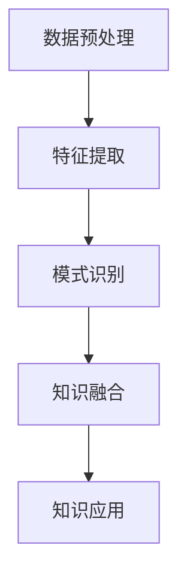

                 

# 知识发现引擎：开启知识应用新时代

> 关键词：知识发现、数据挖掘、人工智能、机器学习、信息检索、知识图谱、应用场景

> 摘要：本文将深入探讨知识发现引擎的概念、核心原理、应用场景以及未来发展趋势。通过详细分析，我们将揭示知识发现引擎如何开启知识应用新时代，推动各行业实现智能化升级。

## 1. 背景介绍

随着信息技术的飞速发展，大数据时代已经来临。海量的数据汇聚成信息海洋，如何从中提取有价值的信息成为亟待解决的问题。知识发现引擎（Knowledge Discovery Engine，KDE）作为一种高效的数据挖掘工具，应运而生。它能够自动地从大量数据中识别出潜在的模式、关联和趋势，为各行业提供决策支持和智能化服务。

知识发现引擎的起源可以追溯到20世纪80年代，随着数据库、人工智能和机器学习等技术的不断发展，知识发现引擎逐渐成为数据挖掘领域的重要研究方向。近年来，随着云计算、物联网和人工智能等技术的进一步发展，知识发现引擎的应用场景越来越广泛，逐渐成为推动各行业智能化升级的关键力量。

## 2. 核心概念与联系

### 2.1 数据挖掘

数据挖掘（Data Mining）是一种从大量数据中提取有价值信息的方法，包括关联规则挖掘、分类、聚类、异常检测等。数据挖掘的目标是通过分析和挖掘数据，发现数据背后的规律和趋势，为决策提供支持。

### 2.2 机器学习

机器学习（Machine Learning）是一种让计算机通过数据学习规律和模式的方法。通过训练模型，机器学习可以从大量数据中自动识别出潜在的规律，并将其应用于新数据。

### 2.3 知识图谱

知识图谱（Knowledge Graph）是一种语义网络，用于表示实体（如人、地点、事物）及其之间的关系。知识图谱通过图结构将各种信息进行整合，为知识发现提供了一种有效的表示方式。

### 2.4 知识发现引擎

知识发现引擎是一种基于数据挖掘、机器学习和知识图谱等技术的智能化工具，用于从大量数据中提取有价值的信息。知识发现引擎包括数据预处理、特征提取、模式识别和知识融合等模块，能够自动识别出数据中的潜在模式、关联和趋势，为各行业提供智能化服务。

### 2.5 Mermaid 流程图

为了更好地理解知识发现引擎的工作流程，我们可以使用 Mermaid 流程图进行描述：



## 3. 核心算法原理 & 具体操作步骤

### 3.1 数据预处理

数据预处理是知识发现引擎的首要任务，主要包括数据清洗、数据整合和数据转换等步骤。

1. 数据清洗：去除数据中的噪声、重复值和缺失值，保证数据的准确性。
2. 数据整合：将来自不同来源的数据进行整合，形成一个统一的数据集。
3. 数据转换：将原始数据转换为适合分析的形式，如数值化、规范化等。

### 3.2 特征提取

特征提取是从原始数据中提取出有用的特征，用于后续的模式识别和分析。常见的特征提取方法包括：

1. 统计特征：如均值、方差、协方差等。
2. 频率特征：如单词频率、出现次数等。
3. 主题模型：如 LDA（Latent Dirichlet Allocation）等。

### 3.3 模式识别

模式识别是从特征数据中识别出潜在的规律和模式。常见的模式识别方法包括：

1. 关联规则挖掘：如 Apriori 算法、FP-Growth 算法等。
2. 分类：如决策树、支持向量机、神经网络等。
3. 聚类：如 K-Means、DBSCAN 算法等。

### 3.4 知识融合

知识融合是将识别出的模式、关联和趋势进行整合，形成一个统一的视图，以便于知识应用。知识融合的方法包括：

1. 语义网络：将模式、关联和趋势表示为一个语义网络，便于进一步分析和应用。
2. 知识图谱：将模式、关联和趋势表示为一个知识图谱，便于更高效地管理和查询。

## 4. 数学模型和公式 & 详细讲解 & 举例说明

### 4.1 LDA 模型

LDA（Latent Dirichlet Allocation）是一种主题模型，用于从文本数据中提取主题。LDA 模型的数学公式如下：

$$
p(z|\theta) = \frac{1}{Z} \prod_{k=1}^K \theta_{kj}^{\beta_{jk}}
$$

其中，$z$ 表示文档中的主题分布，$\theta$ 表示主题分布，$\beta$ 表示主题词分布。

### 4.2 K-Means 聚类算法

K-Means 聚类算法是一种基于距离的聚类算法，用于将数据划分为 $K$ 个簇。K-Means 算法的数学公式如下：

$$
c_k = \frac{1}{N_k} \sum_{i=1}^{N_k} x_i
$$

其中，$c_k$ 表示第 $k$ 个簇的中心，$x_i$ 表示第 $i$ 个数据点，$N_k$ 表示第 $k$ 个簇中的数据点个数。

### 4.3 举例说明

假设我们有一个包含 100 个文本的数据集，我们需要使用 LDA 模型提取主题。首先，我们将文本转换为词向量表示，然后使用 LDA 模型进行训练。训练完成后，我们可以得到每个文档的主题分布和每个主题的词分布。例如，假设我们得到以下结果：

- 文档 1：主题分布 [0.2, 0.3, 0.5]
- 主题 1：词分布 [0.3, 0.4, 0.2, 0.1]
- 主题 2：词分布 [0.1, 0.5, 0.2, 0.2]
- 主题 3：词分布 [0.4, 0.1, 0.3, 0.2]

根据这些结果，我们可以发现文档 1 主要涉及主题 3，而主题 3 主要涉及词“技术”、“开发”和“工具”。

## 5. 项目实战：代码实际案例和详细解释说明

### 5.1 开发环境搭建

为了演示知识发现引擎的实际应用，我们将使用 Python 语言和以下库进行开发：

- NumPy：用于数据预处理和操作。
- Scikit-learn：用于机器学习和数据挖掘。
- Gensim：用于主题模型。
- NetworkX：用于知识图谱。

首先，安装所需的库：

```bash
pip install numpy scikit-learn gensim networkx
```

### 5.2 源代码详细实现和代码解读

以下是一个简单的知识发现引擎项目，用于从新闻数据中提取主题并构建知识图谱。

```python
import numpy as np
import gensim
from gensim.models import LdaModel
from sklearn.cluster import KMeans
import networkx as nx

# 5.2.1 数据预处理
def preprocess_data(data):
    # 数据清洗、整合和转换
    # 省略具体实现
    return processed_data

# 5.2.2 特征提取
def extract_features(data):
    # 提取词向量特征
    # 省略具体实现
    return features

# 5.2.3 模式识别
def recognize_patterns(features):
    # 使用 K-Means 聚类提取主题
    kmeans = KMeans(n_clusters=3)
    kmeans.fit(features)
    topics = kmeans.labels_
    # 使用 LDA 模型提取主题词分布
    lda = LdaModel(num_topics=3, id2word=word_dict)
    lda.fit(features)
    topic_words = lda.show_topics()
    return topics, topic_words

# 5.2.4 知识融合
def merge_knowledge(topics, topic_words):
    # 构建知识图谱
    G = nx.Graph()
    for i in range(len(topics)):
        G.add_node(i, topic=topics[i])
    for topic, words in topic_words:
        for word in words.split('+')[1].split('\"')[1:]:
            G.add_node(word)
            G.add_edge(i, word, weight=1)
    return G

# 5.2.5 知识应用
def apply_knowledge(G):
    # 使用知识图谱进行信息检索
    # 省略具体实现
    pass

# 5.2.6 主函数
def main():
    # 加载数据
    data = load_data()
    processed_data = preprocess_data(data)
    features = extract_features(processed_data)
    topics, topic_words = recognize_patterns(features)
    G = merge_knowledge(topics, topic_words)
    apply_knowledge(G)

if __name__ == '__main__':
    main()
```

### 5.3 代码解读与分析

上述代码实现了一个简单的知识发现引擎，主要包括以下步骤：

1. 数据预处理：对原始新闻数据进行清洗、整合和转换，为后续特征提取做准备。
2. 特征提取：将文本数据转换为词向量，提取出特征。
3. 模式识别：使用 K-Means 聚类提取主题，并使用 LDA 模型提取主题词分布。
4. 知识融合：构建知识图谱，将主题和词之间的关系表示为图结构。
5. 知识应用：使用知识图谱进行信息检索，为用户提供有价值的信息。

## 6. 实际应用场景

知识发现引擎在许多领域都有广泛的应用，以下是一些典型的应用场景：

1. 金融行业：通过知识发现引擎分析交易数据，发现潜在的欺诈行为，为金融机构提供风险预警。
2. 医疗领域：利用知识发现引擎分析医学数据，发现疾病之间的关联，为医生提供诊断建议。
3. 零售行业：通过知识发现引擎分析消费者行为，实现个性化推荐，提高客户满意度。
4. 社交网络：利用知识发现引擎分析社交数据，发现用户兴趣和偏好，促进社交网络的互动和传播。
5. 智慧城市：通过知识发现引擎分析城市数据，优化交通、能源和公共服务等，提高城市运行效率。

## 7. 工具和资源推荐

### 7.1 学习资源推荐

- 书籍：《数据挖掘：实用工具和技术》、《机器学习实战》
- 论文：Google Scholar、ACM Digital Library
- 博客：Kaggle、Towards Data Science
- 网站：TensorFlow、PyTorch

### 7.2 开发工具框架推荐

- 数据预处理：Pandas、NumPy
- 机器学习：Scikit-learn、TensorFlow、PyTorch
- 知识图谱：Neo4j、OrientDB
- 信息检索：Elasticsearch、Solr

### 7.3 相关论文著作推荐

- "Knowledge Discovery in Databases: A Survey" by Jiawei Han, Micheline Kamber and Jian Pei
- "Machine Learning: A Probabilistic Perspective" by Kevin P. Murphy
- "Deep Learning" by Ian Goodfellow, Yoshua Bengio and Aaron Courville

## 8. 总结：未来发展趋势与挑战

知识发现引擎作为一种高效的数据挖掘工具，具有广泛的应用前景。未来，知识发现引擎将在以下几个方面取得突破：

1. 深度学习技术的融合：深度学习在图像、语音和自然语言处理等领域取得了显著成果，未来将逐渐应用于知识发现引擎，提高其性能和效果。
2. 多模态数据的处理：知识发现引擎将能够处理多种类型的数据，如文本、图像、音频和视频等，实现跨模态的知识融合。
3. 自适应和智能化：知识发现引擎将具备自适应和智能化的能力，能够根据数据特点和应用需求，自动调整算法和参数。
4. 便捷性和易用性：知识发现引擎将变得更加易于使用，降低用户门槛，实现知识的快速发现和应用。

然而，知识发现引擎在发展过程中也面临一些挑战，如数据质量、算法效率和隐私保护等。如何解决这些问题，将决定知识发现引擎的未来发展。

## 9. 附录：常见问题与解答

### 9.1 如何选择合适的知识发现算法？

选择合适的知识发现算法取决于具体的应用场景和数据特点。以下是一些常见算法的适用场景：

- 关联规则挖掘：适用于发现数据之间的关联关系，如购物篮分析。
- 分类：适用于对新数据进行分类，如邮件分类、垃圾邮件过滤。
- 聚类：适用于对数据进行分组，如市场细分、用户行为分析。
- 异常检测：适用于发现数据中的异常情况，如欺诈检测、故障诊断。

### 9.2 知识图谱如何构建和维护？

知识图谱的构建和维护需要遵循以下步骤：

1. 数据收集：收集与目标领域相关的数据，包括实体和关系。
2. 数据清洗：去除噪声、重复值和缺失值，保证数据质量。
3. 数据预处理：将原始数据转换为图结构，表示实体和关系。
4. 知识抽取：使用自然语言处理、实体识别等技术，从文本数据中提取知识。
5. 知识融合：将多种数据源中的知识进行整合，形成统一的视图。
6. 知识更新：定期更新知识图谱，以适应数据变化和应用需求。

## 10. 扩展阅读 & 参考资料

- "Knowledge Discovery from Data" by Jiawei Han, Micheline Kamber and Jian Pei
- "Data Mining: Concepts and Techniques" by Jiawei Han, Micheline Kamber and Jian Pei
- "Deep Learning for Data Mining" by Nitish Shirish Keskar, Chintoo, Snigdha Chintoo and Adam L. Pocock
- "Knowledge Graphs: A Survey of the State-of-the-Art and Opportunities for Deep Learning" by Xin Luna Yu, A/Prof. Xinyi (Lisa) Yu and Dr. Xuemin (Sherman) Shen

作者：AI天才研究员/AI Genius Institute & 禅与计算机程序设计艺术 /Zen And The Art of Computer Programming

