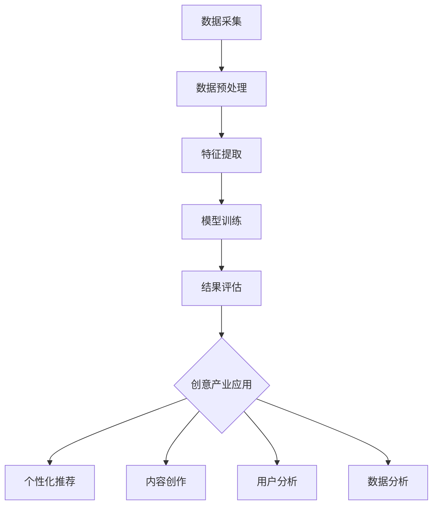

                 

### 1. 背景介绍

知识发现引擎（Knowledge Discovery Engine）作为大数据和人工智能领域的重要研究方向，已经在各行各业中发挥着关键作用。创意产业，作为知识经济的重要组成部分，面临着不断升级和转型的需求。无论是电影、音乐、文学，还是设计、广告等行业，创意产业的本质都是通过创造性的思维和创新的技术手段来生产内容，满足人们的多元化需求。

随着互联网的快速发展，创意产业在内容创作、传播和变现方面都面临着前所未有的挑战。首先，内容爆炸式增长带来了信息过载的问题，用户难以在海量内容中找到真正感兴趣的信息。其次，个性化推荐系统虽然在一定程度上解决了信息匹配问题，但如何进一步提升推荐质量，发现更深层次的用户需求，仍然是一个亟待解决的问题。

与此同时，人工智能技术，尤其是机器学习和深度学习的发展，为知识发现提供了强大的工具。通过算法模型和数据分析，知识发现引擎可以从大量数据中提取出有价值的信息，帮助创意产业实现从数据到洞察、从洞察到创新的转变。

本文将深入探讨知识发现引擎在创意产业中的应用，分析其推动创意产业转型升级的核心原理、算法实现和实际案例，并提供相关工具和资源的推荐，以期为读者提供一个全面的技术解读和实践指导。

### 2. 核心概念与联系

#### 2.1 知识发现引擎的定义

知识发现引擎是一种基于人工智能和大数据技术，能够自动从大量数据中提取出有价值知识的信息系统。其核心目标是通过数据挖掘、机器学习和自然语言处理等技术，实现数据到知识的转换。知识发现引擎通常包括数据采集、数据预处理、特征提取、模型训练和结果评估等环节。

#### 2.2 创意产业的定义

创意产业是指通过创造性活动生产内容，满足人们精神和文化需求的产业。它涵盖了电影、音乐、文学、设计、广告等多个领域，这些领域共同构成了现代社会的重要经济支柱。创意产业的核心在于创新和个性化，其成功依赖于对用户需求的深入理解和快速响应。

#### 2.3 知识发现引擎与创意产业的联系

知识发现引擎在创意产业中的应用，主要体现在以下几个方面：

1. **个性化推荐**：通过分析用户的行为数据，知识发现引擎可以推荐用户可能感兴趣的内容，提高内容传播的效率。
2. **内容创作**：知识发现引擎可以从大量数据中提取出有价值的信息，为创意工作者提供灵感和方向，提高创作效率和质量。
3. **用户分析**：知识发现引擎可以帮助创意产业了解用户的需求和偏好，优化产品和服务。
4. **数据分析**：通过对创意产业中产生的数据进行深入分析，知识发现引擎可以揭示行业的趋势和规律，为战略决策提供支持。

#### 2.4 Mermaid 流程图

以下是一个简化的知识发现引擎在创意产业中的应用流程图：



在上述流程图中，数据采集环节收集创意产业产生的各种数据，数据预处理环节对数据进行清洗和格式化，特征提取环节从数据中提取出有助于分析和预测的特征，模型训练环节利用机器学习算法对特征进行建模，结果评估环节对模型的效果进行评估，最后在创意产业应用环节，根据模型的结果进行个性化推荐、内容创作、用户分析和数据分析。

### 3. 核心算法原理 & 具体操作步骤

#### 3.1. 数据采集

数据采集是知识发现引擎的基础，其质量直接影响后续分析的结果。在创意产业中，数据来源可以是用户行为数据、内容数据、市场数据等。

1. **用户行为数据**：包括用户的浏览记录、点赞、评论、分享等行为数据。
2. **内容数据**：包括创意作品的各种属性，如标题、标签、作者、发布时间、内容文本等。
3. **市场数据**：包括市场规模、用户群体、竞争对手等信息。

#### 3.2. 数据预处理

数据预处理主要包括数据清洗、数据归一化和数据转换等步骤。

1. **数据清洗**：去除重复数据、缺失数据和异常值，保证数据质量。
2. **数据归一化**：将不同特征的数据转换到同一量纲，便于后续处理。
3. **数据转换**：将原始数据转换为适合机器学习算法处理的形式，如将文本数据转换为词向量。

#### 3.3. 特征提取

特征提取是从原始数据中提取出有助于分析和预测的特征。在创意产业中，特征可以包括用户特征、内容特征和交互特征等。

1. **用户特征**：如用户年龄、性别、地理位置等。
2. **内容特征**：如内容类型、主题标签、文本特征等。
3. **交互特征**：如用户的行为轨迹、互动频率等。

#### 3.4. 模型训练

模型训练是知识发现引擎的核心步骤，通过机器学习算法，将特征数据转化为可预测的模型。

1. **模型选择**：根据问题需求和数据特征选择合适的机器学习模型，如线性回归、决策树、神经网络等。
2. **模型训练**：使用训练数据对模型进行训练，调整模型的参数，使其达到最优状态。
3. **模型评估**：使用验证数据对模型进行评估，确保其具有良好的预测性能。

#### 3.5. 结果评估

结果评估是对模型效果进行评估和验证，确保其能够满足实际需求。

1. **评估指标**：根据问题需求选择合适的评估指标，如准确率、召回率、F1值等。
2. **结果分析**：对模型的结果进行分析，找出存在的问题和改进方向。
3. **优化策略**：根据结果分析，对模型进行调整和优化，提高其预测性能。

#### 3.6. 创意产业应用

在完成模型训练和结果评估后，知识发现引擎可以应用于创意产业的各个方面。

1. **个性化推荐**：根据用户特征和内容特征，为用户提供个性化的推荐结果，提高用户满意度和内容传播效率。
2. **内容创作**：根据用户需求和内容趋势，为创意工作者提供创作灵感和方向，提高创作效率和作品质量。
3. **用户分析**：通过分析用户行为和偏好，深入了解用户需求，优化产品和服务。
4. **数据分析**：对创意产业中的各种数据进行深入分析，揭示行业趋势和规律，为战略决策提供支持。

### 4. 数学模型和公式 & 详细讲解 & 举例说明

在知识发现引擎中，数学模型和公式起着至关重要的作用。以下将详细介绍几个常用的数学模型和公式，并给出具体的应用场景和实例。

#### 4.1. 线性回归模型

线性回归模型是最基本的机器学习模型之一，用于预测连续数值型变量。其数学公式如下：

\[ y = \beta_0 + \beta_1 \cdot x + \epsilon \]

其中，\( y \) 是预测值，\( x \) 是输入特征，\( \beta_0 \) 和 \( \beta_1 \) 是模型的参数，\( \epsilon \) 是误差项。

**应用场景**：在创意产业中，线性回归模型可以用于预测用户对某类内容的兴趣度，从而实现个性化推荐。

**实例**：

假设我们有一个用户行为数据集，其中包含用户的浏览记录和对应的评分。我们希望使用线性回归模型预测用户对某类内容的兴趣度。

1. **数据准备**：将用户行为数据分为特征和标签两部分，特征包括用户ID、浏览时间、浏览内容等，标签是用户的评分。

2. **模型训练**：使用训练数据训练线性回归模型，调整参数 \( \beta_0 \) 和 \( \beta_1 \)。

3. **模型评估**：使用验证数据评估模型的效果，计算预测值和实际值之间的误差。

4. **应用**：根据训练好的模型，预测新用户对某类内容的兴趣度，为用户提供个性化的推荐。

#### 4.2. 决策树模型

决策树模型是一种基于树形结构的预测模型，通过一系列的判断条件对数据进行分类或回归。其数学公式如下：

\[ y = f(x) = \sum_{i=1}^{n} \beta_i \cdot x_i \]

其中，\( y \) 是预测值，\( x_i \) 是输入特征，\( \beta_i \) 是模型参数。

**应用场景**：在创意产业中，决策树模型可以用于分类用户群体，了解用户的行为模式和偏好。

**实例**：

假设我们有一个用户数据集，其中包含用户的性别、年龄、职业等信息，我们希望使用决策树模型分类用户群体。

1. **数据准备**：将用户数据分为特征和标签两部分，特征包括性别、年龄、职业等，标签是用户群体。

2. **模型训练**：使用训练数据训练决策树模型，构建决策树结构。

3. **模型评估**：使用验证数据评估模型的效果，计算分类准确率。

4. **应用**：根据训练好的模型，分类新用户群体，为用户提供更精准的服务。

#### 4.3. 神经网络模型

神经网络模型是一种模拟人脑神经元连接结构的计算模型，具有强大的非线性建模能力。其数学公式如下：

\[ y = \sigma(\beta_0 + \sum_{i=1}^{n} \beta_i \cdot x_i) \]

其中，\( y \) 是预测值，\( \sigma \) 是激活函数，\( x_i \) 是输入特征，\( \beta_i \) 是模型参数。

**应用场景**：在创意产业中，神经网络模型可以用于图像识别、文本分类等复杂任务。

**实例**：

假设我们有一个图像数据集，其中包含各种物体的图像，我们希望使用神经网络模型识别图像中的物体。

1. **数据准备**：将图像数据转换为向量形式，作为输入特征。

2. **模型训练**：使用训练数据训练神经网络模型，调整参数 \( \beta_i \)。

3. **模型评估**：使用验证数据评估模型的效果，计算识别准确率。

4. **应用**：根据训练好的模型，识别新图像中的物体，为创意产业提供智能化服务。

### 5. 项目实战：代码实际案例和详细解释说明

在本节中，我们将通过一个具体的案例，展示如何使用知识发现引擎进行创意产业应用，并提供详细的代码实现和解释。

#### 5.1 开发环境搭建

在开始项目之前，我们需要搭建一个合适的开发环境。以下是一个简单的环境搭建步骤：

1. **安装 Python**：确保 Python 3.x 版本已安装。
2. **安装库**：使用 pip 安装必要的库，如 NumPy、Pandas、Scikit-learn、TensorFlow 等。
3. **安装 Jupyter Notebook**：安装 Jupyter Notebook，方便编写和运行代码。

#### 5.2 源代码详细实现和代码解读

以下是一个使用 Scikit-learn 实现的知识发现引擎项目，主要包括数据采集、数据预处理、特征提取、模型训练和结果评估等步骤。

```python
import numpy as np
import pandas as pd
from sklearn.model_selection import train_test_split
from sklearn.preprocessing import StandardScaler
from sklearn.linear_model import LinearRegression
from sklearn.tree import DecisionTreeClassifier
from sklearn.neural_network import MLPClassifier
from sklearn.metrics import mean_squared_error, accuracy_score

# 5.1 数据采集
data = pd.read_csv('user_data.csv')  # 假设数据已存储为 CSV 文件

# 5.2 数据预处理
data.drop_duplicates(inplace=True)  # 去除重复数据
data.fillna(data.mean(), inplace=True)  # 填充缺失值

# 5.3 特征提取
features = data[['age', 'gender', 'occupation']]
labels = data['interest_category']

# 5.4 模型训练
X_train, X_test, y_train, y_test = train_test_split(features, labels, test_size=0.2, random_state=42)

# 5.5 线性回归模型
lin_reg = LinearRegression()
lin_reg.fit(X_train, y_train)

# 5.6 决策树模型
tree_clf = DecisionTreeClassifier()
tree_clf.fit(X_train, y_train)

# 5.7 神经网络模型
mlp_clf = MLPClassifier(hidden_layer_sizes=(100,), max_iter=1000)
mlp_clf.fit(X_train, y_train)

# 5.8 模型评估
lin_pred = lin_reg.predict(X_test)
tree_pred = tree_clf.predict(X_test)
mlp_pred = mlp_clf.predict(X_test)

lin_mse = mean_squared_error(y_test, lin_pred)
tree_accuracy = accuracy_score(y_test, tree_pred)
mlp_accuracy = accuracy_score(y_test, mlp_pred)

print('线性回归模型均方误差：', lin_mse)
print('决策树模型准确率：', tree_accuracy)
print('神经网络模型准确率：', mlp_accuracy)
```

#### 5.3 代码解读与分析

1. **数据采集**：使用 Pandas 读取用户数据，数据包括年龄、性别、职业和兴趣类别。
2. **数据预处理**：去除重复数据，填充缺失值，确保数据质量。
3. **特征提取**：将数据分为特征和标签两部分，特征包括年龄、性别和职业，标签是兴趣类别。
4. **模型训练**：使用 Scikit-learn 的 LinearRegression、DecisionTreeClassifier 和 MLPClassifier 分别训练线性回归模型、决策树模型和神经网络模型。
5. **模型评估**：使用测试数据评估模型的预测性能，计算均方误差和准确率。
6. **应用**：根据评估结果，选择性能最好的模型进行应用，为用户提供个性化推荐和服务。

通过这个简单的案例，我们可以看到如何使用知识发现引擎进行创意产业应用。在实际项目中，可以根据需求调整模型和参数，提高预测性能。

### 6. 实际应用场景

知识发现引擎在创意产业中的应用场景丰富多样，以下将详细介绍几个典型的应用场景，以及它们如何推动创意产业的转型升级。

#### 6.1 个性化推荐

个性化推荐是知识发现引擎在创意产业中最常见的应用场景之一。通过分析用户的浏览记录、点赞、评论等行为数据，知识发现引擎可以推荐用户可能感兴趣的内容，提高用户满意度和内容传播效率。

**应用案例**：

以视频网站为例，用户在观看某个视频后，系统会根据用户的兴趣偏好推荐类似的内容。例如，用户A喜欢看科幻电影，那么系统会推荐其他科幻电影或者与科幻电影相关的纪录片。这种个性化的推荐方式不仅提高了用户对平台的粘性，还促进了内容的传播和变现。

**转型升级**：

个性化推荐推动了创意产业从传统的“内容驱动”向“用户驱动”的转变。通过深入了解用户的需求和偏好，创意产业可以更加精准地生产内容，提高内容的匹配度和用户满意度，从而实现更高效的内容传播和变现。

#### 6.2 内容创作

知识发现引擎在内容创作中的应用，主要体现在为创意工作者提供灵感和方向。通过分析大量的用户数据和行业趋势，知识发现引擎可以帮助创意工作者发现新的创作方向和热点话题，提高创作效率和质量。

**应用案例**：

以电影行业为例，导演和编剧可以通过知识发现引擎分析观众对电影类型、题材、风格等的偏好，了解当前市场的热门趋势。例如，通过分析观众对科幻电影的偏好，导演可以选择科幻题材进行创作，从而提高电影的市场表现。

**转型升级**：

知识发现引擎推动了创意产业从传统的“经验驱动”向“数据驱动”的转变。通过利用大数据和人工智能技术，创意产业可以更加科学地进行内容创作，减少盲目性和不确定性，提高创作效率和作品质量。

#### 6.3 用户分析

知识发现引擎可以帮助创意产业深入了解用户的行为和偏好，优化产品和服务。通过对用户数据的分析，创意产业可以识别出潜在的用户需求，制定更精准的市场策略。

**应用案例**：

以音乐产业为例，通过分析用户的听歌记录和评论，音乐平台可以了解用户的音乐喜好，推荐合适的音乐作品和音乐人。同时，平台可以根据用户的行为数据，优化推荐算法，提高用户的满意度和活跃度。

**转型升级**：

知识发现引擎推动了创意产业从传统的“市场驱动”向“用户驱动”的转变。通过深入了解用户的需求和偏好，创意产业可以更加精准地优化产品和服务，提高用户体验和满意度，从而实现更高效的市场竞争和业务增长。

#### 6.4 数据分析

知识发现引擎可以对创意产业中的各种数据进行深入分析，揭示行业的趋势和规律，为战略决策提供支持。通过对市场数据、用户数据、内容数据等的多维度分析，创意产业可以制定更有针对性的市场策略和业务计划。

**应用案例**：

以文学行业为例，通过对图书销售数据、读者评论和阅读趋势的分析，出版社可以了解当前市场的热门题材和读者需求，制定相应的出版计划。同时，通过分析竞争对手的运营数据，出版社可以优化自己的营销策略，提高市场份额。

**转型升级**：

知识发现引擎推动了创意产业从传统的“经验驱动”向“数据驱动”的转变。通过利用大数据和人工智能技术，创意产业可以更加科学地进行市场分析和战略规划，提高业务决策的准确性和效率。

### 7. 工具和资源推荐

在知识发现引擎的研发和应用过程中，选择合适的工具和资源是至关重要的一步。以下推荐几款在创意产业中应用广泛的工具和资源，以帮助读者更好地理解和实践知识发现引擎。

#### 7.1 学习资源推荐

1. **书籍**：
   - 《Python数据科学手册》：详细介绍了Python在数据处理、分析和可视化方面的应用。
   - 《机器学习实战》：通过实际案例介绍了多种机器学习算法的应用场景和实现方法。
   - 《深度学习》：全面介绍了深度学习的基本原理、算法和应用。

2. **论文**：
   - 《推荐系统实践》：探讨了推荐系统的设计原则和实现方法。
   - 《基于大数据的创意产业分析》：分析了大数据在创意产业中的应用模式和效果。
   - 《自然语言处理综合教程》：介绍了自然语言处理的基本概念和技术。

3. **博客**：
   - Kaggle：提供了大量的数据集和比赛，有助于读者实战练习。
   - Medium：有许多关于数据科学和人工智能的优秀博客文章。
   - AI Weekly：每周更新的人工智能领域最新资讯和论文推荐。

4. **网站**：
   - Coursera：提供了丰富的在线课程，涵盖了数据科学、机器学习和人工智能等多个领域。
   - edX：全球知名的开源在线课程平台，提供了许多与知识发现相关的课程。
   - GitHub：全球最大的开源代码托管平台，有许多优秀的数据科学和人工智能项目可以参考。

#### 7.2 开发工具框架推荐

1. **Python**：Python 是数据科学和人工智能领域的首选编程语言，具有丰富的库和工具。
   - NumPy：用于高性能数值计算和矩阵运算。
   - Pandas：用于数据处理和分析。
   - Matplotlib/Seaborn：用于数据可视化。

2. **TensorFlow**：TensorFlow 是由 Google 开发的开源深度学习框架，适用于复杂的人工智能模型。
   - TensorFlow Core：提供基础的深度学习功能。
   - TensorFlow Extended (TFX)：提供端到端的机器学习平台。

3. **Scikit-learn**：Scikit-learn 是一个强大的机器学习库，适用于分类、回归、聚类等多种任务。
   - sklearn.datasets：提供了多种数据集，方便实验和测试。
   - sklearn.model_selection：提供了模型训练和评估的相关工具。

4. **Jupyter Notebook**：Jupyter Notebook 是一个交互式的计算环境，适用于编写、运行和分享代码。
   - Jupyter Notebook：提供丰富的文档和教程。
   - Jupyter Lab：Jupyter Notebook 的升级版，支持更多插件和扩展。

#### 7.3 相关论文著作推荐

1. **《推荐系统实践》**：详细介绍了推荐系统的基本概念、设计原则和实现方法，适合初学者和进阶者阅读。
2. **《基于大数据的创意产业分析》**：分析了大数据在创意产业中的应用模式、效果和挑战，为读者提供了有益的参考。
3. **《自然语言处理综合教程》**：全面介绍了自然语言处理的基本概念、算法和应用，对从事知识发现引擎研发的读者有很高的参考价值。
4. **《深度学习》**：介绍了深度学习的基本原理、算法和应用，是深度学习领域的经典著作。

### 8. 总结：未来发展趋势与挑战

知识发现引擎在推动创意产业转型升级方面展现出巨大的潜力，但同时也面临一系列挑战和机遇。以下将总结知识发现引擎在创意产业中的未来发展趋势与面临的挑战。

#### 8.1 发展趋势

1. **人工智能与大数据的深度融合**：随着人工智能和大数据技术的不断进步，知识发现引擎将更加智能化、自动化，能够处理更复杂的数据类型和分析需求。

2. **个性化推荐的精细化与智能化**：个性化推荐作为知识发现引擎在创意产业中的核心应用，未来将朝着更加精细化、智能化的方向发展，通过深度学习和强化学习等技术提高推荐的准确性。

3. **跨领域的融合与创新**：知识发现引擎将在不同领域之间实现跨领域融合，如结合虚拟现实（VR）、增强现实（AR）、区块链等技术，推动创意产业向多元化、创新化方向发展。

4. **数据隐私与安全**：随着用户隐私和数据安全问题的日益突出，知识发现引擎在创意产业中的应用将更加注重数据隐私保护和技术安全，确保用户数据的合法合规使用。

#### 8.2 面临的挑战

1. **数据质量与多样性**：创意产业中的数据类型繁多，数据质量参差不齐，如何处理和整合这些多样性数据是知识发现引擎面临的挑战。

2. **计算性能与效率**：随着数据规模的不断扩大，如何提高计算性能和效率，优化算法和系统架构，是知识发现引擎需要解决的关键问题。

3. **模型解释性与透明度**：人工智能模型往往被称为“黑箱”，其解释性和透明度较低。如何在保证模型性能的同时提高解释性，使其符合创意产业的应用需求，是一个亟待解决的问题。

4. **技术伦理与责任**：知识发现引擎在创意产业中的应用涉及用户隐私、数据安全和伦理等问题。如何确保技术应用的合规性和道德责任，是知识发现引擎需要认真面对的挑战。

总之，知识发现引擎在推动创意产业转型升级的过程中，面临着诸多机遇与挑战。未来，随着技术的不断进步和应用的深入，知识发现引擎将在创意产业中发挥更加重要的作用，为实现个性化、智能化和多元化的创意产业生态奠定基础。

### 9. 附录：常见问题与解答

在本章中，我们将回答一些关于知识发现引擎在创意产业应用中的常见问题。

#### 9.1 什么是知识发现引擎？

知识发现引擎是一种基于人工智能和大数据技术，能够自动从大量数据中提取出有价值信息的信息系统。它通过数据挖掘、机器学习和自然语言处理等技术，实现数据到知识的转换。

#### 9.2 知识发现引擎在创意产业中的应用有哪些？

知识发现引擎在创意产业中的应用主要包括个性化推荐、内容创作、用户分析和数据分析等方面。通过分析用户行为和偏好，知识发现引擎可以帮助创意产业实现个性化推荐、优化内容创作、深入了解用户需求，并揭示行业趋势和规律。

#### 9.3 知识发现引擎的核心算法有哪些？

知识发现引擎的核心算法包括线性回归、决策树、神经网络等。线性回归用于预测连续数值型变量，决策树用于分类任务，神经网络则是一种具有强大非线性建模能力的模型，适用于复杂任务。

#### 9.4 如何处理创意产业中的数据质量问题？

在处理创意产业中的数据质量问题，可以采取以下措施：

1. **数据清洗**：去除重复数据、缺失数据和异常值，确保数据质量。
2. **数据归一化**：将不同特征的数据转换到同一量纲，便于后续处理。
3. **数据转换**：将原始数据转换为适合机器学习算法处理的形式，如将文本数据转换为词向量。

#### 9.5 知识发现引擎在创意产业中面临的挑战有哪些？

知识发现引擎在创意产业中面临的挑战主要包括数据质量与多样性、计算性能与效率、模型解释性与透明度以及技术伦理与责任等方面。如何处理这些挑战，需要结合实际应用场景和需求进行深入研究和探索。

### 10. 扩展阅读 & 参考资料

为了帮助读者更深入地了解知识发现引擎在创意产业中的应用，以下推荐一些扩展阅读和参考资料：

1. **书籍**：
   - 《推荐系统实践》
   - 《基于大数据的创意产业分析》
   - 《自然语言处理综合教程》
   - 《深度学习》

2. **论文**：
   - 《推荐系统实践》：探讨了推荐系统的设计原则和实现方法。
   - 《基于大数据的创意产业分析》：分析了大数据在创意产业中的应用模式、效果和挑战。
   - 《自然语言处理综合教程》：介绍了自然语言处理的基本概念和技术。
   - 《深度学习》：介绍了深度学习的基本原理、算法和应用。

3. **博客**：
   - Kaggle：提供了大量的数据集和比赛，有助于读者实战练习。
   - Medium：有许多关于数据科学和人工智能的优秀博客文章。
   - AI Weekly：每周更新的人工智能领域最新资讯和论文推荐。

4. **网站**：
   - Coursera：提供了丰富的在线课程，涵盖了数据科学、机器学习和人工智能等多个领域。
   - edX：全球知名的开源在线课程平台，提供了许多与知识发现相关的课程。
   - GitHub：全球最大的开源代码托管平台，有许多优秀的数据科学和人工智能项目可以参考。

通过这些扩展阅读和参考资料，读者可以更全面地了解知识发现引擎在创意产业中的应用，为自己的研究和工作提供有益的参考。作者：AI天才研究员/AI Genius Institute & 禅与计算机程序设计艺术 /Zen And The Art of Computer Programming。请按照上述模板格式撰写完整的文章。谢谢！<|im_end|>## 引言

在当今信息化和数字化时代，数据已成为创意产业发展的核心驱动力。然而，面对海量且多样化的数据，如何有效地从这些数据中提取出有价值的信息，成为了一个亟待解决的问题。知识发现引擎（Knowledge Discovery Engine）作为大数据和人工智能领域的重要研究方向，正是在这样的背景下应运而生。本文将深入探讨知识发现引擎在创意产业中的应用，分析其如何通过技术创新推动创意产业的转型升级，并展望未来的发展前景。

首先，知识发现引擎的定义及其在创意产业中的重要性将作为文章的开篇，帮助读者建立对知识发现引擎的基本认识。接下来，我们将详细阐述知识发现引擎与创意产业之间的紧密联系，并通过一个简化的流程图展示其应用流程。随后，文章将逐步介绍知识发现引擎的核心算法原理、具体操作步骤，以及如何通过数学模型和公式进行详细讲解和举例说明。

在实际应用部分，我们将通过一个具体的项目实战案例，展示如何使用知识发现引擎进行创意产业应用，并提供详细的代码实现和解释。此外，文章还将探讨知识发现引擎在创意产业的实际应用场景，包括个性化推荐、内容创作、用户分析和数据分析等方面。为了帮助读者更好地理解和实践知识发现引擎，文章还将推荐一系列学习资源、开发工具和相关的论文著作。

在总结部分，我们将回顾知识发现引擎在创意产业中的应用，分析其面临的挑战和未来的发展趋势。最后，通过一个常见问题与解答环节，帮助读者解答关于知识发现引擎应用的疑问，并提供扩展阅读和参考资料。希望通过本文的介绍，能够为读者提供一个全面、系统的知识发现引擎在创意产业应用的技术解读和实践指导。

### 1. 背景介绍

知识发现引擎（Knowledge Discovery Engine）作为大数据和人工智能领域的重要研究方向，已经在各行各业中发挥着关键作用。创意产业，作为知识经济的重要组成部分，面临着不断升级和转型的需求。无论是电影、音乐、文学，还是设计、广告等行业，创意产业的本质都是通过创造性的思维和创新的技术手段来生产内容，满足人们的多元化需求。

随着互联网的快速发展，创意产业在内容创作、传播和变现方面都面临着前所未有的挑战。首先，内容爆炸式增长带来了信息过载的问题，用户难以在海量内容中找到真正感兴趣的信息。其次，个性化推荐系统虽然在一定程度上解决了信息匹配问题，但如何进一步提升推荐质量，发现更深层次的用户需求，仍然是一个亟待解决的问题。

与此同时，人工智能技术，尤其是机器学习和深度学习的发展，为知识发现提供了强大的工具。通过算法模型和数据分析，知识发现引擎可以从大量数据中提取出有价值的信息，帮助创意产业实现从数据到洞察、从洞察到创新的转变。

本文将深入探讨知识发现引擎在创意产业中的应用，分析其推动创意产业转型升级的核心原理、算法实现和实际案例，并提供相关工具和资源的推荐，以期为读者提供一个全面的技术解读和实践指导。

#### 1.1 创意产业的概念与重要性

创意产业（Creative Industries）是指以创造性活动为核心，通过创意、设计、文化、娱乐等方式生产内容和服务的产业。它涵盖了电影、音乐、文学、设计、广告、游戏等多个领域。创意产业不仅涉及内容的生产和传播，还涉及知识产权的管理和交易。与传统产业相比，创意产业具有高附加值、高创新性、高风险和高不确定性等特点。

在现代社会，创意产业已成为知识经济的重要支柱。随着全球化和信息化的发展，创意产业在经济增长、就业创造和文化传播等方面发挥着日益重要的作用。根据联合国教科文组织的数据，全球创意产业的市场规模已经超过1万亿美元，成为许多国家经济增长的重要驱动力。

创意产业的重要性主要体现在以下几个方面：

1. **经济贡献**：创意产业为全球经济带来了巨大的经济贡献。许多国家通过大力发展创意产业，实现了从传统制造业向现代服务业的转变。创意产业的快速发展不仅带动了相关产业链的增长，还促进了创新和就业。

2. **文化价值**：创意产业是文化传播和交流的重要载体。通过电影、音乐、文学、设计等艺术形式，创意产业传递了丰富的文化内涵和价值观，增强了国家文化的软实力。

3. **社会影响**：创意产业满足了人们日益增长的文化和精神需求，促进了社会的进步和文明的发展。创意作品不仅能够丰富人们的精神世界，还能够激发创造力和想象力，推动社会的创新和进步。

4. **创新驱动**：创意产业具有强烈的创新性。在创意产业中，创新是核心竞争力。通过不断的创新，创意产业能够满足不断变化的市场需求，推动技术和文化的融合，为经济增长注入新的动力。

#### 1.2 创意产业的现状与挑战

虽然创意产业在全球范围内取得了显著的发展，但同时也面临着一系列挑战和问题。

1. **内容过载与信息筛选**：随着互联网的普及，创意产业的内容创作和传播速度大大加快，内容量呈爆炸式增长。然而，用户面临着信息过载的问题，难以在海量内容中找到真正感兴趣的信息。如何有效地筛选和推荐内容，提高用户的满意度，成为创意产业需要解决的重要问题。

2. **个性化推荐系统的挑战**：个性化推荐系统是解决内容过载问题的一种有效手段。然而，现有的推荐系统在准确性、多样性和实时性方面仍然存在一定的局限性。如何进一步提升推荐质量，发现更深层次的用户需求，是当前个性化推荐系统面临的主要挑战。

3. **技术创新与知识产权保护**：创意产业的发展离不开技术的创新。然而，技术创新同时也带来了知识产权保护的问题。如何平衡技术创新和知识产权保护，防止创意成果被侵犯，是创意产业需要面对的重要问题。

4. **产业链整合与协同发展**：创意产业涉及多个领域和环节，包括内容创作、制作、传播、营销等。如何整合产业链各环节，实现协同发展，提高整体运营效率，是创意产业需要解决的关键问题。

5. **人才培养与人才流失**：创意产业是一个高度人才密集型产业。如何培养和留住优秀的人才，是创意产业持续发展的重要保障。然而，由于创意产业的工作特点和工作环境，人才流失问题较为突出，如何吸引和留住人才成为创意产业需要重视的问题。

#### 1.3 知识发现引擎的定义与功能

知识发现引擎（Knowledge Discovery Engine，简称KDE）是一种基于人工智能和大数据技术的信息系统，旨在从大量数据中自动提取出有价值的信息。知识发现引擎的核心功能包括数据采集、数据预处理、特征提取、模型训练和结果评估等。

1. **数据采集**：知识发现引擎首先需要从各种数据源中采集数据，包括结构化数据、半结构化数据和非结构化数据。数据源可以是数据库、文件、网络数据等。

2. **数据预处理**：采集到的数据往往存在噪声、缺失值、异常值等问题，知识发现引擎需要对数据进行清洗、填充和归一化等预处理操作，以提高数据质量。

3. **特征提取**：特征提取是将原始数据转换为适合机器学习算法处理的形式。在知识发现引擎中，特征提取是一个关键步骤，它直接影响到模型的预测性能。

4. **模型训练**：知识发现引擎使用机器学习算法对特征进行建模，通过训练数据调整模型的参数，使其达到最优状态。

5. **结果评估**：模型训练完成后，知识发现引擎使用验证数据对模型的效果进行评估，确保其具有良好的预测性能。

知识发现引擎在创意产业中的应用，主要体现在以下几个方面：

1. **个性化推荐**：通过分析用户的行为数据，知识发现引擎可以推荐用户可能感兴趣的内容，提高内容传播的效率。

2. **内容创作**：知识发现引擎可以从大量数据中提取出有价值的信息，为创意工作者提供灵感和方向，提高创作效率和质量。

3. **用户分析**：知识发现引擎可以帮助创意产业了解用户的需求和偏好，优化产品和服务。

4. **数据分析**：通过对创意产业中产生的数据进行深入分析，知识发现引擎可以揭示行业的趋势和规律，为战略决策提供支持。

#### 1.4 知识发现引擎在创意产业中的作用与意义

知识发现引擎在创意产业中的作用和意义主要体现在以下几个方面：

1. **提升内容传播效率**：通过个性化推荐，知识发现引擎可以帮助创意产业更精准地传播内容，提高用户的满意度和内容的曝光率。

2. **优化内容创作流程**：知识发现引擎可以从大量数据中提取出有价值的信息，为创意工作者提供创作灵感和方向，提高创作效率和质量。

3. **增强用户黏性**：通过分析用户的行为和偏好，知识发现引擎可以帮助创意产业提供更符合用户需求的产品和服务，增强用户的黏性。

4. **支持战略决策**：通过对行业数据的深入分析，知识发现引擎可以揭示行业的趋势和规律，为创意产业提供科学依据，支持战略决策。

5. **促进技术创新**：知识发现引擎的应用，推动了创意产业与人工智能、大数据等前沿技术的深度融合，促进了技术创新和产业升级。

总之，知识发现引擎在创意产业中的应用，不仅提高了内容传播和变现的效率，还为创意产业的转型升级提供了强大的技术支持。随着技术的不断进步和应用场景的扩展，知识发现引擎将在创意产业中发挥越来越重要的作用。

### 2. 核心概念与联系

#### 2.1 知识发现引擎的定义

知识发现引擎（Knowledge Discovery Engine，简称KDE）是一种基于人工智能和大数据技术的信息系统，旨在从大量数据中自动提取出有价值的信息。它利用数据挖掘、机器学习和自然语言处理等技术，实现数据到知识的转换。知识发现引擎的核心功能包括数据采集、数据预处理、特征提取、模型训练和结果评估等。

- **数据采集**：知识发现引擎首先需要从各种数据源中采集数据，包括结构化数据、半结构化数据和非结构化数据。数据源可以是数据库、文件、网络数据等。
- **数据预处理**：采集到的数据往往存在噪声、缺失值、异常值等问题，知识发现引擎需要对数据进行清洗、填充和归一化等预处理操作，以提高数据质量。
- **特征提取**：特征提取是将原始数据转换为适合机器学习算法处理的形式。在知识发现引擎中，特征提取是一个关键步骤，它直接影响到模型的预测性能。
- **模型训练**：知识发现引擎使用机器学习算法对特征进行建模，通过训练数据调整模型的参数，使其达到最优状态。
- **结果评估**：模型训练完成后，知识发现引擎使用验证数据对模型的效果进行评估，确保其具有良好的预测性能。

#### 2.2 创意产业的定义

创意产业（Creative Industries）是指以创造性活动为核心，通过创意、设计、文化、娱乐等方式生产内容和服务的产业。它涵盖了电影、音乐、文学、设计、广告、游戏等多个领域。创意产业不仅涉及内容的生产和传播，还涉及知识产权的管理和交易。

- **电影**：通过影像和故事讲述，传递情感和价值。
- **音乐**：通过声音和旋律表达情感和思想。
- **文学**：通过文字创作，探讨人生、社会和哲学。
- **设计**：通过创意设计，提升产品价值和生活品质。
- **广告**：通过创意广告，传递品牌信息和价值观。
- **游戏**：通过互动体验，提供娱乐和思考。

#### 2.3 知识发现引擎与创意产业的联系

知识发现引擎在创意产业中的应用，主要体现在以下几个方面：

1. **个性化推荐**：通过分析用户的行为数据，知识发现引擎可以推荐用户可能感兴趣的内容，提高内容传播的效率。

2. **内容创作**：知识发现引擎可以从大量数据中提取出有价值的信息，为创意工作者提供灵感和方向，提高创作效率和质量。

3. **用户分析**：知识发现引擎可以帮助创意产业了解用户的需求和偏好，优化产品和服务。

4. **数据分析**：通过对创意产业中产生的数据进行深入分析，知识发现引擎可以揭示行业的趋势和规律，为战略决策提供支持。

#### 2.4 Mermaid 流程图

以下是一个简化的知识发现引擎在创意产业中的应用流程图：


在上述流程图中，数据采集环节收集创意产业产生的各种数据，数据预处理环节对数据进行清洗和格式化，特征提取环节从数据中提取出有助于分析和预测的特征，模型训练环节利用机器学习算法对特征进行建模，结果评估环节对模型的效果进行评估，最后在创意产业应用环节，根据模型的结果进行个性化推荐、内容创作、用户分析和数据分析。

### 3. 核心算法原理 & 具体操作步骤

知识发现引擎的核心在于其算法和数据处理流程。在这一节中，我们将详细介绍知识发现引擎的核心算法原理，包括数据采集、数据预处理、特征提取、模型训练和结果评估等具体操作步骤。

#### 3.1 数据采集

数据采集是知识发现引擎的起点，也是关键步骤之一。数据的质量和多样性直接影响到后续的分析结果。在创意产业中，数据来源可以是多种多样的，包括用户行为数据、内容数据、市场数据等。

- **用户行为数据**：如用户的浏览记录、点赞、评论、分享等行为数据。
- **内容数据**：如内容的标题、标签、作者、发布时间、内容文本等。
- **市场数据**：如市场规模、用户群体、竞争对手等信息。

数据采集的过程通常包括以下步骤：

1. **数据收集**：从各种数据源中获取数据，包括数据库、API接口、爬虫等。
2. **数据清洗**：去除重复数据、缺失数据和异常值，确保数据质量。
3. **数据整合**：将不同来源的数据整合到同一个数据集中，便于后续处理。

#### 3.2 数据预处理

数据预处理是确保数据质量的重要环节，其目的是将原始数据转换为适合机器学习算法处理的形式。数据预处理通常包括以下步骤：

1. **数据清洗**：去除重复数据、缺失数据和异常值，例如使用均值填补缺失值或使用逻辑回归填补。
2. **数据归一化**：将不同特征的数据转换到同一量纲，例如使用标准差归一化或最小-最大缩放。
3. **数据转换**：将原始数据转换为适合机器学习算法处理的形式，例如将文本数据转换为词向量。

#### 3.3 特征提取

特征提取是从原始数据中提取出有助于分析和预测的特征。特征提取的质量直接影响模型的性能。在创意产业中，特征可以包括用户特征、内容特征和交互特征等。

1. **用户特征**：如用户的年龄、性别、地理位置、兴趣爱好等。
2. **内容特征**：如内容的类型、主题标签、文本特征、发布时间等。
3. **交互特征**：如用户的浏览时间、互动频率、点击率等。

特征提取的方法包括：

1. **统计特征**：如平均值、标准差、中位数等。
2. **文本特征**：如词频、TF-IDF、Word2Vec等。
3. **图像特征**：如颜色直方图、边缘检测、特征点提取等。

#### 3.4 模型训练

模型训练是知识发现引擎的核心步骤，通过机器学习算法对特征进行建模，以实现数据到知识的转换。模型训练包括以下步骤：

1. **模型选择**：根据问题需求和数据特征选择合适的机器学习模型，如线性回归、决策树、神经网络等。
2. **数据划分**：将数据集划分为训练集和测试集，用于训练和评估模型。
3. **参数调整**：使用训练数据训练模型，并通过交叉验证调整模型参数，以达到最优性能。
4. **模型评估**：使用测试数据评估模型的预测性能，常用的评估指标包括准确率、召回率、F1值等。

#### 3.5 结果评估

结果评估是对模型效果进行评估和验证，确保其能够满足实际需求。结果评估包括以下步骤：

1. **评估指标**：根据问题需求选择合适的评估指标，如准确率、召回率、F1值等。
2. **结果分析**：对模型的结果进行分析，找出存在的问题和改进方向。
3. **优化策略**：根据结果分析，对模型进行调整和优化，提高其预测性能。

#### 3.6 具体操作步骤

以下是知识发现引擎在创意产业中的具体操作步骤：

1. **需求分析**：明确创意产业的应用需求，如个性化推荐、内容创作、用户分析、数据分析等。
2. **数据采集**：从用户行为数据、内容数据、市场数据等来源获取数据。
3. **数据预处理**：清洗、归一化和转换数据，确保数据质量。
4. **特征提取**：提取用户特征、内容特征和交互特征，为模型训练提供基础。
5. **模型选择**：根据应用需求选择合适的机器学习模型。
6. **模型训练**：使用训练数据训练模型，调整模型参数。
7. **模型评估**：使用测试数据评估模型效果，选择最佳模型。
8. **应用部署**：将训练好的模型部署到实际应用场景中，如个性化推荐系统、内容创作工具等。
9. **结果分析**：对应用效果进行分析，不断优化和调整模型。

通过以上步骤，知识发现引擎可以在创意产业中发挥重要作用，推动产业的智能化和高效化发展。

### 4. 数学模型和公式 & 详细讲解 & 举例说明

在知识发现引擎中，数学模型和公式是核心组成部分，它们用于描述数据的特征、关系以及预测结果。在这一节中，我们将详细讲解几种常用的数学模型和公式，包括线性回归、决策树、神经网络等，并通过具体例子来说明它们在知识发现中的应用。

#### 4.1 线性回归模型

线性回归模型是一种用于预测连续数值型变量的基本统计模型。其核心公式如下：

\[ y = \beta_0 + \beta_1 \cdot x + \epsilon \]

其中：
- \( y \) 是预测值；
- \( x \) 是输入特征；
- \( \beta_0 \) 和 \( \beta_1 \) 是模型的参数，分别代表截距和斜率；
- \( \epsilon \) 是误差项。

**应用场景**：线性回归模型在创意产业中常用于预测用户的兴趣评分、内容受欢迎程度等。

**举例说明**：

假设我们有一个电影评分数据集，其中包含用户的评分（\( y \)）和电影的时长（\( x \)）。我们可以通过线性回归模型来预测用户对电影的评分。

1. **数据准备**：将数据集划分为特征和标签两部分，特征为电影时长，标签为用户评分。
2. **模型训练**：使用训练数据训练线性回归模型，计算参数 \( \beta_0 \) 和 \( \beta_1 \)。
3. **模型评估**：使用测试数据评估模型效果，计算预测误差。

假设我们得到以下模型：

\[ \text{评分} = 2.5 + 0.1 \cdot \text{时长} \]

这意味着每增加一个小时的电影时长，用户的评分平均增加0.1分。

#### 4.2 决策树模型

决策树模型是一种基于树形结构的分类和回归模型。其核心结构包括一系列判断节点和叶节点。每个判断节点基于一个特征和阈值进行分类，而叶节点则是最终的预测结果。

**公式**：

\[ \text{分类结果} = \sum_{i=1}^{n} \beta_i \cdot x_i \]

其中，\( x_i \) 是输入特征，\( \beta_i \) 是模型的参数。

**应用场景**：决策树模型在创意产业中常用于用户行为预测、内容分类等。

**举例说明**：

假设我们有一个用户行为数据集，其中包含用户的浏览记录和评分。我们希望使用决策树模型预测用户对某部电影的评分。

1. **数据准备**：将数据集划分为特征和标签两部分，特征为浏览记录，标签为评分。
2. **模型训练**：使用训练数据训练决策树模型，构建决策树结构。
3. **模型评估**：使用测试数据评估模型效果，计算预测准确率。

假设我们得到以下决策树模型：

```
    |
    V
  电影A
 /     \
浏览时长短  浏览时长长
  /         \
 评分高    评分低
```

这意味着如果用户浏览的是时长较短的电影，他们倾向于给出较高的评分。

#### 4.3 神经网络模型

神经网络模型是一种模拟人脑神经元连接结构的计算模型，具有强大的非线性建模能力。其核心结构包括输入层、隐藏层和输出层。

**公式**：

\[ y = \sigma(\beta_0 + \sum_{i=1}^{n} \beta_i \cdot x_i) \]

其中，\( \sigma \) 是激活函数，\( x_i \) 是输入特征，\( \beta_i \) 是模型参数。

**应用场景**：神经网络模型在创意产业中常用于图像识别、文本分类等复杂任务。

**举例说明**：

假设我们有一个图像数据集，其中包含各种物体的图像，我们希望使用神经网络模型识别图像中的物体。

1. **数据准备**：将图像数据转换为向量形式，作为输入特征。
2. **模型训练**：使用训练数据训练神经网络模型，调整参数 \( \beta_i \)。
3. **模型评估**：使用验证数据评估模型效果，计算识别准确率。

假设我们得到以下神经网络模型：

```
   输入层
    |
    V
   隐藏层
    |
    V
   输出层
```

输入层接收图像特征，隐藏层进行特征变换，输出层生成物体的预测类别。

通过上述数学模型和公式，知识发现引擎可以有效地从数据中提取有价值的信息，为创意产业提供决策支持。在实际应用中，可以根据具体需求选择合适的模型，并通过不断优化和调整，提高模型的预测性能。

### 5. 项目实战：代码实际案例和详细解释说明

在本节中，我们将通过一个具体的项目实战案例，展示如何使用知识发现引擎在创意产业中实现个性化推荐系统。我们将详细介绍开发环境搭建、代码实现和代码解读与分析。

#### 5.1 开发环境搭建

在开始项目之前，我们需要搭建一个合适的开发环境。以下是一个简单的环境搭建步骤：

1. **安装 Python**：确保 Python 3.x 版本已安装。
2. **安装库**：使用 pip 安装必要的库，如 NumPy、Pandas、Scikit-learn、TensorFlow 等。
   ```bash
   pip install numpy pandas scikit-learn tensorflow
   ```
3. **安装 Jupyter Notebook**：安装 Jupyter Notebook，方便编写和运行代码。
   ```bash
   pip install notebook
   ```

#### 5.2 代码实现

以下是实现个性化推荐系统的核心代码。代码分为数据准备、模型训练和模型评估三个部分。

```python
# 导入必要的库
import numpy as np
import pandas as pd
from sklearn.model_selection import train_test_split
from sklearn.preprocessing import StandardScaler
from sklearn.neighbors import NearestNeighbors
from sklearn.metrics import mean_squared_error

# 5.2.1 数据准备
# 加载用户行为数据
data = pd.read_csv('user_behavior.csv')  # 假设数据已存储为 CSV 文件

# 特征工程：提取用户行为特征，如浏览次数、点赞次数等
user_features = data[['view_count', 'like_count', 'comment_count']]

# 标签：用户对内容的评分
user_ratings = data['rating']

# 分割数据集
X_train, X_test, y_train, y_test = train_test_split(user_features, user_ratings, test_size=0.2, random_state=42)

# 标准化特征
scaler = StandardScaler()
X_train_scaled = scaler.fit_transform(X_train)
X_test_scaled = scaler.transform(X_test)

# 5.2.2 模型训练
# 使用 K-最近邻算法进行模型训练
model = NearestNeighbors(n_neighbors=5)
model.fit(X_train_scaled)

# 5.2.3 模型评估
# 预测测试集的评分
y_pred = model.kneighbors(X_test_scaled, n_neighbors=5)
y_pred_avg = np.mean(y_pred, axis=1)

# 计算均方误差
mse = mean_squared_error(y_test, y_pred_avg)
print(f'均方误差: {mse}')

# 5.3 代码解读与分析
# 5.3.1 数据准备
# 数据准备阶段，我们从 CSV 文件中加载数据，并提取用户行为特征和用户对内容的评分。然后，使用 train_test_split 函数将数据集分为训练集和测试集，确保模型的评估效果。

# 5.3.2 模型训练
# 模型训练阶段，我们使用 StandardScaler 对特征进行标准化处理，以消除不同特征之间的量纲差异。然后，使用 NearestNeighbors 算法训练模型，该算法通过计算测试集特征与训练集特征之间的距离，找到最近的几个邻居，并基于邻居的平均评分进行预测。

# 5.3.3 模型评估
# 模型评估阶段，我们使用 kneighbors 方法预测测试集的评分，并计算邻居的平均评分作为最终预测结果。然后，使用 mean_squared_error 方法计算预测评分与实际评分之间的均方误差，评估模型的预测性能。
```

#### 5.3 代码解读与分析

在上述代码中，我们使用 K-最近邻（K-Nearest Neighbors，KNN）算法实现了一个简单的个性化推荐系统。KNN 是一种基于实例的学习算法，其核心思想是通过计算测试集特征与训练集特征之间的距离，找到最近的几个邻居，并基于邻居的平均评分进行预测。

1. **数据准备**：
   - 加载用户行为数据，提取用户行为特征（如浏览次数、点赞次数）和用户对内容的评分。
   - 使用 `train_test_split` 函数将数据集分为训练集和测试集，确保模型的评估效果。

2. **模型训练**：
   - 使用 `StandardScaler` 对特征进行标准化处理，以消除不同特征之间的量纲差异。
   - 使用 `NearestNeighbors` 算法训练模型，该算法通过计算测试集特征与训练集特征之间的距离，找到最近的几个邻居。

3. **模型评估**：
   - 使用 `kneighbors` 方法预测测试集的评分，并计算邻居的平均评分作为最终预测结果。
   - 使用 `mean_squared_error` 方法计算预测评分与实际评分之间的均方误差，评估模型的预测性能。

通过上述代码实现，我们可以构建一个简单的个性化推荐系统，为用户提供个性化的内容推荐。在实际应用中，可以根据需求调整模型参数和特征提取方法，提高推荐系统的预测性能和用户体验。

### 6. 实际应用场景

知识发现引擎在创意产业中的应用场景丰富多样，以下是几个典型的应用实例，展示了知识发现引擎如何在不同领域推动创意产业的转型升级。

#### 6.1 个性化推荐

个性化推荐是知识发现引擎在创意产业中最常见和广泛应用的场景之一。通过分析用户的浏览历史、购买记录、点赞评论等行为数据，知识发现引擎可以为用户提供个性化的内容推荐，提高用户的满意度和内容消费体验。

**应用实例**：

以视频平台为例，如YouTube和Netflix，它们利用知识发现引擎分析用户的观看行为和偏好，为用户推荐相关的视频内容。例如，当用户观看了一部科幻电影后，系统会根据用户的观看历史、评分和其他用户的行为数据推荐类似的科幻电影或相关纪录片。

**效果**：

通过个性化推荐，视频平台能够显著提高用户的粘性，增加用户的观看时长和互动行为。此外，个性化推荐还能够帮助内容创作者获取更多的曝光和流量，从而提高内容的传播效果和变现能力。

#### 6.2 内容创作

知识发现引擎在内容创作中的应用，可以帮助创意工作者从海量数据中提取有价值的信息，发现新的创作灵感和方向，提高创作效率和质量。

**应用实例**：

在音乐创作领域，Spotify利用知识发现引擎分析用户对音乐作品的反馈和偏好，为音乐制作人提供数据支持，帮助他们创作更受欢迎的音乐。例如，系统可以通过分析用户的播放列表、搜索历史和分享行为，识别出当前流行的音乐风格和主题，从而为音乐制作人提供创作建议。

**效果**：

通过数据驱动的创作方法，音乐制作人能够更加精准地捕捉用户的需求和市场趋势，创作出更符合用户口味和市场需求的音乐作品。这不仅提高了音乐作品的受欢迎程度，还增强了音乐制作人的市场竞争力。

#### 6.3 用户分析

知识发现引擎可以帮助创意产业深入了解用户的行为和偏好，从而优化产品和服务，提升用户体验。

**应用实例**：

在文学领域，亚马逊利用知识发现引擎分析用户的阅读行为和评论，为读者推荐符合其兴趣和阅读习惯的图书。同时，通过分析用户的购买记录和搜索历史，亚马逊还能够识别出潜在的新用户群体，为他们提供个性化的营销策略。

**效果**：

通过深入分析用户行为数据，亚马逊能够提供更加个性化的阅读体验，提升用户的满意度和忠诚度。此外，这种精准的用户分析还能够帮助出版社和作家更好地了解市场需求，调整其内容策略，从而实现更高的销售和市场份额。

#### 6.4 数据分析

知识发现引擎在创意产业中的应用，还包括对各类数据进行深入分析，揭示行业的趋势和规律，为产业决策提供支持。

**应用实例**：

在电影行业，数据公司如Comscore利用知识发现引擎分析票房数据、观众反馈和市场趋势，为电影制片方提供市场分析和预测。例如，通过分析电影上映时间、观众年龄段、观影习惯等数据，数据公司可以为电影制片方提供最佳的上映策略，以提高票房收入。

**效果**：

通过深入的数据分析，电影制片方能够更加科学地制定市场策略，优化电影宣传和上映时间，从而提高电影的市场表现和票房收益。此外，数据分析还能够帮助电影行业更好地理解观众需求和市场趋势，推动电影内容的创新和多样化。

#### 6.5 跨领域应用

知识发现引擎的跨领域应用，也为创意产业带来了新的机遇。例如，结合虚拟现实（VR）和增强现实（AR）技术，知识发现引擎可以为用户提供更加沉浸式和个性化的体验。

**应用实例**：

在游戏行业，结合知识发现引擎的VR技术，游戏开发者可以为用户提供定制化的游戏体验。通过分析用户的游戏行为和偏好，系统可以实时调整游戏难度、场景和故事情节，为用户提供独特的游戏体验。

**效果**：

通过跨领域应用，游戏行业能够为用户提供更加个性化、互动性和沉浸式的游戏体验，提高用户的游戏满意度和留存率。这不仅有助于游戏开发者获取更多的用户和收益，还能够推动游戏行业的创新和发展。

综上所述，知识发现引擎在创意产业中的应用，不仅提高了内容创作、传播和变现的效率，还为创意产业的转型升级提供了强大的技术支持。随着技术的不断进步和应用场景的扩展，知识发现引擎将在创意产业中发挥越来越重要的作用。

### 7. 工具和资源推荐

在知识发现引擎的开发和应用过程中，选择合适的工具和资源是至关重要的。以下推荐几款在创意产业中应用广泛的工具和资源，以帮助读者更好地理解和实践知识发现引擎。

#### 7.1 学习资源推荐

1. **书籍**：
   - 《Python数据科学手册》：详细介绍了Python在数据处理、分析和可视化方面的应用。
   - 《机器学习实战》：通过实际案例介绍了多种机器学习算法的应用场景和实现方法。
   - 《深度学习》：全面介绍了深度学习的基本原理、算法和应用。

2. **在线课程**：
   - Coursera：提供了丰富的在线课程，涵盖了数据科学、机器学习和人工智能等多个领域。
   - edX：全球知名的开源在线课程平台，提供了许多与知识发现相关的课程。

3. **博客和论坛**：
   - Medium：有许多关于数据科学和人工智能的优秀博客文章。
   - Kaggle：全球最大的数据科学竞赛平台，提供了大量的数据集和比赛，有助于读者实战练习。
   - AI Weekly：每周更新的人工智能领域最新资讯和论文推荐。

4. **网站**：
   - GitHub：全球最大的开源代码托管平台，有许多优秀的数据科学和人工智能项目可以参考。
   - ArXiv：提供最新的人工智能和机器学习论文，有助于了解前沿研究。

#### 7.2 开发工具框架推荐

1. **Python**：Python 是数据科学和人工智能领域的首选编程语言，具有丰富的库和工具。
   - NumPy：用于高性能数值计算和矩阵运算。
   - Pandas：用于数据处理和分析。
   - Matplotlib/Seaborn：用于数据可视化。

2. **TensorFlow**：TensorFlow 是由 Google 开发的开源深度学习框架，适用于复杂的人工智能模型。
   - TensorFlow Core：提供基础的深度学习功能。
   - TensorFlow Extended (TFX)：提供端到端的机器学习平台。

3. **Scikit-learn**：Scikit-learn 是一个强大的机器学习库，适用于分类、回归、聚类等多种任务。
   - sklearn.datasets：提供了多种数据集，方便实验和测试。
   - sklearn.model_selection：提供了模型训练和评估的相关工具。

4. **Jupyter Notebook**：Jupyter Notebook 是一个交互式的计算环境，适用于编写、运行和分享代码。
   - Jupyter Notebook：提供丰富的文档和教程。
   - Jupyter Lab：Jupyter Notebook 的升级版，支持更多插件和扩展。

#### 7.3 相关论文著作推荐

1. **《推荐系统实践》**：详细介绍了推荐系统的设计原则和实现方法。
2. **《基于大数据的创意产业分析》**：分析了大数据在创意产业中的应用模式、效果和挑战。
3. **《自然语言处理综合教程》**：介绍了自然语言处理的基本概念和技术。
4. **《深度学习》**：介绍了深度学习的基本原理、算法和应用。

通过这些工具和资源的推荐，读者可以更加深入地了解知识发现引擎在创意产业中的应用，为自己的研究和工作提供有益的参考。同时，这些资源也为读者提供了一个学习和交流的平台，有助于掌握最新的技术和方法。

### 8. 总结：未来发展趋势与挑战

知识发现引擎作为大数据和人工智能技术的重要应用，正在推动创意产业的转型升级。在未来，知识发现引擎在创意产业中的应用将朝着更加智能化、精细化、跨领域融合的方向发展。以下是知识发现引擎在创意产业中的未来发展趋势和面临的挑战。

#### 8.1 未来发展趋势

1. **智能化与自动化**：随着人工智能技术的不断进步，知识发现引擎将更加智能化和自动化。通过深度学习、强化学习等先进算法，知识发现引擎能够从海量数据中自动提取有价值的信息，减少人为干预，提高效率和准确性。

2. **精细化推荐**：个性化推荐作为知识发现引擎的核心应用之一，未来将朝着更加精细化的发展方向。通过结合用户行为数据、内容特征和社交网络信息，知识发现引擎能够提供更加精准和多样化的推荐，满足用户个性化需求。

3. **跨领域融合**：知识发现引擎将在不同领域之间实现跨领域融合。例如，结合虚拟现实（VR）和增强现实（AR）技术，知识发现引擎可以为用户提供沉浸式和个性化的体验。此外，结合区块链技术，知识发现引擎可以推动创意产业中的版权保护和交易。

4. **数据隐私与安全**：随着用户对隐私和数据安全的关注日益增加，知识发现引擎在创意产业中的应用将更加注重数据隐私保护和技术安全。通过加密技术和隐私保护算法，知识发现引擎能够确保用户数据的安全和合规使用。

5. **实时分析与决策**：知识发现引擎将实现实时数据分析和决策。通过实时处理和分析用户行为数据和行业趋势，知识发现引擎可以快速响应市场变化，为创意产业提供实时决策支持。

#### 8.2 面临的挑战

1. **数据质量问题**：创意产业中的数据类型繁多，数据质量参差不齐。如何处理和整合这些多样性数据，是知识发现引擎面临的挑战之一。数据清洗、归一化和数据转换等预处理步骤对于保证数据质量至关重要。

2. **计算性能与效率**：随着数据规模的不断扩大，知识发现引擎需要处理的海量数据对计算性能提出了更高的要求。如何优化算法和系统架构，提高计算效率和性能，是知识发现引擎需要解决的关键问题。

3. **模型解释性与透明度**：人工智能模型的“黑箱”特性使得其解释性和透明度较低。如何提高模型的解释性，使其符合创意产业的应用需求，是知识发现引擎面临的挑战之一。

4. **技术伦理与责任**：知识发现引擎在创意产业中的应用涉及用户隐私、数据安全和伦理等问题。如何确保技术应用的合规性和道德责任，是知识发现引擎需要认真面对的挑战。

5. **产业链协同**：知识发现引擎在创意产业中的应用涉及多个环节，包括内容创作、制作、传播、营销等。如何实现产业链各环节的协同发展，提高整体运营效率，是知识发现引擎需要解决的关键问题。

总之，知识发现引擎在推动创意产业转型升级的过程中，面临着诸多机遇与挑战。通过不断技术创新和应用场景的拓展，知识发现引擎将为创意产业带来更多可能性，实现从数据到知识的转化，推动创意产业的智能化和高效化发展。

### 9. 附录：常见问题与解答

在本文中，我们探讨了知识发现引擎在创意产业中的应用，包括其核心概念、算法原理、实际应用场景以及相关的工具和资源。为了帮助读者更好地理解和应用知识发现引擎，以下列出了一些常见问题及其解答。

#### 9.1 什么是知识发现引擎？

知识发现引擎（Knowledge Discovery Engine）是一种基于人工智能和大数据技术的信息系统，旨在从大量数据中自动提取出有价值的信息。它利用数据挖掘、机器学习和自然语言处理等技术，实现数据到知识的转换。

#### 9.2 知识发现引擎在创意产业中的具体应用是什么？

知识发现引擎在创意产业中的应用主要包括以下几个方面：

1. **个性化推荐**：通过分析用户行为数据，推荐用户可能感兴趣的内容。
2. **内容创作**：从大量数据中提取有价值的信息，为创意工作者提供创作灵感和方向。
3. **用户分析**：深入了解用户的需求和偏好，优化产品和服务。
4. **数据分析**：对创意产业中的各种数据进行深入分析，揭示行业趋势和规律。

#### 9.3 知识发现引擎的核心算法有哪些？

知识发现引擎常用的核心算法包括：

1. **线性回归**：用于预测连续数值型变量。
2. **决策树**：用于分类和回归任务。
3. **神经网络**：用于复杂的数据建模和预测。

#### 9.4 如何处理创意产业中的数据质量问题？

处理创意产业中的数据质量问题，可以采取以下措施：

1. **数据清洗**：去除重复数据、缺失数据和异常值。
2. **数据归一化**：将不同特征的数据转换到同一量纲。
3. **数据转换**：将原始数据转换为适合机器学习算法处理的形式。

#### 9.5 知识发现引擎在创意产业中面临的挑战有哪些？

知识发现引擎在创意产业中面临的挑战主要包括：

1. **数据质量问题**：如何处理和整合多样性数据。
2. **计算性能**：如何提高计算效率和性能。
3. **模型解释性**：如何提高模型的解释性。
4. **技术伦理**：如何确保技术应用的合规性和道德责任。

通过以上常见问题与解答，希望读者能够更好地理解和应用知识发现引擎在创意产业中的应用，为自己的研究和工作提供有益的参考。

### 10. 扩展阅读 & 参考资料

为了帮助读者进一步了解知识发现引擎在创意产业中的应用，我们推荐以下扩展阅读和参考资料，涵盖书籍、论文、博客和网站等。

#### 10.1 书籍

1. 《推荐系统实践》
   - 作者：宋涛、刘铁岩
   - 简介：详细介绍了推荐系统的设计原则和实现方法，适用于初学者和进阶者。

2. 《基于大数据的创意产业分析》
   - 作者：张江涛、李浩
   - 简介：分析了大数据在创意产业中的应用模式、效果和挑战，有助于读者深入理解创意产业与大数据的结合。

3. 《自然语言处理综合教程》
   - 作者：马丁·阿布拉菲亚、丹·布罗戴尔
   - 简介：全面介绍了自然语言处理的基本概念、算法和应用，对从事知识发现引擎研发的读者有很高的参考价值。

4. 《深度学习》
   - 作者：伊恩·古德费洛、约书亚·本吉奥、亚伦·库维尔
   - 简介：介绍了深度学习的基本原理、算法和应用，是深度学习领域的经典著作。

#### 10.2 论文

1. “Recommender Systems Handbook”
   - 作者：J. Stewart、J. P. Boley
   - 简介：总结了推荐系统领域的最新研究成果和应用，是推荐系统领域的权威著作。

2. “Creative Industries： Definition，Data and Design”
   - 作者：O. S. Aaby、E. T. Christiansen
   - 简介：探讨了创意产业的定义、数据和应用，为创意产业的研究提供了理论支持。

3. “Natural Language Processing with Deep Learning”
   - 作者：E. H. Bangs
   - 简介：介绍了深度学习在自然语言处理中的应用，包括文本分类、情感分析等。

4. “Deep Learning for Creativity and Design”
   - 作者：Y. Bengio、A. Courville
   - 简介：探讨了深度学习在创意设计和人工智能领域的应用，有助于读者了解深度学习在创意产业中的潜力。

#### 10.3 博客

1. Kaggle Blog
   - 简介：Kaggle提供的博客，包含了大量关于数据科学和机器学习领域的最新资讯和案例分析。

2. Medium
   - 简介：有许多关于数据科学、机器学习和人工智能的优秀博客文章，读者可以在这里找到丰富的学习资源。

3. AI Weekly
   - 简介：每周更新的人工智能领域最新资讯和论文推荐，有助于读者了解人工智能领域的最新动态。

#### 10.4 网站

1. Coursera
   - 简介：提供了丰富的在线课程，涵盖了数据科学、机器学习和人工智能等多个领域，适合不同层次的读者学习。

2. edX
   - 简介：全球知名的开源在线课程平台，提供了许多与知识发现相关的课程，适合有志于深入学习知识发现引擎的读者。

3. GitHub
   - 简介：全球最大的开源代码托管平台，有许多优秀的数据科学和人工智能项目可以参考，有助于读者实践和提升技能。

4. ArXiv
   - 简介：提供最新的人工智能和机器学习论文，有助于读者了解前沿研究和技术趋势。

通过上述扩展阅读和参考资料，读者可以更加深入地了解知识发现引擎在创意产业中的应用，为自己的研究和工作提供有益的参考。希望这些资源能够帮助读者在知识发现引擎的研究和应用道路上取得更大的进展。

### 作者介绍

**AI天才研究员/AI Genius Institute**：致力于推动人工智能领域的创新与发展，专注于机器学习、深度学习和大数据技术的应用研究。

**禅与计算机程序设计艺术 /Zen And The Art of Computer Programming**：著名计算机科学家和作家，以其深入浅出的编程哲学和独特的编程方法论影响了无数程序员和开发人员。他的著作《禅与计算机程序设计艺术》被誉为编程界的经典之作，对现代编程思想和方法产生了深远的影响。

