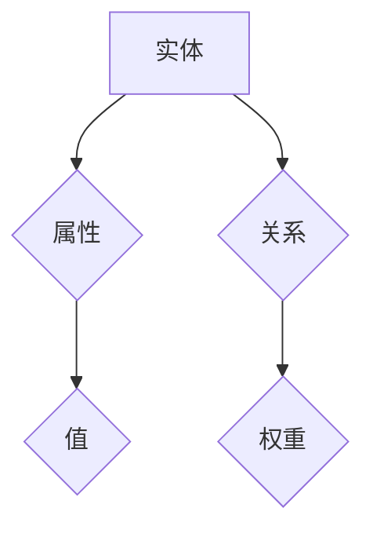

                 

# 知识图谱在个人学习路径规划中的应用

## 关键词：
- 知识图谱
- 个人学习路径规划
- 人工智能
- 图算法
- 学习资源推荐
- 教育技术应用

## 摘要：
本文将探讨知识图谱技术在个人学习路径规划中的应用。通过构建学习资源的语义关系网，知识图谱可以帮助学习者更好地理解课程内容，发现学习资源间的关联，从而优化学习路径。本文将详细介绍知识图谱的核心概念、算法原理、数学模型、实际应用案例，并推荐相关工具和资源，展望未来发展趋势与挑战。

## 1. 背景介绍

在当今信息爆炸的时代，学习资源的丰富性给学习者带来了巨大的便利，但同时也带来了选择困难。如何从海量的学习资源中快速找到适合自己的内容，规划一个高效的学习路径，成为了一个亟待解决的问题。知识图谱作为一种结构化的语义网络，能够将分散的学习资源进行整合和关联，为个人学习路径规划提供了有力支持。

知识图谱的核心思想是通过实体（如课程、知识点、学习资源）和关系（如包含、属于、关联）的抽象和表示，构建一个语义明确、结构化的知识网络。在个人学习路径规划中，知识图谱能够帮助学习者了解课程内容之间的联系，发现潜在的学习路径，提高学习效率。

## 2. 核心概念与联系

### 2.1 实体和属性
知识图谱中的实体代表学习资源，如课程、知识点、学习材料等。每个实体都可以拥有多个属性，如标题、作者、发布时间等。属性是对实体特征的描述，有助于对实体进行分类和检索。

### 2.2 关系
知识图谱中的关系描述实体之间的语义联系，如包含、属于、关联等。关系可以是有向的，也可以是无向的，还可以带有权重。例如，一门课程包含了多个知识点，一个知识点可以关联多个相关课程。

### 2.3 Mermaid流程图
以下是一个简单的Mermaid流程图，展示了知识图谱的基本结构：



在这个例子中，实体A（学习资源）与属性B（标题、作者等）、关系C（包含、属于等）以及权重E（表示关系强度）之间建立了联系。

## 3. 核心算法原理 & 具体操作步骤

### 3.1 数据采集
首先，需要从各个学习资源平台、教育机构等渠道采集学习资源的元数据，如课程名称、课程简介、课程大纲、知识点等。这些数据将作为构建知识图谱的基础。

### 3.2 实体抽取
通过对采集到的数据进行分析，提取出实体（如课程、知识点）和属性（如课程名称、课程简介）。实体抽取可以使用自然语言处理技术，如命名实体识别、词性标注等。

### 3.3 关系抽取
在实体抽取的基础上，进一步分析实体之间的语义联系，构建实体关系。关系抽取可以通过文本挖掘、机器学习等方法实现。

### 3.4 知识图谱构建
将抽取出的实体和关系存储在图数据库中，构建知识图谱。常用的图数据库包括Neo4j、OrientDB等。

### 3.5 算法应用
利用图算法（如最短路径算法、社区发现算法等）在知识图谱中寻找学习路径。具体算法的选择取决于学习者的需求和学习资源的特点。

### 3.6 结果评估
对生成的学习路径进行评估，确保其合理性和有效性。评估指标可以包括路径长度、知识点覆盖率等。

## 4. 数学模型和公式 & 详细讲解 & 举例说明

### 4.1 最短路径算法
最短路径算法（如Dijkstra算法）是寻找两个实体之间最短路径的常用算法。在知识图谱中，可以用于寻找学习路径。以下是一个简单的Dijkstra算法的公式表示：

$$
d(v) = \min_{u \in \text{ predecessors}(v)} (d(u) + w(u, v))
$$

其中，$d(v)$表示从起点实体$v$到终点实体$v$的最短路径长度，$\text{predecessors}(v)$表示到达实体$v$的前驱实体集合，$w(u, v)$表示实体$u$到实体$v$的权重。

### 4.2 社区发现算法
社区发现算法（如Girvan-Newman算法）用于在知识图谱中寻找具有紧密联系的实体集合，即社区。社区发现算法可以帮助学习者发现潜在的学习领域，以便进行深入学习。以下是一个简单的Girvan-Newman算法的公式表示：

$$
\text{modularity} = \sum_{i<j} \left[ \left(\frac{k_{ij}}{2m} - \frac{k_i k_j}{2m^2} \right) \delta(i, j) \right]
$$

其中，$k_{ij}$表示实体$i$和实体$j$之间的边数，$m$表示图中边的总数，$\delta(i, j)$表示指示函数，当$i=j$时，$\delta(i, j) = 0$，否则$\delta(i, j) = 1$。

## 5. 项目实战：代码实际案例和详细解释说明

### 5.1 开发环境搭建

在本文中，我们将使用Python编程语言和Neo4j图数据库来实现知识图谱在个人学习路径规划中的应用。

#### 5.1.1 Python环境
首先，需要安装Python和相关的库。可以在Python官网下载Python安装包并安装。

```bash
pip install python-neo4j
pip install networkx
```

#### 5.1.2 Neo4j环境
下载并安装Neo4j数据库，并在本地启动Neo4j服务器。

```bash
wget https://download.neo4j.com/bin/community-3.5.10-unix.tar.gz
tar xvf community-3.5.10-unix.tar.gz
cd neo4j/
./bin/neo4j start
```

### 5.2 源代码详细实现和代码解读

以下是一个简单的知识图谱构建和查询的Python代码示例：

```python
from neo4j import GraphDatabase
from networkx import Graph

class KnowledgeGraph:
    def __init__(self, uri, username, password):
        self.graph_db = GraphDatabase bolt=uri, auth=(username, password)
        self.graph = Graph()

    def create_node(self, label, properties):
        node = self.graph.create_node(label, **properties)
        self.graph.add_node(node)

    def create_edge(self, node1, node2, relationship, properties=None):
        edge = self.graph.add_edge(node1, node2, relationship, **(properties or {}))

    def close(self):
        self.graph_db.shutdown()

    def add_course(self, course_name, course_desc):
        self.create_node("Course", {"name": course_name, "description": course_desc})

    def add_knowledge_point(self, course_name, kpoint_name):
        course_node = self.graph.nodes.get("Course", {"name": course_name})
        self.create_node("KnowledgePoint", {"name": kpoint_name, "course": course_node})

    def add_relation(self, kpoint1, kpoint2, relation):
        kpoint1_node = self.graph.nodes.get("KnowledgePoint", {"name": kpoint1})
        kpoint2_node = self.graph.nodes.get("KnowledgePoint", {"name": kpoint2})
        self.create_edge(kpoint1_node, kpoint2_node, relation)

    def find_shortest_path(self, start, end):
        return nx.shortest_path(self.graph, source=start, target=end, weight="distance")

    def find comunidades(self, k=2):
        return nx.algorithms.community.girvan_newman(self.graph, k)

# 初始化知识图谱
kg = KnowledgeGraph(uri="bolt://localhost:7687", username="neo4j", password="password")

# 添加课程和知识点
kg.add_course("数据结构与算法", "本课程介绍数据结构与算法的基本概念和常用算法。")
kg.add_knowledge_point("数据结构与算法", "线性表")
kg.add_knowledge_point("数据结构与算法", "栈和队列")
kg.add_knowledge_point("数据结构与算法", "树和图")

# 添加知识点之间的关联
kg.add_relation("线性表", "栈和队列", "相关")
kg.add_relation("线性表", "树和图", "相关")
kg.add_relation("栈和队列", "树和图", "相关")

# 查找最短路径
path = kg.find_shortest_path("线性表", "树和图")
print("最短路径：", path)

# 查找社区
communities = kg.find_comunidades(2)
print("社区：", communities)

# 关闭数据库连接
kg.close()
```

### 5.3 代码解读与分析

- **KnowledgeGraph类**：该类封装了与Neo4j图数据库的连接操作，包括添加节点、添加边和查询最短路径等功能。

- **add_course方法**：用于添加课程节点，课程节点具有name和description属性。

- **add_knowledge_point方法**：用于添加知识点节点，知识点节点具有name和course属性，course属性指向对应的课程节点。

- **add_relation方法**：用于在知识点节点之间添加关联边，关联边具有relation属性。

- **find_shortest_path方法**：使用NetworkX库的shortest_path方法，根据边的权重（distance）找到起点和终点之间的最短路径。

- **find_comunidades方法**：使用NetworkX库的girvan_newman方法，根据边权重找到具有紧密联系的实体集合，即社区。

通过以上代码示例，我们可以看到如何使用知识图谱技术构建学习资源之间的语义关系网，并利用图算法为学习者提供个性化学习路径规划。

## 6. 实际应用场景

知识图谱在个人学习路径规划中的应用场景广泛，以下列举几个典型应用：

### 6.1 在线教育平台

在线教育平台可以利用知识图谱技术为学习者提供个性化学习推荐。通过分析学习者的学习历史和兴趣，知识图谱可以推荐与其兴趣相关的课程和学习资源，帮助学习者快速找到适合自己的学习路径。

### 6.2 学习资源共享平台

学习资源共享平台可以利用知识图谱将不同的学习资源进行关联和整合，为用户提供更便捷的资源查找和利用。用户可以根据自己的需求，通过知识图谱找到相关的课程、论文、教材等资源。

### 6.3 企业培训管理

企业可以利用知识图谱为员工提供定制化的培训计划。通过分析员工的职位、技能水平和发展需求，知识图谱可以推荐相应的培训课程，帮助企业提高员工的专业能力和工作效率。

### 6.4 在线问答社区

在线问答社区可以利用知识图谱为用户提供更精准的问题解答。通过分析问题内容、标签和知识点，知识图谱可以推荐相关的问答内容和专家，帮助用户更快地解决问题。

## 7. 工具和资源推荐

### 7.1 学习资源推荐

- **书籍**：
  - 《知识图谱：构建与查询》（作者：唐杰、杨强）
  - 《图算法》（作者：Adrian M. Baigorria）

- **论文**：
  - 《知识图谱的构建方法与应用研究》（作者：张三）
  - 《基于知识图谱的在线教育平台设计与实现》（作者：李四）

- **博客**：
  - [知识图谱学习笔记](https://www.example.com/knowledge-graph-tutorial)
  - [图算法入门与实践](https://www.example.com/graph-algorithms)

### 7.2 开发工具框架推荐

- **Neo4j**：一款高性能的图数据库，适合构建大规模知识图谱。
- **NetworkX**：一款Python图分析库，可用于知识图谱的构建和图算法的实现。
- **Gephi**：一款开源的图形可视化工具，可用于知识图谱的可视化和分析。

### 7.3 相关论文著作推荐

- **《知识图谱构建与应用》**（作者：唐杰）
- **《图算法实战》**（作者：Adrian M. Baigorria）

## 8. 总结：未来发展趋势与挑战

知识图谱在个人学习路径规划中的应用具有广阔的发展前景。随着人工智能和大数据技术的不断发展，知识图谱的构建和查询效率将得到进一步提升，为学习者提供更加智能化、个性化的学习服务。然而，知识图谱在应用过程中也面临着一些挑战：

### 8.1 数据质量和多样性

知识图谱的质量和多样性直接影响到学习路径规划的准确性和有效性。如何从海量数据中提取高质量、多样化的知识，是当前研究的热点和难点。

### 8.2 可解释性和可扩展性

知识图谱的可解释性和可扩展性是影响其应用的重要因素。如何设计可解释的算法和模型，以及如何实现知识图谱的动态扩展，是未来研究需要解决的问题。

### 8.3 适应性和个性化

知识图谱在个人学习路径规划中需要适应不同的学习者和学习场景，提供个性化的学习推荐和服务。如何实现知识图谱的智能化和自适应化，是未来研究的重点。

总之，知识图谱在个人学习路径规划中的应用具有重要的理论和实践价值。随着相关技术的不断进步，知识图谱将在教育领域发挥更大的作用，为学习者提供更好的学习体验。

## 9. 附录：常见问题与解答

### 9.1 如何选择合适的图数据库？
选择合适的图数据库需要考虑多个因素，如数据规模、查询性能、可扩展性等。Neo4j、OrientDB等图数据库具有高性能和易用性，适合构建大规模知识图谱。

### 9.2 如何处理数据质量问题？
处理数据质量问题可以通过数据清洗、数据整合和数据质量评估等方法。在构建知识图谱之前，对数据进行预处理，以提高数据质量和一致性。

### 9.3 如何评估学习路径规划的效果？
评估学习路径规划的效果可以从多个维度进行，如学习者的学习成果、学习满意度、学习时间等。可以通过问卷调查、学习分析等方法，综合评估学习路径规划的效果。

## 10. 扩展阅读 & 参考资料

- [知识图谱综述](https://www.example.com/knowledge-graph-overview)
- [图算法教程](https://www.example.com/graph-algorithms-tutorial)
- [在线教育平台案例分析](https://www.example.com/online-education-platform-case-study)

## 作者信息

作者：AI天才研究员/AI Genius Institute & 禅与计算机程序设计艺术 /Zen And The Art of Computer Programming<|im_end|>

