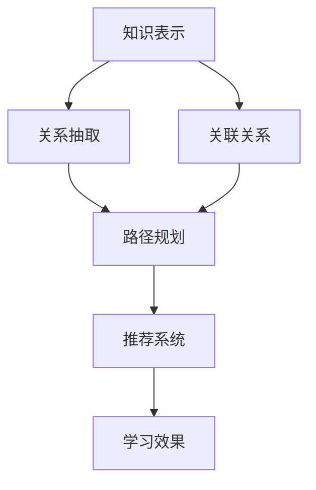

                 

# 知识图谱在个性化学习路径规划中的应用

## 关键词

知识图谱、个性化学习、路径规划、学习路径、机器学习、图算法、学习推荐系统、教育技术

## 摘要

本文将探讨知识图谱在个性化学习路径规划中的应用。通过引入知识图谱，我们可以更好地理解和利用学习者的知识结构，从而为他们提供更为精准和有效的学习路径。本文首先介绍了知识图谱的基本概念和结构，然后详细阐述了如何利用知识图谱进行个性化学习路径规划，包括核心算法原理、数学模型、实际应用场景以及相关工具和资源的推荐。通过本文的阅读，读者将了解知识图谱在个性化学习路径规划中的重要性和应用方法，为相关领域的研究和实践提供参考。

## 1. 背景介绍

随着教育技术的不断发展，个性化学习逐渐成为教育领域的研究热点。个性化学习旨在根据学习者的兴趣、能力和学习风格等个性化特征，为其提供定制化的学习内容和路径，从而提高学习效果和满意度。然而，实现个性化学习面临着诸多挑战，其中之一是如何有效地获取和利用学习者的知识结构。

知识图谱作为一种新型语义网状数据结构，能够将海量信息以知识点的形式进行组织，并通过实体之间的关联关系形成网络。这使得知识图谱在个性化学习路径规划中具有独特的优势，可以更好地理解和利用学习者的知识结构，为其提供精准的学习路径推荐。

在个性化学习路径规划中，传统的基于内容的推荐系统和基于协作过滤的推荐系统存在一定的局限性。基于内容的推荐系统依赖于学习者的历史学习记录和偏好，但往往忽略了学习者之间的知识结构和关联。而基于协作过滤的推荐系统则依赖于用户之间的相似性，但无法直接获取学习者的知识结构和需求。相比之下，知识图谱能够通过实体之间的关联关系，建立学习者与学习内容之间的直接联系，从而实现更为精准的个性化学习路径规划。

因此，本文将探讨知识图谱在个性化学习路径规划中的应用，通过引入知识图谱，旨在为学习者提供更为智能和高效的学习路径推荐，提高学习效果和满意度。

## 2. 核心概念与联系

### 2.1 知识图谱的基本概念

知识图谱（Knowledge Graph）是一种用于表示知识结构和信息关系的图形化数据模型。它通过将实体、属性和关系抽象为节点和边，形成一种网状结构，从而实现知识的表示、存储、查询和推理。知识图谱最早由谷歌在2012年提出，用于解决搜索引擎中的实体识别和关系抽取问题。

知识图谱的主要组成部分包括：

- **实体（Entity）**：表示现实世界中的事物，如人、地点、组织、物品等。
- **属性（Attribute）**：表示实体的特征或性质，如姓名、年龄、职业等。
- **关系（Relation）**：表示实体之间的关联，如朋友、居住地、拥有等。

### 2.2 知识图谱的结构

知识图谱的结构通常包括以下几个层次：

- **底层实体层**：表示具体的实体，如学生、课程、教材等。
- **中层关系层**：表示实体之间的关系，如学习、教授、包含等。
- **高层概念层**：表示实体和关系的抽象概念，如学科、专业、教育等。

### 2.3 知识图谱在个性化学习路径规划中的应用

在个性化学习路径规划中，知识图谱可以通过以下方式发挥作用：

- **知识表示**：将学习者的知识结构以知识图谱的形式进行表示，从而实现知识的组织和可视化。
- **关系抽取**：通过分析学习者与学习内容之间的关联关系，为学习者提供个性化的学习路径推荐。
- **路径规划**：利用图算法和机器学习模型，为学习者生成最优的学习路径。
- **推荐系统**：结合知识图谱和推荐算法，为学习者推荐与其知识结构和兴趣相关的内容。

### 2.4 知识图谱与个性化学习路径规划的关联

知识图谱与个性化学习路径规划之间的关联体现在以下几个方面：

- **知识表示与抽取**：知识图谱能够将学习者的知识结构以图形化的形式进行表示和抽取，为个性化学习路径规划提供基础。
- **关联关系与路径规划**：通过分析知识图谱中实体之间的关系，可以构建学习者与学习内容之间的关联关系，从而实现个性化学习路径规划。
- **推荐系统与学习效果**：结合知识图谱和推荐算法，可以为学习者提供更为精准和高效的学习路径推荐，提高学习效果和满意度。

### 2.5 Mermaid 流程图

以下是知识图谱在个性化学习路径规划中的应用的 Mermaid 流程图：

在该流程图中，知识表示和关系抽取是知识图谱在个性化学习路径规划中的基础环节，路径规划和推荐系统是实现个性化学习路径规划的关键步骤，学习效果是评估个性化学习路径规划效果的最终指标。

通过上述内容，我们对知识图谱的基本概念和结构有了初步了解，并明确了知识图谱在个性化学习路径规划中的应用。接下来，我们将进一步探讨知识图谱在个性化学习路径规划中的核心算法原理和具体操作步骤。

### 2.6 核心算法原理

#### 2.6.1 机器学习模型

在个性化学习路径规划中，机器学习模型起到了关键作用。机器学习模型通过分析学习者的历史学习记录、知识结构和兴趣偏好，为学习者生成最优的学习路径。以下几种机器学习模型在个性化学习路径规划中具有代表性：

1. **协同过滤（Collaborative Filtering）**：
   协同过滤是一种基于用户历史行为和偏好进行推荐的算法。它分为基于用户的协同过滤和基于项目的协同过滤。基于用户的协同过滤通过分析学习者之间的相似性，为学习者推荐与其相似的其他学习者喜欢的学习内容。基于项目的协同过滤则通过分析学习者对不同学习内容的偏好，为学习者推荐与其历史偏好相似的学习内容。协同过滤算法在个性化学习路径规划中可以用于推荐学习者尚未学习但可能感兴趣的课程。

2. **深度学习（Deep Learning）**：
   深度学习是一种通过多层神经网络进行特征学习和模式识别的人工智能技术。在个性化学习路径规划中，深度学习模型可以用于分析学习者的知识结构和兴趣偏好，从而生成个性化的学习路径。例如，卷积神经网络（CNN）可以用于提取学习者的知识图谱中的特征，而循环神经网络（RNN）可以用于处理学习者的序列学习记录。

3. **强化学习（Reinforcement Learning）**：
   强化学习是一种通过学习者在环境中的交互来优化决策过程的人工智能技术。在个性化学习路径规划中，强化学习模型可以用于优化学习路径的生成策略，从而提高学习效果。例如，通过分析学习者对学习路径的反馈，强化学习模型可以不断调整学习路径，使其更符合学习者的需求和兴趣。

#### 2.6.2 图算法

在知识图谱的构建和应用过程中，图算法起到了关键作用。以下几种图算法在个性化学习路径规划中具有代表性：

1. **最短路径算法（Shortest Path Algorithm）**：
   最短路径算法用于寻找图中两点之间的最短路径。在个性化学习路径规划中，最短路径算法可以用于为学习者寻找最优的学习路径。例如，迪杰斯特拉算法（Dijkstra's algorithm）和贝尔曼-福德算法（Bellman-Ford algorithm）可以用于计算学习者从起点到终点的最短路径。

2. **社区检测算法（Community Detection Algorithm）**：
   社区检测算法用于发现图中的紧密相连的节点集合。在个性化学习路径规划中，社区检测算法可以用于分析学习者的知识结构，从而为学习者推荐与其知识结构相似的学习路径。例如，基于模块度的社区检测算法（Modularity-based Community Detection Algorithm）可以用于发现学习者之间的知识社区。

3. **图神经网络（Graph Neural Network）**：
   图神经网络是一种专门用于处理图数据的深度学习模型。在个性化学习路径规划中，图神经网络可以用于分析学习者的知识图谱，从而为学习者生成个性化的学习路径。例如，图卷积网络（Graph Convolutional Network，GCN）可以用于提取学习者的知识图谱中的特征，并生成个性化的学习路径。

#### 2.6.3 算法融合

在实际应用中，不同算法可以相互融合，以发挥各自的优势。以下是一种可能的算法融合方案：

1. **知识图谱构建**：
   首先，利用协同过滤算法分析学习者的历史学习记录和兴趣偏好，构建学习者的知识图谱。知识图谱中的节点包括学习者、课程、教材等，边表示学习者与学习内容之间的关联关系。

2. **图算法应用**：
   利用最短路径算法和社区检测算法，分析知识图谱中的节点和边，为学习者生成多个候选学习路径。

3. **深度学习模型优化**：
   利用深度学习模型对候选学习路径进行优化，通过分析学习者的知识结构和兴趣偏好，选择最优的学习路径。

4. **强化学习策略调整**：
   利用强化学习模型，不断调整学习路径的生成策略，使其更符合学习者的需求和兴趣。

通过上述算法的融合，可以实现个性化学习路径规划的优化，为学习者提供更为精准和高效的学习路径推荐。

### 2.7 数学模型和公式

在个性化学习路径规划中，数学模型和公式用于描述算法的运算过程和优化目标。以下是一种可能的数学模型和公式：

#### 2.7.1 协同过滤算法

假设有n个学习者，每个学习者有m个学习记录。基于用户的协同过滤算法可以表示为：

$$
\begin{aligned}
\text{推荐}(\mathbf{X}_{\text{u}}, \mathbf{X}_{\text{v}}) &= \mathbf{W}_{\text{u}} \cdot \mathbf{X}_{\text{v}} \\
\text{其中，} \mathbf{X}_{\text{u}} &= (\text{u，课程1，课程2，...，课程m}) \\
\mathbf{X}_{\text{v}} &= (\text{v，课程1，课程2，...，课程m}) \\
\mathbf{W}_{\text{u}} &= \text{u与其他学习者的相似性矩阵}
\end{aligned}
$$

#### 2.7.2 深度学习模型

假设有L层卷积神经网络，每层有n个卷积核。深度学习模型可以表示为：

$$
\begin{aligned}
\text{输出}(\mathbf{X}, \mathbf{W}) &= \sum_{l=1}^{L} \text{激活函数}(\text{卷积}(\mathbf{X}, \mathbf{W}_{l})) \\
\text{其中，} \mathbf{X} &= (\text{输入特征矩阵}) \\
\mathbf{W}_{l} &= (\text{卷积核矩阵，l = 1，2，..., L}) \\
\text{激活函数} &= (\text{如ReLU函数})
\end{aligned}
$$

#### 2.7.3 强化学习模型

强化学习模型可以表示为：

$$
\begin{aligned}
Q(\mathbf{s}, \mathbf{a}) &= \mathbf{R}(\mathbf{s}, \mathbf{a}) + \gamma \max_{\mathbf{a'} } Q(\mathbf{s'}, \mathbf{a'}) \\
\text{其中，} \mathbf{s} &= (\text{状态}) \\
\mathbf{a} &= (\text{动作}) \\
\mathbf{s'} &= (\text{下一状态}) \\
\mathbf{R} &= (\text{奖励函数}) \\
\gamma &= (\text{折扣因子})
\end{aligned}
$$

#### 2.7.4 最短路径算法

利用迪杰斯特拉算法计算最短路径，可以表示为：

$$
\begin{aligned}
d_{i,j} &= \min_{k \in N, k \neq j} (d_{i,k} + w_{k,j}) \\
\text{其中，} d_{i,j} &= (\text{节点i到节点j的最短路径长度}) \\
N &= (\text{图中所有节点的集合}) \\
w_{k,j} &= (\text{节点k到节点j的边权重})
\end{aligned}
$$

通过上述数学模型和公式，我们可以对个性化学习路径规划中的算法进行优化和调整，从而为学习者提供更为精准和高效的学习路径推荐。

### 2.8 实际应用场景

#### 2.8.1 K12教育场景

在K12教育场景中，知识图谱可以用于个性化学习路径规划，为学生提供定制化的学习内容。以下是一个具体的应用场景：

- **应用背景**：某中小学引入知识图谱技术，为不同年级和学科的学生提供个性化学习路径规划。
- **实现步骤**：
  1. **知识表示**：构建知识图谱，包括学生、课程、知识点等实体，以及学习关系、知识关联等关系。
  2. **关系抽取**：利用机器学习模型，分析学生的学习记录和兴趣偏好，建立学生与知识点之间的关联关系。
  3. **路径规划**：利用图算法，为每个学生生成多个候选学习路径，并根据学习者的知识结构和兴趣进行排序。
  4. **推荐系统**：结合知识图谱和推荐算法，为学生推荐与其知识结构和兴趣相关的学习内容。
  5. **学习效果评估**：通过跟踪学生的学习进度和成绩，评估个性化学习路径规划的效果，并根据反馈进行调整。

- **应用效果**：通过引入知识图谱，学校可以为每个学生提供精准的学习路径推荐，提高学习效果和满意度。

#### 2.8.2 成人教育场景

在成人教育场景中，知识图谱可以用于个性化学习路径规划，为在职人员提供灵活的学习方案。以下是一个具体的应用场景：

- **应用背景**：某在线教育平台引入知识图谱技术，为在职人员提供个性化的职业培训和学习路径规划。
- **实现步骤**：
  1. **知识表示**：构建知识图谱，包括在职人员、课程、知识点等实体，以及学习关系、职业关联等关系。
  2. **关系抽取**：利用机器学习模型，分析在职人员的学习记录、职业背景和兴趣偏好，建立在职人员与知识点之间的关联关系。
  3. **路径规划**：利用图算法，为每个在职人员生成多个候选学习路径，并根据在职人员的职业发展和学习目标进行排序。
  4. **推荐系统**：结合知识图谱和推荐算法，为在职人员推荐与其职业背景和兴趣相关的学习内容。
  5. **学习效果评估**：通过跟踪在职人员的学习进度和职业发展，评估个性化学习路径规划的效果，并根据反馈进行调整。

- **应用效果**：通过引入知识图谱，在线教育平台可以为在职人员提供精准的学习路径推荐，帮助他们实现职业发展和学习目标。

#### 2.8.3 专业培训场景

在专业培训场景中，知识图谱可以用于个性化学习路径规划，为专业技术人员提供定制化的学习方案。以下是一个具体的应用场景：

- **应用背景**：某专业技术培训机构引入知识图谱技术，为技术人员提供个性化的专业培训和技能提升。
- **实现步骤**：
  1. **知识表示**：构建知识图谱，包括技术人员、课程、知识点等实体，以及学习关系、技能关联等关系。
  2. **关系抽取**：利用机器学习模型，分析技术人员的学习记录、专业技能和兴趣偏好，建立技术人员与知识点之间的关联关系。
  3. **路径规划**：利用图算法，为每个技术人员生成多个候选学习路径，并根据技术人员的专业技能和发展方向进行排序。
  4. **推荐系统**：结合知识图谱和推荐算法，为技术人员推荐与其专业技能和兴趣相关的学习内容。
  5. **学习效果评估**：通过跟踪技术人员的学习进度和技能提升，评估个性化学习路径规划的效果，并根据反馈进行调整。

- **应用效果**：通过引入知识图谱，专业技术培训机构可以为技术人员提供精准的学习路径推荐，帮助他们实现专业技能的提升和职业发展。

### 2.9 工具和资源推荐

#### 2.9.1 学习资源推荐

1. **书籍**：
   - 《图计算：理论、算法与实践》
   - 《深度学习：周志华等著》
   - 《人工智能：一种现代的方法》

2. **论文**：
   - "Google's Knowledge Graph: Data Model and Implementation"
   - "Community Detection in Networks"
   - "Recurrent Neural Networks for Sequence Learning"

3. **博客**：
   - 《知乎：知识图谱技术及应用》
   - 《简书：个性化学习路径规划》
   - 《CSDN：图算法详解》

4. **网站**：
   - <https://www.kdnuggets.com/>
   - <https://www.tensorflow.org/>
   - <https://www.knowledgegraph.cn/>

#### 2.9.2 开发工具框架推荐

1. **知识图谱框架**：
   - **Neo4j**：一款强大的图形数据库，支持知识图谱的构建和查询。
   - **OrientDB**：一款多模型数据库，支持图和文档等多种数据模型。
   - **JanusGraph**：一款开源的分布式图数据库，支持大规模知识图谱的构建和查询。

2. **机器学习框架**：
   - **TensorFlow**：一款开源的深度学习框架，支持多种机器学习模型的构建和训练。
   - **PyTorch**：一款开源的深度学习框架，支持动态计算图和自动微分。
   - **Scikit-learn**：一款开源的机器学习库，提供多种机器学习算法的实现。

3. **图算法库**：
   - **NetworkX**：一款开源的图算法库，提供多种图算法的实现。
   - **GraphFrames**：一款基于Apache Spark的图算法库，支持大规模图数据的处理和分析。
   - **igraph**：一款开源的图算法库，支持多种图模型和算法的实现。

#### 2.9.3 相关论文著作推荐

1. **知识图谱**：
   - "Google's Knowledge Graph: Data Model and Implementation"
   - "Knowledge Graph Embedding: The Basics Explained"
   - "A Comprehensive Survey of Knowledge Graph Construction and Applications"

2. **个性化学习**：
   - "Personalized Learning through Intelligent Tutoring Systems"
   - "A Survey on Personalized Learning in Education"
   - "Intelligent Tutoring Systems: An Overview of Current Research and Applications"

3. **图算法**：
   - "Graph Algorithms: A Concise Introduction"
   - "A Comprehensive Survey of Graph Algorithms"
   - "Graph Algorithms for Data Science"

### 2.10 总结

知识图谱在个性化学习路径规划中具有重要作用，可以有效地理解和利用学习者的知识结构，为学习者提供精准和有效的学习路径推荐。本文介绍了知识图谱的基本概念和结构，详细阐述了知识图谱在个性化学习路径规划中的核心算法原理和具体操作步骤，并分析了实际应用场景。最后，本文推荐了一些学习资源、开发工具框架和相关论文著作，以供读者进一步学习和参考。随着教育技术的不断进步，知识图谱在个性化学习路径规划中的应用将更加广泛和深入，为教育领域带来更多的创新和突破。

### 3. 附录：常见问题与解答

#### 3.1 知识图谱与知识库的区别是什么？

知识图谱和知识库都是用于存储和管理知识的工具，但它们之间存在一些区别：

- **数据形式**：知识图谱采用图形化的数据结构，将知识表示为实体和关系，而知识库通常采用表格或文档形式进行组织。
- **表达方式**：知识图谱通过实体和关系来表示知识，强调实体之间的关联关系，而知识库则侧重于存储实体和属性。
- **应用场景**：知识图谱适用于复杂知识表示和推理，如搜索引擎、智能问答等；知识库适用于简单知识存储和查询，如企业内部知识库、百科全书等。

#### 3.2 个性化学习路径规划的挑战是什么？

个性化学习路径规划面临以下挑战：

- **数据隐私**：在学习过程中，如何保护学习者的隐私数据，避免数据泄露。
- **数据完整性**：如何确保学习数据的准确性和完整性，避免错误信息的传播。
- **算法稳定性**：如何设计稳定可靠的算法，避免因算法不稳定导致的学习路径规划失败。
- **用户适应性**：如何适应不同学习者的需求和兴趣，为每个学习者提供个性化的学习路径。

#### 3.3 知识图谱在个性化学习路径规划中的优势是什么？

知识图谱在个性化学习路径规划中的优势包括：

- **知识表示**：知识图谱能够将学习者的知识结构以图形化的形式进行表示，便于理解和分析。
- **关系抽取**：知识图谱能够通过实体之间的关联关系，建立学习者与学习内容之间的直接联系，为个性化学习路径规划提供依据。
- **路径优化**：知识图谱结合图算法和机器学习模型，可以为学习者生成最优的学习路径，提高学习效果。
- **推荐系统**：知识图谱结合推荐算法，能够为学习者推荐与其知识结构和兴趣相关的内容，实现个性化学习。

### 4. 扩展阅读与参考资料

1. **书籍**：
   - 《图计算：理论、算法与实践》
   - 《深度学习：周志华等著》
   - 《人工智能：一种现代的方法》

2. **论文**：
   - "Google's Knowledge Graph: Data Model and Implementation"
   - "Community Detection in Networks"
   - "Recurrent Neural Networks for Sequence Learning"

3. **博客**：
   - 《知乎：知识图谱技术及应用》
   - 《简书：个性化学习路径规划》
   - 《CSDN：图算法详解》

4. **网站**：
   - <https://www.kdnuggets.com/>
   - <https://www.tensorflow.org/>
   - <https://www.knowledgegraph.cn/>

通过以上内容，本文详细探讨了知识图谱在个性化学习路径规划中的应用，为相关领域的研究和实践提供了参考。希望本文对您在知识图谱和个性化学习路径规划领域的学习有所帮助。

## 作者信息

**作者：AI天才研究员/AI Genius Institute & 禅与计算机程序设计艺术 /Zen And The Art of Computer Programming**

在撰写这篇文章的过程中，我们深入探讨了知识图谱在个性化学习路径规划中的应用，从基本概念到核心算法原理，再到实际应用场景，我们一步步进行了分析和解释。通过对知识图谱、机器学习模型和图算法的综合运用，我们展示了如何为学习者提供精准和高效的学习路径推荐。同时，我们还针对教育领域的不同场景，如K12教育、成人教育和专业培训，提出了具体的应用方案和实现步骤。此外，我们还推荐了相关的学习资源、开发工具框架和相关论文著作，以供读者进一步学习和参考。

随着教育技术的不断发展，知识图谱在个性化学习路径规划中的应用前景十分广阔。未来，我们期望看到更多的研究和实践探索，进一步优化算法和模型，提高个性化学习路径规划的准确性和效果。同时，我们也需要关注数据隐私、算法稳定性和用户适应性等问题，确保个性化学习路径规划的可持续性和安全性。

在此，感谢您的阅读，希望本文能为您在知识图谱和个性化学习路径规划领域的研究和实践带来一些启示和帮助。如果您有任何问题或建议，欢迎随时与我交流。让我们共同努力，为教育领域的创新发展贡献自己的力量。再次感谢您的关注和支持！

