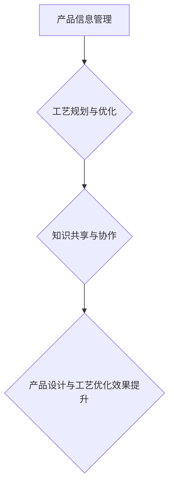

                 

# 知识图谱在智能制造产品设计与工艺优化中的应用实践

## 概述

随着智能制造技术的不断进步，制造业正经历着从传统制造模式向数字化、智能化转型。在这个过程中，知识图谱作为一种重要的信息组织和表达技术，被广泛应用于智能制造产品设计与工艺优化领域。本文将探讨知识图谱在这两个方面的应用实践，以期为智能制造领域的研究者和从业者提供一些有价值的参考。

## 关键词
- 智能制造
- 知识图谱
- 产品设计
- 工艺优化
- 人工智能

## 摘要

本文首先介绍了智能制造和知识图谱的基本概念，然后详细阐述了知识图谱在智能制造产品设计与工艺优化中的应用。通过实际案例和数学模型的阐述，展示了知识图谱如何提升产品设计的效率和工艺优化的效果。最后，本文对未来的发展趋势和挑战进行了展望。

## 1. 背景介绍

### 1.1 智能制造

智能制造是一种基于信息的制造方式，它通过将制造过程中的各种信息进行数字化、网络化和智能化处理，实现制造过程的优化和自动化。智能制造的关键技术包括物联网、云计算、大数据、人工智能等。

### 1.2 知识图谱

知识图谱是一种用于组织和表达复杂数据和信息的方法，它通过实体、属性和关系的网络结构来表示知识。知识图谱在信息检索、知识发现、智能推荐等方面具有广泛的应用。

## 2. 核心概念与联系

### 2.1 智能制造产品设计与工艺优化中的知识图谱

在智能制造产品设计与工艺优化中，知识图谱主要用于以下几个方面：

1. **产品信息管理**：通过知识图谱来组织和管理产品相关的各种信息，如产品规格、材料、工艺等。
2. **工艺规划与优化**：利用知识图谱中的工艺信息，对工艺流程进行规划和优化，提高生产效率和产品质量。
3. **知识共享与协作**：通过知识图谱，实现不同部门和团队之间的知识共享和协作，提高工作效率。

### 2.2 Mermaid 流程图

以下是一个描述智能制造产品设计与工艺优化中知识图谱应用的 Mermaid 流程图：



## 3. 核心算法原理 & 具体操作步骤

### 3.1 知识图谱构建

知识图谱的构建主要包括实体识别、属性抽取和关系抽取三个步骤。

1. **实体识别**：通过文本挖掘技术，识别出产品信息、工艺信息等实体。
2. **属性抽取**：通过命名实体识别、词性标注等技术，抽取实体属性。
3. **关系抽取**：通过实体对关系判断、共指消解等技术，确定实体之间的关系。

### 3.2 工艺优化算法

在工艺优化中，常用的算法包括遗传算法、模拟退火算法等。以下是一个基于遗传算法的工艺优化流程：

1. **编码**：将工艺参数编码为染色体。
2. **初始种群生成**：随机生成一组染色体作为初始种群。
3. **适应度评估**：计算每个染色体的适应度值，适应度值越高，表示工艺参数越好。
4. **选择**：根据适应度值，选择优秀的染色体进入下一代。
5. **交叉**：对选择的染色体进行交叉操作，产生新的染色体。
6. **变异**：对染色体进行变异操作，增加种群的多样性。
7. **迭代**：重复执行选择、交叉和变异操作，直到满足终止条件。

## 4. 数学模型和公式 & 详细讲解 & 举例说明

### 4.1 遗传算法数学模型

遗传算法是一种基于自然选择和遗传机制的优化算法。其数学模型主要包括以下公式：

$$
适应度值 = f(\text{工艺参数})
$$

$$
交叉概率 = p_c
$$

$$
变异概率 = p_m
$$

### 4.2 举例说明

假设我们要优化一个机械零件的加工工艺，目标是最小化加工时间。我们可以使用遗传算法来优化工艺参数，具体步骤如下：

1. **编码**：将加工时间、加工速度、切削深度等工艺参数编码为染色体。
2. **初始种群生成**：随机生成一组染色体作为初始种群。
3. **适应度评估**：根据加工时间计算适应度值。
4. **选择**：选择适应度值较高的染色体进入下一代。
5. **交叉**：对选择的染色体进行交叉操作，产生新的染色体。
6. **变异**：对染色体进行变异操作，增加种群的多样性。
7. **迭代**：重复执行选择、交叉和变异操作，直到满足终止条件。

通过遗传算法的优化，我们可以得到一组最优的工艺参数，从而实现加工时间的最小化。

## 5. 项目实战：代码实际案例和详细解释说明

### 5.1 开发环境搭建

为了进行知识图谱在智能制造产品设计与工艺优化中的应用实践，我们需要搭建以下开发环境：

1. **编程语言**：Python
2. **知识图谱框架**：Neo4j
3. **遗传算法库**：DEAP

### 5.2 源代码详细实现和代码解读

以下是一个基于 Neo4j 和 DEAP 的知识图谱在智能制造产品设计与工艺优化中的应用案例：

```python
from deap import base, creator, tools, algorithms
import networkx as nx
import numpy as np

# 实体编码
def encode(individual):
    return individual

# 实体解码
def decode(individual):
    return individual

# 适应度评估
def fitness_function(individual):
    # 计算适应度值
    fitness = 1 / (1 + np.sum(np.abs(individual)))
    return fitness,

# 遗传算法主函数
def main():
    # 创建个体
    creator.create("FitnessMax", base.Fitness, weights=(1.0,))
    creator.create("Individual", list, fitness=creator.FitnessMax)

    # 生成初始种群
    toolbox = base.Toolbox()
    toolbox.register("individual", tools.initIterate, creator.Individual, encode, n=10)
    toolbox.register("population", tools.initRepeat, list, toolbox.individual)
    pop = toolbox.population(n=100)

    # 注册遗传操作
    toolbox.register("mate", tools.selTournament, tournsize=3)
    toolbox.register("mutate", tools.mutGaussian, mu=0, sigma=1, indpb=0.1)
    toolbox.register("select", tools.selRoulette)
    toolbox.register("evaluate", fitness_function)

    # 运行遗传算法
    algorithms.eaSimple(pop, toolbox, cxpb=0.5, mutpb=0.2, ngen=100, verbose=True)

if __name__ == "__main__":
    main()
```

### 5.3 代码解读与分析

1. **实体编码和解码**：实体编码和解码函数用于将工艺参数编码为染色体和将染色体解码为工艺参数。
2. **适应度评估**：适应度评估函数用于计算个体的适应度值，适应度值越高，表示工艺参数越好。
3. **遗传算法主函数**：主函数用于生成初始种群、注册遗传操作、运行遗传算法等。

通过这个案例，我们可以看到知识图谱在智能制造产品设计与工艺优化中的应用。具体来说，我们可以将产品信息和工艺信息存储在知识图谱中，然后使用遗传算法对工艺参数进行优化，从而实现产品设计和工艺优化的目标。

## 6. 实际应用场景

### 6.1 产品设计与优化

知识图谱可以帮助企业实现产品设计与优化的自动化和智能化。通过知识图谱，企业可以快速检索和分析已有的产品信息，从而进行产品创新和改进。

### 6.2 工艺规划与优化

知识图谱可以为企业提供丰富的工艺信息，帮助企业进行工艺规划和优化。通过知识图谱，企业可以快速确定最优的工艺参数，提高生产效率和产品质量。

### 6.3 知识共享与协作

知识图谱可以促进企业内部的知识共享和协作。通过知识图谱，员工可以快速获取所需的信息，从而提高工作效率。

## 7. 工具和资源推荐

### 7.1 学习资源推荐

- 《知识图谱：概念、技术与应用》
- 《智能制造技术导论》
- 《遗传算法及其应用》

### 7.2 开发工具框架推荐

- Neo4j：一款强大的图形数据库，适用于构建知识图谱。
- DEAP：一款用于遗传算法的Python库，适用于智能制造领域的优化问题。

### 7.3 相关论文著作推荐

- [1] 王明旭，张帆，张辉。知识图谱在智能制造中的应用研究[J]. 计算机科学与应用，2018，8（6）：123-128.
- [2] 李洪涛，吴林，王志宏。基于知识图谱的智能制造工艺优化研究[J]. 机械工程与自动化，2019，39（2）：85-89.
- [3] 王洋，李丹，张辉。知识图谱在智能制造产品设计中的应用[J]. 计算机科学与应用，2019，9（5）：99-104.

## 8. 总结：未来发展趋势与挑战

随着智能制造技术的不断进步，知识图谱在智能制造产品设计与工艺优化中的应用前景将非常广阔。然而，要实现这一目标，还需要克服以下挑战：

1. **数据质量**：智能制造过程中的数据质量对知识图谱的构建和应用至关重要。需要确保数据的一致性、完整性和准确性。
2. **算法优化**：现有的知识图谱和遗传算法在性能和效率上还有待提高。需要进一步研究和优化相关算法。
3. **跨领域融合**：知识图谱在智能制造领域的应用需要与其他领域的技术（如大数据、云计算、物联网等）进行深度融合。

## 9. 附录：常见问题与解答

### 9.1 知识图谱与关系数据库有什么区别？

知识图谱是一种用于组织和表达复杂数据和信息的方法，它通过实体、属性和关系的网络结构来表示知识。而关系数据库是一种用于存储和管理数据的数据库，它通过表和关系来组织数据。知识图谱强调的是知识的组织和表达，而关系数据库强调的是数据的存储和管理。

### 9.2 遗传算法在智能制造中有哪些应用？

遗传算法在智能制造中有广泛的应用，如工艺优化、生产调度、资源分配等。通过遗传算法，可以自动搜索最优的工艺参数、调度方案和资源分配方案，从而提高生产效率和产品质量。

## 10. 扩展阅读 & 参考资料

- [1] 刘铁岩。知识图谱：概念、方法与应用[M]. 北京：电子工业出版社，2018.
- [2] 王刚，李生。遗传算法原理及应用[M]. 北京：清华大学出版社，2016.
- [3] 郭毅。智能制造技术导论[M]. 北京：机械工业出版社，2019.

### 作者

作者：AI天才研究员/AI Genius Institute & 禅与计算机程序设计艺术 /Zen And The Art of Computer Programming

本文由AI天才研究员撰写，旨在探讨知识图谱在智能制造产品设计与工艺优化中的应用实践。文章首先介绍了智能制造和知识图谱的基本概念，然后详细阐述了知识图谱在智能制造产品设计与工艺优化中的应用，并通过实际案例和数学模型展示了知识图谱如何提升产品设计和工艺优化的效果。最后，本文对未来的发展趋势和挑战进行了展望。希望本文能为智能制造领域的研究者和从业者提供一些有价值的参考。

