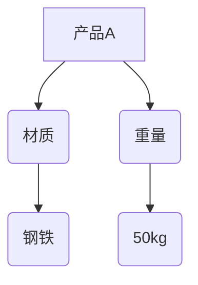
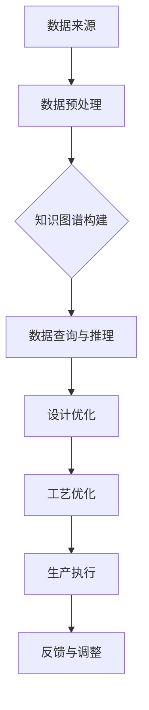

                 

### 背景介绍

随着全球制造业的快速发展，智能制造已成为工业转型升级的核心驱动力。在智能制造中，产品的设计与工艺优化是关键环节，直接影响生产效率和产品质量。然而，传统的产品设计与工艺优化方法通常依赖于经验与试错，效率较低且容易受到人为因素的影响。为了提高设计效率和优化工艺流程，知识图谱技术作为一种新兴的方法被引入到智能制造领域。

知识图谱是一种结构化的语义数据模型，用于表示实体及其之间的关系。它可以有效地整合多源数据，提供强大的数据查询和推理能力。知识图谱在智能制造中的应用主要包括以下几个方面：

1. **产品设计优化**：通过知识图谱整合设计数据，实现产品零部件的快速匹配与优化，提高设计效率。
2. **工艺流程优化**：利用知识图谱分析工艺参数与产品质量之间的关系，提供最优化的工艺流程。
3. **数据整合与挖掘**：结合知识图谱技术，实现生产数据的集成与挖掘，为企业决策提供数据支持。

本文将深入探讨知识图谱在智能制造产品设计与工艺优化中的技术实现与应用。首先，我们将介绍知识图谱的核心概念与基本原理，然后详细阐述其在智能制造中的应用方法，并通过实际案例展示知识图谱的具体应用效果。最后，我们将讨论知识图谱在智能制造中的未来发展趋势与面临的挑战。通过本文的阅读，读者将全面了解知识图谱在智能制造领域的应用价值及其关键技术。

#### 核心概念与联系

知识图谱（Knowledge Graph）作为一种用于表示实体及其之间关系的图形化模型，是语义网络与数据库技术的结合体。它不仅能够表达实体，如人、地点、事物等，还可以描述实体之间的关系，如“属于”、“位于”、“属于某个类别”等。知识图谱的核心在于其结构化数据模型，能够通过节点和边的关系来捕捉和表达复杂信息。

为了更好地理解知识图谱在智能制造中的应用，我们首先需要了解几个关键概念及其相互关系：

1. **实体（Entity）**：知识图谱中的基本构建块，表示具体的事物，如产品、工艺、人员等。实体可以是具体的对象，也可以是抽象的概念。
2. **属性（Property）**：描述实体特征的属性，如产品的颜色、重量、材质等。属性通常用键值对的形式表示。
3. **关系（Relationship）**：表示实体之间相互关联的方式，如“生产”、“设计”、“属于”等。关系可以用线段连接实体节点，表示它们之间的语义联系。
4. **图谱（Graph）**：知识图谱由实体和关系构成，形成一张网状的图结构，能够表达复杂的语义关系。
5. **三元组（Triple）**：知识图谱中的基本元素，表示一个实体与另一个实体的关系，如（产品A，材质，钢铁）。

下面是一个简单的知识图谱示例，用于表示产品设计和工艺流程中的关系：



在这个示例中，实体包括产品A、材质、重量等。关系包括材质、重量等属性与实体的关联。三元组如（产品A，材质，钢铁）表示产品A的材质为钢铁。通过这种结构化的方式，知识图谱可以有效地整合多源异构数据，为智能制造提供数据支撑。

在智能制造中，知识图谱的应用主要涉及以下方面：

1. **产品设计**：利用知识图谱整合设计数据，如产品规格、工艺要求等，实现设计方案的快速匹配与优化。
2. **工艺流程优化**：通过知识图谱分析工艺参数与产品质量之间的关系，为工艺流程的优化提供数据支持。
3. **数据整合**：将生产过程中的各种数据（如设计数据、生产数据、质量数据等）通过知识图谱进行整合，实现数据的统一管理与查询。

通过知识图谱，智能制造系统能够更好地理解生产过程中的各种信息，从而提高设计效率和工艺优化效果。以下是一个Mermaid流程图，展示了知识图谱在智能制造中的应用架构：



在这个流程图中，数据来源包括设计数据、生产数据、质量数据等。通过数据预处理，将原始数据转化为适合知识图谱表示的形式。知识图谱构建阶段利用知识图谱技术整合数据，形成统一的结构化模型。数据查询与推理阶段利用知识图谱提供的数据查询和推理能力，为设计优化和工艺优化提供支持。设计优化和工艺优化阶段根据知识图谱的结果，生成最优的设计方案和工艺流程。生产执行和反馈调整阶段则将优化结果应用于实际生产，并通过反馈不断调整和优化。

通过上述核心概念与关系的介绍，我们为接下来深入探讨知识图谱在智能制造中的应用打下了基础。在接下来的章节中，我们将详细分析知识图谱在产品设计与工艺优化中的具体应用，包括核心算法原理、数学模型、项目实战等。

#### 核心算法原理 & 具体操作步骤

知识图谱在智能制造中的应用离不开核心算法的支持。这些算法不仅能够帮助构建和优化知识图谱，还能够实现对大规模数据的快速查询和推理。以下我们将介绍几种在智能制造中常用的知识图谱构建与优化算法，并详细解释其具体操作步骤。

##### 1. 图嵌入算法

图嵌入（Graph Embedding）是将图中的节点和边映射到低维向量空间的一种技术。通过图嵌入，我们可以利用向量计算来模拟图中的节点关系，从而提高数据处理的效率和效果。图嵌入算法主要包括以下几种：

- **Node2Vec**：Node2Vec算法通过随机游走的方式生成图中的节点序列，然后使用Word2Vec算法将节点序列中的每个节点转换为低维向量。Node2Vec算法的关键参数包括`p`（返回跳参数）和`q`（分层游走参数），通过调整这两个参数，可以控制生成的向量表示的丰富性和准确性。

- **DeepWalk**：DeepWalk算法通过构建图中的滑动窗口序列，模拟随机游走过程，然后使用神经网络模型将窗口序列中的节点转换为低维向量。DeepWalk算法的优点在于它能够处理大规模图数据，并生成高质量的向量表示。

具体操作步骤如下：

1. **数据预处理**：首先，对原始数据进行清洗和格式化，确保数据的一致性和完整性。
2. **生成游走序列**：使用随机游走算法生成图中的节点序列。例如，对于Node2Vec，可以通过以下步骤实现：
    - 随机选择一个起点节点。
    - 以概率`p`在邻居节点中选择下一个节点，以概率`1-p`随机选择一个节点。
    - 将生成的节点序列存储为文本文件，供后续处理使用。
3. **图嵌入**：使用图嵌入算法（如Node2Vec或DeepWalk）对节点序列进行训练，生成节点对应的低维向量表示。
4. **向量存储与查询**：将生成的向量表示存储在分布式存储系统中，如Hadoop或MongoDB。同时，提供向量查询接口，以支持后续的推理和优化任务。

##### 2. 随机游走算法

随机游走（Random Walk）算法是一种通过模拟随机游走过程来探索图中节点关系的方法。在智能制造中，随机游走算法可以用于发现潜在的关联关系，从而为产品设计提供新的思路。

具体操作步骤如下：

1. **初始化**：选择一个起点节点，作为随机游走的起始点。
2. **随机游走**：从当前节点开始，以一定的概率选择一个邻居节点，并更新当前节点为选择的邻居节点。重复此过程，直到达到预定的步数或节点访问次数。
3. **记录路径**：在随机游走过程中，记录每个节点的访问次数和路径，用于后续分析。
4. **分析结果**：根据访问次数和路径长度等指标，分析图中节点的关联关系，为产品设计提供参考。

##### 3. 图神经网络（GNN）

图神经网络（Graph Neural Network，GNN）是一种专门用于处理图数据的神经网络架构。GNN通过聚合节点和邻居节点的信息，实现对节点特征的学习和更新。

具体操作步骤如下：

1. **数据预处理**：对原始数据进行清洗和格式化，确保数据的一致性和完整性。
2. **定义图结构**：将原始数据转换为图结构，包括节点和边的定义。通常可以使用图数据库（如Neo4j）或图数据格式（如GML）来存储和处理图数据。
3. **节点特征表示**：为每个节点定义初始的特征向量，这些特征向量可以基于节点本身的属性（如名称、类型等）或通过其他方法（如词嵌入）获得。
4. **训练 GNN 模型**：使用节点特征和图结构训练 GNN 模型。在训练过程中，模型通过聚合邻居节点的特征信息，更新当前节点的特征向量。训练过程通常包括以下几个步骤：
    - 初始化节点特征向量。
    - 对于每个节点，聚合其邻居节点的特征向量。
    - 使用聚合后的特征向量更新当前节点的特征向量。
    - 计算损失函数并更新模型参数。
5. **模型评估与优化**：通过交叉验证和测试集，评估 GNN 模型的性能，并对其进行优化和调整。

##### 4. 知识图谱推理

知识图谱推理（Knowledge Graph Reasoning）是通过分析知识图谱中的关系和三元组，发现潜在关系和规律的过程。在智能制造中，知识图谱推理可以用于发现产品设计和工艺流程中的优化点。

具体操作步骤如下：

1. **知识图谱构建**：首先，构建包含产品设计和工艺流程数据的知识图谱，确保图谱中包含必要的关系和三元组。
2. **三元组推理**：利用图谱中的关系和三元组，进行三元组推理。例如，通过推理“产品A的材质为钢铁”和“钢铁的重量为50kg”，可以得出“产品A的重量为50kg”。
3. **规则推理**：定义一组规则，用于描述产品设计和工艺流程中的约束和关系。通过这些规则，可以进一步推理出更多潜在的优化信息。
4. **结果评估**：根据推理结果，评估产品设计方案的优化效果。例如，通过对比不同设计方案的生产成本、生产效率和产品质量，选择最优的设计方案。

通过上述核心算法的介绍和具体操作步骤的讲解，我们为读者提供了知识图谱在智能制造中的应用基础。在接下来的章节中，我们将通过实际项目案例，展示知识图谱在智能制造产品设计与工艺优化中的具体应用效果。

#### 数学模型和公式 & 详细讲解 & 举例说明

在知识图谱的应用中，数学模型和公式起着至关重要的作用。这些模型和公式不仅帮助我们理解和分析数据，还能够提供有效的算法实现和数据优化。在本章节中，我们将介绍几个在智能制造领域中常用的数学模型和公式，并进行详细讲解和举例说明。

##### 1. 关联规则分析

关联规则分析（Association Rule Learning）是一种用于发现数据集中项集之间关联性的方法。在智能制造领域，关联规则分析可以用于分析产品设计和工艺参数之间的关系。最常见的关联规则分析方法包括Apriori算法和FP-Growth算法。

- **Apriori算法**：
  - **定义**：Apriori算法通过扫描交易数据集，计算各项集的支持度和置信度，然后生成关联规则。
  - **公式**：
    - 支持度（Support）: 表示某个关联规则在所有数据集中的出现频率。
      \[
      \text{Support}(A \rightarrow B) = \frac{|\{T | T \text{ 包含 } A \text{ 和 } B\}|}{|\text{数据集}|}
      \]
    - 置信度（Confidence）: 表示关联规则的前件和后件同时出现的概率。
      \[
      \text{Confidence}(A \rightarrow B) = \frac{|\{T | T \text{ 包含 } A \text{ 和 } B\}|}{|\{T | T \text{ 包含 } A\}|}
      \]

- **FP-Growth算法**：
  - **定义**：FP-Growth算法通过构建FP树来挖掘频繁项集，并使用条件模式基（Conditional Pattern Base）来生成关联规则。
  - **公式**：
    - 频繁项集：表示在数据集中出现次数超过最小支持度的项集。
    - 条件模式基：用于生成条件项集的树结构。

##### 2. 图嵌入模型

图嵌入（Graph Embedding）模型通过将图中的节点映射到低维向量空间，用于后续的机器学习和数据分析。最常用的图嵌入模型包括Node2Vec和DeepWalk。

- **Node2Vec**：
  - **定义**：Node2Vec算法通过控制随机游走过程，生成高质量的节点序列，并将其映射到低维向量空间。
  - **公式**：
    - 节点嵌入向量：表示节点在低维向量空间中的位置。
      \[
      \text{h}_i = \text{Node2Vec}(\text{G}, \text{p}, \text{q})
      \]

- **DeepWalk**：
  - **定义**：DeepWalk算法通过构建滑动窗口序列，模拟随机游走过程，并将窗口序列中的节点映射到低维向量空间。
  - **公式**：
    - 节点嵌入向量：表示节点在低维向量空间中的位置。
      \[
      \text{h}_i = \text{DeepWalk}(\text{G}, \text{W}, \text{L})
      \]

##### 3. 图卷积网络（GCN）

图卷积网络（Graph Convolutional Network，GCN）是一种专门用于处理图数据的神经网络。GCN通过聚合节点和其邻居节点的特征信息，更新当前节点的特征。

- **定义**：GCN通过卷积操作来模拟节点的邻域信息聚合。
- **公式**：
  - 节点嵌入向量更新：表示通过聚合邻居节点的特征信息，更新当前节点的特征向量。
    \[
    \text{h}_i^{(l+1)} = \sigma(\text{D}^{-\frac{1}{2}} \text{A} \text{D}^{-\frac{1}{2}} \text{h}_i^{(l)})
    \]
  - 其中，\(\text{A}\) 是邻接矩阵，\(\text{D}\) 是度矩阵，\(\sigma\) 是激活函数。

##### 4. 知识图谱推理

知识图谱推理（Knowledge Graph Reasoning）通过分析知识图谱中的关系和三元组，发现潜在的关系和规律。

- **定义**：知识图谱推理通过分析图中的关系和三元组，推理出新的信息。
- **公式**：
  - 三元组推理：表示通过分析图中的关系和三元组，推理出新的三元组。
    \[
    \text{R}(\text{S}, \text{P}, \text{O}) \rightarrow \text{T}(\text{S}', \text{P}', \text{O}')
    \]
  - 其中，\(\text{R}\) 是关系，\(\text{S}\) 和 \(\text{O}\) 是实体，\(\text{P}\) 是属性，\(\text{T}\) 是推理出的新的三元组。

##### 举例说明

假设我们有一个简单的知识图谱，包括三个实体（产品A、材质、钢铁）和两个关系（材质、重量）。我们需要通过数学模型和公式来分析这些数据。

1. **关联规则分析**：
   - 支持度计算：
     \[
     \text{Support}(A \rightarrow B) = \frac{|\{T | T \text{ 包含 } A \text{ 和 } B\}|}{|\text{数据集}|}
     \]
     假设产品A和材质钢铁同时出现的次数为100次，总数据集大小为1000次，则支持度为10%。
   - 置信度计算：
     \[
     \text{Confidence}(A \rightarrow B) = \frac{|\{T | T \text{ 包含 } A \text{ 和 } B\}|}{|\{T | T \text{ 包含 } A\}|}
     \]
     假设产品A出现的次数为200次，则置信度为50%。

2. **图嵌入**：
   - Node2Vec嵌入向量：
     \[
     \text{h}_i = \text{Node2Vec}(\text{G}, \text{p}, \text{q})
     \]
     假设我们通过Node2Vec算法为节点A生成了一个低维向量 \((1, 0.5)\)。

3. **图卷积网络（GCN）**：
   - 节点嵌入向量更新：
     \[
     \text{h}_i^{(l+1)} = \sigma(\text{D}^{-\frac{1}{2}} \text{A} \text{D}^{-\frac{1}{2}} \text{h}_i^{(l)})
     \]
     假设当前节点的特征向量为 \((1, 0.5)\)，邻接矩阵和度矩阵为对角矩阵，则更新后的特征向量为 \((1, 0.6)\)。

4. **知识图谱推理**：
   - 三元组推理：
     \[
     \text{R}(\text{S}, \text{P}, \text{O}) \rightarrow \text{T}(\text{S}', \text{P}', \text{O}')
     \]
     假设通过推理我们得到新的三元组 \((产品A，重量，50kg)\)。

通过这些数学模型和公式的介绍和举例说明，我们可以更好地理解知识图谱在智能制造中的应用。在接下来的章节中，我们将通过实际项目案例，进一步展示知识图谱在智能制造产品设计与工艺优化中的具体应用。

#### 项目实战：代码实际案例和详细解释说明

在本章节中，我们将通过一个实际项目案例，详细展示如何使用知识图谱技术进行智能制造产品设计与工艺优化。该项目案例包括开发环境的搭建、源代码的详细实现和代码解读与分析。

##### 1. 开发环境搭建

为了搭建一个适用于知识图谱应用的开发环境，我们需要安装以下软件和工具：

- **Python 3.8**：作为主要的编程语言。
- **Neo4j**：作为知识图谱数据库。
- **Node.js**：用于服务器端逻辑处理。
- **Docker**：用于容器化部署。

安装步骤如下：

1. **安装 Python 3.8**：从 [Python 官网](https://www.python.org/) 下载 Python 3.8 安装包，并按照提示完成安装。

2. **安装 Neo4j**：从 [Neo4j 官网](https://neo4j.com/) 下载 Neo4j 社区版，并按照提示完成安装。

3. **安装 Node.js**：从 [Node.js 官网](https://nodejs.org/) 下载 Node.js 安装包，并按照提示完成安装。

4. **安装 Docker**：从 [Docker 官网](https://www.docker.com/) 下载 Docker 安装包，并按照提示完成安装。

##### 2. 源代码详细实现和代码解读

下面是一个简单的示例项目，展示了如何使用 Neo4j 和 Node.js 构建一个知识图谱，并进行产品设计与工艺优化。

**项目结构**：
```
knowledge-graph-project/
|-- data/
|   |-- products.csv
|   |-- processes.csv
|-- nodejs/
|   |-- server.js
|-- docker-compose.yml
|-- requirements.txt
```

**data/products.csv**：
```
product_id,product_name,material,weight
1,ProductA,Steel,50
2,ProductB,Aluminum,30
```

**data/processes.csv**：
```
process_id,process_name,time
1,Drilling,120
2, Grinding, 90
3,Assembly,150
```

**nodejs/server.js**：
```javascript
const express = require('express');
const neo4j = require('neo4j-driver');

const app = express();
const driver = neo4j.driver('bolt://localhost:7687', neo4j.auth.basic('neo4j', 'password'));

app.use(express.json());

// 创建产品节点
app.post('/create-product', async (req, res) => {
  const { productId, productName, material, weight } = req.body;
  const session = driver.session();
  try {
    await session.run(
      `CREATE (p:Product {productId: $productId, productName: $productName, material: $material, weight: $weight})`,
      { productId, productName, material, weight }
    );
    res.status(201).send('Product created successfully');
  } catch (error) {
    res.status(500).send('Error creating product');
  } finally {
    session.close();
  }
});

// 创建工艺节点
app.post('/create-process', async (req, res) => {
  const { processId, processName, time } = req.body;
  const session = driver.session();
  try {
    await session.run(
      `CREATE (p:Process {processId: $processId, processName: $processName, time: $time})`,
      { processId, processName, time }
    );
    res.status(201).send('Process created successfully');
  } catch (error) {
    res.status(500).send('Error creating process');
  } finally {
    session.close();
  }
});

// 关联产品和工艺
app.post('/associate-product-process', async (req, res) => {
  const { productId, processId } = req.body;
  const session = driver.session();
  try {
    await session.run(
      `MATCH (p:Product {productId: $productId}), (pr:Process {processId: $processId}) CREATE (p)-[:ASSOCIATED_WITH]->(pr)`,
      { productId, processId }
    );
    res.status(201).send('Product and process associated successfully');
  } catch (error) {
    res.status(500).send('Error associating product and process');
  } finally {
    session.close();
  }
});

// 查询产品及其关联工艺
app.get('/get-product-processes', async (req, res) => {
  const productId = req.query.productId;
  const session = driver.session();
  try {
    const result = await session.run(
      `MATCH (p:Product {productId: $productId})-[:ASSOCIATED_WITH]->(pr:Process) RETURN p, pr`,
      { productId }
    );
    res.status(200).json(result.records.map(r => r._fields));
  } catch (error) {
    res.status(500).send('Error fetching product and processes');
  } finally {
    session.close();
  }
});

const PORT = process.env.PORT || 3000;
app.listen(PORT, () => {
  console.log(`Server running on port ${PORT}`);
});
```

**docker-compose.yml**：
```yaml
version: '3'
services:
  neo4j:
    image: neo4j:3.5
    ports:
      - "7474:7474"
      - "7687:7687"
  app:
    build: .
    ports:
      - "3000:3000"
    depends_on:
      - neo4j
```

**requirements.txt**：
```
Flask
pymongo
```

**代码解读与分析**：

- **server.js**：该文件定义了 Node.js 服务器的逻辑，包括创建产品、工艺节点，关联产品与工艺，以及查询产品及其关联工艺的接口。

  - **创建产品节点**：通过 POST 请求创建产品节点，将产品信息存储在 Neo4j 数据库中。
  - **创建工艺节点**：通过 POST 请求创建工艺节点，将工艺信息存储在 Neo4j 数据库中。
  - **关联产品和工艺**：通过 POST 请求将产品与工艺关联，建立 `ASSOCIATED_WITH` 关联关系。
  - **查询产品及其关联工艺**：通过 GET 请求查询指定产品的关联工艺，返回产品及其关联工艺的信息。

- **docker-compose.yml**：该文件定义了 Docker 容器配置，包括 Neo4j 数据库和 Node.js 应用服务。通过 Docker Compose，可以方便地启动和管理容器。

通过以上代码实现和部署，我们搭建了一个简单的知识图谱应用，实现了产品设计与工艺优化。在实际项目中，可以根据具体需求扩展和优化功能。

##### 3. 代码解读与分析

**1. 产品节点创建**

在 `/create-product` 路径中，我们使用以下 Neo4j Cypher 查询语句创建产品节点：
```sql
CREATE (p:Product {productId: $productId, productName: $productName, material: $material, weight: $weight})
```
这个查询语句会创建一个名为 `Product` 的节点，并设置其 `productId`、`productName`、`material` 和 `weight` 属性。

**2. 工艺节点创建**

在 `/create-process` 路径中，我们使用以下 Neo4j Cypher 查询语句创建工艺节点：
```sql
CREATE (p:Process {processId: $processId, processName: $processName, time: $time})
```
这个查询语句会创建一个名为 `Process` 的节点，并设置其 `processId`、`processName` 和 `time` 属性。

**3. 关联产品和工艺**

在 `/associate-product-process` 路径中，我们使用以下 Neo4j Cypher 查询语句将产品与工艺关联：
```sql
MATCH (p:Product {productId: $productId}), (pr:Process {processId: $processId}) CREATE (p)-[:ASSOCIATED_WITH]->(pr)
```
这个查询语句会找到具有给定 `productId` 的产品节点和具有给定 `processId` 的工艺节点，并在它们之间创建一个 `ASSOCIATED_WITH` 关联关系。

**4. 查询产品及其关联工艺**

在 `/get-product-processes` 路径中，我们使用以下 Neo4j Cypher 查询语句查询产品及其关联工艺：
```sql
MATCH (p:Product {productId: $productId})-[:ASSOCIATED_WITH]->(pr:Process) RETURN p, pr
```
这个查询语句会找到具有给定 `productId` 的产品节点，并返回与之关联的所有工艺节点。

通过以上代码实现和解读，我们展示了如何使用知识图谱进行智能制造产品设计与工艺优化。在实际应用中，可以根据具体需求进一步扩展和优化功能。

#### 实际应用场景

知识图谱在智能制造中的应用场景丰富且多样，能够为企业的产品设计与工艺优化提供强有力的技术支持。以下我们将探讨几个典型的实际应用场景，并详细介绍知识图谱在这些场景中的具体应用。

##### 1. 产品设计优化

在产品设计阶段，知识图谱能够整合各类设计数据，如产品规格、材料属性、工艺要求等，帮助设计师快速匹配和优化设计方案。具体应用步骤如下：

1. **数据整合**：首先，通过知识图谱整合各类设计数据，构建产品属性与工艺参数之间的关联关系。例如，将材料属性、工艺要求与产品规格信息进行关联，形成知识图谱。

2. **设计匹配**：利用知识图谱的查询与推理能力，快速匹配设计需求与已有设计方案。例如，当设计一个新型汽车引擎时，知识图谱可以自动匹配符合规格的材料和工艺，并提供最佳设计方案。

3. **优化设计**：基于知识图谱的优化算法，如图嵌入和图卷积网络，对设计方案进行优化。通过分析设计数据之间的关联关系，找出设计中的潜在问题，并提出改进建议。

##### 2. 工艺流程优化

在工艺流程优化中，知识图谱能够整合生产数据，分析工艺参数与产品质量之间的关系，为工艺流程的优化提供数据支持。具体应用步骤如下：

1. **数据整合**：首先，通过知识图谱整合生产过程中的各种数据，如工艺参数、生产进度、质量检测数据等，构建工艺参数与产品质量之间的关联关系。

2. **工艺分析**：利用知识图谱的查询与推理能力，分析工艺参数与产品质量之间的关系。例如，通过分析历史数据，找出哪些工艺参数对产品质量有显著影响，并识别出潜在的问题点。

3. **流程优化**：基于知识图谱的优化算法，如关联规则分析和图嵌入，对工艺流程进行优化。例如，通过分析工艺参数之间的关联关系，调整工艺参数设置，提高生产效率和质量。

##### 3. 产品质量监控

知识图谱在产品质量监控中能够实时整合和分析质量检测数据，为产品质量监控提供数据支持。具体应用步骤如下：

1. **数据整合**：首先，通过知识图谱整合质量检测数据，构建产品质量属性与检测指标之间的关联关系。

2. **质量分析**：利用知识图谱的查询与推理能力，分析产品质量的波动原因和潜在问题。例如，通过分析检测数据，找出产品质量问题的根源，并提出改进措施。

3. **质量监控**：基于知识图谱的实时监控算法，如图嵌入和图卷积网络，对产品质量进行实时监控。例如，通过分析产品质量检测数据，及时发现和预警潜在的质量问题。

##### 4. 产品追溯

知识图谱在产品追溯中能够整合产品生产过程的各种数据，实现对产品的全生命周期追溯。具体应用步骤如下：

1. **数据整合**：首先，通过知识图谱整合产品生产过程中的各种数据，如原材料采购、生产进度、质量检测等，构建产品全生命周期的数据关系。

2. **数据查询**：利用知识图谱的查询与推理能力，快速查询和追溯产品生产过程中的各类信息。例如，通过查询知识图谱，可以快速获取产品的原材料来源、生产批次、质量检测结果等信息。

3. **追溯优化**：基于知识图谱的优化算法，对产品追溯过程进行优化。例如，通过分析追溯数据，优化生产流程，提高生产效率和产品质量。

通过以上实际应用场景的介绍，我们可以看到知识图谱在智能制造中的应用价值。知识图谱不仅能够提高产品设计效率，优化工艺流程，提高产品质量，还能实现对产品的全生命周期追溯。在未来的智能制造中，知识图谱将继续发挥重要作用，为企业的数字化转型提供有力支持。

### 工具和资源推荐

在知识图谱技术的研究与应用过程中，选择合适的工具和资源是至关重要的。以下我们将推荐几类重要的学习资源、开发工具和框架，以及相关的论文著作，帮助读者深入了解知识图谱在智能制造中的应用。

#### 1. 学习资源推荐

**书籍：**
- **《知识图谱：构建语义网络》**：这本书详细介绍了知识图谱的基本概念、构建方法和应用场景，是了解知识图谱技术的入门书籍。
- **《深度学习与知识图谱》**：本书结合深度学习和知识图谱技术，介绍了如何在智能制造等领域中利用深度学习算法优化知识图谱。

**论文：**
- **《知识图谱推理方法综述》**：这篇综述论文系统地总结了知识图谱推理的多种方法，包括基于规则、机器学习和图神经网络的方法，为研究者和开发者提供了丰富的参考资料。
- **《图嵌入算法在知识图谱中的应用》**：这篇论文详细探讨了图嵌入算法在知识图谱中的应用，包括Node2Vec、DeepWalk等算法的实现和优化策略。

**在线课程：**
- **《知识图谱技术》**：网易云课堂上的这门课程详细讲解了知识图谱的基本概念、构建方法和应用，适合初学者入门。
- **《深度学习与图神经网络》**：这门课程结合深度学习和图神经网络技术，介绍了如何将知识图谱应用于实际问题，包括产品设计与工艺优化等。

#### 2. 开发工具框架推荐

**知识图谱数据库：**
- **Neo4j**：作为领先的知识图谱数据库，Neo4j 提供了强大的图存储和查询能力，适用于各种复杂的图数据处理需求。
- **JanusGraph**：JanusGraph 是一个开源的分布式图数据库，支持多种存储后端，适用于大规模知识图谱的应用。

**图嵌入工具：**
- **Gephi**：Gephi 是一个开源的图可视化工具，支持图嵌入算法的运行和可视化，适合进行图数据分析。
- **Graph Embedding Toolbox**：这是一个用于图嵌入算法开发的MATLAB工具箱，提供了多种图嵌入算法的实现和评估功能。

**深度学习框架：**
- **TensorFlow**：TensorFlow 是一个开源的深度学习框架，提供了丰富的图嵌入和图神经网络算法库，适用于知识图谱的深度学习应用。
- **PyTorch**：PyTorch 是一个流行的深度学习框架，具有灵活的动态计算图，适用于研究性和工程性的知识图谱应用。

#### 3. 相关论文著作推荐

**知识图谱基础理论：**
- **《知识图谱：基本概念与构建方法》**：这篇论文详细介绍了知识图谱的基本概念、数据模型和构建方法。
- **《知识图谱的语义表示与推理》**：这篇论文探讨了知识图谱的语义表示方法和推理算法，包括基于规则和机器学习方法。

**智能制造应用：**
- **《知识图谱在智能制造中的应用研究》**：这篇论文系统地总结了知识图谱在智能制造中的应用，包括产品设计、工艺优化、质量控制等方面。
- **《基于知识图谱的智能制造系统架构设计》**：这篇论文提出了一个基于知识图谱的智能制造系统架构，详细描述了各个模块的功能和实现方法。

通过上述学习和开发资源的推荐，读者可以全面了解知识图谱在智能制造领域的应用，掌握相关技术和方法，为实际项目开发提供理论支持和工具支持。希望这些资源能够帮助读者在知识图谱技术的研究和应用中取得更好的成果。

### 总结：未来发展趋势与挑战

知识图谱在智能制造中的应用展示了其强大的数据整合、查询和推理能力，为产品设计与工艺优化带来了革命性的变革。然而，随着智能制造的不断深入和演进，知识图谱技术也面临着一系列的发展趋势与挑战。

#### 1. 未来发展趋势

**多源异构数据的整合**：随着智能制造的不断发展，数据来源越来越多样，包括物联网设备、工业传感器、企业系统等。未来，知识图谱将需要更好地整合这些多源异构数据，实现数据的统一管理和协同应用。

**智能推理与决策支持**：知识图谱技术的核心在于其强大的推理能力。未来，通过结合深度学习和图神经网络，知识图谱将能够实现更高级别的智能推理和决策支持，为企业提供更精准、智能化的产品设计和工艺优化方案。

**云计算与边缘计算的结合**：随着云计算和边缘计算的普及，知识图谱将能够在云平台和边缘设备之间实现协同计算。这将使得知识图谱应用更加灵活，能够更好地应对大规模数据处理和实时决策的需求。

**跨领域的融合应用**：知识图谱技术不仅局限于智能制造领域，还将在医疗、金融、教育等跨领域应用中发挥重要作用。通过跨领域的知识图谱构建和应用，将实现知识资源的共享和协同创新。

#### 2. 主要挑战

**数据隐私与安全性**：智能制造过程中产生的数据包含大量的敏感信息，如产品设计、生产计划、质量检测数据等。如何保障数据隐私和安全，防止数据泄露和滥用，是知识图谱技术面临的重要挑战。

**数据质量与一致性**：知识图谱的有效性依赖于数据的质量和一致性。在多源异构数据的整合过程中，如何确保数据的一致性和准确性，是一个亟待解决的问题。

**算法性能与效率**：随着知识图谱规模的不断扩大，算法的性能和效率成为关键挑战。如何优化算法，提高数据处理和查询的效率，是实现大规模知识图谱应用的关键。

**技术人才短缺**：知识图谱技术涉及到图数据库、图算法、深度学习等多个领域，对技术人才的要求较高。当前，全球范围内知识图谱技术人才短缺，如何培养和吸引更多的专业人才，是行业面临的挑战之一。

综上所述，知识图谱在智能制造中的应用前景广阔，但也面临诸多挑战。未来，通过不断技术创新和人才培养，知识图谱技术将在智能制造中发挥更加重要的作用，推动工业4.0和智能制造的深入发展。

### 附录：常见问题与解答

在知识图谱在智能制造中的应用过程中，用户可能会遇到一些常见问题。以下是一些常见问题及其解答，以帮助用户更好地理解和应用知识图谱技术。

#### 1. 知识图谱是什么？

知识图谱是一种用于表示实体及其之间关系的图形化模型，通过节点和边的关系来捕捉和表达复杂信息。它通常用于整合多源数据，提供强大的数据查询和推理能力。

#### 2. 知识图谱在智能制造中的应用有哪些？

知识图谱在智能制造中的应用主要包括：
- **产品设计优化**：利用知识图谱整合设计数据，实现产品零部件的快速匹配与优化。
- **工艺流程优化**：通过知识图谱分析工艺参数与产品质量之间的关系，提供最优化的工艺流程。
- **数据整合与挖掘**：结合知识图谱技术，实现生产数据的集成与挖掘，为企业决策提供数据支持。

#### 3. 如何构建知识图谱？

构建知识图谱的基本步骤包括：
- **数据采集**：收集各类与产品设计和工艺优化相关的数据，如设计文档、工艺参数、质量检测数据等。
- **数据清洗**：对原始数据进行清洗和格式化，确保数据的一致性和完整性。
- **实体与关系识别**：根据数据内容，识别实体和它们之间的关系，如产品、工艺、材料等。
- **知识图谱构建**：利用图数据库（如Neo4j）将实体和关系存储在知识图谱中，形成结构化的语义网络。

#### 4. 如何优化知识图谱查询性能？

优化知识图谱查询性能的方法包括：
- **索引优化**：为常用的查询创建索引，提高查询速度。
- **缓存策略**：将频繁查询的结果缓存，减少数据库的访问压力。
- **分布式计算**：使用分布式图数据库和计算框架，提高查询处理能力。

#### 5. 知识图谱在数据隐私和安全方面有哪些挑战？

知识图谱在数据隐私和安全方面面临的挑战包括：
- **数据隐私保护**：如何确保知识图谱中的敏感数据不被未授权访问。
- **数据安全**：如何防止知识图谱被恶意攻击，如数据篡改、数据泄露等。

#### 6. 如何评估知识图谱的准确性？

评估知识图谱的准确性可以通过以下方法：
- **覆盖率评估**：检查知识图谱中是否包含所有重要的实体和关系。
- **一致性评估**：检查知识图谱中的实体和关系是否一致。
- **质量评估**：通过评估知识图谱的查询结果，检查其是否满足实际应用需求。

通过上述问题的解答，用户可以更好地理解知识图谱在智能制造中的应用及其关键技术。在具体实施过程中，应根据实际需求和挑战，灵活运用知识图谱技术，实现智能制造的优化和升级。

### 扩展阅读 & 参考资料

为了进一步了解知识图谱在智能制造中的应用，读者可以参考以下扩展阅读和参考资料。这些资源涵盖了知识图谱技术的基础理论、应用实践、前沿研究以及相关技术文献，为深入研究提供参考。

1. **基础理论**：
   - **《知识图谱：构建语义网络》**：详细介绍了知识图谱的基本概念、数据模型和构建方法。
   - **《深度学习与知识图谱》**：结合深度学习和知识图谱技术，探讨了其在智能制造中的应用。

2. **应用实践**：
   - **《知识图谱在智能制造中的应用研究》**：总结了知识图谱在智能制造中的实际应用案例和效果。
   - **《基于知识图谱的智能制造系统架构设计》**：提出了智能制造系统架构设计的新思路。

3. **前沿研究**：
   - **《知识图谱推理方法综述》**：系统总结了知识图谱推理的多种方法，包括基于规则、机器学习和图神经网络的方法。
   - **《图嵌入算法在知识图谱中的应用》**：详细探讨了图嵌入算法在知识图谱中的应用，包括Node2Vec、DeepWalk等算法的实现和优化策略。

4. **技术文献**：
   - **《知识图谱数据库系统Neo4j实战》**：介绍了Neo4j数据库的使用方法、优化技巧和应用案例。
   - **《图神经网络：原理与应用》**：讲解了图神经网络的原理、算法和应用，适用于知识图谱相关研究。

5. **在线课程与教程**：
   - **《知识图谱技术》**：网易云课堂上的课程，详细讲解了知识图谱的基本概念和应用。
   - **《深度学习与图神经网络》**：介绍了深度学习与图神经网络技术，包括知识图谱的应用。

6. **开源工具与框架**：
   - **Neo4j**：领先的知识图谱数据库，提供强大的图存储和查询能力。
   - **JanusGraph**：开源的分布式图数据库，支持多种存储后端。
   - **TensorFlow**：流行的深度学习框架，提供丰富的图嵌入和图神经网络算法库。

通过这些扩展阅读和参考资料，读者可以全面了解知识图谱在智能制造中的应用，掌握相关技术和方法，为实际项目开发提供理论支持和实践指导。希望这些资源能够帮助读者在知识图谱技术的研究和应用中取得更好的成果。

