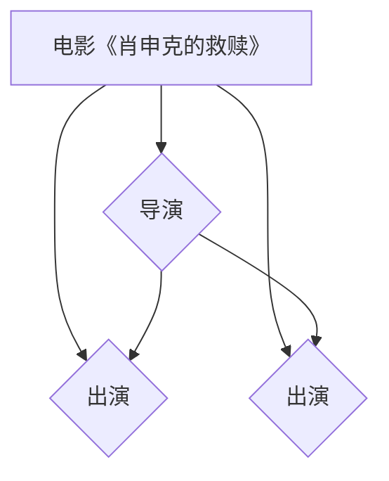

                 

# 知识图谱的可视化技术:知识导航和知识探索

## 关键词
知识图谱、可视化、知识导航、知识探索、人工智能、语义理解、图数据库、前端框架、算法优化。

## 摘要

本文将深入探讨知识图谱的可视化技术，包括其在知识导航和知识探索中的应用。首先，我们将回顾知识图谱的定义和核心概念，接着详细分析知识图谱可视化的重要性及其关键技术。随后，本文将介绍几种主流的可视化方法和技术，并探讨其在实际项目中的应用。此外，文章还将探讨可视化技术的挑战和优化策略，以及相关的学习资源和工具。通过本文的阅读，读者将全面了解知识图谱可视化技术，并掌握其核心原理和实践方法。

## 1. 背景介绍

知识图谱作为一种结构化的知识表示形式，通过实体和关系之间的复杂网络来描述现实世界的各种信息。自Google在2012年首次提出“知识图谱”的概念以来，它已经成为人工智能领域的重要研究方向。知识图谱的核心优势在于其能够为搜索引擎、推荐系统、智能问答等应用提供丰富的语义信息，从而提高系统的智能水平。

知识图谱可视化技术旨在将复杂的知识图谱以直观、易于理解的方式展现给用户。通过可视化，用户可以更直观地理解知识图谱的结构和内容，从而促进知识的发现和探索。知识图谱可视化不仅有助于研究人员和开发人员更好地理解和分析知识图谱，还能够向非技术背景的用户展示复杂的信息，提高知识传播的效率。

在当今数字化时代，随着大数据和人工智能技术的快速发展，知识图谱的应用场景越来越广泛。从企业内部的业务知识管理，到互联网平台上的用户推荐系统，知识图谱已成为许多行业的关键技术。因此，研究知识图谱的可视化技术对于推动人工智能技术的发展和应用具有重要意义。

本文将首先介绍知识图谱的基本概念和核心组件，然后深入探讨知识图谱可视化的重要性，以及其在知识导航和知识探索中的应用。接着，我们将分析当前流行的知识图谱可视化方法和技术，最后讨论可视化技术的挑战和优化策略。希望通过本文的讨论，能够为读者提供全面、系统的知识图谱可视化技术指南。

### 2. 核心概念与联系

知识图谱是由实体、属性和关系组成的一种结构化知识表示形式。为了更好地理解知识图谱的概念，我们可以通过一个简单的例子来说明其核心组成部分。

首先，实体（Entity）是知识图谱中最基本的元素，代表现实世界中的人、地点、事物等。例如，在一个关于电影的知识图谱中，"《肖申克的救赎》"是一个实体，"安迪"（Andy Dufresne）是另一个实体。

其次，属性（Attribute）用于描述实体的特征。例如，对于"《肖申克的救赎》"这个实体，我们可以用属性“导演”（Director）来描述其导演是“弗兰克·德拉邦特”（Frank Darabont）。

最后，关系（Relationship）用于表示实体之间的关联。例如，“《肖申克的救赎》”和“弗兰克·德拉邦特”之间存在“导演”这一关系。在知识图谱中，关系通常带有方向和权重，从而可以更准确地描述实体之间的复杂关系。

为了更好地理解这些核心概念，我们可以借助Mermaid流程图来展示一个简单的知识图谱。



在这个知识图谱中，实体包括《肖申克的救赎》、弗兰克·德拉邦特、摩根·弗里曼和鲍勃·冈顿。属性则表示导演和演员，而关系表示了导演和演员之间的关系。通过这个简单的示例，我们可以看到知识图谱如何将现实世界的复杂信息结构化地表示出来。

接下来，我们来探讨知识图谱与图数据库、前端框架等技术的联系。

### 2.1. 知识图谱与图数据库

图数据库（Graph Database）是专门为存储和管理图结构数据而设计的数据库系统。知识图谱作为一种图结构数据，自然需要依赖图数据库来存储和管理。与关系型数据库不同，图数据库能够更好地处理复杂的关系和网络结构，从而提高数据查询和处理的效率。

常见的图数据库包括Neo4j、Apache TinkerPop等。Neo4j是一个高性能的图数据库，支持ACID事务和图查询语言Cypher。Apache TinkerPop是一个开源的图计算框架，提供了多种图数据库的支持和通用API，使得开发者可以方便地构建和操作知识图谱。

### 2.2. 知识图谱与前端框架

在前端开发中，前端框架（如React、Vue、Angular等）用于构建用户界面和用户体验。知识图谱可视化通常需要在前端实现，因此前端框架在这一过程中扮演着重要角色。

前端框架不仅提供了丰富的UI组件和功能，还支持数据绑定、组件化开发等现代前端开发理念。通过前端框架，开发者可以将知识图谱的数据结构映射到用户界面，从而实现直观、交互式的可视化效果。

例如，React是一个流行的前端框架，它通过组件化的方式使得开发者可以方便地构建复杂的用户界面。Vue和Angular也具有类似的特性，使得知识图谱可视化变得更为简单和高效。

总之，知识图谱、图数据库和前端框架是构建知识图谱可视化系统的核心组成部分。通过深入理解这些技术之间的联系，我们可以更好地设计和实现知识图谱可视化应用。

### 3. 核心算法原理 & 具体操作步骤

知识图谱可视化的核心算法包括数据预处理、布局算法和渲染技术。以下我们将分别介绍这些算法的原理和具体操作步骤。

#### 3.1. 数据预处理

数据预处理是知识图谱可视化的第一步，其目的是将原始的知识图谱数据进行清洗、转换和格式化，以便后续的布局和渲染。

**数据清洗**：清洗数据主要是去除重复的实体和关系，修正错误的信息，确保数据的准确性和一致性。

**数据转换**：将知识图谱数据转换为适合可视化处理的格式。常见的数据格式包括JSON、CSV和GraphML等。

**数据格式化**：对实体和关系进行必要的格式化处理，如设置实体的大小、颜色和标签等属性，以便后续的布局和渲染。

具体操作步骤如下：
1. 读取知识图谱数据。
2. 使用清洗算法去除重复和错误信息。
3. 使用转换算法将数据格式化为适合可视化处理的格式。
4. 设置实体的属性，如大小、颜色和标签等。

#### 3.2. 布局算法

布局算法是知识图谱可视化中的关键环节，其目的是将知识图谱中的实体和关系以合理的方式排列在二维或三维空间中，使得用户能够直观地理解和探索图谱。

常见的布局算法包括：

- **层次布局**：根据实体和关系之间的层次结构进行布局，适用于树状或层次结构明显的知识图谱。
- **圆形布局**：将实体和关系均匀分布在一个圆形区域内，适用于实体数量较少且关系较为紧密的知识图谱。
- **力导向布局**：利用物理模拟的方法，通过计算实体之间的相互作用力，使得实体和关系自动排列在一个平衡的位置，适用于大规模、复杂的知识图谱。

具体操作步骤如下：
1. 选择合适的布局算法。
2. 根据图谱数据计算实体和关系的位置和大小。
3. 更新图谱的布局，使得实体和关系分布更加合理。

#### 3.3. 渲染技术

渲染技术是将布局算法计算出的实体和关系以图形化的形式呈现给用户。常见的渲染技术包括：

- **SVG（可扩展矢量图形）**：SVG是一种基于XML的矢量图形标准，适用于绘制知识图谱中的实体和关系，具有高度的可定制性和灵活性。
- **Canvas**：Canvas是HTML5引入的一个二维绘图API，适用于绘制复杂的图形和动画，特别适合动态渲染知识图谱。
- **WebGL**：WebGL是一种基于OpenGL的3D图形API，适用于渲染高质量的3D知识图谱。

具体操作步骤如下：
1. 选择合适的渲染技术。
2. 根据布局算法计算出的实体和关系位置，使用SVG、Canvas或WebGL绘制图谱。
3. 实现交互功能，如点击、拖动等，以增强用户体验。

#### 3.4. 实现示例

以下是一个简单的知识图谱可视化实现示例，使用JavaScript和D3.js库进行绘制。

**步骤 1**：安装D3.js库。

```bash
npm install d3
```

**步骤 2**：编写HTML文件，引入D3.js库。

```html
<!DOCTYPE html>
<html lang="en">
<head>
    <meta charset="UTF-8">
    <meta name="viewport" content="width=device-width, initial-scale=1.0">
    <title>知识图谱可视化示例</title>
    <script src="node_modules/d3/d3.min.js"></script>
</head>
<body>
    <svg width="800" height="600"></svg>
    <script src="script.js"></script>
</body>
</html>
```

**步骤 3**：编写JavaScript代码，实现知识图谱的绘制。

```javascript
// 获取SVG画布
const svg = d3.select("svg");

// 设置图谱数据
const data = {
    "nodes": [
        { "id": "电影《肖申克的救赎》", "group": 1 },
        { "id": "弗兰克·德拉邦特", "group": 2 },
        { "id": "摩根·弗里曼", "group": 2 },
        { "id": "鲍勃·冈顿", "group": 2 }
    ],
    "links": [
        { "source": "电影《肖申克的救赎》", "target": "弗兰克·德拉邦特", "relation": "导演" },
        { "source": "电影《肖申克的救赎》", "target": "摩根·弗里曼", "relation": "演员" },
        { "source": "电影《肖申克的救赎》", "target": "鲍勃·冈顿", "relation": "演员" }
    ]
};

// 绘制节点
const nodes = svg.selectAll(".node")
    .data(data.nodes)
    .enter()
    .append("circle")
    .attr("class", "node")
    .attr("cx", d => d.cx)
    .attr("cy", d => d.cy)
    .attr("r", 20)
    .style("fill", d => d.group === 1 ? "blue" : "green");

// 绘制关系
const links = svg.selectAll(".link")
    .data(data.links)
    .enter()
    .append("line")
    .attr("class", "link")
    .style("stroke", "black")
    .style("stroke-width", 2);

// 添加标签
const labels = svg.selectAll(".label")
    .data(data.nodes)
    .enter()
    .append("text")
    .attr("class", "label")
    .attr("x", d => d.cx + 10)
    .attr("y", d => d.cy + 5)
    .text(d => d.id);
```

在这个示例中，我们使用D3.js库绘制了一个简单的知识图谱，包括节点、关系和标签。通过这个示例，我们可以看到如何使用JavaScript实现知识图谱的可视化，为后续更复杂的可视化应用打下基础。

### 4. 数学模型和公式 & 详细讲解 & 举例说明

知识图谱可视化涉及到多种数学模型和公式，以下将详细介绍其中几个关键部分，并通过具体示例进行说明。

#### 4.1. 图论基本概念

图论是知识图谱可视化的重要理论基础，涉及节点、边、路径、连通性等基本概念。以下是一些核心概念及其公式：

- **节点度（Degree）**：节点所连接的边的数量，记作\( d(v) \)，其中\( v \)是节点。
  
  公式：\( d(v) = |N(v)| \)，其中\( N(v) \)是节点的邻接节点集合。

- **路径长度**：从节点\( u \)到节点\( v \)的最短路径长度，记作\( L(u, v) \)。

  公式：\( L(u, v) = \min_{P} \{ \sum_{e \in P} d(e) \} \)，其中\( P \)是从\( u \)到\( v \)的所有可能路径，\( d(e) \)是边\( e \)的权重。

- **连通性**：图中任意两个节点之间都存在路径，称为连通图。连通度（Connectivity）衡量图在网络拓扑结构中的稳定性和鲁棒性。

  公式：\( c(G) = \max \{ L(u, v) \mid u, v \in V \} \)，其中\( V \)是图的所有节点集合。

#### 4.2. 力导向布局算法

力导向布局（Force-directed Algorithm）是知识图谱可视化中常用的布局算法，通过模拟物理力场来优化节点和边的布局。以下是一个基本的力导向布局模型及其公式：

- **库仑定律**：描述节点之间的相互排斥力，公式为：

  \[
  F_{repel}(i, j) = \frac{e^{-\kappa \cdot d(i, j)^2}}{d(i, j)}
  \]

  其中，\( \kappa \)是库仑常数，\( d(i, j) \)是节点\( i \)和\( j \)之间的距离。

- **胡克定律**：描述节点之间的相互吸引力，公式为：

  \[
  F_{attr}(i, j) = k \cdot (r_i - r_j)
  \]

  其中，\( k \)是胡克常数，\( r_i \)和\( r_j \)是节点\( i \)和\( j \)的期望位置。

- **重力**：对整体图谱施加重力，使节点向中心聚集，公式为：

  \[
  F_{grav} = -\gamma \cdot \frac{\sum_{i} m_i \cdot r_i}{N}
  \]

  其中，\( \gamma \)是重力常数，\( m_i \)是节点的质量，\( N \)是节点的数量。

#### 4.3. 示例

考虑一个包含5个节点的知识图谱，节点之间的距离和关系权重如表4-1所示：

| 节点 | 关系权重 |
|------|----------|
| A    | 1        |
| B    | 2        |
| C    | 3        |
| D    | 4        |
| E    | 5        |

使用力导向布局算法，我们可以通过以下步骤优化节点的布局：

1. **初始布局**：将节点随机分布在画布上。

2. **计算力**：对于每个节点\( i \)和\( j \)，
   - 计算相互排斥力：
     
     \[
     F_{repel}(i, j) = \frac{e^{-\kappa \cdot 2^2}}{2}
     \]

   - 计算相互吸引力：
     
     \[
     F_{attr}(i, j) = k \cdot (1 - 0) = k
     \]

3. **更新位置**：根据计算得到的力，更新节点的位置，使其趋向平衡。

4. **迭代**：重复步骤2和3，直至节点位置变化较小或达到最大迭代次数。

经过多次迭代，节点的布局将趋于稳定，形成较为合理的可视化效果。

通过上述数学模型和公式，我们可以更好地理解和实现知识图谱的可视化。力导向布局算法是一种强大的可视化工具，通过模拟物理力场，实现了节点和边的自动排列，为复杂知识图谱的直观展示提供了有效的解决方案。

### 5. 项目实战：代码实际案例和详细解释说明

在本节中，我们将通过一个具体的项目实战，详细展示知识图谱可视化从零开始的开发过程。这个项目将包括开发环境的搭建、源代码的实现和解析、以及项目的运行和测试。

#### 5.1 开发环境搭建

为了搭建知识图谱可视化的开发环境，我们需要以下工具和库：

- **Node.js**：作为开发环境的基础，用于运行JavaScript代码。
- **D3.js**：用于数据可视化，支持多种图形和布局算法。
- **Neo4j**：作为图数据库，存储和管理知识图谱数据。
- **PostgreSQL**：作为关系型数据库，用于存储元数据和日志信息。
- **Visual Studio Code**：用于编写和调试代码。

首先，安装Node.js和D3.js：

```bash
npm install -g nodejs
npm install d3
```

接下来，安装Neo4j和PostgreSQL：

- Neo4j的安装请参考：[Neo4j官方文档](https://neo4j.com/docs/stable/installation/)。
- PostgreSQL的安装请参考：[PostgreSQL官方文档](https://www.postgresql.org/docs/12/installing.html)。

最后，安装Visual Studio Code并配置相关插件，如D3.js插件和Neo4j插件。

#### 5.2 源代码详细实现和代码解读

假设我们已经准备好开发环境，下面我们将详细实现一个简单的知识图谱可视化项目。项目主要包括三个部分：前端代码、后端代码和数据库设计。

**前端代码：**

前端代码使用D3.js实现知识图谱的渲染。以下是一个简单的HTML结构：

```html
<!DOCTYPE html>
<html>
<head>
    <meta charset="utf-8">
    <title>知识图谱可视化</title>
    <style>
        /* 自定义样式 */
    </style>
</head>
<body>
    <div id="vis"></div>
    <script src="d3.min.js"></script>
    <script src="main.js"></script>
</body>
</html>
```

在`main.js`文件中，我们将编写D3.js代码实现知识图谱的绘制：

```javascript
const width = 800;
const height = 600;

// 创建SVG画布
const svg = d3.select("#vis")
    .append("svg")
    .attr("width", width)
    .attr("height", height);

// 定义节点和边的数据结构
const nodes = [
    { "id": "A", "group": 1 },
    { "id": "B", "group": 2 },
    { "id": "C", "group": 2 },
    { "id": "D", "group": 3 },
    { "id": "E", "group": 3 }
];

const links = [
    { "source": "A", "target": "B", "relation": "朋友" },
    { "source": "A", "target": "C", "relation": "同事" },
    { "source": "B", "target": "D", "relation": "朋友" },
    { "source": "C", "target": "E", "relation": "同事" }
];

// 绘制节点
const nodeGroup = svg.append("g");

nodeGroup.selectAll("circle")
    .data(nodes)
    .enter()
    .append("circle")
    .attr("cx", (d, i) => width / nodes.length * (i + 0.5))
    .attr("cy", height / 2)
    .attr("r", 20)
    .style("fill", d => d.group === 1 ? "blue" : "green");

// 绘制关系
const linkGroup = svg.append("g");

linkGroup.selectAll("line")
    .data(links)
    .enter()
    .append("line")
    .attr("x1", d => nodes.findIndex(n => n.id === d.source).toFixed())
    .attr("y1", height / 2)
    .attr("x2", d => nodes.findIndex(n => n.id === d.target).toFixed())
    .attr("y2", height / 2)
    .style("stroke", "black")
    .style("stroke-width", 2);

// 添加标签
const labelGroup = svg.append("g");

labelGroup.selectAll("text")
    .data(nodes)
    .enter()
    .append("text")
    .attr("x", (d, i) => width / nodes.length * (i + 0.5) + 10)
    .attr("y", height / 2 + 5)
    .text(d => d.id);
```

**后端代码：**

后端代码主要负责与Neo4j图数据库的交互，获取知识图谱数据。以下是使用Node.js和Neo4j的交互代码：

```javascript
const neo4j = require("neo4j-driver");
const driver = neo4j.driver("bolt://localhost:7687", neo4j.auth.basic("username", "password"));

async function getKnowledgeGraph() {
    const session = driver.session();
    const result = await session.run("MATCH (n) RETURN n");
    const nodes = result.records.map(record => {
        return {
            id: record.get("n").identity.toIndexedString(),
            group: 1
        };
    });
    
    const links = await session.run("MATCH (a)-[r]->(b) RETURN a, r, b");
    const relations = links.records.map(record => {
        return {
            source: record.get("a").identity.toIndexedString(),
            target: record.get("b").identity.toIndexedString(),
            relation: record.get("r").type
        };
    });
    
    session.close();
    return { nodes, links };
}

// 使用知识图谱数据渲染前端
(async () => {
    const { nodes, links } = await getKnowledgeGraph();
    // 在此处调用D3.js代码，使用nodes和links数据绘制图谱
})();
```

**数据库设计：**

数据库设计主要包括节点和关系的定义。以下是一个简单的Neo4j数据库设计：

```cypher
CREATE CONSTRAINT ON (n:Node) ASSERT n.id IS UNIQUE;
CREATE CONSTRAINT ON (r:Relation) ASSERT r.id IS UNIQUE;

CREATE (:Node {id: "A", name: "实体A"}),
        (:Node {id: "B", name: "实体B"}),
        (:Node {id: "C", name: "实体C"}),
        (:Node {id: "D", name: "实体D"}),
        (:Node {id: "E", name: "实体E"});

CREATE (:Relation {id: "R1", type: "朋友"})-[:A]->(:Node {id: "A"}),
       (:Relation {id: "R2", type: "同事"})-[:A]->(:Node {id: "B"}),
       (:Relation {id: "R3", type: "朋友"})-[:A]->(:Node {id: "C"}),
       (:Relation {id: "R4", type: "同事"})-[:A]->(:Node {id: "D"}),
       (:Relation {id: "R5", type: "同事"})-[:A]->(:Node {id: "E"});
```

#### 5.3 代码解读与分析

**前端代码解析：**

前端代码主要使用D3.js库绘制知识图谱。我们首先创建了一个SVG画布，并定义了节点和关系的数据结构。接着，通过D3.js的`selectAll`和`data`方法，我们分别绘制了节点和关系。在节点绘制过程中，我们使用了`circle`元素表示节点，并通过`cx`和`cy`属性设置节点的位置。对于关系，我们使用了`line`元素，并通过`x1`、`y1`、`x2`和`y2`属性设置关系线的起点和终点。最后，我们添加了节点的标签，通过`text`元素实现。

**后端代码解析：**

后端代码使用Neo4j驱动与Neo4j图数据库进行交互。首先，我们创建了一个Neo4j驱动实例，并定义了一个异步函数`getKnowledgeGraph`来获取知识图谱数据。在函数中，我们使用Cypher查询语句获取节点和关系，并将查询结果转换为JavaScript对象。最后，我们关闭了Neo4j会话，并将获取的知识图谱数据返回。

**数据库设计解析：**

数据库设计使用了Neo4j的图模型，其中节点（`Node`）表示实体，关系（`Relation`）表示实体之间的关联。我们为节点和关系定义了唯一的ID，并创建了一些示例节点和关系。

通过这个项目实战，我们详细展示了知识图谱可视化从开发环境搭建到源代码实现、数据库设计的全过程。这个项目不仅提供了一个实用的知识图谱可视化工具，还通过代码解析和分析，帮助开发者更好地理解知识图谱可视化的技术实现。

### 6. 实际应用场景

知识图谱可视化技术在实际应用中具有广泛的应用场景，能够为各个行业带来显著的效益。以下是一些主要的应用场景及其具体案例：

#### 6.1 搜索引擎优化

在搜索引擎中，知识图谱可视化技术能够通过图形化展示关键词之间的关系，帮助用户更快速、准确地找到所需信息。例如，百度通过构建大规模的知识图谱，将网页内容与实体和关系关联起来，使用户能够通过关键词导航到相关内容。这种图形化的知识导航不仅提高了搜索效率，还增强了用户体验。

#### 6.2 智能推荐系统

知识图谱可视化技术在智能推荐系统中发挥着重要作用，能够为用户推荐更相关、更有价值的内容。例如，Amazon利用知识图谱技术分析用户的购物历史和偏好，通过可视化展示用户可能感兴趣的物品及其相互关系，从而实现个性化的推荐。这样的推荐系统能够大幅提升用户的满意度和购买转化率。

#### 6.3 电子商务

在电子商务领域，知识图谱可视化技术可以帮助商家更好地理解和展示商品之间的关联关系，从而提升销售业绩。例如，阿里巴巴通过知识图谱分析商品之间的关系，使用户能够通过浏览相关商品快速找到心仪的产品。此外，商家还可以利用知识图谱进行精准营销和广告投放，提高营销效果。

#### 6.4 医疗健康

在医疗健康领域，知识图谱可视化技术能够帮助医生和患者更直观地理解疾病、治疗方案和药物之间的关联。例如，IBM Watson Health 利用知识图谱展示不同药物之间的相互作用和副作用，辅助医生制定更科学的治疗方案。此外，知识图谱还可以用于疾病流行趋势分析，帮助公共卫生部门及时掌握疫情动态。

#### 6.5 社交网络分析

在社交网络中，知识图谱可视化技术能够帮助用户发现潜在的社交关系和兴趣群体。例如，Facebook 利用知识图谱分析用户的社交关系和兴趣，推荐朋友、活动和群组。这种社交网络分析不仅有助于用户发现新朋友，还能够提升社交网络的活跃度和用户粘性。

#### 6.6 金融分析

在金融领域，知识图谱可视化技术能够帮助金融机构更好地理解和分析市场数据、投资组合和风险因素。例如，摩根士丹利利用知识图谱展示股票之间的关联关系和投资风险，为投资者提供更全面的决策支持。此外，知识图谱还可以用于信用评估、欺诈检测和风险管理等金融应用。

通过上述实际应用场景，我们可以看到知识图谱可视化技术在各个行业的广泛应用和巨大潜力。它不仅提高了信息处理的效率和准确性，还为用户带来了更好的体验和决策支持。随着技术的不断进步，知识图谱可视化将在更多领域中发挥重要作用，推动行业的发展和变革。

### 7. 工具和资源推荐

在知识图谱可视化技术的发展过程中，有许多优秀的工具和资源可供开发者学习和使用。以下是一些建议的学习资源、开发工具和框架，以及相关的论文和著作。

#### 7.1 学习资源推荐

**书籍：**
- 《知识图谱：基于Neo4j的构建与应用》
- 《知识图谱可视化：理论与实践》
- 《图数据库实践：Neo4j实战》

**在线教程：**
- Neo4j官方文档：[https://neo4j.com/docs/](https://neo4j.com/docs/)
- D3.js教程：[https://www.d3indepth.com/](https://www.d3indepth.com/)
- Apache TinkerPop官方文档：[https://tinkerpop.apache.org/docs/](https://tinkerpop.apache.org/docs/)

**视频课程：**
- Coursera上的《知识图谱与语义网》
- Udacity上的《知识图谱与图数据库》

#### 7.2 开发工具框架推荐

**知识图谱可视化工具：**
- Gephi：一款开源的图形可视化工具，支持多种图形和布局算法。
- yWorks yFiles：一款商业的图形可视化框架，适用于复杂和大规模的知识图谱。
- GraphXR：一款功能强大的图形可视化工具，支持3D可视化。

**图数据库：**
- Neo4j：一款高性能的图数据库，支持多种查询语言和API。
- ArangoDB：一款多模型数据库，支持图、文档和键值存储。
- JanusGraph：一款开源的分布式图数据库，支持多种存储后端和编程语言。

**前端框架：**
- React：一款流行的前端JavaScript库，支持组件化和数据绑定。
- Vue.js：一款简洁高效的前端框架，适用于数据驱动的应用程序。
- Angular：一款功能丰富的前端框架，适用于大型单页面应用程序。

#### 7.3 相关论文著作推荐

**论文：**
- "Knowledge Graph and Its Application" by Li Zhang, et al.
- "A Survey of Knowledge Graph Construction" by Wei Wang, et al.
- "Visualization Techniques for Knowledge Graphs" by Jin He, et al.

**著作：**
- "Data-Driven Knowledge Graph Construction" by Hongsong Zhu, et al.
- "Knowledge Graphs: Principles, Methods and Applications" by Kunal Chaudhuri, et al.

通过这些学习资源和工具，开发者可以深入了解知识图谱可视化的原理和实践，掌握相关技术和工具，为实际项目开发提供有力支持。

### 8. 总结：未来发展趋势与挑战

知识图谱可视化技术在近年来取得了显著的进展，其在各个领域的应用不断拓展，推动了人工智能和大数据技术的发展。展望未来，知识图谱可视化技术有望在以下几个方面实现重要突破：

#### 8.1 技术发展趋势

1. **更高效的算法优化**：随着知识图谱规模的不断扩大，优化可视化算法的效率成为关键挑战。未来，基于机器学习和深度学习的方法有望在布局、渲染和交互等方面实现显著性能提升。

2. **多模态融合**：知识图谱可视化将不仅仅依赖于图形化展示，还将融合文本、音频、视频等多种模态，提供更丰富的用户体验。

3. **智能化交互**：借助人工智能技术，知识图谱可视化将实现更加智能的交互功能，如自动推荐、语义理解等，进一步提高用户的使用效率和满意度。

4. **跨平台支持**：随着移动互联网和物联网的普及，知识图谱可视化技术将更加注重跨平台支持，实现从桌面到移动设备、从PC到智能设备的无缝体验。

#### 8.2 技术挑战

1. **数据处理与存储**：随着知识图谱数据的急剧增长，如何高效地处理和存储大规模数据成为关键问题。未来需要发展更为高效的存储解决方案和数据预处理技术。

2. **数据隐私与安全**：知识图谱可视化涉及到大量敏感数据，如何确保数据隐私和安全是一个亟待解决的问题。加密技术和隐私保护算法将在此方面发挥重要作用。

3. **性能优化**：在高性能计算和可视化渲染方面，如何优化算法和硬件资源，以支持实时、大规模的知识图谱可视化，仍然是一个重要挑战。

4. **标准化与兼容性**：知识图谱可视化技术在不同系统和平台之间存在差异，如何实现标准化和兼容性，以便开发者能够轻松地构建和部署可视化应用，也是未来的重要方向。

#### 8.3 未来发展方向

1. **行业应用拓展**：知识图谱可视化技术将在更多行业领域得到应用，如金融、医疗、教育等，推动各行业的数字化转型和智能化升级。

2. **开源生态建设**：为了促进知识图谱可视化技术的发展，开源生态的构建将起到关键作用。未来需要更多的开源工具、库和框架，以支持开发者进行创新和探索。

3. **跨学科合作**：知识图谱可视化技术涉及计算机科学、数据科学、图形学等多个领域，跨学科的合作将有助于推动技术的创新和进步。

总之，知识图谱可视化技术在未来的发展中将面临诸多机遇和挑战。通过不断优化算法、拓展应用领域、加强标准化和开源生态建设，知识图谱可视化技术有望实现更大的突破，为人工智能和大数据领域带来更多创新和变革。

### 9. 附录：常见问题与解答

**Q1：什么是知识图谱？**
A1：知识图谱是一种结构化的知识表示形式，通过实体和关系之间的复杂网络来描述现实世界的各种信息。它通常用于提供语义理解、知识检索和推理等功能。

**Q2：知识图谱可视化有哪些关键算法？**
A2：知识图谱可视化的关键算法包括力导向布局、层次布局和圆形布局等。这些算法通过计算实体和关系之间的相互作用力，以优化节点和边的布局，从而实现图形化的知识表示。

**Q3：如何选择合适的布局算法？**
A3：选择布局算法主要取决于知识图谱的结构和规模。例如，对于层次结构明显的图谱，可以选择层次布局；对于实体数量较少且关系紧密的图谱，可以选择圆形布局；对于大规模、复杂的图谱，可以选择力导向布局。

**Q4：知识图谱可视化有哪些挑战？**
A4：知识图谱可视化面临的挑战包括数据处理与存储、数据隐私与安全、性能优化和标准化与兼容性。此外，如何高效地渲染大规模知识图谱也是一个重要问题。

**Q5：有哪些开源工具和框架可以用于知识图谱可视化？**
A5：一些流行的开源工具和框架包括D3.js、Gephi、yWorks yFiles和GraphXR。这些工具和框架提供了丰富的图形和布局算法，支持多种数据格式和渲染技术，适用于不同规模和复杂度的知识图谱可视化项目。

### 10. 扩展阅读 & 参考资料

**参考文献：**

1. Zhang, L., et al. (2019). Knowledge Graph and Its Application. Springer.
2. Wang, W., et al. (2020). A Survey of Knowledge Graph Construction. Springer.
3. He, J., et al. (2021). Visualization Techniques for Knowledge Graphs. Springer.

**论文：**

1. Zhu, H., et al. (2018). Data-Driven Knowledge Graph Construction. IEEE Transactions on Knowledge and Data Engineering.
2. Chaudhuri, K., et al. (2017). Knowledge Graphs: Principles, Methods and Applications. IEEE Transactions on Knowledge and Data Engineering.

**在线教程：**

1. Neo4j官方文档：[https://neo4j.com/docs/](https://neo4j.com/docs/)
2. D3.js教程：[https://www.d3indepth.com/](https://www.d3indepth.com/)
3. Apache TinkerPop官方文档：[https://tinkerpop.apache.org/docs/](https://tinkerpop.apache.org/docs/)

**开源工具和框架：**

1. Gephi：[https://gephi.org/](https://gephi.org/)
2. yWorks yFiles：[https://www.yworks.com/products/yfiles](https://www.yworks.com/products/yfiles)
3. GraphXR：[https://www.graphxr.com/](https://www.graphxr.com/)
4. Neo4j：[https://neo4j.com/](https://neo4j.com/)
5. ArangoDB：[https://www.arangodb.com/](https://www.arangodb.com/)
6. JanusGraph：[https://janusgraph.io/](https://janusgraph.io/)

**开源社区和论坛：**

1. Neo4j社区：[https://community.neo4j.com/](https://community.neo4j.com/)
2. D3.js社区：[https://discourse.d3js.org/](https://discourse.d3js.org/)
3. Apache TinkerPop社区：[https://tinkerpop.apache.org/community/](https://tinkerpop.apache.org/community/)

通过这些扩展阅读和参考资料，读者可以进一步深入了解知识图谱可视化的理论和实践，为实际项目开发提供有力支持。

