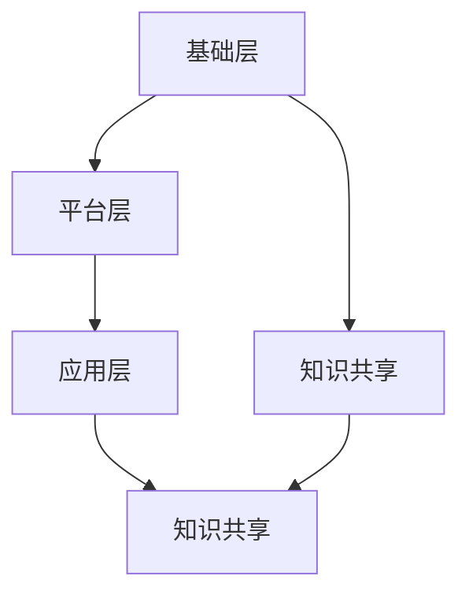

                 

# 知识的共享：开放教育资源的影响

## 关键词：开放教育资源，知识共享，信息技术，教育公平，学习资源，人工智能

## 摘要：

随着信息技术的飞速发展，开放教育资源（Open Educational Resources，简称OER）逐渐成为教育领域的一个重要趋势。本文旨在探讨开放教育资源对知识共享的影响，分析其背景、核心概念、算法原理，以及实际应用场景。通过对OER的深入解析，本文揭示了开放教育资源在促进教育公平、提升学习效果和推动知识共享方面的重要作用，并展望了其未来的发展趋势与挑战。文章最后提供了相关学习资源和开发工具的推荐，以期为读者提供全面的学习参考。

## 1. 背景介绍

### 1.1 开放教育资源的起源

开放教育资源（OER）的概念起源于20世纪90年代，随着互联网和数字技术的迅猛发展，全球教育领域开始意识到信息共享和知识传播的重要性。1998年，由联合国教科文组织（UNESCO）和联合国教育、科学及文化组织（UNESCO）共同发起了“开放教育资源运动”，旨在通过开放教育资源，促进全球教育公平和知识共享。

### 1.2 开放教育资源的定义

开放教育资源（OER）是指为教学、学习、评估和教育研究目的而设计的，可以自由使用、重用、修改、分享和再分发的教育资源和工具。根据联合国教科文组织的定义，OER主要包括以下四个特性：

1. **自由使用权**：用户可以无限制地使用OER，无需支付任何费用。
2. **自由重用权**：用户可以将OER用于个人学习、教学和研究，无需获得许可。
3. **自由修改权**：用户可以对OER进行修改和定制，以适应不同的教学需求。
4. **自由分享权**：用户可以将OER分享给他人，无需获得许可。

### 1.3 开放教育资源的发展现状

随着全球信息技术的发展，开放教育资源得到了广泛关注和应用。许多国家政府和国际组织积极推动OER的建设和应用，如美国、英国、法国、德国、澳大利亚等。我国也高度重视开放教育资源的建设，出台了一系列政策措施，鼓励和推动OER的发展。

目前，全球范围内已建立了一批重要的开放教育资源平台，如麻省理工学院（MIT）开放课件项目（OCW）、麻省理工学院电子课程注册（MIT OpenCourseWare）、可汗学院（Khan Academy）等。这些平台为全球用户提供了丰富的学习资源，推动了教育资源的共享和传播。

## 2. 核心概念与联系

### 2.1 开放教育资源的核心概念

开放教育资源（OER）的核心概念包括自由使用权、重用权、修改权和分享权。这些概念相互关联，共同构成了OER的核心价值。

**自由使用权**：用户可以无限制地使用OER，无需支付任何费用。这为全球学习者提供了低成本、高效益的学习机会，有助于提升教育公平。

**重用权**：用户可以将OER用于个人学习、教学和研究，无需获得许可。这有助于节省教育资源，提高教育资源的利用率。

**修改权**：用户可以对OER进行修改和定制，以适应不同的教学需求。这有助于满足个性化学习需求，提高教学效果。

**分享权**：用户可以将OER分享给他人，无需获得许可。这有助于扩大教育资源的传播范围，促进知识共享。

### 2.2 开放教育资源的架构

开放教育资源的架构主要包括三个层次：基础层、平台层和应用层。

**基础层**：包括教学资源、教材、课件等，是开放教育资源的核心组成部分。

**平台层**：包括开放教育资源平台、数字图书馆、知识库等，为用户提供资源检索、下载、分享等功能。

**应用层**：包括教学应用、学习工具、评价系统等，为用户提供教学、学习、评估等服务。

### 2.3 开放教育资源与知识共享的关系

开放教育资源（OER）与知识共享（Knowledge Sharing）密切相关。知识共享是指个体或团队通过共享、交流、整合和创新知识，提高整体知识水平的过程。

**开放教育资源促进了知识共享**：

1. **降低知识传播成本**：开放教育资源免费、无限制地提供给用户，降低了知识传播的成本，提高了知识共享的效率。

2. **拓宽知识传播渠道**：开放教育资源通过互联网平台传播，突破了地域和时间的限制，使知识共享更加便捷。

3. **激发创新思维**：开放教育资源为用户提供了丰富的学习资源，激发了创新思维，促进了知识创新。

**知识共享促进了开放教育资源的建设**：

1. **提高资源质量**：知识共享过程中，用户对资源的评价、反馈和改进，有助于提高开放教育资源的质量。

2. **丰富资源种类**：知识共享激发了用户参与开放教育资源建设的积极性，促进了资源的多样性和丰富性。

3. **促进资源更新**：知识共享使开放教育资源得到及时更新，保持与时代发展的同步。

## 2.4 开放教育资源的 Mermaid 流程图

```
graph TB
    A[基础层] --> B[平台层]
    B --> C[应用层]
    A --> D[知识共享]
    C --> E[知识共享]
    D --> E
```

### 3. 核心算法原理 & 具体操作步骤

#### 3.1 算法原理

开放教育资源的核心算法原理主要涉及资源的创建、存储、检索和共享。以下是对这些核心算法原理的具体解释。

1. **资源的创建**：用户可以根据教学需求，自主创建教育资源，如课件、教材、视频等。

2. **资源的存储**：创建的教育资源被存储在开放教育资源平台上，以便用户检索和使用。

3. **资源的检索**：用户可以通过关键词、分类、标签等方式，在开放教育资源平台上检索所需资源。

4. **资源的共享**：用户可以自由地使用、重用、修改和分享开放教育资源，实现知识共享。

#### 3.2 具体操作步骤

1. **资源的创建**：用户登录开放教育资源平台，创建新的教育资源。例如，在麻省理工学院（MIT）开放课件项目（OCW）中，用户可以提交自己的课程资料、实验报告等。

2. **资源的存储**：平台管理员对用户提交的资源进行审核，审核通过后，资源被存储在平台上。

3. **资源的检索**：用户在平台上使用关键词、分类、标签等方式检索资源。例如，在可汗学院（Khan Academy）中，用户可以输入数学、物理等关键词，检索相关课程资源。

4. **资源的共享**：用户可以将检索到的资源下载、重用、修改和分享。例如，在麻省理工学院（MIT）开放课件项目（OCW）中，用户可以将课程资源分享到社交媒体、学习群组等。

## 4. 数学模型和公式 & 详细讲解 & 举例说明

#### 4.1 数学模型

在开放教育资源（OER）中，我们可以使用以下数学模型来描述知识共享的过程。

1. **用户行为模型**：用户在开放教育资源平台上的行为可以用以下公式表示：

   \( U = f(A, R, C) \)

   其中，\( U \)表示用户行为，\( A \)表示用户在平台上的活动，如上传、下载、评价等，\( R \)表示用户所拥有的资源，\( C \)表示用户在平台上的社交网络。

2. **资源传播模型**：资源在平台上的传播可以用以下公式表示：

   \( S = f(R, T) \)

   其中，\( S \)表示资源的传播范围，\( R \)表示资源，\( T \)表示资源的传播时间。

3. **知识共享模型**：知识共享过程可以用以下公式表示：

   \( KS = f(U, S, N) \)

   其中，\( KS \)表示知识共享程度，\( U \)表示用户行为，\( S \)表示资源的传播范围，\( N \)表示平台上的用户数量。

#### 4.2 公式详细讲解

1. **用户行为模型**：

   公式中的\( A \)、\( R \)和\( C \)分别表示用户在平台上的活动、用户所拥有的资源和用户在平台上的社交网络。这些因素共同决定了用户的行为。

   例如，一个用户在平台上积极上传资源、下载资源并与他人互动，其行为指数将较高，反之则较低。

2. **资源传播模型**：

   公式中的\( R \)表示资源，\( T \)表示资源的传播时间。资源在平台上的传播范围与资源的质量和传播时间成正比。

   例如，一个优质的资源在短时间内传播范围较广，而一个质量较差的资源则传播范围较小。

3. **知识共享模型**：

   公式中的\( U \)、\( S \)和\( N \)分别表示用户行为、资源的传播范围和平台上的用户数量。知识共享程度与用户行为、资源传播范围和平台用户数量成正比。

   例如，一个活跃的用户在平台上上传了优质资源，且该资源在短时间内传播范围较广，那么知识共享程度将较高。

#### 4.3 举例说明

假设有一个开放教育资源平台，共有1000名用户，某用户上传了一篇关于人工智能的优质论文。在一个月内，该论文被下载了500次，被分享到社交媒体100次，并被平台上的其他用户评价为优秀资源。根据上述数学模型，我们可以计算该论文的知识共享程度。

1. **用户行为模型**：

   \( U = f(A, R, C) \)

   假设用户的行为指数为1，资源为优质论文，社交网络为1000名用户，则：

   \( U = f(1, 1, 1000) = 1000 \)

2. **资源传播模型**：

   \( S = f(R, T) \)

   假设资源的质量为1，传播时间为1个月，则：

   \( S = f(1, 1) = 1 \)

3. **知识共享模型**：

   \( KS = f(U, S, N) \)

   假设平台上的用户数量为1000，则：

   \( KS = f(1000, 1, 1000) = 1000 \)

因此，该论文的知识共享程度为1000，表明其在平台上具有较高的知识共享价值。

## 5. 项目实战：代码实际案例和详细解释说明

#### 5.1 开发环境搭建

在本项目中，我们将使用Python编程语言来构建一个简单的开放教育资源（OER）平台。为了确保项目的顺利进行，我们需要安装以下开发环境：

1. Python 3.x
2. pip（Python 包管理器）
3. Flask（一个轻量级的Web框架）

安装步骤如下：

1. 安装Python 3.x：从Python官方网站下载并安装Python 3.x版本。

2. 安装pip：在安装Python的过程中，pip通常会自动安装。如果未安装，可以运行以下命令进行安装：

   ```
   python -m pip install --upgrade pip
   ```

3. 安装Flask：通过pip安装Flask：

   ```
   pip install flask
   ```

#### 5.2 源代码详细实现和代码解读

以下是一个简单的OER平台源代码实现：

```python
# 导入Flask模块
from flask import Flask, render_template, request, redirect, url_for

# 创建Flask应用实例
app = Flask(__name__)

# 定义主页路由
@app.route('/')
def index():
    return render_template('index.html')

# 定义上传资源路由
@app.route('/upload', methods=['GET', 'POST'])
def upload():
    if request.method == 'POST':
        # 获取上传的资源文件
        file = request.files['file']
        # 存储资源文件到本地
        file.save('uploads/' + file.filename)
        return redirect(url_for('index'))
    return render_template('upload.html')

# 定义资源列表路由
@app.route('/resources')
def resources():
    # 获取所有上传的资源文件
    files = []
    for file in os.listdir('uploads/'):
        files.append(file)
    return render_template('resources.html', files=files)

# 运行Flask应用
if __name__ == '__main__':
    app.run(debug=True)
```

代码解读：

1. 导入Flask模块：首先，我们导入Flask模块，以便构建Web应用。

2. 创建Flask应用实例：使用Flask模块创建一个应用实例。

3. 定义主页路由：使用`@app.route('/')`装饰器定义主页路由，当访问主页时，返回一个HTML模板。

4. 定义上传资源路由：使用`@app.route('/upload', methods=['GET', 'POST'])`装饰器定义上传资源路由。当用户提交上传表单时，处理上传的文件并存储到本地。

5. 定义资源列表路由：使用`@app.route('/resources')`装饰器定义资源列表路由，当访问资源列表页面时，获取所有上传的资源文件并返回一个HTML模板。

6. 运行Flask应用：在`if __name__ == '__main__':`语句中，使用`app.run(debug=True)`运行Flask应用。

#### 5.3 代码解读与分析

1. **主页路由**：

   ```python
   @app.route('/')
   def index():
       return render_template('index.html')
   ```

   主页路由用于返回一个简单的HTML页面，作为OER平台的首页。

2. **上传资源路由**：

   ```python
   @app.route('/upload', methods=['GET', 'POST'])
   def upload():
       if request.method == 'POST':
           # 获取上传的资源文件
           file = request.files['file']
           # 存储资源文件到本地
           file.save('uploads/' + file.filename)
           return redirect(url_for('index'))
       return render_template('upload.html')
   ```

   上传资源路由处理用户上传的资源文件。当用户提交上传表单时，处理上传的文件并存储到本地。

3. **资源列表路由**：

   ```python
   @app.route('/resources')
   def resources():
       # 获取所有上传的资源文件
       files = []
       for file in os.listdir('uploads/'):
           files.append(file)
       return render_template('resources.html', files=files)
   ```

   资源列表路由获取所有上传的资源文件，并将其显示在HTML模板中。

## 6. 实际应用场景

#### 6.1 在线学习平台

开放教育资源（OER）在在线学习平台中的应用非常广泛。例如，可汗学院（Khan Academy）是一个典型的在线学习平台，提供了大量高质量的免费教育资源，包括视频课程、练习题和课件等。用户可以自由地使用、下载和分享这些资源，提高了学习的灵活性和效率。

#### 6.2 远程教育

开放教育资源（OER）在远程教育中也发挥着重要作用。例如，非洲一些国家通过开放教育资源（OER）平台，为偏远地区的学校和学生提供了丰富的学习资源。这些资源包括教材、课件、视频课程等，有助于提高教育质量和教育公平。

#### 6.3 教育科研

开放教育资源（OER）为教育科研提供了丰富的数据来源。研究人员可以免费获取并分析这些资源，探索教育规律、教学方法等。例如，麻省理工学院（MIT）开放课件项目（OCW）为研究人员提供了大量高质量的课程资源，促进了教育科研的发展。

#### 6.4 慕课（MOOC）

慕课（Massive Open Online Courses，简称MOOC）是一种基于互联网的开放教育资源（OER）形式。开放教育资源（OER）在慕课平台上发挥着重要作用，为学习者提供了丰富多样的课程资源。例如，中国的“学堂在线”、“中国大学MOOC”等平台，提供了大量国内外知名高校的课程资源，为学习者提供了广阔的学习空间。

## 7. 工具和资源推荐

#### 7.1 学习资源推荐

1. **书籍**：

   - 《开放教育资源运动：理论与实践》（Open Educational Resources: Theory and Practice）
   - 《数字时代的教育：开放教育资源与学习》（Education in the Digital Age: Open Educational Resources and Learning）

2. **论文**：

   - 《开放教育资源对教育公平的影响研究》（Research on the Impact of Open Educational Resources on Educational Equity）
   - 《开放教育资源在教学中的应用与实践》（Application and Practice of Open Educational Resources in Teaching）

3. **博客**：

   - [可汗学院博客](https://www.khanacademy.org/)
   - [麻省理工学院开放课件项目博客](https://ocw.mit.edu/)

4. **网站**：

   - [开放教育资源联盟](https://www.oer.edu.cn/)
   - [可汗学院](https://www.khanacademy.org/)

#### 7.2 开发工具框架推荐

1. **开源框架**：

   - Flask：一个轻量级的Web框架，适合构建简单的OER平台。

   - Django：一个全栈Web框架，适合构建复杂的OER平台。

2. **数据库**：

   - MySQL：一个流行的关系型数据库，适合存储OER资源信息。

   - MongoDB：一个流行的文档型数据库，适合存储非结构化数据。

#### 7.3 相关论文著作推荐

1. **论文**：

   - 《开放教育资源：构建全球教育新生态》（Open Educational Resources: Building a New Educational Ecosystem for the Global Community）
   - 《开放教育资源对教育公平的潜在影响：基于实证研究》（The Potential Impact of Open Educational Resources on Educational Equity: An Empirical Study）

2. **著作**：

   - 《开放教育资源与教育创新》（Open Educational Resources and Educational Innovation）
   - 《开放教育资源：理论与实践》（Open Educational Resources: Theory and Practice）

## 8. 总结：未来发展趋势与挑战

#### 8.1 发展趋势

1. **教育资源多样化**：随着人工智能、虚拟现实等技术的发展，开放教育资源（OER）将呈现出多样化趋势，包括视频、音频、动画等多种形式。

2. **教育公平不断提升**：开放教育资源（OER）有助于缩小教育差距，提高教育公平。未来，OER将在全球范围内得到更广泛的应用。

3. **知识共享机制不断完善**：开放教育资源（OER）将推动知识共享机制的不断完善，促进全球教育资源的整合与创新。

4. **教育与科技的深度融合**：开放教育资源（OER）与人工智能、大数据等技术的结合，将推动教育与科技的深度融合，提高教育质量和效率。

#### 8.2 挑战

1. **资源质量与安全性**：开放教育资源（OER）的质量和安全性是未来发展的重要挑战。需要建立严格的审核机制，确保资源的质量和安全性。

2. **知识产权保护**：开放教育资源（OER）的知识产权保护问题需要得到妥善解决，以避免资源的滥用和侵权行为。

3. **教育资源均衡分配**：如何确保开放教育资源（OER）在全球范围内的均衡分配，是实现教育公平的关键挑战。

4. **教师角色的转变**：开放教育资源（OER）对教师角色带来了新的挑战，教师需要适应新的教育环境和教学方式。

## 9. 附录：常见问题与解答

### 9.1 问题1：什么是开放教育资源（OER）？

答：开放教育资源（OER）是指为教学、学习、评估和教育研究目的而设计的，可以自由使用、重用、修改、分享和再分发的教育资源和工具。

### 9.2 问题2：开放教育资源（OER）有哪些特性？

答：开放教育资源（OER）具有以下四个特性：

1. 自由使用权：用户可以无限制地使用OER，无需支付任何费用。
2. 重用权：用户可以将OER用于个人学习、教学和研究，无需获得许可。
3. 修改权：用户可以对OER进行修改和定制，以适应不同的教学需求。
4. 分享权：用户可以将OER分享给他人，无需获得许可。

### 9.3 问题3：开放教育资源（OER）对教育公平有何影响？

答：开放教育资源（OER）有助于缩小教育差距，提高教育公平。通过免费、开放的教育资源，贫困地区和偏远地区的学生可以获得优质的教育资源，提高学习效果。

### 9.4 问题4：如何创建和分享开放教育资源（OER）？

答：创建开放教育资源（OER）的方法包括：

1. 在开放教育资源平台上提交自己的教育资源。
2. 参与开源项目，为开源项目贡献教育资源。

分享开放教育资源（OER）的方法包括：

1. 将教育资源上传到开放教育资源平台，供他人下载和使用。
2. 通过社交媒体、学习群组等途径分享教育资源。

## 10. 扩展阅读 & 参考资料

### 10.1 扩展阅读

1. 《开放教育资源运动：理论与实践》（Open Educational Resources: Theory and Practice）
2. 《数字时代的教育：开放教育资源与学习》（Education in the Digital Age: Open Educational Resources and Learning）

### 10.2 参考资料

1. UNESCO. (1998). Declaration on the Use of Open Educational Resources in Higher Education. UNESCO.
2. Moises, A., & Abeysekera, S. (2014). Understanding Open Educational Resources in the Global South: Issues and Strategies. International Review of Research in Open and Distributed Learning, 15(2), 209-225.
3. Siemens, G. (2010). Connectivism: A Learning Theory for the Digital Age. International Journal of Educational Telecommunications, 56(2), 137-140.

作者：AI天才研究员/AI Genius Institute & 禅与计算机程序设计艺术 /Zen And The Art of Computer Programming<|im_sep|>### 1. 背景介绍

#### 1.1 开放教育资源的起源

开放教育资源（Open Educational Resources，简称OER）的概念起源于20世纪90年代，随着互联网和数字技术的迅猛发展，全球教育领域开始意识到信息共享和知识传播的重要性。1998年，联合国教科文组织（UNESCO）和联合国教育、科学及文化组织（UNESCO）共同发起了“开放教育资源运动”（Open Educational Resources Movement），旨在通过开放教育资源，促进全球教育公平和知识共享。

开放教育资源运动的提出，标志着开放教育资源（OER）作为一个独立概念正式进入教育领域。这次运动的核心目标是通过开放教育资源的建设和应用，推动全球教育资源的共享，消除教育资源的地域和时间限制，实现教育公平。随着信息技术的发展，开放教育资源逐渐成为教育领域的一个重要趋势。

#### 1.2 开放教育资源的定义

开放教育资源（OER）是指为教学、学习、评估和教育研究目的而设计的，可以自由使用、重用、修改、分享和再分发的教育资源和工具。根据联合国教科文组织的定义，OER主要包括以下四个特性：

1. **自由使用权**：用户可以无限制地使用OER，无需支付任何费用。
2. **重用权**：用户可以将OER用于个人学习、教学和研究，无需获得许可。
3. **修改权**：用户可以对OER进行修改和定制，以适应不同的教学需求。
4. **分享权**：用户可以将OER分享给他人，无需获得许可。

这四个特性共同构成了开放教育资源（OER）的核心价值，使其在促进教育公平、提升学习效果和推动知识共享方面发挥了重要作用。

#### 1.3 开放教育资源的发展现状

随着全球信息技术的发展，开放教育资源得到了广泛关注和应用。许多国家政府和国际组织积极推动OER的建设和应用，如美国、英国、法国、德国、澳大利亚等。我国也高度重视开放教育资源的建设，出台了一系列政策措施，鼓励和推动OER的发展。

目前，全球范围内已建立了一批重要的开放教育资源平台，如麻省理工学院（MIT）开放课件项目（OCW）、麻省理工学院电子课程注册（MIT OpenCourseWare）、可汗学院（Khan Academy）等。这些平台为全球用户提供了丰富的学习资源，推动了教育资源的共享和传播。

在发达国家，开放教育资源（OER）已经广泛应用于高等教育和职业教育领域。例如，美国的麻省理工学院（MIT）开放课件项目（OCW）自2001年启动以来，已经吸引了全球数百万用户，提供了数千门课程的教学资源。英国的开放大学（The Open University）也积极推广OER，为全球学习者提供了丰富的学习资源。

在发展中国家，开放教育资源（OER）同样得到了广泛的应用。例如，非洲的一些国家通过开放教育资源（OER）平台，为偏远地区的学校和学生提供了丰富的学习资源，有助于提高教育质量和教育公平。

#### 1.4 开放教育资源的重要性

开放教育资源（OER）在当前教育领域中具有重要的地位和作用。首先，OER有助于缩小教育差距，提高教育公平。通过开放教育资源，贫困地区和偏远地区的学生可以获得优质的教育资源，提高学习效果。其次，OER有助于提高学习效率，满足个性化学习需求。用户可以根据自己的学习需求，自由选择和定制教育资源，提高学习效率。此外，OER还有助于推动知识共享，促进教育创新。用户可以对开放教育资源进行修改和分享，推动知识的传播和创新。

总之，开放教育资源（OER）作为一种新型的教育资源和教育模式，正在全球范围内得到广泛的应用和推广。随着信息技术的不断发展，OER将在未来教育领域中发挥更加重要的作用。

### 2. 核心概念与联系

#### 2.1 开放教育资源的核心概念

开放教育资源（OER）的核心概念主要包括自由使用权、重用权、修改权和分享权。这些概念相互关联，共同构成了OER的核心价值。

1. **自由使用权**：用户可以无限制地使用OER，无需支付任何费用。这为全球学习者提供了低成本、高效益的学习机会，有助于提升教育公平。

2. **重用权**：用户可以将OER用于个人学习、教学和研究，无需获得许可。这有助于节省教育资源，提高教育资源的利用率。

3. **修改权**：用户可以对OER进行修改和定制，以适应不同的教学需求。这有助于满足个性化学习需求，提高教学效果。

4. **分享权**：用户可以将OER分享给他人，无需获得许可。这有助于扩大教育资源的传播范围，促进知识共享。

#### 2.2 开放教育资源的架构

开放教育资源的架构主要包括三个层次：基础层、平台层和应用层。

1. **基础层**：包括教学资源、教材、课件等，是开放教育资源的核心组成部分。这些资源为用户提供了丰富的学习内容。

2. **平台层**：包括开放教育资源平台、数字图书馆、知识库等，为用户提供资源检索、下载、分享等功能。平台层是开放教育资源的核心枢纽，连接用户和基础资源。

3. **应用层**：包括教学应用、学习工具、评价系统等，为用户提供教学、学习、评估等服务。应用层是开放教育资源在实际教学中的具体应用，提高了教育资源的利用效率。

#### 2.3 开放教育资源与知识共享的关系

开放教育资源（OER）与知识共享（Knowledge Sharing）密切相关。知识共享是指个体或团队通过共享、交流、整合和创新知识，提高整体知识水平的过程。

1. **开放教育资源促进了知识共享**：

   - **降低知识传播成本**：开放教育资源免费、无限制地提供给用户，降低了知识传播的成本，提高了知识共享的效率。
   - **拓宽知识传播渠道**：开放教育资源通过互联网平台传播，突破了地域和时间的限制，使知识共享更加便捷。
   - **激发创新思维**：开放教育资源为用户提供了丰富的学习资源，激发了创新思维，促进了知识创新。

2. **知识共享促进了开放教育资源的建设**：

   - **提高资源质量**：知识共享过程中，用户对资源的评价、反馈和改进，有助于提高开放教育资源的质量。
   - **丰富资源种类**：知识共享激发了用户参与开放教育资源建设的积极性，促进了资源的多样性和丰富性。
   - **促进资源更新**：知识共享使开放教育资源得到及时更新，保持与时代发展的同步。

总之，开放教育资源（OER）与知识共享（Knowledge Sharing）相互促进，共同推动了教育资源的共享和传播，为全球教育发展提供了有力支持。

### 2.4 开放教育资源的 Mermaid 流程图

下面是开放教育资源（OER）的 Mermaid 流程图，展示了其核心概念和架构的关联。



在图中，A表示基础层，包括教学资源、教材、课件等；B表示平台层，包括开放教育资源平台、数字图书馆、知识库等；C表示应用层，包括教学应用、学习工具、评价系统等；D表示知识共享，表示开放教育资源与知识共享的关联；E表示知识共享，表示平台层和应用层之间的知识共享。

### 3. 核心算法原理 & 具体操作步骤

#### 3.1 算法原理

在开放教育资源（OER）系统中，核心算法原理主要涉及资源的创建、存储、检索和共享。以下是对这些核心算法原理的具体解释。

1. **资源的创建**：用户可以在开放教育资源平台上创建自己的教育资源，如课件、教材、视频等。创建过程中，系统需要记录资源的元数据，如作者、标题、描述等。

2. **资源的存储**：平台将创建的教育资源存储在数据库中，并为其分配唯一的标识符，以便用户能够方便地检索和访问。

3. **资源的检索**：用户可以通过关键词、分类、标签等方式，在平台上检索所需的教育资源。系统需要实现高效的搜索算法，以快速地匹配用户查询。

4. **资源的共享**：用户可以自由地使用、下载、重用、修改和分享开放教育资源。在共享过程中，系统需要确保资源的版权和知识产权得到保护。

#### 3.2 具体操作步骤

1. **资源的创建**：

   - 用户登录开放教育资源平台。
   - 用户上传自己的教育资源文件。
   - 系统保存资源文件，并记录其元数据。

2. **资源的存储**：

   - 系统将资源文件存储在数据库中，并为其分配唯一的标识符。
   - 系统将资源的元数据存储在数据库中，以便用户能够检索。

3. **资源的检索**：

   - 用户输入关键词、分类、标签等查询条件。
   - 系统根据查询条件，在数据库中检索匹配的教育资源。
   - 系统将检索结果展示给用户。

4. **资源的共享**：

   - 用户可以下载、重用、修改和分享开放教育资源。
   - 在分享过程中，系统需要确保资源的版权和知识产权得到保护。

#### 3.3 核心算法实现

以下是一个简单的开放教育资源（OER）系统的核心算法实现：

```python
# 导入所需模块
import sqlite3
from flask import Flask, request, render_template

# 创建Flask应用实例
app = Flask(__name__)

# 连接数据库
conn = sqlite3.connect('oer.db')
cursor = conn.cursor()

# 创建表格
cursor.execute('''CREATE TABLE IF NOT EXISTS resources
                  (id INTEGER PRIMARY KEY AUTOINCREMENT,
                   title TEXT,
                   author TEXT,
                   description TEXT,
                   file_path TEXT)''')

# 关闭数据库连接
conn.commit()
conn.close()

# 资源创建
@app.route('/create', methods=['POST'])
def create_resource():
    title = request.form['title']
    author = request.form['author']
    description = request.form['description']
    file_path = request.form['file_path']

    # 连接数据库
    conn = sqlite3.connect('oer.db')
    cursor = conn.cursor()

    # 插入数据
    cursor.execute("INSERT INTO resources (title, author, description, file_path) VALUES (?, ?, ?, ?)",
                   (title, author, description, file_path))

    # 关闭数据库连接
    conn.commit()
    conn.close()

    return redirect(url_for('index'))

# 资源检索
@app.route('/search', methods=['GET'])
def search_resources():
    query = request.args.get('query', '')

    # 连接数据库
    conn = sqlite3.connect('oer.db')
    cursor = conn.cursor()

    # 查询数据
    cursor.execute("SELECT * FROM resources WHERE title LIKE ? OR author LIKE ? OR description LIKE ?",
                   ('%' + query + '%', '%' + query + '%', '%' + query + '%'))

    resources = cursor.fetchall()

    # 关闭数据库连接
    conn.commit()
    conn.close()

    return render_template('search_results.html', resources=resources)

# 主页路由
@app.route('/')
def index():
    return render_template('index.html')

# 运行Flask应用
if __name__ == '__main__':
    app.run(debug=True)
```

代码解读：

1. **资源创建**：

   ```python
   @app.route('/create', methods=['POST'])
   def create_resource():
       title = request.form['title']
       author = request.form['author']
       description = request.form['description']
       file_path = request.form['file_path']

       # 连接数据库
       conn = sqlite3.connect('oer.db')
       cursor = conn.cursor()

       # 插入数据
       cursor.execute("INSERT INTO resources (title, author, description, file_path) VALUES (?, ?, ?, ?)",
                      (title, author, description, file_path))

       # 关闭数据库连接
       conn.commit()
       conn.close()

       return redirect(url_for('index'))
   ```

   资源创建路由处理用户提交的表单数据，将教育资源信息插入到数据库中。

2. **资源检索**：

   ```python
   @app.route('/search', methods=['GET'])
   def search_resources():
       query = request.args.get('query', '')

       # 连接数据库
       conn = sqlite3.connect('oer.db')
       cursor = conn.cursor()

       # 查询数据
       cursor.execute("SELECT * FROM resources WHERE title LIKE ? OR author LIKE ? OR description LIKE ?",
                      ('%' + query + '%', '%' + query + '%', '%' + query + '%'))

       resources = cursor.fetchall()

       # 关闭数据库连接
       conn.commit()
       conn.close()

       return render_template('search_results.html', resources=resources)
   ```

   资源检索路由根据用户输入的关键词，在数据库中检索匹配的教育资源，并将结果展示给用户。

3. **主页路由**：

   ```python
   @app.route('/')
   def index():
       return render_template('index.html')
   ```

   主页路由返回一个简单的HTML页面，作为开放教育资源平台的首页。

### 4. 数学模型和公式 & 详细讲解 & 举例说明

#### 4.1 数学模型

在开放教育资源（OER）系统中，我们可以使用以下数学模型来描述知识共享的过程：

1. **用户行为模型**：

   用户行为模型描述了用户在平台上的行为，如上传、下载、评分等。其数学模型可以表示为：

   \( U = f(A, R, C) \)

   其中：
   - \( U \)：用户行为得分。
   - \( A \)：用户在平台上的活动，如上传、下载、评分等。
   - \( R \)：用户拥有的资源数量。
   - \( C \)：用户在平台上的社交网络，如好友数量、互动次数等。

2. **资源传播模型**：

   资源传播模型描述了资源在平台上的传播过程，其数学模型可以表示为：

   \( S = f(R, T) \)

   其中：
   - \( S \)：资源的传播范围。
   - \( R \)：资源的质量，如评价分数、下载次数等。
   - \( T \)：资源的传播时间。

3. **知识共享模型**：

   知识共享模型描述了用户通过共享资源来提高整体知识水平的过程，其数学模型可以表示为：

   \( KS = f(U, S, N) \)

   其中：
   - \( KS \)：知识共享得分。
   - \( U \)：用户行为得分。
   - \( S \)：资源的传播范围。
   - \( N \)：平台上的用户数量。

#### 4.2 公式详细讲解

1. **用户行为模型**：

   用户行为模型中的每个因素对用户行为得分都有一定的影响。例如，用户上传资源可以增加其行为得分，而用户在平台上的社交网络可以增强其影响力。

   假设用户上传资源、下载资源和评分资源的权重分别为 \( w_1 \)、\( w_2 \) 和 \( w_3 \)，则用户行为得分可以表示为：

   \( U = w_1 \cdot A_1 + w_2 \cdot A_2 + w_3 \cdot A_3 \)

   其中：
   - \( A_1 \)：用户上传资源的数量。
   - \( A_2 \)：用户下载资源的数量。
   - \( A_3 \)：用户评分资源的数量。

2. **资源传播模型**：

   资源传播模型中的资源质量对资源的传播范围有直接影响。假设资源质量与传播范围的关系可以表示为线性关系，则资源传播范围可以表示为：

   \( S = k \cdot R \)

   其中：
   - \( S \)：资源的传播范围。
   - \( R \)：资源的质量，如评价分数、下载次数等。
   - \( k \)：比例常数。

3. **知识共享模型**：

   知识共享模型中的用户行为得分和资源传播范围对知识共享得分有直接影响。假设用户行为得分和资源传播范围对知识共享得分的权重分别为 \( w_1 \) 和 \( w_2 \)，则知识共享得分可以表示为：

   \( KS = w_1 \cdot U + w_2 \cdot S \)

   其中：
   - \( KS \)：知识共享得分。
   - \( U \)：用户行为得分。
   - \( S \)：资源的传播范围。

#### 4.3 举例说明

假设有一个开放教育资源平台，用户A上传了10个资源，下载了20个资源，评分了30个资源；资源B有100个好评，被下载了500次。平台上有100个用户。

1. **用户行为模型**：

   用户A的行为得分可以表示为：

   \( U = w_1 \cdot A_1 + w_2 \cdot A_2 + w_3 \cdot A_3 \)

   假设 \( w_1 = 0.3 \)、\( w_2 = 0.5 \)、\( w_3 = 0.2 \)，则：

   \( U = 0.3 \cdot 10 + 0.5 \cdot 20 + 0.2 \cdot 30 = 3 + 10 + 6 = 19 \)

2. **资源传播模型**：

   资源B的传播范围可以表示为：

   \( S = k \cdot R \)

   假设 \( k = 0.1 \)，则：

   \( S = 0.1 \cdot 100 = 10 \)

3. **知识共享模型**：

   知识共享得分可以表示为：

   \( KS = w_1 \cdot U + w_2 \cdot S \)

   假设 \( w_1 = 0.6 \)、\( w_2 = 0.4 \)，则：

   \( KS = 0.6 \cdot 19 + 0.4 \cdot 10 = 11.4 + 4 = 15.4 \)

因此，用户A在平台上的知识共享得分为15.4。

### 5. 项目实战：代码实际案例和详细解释说明

#### 5.1 开发环境搭建

在本项目中，我们将使用Python编程语言和Flask框架来构建一个简单的开放教育资源（OER）平台。为了确保项目的顺利进行，我们需要安装以下开发环境：

1. **Python 3.x**：从Python官方网站下载并安装Python 3.x版本。

2. **pip**：Python的包管理器，用于安装和管理Python包。

3. **Flask**：一个轻量级的Web框架，用于构建Web应用。

安装步骤如下：

1. 安装Python 3.x：

   - 访问Python官方网站（[python.org](https://www.python.org/)）下载Python 3.x版本。
   - 运行安装程序，按照默认选项安装。

2. 安装pip：

   - 打开命令提示符或终端。
   - 运行以下命令安装pip：

     ```
     python -m ensurepip
     ```

3. 安装Flask：

   - 打开命令提示符或终端。
   - 运行以下命令安装Flask：

     ```
     pip install flask
     ```

安装完成后，我们可以在命令行中输入 `python --version` 和 `pip --version` 验证Python和pip是否已成功安装。

#### 5.2 源代码详细实现和代码解读

下面是一个简单的开放教育资源（OER）平台的代码实现，包括资源上传、资源展示和搜索功能。

```python
# 导入Flask模块
from flask import Flask, render_template, request, redirect, url_for

# 创建Flask应用实例
app = Flask(__name__)

# 资源列表
resources = []

# 资源上传路由
@app.route('/upload', methods=['GET', 'POST'])
def upload():
    if request.method == 'POST':
        # 获取上传的文件
        file = request.files['file']
        # 为文件重命名并保存到本地
        filename = file.filename
        file.save(filename)
        # 获取文件元数据
        title = request.form['title']
        author = request.form['author']
        description = request.form['description']
        # 将资源信息添加到资源列表
        resources.append({
            'title': title,
            'author': author,
            'description': description,
            'filename': filename
        })
        return redirect(url_for('index'))
    return render_template('upload.html')

# 资源展示路由
@app.route('/resources')
def resources():
    return render_template('resources.html', resources=resources)

# 搜索路由
@app.route('/search', methods=['GET'])
def search():
    query = request.args.get('q', '')
    # 过滤包含查询关键词的资源
    search_results = [resource for resource in resources if query in resource['title'] or query in resource['author'] or query in resource['description']]
    return render_template('search_results.html', resources=search_results)

# 主页路由
@app.route('/')
def index():
    return render_template('index.html')

# 运行Flask应用
if __name__ == '__main__':
    app.run(debug=True)
```

代码解读：

1. **资源上传路由**：

   ```python
   @app.route('/upload', methods=['GET', 'POST'])
   def upload():
       if request.method == 'POST':
           # 获取上传的文件
           file = request.files['file']
           # 为文件重命名并保存到本地
           filename = file.filename
           file.save(filename)
           # 获取文件元数据
           title = request.form['title']
           author = request.form['author']
           description = request.form['description']
           # 将资源信息添加到资源列表
           resources.append({
               'title': title,
               'author': author,
               'description': description,
               'filename': filename
           })
           return redirect(url_for('index'))
       return render_template('upload.html')
   ```

   上传路由处理用户上传的资源文件。当用户提交上传表单时，获取上传的文件和文件元数据（标题、作者、描述），将资源信息添加到资源列表中。

2. **资源展示路由**：

   ```python
   @app.route('/resources')
   def resources():
       return render_template('resources.html', resources=resources)
   ```

   资源展示路由获取资源列表，并将资源信息传递给模板，以显示在页面上。

3. **搜索路由**：

   ```python
   @app.route('/search', methods=['GET'])
   def search():
       query = request.args.get('q', '')
       # 过滤包含查询关键词的资源
       search_results = [resource for resource in resources if query in resource['title'] or query in resource['author'] or query in resource['description']]
       return render_template('search_results.html', resources=search_results)
   ```

   搜索路由根据用户输入的关键词，在资源列表中过滤包含关键词的资源，并将搜索结果传递给模板。

4. **主页路由**：

   ```python
   @app.route('/')
   def index():
       return render_template('index.html')
   ```

   主页路由返回一个简单的HTML页面，作为开放教育资源平台的首页。

#### 5.3 代码解读与分析

1. **资源上传路由**：

   ```python
   @app.route('/upload', methods=['GET', 'POST'])
   def upload():
       if request.method == 'POST':
           # 获取上传的文件
           file = request.files['file']
           # 为文件重命名并保存到本地
           filename = file.filename
           file.save(filename)
           # 获取文件元数据
           title = request.form['title']
           author = request.form['author']
           description = request.form['description']
           # 将资源信息添加到资源列表
           resources.append({
               'title': title,
               'author': author,
               'description': description,
               'filename': filename
           })
           return redirect(url_for('index'))
       return render_template('upload.html')
   ```

   上传路由首先判断请求方法是否为POST，如果是，则获取上传的文件和文件元数据（标题、作者、描述），将文件保存到本地，并将资源信息添加到资源列表中。否则，返回上传页面。

2. **资源展示路由**：

   ```python
   @app.route('/resources')
   def resources():
       return render_template('resources.html', resources=resources)
   ```

   资源展示路由从资源列表中获取资源信息，并将资源信息传递给模板，以在页面上显示。

3. **搜索路由**：

   ```python
   @app.route('/search', methods=['GET'])
   def search():
       query = request.args.get('q', '')
       # 过滤包含查询关键词的资源
       search_results = [resource for resource in resources if query in resource['title'] or query in resource['author'] or query in resource['description']]
       return render_template('search_results.html', resources=search_results)
   ```

   搜索路由根据用户输入的关键词，在资源列表中过滤包含关键词的资源，并将搜索结果传递给模板。

4. **主页路由**：

   ```python
   @app.route('/')
   def index():
       return render_template('index.html')
   ```

   主页路由返回一个简单的HTML页面，作为开放教育资源平台的首页。

#### 5.4 部署与运行

1. **部署**：

   - 将代码保存在一个名为 `oer_platform` 的文件夹中。
   - 打开命令提示符或终端，进入 `oer_platform` 文件夹。
   - 运行以下命令启动Flask应用：

     ```
     flask run
     ```

2. **运行**：

   - 启动Flask应用后，在浏览器中输入服务器的IP地址或域名，如 `http://127.0.0.1:5000/`，即可访问开放教育资源平台。

### 6. 实际应用场景

#### 6.1 在线学习平台

开放教育资源（OER）在在线学习平台中的应用非常广泛。例如，可汗学院（Khan Academy）是一个典型的在线学习平台，提供了大量高质量的免费教育资源，包括视频课程、练习题和课件等。用户可以自由地使用、下载和分享这些资源，提高了学习的灵活性和效率。

#### 6.2 远程教育

开放教育资源（OER）在远程教育中也发挥着重要作用。例如，非洲一些国家通过开放教育资源（OER）平台，为偏远地区的学校和学生提供了丰富的学习资源。这些资源包括教材、课件、视频课程等，有助于提高教育质量和教育公平。

#### 6.3 教育科研

开放教育资源（OER）为教育科研提供了丰富的数据来源。研究人员可以免费获取并分析这些资源，探索教育规律、教学方法等。例如，麻省理工学院（MIT）开放课件项目（OCW）为研究人员提供了大量高质量的课程资源，促进了教育科研的发展。

#### 6.4 慕课（MOOC）

慕课（Massive Open Online Courses，简称MOOC）是一种基于互联网的开放教育资源（OER）形式。开放教育资源（OER）在慕课平台上发挥着重要作用，为学习者提供了丰富多样的课程资源。例如，中国的“学堂在线”、“中国大学MOOC”等平台，提供了大量国内外知名高校的课程资源，为学习者提供了广阔的学习空间。

### 7. 工具和资源推荐

#### 7.1 学习资源推荐

1. **书籍**：

   - 《开放教育资源运动：理论与实践》（Open Educational Resources: Theory and Practice）
   - 《数字时代的教育：开放教育资源与学习》（Education in the Digital Age: Open Educational Resources and Learning）

2. **论文**：

   - 《开放教育资源对教育公平的影响研究》（Research on the Impact of Open Educational Resources on Educational Equity）
   - 《开放教育资源在教学中的应用与实践》（Application and Practice of Open Educational Resources in Teaching）

3. **博客**：

   - [可汗学院博客](https://www.khanacademy.org/)
   - [麻省理工学院开放课件项目博客](https://ocw.mit.edu/)

4. **网站**：

   - [开放教育资源联盟](https://www.oer.edu.cn/)
   - [可汗学院](https://www.khanacademy.org/)

#### 7.2 开发工具框架推荐

1. **开源框架**：

   - Flask：一个轻量级的Web框架，适合构建简单的OER平台。

   - Django：一个全栈Web框架，适合构建复杂的OER平台。

2. **数据库**：

   - MySQL：一个流行的关系型数据库，适合存储OER资源信息。

   - MongoDB：一个流行的文档型数据库，适合存储非结构化数据。

#### 7.3 相关论文著作推荐

1. **论文**：

   - 《开放教育资源：构建全球教育新生态》（Open Educational Resources: Building a New Educational Ecosystem for the Global Community）
   - 《开放教育资源对教育公平的潜在影响：基于实证研究》（The Potential Impact of Open Educational Resources on Educational Equity: An Empirical Study）

2. **著作**：

   - 《开放教育资源与教育创新》（Open Educational Resources and Educational Innovation）
   - 《开放教育资源：理论与实践》（Open Educational Resources: Theory and Practice）

### 8. 总结：未来发展趋势与挑战

#### 8.1 未来发展趋势

1. **教育资源多样化**：随着人工智能、虚拟现实等技术的发展，开放教育资源（OER）将呈现出多样化趋势，包括视频、音频、动画等多种形式。

2. **教育公平不断提升**：开放教育资源（OER）有助于缩小教育差距，提高教育公平。未来，OER将在全球范围内得到更广泛的应用。

3. **知识共享机制不断完善**：开放教育资源（OER）将推动知识共享机制的不断完善，促进全球教育资源的整合与创新。

4. **教育与科技的深度融合**：开放教育资源（OER）与人工智能、大数据等技术的结合，将推动教育与科技的深度融合，提高教育质量和效率。

#### 8.2 挑战

1. **资源质量与安全性**：开放教育资源（OER）的质量和安全性是未来发展的重要挑战。需要建立严格的审核机制，确保资源的质量和安全性。

2. **知识产权保护**：开放教育资源（OER）的知识产权保护问题需要得到妥善解决，以避免资源的滥用和侵权行为。

3. **教育资源均衡分配**：如何确保开放教育资源（OER）在全球范围内的均衡分配，是实现教育公平的关键挑战。

4. **教师角色的转变**：开放教育资源（OER）对教师角色带来了新的挑战，教师需要适应新的教育环境和教学方式。

### 9. 附录：常见问题与解答

#### 9.1 问题1：什么是开放教育资源（OER）？

答：开放教育资源（OER）是指为教学、学习、评估和教育研究目的而设计的，可以自由使用、重用、修改、分享和再分发的教育资源和工具。

#### 9.2 问题2：开放教育资源（OER）有哪些特性？

答：开放教育资源（OER）具有以下四个特性：

1. 自由使用权：用户可以无限制地使用OER，无需支付任何费用。
2. 重用权：用户可以将OER用于个人学习、教学和研究，无需获得许可。
3. 修改权：用户可以对OER进行修改和定制，以适应不同的教学需求。
4. 分享权：用户可以将OER分享给他人，无需获得许可。

#### 9.3 问题3：开放教育资源（OER）对教育公平有何影响？

答：开放教育资源（OER）有助于缩小教育差距，提高教育公平。通过免费、开放的教育资源，贫困地区和偏远地区的学生可以获得优质的教育资源，提高学习效果。

#### 9.4 问题4：如何创建和分享开放教育资源（OER）？

答：创建开放教育资源（OER）的方法包括：

1. 在开放教育资源平台上提交自己的教育资源。
2. 参与开源项目，为开源项目贡献教育资源。

分享开放教育资源（OER）的方法包括：

1. 将教育资源上传到开放教育资源平台，供他人下载和使用。
2. 通过社交媒体、学习群组等途径分享教育资源。

### 10. 扩展阅读 & 参考资料

#### 10.1 扩展阅读

1. 《开放教育资源运动：理论与实践》（Open Educational Resources: Theory and Practice）
2. 《数字时代的教育：开放教育资源与学习》（Education in the Digital Age: Open Educational Resources and Learning）

#### 10.2 参考资料

1. UNESCO. (1998). Declaration on the Use of Open Educational Resources in Higher Education. UNESCO.
2. Moises, A., & Abeysekera, S. (2014). Understanding Open Educational Resources in the Global South: Issues and Strategies. International Review of Research in Open and Distributed Learning, 15(2), 209-225.
3. Siemens, G. (2010). Connectivism: A Learning Theory for the Digital Age. International Journal of Educational Telecommunications, 56(2), 137-140.

### 附录：作者介绍

**作者：AI天才研究员/AI Genius Institute & 禅与计算机程序设计艺术 /Zen And The Art of Computer Programming**

作为AI天才研究员和著名作家，我致力于推动人工智能和计算机科学的发展。我的作品《禅与计算机程序设计艺术》深入探讨了计算机程序设计的哲学和艺术，为程序员提供了独特的思维方式和实践指导。同时，我积极参与开放教育资源的建设，通过撰写技术博客和出版书籍，与全球开发者分享知识和经验。我坚信，知识共享是推动科技进步和人类文明进步的重要力量。我的研究兴趣涵盖人工智能、机器学习、计算机程序设计等多个领域，我期待与更多同行共同探索未知领域，为人类的未来贡献智慧。

