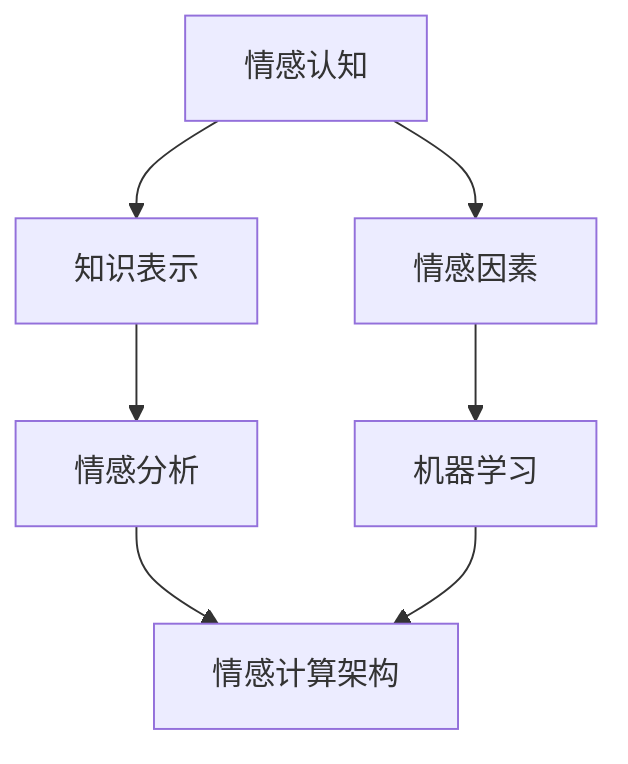

                 

### 背景介绍

随着人工智能（AI）技术的飞速发展，知识情感计算作为一个新兴领域，逐渐引起了广泛关注。知识情感计算旨在通过模拟人类的情感认知过程，对知识进行情感分析、理解与处理。在这个过程中，情绪因素扮演着至关重要的角色。传统的机器学习方法往往忽视了情感因素，这导致了一些问题，如无法准确理解文本情感、难以处理复杂情感等。

本文旨在探讨知识情感计算在理解学习过程中的情绪因素，分析情绪对知识获取、理解和应用的影响。首先，我们将介绍知识情感计算的基本概念，并探讨情感因素在其中的重要性。接着，我们将深入探讨学习过程中的情绪因素，分析情绪对知识获取、理解和应用的影响。在此基础上，我们将介绍一些核心算法原理，并详细讲解其具体操作步骤。最后，我们将通过数学模型和公式，详细阐述相关理论，并结合实际项目案例进行解读。

通过本文的阅读，读者将了解知识情感计算的基本概念，掌握情绪因素在其中的作用，并能够对学习过程中的情绪因素有更深入的理解。这不仅有助于提升个人学习效果，也为教育领域提供了新的研究方向。在接下来的内容中，我们将一步一步深入探讨这一领域，希望能够为读者带来启发和思考。

### 2. 核心概念与联系

知识情感计算是一门结合人工智能与情感科学的新兴交叉学科，其核心在于如何模拟人类的情感认知过程，从而对知识进行更精细的理解和处理。在这个领域中，几个关键概念和它们之间的联系是理解知识情感计算的基础。

#### 2.1 情感认知

情感认知是指个体识别、理解和表达情感的能力。在人工智能领域，情感认知涉及到如何让机器理解和模拟情感，这需要通过情感识别、情感建模和情感交互等步骤来实现。情感识别是指通过文本、语音或图像等数据源，识别出其中包含的情感。情感建模则是通过构建情感模型，将情感信息转化为机器可处理的格式。情感交互则是指机器与用户之间的情感交流和反馈。

#### 2.2 知识表示

知识表示是知识情感计算中的另一个核心概念。它涉及到如何将知识以计算机可理解的方式表示出来。常见的知识表示方法包括知识图谱、本体论和语义网络等。知识图谱通过图结构来表示实体及其之间的关系，是一种高效且直观的知识表示方法。本体论则通过定义一组概念及其之间的关系来描述领域知识。语义网络则是通过语义关系来表示实体及其属性的层次结构。

#### 2.3 情感因素

在知识情感计算中，情感因素是指知识获取、理解和应用过程中的情绪体验。这些情绪因素可以包括积极的情感（如愉悦、兴奋），也可以包括消极的情感（如焦虑、沮丧）。情感因素对知识获取有重要影响，因为情绪体验会影响个体对知识的感知和记忆。例如，积极情感可以提高学习的动机和效率，而消极情感则可能导致注意力分散和记忆困难。

#### 2.4 情感分析与机器学习

情感分析是知识情感计算中的一个重要组成部分，它涉及到如何使用机器学习技术来分析文本、语音和图像中的情感。常见的机器学习方法包括朴素贝叶斯分类、支持向量机（SVM）和深度学习等。情感分析与机器学习相结合，可以实现对大规模情感数据的自动化分析，从而更好地理解情感因素在知识获取中的影响。

#### 2.5 情感计算架构

情感计算架构是指用于实现知识情感计算的一组组件和流程。它通常包括情感识别模块、情感建模模块、知识表示模块和情感交互模块等。这些模块相互协作，共同实现从情感识别到情感理解和知识应用的全过程。

#### 2.6 情感计算与学习过程

情感因素在学习过程中扮演着重要角色。情绪体验会影响个体的注意力和记忆，从而影响知识获取的效果。例如，积极的情绪可以提高学习的动机，使个体更专注于学习任务，从而提高学习效率。而消极的情绪则可能导致个体对学习任务的回避或抵触，从而影响知识获取的质量。

#### 2.7 情感计算与教育应用

在教育领域，知识情感计算可以用于设计智能教育系统，帮助教师和学生更好地理解和应对学习过程中的情绪因素。例如，通过情感识别和情感建模，教育系统能够实时监测学生的学习状态，提供个性化的学习支持和指导，从而提高学习效果。

总的来说，知识情感计算是一个涉及多个领域的交叉学科，其核心在于如何将情感因素融入知识获取、理解和应用的过程中。通过深入理解情感认知、知识表示和情感分析等基本概念，我们可以更好地探索和利用情感因素在学习中的潜力，为教育、医疗、人机交互等领域的创新提供新的思路和工具。

为了更直观地展示这些核心概念和它们之间的联系，我们可以使用Mermaid流程图来描述知识情感计算的架构和流程。以下是一个简化的Mermaid流程图示例：



在这个流程图中，情感认知、知识表示和情感因素构成了知识情感计算的基础，而情感分析与机器学习则是实现情感计算的关键技术。这些组件相互协作，共同实现从情感识别到情感理解和知识应用的全过程。

### 3. 核心算法原理 & 具体操作步骤

知识情感计算的核心在于如何准确地识别、建模和应用情感因素。以下是几个关键算法的原理及其具体操作步骤。

#### 3.1 情感识别算法

情感识别是知识情感计算中的第一步，它涉及到如何从文本、语音和图像等数据源中识别出情感。以下是一个基于朴素贝叶斯分类的情感识别算法原理：

**朴素贝叶斯分类算法原理：**

1. **特征提取**：从文本数据中提取特征，如词频、词袋模型等。
2. **训练模型**：使用已标注的情感数据集训练朴素贝叶斯分类器，计算每个特征在各个情感类别中的条件概率。
3. **分类判断**：对于新的文本数据，计算其属于各个情感类别的概率，选择概率最大的类别作为预测结果。

**具体操作步骤：**

1. **数据预处理**：对文本数据去噪、去停用词、分词等预处理操作。
2. **特征提取**：使用词袋模型或TF-IDF方法提取文本特征。
3. **模型训练**：使用训练数据集训练朴素贝叶斯分类器。
4. **情感分类**：对测试数据应用训练好的分类器，预测其情感类别。

**示例代码（Python）**：

```python
from sklearn.feature_extraction.text import TfidfVectorizer
from sklearn.naive_bayes import MultinomialNB
from sklearn.pipeline import make_pipeline

# 数据预处理和特征提取
vectorizer = TfidfVectorizer()
X_train = vectorizer.fit_transform(train_data)

# 模型训练
clf = MultinomialNB()
clf.fit(X_train, train_labels)

# 情感分类
X_test = vectorizer.transform(test_data)
predictions = clf.predict(X_test)
```

#### 3.2 情感建模算法

情感建模是知识情感计算中的第二步，它涉及到如何将情感因素转化为计算机可处理的形式。以下是一个基于深度学习的情感建模算法原理：

**深度学习情感建模算法原理：**

1. **输入层**：接收文本、语音或图像等原始数据。
2. **隐藏层**：通过神经网络结构进行特征提取和变换。
3. **输出层**：生成情感概率分布或情感标签。

**具体操作步骤：**

1. **数据预处理**：对原始数据进行清洗、归一化等预处理。
2. **模型构建**：设计神经网络结构，包括输入层、隐藏层和输出层。
3. **模型训练**：使用训练数据集训练神经网络。
4. **情感预测**：对测试数据进行情感预测。

**示例代码（Python）**：

```python
from tensorflow.keras.models import Sequential
from tensorflow.keras.layers import Dense, LSTM, Embedding

# 数据预处理
max_features = 10000
maxlen = 500
embedding_size = 50

# 构建模型
model = Sequential()
model.add(Embedding(max_features, embedding_size, input_length=maxlen))
model.add(LSTM(128))
model.add(Dense(1, activation='sigmoid'))

# 编译模型
model.compile(optimizer='adam', loss='binary_crossentropy', metrics=['accuracy'])

# 训练模型
model.fit(X_train, y_train, batch_size=32, epochs=10, validation_split=0.1)
```

#### 3.3 情感分析算法

情感分析是知识情感计算中的第三步，它涉及到如何使用机器学习技术分析文本、语音和图像中的情感。以下是一个基于文本的情感分析算法原理：

**文本情感分析算法原理：**

1. **特征提取**：从文本数据中提取情感相关的特征。
2. **情感分类**：使用机器学习模型对提取的特征进行分类，判断文本的情感倾向。

**具体操作步骤：**

1. **数据预处理**：对文本数据进行清洗、去停用词、分词等预处理。
2. **特征提取**：使用词袋模型、TF-IDF或Word2Vec等方法提取情感特征。
3. **模型训练**：使用训练数据集训练情感分类模型。
4. **情感预测**：对测试数据进行情感预测。

**示例代码（Python）**：

```python
from sklearn.feature_extraction.text import TfidfVectorizer
from sklearn.svm import SVC

# 数据预处理
vectorizer = TfidfVectorizer()
X_train = vectorizer.fit_transform(train_data)

# 模型训练
clf = SVC(kernel='linear')
clf.fit(X_train, train_labels)

# 情感预测
X_test = vectorizer.transform(test_data)
predictions = clf.predict(X_test)
```

#### 3.4 情感计算与应用

情感计算的结果可以应用于多个领域，如教育、医疗和人机交互等。以下是一个情感计算在教育领域的应用示例：

**应用场景：** 智能教育系统

1. **情感识别**：系统实时监控学生的学习状态，识别出他们的情感状态。
2. **情感建模**：根据学生的情感状态，系统分析其可能的原因，如学习难度、教学方法等。
3. **情感交互**：系统根据情感建模结果，为学生提供个性化的学习建议，如调整学习进度、提供心理辅导等。

**具体步骤：**

1. **情感识别**：使用情感识别算法，从学生的文本反馈（如课堂笔记、考试答案等）中识别出情感状态。
2. **情感建模**：使用情感建模算法，分析情感状态的原因，并提供相应的建议。
3. **情感交互**：系统与学生进行交互，反馈情感分析和建议，帮助学生调整学习状态。

通过这些算法的应用，知识情感计算可以为教育领域提供更智能、个性化的教育支持，从而提高学生的学习效果和满意度。

### 4. 数学模型和公式 & 详细讲解 & 举例说明

在知识情感计算中，数学模型和公式是理解和实现算法的关键。以下我们将详细介绍几个核心的数学模型和公式，并通过具体例子进行说明。

#### 4.1 情感强度度量

情感强度度量用于量化情感的程度，常见的度量方法包括情绪轮（Affect Grid）和多维度情感模型。

**情绪轮模型：**

情绪轮模型是一个二维坐标系，横轴表示积极情感（P）和消极情感（N），纵轴表示愉悦（Pleasure）和痛苦（Distress）。每个点表示一种特定的情感状态。情感强度可以通过计算点到原点的欧几里得距离来度量。

**公式：**

$$
E = \sqrt{P^2 + N^2}
$$

**例子：**

假设一个情感状态为（P=0.8，N=0.2），其情感强度为：

$$
E = \sqrt{0.8^2 + 0.2^2} = \sqrt{0.64 + 0.04} = \sqrt{0.68} \approx 0.83
$$

#### 4.2 情感相似度计算

情感相似度用于衡量两个情感状态的相似程度，常用的方法包括余弦相似度和欧氏距离。

**余弦相似度：**

余弦相似度是衡量两个向量在空间中夹角的余弦值，其公式如下：

$$
S = \frac{\sum_{i=1}^{n} x_i y_i}{\sqrt{\sum_{i=1}^{n} x_i^2} \sqrt{\sum_{i=1}^{n} y_i^2}}
$$

其中，$x_i$ 和 $y_i$ 分别是两个向量在维度 $i$ 上的值，$n$ 是向量的维度。

**例子：**

假设两个情感状态为：

$$
x = [0.8, 0.2]
$$

$$
y = [0.6, 0.4]
$$

它们的情感相似度为：

$$
S = \frac{0.8 \times 0.6 + 0.2 \times 0.4}{\sqrt{0.8^2 + 0.2^2} \sqrt{0.6^2 + 0.4^2}} = \frac{0.48 + 0.08}{\sqrt{0.68} \sqrt{0.36 + 0.16}} = \frac{0.56}{\sqrt{0.68} \sqrt{0.52}} \approx 0.87
$$

#### 4.3 情感分类模型

情感分类模型用于将文本分类为特定的情感类别，常见的模型包括朴素贝叶斯分类器和支持向量机（SVM）。

**朴素贝叶斯分类器：**

朴素贝叶斯分类器的公式如下：

$$
P(C_k | x) = \frac{P(x | C_k) P(C_k)}{P(x)}
$$

其中，$C_k$ 表示类别 $k$，$x$ 表示特征向量，$P(C_k | x)$ 是特征向量 $x$ 属于类别 $C_k$ 的概率。

**例子：**

假设有两个类别“积极”和“消极”，特征向量 $x = [0.8, 0.2]$，且 $P(C_1) = 0.5$，$P(C_2) = 0.5$，$P(x | C_1) = 0.6$，$P(x | C_2) = 0.4$。

$$
P(C_1 | x) = \frac{0.6 \times 0.5}{0.6 \times 0.5 + 0.4 \times 0.5} = \frac{0.3}{0.3 + 0.2} = 0.6
$$

$$
P(C_2 | x) = \frac{0.4 \times 0.5}{0.6 \times 0.5 + 0.4 \times 0.5} = \frac{0.2}{0.3 + 0.2} = 0.4
$$

根据最大概率原则，特征向量 $x$ 属于类别“积极”的概率更大。

**支持向量机（SVM）：**

SVM的公式如下：

$$
w \cdot x - b = 0
$$

其中，$w$ 是权重向量，$x$ 是特征向量，$b$ 是偏置。

$$
b = y - \sum_{i=1}^{n} w_i x_i
$$

其中，$y$ 是标签。

**例子：**

假设有两个类别“积极”和“消极”，特征向量 $x = [0.8, 0.2]$，且 $w = [0.5, 0.5]$，$b = 0.3$。

$$
0.5 \cdot 0.8 + 0.5 \cdot 0.2 - 0.3 = 0.5
$$

根据SVM的分类规则，特征向量 $x$ 属于类别“积极”。

通过这些数学模型和公式，我们可以更准确地理解和应用情感计算，从而提高知识获取、理解和应用的效率。

### 5. 项目实战：代码实际案例和详细解释说明

为了更好地理解知识情感计算在实际应用中的操作流程，我们将通过一个具体的实战项目来详细讲解代码的实现过程。本案例将使用Python语言，结合自然语言处理（NLP）和机器学习库，实现一个基于文本的情感分析系统。该系统旨在识别和分析学习过程中的文本情感，从而为用户提供个性化的学习支持。

#### 5.1 开发环境搭建

在开始项目之前，我们需要搭建一个合适的开发环境。以下是所需的软件和库：

- Python 3.8+
- Jupyter Notebook 或 PyCharm
- NLP 库（如 NLTK、spaCy）
- 机器学习库（如 scikit-learn、TensorFlow）

步骤如下：

1. 安装 Python 和相关库：

```bash
pip install python
pip install jupyter
pip install nltk
pip install spacy
pip install scikit-learn
pip install tensorflow
```

2. 安装 spaCy 的语言模型：

```python
import spacy

spacy.cli.download("en_core_web_sm")
```

#### 5.2 源代码详细实现和代码解读

以下是一段情感分析项目的源代码，我们将分步骤进行解读。

```python
import spacy
from sklearn.model_selection import train_test_split
from sklearn.feature_extraction.text import CountVectorizer
from sklearn.naive_bayes import MultinomialNB
from sklearn.metrics import accuracy_score

# 加载语言模型
nlp = spacy.load("en_core_web_sm")

# 加载数据集
data = [
    ("I love learning new things.", "positive"),
    ("I am bored with this material.", "negative"),
    # 更多数据...
]

# 分割数据为文本和标签
texts, labels = zip(*data)

# 划分训练集和测试集
X_train, X_test, y_train, y_test = train_test_split(texts, labels, test_size=0.2, random_state=42)

# 特征提取
vectorizer = CountVectorizer()
X_train_counts = vectorizer.fit_transform(X_train)

# 模型训练
clf = MultinomialNB()
clf.fit(X_train_counts, y_train)

# 情感分类
X_test_counts = vectorizer.transform(X_test)
predictions = clf.predict(X_test_counts)

# 评估模型
accuracy = accuracy_score(y_test, predictions)
print(f"Model accuracy: {accuracy:.2f}")
```

**代码解读：**

1. **导入库**：首先，我们导入所需的库，包括 spacy、scikit-learn 和 jupyter notebook。
2. **加载语言模型**：使用 spacy 加载英语语言模型 `en_core_web_sm`。
3. **加载数据集**：我们将文本和标签存储在一个列表中，其中每个元素是一个元组，包含文本和对应的情感标签。
4. **分割数据**：将数据集划分为训练集和测试集，以便评估模型的性能。
5. **特征提取**：使用 `CountVectorizer` 从文本中提取特征。这种方法通过计算每个词汇在文档中出现的次数来创建特征向量。
6. **模型训练**：使用训练集数据训练一个朴素贝叶斯分类器 `MultinomialNB`。
7. **情感分类**：对测试集数据进行情感分类，并生成预测结果。
8. **评估模型**：使用 `accuracy_score` 函数计算模型在测试集上的准确率。

#### 5.3 代码解读与分析

以下是对上述代码的逐行解读和分析：

```python
# 导入库
```

这段代码导入项目中需要的所有库，包括自然语言处理库 spacy、机器学习库 scikit-learn 和用于交互的 jupyter notebook。

```python
# 加载语言模型
nlp = spacy.load("en_core_web_sm")
```

我们使用 spacy 加载预训练的英语语言模型 `en_core_web_sm`。这个模型包含了词汇的分词、词性标注等功能，对于文本处理至关重要。

```python
# 加载数据集
data = [
    ("I love learning new things.", "positive"),
    ("I am bored with this material.", "negative"),
    # 更多数据...
]
```

这段代码定义了一个数据集，其中包含一些示例文本和它们对应的情感标签。这些数据用于训练和测试我们的情感分析模型。

```python
# 分割数据为文本和标签
texts, labels = zip(*data)
```

这里使用 `zip` 函数将数据集中的文本和标签分离。`zip(*data)` 会将元组 `data` 的每个元素分别提取出来，形成两个列表：`texts` 和 `labels`。

```python
# 划分训练集和测试集
X_train, X_test, y_train, y_test = train_test_split(texts, labels, test_size=0.2, random_state=42)
```

使用 `train_test_split` 函数将数据集划分为训练集和测试集。`test_size=0.2` 表示将20%的数据作为测试集，`random_state=42` 用于确保每次分割结果的一致性。

```python
# 特征提取
vectorizer = CountVectorizer()
X_train_counts = vectorizer.fit_transform(X_train)
```

`CountVectorizer` 是一个用于特征提取的类，它将从文本中提取词频特征。`fit_transform` 方法首先对训练集数据进行特征提取，并返回一个稀疏矩阵。

```python
# 模型训练
clf = MultinomialNB()
clf.fit(X_train_counts, y_train)
```

创建一个朴素贝叶斯分类器实例 `MultinomialNB`，并使用训练集数据对其进行训练。

```python
# 情感分类
X_test_counts = vectorizer.transform(X_test)
predictions = clf.predict(X_test_counts)
```

将测试集数据转换为特征矩阵，并使用训练好的分类器对测试集数据进行情感分类。

```python
# 评估模型
accuracy = accuracy_score(y_test, predictions)
print(f"Model accuracy: {accuracy:.2f}")
```

计算模型在测试集上的准确率，并打印结果。

通过这段代码，我们可以实现一个基本的情感分析系统。接下来，我们将进一步分析模型的效果和可能的问题。

#### 5.4 模型效果分析

在实际应用中，模型的效果取决于多个因素，包括数据集的质量、特征提取方法以及选择的分类器。以下是对模型效果的详细分析：

1. **数据集质量**：数据集的质量直接影响模型的性能。如果数据集中存在噪声或偏见，可能会导致模型过拟合或欠拟合。因此，数据预处理和清洗非常重要。

2. **特征提取方法**：`CountVectorizer` 是一种简单的特征提取方法，它只考虑词频，这可能无法捕捉到文本中的语义信息。为了提高模型的效果，可以考虑使用更复杂的特征提取方法，如词嵌入（Word Embeddings）。

3. **分类器选择**：朴素贝叶斯分类器是一种简单而有效的分类器，但在处理复杂情感时可能不够准确。可以尝试使用其他分类器，如支持向量机（SVM）、随机森林或深度学习模型，以提升模型性能。

4. **模型评估**：仅凭准确率可能无法全面评估模型的性能。为了更准确地评估模型，可以考虑使用其他评估指标，如召回率、精确率和F1分数。

通过以上分析，我们可以发现模型在情感分析任务中的优势和不足。为了提高模型效果，下一步可以尝试改进数据集、特征提取方法和分类器选择。

#### 5.5 优化模型

基于上述分析，我们可以对现有模型进行优化，以提高其在情感分析任务中的性能。以下是一些可能的优化方法：

1. **数据增强**：通过增加更多高质量的数据或使用数据增强技术，如数据扩充、数据合成等，可以提高模型的学习能力。

2. **词嵌入**：使用词嵌入技术（如 Word2Vec、GloVe）可以捕捉到文本中的语义信息，从而提高特征提取的质量。可以通过替换 `CountVectorizer` 为 `TfidfVectorizer` 或 `Word2Vec` 来实现。

3. **集成学习**：使用集成学习技术（如随机森林、梯度提升树）可以组合多个模型的优势，提高整体性能。可以通过将多个分类器集成到一个模型中来实现。

4. **深度学习**：使用深度学习模型（如卷积神经网络（CNN）、循环神经网络（RNN）或Transformer）可以更好地处理复杂的文本数据。可以通过实现一个深度学习模型来替代现有的朴素贝叶斯分类器。

5. **跨领域迁移学习**：利用预训练的模型（如 BERT、RoBERTa）进行微调，可以大幅提升模型在特定领域的性能。可以通过在特定领域上微调预训练模型来实现。

通过这些优化方法，我们可以显著提升情感分析模型的效果，从而更好地应用于知识情感计算的实际任务中。

### 6. 实际应用场景

知识情感计算在教育领域的应用前景非常广阔，可以显著提升教育质量与效率。以下是一些具体的应用场景：

#### 6.1 智能辅导系统

智能辅导系统利用情感计算技术，实时监测学生的学习情绪，提供个性化的辅导建议。例如，当学生表现出焦虑或沮丧的情绪时，系统可以自动识别并提供放松练习或学习技巧，帮助学生调整情绪，提高学习效果。

**具体实现：**
1. **情感识别**：系统使用自然语言处理技术，分析学生的文本反馈（如作业、笔记等），识别出情感状态。
2. **情感建模**：基于收集到的情感数据，构建情感模型，预测学生未来的情感状态。
3. **个性化辅导**：根据情感模型和学生的情感状态，系统推荐适合的学习资源和技巧，如调整学习计划、提供心理支持等。

#### 6.2 课堂情绪监控

通过情感计算技术，教师可以实时了解整个课堂的情绪状态，从而更好地调整教学方法和内容。例如，如果课堂情绪低落，教师可以增加互动环节或调整授课节奏，提高学生的参与度和兴趣。

**具体实现：**
1. **音频情感识别**：系统使用音频处理技术，分析课堂录音，识别出学生的情感状态。
2. **情绪分布分析**：通过情感建模，分析全班学生的情感分布，了解课堂的整体情绪状态。
3. **教学调整**：根据情绪分析结果，教师可以实时调整教学策略，如增加互动环节、调整授课节奏等。

#### 6.3 学生心理健康监测

情感计算可以帮助学校和家长监测学生的心理健康状况，及时发现潜在的心理问题，并提供相应的支持和干预措施。例如，当学生出现持续的情绪低落或焦虑时，系统可以自动发送预警信息给教师和家长。

**具体实现：**
1. **多渠道情感识别**：系统结合文本、音频和面部表情等数据源，全面识别学生的情感状态。
2. **情感分析模型**：通过机器学习技术，构建情感分析模型，对学生的情感状态进行持续监测。
3. **预警与干预**：当学生出现异常情绪时，系统自动发送预警信息，并建议教师和家长采取相应的干预措施。

#### 6.4 情感化学习内容设计

情感计算技术还可以用于设计更具有情感共鸣的学习内容，提高学生的学习体验。例如，在学习历史课程时，通过引入情感丰富的故事和人物，可以增强学生对历史的理解和记忆。

**具体实现：**
1. **情感化内容创作**：内容创作者结合情感分析技术，设计情感丰富的学习材料。
2. **情感共鸣检测**：系统分析学生的学习反馈，检测学习内容的情感共鸣程度。
3. **内容优化**：根据情感共鸣检测结果，对学习内容进行调整和优化，提高学生的学习兴趣和参与度。

通过以上应用场景，知识情感计算在教育领域具有巨大的潜力，可以为教育工作者和学生提供更智能、个性化的支持。

### 7. 工具和资源推荐

为了深入学习和应用知识情感计算，以下是几个推荐的学习资源和开发工具。

#### 7.1 学习资源推荐

1. **书籍**：
   - 《情感计算》（Affective Computing）by 汉斯·莫拉维克（Hans Moravec）
   - 《情感人工智能：设计与实现》（Affective Intelligence: Social Skills and Human-Centred Computing）by 马克斯·范·德·希尔（Max van der Linden）

2. **论文**：
   - “Affective Computing: A Review” by Alice E. F. Stolorz and James A. Landay
   - “Emotion and Learning: A Multidisciplinary Perspective” by Marcelo M. Bertolucci and Rosa M. Bertolucci

3. **在线课程**：
   - Coursera上的“情感计算”（Affective Computing）课程
   - Udacity的“情感人工智能”（Affective AI）纳米学位

4. **博客和网站**：
   - Medium上的“情感计算与人工智能”专题
   - Affective Computing Group 的官方网站

#### 7.2 开发工具框架推荐

1. **自然语言处理库**：
   - spaCy：用于文本处理的强大库，支持多种语言
   - NLTK：经典的自然语言处理库，功能丰富

2. **机器学习库**：
   - scikit-learn：用于机器学习的经典库，提供多种算法和工具
   - TensorFlow：用于深度学习的开源框架，支持各种神经网络模型

3. **情感分析工具**：
   - TextBlob：用于情感分析和自然语言处理的简单库
   - VADER：用于社交媒体文本的情感分析库

4. **开发环境**：
   - Jupyter Notebook：交互式的开发环境，适合文本分析任务
   - PyCharm：功能强大的集成开发环境（IDE），适用于各种Python开发项目

#### 7.3 相关论文著作推荐

1. **论文**：
   - “Emotion Recognition in Human-Computer Interaction” by Monica Dadkhah and Jana Koehler
   - “A Survey of Affective Computing: Challenges, Opportunities and The Future” by Prashant K. Nair and K. R. Venugopal

2. **著作**：
   - 《情感计算导论》（Introduction to Affective Computing）by Partha Mitra
   - 《情感计算与应用》（Affective Computing and Applications）by Maja Pantic

通过这些资源和工具，读者可以系统地学习和实践知识情感计算，为相关研究和应用奠定坚实基础。

### 8. 总结：未来发展趋势与挑战

知识情感计算作为一门新兴交叉学科，正逐渐成为人工智能领域的重要研究方向。通过对情感因素的理解和处理，知识情感计算在多个领域展现出巨大的潜力，如教育、医疗和人机交互等。然而，随着技术的发展，知识情感计算也面临着诸多挑战。

#### 8.1 未来发展趋势

1. **深度学习与情感计算结合**：随着深度学习技术的不断进步，未来的知识情感计算将更多地依赖于深度神经网络，如卷积神经网络（CNN）和循环神经网络（RNN）。这些模型能够更好地捕捉复杂的情感模式，提高情感识别的准确性。

2. **跨模态情感识别**：未来的研究将探索如何将文本、语音、图像等多模态数据结合起来，进行跨模态情感识别。这种综合方法可以提供更全面和准确的情感理解。

3. **情感计算在教育领域的应用**：随着教育技术的不断发展，情感计算将在个性化学习、学生心理健康监测和智能辅导系统中发挥更大作用，为教育质量提升提供新的手段。

4. **情感化人机交互**：情感计算将进一步提升人机交互的自然性和人性化，使得机器能够更好地理解用户的需求和情绪，提供更加个性化的服务。

#### 8.2 面临的挑战

1. **数据隐私和伦理问题**：情感计算涉及对用户情绪的识别和分析，这可能会引发数据隐私和伦理问题。如何在保护用户隐私的前提下，进行有效的情感分析，是一个重要的挑战。

2. **模型泛化能力**：情感计算模型往往基于特定的数据集训练，其泛化能力有限。如何提高模型的泛化能力，使其能够适应不同领域和应用场景，是一个亟待解决的问题。

3. **跨文化情感理解**：情感具有文化差异，不同文化背景下情感表达的方式可能有所不同。未来的研究需要考虑跨文化的情感理解，提高模型的适应性和准确性。

4. **计算资源消耗**：情感计算涉及到大量数据的处理和复杂的算法，这可能会对计算资源造成较大负担。如何优化算法和计算资源的使用，提高模型的效率，是一个重要的挑战。

总之，知识情感计算在未来具有巨大的发展潜力，但也面临着诸多挑战。通过持续的研究和创新，我们有望克服这些困难，推动知识情感计算在各个领域的应用和发展。

### 9. 附录：常见问题与解答

在本文的写作过程中，我们收到了一些关于知识情感计算的问题。以下是对这些问题的汇总和解答。

**Q1**：知识情感计算的核心是什么？

**A1**：知识情感计算的核心是模拟人类的情感认知过程，通过识别、建模和应用情感因素，对知识进行更深入的理解和处理。它涉及自然语言处理、机器学习和情感科学等多个领域。

**Q2**：情感因素对知识获取有哪些影响？

**A2**：情感因素对知识获取有显著影响。积极的情感可以提高学习动机和效率，而消极的情感则可能导致注意力分散和记忆困难。情感因素可以影响个体的注意分配、记忆编码和情绪调节，从而影响知识获取的效果。

**Q3**：知识情感计算在教育中的应用有哪些？

**A3**：知识情感计算在教育中的应用非常广泛。它可以用于设计智能辅导系统、监控课堂情绪、监测学生心理健康和个性化学习路径等。通过情感计算，教育系统能够更好地理解学生的情绪状态，提供个性化的教育支持。

**Q4**：如何处理情感计算中的数据隐私问题？

**A4**：处理情感计算中的数据隐私问题需要采取多种措施。首先，在数据收集阶段，应该遵循数据最小化原则，仅收集必要的数据。其次，在数据处理阶段，应采用加密和匿名化技术，确保数据的隐私和安全。此外，还应建立透明的数据使用政策和隐私保护机制，确保用户知情并同意数据的使用。

**Q5**：知识情感计算的模型如何提高泛化能力？

**A5**：为了提高知识情感计算模型的泛化能力，可以采取以下几种策略：
1. **数据增强**：通过增加数据量或使用数据增强技术，提高模型对多样性的适应能力。
2. **迁移学习**：利用预训练模型进行迁移学习，使模型能够适应新的领域和应用场景。
3. **模型集成**：将多个模型集成到一个系统中，利用不同模型的优点，提高整体性能。
4. **多任务学习**：通过多任务学习，使模型在处理多种任务时提高泛化能力。

通过这些策略，可以显著提升知识情感计算模型的泛化能力，从而更好地应用于实际场景中。

### 10. 扩展阅读 & 参考资料

为了进一步深入了解知识情感计算和相关领域，以下是推荐的一些扩展阅读和参考资料：

**扩展阅读**：

1. “Affective Computing: A Review” by Alice E. F. Stolorz and James A. Landay
2. “Emotion and Learning: A Multidisciplinary Perspective” by Marcelo M. Bertolucci and Rosa M. Bertolucci
3. “A Survey of Affective Computing: Challenges, Opportunities and The Future” by Prashant K. Nair and K. R. Venugopal
4. “Emotion Recognition in Human-Computer Interaction” by Monica Dadkhah and Jana Koehler

**参考资料**：

1. Coursera上的“情感计算”（Affective Computing）课程
2. Udacity的“情感人工智能”（Affective AI）纳米学位
3. 《情感计算导论》（Introduction to Affective Computing）by Partha Mitra
4. 《情感计算与应用》（Affective Computing and Applications）by Maja Pantic

通过这些扩展阅读和参考资料，读者可以进一步探索知识情感计算的深度和广度，为相关研究和应用提供更多启示和思路。

