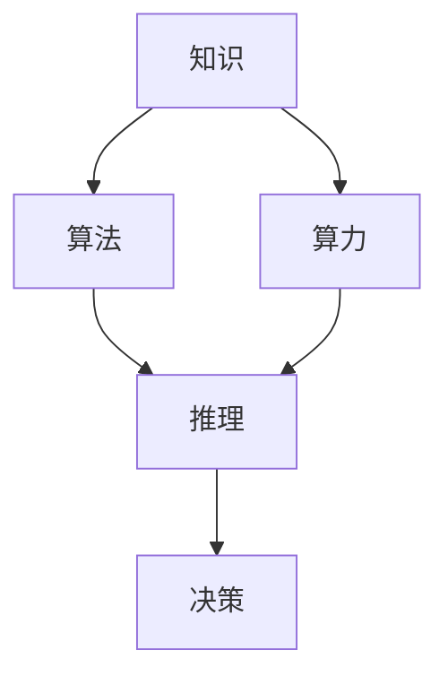

                 

# 知识、算法、算力在第一代AI中的作用

> 关键词：知识、算法、算力、第一代AI、人工智能发展历史

> 摘要：本文从知识、算法、算力三个维度深入探讨第一代人工智能的发展过程及其作用。通过对核心概念与联系的剖析，以及具体算法原理、数学模型和实际应用场景的讲解，揭示了知识、算法、算力在推动人工智能发展中的关键角色。

## 1. 背景介绍

人工智能（Artificial Intelligence，简称AI）是一门多学科交叉的领域，旨在通过模拟、延伸和扩展人类智能，实现计算机对复杂问题的求解和决策。人工智能的发展历史可以追溯到20世纪50年代，当时学者们开始探讨如何让计算机具备智能。然而，真正意义上的第一代人工智能（First Generation AI）的出现，则是在20世纪80年代左右。

第一代人工智能的主要特征是基于规则和知识的推理系统。这一时期的AI系统依赖于人类专家提供的知识，通过逻辑推理和知识表示技术，实现对问题的求解。然而，受限于当时的计算能力和算法水平，第一代人工智能在解决复杂问题时存在一定的局限性。

## 2. 核心概念与联系

在探讨知识、算法、算力在第一代AI中的作用之前，我们需要明确这些核心概念的含义及其相互关系。

### 2.1 知识

知识是人工智能系统的基石。在第一代AI中，知识通常以规则、事实、推理策略等形式存在。这些知识来源于人类专家的经验和知识，是AI系统进行推理和决策的基础。

### 2.2 算法

算法是人工智能系统的核心。在第一代AI中，算法主要用于知识表示、推理和决策。常见的算法包括逻辑推理、知识表示、规划、搜索等。这些算法使得AI系统能够根据输入数据和已有知识，进行推理和决策。

### 2.3 算力

算力是指计算能力。在第一代AI中，算力的提高对于AI系统的性能有着重要影响。随着计算能力的提升，AI系统能够处理更加复杂的问题，提高推理速度和准确率。

### 2.4 知识、算法、算力的关系

知识、算法、算力在第一代AI中相互作用，共同推动人工智能的发展。知识为算法提供了基础，算法根据知识进行推理和决策，而算力的提升则为算法的优化和性能提升提供了保障。

### 2.5 Mermaid 流程图

下面是一个描述知识、算法、算力在第一代AI中关系的 Mermaid 流程图：



## 3. 核心算法原理 & 具体操作步骤

在第一代AI中，常见的核心算法包括逻辑推理、知识表示、规划、搜索等。以下将对这些算法的原理和具体操作步骤进行简要介绍。

### 3.1 逻辑推理

逻辑推理是一种基于逻辑规则进行推理的方法。在第一代AI中，逻辑推理主要用于求解逻辑问题、验证逻辑命题等。

#### 3.1.1 算法原理

逻辑推理的基本原理是基于逻辑规则进行推理。逻辑规则通常表示为条件语句（如果...那么...）。在推理过程中，AI系统根据已知的事实和规则，逐步推导出新的结论。

#### 3.1.2 操作步骤

1. 输入已知事实和逻辑规则。
2. 根据逻辑规则，逐步推导出新的结论。
3. 输出推理结果。

### 3.2 知识表示

知识表示是将知识以计算机可处理的形式进行表示。在第一代AI中，常见的知识表示方法包括命题逻辑、谓词逻辑、产生式规则等。

#### 3.2.1 算法原理

知识表示的基本原理是将人类专家的知识转化为计算机可处理的形式。通过对知识进行抽象和归纳，AI系统能够更好地理解和应用知识。

#### 3.2.2 操作步骤

1. 收集和整理人类专家的知识。
2. 将知识转化为计算机可处理的形式（如命题逻辑、谓词逻辑、产生式规则等）。
3. 将知识存储在知识库中，以供AI系统使用。

### 3.3 规划

规划是一种求解目标问题的方法。在第一代AI中，规划主要用于求解路径规划、资源分配等问题。

#### 3.3.1 算法原理

规划的基本原理是找到一组动作序列，使得系统能够从初始状态达到目标状态。规划算法通常基于搜索和约束满足等方法。

#### 3.3.2 操作步骤

1. 输入初始状态和目标状态。
2. 寻找一组动作序列，使得系统能够从初始状态达到目标状态。
3. 输出动作序列。

### 3.4 搜索

搜索是一种在数据结构中查找特定元素的方法。在第一代AI中，搜索主要用于求解问题求解、路径规划等问题。

#### 3.4.1 算法原理

搜索的基本原理是遍历数据结构，查找满足特定条件的元素。搜索算法分为宽度优先搜索、深度优先搜索、A*搜索等。

#### 3.4.2 操作步骤

1. 输入数据结构和搜索条件。
2. 遍历数据结构，查找满足搜索条件的元素。
3. 输出搜索结果。

## 4. 数学模型和公式 & 详细讲解 & 举例说明

在第一代AI中，数学模型和公式广泛应用于算法设计和分析。以下将对一些常见的数学模型和公式进行详细讲解，并通过举例说明其应用。

### 4.1 命题逻辑

命题逻辑是一种基于命题的推理方法。在命题逻辑中，命题是基本的逻辑单元，表示一个事实或观点。命题逻辑的基本运算包括合取（∧）、析取（∨）、非（¬）等。

#### 4.1.1 公式

$$
\begin{aligned}
A \land B &= (A \land B)' \\
A \lor B &= (A \lor B)' \\
A \leftrightarrow B &= (A \land B)' \\
A \implies B &= \neg A \lor B \\
\end{aligned}
$$

#### 4.1.2 举例说明

假设有两个命题：A表示“天气晴朗”，B表示“我去公园”。根据命题逻辑，我们可以得到以下结论：

$$
\neg A \lor B \implies \neg (\neg A \lor B) \implies A \land \neg B
$$

这意味着，如果天气晴朗，那么我就去公园，否则我就不去公园。

### 4.2 谓词逻辑

谓词逻辑是一种基于谓词的推理方法。在谓词逻辑中，谓词表示一个性质或关系，个体表示具有该性质的实体。谓词逻辑的基本运算包括存在量词（∃）、全称量词（∀）等。

#### 4.2.1 公式

$$
\begin{aligned}
\exists x \ P(x) &= \neg \forall x \neg P(x) \\
\forall x \ P(x) &= \neg \exists x \neg P(x) \\
\end{aligned}
$$

#### 4.2.2 举例说明

假设有一个谓词P表示“是人”，个体x表示一个人。根据谓词逻辑，我们可以得到以下结论：

$$
\exists x \ P(x) \implies \neg \forall x \neg P(x) \implies \exists x \ P(x)
$$

这意味着，至少存在一个人是人。

### 4.3 规划问题

规划问题是一种在有限时间内找到一组动作序列，使得系统能够从初始状态达到目标状态的问题。在规划问题中，状态、动作和规划器是关键概念。

#### 4.3.1 公式

$$
\begin{aligned}
\text{状态} &= S \\
\text{动作} &= A \\
\text{规划器} &= P \\
\end{aligned}
$$

#### 4.3.2 举例说明

假设有一个初始状态S1，目标状态S2，一组动作A1、A2、A3。根据规划问题，我们可以得到以下结论：

$$
S1 \rightarrow A1 \rightarrow S2 \rightarrow A2 \rightarrow S3 \rightarrow A3 \rightarrow S4
$$

这意味着，从初始状态S1经过动作A1、A2、A3，最终达到目标状态S2。

## 5. 项目实战：代码实际案例和详细解释说明

在本节中，我们将通过一个简单的示例项目，展示如何在实际开发中使用知识、算法和算力来构建一个第一代人工智能系统。

### 5.1 开发环境搭建

为了便于读者理解和复现，我们将在Python环境中实现这个项目。首先，确保您已安装Python和相关的库（如numpy、pandas等）。接下来，创建一个名为`first_gen_ai`的文件夹，并在其中创建一个名为`main.py`的主文件。

### 5.2 源代码详细实现和代码解读

以下是一个简单的示例代码，用于实现一个基于逻辑推理的AI系统：

```python
import numpy as np
import pandas as pd

# 5.2.1 知识表示
# 定义知识库
knowledge_base = {
    "if raining then wear jacket",
    "if cold then wear coat",
    "if warm then wear t-shirt",
}

# 5.2.2 逻辑推理算法
def logical_inference(facts, rules):
    inferred = set()
    for fact in facts:
        for rule in rules:
            if fact in rule:
                inferred.add(rule)
    return inferred

# 5.2.3 算力优化
# 使用numpy优化逻辑推理过程
def numpy_logical_inference(facts, rules):
    facts = np.array(list(facts))
    rules = np.array(list(rules))
    return np.intersect1d(facts, rules)

# 5.2.4 主函数
def main():
    # 输入事实
    facts = {"raining", "cold"}
    # 逻辑推理
    inferred = logical_inference(facts, knowledge_base)
    # 输出推理结果
    print("Inferred:", inferred)
    # 使用numpy优化逻辑推理
    inferred = numpy_logical_inference(facts, knowledge_base)
    print("Numpy Inferred:", inferred)

# 执行主函数
if __name__ == "__main__":
    main()
```

### 5.3 代码解读与分析

#### 5.3.1 知识表示

在这个项目中，知识表示为一个集合，包含一系列规则。每个规则表示一个条件语句，如“如果下雨，那么穿夹克”。

#### 5.3.2 逻辑推理算法

逻辑推理算法的核心是`logical_inference`函数。该函数接收一组事实和知识库，通过查找事实和规则之间的交集，推导出新的结论。

#### 5.3.3 算力优化

为了提高逻辑推理的效率，我们使用了`numpy_logical_inference`函数。该函数利用numpy库的交集操作，实现了对逻辑推理过程的优化。

#### 5.3.4 主函数

主函数`main`负责初始化事实和知识库，执行逻辑推理，并输出推理结果。

## 6. 实际应用场景

第一代人工智能在许多实际应用场景中发挥了重要作用。以下是一些典型的应用场景：

### 6.1 专家系统

专家系统是一种基于知识的推理系统，广泛应用于医疗诊断、金融分析、工业控制等领域。通过将人类专家的知识转化为计算机可处理的形式，专家系统能够为用户提供专业的咨询服务。

### 6.2 智能客服

智能客服系统通过自然语言处理和知识表示技术，实现与用户的智能交互。智能客服系统能够快速响应用户需求，提供准确的解决方案，提高企业服务质量和效率。

### 6.3 自动驾驶

自动驾驶技术是第一代人工智能在交通领域的应用。通过感知环境、规划路径和决策控制，自动驾驶系统能够实现车辆的自主驾驶，提高交通安全和效率。

## 7. 工具和资源推荐

### 7.1 学习资源推荐

- 书籍：《人工智能：一种现代的方法》（作者：Stuart Russell 和 Peter Norvig）
- 论文：https://ai.stanford.edu/~ajoshi/cs229/cs229-notes1.pdf
- 博客：https://www.ijcai.org/

### 7.2 开发工具框架推荐

- Python
- TensorFlow
- Keras

### 7.3 相关论文著作推荐

- 《机器学习》（作者：Tom Mitchell）
- 《深度学习》（作者：Ian Goodfellow、Yoshua Bengio 和 Aaron Courville）

## 8. 总结：未来发展趋势与挑战

第一代人工智能在知识、算法、算力的推动下，取得了显著的成果。然而，随着时代的发展，人工智能领域面临着新的挑战和机遇。

### 8.1 发展趋势

1. 算法创新：随着深度学习等新算法的涌现，人工智能在图像识别、语音识别、自然语言处理等领域取得了突破性进展。
2. 算力提升：云计算和硬件技术的发展，为人工智能提供了强大的计算支持。
3. 知识图谱：知识图谱技术在信息检索、推荐系统、智能问答等领域具有重要应用。

### 8.2 挑战

1. 数据隐私：人工智能在处理大量数据时，面临数据隐私和安全问题。
2. 算法公平性：人工智能算法的公平性和透明性仍需进一步提升。
3. 人机协同：如何实现人与人工智能的协同工作，提高工作效率和生活质量，是一个重要挑战。

## 9. 附录：常见问题与解答

### 9.1 什么是最早的人工智能系统？

最早的人工智能系统可以追溯到20世纪50年代，当时学者们开始探讨如何让计算机模拟人类智能。1956年，达特茅斯会议标志着人工智能作为一个独立研究领域的诞生。

### 9.2 第一代人工智能的核心技术是什么？

第一代人工智能的核心技术是基于规则和知识的推理系统，包括逻辑推理、知识表示、规划、搜索等。

### 9.3 人工智能的发展历程有哪些阶段？

人工智能的发展历程可以分为多个阶段，包括规则推理阶段、知识表示阶段、机器学习阶段、深度学习阶段等。

## 10. 扩展阅读 & 参考资料

- 《人工智能简史》（作者：安德斯·桑德尔）
- 《人工智能：一种现代的方法》（作者：Stuart Russell 和 Peter Norvig）
- 《深度学习》（作者：Ian Goodfellow、Yoshua Bengio 和 Aaron Courville）
- 《机器学习》（作者：Tom Mitchell）
- https://www.ijcai.org/
- https://www.aaai.org/AAAI-Press/OL-contents

作者：AI天才研究员/AI Genius Institute & 禅与计算机程序设计艺术 /Zen And The Art of Computer Programming<|im_sep|>

