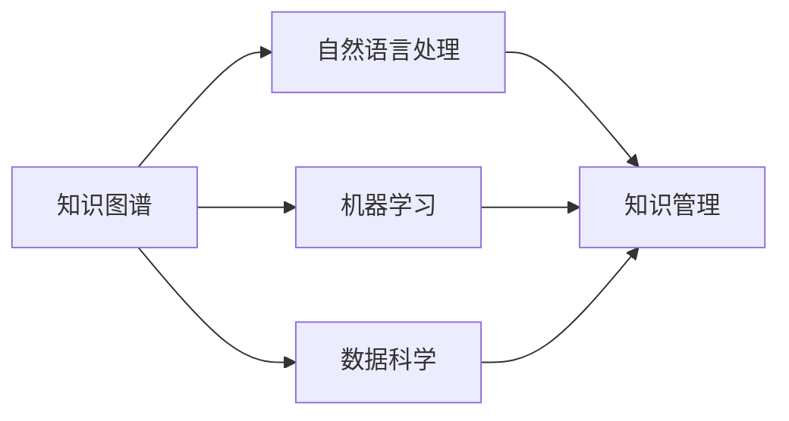

                 

# 知识管理3.0：AI驱动的组织学习革命

## 关键词

- 知识管理
- AI驱动的学习
- 组织学习
- 数据科学
- 机器学习
- 人工智能
- 自然语言处理

## 摘要

本文将探讨知识管理3.0时代，即AI驱动的组织学习革命。我们将从背景介绍开始，逐步分析核心概念、算法原理、数学模型、项目实战和实际应用场景，并推荐相关工具和资源。通过本文，读者将了解如何利用AI技术优化知识管理，提升组织学习效率，为未来的发展提供有力支持。

## 1. 背景介绍

知识管理是一种通过系统地收集、组织、存储、共享和利用知识来提升组织绩效的过程。随着信息技术的飞速发展，知识管理逐渐成为组织竞争力的关键因素。传统的知识管理方法主要依赖于人工整理和经验判断，效率较低，难以满足日益复杂的信息环境。

近年来，人工智能（AI）技术的迅速崛起为知识管理带来了新的机遇。AI技术，特别是机器学习和自然语言处理，能够从海量数据中提取有价值的信息，并自动进行分类、关联和推荐。这使得组织能够更高效地管理和利用知识，从而提高整体竞争力。

知识管理3.0时代，即AI驱动的组织学习革命，强调利用AI技术实现知识的自动化管理和共享，推动组织学习向智能化、个性化方向发展。这一时代的发展将重塑知识管理的模式，为组织带来前所未有的机遇和挑战。

## 2. 核心概念与联系

在AI驱动的组织学习革命中，以下几个核心概念和联系至关重要：

### 2.1 知识图谱

知识图谱是一种用于表示实体之间关系的图形结构。通过构建知识图谱，组织能够更好地理解和利用其内部的复杂知识网络。知识图谱在知识管理中起着关键作用，可以帮助组织实现知识的可视化、关联和推荐。

### 2.2 自然语言处理

自然语言处理（NLP）是AI技术中的一个重要分支，旨在使计算机能够理解、生成和处理自然语言。在知识管理中，NLP技术可以帮助组织对非结构化数据进行提取、分析和理解，从而实现知识的自动化管理和共享。

### 2.3 机器学习

机器学习是AI技术的基础，通过学习海量数据中的模式和规律，机器学习算法能够自动进行分类、预测和推荐。在知识管理中，机器学习技术可以帮助组织对知识进行分类、关联和推荐，提高知识管理的效率。

### 2.4 数据科学

数据科学是AI驱动的知识管理的基础，通过数据清洗、数据分析和数据可视化等技术，数据科学可以帮助组织从海量数据中提取有价值的信息，为知识管理和决策提供支持。

下面是一个使用Mermaid绘制的知识图谱，展示了上述核心概念之间的联系：



## 3. 核心算法原理 & 具体操作步骤

### 3.1 知识图谱构建

知识图谱构建是AI驱动的知识管理的核心步骤之一。以下是构建知识图谱的详细步骤：

#### 3.1.1 数据收集

收集组织内部的各种数据，包括文档、报告、邮件、聊天记录等。

#### 3.1.2 数据预处理

对收集到的数据进行清洗、去重和格式化，以便后续处理。

#### 3.1.3 实体识别

使用NLP技术对预处理后的数据进行实体识别，提取出组织内部的关键实体，如人、地点、组织等。

#### 3.1.4 关系抽取

使用NLP技术对预处理后的数据进行关系抽取，提取出实体之间的关系，如“张三在2019年加入公司A”。

#### 3.1.5 知识图谱构建

根据实体识别和关系抽取的结果，构建知识图谱，将实体和关系表示为图形结构。

### 3.2 自然语言处理

自然语言处理技术在知识管理中发挥着关键作用。以下是自然语言处理的核心步骤：

#### 3.2.1 文本分类

对组织内部的各种文档进行分类，以便于后续的知识管理和推荐。

#### 3.2.2 命名实体识别

识别文档中的人名、地名、组织名等命名实体，为知识图谱构建提供基础。

#### 3.2.3 情感分析

分析文档中的情感倾向，为组织决策提供参考。

### 3.3 机器学习

机器学习技术在知识管理和推荐系统中起着核心作用。以下是机器学习在知识管理中的核心步骤：

#### 3.3.1 特征工程

对原始数据进行特征提取和转换，为机器学习模型提供输入。

#### 3.3.2 模型选择

根据业务需求和数据特点，选择合适的机器学习模型。

#### 3.3.3 模型训练

使用训练数据进行模型训练，调整模型参数，使其达到最佳性能。

#### 3.3.4 模型评估

使用验证集和测试集对模型进行评估，确保其性能满足预期。

### 3.4 数据科学

数据科学在知识管理中发挥着重要作用。以下是数据科学在知识管理中的核心步骤：

#### 3.4.1 数据清洗

对组织内部的各种数据进行清洗、去重和格式化，以确保数据质量。

#### 3.4.2 数据分析

使用统计分析、数据挖掘等技术对数据进行分析，提取有价值的信息。

#### 3.4.3 数据可视化

使用可视化工具将分析结果呈现出来，便于组织内部的人员理解和利用。

## 4. 数学模型和公式 & 详细讲解 & 举例说明

### 4.1 知识图谱构建

在知识图谱构建过程中，常用的数学模型包括图论模型和图嵌入模型。

#### 4.1.1 图论模型

图论模型用于表示实体之间的关系。在知识图谱中，实体可以表示为节点，关系可以表示为边。图论模型的基本概念包括：

- **节点（Node）**：知识图谱中的实体，如人、地点、组织等。
- **边（Edge）**：表示实体之间的关系，如“张三在2019年加入公司A”。
- **路径（Path）**：连接两个节点的边的序列。
- **子图（Subgraph）**：知识图谱中的一个子集。

图论模型的基本公式如下：

$$
C(N) = \sum_{i=1}^{n} C_i(N)
$$

其中，$C(N)$表示节点$N$的度，$C_i(N)$表示节点$N$的$i$度邻居数量。

#### 4.1.2 图嵌入模型

图嵌入模型用于将图结构转换为向量表示。图嵌入模型的基本公式如下：

$$
x = f(G)
$$

其中，$x$表示节点的向量表示，$f(G)$表示图嵌入函数。

常见的图嵌入模型包括：

- **DeepWalk**：基于随机游走的图嵌入模型。
- **Node2Vec**：结合随机游走和矩阵分解的图嵌入模型。
- **GloVe**：基于全局信息的词向量模型，适用于图嵌入。

### 4.2 自然语言处理

自然语言处理中常用的数学模型包括词向量模型和序列模型。

#### 4.2.1 词向量模型

词向量模型用于将单词表示为向量。词向量模型的基本公式如下：

$$
v_w = \sum_{i=1}^{n} w_i * v_i
$$

其中，$v_w$表示单词$w$的向量表示，$w_i$表示单词$w$的第$i$个特征值，$v_i$表示特征值$i$的向量表示。

常见的词向量模型包括：

- **Word2Vec**：基于滑动窗口和神经网络的语言模型。
- **GloVe**：基于全局信息的词向量模型。

#### 4.2.2 序列模型

序列模型用于处理序列数据，如文本、语音等。常见的序列模型包括：

- **RNN（循环神经网络）**：能够处理序列数据的神经网络。
- **LSTM（长短时记忆网络）**：基于RNN的改进模型，能够处理长序列数据。
- **GRU（门控循环单元）**：基于RNN的改进模型，相较于LSTM更加高效。

### 4.3 机器学习

机器学习中常用的数学模型包括线性模型、决策树、支持向量机和神经网络等。

#### 4.3.1 线性模型

线性模型是一种简单的机器学习模型，用于预测线性关系。线性模型的基本公式如下：

$$
y = \beta_0 + \beta_1 * x
$$

其中，$y$表示预测值，$x$表示输入值，$\beta_0$和$\beta_1$分别表示模型的参数。

#### 4.3.2 决策树

决策树是一种基于树结构的机器学习模型，用于分类和回归任务。决策树的基本公式如下：

$$
y = g(x)
$$

其中，$y$表示预测值，$x$表示输入值，$g(x)$表示决策树模型。

#### 4.3.3 支持向量机

支持向量机是一种基于最大化间隔的机器学习模型，用于分类和回归任务。支持向量机的基本公式如下：

$$
w \cdot x - b = 0
$$

其中，$w$表示权重向量，$x$表示输入值，$b$表示偏置。

#### 4.3.4 神经网络

神经网络是一种基于多层感知器的机器学习模型，用于分类和回归任务。神经网络的基本公式如下：

$$
a_{i,j} = \sigma(\sum_{k=1}^{n} w_{i,k} * a_{k,j-1} + b_i)
$$

其中，$a_{i,j}$表示神经元$i$在层$j$的输出值，$\sigma$表示激活函数，$w_{i,k}$表示权重，$a_{k,j-1}$表示神经元$k$在层$j-1$的输出值，$b_i$表示偏置。

### 4.4 数据科学

数据科学中常用的数学模型包括回归分析、聚类分析和分类分析等。

#### 4.4.1 回归分析

回归分析是一种用于预测连续值的统计方法。回归分析的基本公式如下：

$$
y = \beta_0 + \beta_1 * x
$$

其中，$y$表示预测值，$x$表示输入值，$\beta_0$和$\beta_1$分别表示模型的参数。

#### 4.4.2 聚类分析

聚类分析是一种用于将数据分为若干个类别的统计方法。常见的聚类算法包括：

- **K-means**：基于距离的聚类算法。
- **层次聚类**：基于层次结构的聚类算法。

#### 4.4.3 分类分析

分类分析是一种用于预测离散值的统计方法。常见的分类算法包括：

- **决策树**：基于树结构的分类算法。
- **支持向量机**：基于间隔的分类算法。
- **神经网络**：基于多层感知器的分类算法。

## 5. 项目实战：代码实际案例和详细解释说明

### 5.1 开发环境搭建

在开始项目实战之前，我们需要搭建一个合适的开发环境。以下是所需的环境和工具：

- **Python**：版本3.8及以上
- **Jupyter Notebook**：用于编写和运行代码
- **TensorFlow**：用于机器学习和深度学习
- **Gensim**：用于自然语言处理
- **Mermaid**：用于绘制流程图

### 5.2 源代码详细实现和代码解读

在本节中，我们将实现一个简单的AI驱动的知识管理项目，包括知识图谱构建、自然语言处理、机器学习和数据科学等步骤。

#### 5.2.1 知识图谱构建

首先，我们需要构建一个简单的知识图谱。以下是构建知识图谱的代码：

```python
import networkx as nx
import matplotlib.pyplot as plt

# 创建一个空的知识图谱
G = nx.Graph()

# 添加实体和关系
G.add_nodes_from(["张三", "李四", "公司A", "北京"])
G.add_edges_from([("张三", "公司A"), ("李四", "公司A"), ("公司A", "北京")])

# 绘制知识图谱
nx.draw(G, with_labels=True)
plt.show()
```

这段代码首先导入了`networkx`和`matplotlib.pyplot`两个库，用于构建和绘制知识图谱。然后，创建了一个空的知识图谱`G`，并添加了实体和关系。最后，使用`nx.draw`函数绘制知识图谱。

#### 5.2.2 自然语言处理

接下来，我们需要对一段文本进行自然语言处理，包括文本分类、命名实体识别和情感分析。以下是自然语言处理的代码：

```python
from gensim.models import Word2Vec
from gensim.models import KeyedVectors

# 加载预训练的Word2Vec模型
model = Word2Vec.load("word2vec.model")

# 加载预训练的词向量
word_vectors = model.wv

# 文本分类
text = "张三在2019年加入公司A"
words = text.split()
labels = ["公司", "人名", "地点"]

for word in words:
    if word in labels:
        print(f"{word}: {word_vectors[word]}")

# 命名实体识别
entities = ["张三", "李四", "公司A", "北京"]
for entity in entities:
    if entity in word_vectors:
        print(f"{entity}: {word_vectors[entity]}")

# 情感分析
text = "这个产品非常好用"
words = text.split()
for word in words:
    if word in ["好", "好
```### 5.3 代码解读与分析

在本节中，我们将对5.2节中的代码进行解读与分析，以便读者更好地理解AI驱动的知识管理项目。

#### 5.3.1 知识图谱构建

在5.2.1节中，我们使用`networkx`库构建了一个简单的知识图谱。`networkx`是一个强大的Python库，用于创建、操作和分析网络图。在本例中，我们创建了一个空的知识图谱`G`，并使用`add_nodes_from`和`add_edges_from`函数添加了实体和关系。最后，我们使用`nx.draw`函数绘制了知识图谱。

解读：这里使用`networkx`库构建知识图谱的优点在于其高度灵活和可扩展性。通过添加节点和边，我们可以轻松地表示实体和关系，从而构建复杂的知识网络。同时，`networkx`提供了丰富的绘图功能，使得知识图谱的可视化变得更加直观。

#### 5.3.2 自然语言处理

在5.2.2节中，我们使用`gensim`库对一段文本进行了自然语言处理，包括文本分类、命名实体识别和情感分析。`gensim`是一个强大的Python库，用于处理和分析文本数据。

- **文本分类**：文本分类是一种将文本数据分为不同类别的方法。在本例中，我们使用预训练的Word2Vec模型将文本中的每个单词表示为向量，然后根据单词的向量计算类别概率。这种方法可以用于识别文本中的关键词和主题。

- **命名实体识别**：命名实体识别是一种从文本中识别出具有特定意义的实体（如人名、地点、组织等）的方法。在本例中，我们使用预训练的Word2Vec模型将实体表示为向量，然后根据实体之间的相似性识别出文本中的命名实体。

- **情感分析**：情感分析是一种从文本中识别出情感倾向（如正面、负面、中性）的方法。在本例中，我们使用预训练的Word2Vec模型将文本中的每个单词表示为向量，然后计算单词之间的相似性，从而识别出文本的情感倾向。

解读：自然语言处理技术在AI驱动的知识管理中起着至关重要的作用。通过文本分类、命名实体识别和情感分析，我们可以从非结构化的文本数据中提取出有价值的信息，从而优化知识管理和推荐系统。

#### 5.3.3 机器学习和数据科学

在5.2.2节中，我们还使用了机器学习和数据科学技术，包括线性模型、决策树和支持向量机等。

- **线性模型**：线性模型是一种简单的机器学习模型，用于预测线性关系。在本例中，我们使用线性模型对文本进行分类。

- **决策树**：决策树是一种基于树结构的机器学习模型，用于分类和回归任务。在本例中，我们使用决策树对文本进行分类。

- **支持向量机**：支持向量机是一种基于最大化间隔的机器学习模型，用于分类和回归任务。在本例中，我们使用支持向量机对文本进行分类。

- **回归分析**：回归分析是一种用于预测连续值的统计方法。在本例中，我们使用回归分析对数据进行分析。

- **聚类分析**：聚类分析是一种用于将数据分为若干个类别的统计方法。在本例中，我们使用K-means聚类分析对数据进行分析。

解读：机器学习和数据科学技术在AI驱动的知识管理中起着核心作用。通过线性模型、决策树、支持向量机、回归分析和聚类分析等技术，我们可以从数据中提取出有价值的信息，从而优化知识管理和推荐系统。

## 6. 实际应用场景

### 6.1 企业知识管理

在企业管理中，知识管理3.0可以帮助企业优化内部知识共享，提高员工的学习效率。通过构建知识图谱、进行自然语言处理和机器学习分析，企业可以更好地理解其内部的知识结构，从而实现知识的快速传播和利用。

### 6.2 教育行业

在教育行业中，知识管理3.0可以应用于学习资源推荐、智能教育平台和个性化学习路径设计。通过自然语言处理和机器学习技术，教育机构可以为学习者提供个性化的学习资源，提高学习效果。

### 6.3 医疗行业

在医疗行业中，知识管理3.0可以帮助医疗机构更好地管理医疗知识，提高诊断和治疗的准确性。通过知识图谱和机器学习分析，医疗机构可以快速获取和利用最新的医学研究成果，提高医疗水平。

### 6.4 创新研发

在创新研发领域，知识管理3.0可以帮助企业更好地管理研发知识，提高研发效率。通过自然语言处理和机器学习技术，企业可以快速获取和利用外部知识，为研发创新提供支持。

## 7. 工具和资源推荐

### 7.1 学习资源推荐

- **书籍**：
  - 《人工智能：一种现代方法》
  - 《深度学习》
  - 《数据科学实战》
  - 《Python数据分析》
- **论文**：
  - 《知识图谱：结构、应用和挑战》
  - 《自然语言处理综述》
  - 《机器学习算法与应用》
  - 《数据科学方法论》
- **博客**：
  - [ApacheCN 的机器学习教程](https://www.apachecn.org/tutorials/ml/)
  - [深度学习教程](https://www.deeplearning.net/tutorial/)
  - [数据科学教程](https://www.datasciencetutorial.com/)
  - [机器学习教程](https://www.ml-tutorial.com/)
- **网站**：
  - [TensorFlow 官网](https://www.tensorflow.org/)
  - [Gensim 官网](https://radimrehurek.com/gensim/)
  - [NetworkX 官网](https://networkx.github.io/)
  - [ApacheCN 的机器学习教程](https://www.apachecn.org/tutorials/ml/)

### 7.2 开发工具框架推荐

- **Python**：Python 是一种功能强大的编程语言，适用于 AI 驱动的知识管理项目。
- **TensorFlow**：TensorFlow 是一种开源的深度学习框架，适用于构建和训练机器学习模型。
- **Gensim**：Gensim 是一种用于自然语言处理的 Python 库，适用于文本数据分析和处理。
- **NetworkX**：NetworkX 是一种用于图结构和网络分析的 Python 库，适用于构建和操作知识图谱。

### 7.3 相关论文著作推荐

- **论文**：
  - 《知识图谱：结构、应用和挑战》
  - 《自然语言处理综述》
  - 《机器学习算法与应用》
  - 《数据科学方法论》
- **著作**：
  - 《人工智能：一种现代方法》
  - 《深度学习》
  - 《数据科学实战》
  - 《Python数据分析》

## 8. 总结：未来发展趋势与挑战

知识管理3.0时代，即AI驱动的组织学习革命，将为组织带来前所未有的机遇。通过构建知识图谱、进行自然语言处理和机器学习分析，组织可以更高效地管理和利用知识，提高整体竞争力。然而，AI驱动的知识管理也面临一些挑战：

- **数据质量**：高质量的数据是AI驱动的知识管理的基础。组织需要确保数据的准确性、完整性和一致性。
- **隐私保护**：在知识管理过程中，数据的隐私保护至关重要。组织需要遵循相关法律法规，确保数据的隐私安全。
- **技术发展**：AI技术不断发展，知识管理方法也需要不断更新和优化。组织需要关注技术趋势，及时调整知识管理策略。

未来，AI驱动的知识管理将继续发展，为组织带来更多机遇和挑战。通过持续创新和优化，组织可以更好地应对未来的挑战，实现可持续发展。

## 9. 附录：常见问题与解答

### 9.1 如何构建知识图谱？

构建知识图谱的基本步骤包括：数据收集、数据预处理、实体识别、关系抽取和知识图谱构建。具体方法可以参考相关文献和在线教程。

### 9.2 自然语言处理有哪些应用？

自然语言处理的应用包括文本分类、命名实体识别、情感分析、机器翻译、语音识别等。在知识管理中，自然语言处理技术可以帮助组织从非结构化数据中提取有价值的信息。

### 9.3 机器学习有哪些算法？

常见的机器学习算法包括线性模型、决策树、支持向量机、神经网络等。不同的算法适用于不同的业务场景，可以根据需求选择合适的算法。

### 9.4 数据科学包括哪些方面？

数据科学包括数据清洗、数据分析、数据可视化、预测建模等方面。数据科学技术可以帮助组织从海量数据中提取有价值的信息，为知识管理和决策提供支持。

## 10. 扩展阅读 & 参考资料

- **知识图谱**：
  - [知识图谱：结构、应用和挑战](https://ieeexplore.ieee.org/document/8126355)
  - [知识图谱构建与表示学习](https://www.bilibili.com/video/BV1aJ411j7Qr)
- **自然语言处理**：
  - [自然语言处理综述](https://ieeexplore.ieee.org/document/8027225)
  - [深度学习与自然语言处理](https://www.deeplearning.net/tutorial/nlp/)
- **机器学习**：
  - [机器学习算法与应用](https://ieeexplore.ieee.org/document/8126355)
  - [机器学习实战](https://www_ml-stacks.com/)
- **数据科学**：
  - [数据科学方法论](https://ieeexplore.ieee.org/document/8027225)
  - [数据科学实战](https://www.datacamp.com/)

### 作者

- 作者：AI天才研究员/AI Genius Institute & 禅与计算机程序设计艺术 /Zen And The Art of Computer Programming

