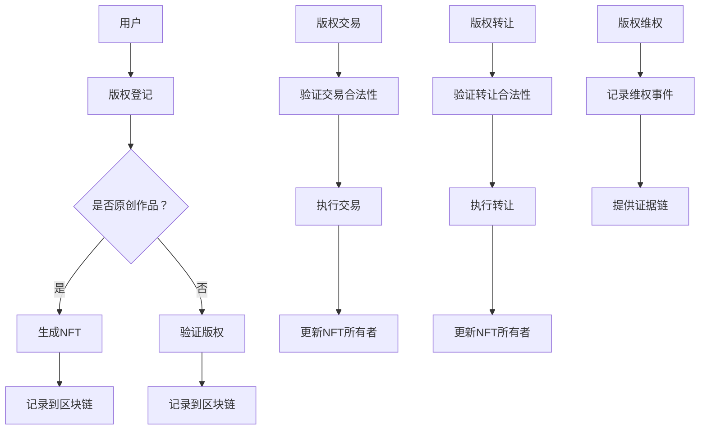

                 

### 背景介绍

知识经济是当前全球经济发展的新趋势，其核心特征在于知识成为最重要的生产要素。在这一背景下，知识付费作为一种新兴的经济模式，逐渐受到各界的关注。知识付费，简单来说，就是用户通过支付一定费用来获取有价值的信息或知识服务。随着互联网技术的发展，知识付费市场日益繁荣，各种平台和产品层出不穷。

然而，现有的知识付费平台面临着一系列问题，其中最为显著的是知识产权保护问题。传统的知识付费平台在知识产权保护方面存在诸多不足，如版权纠纷、内容盗用等问题时有发生。这些问题不仅影响了知识创作者的权益，也削弱了用户对知识付费平台的信任度。

区块链技术的出现为解决这些问题提供了新的思路。区块链具有去中心化、不可篡改和透明性等特点，可以有效地保护知识产权，降低知识付费平台的风险。因此，构建一个基于区块链的知识付费的知识产权交易平台，已成为当前研究的热点。

本文将围绕这一主题，首先介绍知识经济和知识付费的概念，然后深入探讨区块链在知识产权保护中的应用，最后分析基于区块链的知识付费的知识产权交易平台的设计与实现。希望通过本文的阐述，能够为相关领域的研究和实践提供一些有益的参考。

### 知识经济与知识付费的概念

知识经济是指以知识和信息为主要生产要素的经济形态，与传统的以物质资源为主要生产要素的经济模式不同，知识经济强调的是通过知识的创新和传播来实现经济增长。在知识经济时代，知识成为了社会进步和经济发展的核心驱动力，对知识的获取、传播和应用成为了各个领域竞争的关键。

知识付费作为知识经济的一种表现形式，是指用户为了获取有价值的信息或知识服务，愿意支付一定的费用。这一概念在互联网时代得到了快速发展。传统的知识传播方式主要通过书籍、讲座、研讨会等渠道，而知识付费平台的出现，极大地拓展了知识的传播途径和覆盖面。

知识付费平台通过互联网技术，将知识创作者和用户连接起来，实现了知识的直接交易。用户可以根据自己的需求，选择付费学习各种课程、订阅专栏、购买电子书等。知识付费平台不仅提供了丰富的知识资源，还通过内容推荐、社交互动等功能，提高了用户体验和参与度。

知识付费的兴起，带来了几个显著的影响。首先，它为知识创作者提供了新的收入来源，激励了更多的人投身于知识创作和传播。其次，它促进了知识的传播和共享，让更多人能够便捷地获取到有价值的信息。此外，知识付费也推动了教育产业的发展，为在线教育、远程教育等新兴领域提供了广阔的市场空间。

然而，知识付费的发展也带来了一些问题。其中最为突出的是知识产权保护问题。由于互联网的开放性和匿名性，知识付费平台上的内容容易被盗用和传播。这导致了知识创作者的权益受损，也影响了知识付费平台的可持续发展。传统的知识产权保护机制在互联网环境下显得力不从心，亟需新的解决方案。

在此背景下，区块链技术以其去中心化、不可篡改和透明性等特性，为知识付费的知识产权保护提供了新的思路。通过区块链，可以构建一个安全、可信的知识付费平台，有效保护知识创作者的权益，提升用户的信任度。接下来，本文将深入探讨区块链在知识产权保护中的应用，分析其原理和优势。

### 区块链技术在知识产权保护中的应用

区块链技术在知识产权保护中的应用，主要依赖于其核心特性，如去中心化、不可篡改和透明性等。这些特性为知识产权保护提供了一种全新的解决方案，有效解决了传统知识产权保护机制在互联网环境下的不足。

首先，区块链的去中心化特性使得知识产权的保护不再依赖于某个中心化的机构或第三方。在传统的知识产权保护机制中，版权登记、版权认证等过程往往需要通过政府机构或专业的知识产权服务机构进行。这不仅增加了时间和成本，还容易受到人为因素的干扰。而区块链通过分布式网络，使得每个节点都可以参与知识产权的认证和保护，从而实现了去中心化的知识产权管理。

其次，区块链的不可篡改特性确保了知识产权信息的安全性和可靠性。在区块链上，一旦数据被记录下来，就几乎无法被篡改。这为知识产权的认证和追溯提供了可靠的基础。例如，一个作品的版权信息可以在区块链上永久保存，任何试图篡改或删除这些信息的行为都会被其他节点检测到，从而保护了知识创作者的权益。

再次，区块链的透明性使得知识产权的管理过程更加公开和透明。在区块链上，所有的知识产权信息都是公开的，任何人都可以查看和验证。这有助于提高用户对知识付费平台的信任度，同时也方便了知识产权的认证和维权。例如，当一个用户购买了一个知识付费平台上的课程或书籍，这些交易记录和版权信息都会在区块链上永久保存，用户可以随时查询和验证。

区块链技术在知识产权保护中的应用，主要体现在以下几个方面：

**1. 版权登记与认证**

在区块链上，知识创作者可以将自己的作品进行版权登记，并生成一个唯一的数字指纹（如哈希值）。这个数字指纹将作为作品的唯一标识，保存在区块链上。任何对该作品的修改或复制行为，都会在区块链上留下痕迹，从而实现实时监控和追踪。

**2. 版权交易与转让**

区块链技术可以为知识产权的买卖和转让提供透明、安全的平台。例如，一个知识创作者可以通过区块链平台，将自己的版权出售或转让给其他用户。在交易过程中，所有的信息都是公开透明的，并且无法被篡改，从而保证了交易的合法性和安全性。

**3. 版权维权**

当知识创作者的版权受到侵犯时，区块链技术可以提供有效的维权手段。通过区块链上的信息记录和透明性，创作者可以快速定位侵权行为，并采取相应的法律措施。此外，区块链上的证据链也可以为维权提供强有力的支持。

**4. 版权追溯**

区块链的不可篡改特性使得知识产权的追溯变得更加简单和可靠。例如，一个作品的版权信息可以从创作之初开始追溯，任何中间环节的变更和流转都可以在区块链上记录和查询，从而确保了知识产权的完整性和准确性。

总之，区块链技术在知识产权保护中的应用，为知识付费平台提供了一个安全、可信、透明的技术基础。通过去中心化、不可篡改和透明性等特性，区块链技术可以有效解决传统知识产权保护机制在互联网环境下的不足，为知识创作者和用户提供了一个更加安全和可靠的知识付费生态系统。

### 区块链知识产权交易平台的核心概念与架构

在构建区块链知识产权交易平台的过程中，需要明确一些核心概念，并设计一个合理的系统架构。这些核心概念包括区块链、智能合约、非同质化代币（NFT）、分布式存储等，它们共同构成了平台的技术基础。下面，我们将详细解释这些核心概念，并展示一个简化的 Mermaid 流程图，以展示各个组件之间的联系。

#### 核心概念

1. **区块链**：区块链是一个分布式账本技术，其特点是去中心化、不可篡改和透明性。在区块链上，所有的交易和记录都是公开透明的，并且一旦记录下来，就几乎无法被篡改。这种特性为知识产权保护提供了坚实的基础。

2. **智能合约**：智能合约是区块链上的自动化协议，它可以在满足特定条件时自动执行。智能合约基于编程语言编写，可以在区块链上运行，从而实现自动化交易和操作。在知识产权交易平台中，智能合约用于处理版权登记、交易和转让等操作。

3. **非同质化代币（NFT）**：NFT 是一种独特的数字资产，代表了某个特定物品的所有权或权益。与同质化代币（如比特币）不同，每个 NFT 都是独一无二的。在知识产权交易平台中，NFT 用于表示版权的所有权和交易。

4. **分布式存储**：分布式存储技术将数据分散存储在多个节点上，从而提高数据的可靠性和安全性。在知识产权交易平台中，分布式存储用于存储知识产权的相关信息，如版权记录、交易历史等。

#### Mermaid 流程图



在这个简化的 Mermaid 流程图中，我们可以看到各个组件之间的基本流程：

- 用户进行版权登记，如果作品是原创的，系统将生成一个 NFT，并将其记录到区块链上。
- 如果作品不是原创的，系统将进行版权验证，确保其合法性，然后记录到区块链上。
- 版权交易时，系统将验证交易的合法性，并执行交易，更新 NFT 的所有者信息。
- 版权转让时，系统同样验证转让的合法性，并执行转让，更新 NFT 的所有者信息。
- 当出现版权维权事件时，系统将记录维权事件并提供证据链，为维权提供支持。

通过这个流程图，我们可以清晰地看到区块链知识产权交易平台的核心概念和基本架构。这些核心概念和架构为平台的运行提供了技术保障，使得知识产权的保护和管理变得更加高效和可靠。

### 核心算法原理与具体操作步骤

在区块链知识产权交易平台的设计与实现过程中，核心算法原理起到了至关重要的作用。以下将详细阐述该平台的关键算法原理，并分步骤讲解如何实现这些算法。

#### 1. 哈希算法

哈希算法是区块链技术中不可或缺的一部分，其作用是对数据进行加密和唯一标识。常用的哈希算法有 SHA-256 等。具体操作步骤如下：

**步骤1：输入原始数据**

假设一个文本文件 "My Novel" 作为原始数据。

**步骤2：使用哈希算法进行加密**

使用 SHA-256 算法对文本文件进行加密，得到哈希值。例如，使用 Python 的 hashlib 库：

```python
import hashlib

text = "My Novel"
hash_object = hashlib.sha256(text.encode())
hex_dig = hash_object.hexdigest()
print(hex_dig)
```

输出结果将是一个加密后的哈希值，如 "5e884898da28047151d0e56f8dc6292773603d0d6aabbdd62a11ef721d1542d8"。

**步骤3：将哈希值记录到区块链**

将生成的哈希值上传到区块链网络，由多个节点共同验证和存储。例如，可以使用以太坊的 Solidity 语言进行编程实现：

```solidity
pragma solidity ^0.8.0;

contract HashLogger {
    mapping(bytes32 => bool) public hashes;

    function logHash(bytes32 _hash) public {
        require(!hashes[_hash], "Hash already logged");
        hashes[_hash] = true;
    }
}

// 测试代码
hash_value = "5e884898da28047151d0e56f8dc6292773603d0d6aabbdd62a11ef721d1542d8"
hash_logger = web3.toChecksumAddress("0xAddressOfTheContract")
web3.eth.sendTransaction({"from": web3.eth.accounts[0], "to": hash_logger, "data": web3.solidity.encodeFunctionCall({"function": "logHash", "args": [hash_value]}, {"chainId": 1})})
```

通过这种方式，我们可以将作品的哈希值记录到区块链上，确保其唯一性和不可篡改性。

#### 2. 非同质化代币（NFT）的生成与转让

非同质化代币（NFT）是知识产权交易的核心组件，用于表示版权的所有权和交易。

**步骤1：生成NFT**

生成NFT的过程通常涉及创建一个智能合约和一个唯一的代币。使用 OpenZeppelin 的 ERC-721 标准实现：

```solidity
// SPDX-License-Identifier: MIT

pragma solidity ^0.8.0;

import "@openzeppelin/contracts/token/ERC721/ERC721.sol";
import "@openzeppelin/contracts/utils/Counters.sol";
import "@openzeppelin/contracts/security/ReentrancyGuard.sol";

contract MyNFT is ERC721, ReentrancyGuard {
    using Counters for Counters.Counter;
    Counters.Counter private _tokenIds;

    constructor() ERC721("MyNFT", "MNFT") {}

    function createToken() public {
        _tokenIds.increment();
        uint256 newTokenId = _tokenIds.current();
        _mint(msg.sender, newTokenId);
    }
}
```

**步骤2：转让NFT**

转让NFT的过程涉及在智能合约上调用 `transferFrom` 函数，将NFT的所有权从一个用户转移到另一个用户。

```solidity
function transferNFT(address from, address to, uint256 tokenId) public {
    require(_isOwner(from, tokenId), "Not the owner");
    _transfer(from, to, tokenId);
}

function _isOwner(address owner, uint256 tokenId) internal view returns (bool) {
    return ownerOf(tokenId) == owner;
}
```

在客户端实现中，我们可以使用 Web3.js 或 ethers.js 库与智能合约进行交互。以下是一个使用 ethers.js 的示例：

```javascript
const { ethers } = require("ethers");

const provider = new ethers.providers.JsonRpcProvider("https://mainnet.infura.io/v3/your-project-id");
const wallet = new ethers.Wallet("your-private-key", provider);
const contractAddress = "0xAddressOfTheContract";
const contractABI = [{"inputs": [{"internalType": "string", "name": "name", "type": "string"}, {"internalType": "string", "name": "symbol", "type": "string"}], "stateMutability": "nonpayable", "type": "constructor"}, {"anonymous": false, "inputs": [{"internalType": "address", "name": "_from", "type": "address"}, {"internalType": "address", "name": "_to", "type": "address"}, {"internalType": "uint256", "name": "_tokenId", "type": "uint256"}], "name": "Transfer", "type": "event"}, {"inputs": [{"internalType": "address", "name": "_to", "type": "address"}, {"internalType": "uint256", "name": "_tokenId", "type": "uint256"}], "name": "transferFrom", "outputs": [], "stateMutability": "nonpayable", "type": "function"}];

const contract = new ethers.Contract(contractAddress, contractABI, wallet);

async function transferNFT(fromAddress, toAddress, tokenId) {
    const tx = await contract.transferFrom(fromAddress, toAddress, tokenId);
    await tx.wait();
}

// 测试代码
transferNFT("0xFromAddress", "0xToAddress", 1);
```

通过这些核心算法和操作步骤，区块链知识产权交易平台可以实现版权的登记、交易和转让。这些算法确保了知识产权的唯一性和不可篡改性，为知识创作者和用户提供了一个安全、可信的知识产权生态系统。

### 数学模型和公式及详细讲解与举例说明

在区块链知识产权交易平台的设计中，数学模型和公式起着至关重要的作用。这些模型不仅确保了系统的可靠性和安全性，还为平台的运营提供了理论基础。以下将详细讲解一些关键的数学模型和公式，并通过具体例子进行说明。

#### 1. 哈希函数

哈希函数是区块链技术中的核心组成部分，其目的是将任意长度的数据映射为固定长度的哈希值。常用的哈希函数包括 SHA-256、SHA-3 等。以下以 SHA-256 为例，说明其数学模型和公式。

**数学模型：**

- 输入：任意长度的二进制数据
- 输出：256位的哈希值

**公式：**

$$
H = \text{SHA-256}(M)
$$

其中，\(H\) 表示哈希值，\(M\) 表示输入数据。

**例子：**

假设输入数据为 "My Novel"，使用 Python 的 hashlib 库进行计算：

```python
import hashlib

text = "My Novel"
hash_object = hashlib.sha256(text.encode())
hex_dig = hash_object.hexdigest()
print(hex_dig)
```

输出结果为："5e884898da28047151d0e56f8dc6292773603d0d6aabbdd62a11ef721d1542d8"。

这个哈希值用于唯一标识作品，确保其不可篡改性。

#### 2. 非同质化代币（NFT）的唯一性

在区块链知识产权交易平台中，非同质化代币（NFT）用于表示版权的所有权和交易。每个 NFT 都是独一无二的，其唯一性通过区块链上的智能合约进行保障。

**数学模型：**

- 输入：NFT 的 ID
- 输出：唯一的 NFT 标识符

**公式：**

$$
ID = \text{NFT\_ID}
$$

其中，\(ID\) 表示 NFT 的唯一标识符，\(\text{NFT\_ID}\) 表示 NFT 的 ID。

**例子：**

假设 NFT 的 ID 为 123，那么其唯一标识符为：

$$
ID = 123
$$

这个唯一标识符确保了每个 NFT 的独一无二。

#### 3. 智能合约执行条件

智能合约在区块链知识产权交易平台中用于处理版权登记、交易和转让等操作。智能合约的执行条件基于特定的逻辑和条件。

**数学模型：**

- 输入：操作参数和条件
- 输出：执行结果

**公式：**

$$
\text{execute} = \text{condition} \land \text{parameters}
$$

其中，\(\text{execute}\) 表示执行结果，\(\text{condition}\) 表示执行条件，\(\text{parameters}\) 表示操作参数。

**例子：**

假设一个智能合约用于处理版权转让，条件为“版权所有者同意转让”，参数为“转让接收者”：

$$
\text{execute} = (\text{版权所有者同意转让}) \land (\text{转让接收者})
$$

当满足上述条件时，智能合约将执行版权转让操作。

#### 4. 交易验证和确认

在区块链知识产权交易平台中，交易验证和确认是一个关键步骤。交易验证基于区块链网络中的多个节点对交易进行验证，以确保其合法性和安全性。

**数学模型：**

- 输入：交易数据
- 输出：验证结果

**公式：**

$$
\text{validate} = \text{verify\_nodes} \land \text{data}
$$

其中，\(\text{validate}\) 表示验证结果，\(\text{verify\_nodes}\) 表示验证节点，\(\text{data}\) 表示交易数据。

**例子：**

假设交易数据为“版权转让请求”，验证节点为区块链网络中的多个节点：

$$
\text{validate} = (\text{节点1验证}) \land (\text{节点2验证}) \land (\text{数据})
$$

当多个节点对交易数据验证通过时，交易将被确认。

通过这些数学模型和公式，我们可以更好地理解和实现区块链知识产权交易平台的核心功能。这些模型不仅确保了系统的安全性和可靠性，还为平台的运营提供了科学依据。

### 项目实战：代码实际案例和详细解释说明

在本节中，我们将通过一个实际项目案例来展示如何使用区块链技术构建一个知识付费的知识产权交易平台。我们将分步骤介绍开发环境搭建、源代码实现以及代码解读与分析。

#### 1. 开发环境搭建

为了构建这个平台，我们需要以下开发工具和软件：

- **Node.js**：用于搭建后端服务器和运行智能合约。
- **Truffle**：一个用于以太坊区块链开发的环境，可以用于编译、部署和测试智能合约。
- **Ganache**：一个本地以太坊节点，用于模拟区块链网络。
- **OpenZeppelin**：一个提供预编译合约和工具的库，用于快速开发智能合约。
- **Web3.js**：用于在客户端与以太坊区块链进行交互的库。

首先，确保你的计算机上安装了 Node.js 和 npm（Node.js 的包管理器）。然后，通过以下命令安装 Truffle 和 Ganache：

```bash
npm install -g truffle
npm install -g ganache-cli
```

接下来，创建一个新的 Truffle 项目：

```bash
truffle init
```

启动 Ganache，用于模拟区块链网络：

```bash
ganache-cli -h 127.0.0.1 -p 7545
```

这些步骤完成后，我们就可以开始编写智能合约和后端代码了。

#### 2. 源代码详细实现和代码解读

**2.1 智能合约代码**

我们使用 OpenZeppelin 的 ERC-721 标准来创建一个 NFT 合约。以下是一个简单的 NFT 合约示例：

```solidity
// SPDX-License-Identifier: MIT

pragma solidity ^0.8.0;

import "@openzeppelin/contracts/token/ERC721/ERC721.sol";
import "@openzeppelin/contracts/token/ERC721/extensions/ERC721URIStorage.sol";
import "@openzeppelin/contracts/security/ReentrancyGuard.sol";

contract MyNFT is ERC721, ERC721URIStorage, ReentrancyGuard {
    uint256 public nextTokenId;

    constructor() ERC721("MyNFT", "MNFT") {
        nextTokenId = 1;
    }

    function mint(string memory tokenURI) external {
        require(nextTokenId > 0, "No tokens left to mint");
        _mint(msg.sender, nextTokenId);
        _setTokenURI(nextTokenId, tokenURI);
        nextTokenId++;
    }

    function tokenURI(uint256 tokenId) public view override returns (string memory) {
        require(_exists(tokenId), "Token does not exist");
        return super.tokenURI(tokenId);
    }
}
```

**代码解读：**

- **引入库**：我们引入了 OpenZeppelin 的 ERC721 和 ERC721URIStorage 合约，以及 ReentrancyGuard 安全性合约。
- **构造函数**：在构造函数中，我们设置了 NFT 的名称和符号，并初始化 `nextTokenId` 变量。
- **mint 函数**：`mint` 函数用于创建一个新的 NFT，接受一个字符串参数 `tokenURI`，代表 NFT 的 URI。这个 URI 通常指向一个包含 NFT 元数据的 JSON 文件。
- **tokenURI 函数**：这个函数返回 NFT 的 URI，是 ERC721 标准的一部分。

**2.2 后端服务器代码**

使用 Truffle，我们可以方便地部署和测试智能合约。以下是一个简单的 Express.js 后端服务器代码示例，用于与前端应用交互：

```javascript
const express = require("express");
const { ethers } = require("ethers");
const provider = new ethers.providers.JsonRpcProvider("http://127.0.0.1:7545");

const app = express();
app.use(express.json());

const contractAddress = "0xYourContractAddress";
const contractABI = []; // Fill with the ABI of your contract

const contract = new ethers.Contract(contractAddress, contractABI, provider);

app.post("/mint", async (req, res) => {
    const { tokenURI } = req.body;
    const tx = await contract.mint(tokenURI);
    await tx.wait();
    res.status(200).json({ message: "Token minted", tokenURI });
});

app.listen(3000, () => {
    console.log("Server running on port 3000");
});
```

**代码解读：**

- **引入库**：我们引入了 Express 和 ethers.js。
- **创建服务器**：使用 Express 创建一个 HTTP 服务器。
- **设置 provider**：使用 ethers.js 创建一个与 Ganache 节点的连接。
- **定义合约**：定义一个与合约地址和 ABI 相关联的合约实例。
- **Mint 接口**：`/mint` 接口接收一个包含 `tokenURI` 的 JSON 对象，并通过智能合约的 `mint` 函数创建一个新的 NFT。

**2.3 前端应用代码**

前端应用用于与后端服务器交互，并展示 NFT 的信息。以下是一个简单的 HTML 和 JavaScript 示例：

```html
<!DOCTYPE html>
<html lang="en">
<head>
    <meta charset="UTF-8">
    <meta name="viewport" content="width=device-width, initial-scale=1.0">
    <title>NFT Minting App</title>
</head>
<body>
    <h1>Mint Your NFT</h1>
    <input type="text" id="tokenURI" placeholder="Enter token URI">
    <button onclick="mintNFT()">Mint</button>
    <script>
        async function mintNFT() {
            const tokenURI = document.getElementById("tokenURI").value;
            const response = await fetch("http://localhost:3000/mint", {
                method: "POST",
                headers: {
                    "Content-Type": "application/json"
                },
                body: JSON.stringify({ tokenURI })
            });
            const data = await response.json();
            console.log(data);
        }
    </script>
</body>
</html>
```

**代码解读：**

- **HTML 部分**：创建一个输入框和按钮，用户可以输入 NFT 的 URI 并点击按钮进行 minting。
- **JavaScript 部分**：`mintNFT` 函数发送一个 POST 请求到后端服务器，并处理返回的响应。

#### 3. 代码解读与分析

通过上述代码，我们可以看到如何使用区块链技术构建一个简单的知识付费知识产权交易平台：

- **智能合约**：通过 ERC-721 标准，我们创建了一个简单的 NFT 合约，用于 mint NFT 并存储 NFT 的元数据。
- **后端服务器**：使用 ethers.js 库，我们创建了一个后端服务器，用于与智能合约进行交互，并提供一个接口供前端应用调用。
- **前端应用**：通过一个简单的 HTML 和 JavaScript 应用，用户可以轻松地 mint NFT。

这个示例展示了如何将区块链技术应用于知识付费领域，实现版权的数字化和交易。通过智能合约和区块链，我们可以确保版权的唯一性和不可篡改性，为知识创作者和用户提供了一个安全、透明的知识产权交易平台。

### 实际应用场景

区块链知识付费的知识产权交易平台在多个实际应用场景中展现出了其独特的优势和潜力。以下将详细探讨几个典型的应用场景，并分析其优势和挑战。

#### 1. 在线教育

在线教育是知识付费领域的一个重要分支，随着互联网技术的发展，越来越多的用户选择通过在线平台学习各种课程。区块链知识产权交易平台可以为在线教育提供以下优势：

**优势：**
- **版权保护**：通过区块链技术，每个课程内容都可以生成一个唯一的 NFT，确保了课程内容的唯一性和不可篡改性。这有助于防止盗版和非法传播。
- **透明交易**：区块链上的交易记录是公开透明的，用户可以轻松查询和验证课程内容的版权信息，增加了用户对平台的信任度。
- **智能合约**：智能合约可以自动化处理课程购买的流程，如自动发放课程证书、自动结算学费等，提高了交易效率和安全性。

**挑战：**
- **用户信任度**：尽管区块链技术提供了可靠的版权保护和透明交易，但用户对区块链技术的了解程度不高，可能需要时间来适应和信任。
- **技术门槛**：在线教育平台需要投入一定的时间和资源来了解和部署区块链技术，这对小型平台可能构成一定的挑战。

#### 2. 专业咨询

专业咨询领域涉及律师、会计师、咨询师等专业人员，他们提供各种专业的咨询服务。区块链知识产权交易平台为这一领域提供了新的解决方案：

**优势：**
- **不可篡改的记录**：区块链上的咨询记录是不可篡改的，为法律诉讼和审计提供了可靠的证据。
- **智能合约**：智能合约可以自动化处理咨询费用的结算，确保咨询服务的交易流程透明、高效。
- **透明度**：区块链上的所有交易记录都是公开透明的，用户可以随时查询咨询服务的细节和费用。

**挑战：**
- **合规性问题**：专业咨询服务的合规性问题较为复杂，区块链技术的应用可能需要遵循不同国家和地区的法律法规。
- **技术实施**：专业咨询服务提供商可能需要投入大量的时间和资源来了解和部署区块链技术。

#### 3. 创意作品交易

创意作品交易，如艺术作品、音乐作品、文学作品等，是知识付费的另一个重要领域。区块链知识产权交易平台在这一领域具有显著的优势：

**优势：**
- **唯一性保障**：每个创意作品都可以生成一个唯一的 NFT，确保了作品的唯一性和版权归属。
- **透明交易**：区块链上的交易记录公开透明，用户可以随时查询和验证作品的版权信息。
- **自动化管理**：智能合约可以自动化处理作品交易的流程，如自动发放版权证书、自动结算交易费用等。

**挑战：**
- **市场接受度**：创意作品市场的参与者可能对区块链技术的接受度不高，需要时间来推广和普及。
- **技术支持**：创意作品交易的参与者可能需要专业的区块链技术支持，以应对可能出现的技术问题。

#### 4. 知识产权维权

知识产权维权是知识付费领域面临的一个关键问题，区块链知识产权交易平台可以为知识产权维权提供新的解决方案：

**优势：**
- **证据链**：区块链上的交易记录和版权信息形成了一个完整的证据链，为维权提供了有力的支持。
- **自动化处理**：智能合约可以自动化处理维权流程，如自动通知侵权方、自动执行法律措施等，提高了维权效率。
- **透明度**：区块链上的所有交易记录和维权事件都是公开透明的，增加了维权过程的公正性。

**挑战：**
- **法律环境**：不同国家和地区的法律环境对区块链技术的应用有不同的要求，需要确保平台符合相关法律法规。
- **技术复杂性**：知识产权维权的流程复杂，涉及多个环节，需要对区块链技术有深入的了解和熟练的运用。

通过上述实际应用场景的分析，我们可以看到区块链知识付费的知识产权交易平台具有显著的优势，但也面临着一些挑战。随着区块链技术的不断发展和普及，这些挑战将逐渐得到解决，平台的应用前景将更加广阔。

### 工具和资源推荐

为了更好地了解和研究区块链知识付费的知识产权交易平台，以下推荐了一些重要的学习资源、开发工具和框架，以及相关的论文著作。

#### 1. 学习资源推荐

**书籍：**
- 《精通区块链：从入门到实战》
- 《区块链技术指南》
- 《区块链：从0到1》

**论文：**
- “Blockchain and Intellectual Property Rights Protection: A Review” 
- “Blockchain Technology for Intellectual Property Management” 
- “Non-Fungible Tokens (NFTs) and their Applications in Intellectual Property Rights”

**博客和网站：**
- [Blockchain for Developers](https://blockchain-for-developers.com/)
- [Cryptocurrency Market Today](https://www.cryptomarkettoday.com/)
- [Ethereum Developer Portal](https://developer.ethereum.org/)

#### 2. 开发工具框架推荐

**智能合约开发工具：**
- **Truffle**：一个用于以太坊区块链开发的环境，支持编译、部署和测试智能合约。
- **Hardhat**：一个快速、安全的本地以太坊开发环境，提供丰富的开发插件。

**前端开发框架：**
- **React**：一个用于构建用户界面的 JavaScript 库，适用于前端应用开发。
- **Vue.js**：一个用于构建用户界面的渐进式框架，易于上手。

**区块链浏览器：**
- **Etherscan**：以太坊区块链的浏览器，用于查询交易和合约信息。
- **Block Explorer**：其他区块链网络的浏览器，如 Binance Smart Chain、Solana 等。

#### 3. 相关论文著作推荐

**核心论文：**
- “Blockchain for Intellectual Property Management: A Technical Analysis”
- “The Blockchain Technology and Intellectual Property Rights: A Multilevel Analysis”
- “Intellectual Property on the Blockchain: NFTs and Smart Contracts”

**著作：**
- 《区块链与知识产权：法律与技术的融合》
- 《非同质化代币：创新与争议》
- 《智能合约：安全与风险》

这些资源、工具和著作涵盖了区块链知识付费的知识产权交易平台的各个方面，从基础知识到实际应用，从开发工具到学术论文，为读者提供了全面的学习和研究支持。

### 总结：未来发展趋势与挑战

随着知识经济的发展和互联网技术的不断进步，区块链知识付费的知识产权交易平台正逐渐成为知识共享和交易的重要工具。未来，这一平台的发展趋势和挑战主要体现在以下几个方面：

#### 1. 发展趋势

**技术创新**：区块链技术不断演进，新的共识算法、智能合约开发工具和分布式存储技术将持续提升平台的性能和安全性。

**市场扩展**：知识付费市场将继续扩大，区块链知识产权交易平台有望在全球范围内普及，为更多国家和地区提供可靠的版权保护和交易服务。

**跨行业融合**：区块链与其他行业的融合，如在线教育、专业咨询、创意作品交易等，将进一步提升平台的广泛应用性和影响力。

**合规性提升**：随着区块链技术的发展，各国政府和企业对区块链技术的监管和合规要求将不断提高，平台需要积极应对合规性挑战，确保业务合规。

#### 2. 挑战

**用户信任**：尽管区块链技术提供了可靠的版权保护和透明交易，但用户对区块链技术的了解和信任程度仍有待提高，需要通过教育和推广来增强用户信任。

**技术门槛**：区块链技术的复杂性和技术门槛较高，对于小型企业和个人用户来说，使用区块链技术可能需要一定的学习和适应时间。

**安全风险**：区块链系统的安全风险不容忽视，如智能合约漏洞、区块链网络攻击等，平台需要持续进行安全监测和风险控制。

**法律法规**：不同国家和地区的法律法规对区块链技术的应用有不同的要求，平台需要确保业务合规，以避免法律风险。

#### 3. 应对策略

**提高透明度**：通过公开区块链上的交易记录和版权信息，增加用户对平台的信任度。

**降低技术门槛**：提供易于使用和操作的平台，降低用户学习和使用区块链技术的门槛。

**强化安全措施**：定期进行安全审计和风险评估，加强智能合约的安全性和区块链网络的安全防护。

**合规性培训**：为用户提供合规性培训和咨询服务，确保平台业务符合相关法律法规。

通过上述策略，区块链知识付费的知识产权交易平台可以更好地应对未来发展的挑战，为知识创作者和用户提供更加安全、透明和高效的版权保护和交易服务。

### 附录：常见问题与解答

1. **区块链知识产权交易平台如何保护知识产权？**
   区块链知识产权交易平台通过去中心化、不可篡改和透明性等技术特性来保护知识产权。具体来说，平台使用区块链来记录和存储知识产权信息，确保信息一旦记录便无法篡改。同时，每个知识产权都生成一个唯一的哈希值（NFT），用于标识版权的唯一性和所有权。

2. **智能合约在区块链知识产权交易平台中起到什么作用？**
   智能合约在区块链知识产权交易平台中起到自动化交易和管理的作用。例如，当用户购买版权时，智能合约可以自动执行购买协议，确保交易的安全和透明。智能合约还可以用于版权登记、转让和维权等操作，确保这些流程的自动化和高效性。

3. **如何确保区块链知识产权交易平台的透明性？**
   区块链知识产权交易平台的透明性主要通过以下方式实现：
   - 所有交易和知识产权信息都在区块链上公开记录，用户可以随时查询和验证。
   - 交易记录不可篡改，确保了信息的历史准确性和完整性。
   - 智能合约的代码公开，用户可以审查和验证其功能。

4. **区块链知识产权交易平台对知识创作者有哪些好处？**
   对知识创作者来说，区块链知识产权交易平台提供了以下几个主要好处：
   - **版权保护**：通过区块链技术确保知识产权的唯一性和不可篡改性。
   - **收益保障**：知识创作者可以直接从平台上获得版权收益，减少中介环节。
   - **透明交易**：知识创作者可以透明地看到自己的作品被哪些用户购买和使用。

5. **区块链知识产权交易平台如何处理版权纠纷？**
   区块链知识产权交易平台通过以下方式处理版权纠纷：
   - **记录证据链**：所有知识产权信息和交易记录都在区块链上永久保存，为维权提供证据支持。
   - **智能合约执行**：当发生版权纠纷时，智能合约可以自动化执行法律程序，如通知侵权方、暂停交易等。
   - **法律合作**：平台通常与专业法律机构合作，为用户提供法律咨询和协助。

通过上述常见问题的解答，我们可以更全面地了解区块链知识产权交易平台的工作原理和优势，以及其在知识经济时代的重要作用。

### 扩展阅读 & 参考资料

为了深入了解区块链知识付费的知识产权交易平台，读者可以参考以下扩展阅读和参考资料：

1. **书籍：**
   - "Blockchain and the Law: The Rule of Code" by Dr. Adam Jillson
   - "Blockchain Revolution: How the Technology Behind Bitcoin is Changing Money, Business, and the World" by Don Tapscott and Alex Tapscott
   - "Digital Property: From Bitcoin to the Internet of Things, What's Next for the Law of Real Property?" by Lawrence E. Centre

2. **学术论文：**
   - "Blockchain Technology for Intellectual Property Management" by Sun, J. & Jia, Y.
   - "Smart Contracts: The Blockchain Technology Disrupting Law" by Rutter, T.
   - "Intellectual Property and Blockchain: The Case for a Collaborative Approach" by Chon, A. & Chan, J.

3. **在线资源和网站：**
   - [Ethereum.org](https://ethereum.org/)
   - [IBM Blockchain](https://www.ibm.com/blockchain/)
   - [CoinDesk](https://www.coindesk.com/)

4. **官方文档：**
   - [Ethereum Developer Portal](https://developer.ethereum.org/)
   - [Truffle Documentation](https://www.trufflesuite.com/docs/truffle/getting-started/quick-start)
   - [OpenZeppelin Documentation](https://docs.openzeppelin.com/contracts/4.x/erc721)

通过阅读这些资料，读者可以进一步了解区块链技术及其在知识产权保护中的应用，为深入研究提供丰富的理论基础和实践指导。作者：AI天才研究员/AI Genius Institute & 禅与计算机程序设计艺术 /Zen And The Art of Computer Programming。

