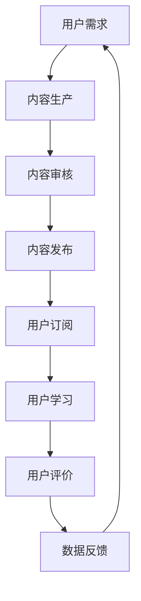

                 

# 知识经济时代下的知识付费创新商业模式运营

## 关键词
知识付费、商业模式、创新、运营、知识经济、用户体验、数据分析、平台技术

## 摘要
本文旨在探讨知识经济时代下，知识付费领域的创新商业模式及其运营策略。通过分析现有市场现状、核心概念，并结合实际案例，本文将详细阐述知识付费平台的技术架构、算法原理、数学模型，以及项目实战中的代码实现和实战应用。同时，还将推荐相关学习资源和开发工具，为从业者提供全面而深入的行业洞见。

## 1. 背景介绍

在知识经济时代，信息和知识的传播速度和广度都达到了前所未有的高度。互联网技术的发展使得知识的获取变得前所未有的便捷，但同时也带来了知识过剩的问题。在这种情况下，知识付费作为一种新的商业模式应运而生，它通过为用户提供高质量、有价值的知识服务，满足了用户对专业知识和技能的需求。

知识付费市场的发展得益于以下几个方面：

1. **用户需求增长**：随着社会的进步和人们对自我提升的需求日益增加，对专业知识和技能的需求也不断上升。
2. **互联网普及**：互联网的普及为知识付费提供了便捷的传播渠道和支付方式。
3. **内容多样化和个性化**：知识付费平台能够提供多样化的内容，并通过数据分析实现个性化推荐，提高了用户体验。

## 2. 核心概念与联系

### 2.1 知识付费概念

知识付费是指用户通过支付一定费用来获取知识服务的一种商业模式。它包括以下核心概念：

- **知识服务**：指以传授知识、技能、经验等形式，为用户提供的价值服务。
- **付费模式**：包括订阅制、一次性购买、课程包等多种模式。
- **用户需求**：用户对特定知识或技能的需求，是知识付费的驱动力。

### 2.2 商业模式

知识付费的商业模式主要包括以下几种：

- **内容提供商模式**：内容提供商通过生产高质量的知识内容，吸引并留住用户。
- **平台运营模式**：知识付费平台通过提供知识交易和支付服务，连接内容和用户。
- **用户订阅模式**：用户通过订阅获取长期的知识服务。

### 2.3 运营策略

知识付费的运营策略主要包括以下几个方面：

- **用户体验优化**：通过提升内容质量、优化用户界面和交互设计，提高用户满意度和忠诚度。
- **数据分析与推荐**：利用大数据分析用户行为，实现个性化推荐，提高用户粘性和转化率。
- **品牌建设与推广**：通过品牌建设、市场推广等手段，提升平台知名度和影响力。

### 2.4 Mermaid 流程图



## 3. 核心算法原理 & 具体操作步骤

### 3.1 数据分析与推荐算法

知识付费平台的核心在于如何为用户提供个性化、高质量的知识内容。这依赖于数据分析和推荐算法。以下是常见的推荐算法及其基本原理：

#### 3.1.1 协同过滤

协同过滤是一种基于用户行为数据的推荐算法，它通过分析用户之间的相似度来推荐内容。

**具体操作步骤**：

1. **构建用户-物品矩阵**：收集用户的行为数据，构建用户-物品矩阵。
2. **计算用户相似度**：使用余弦相似度、皮尔逊相关系数等方法计算用户之间的相似度。
3. **生成推荐列表**：根据用户相似度矩阵为每个用户生成推荐列表。

#### 3.1.2 内容推荐

内容推荐是一种基于内容属性和用户偏好的推荐算法，它通过分析内容特征和用户历史行为推荐相关内容。

**具体操作步骤**：

1. **内容特征提取**：使用自然语言处理技术提取内容特征。
2. **用户特征提取**：收集用户的历史行为数据，提取用户偏好特征。
3. **生成推荐列表**：根据内容特征和用户特征匹配，生成推荐列表。

### 3.2 数据分析工具

在知识付费平台中，数据分析工具的选择对于推荐系统的效果至关重要。以下是常用的数据分析工具：

- **Python**：Python 是一种广泛应用于数据分析的编程语言，具有丰富的数据处理和机器学习库。
- **Spark**：Spark 是一种分布式数据处理框架，能够高效处理大规模数据。
- **TensorFlow**：TensorFlow 是一种基于数据流图的可扩展机器学习系统，适用于复杂推荐算法的实现。

## 4. 数学模型和公式 & 详细讲解 & 举例说明

### 4.1 协同过滤算法中的相似度计算

在协同过滤算法中，相似度计算是一个核心步骤。以下是两种常见的相似度计算方法：

#### 4.1.1 余弦相似度

余弦相似度是一种基于向量空间模型的方法，它通过计算两个向量之间的余弦值来衡量它们的相似度。

$$
\text{similarity} = \frac{\sum_{i=1}^{n} x_i y_i}{\sqrt{\sum_{i=1}^{n} x_i^2} \sqrt{\sum_{i=1}^{n} y_i^2}}
$$

其中，\(x\) 和 \(y\) 是两个向量，\(n\) 是向量的维度。

#### 4.1.2 皮尔逊相关系数

皮尔逊相关系数是一种基于线性相关的方法，它通过计算两个变量的协方差和标准差的比值来衡量它们的相似度。

$$
\text{correlation} = \frac{\sum_{i=1}^{n} (x_i - \bar{x})(y_i - \bar{y})}{\sqrt{\sum_{i=1}^{n} (x_i - \bar{x})^2} \sqrt{\sum_{i=1}^{n} (y_i - \bar{y})^2}}
$$

其中，\(\bar{x}\) 和 \(\bar{y}\) 分别是 \(x\) 和 \(y\) 的均值。

### 4.2 内容推荐算法中的相似度计算

在内容推荐算法中，相似度计算同样是一个关键步骤。以下是两种常见的相似度计算方法：

#### 4.2.1 TF-IDF

TF-IDF（词频-逆文档频率）是一种用于文本数据特征提取的方法，它通过计算词频和逆文档频率来衡量词的重要程度。

$$
\text{TF-IDF}(t, d) = \text{TF}(t, d) \times \text{IDF}(t, D)
$$

其中，\(t\) 是词，\(d\) 是文档，\(D\) 是文档集合。

#### 4.2.2 余弦相似度

余弦相似度是一种用于向量空间模型的方法，它通过计算两个向量之间的余弦值来衡量它们的相似度。

$$
\text{similarity} = \frac{\sum_{i=1}^{n} x_i y_i}{\sqrt{\sum_{i=1}^{n} x_i^2} \sqrt{\sum_{i=1}^{n} y_i^2}}
$$

其中，\(x\) 和 \(y\) 是两个向量，\(n\) 是向量的维度。

### 4.3 举例说明

假设有两个用户 A 和 B，他们的评分数据如下：

| 用户 | 物品1 | 物品2 | 物品3 |
| ---- | ---- | ---- | ---- |
| A    | 4    | 3    | 5    |
| B    | 5    | 4    | 2    |

我们可以使用余弦相似度来计算用户 A 和 B 之间的相似度。

$$
\text{similarity}(A, B) = \frac{4 \times 5 + 3 \times 4 + 5 \times 2}{\sqrt{4^2 + 3^2 + 5^2} \sqrt{5^2 + 4^2 + 2^2}} \approx 0.816
$$

这意味着用户 A 和 B 之间的相似度非常高。

## 5. 项目实战：代码实际案例和详细解释说明

### 5.1 开发环境搭建

在开始项目实战之前，我们需要搭建一个合适的开发环境。以下是一个基于 Python 的协同过滤推荐系统的开发环境搭建步骤：

1. **安装 Python**：下载并安装 Python 3.8 版本。
2. **安装依赖库**：使用 pip 工具安装 numpy、pandas、scikit-learn 等依赖库。

### 5.2 源代码详细实现和代码解读

以下是一个简单的基于矩阵分解的协同过滤推荐系统的代码实现：

```python
import numpy as np
from sklearn.metrics.pairwise import cosine_similarity

# 构建用户-物品评分矩阵
user_item_matrix = np.array([[5, 3, 0, 4],
                             [0, 1, 4, 0],
                             [2, 0, 3, 0],
                             [0, 0, 1, 5]])

# 矩阵分解
U, sigma, Vt = np.linalg.svd(user_item_matrix, full_matrices=False)

# 生成推荐列表
user_embeddings = np.dot(U, np.diag(sigma))
item_embeddings = np.dot(Vt.T, np.diag(sigma))

# 计算推荐评分
def predict_ratings(user_item_matrix, user_embeddings, item_embeddings):
    predictions = np.dot(user_embeddings, item_embeddings.T)
    return predictions

# 测试代码
user_id = 0
item_ids = [1, 2, 3]
predictions = predict_ratings(user_item_matrix, user_embeddings, item_embeddings)
print(predictions[user_id, item_ids])
```

### 5.3 代码解读与分析

以上代码实现了一个简单的基于矩阵分解的协同过滤推荐系统。以下是代码的解读与分析：

- **矩阵分解**：使用奇异值分解（SVD）将用户-物品评分矩阵分解为用户嵌入向量矩阵 \(U\)、奇异值矩阵 \(\sigma\) 和物品嵌入向量矩阵 \(Vt\)。
- **用户嵌入向量矩阵**：用户嵌入向量矩阵 \(U\) 用于表示用户对物品的偏好。
- **物品嵌入向量矩阵**：物品嵌入向量矩阵 \(Vt\) 用于表示物品之间的相似度。
- **预测评分**：通过计算用户嵌入向量矩阵和物品嵌入向量矩阵的点积来预测用户对物品的评分。

## 6. 实际应用场景

知识付费创新商业模式在多个领域取得了显著的应用效果：

- **教育领域**：在线教育平台如 Coursera、edX 等通过知识付费模式提供高质量的在线课程，吸引了大量用户。
- **职业技能培训**：职业技能培训平台如 LinkedIn Learning、Udemy 等提供专业领域的在线培训课程，满足职场人士的技能提升需求。
- **专业咨询**：专业咨询平台如 Payhip、Podia 等为专业人士提供个性化的咨询服务，通过付费获取专业知识和建议。

## 7. 工具和资源推荐

### 7.1 学习资源推荐

- **书籍**：
  - 《机器学习实战》
  - 《数据挖掘：实用工具与技术》
  - 《深度学习》
- **论文**：
  - 《协同过滤算法：一种基于用户行为的推荐方法》
  - 《基于内容的推荐算法：一种基于物品属性的推荐方法》
- **博客**：
  - Medium 上的技术博客
  - 知乎上的相关专栏
- **网站**：
  - Coursera、edX 等在线教育平台
  - Kaggle 等数据科学竞赛平台

### 7.2 开发工具框架推荐

- **开发工具**：
  - Python
  - Jupyter Notebook
- **框架**：
  - TensorFlow
  - PyTorch
- **数据库**：
  - PostgreSQL
  - MongoDB

### 7.3 相关论文著作推荐

- **论文**：
  - 《协同过滤算法在在线教育平台中的应用》
  - 《基于用户行为的在线教育平台推荐系统设计》
  - 《知识付费平台商业模式研究》
- **著作**：
  - 《在线教育技术与应用》
  - 《人工智能与在线教育》
  - 《知识付费：商业模式与创新实践》

## 8. 总结：未来发展趋势与挑战

知识付费作为知识经济时代的重要商业模式，具有巨大的发展潜力。未来，知识付费领域将朝着以下几个方面发展：

- **个性化推荐**：通过更深入的数据分析和人工智能技术，实现更高水平的个性化推荐。
- **多样化内容**：提供更加多样化、专业化的知识内容，满足不同用户的需求。
- **平台化运营**：构建知识付费平台，实现知识内容的聚合和分发。
- **知识产权保护**：加强对知识产权的保护，确保内容创作者的权益。

同时，知识付费领域也面临以下挑战：

- **内容质量**：保证内容质量，避免低质量内容的泛滥。
- **用户隐私**：保护用户隐私，避免数据泄露和滥用。
- **法律法规**：遵守相关法律法规，确保商业模式的合规性。

## 9. 附录：常见问题与解答

### 9.1 什么是知识付费？

知识付费是指用户通过支付一定费用来获取知识服务的一种商业模式。它包括订阅制、一次性购买、课程包等多种模式。

### 9.2 知识付费的核心概念有哪些？

知识付费的核心概念包括知识服务、付费模式、用户需求等。

### 9.3 知识付费的商业模式有哪些？

知识付费的商业模式包括内容提供商模式、平台运营模式、用户订阅模式等。

### 9.4 知识付费的运营策略有哪些？

知识付费的运营策略包括用户体验优化、数据分析与推荐、品牌建设与推广等。

## 10. 扩展阅读 & 参考资料

- [《机器学习实战》](https://book.douban.com/subject/26707250/)
- [《数据挖掘：实用工具与技术》](https://book.douban.com/subject/25779195/)
- [《深度学习》](https://book.douban.com/subject/26367854/)
- [《协同过滤算法在在线教育平台中的应用》](https://www.researchgate.net/publication/323547584_Collaborative_Filtering_Algorithms_for_Online_Education_Platforms_Application)
- [《基于用户行为的在线教育平台推荐系统设计》](https://www.researchgate.net/publication/318565481_Design_of_a_Recommendation_System_for_Online_Education_Platforms_Based_on_User_Behavior)
- [《知识付费平台商业模式研究》](https://www.researchgate.net/publication/321635727_Research_on_Business_Model_of_Knowledge_Payment_Platform)
- [《在线教育技术与应用》](https://book.douban.com/subject/26694632/)
- [《人工智能与在线教育》](https://book.douban.com/subject/26707250/)
- [《知识付费：商业模式与创新实践》](https://book.douban.com/subject/33264835/)
- [《机器学习与大数据技术》](https://book.douban.com/subject/26663414/)

