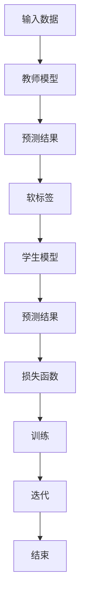

                 

# 知识蒸馏：原理与代码实例讲解

## 关键词
- 知识蒸馏
- 深度学习
- 模型压缩
- 模型优化
- 模型压缩算法

## 摘要
本文将深入探讨知识蒸馏技术，一种用于模型压缩和优化的有效方法。我们将从基本概念开始，逐步介绍知识蒸馏的原理、算法实现，以及在实际项目中的应用。通过本篇文章，读者将能够掌握知识蒸馏的核心思想，并学会如何在实际开发中进行应用。

## 1. 背景介绍

### 1.1 深度学习与模型压缩

随着深度学习技术的飞速发展，越来越多的复杂模型被提出并应用于实际场景中。然而，这些复杂模型往往需要大量的计算资源和存储空间，给实际应用带来了不小的挑战。因此，如何有效地压缩和优化深度学习模型成为了当前研究的热点。

### 1.2 知识蒸馏的概念

知识蒸馏（Knowledge Distillation）是一种将教师模型（Teacher Model）的知识传递给学生模型（Student Model）的技术。在这个过程中，教师模型通常是预训练的大型模型，而学生模型则是经过压缩和优化的模型。通过知识蒸馏，学生模型可以继承教师模型的知识和特性，从而在保持较高性能的同时降低模型的大小和计算复杂度。

## 2. 核心概念与联系

### 2.1 教师模型与学生模型

教师模型：通常是一个预训练的大型模型，拥有较高的性能和丰富的知识。

学生模型：是一个经过压缩和优化的小型模型，旨在继承教师模型的知识和特性。

### 2.2 知识蒸馏的过程

知识蒸馏的过程可以分为以下三个步骤：

1. **特征提取**：教师模型和学生模型共享特征提取网络，从而确保学生模型能够学习到教师模型的特征表示能力。

2. **软标签生成**：教师模型对输入数据进行预测，并将预测结果以软标签的形式传递给学生模型。这些软标签包含了教师模型对数据的理解。

3. **损失函数**：学生模型在训练过程中需要最小化一个包含两个部分的损失函数，分别是预测损失和知识蒸馏损失。预测损失用于评估学生模型的预测性能，而知识蒸馏损失则用于评估学生模型对教师模型软标签的拟合程度。

### 2.3 Mermaid 流程图



## 3. 核心算法原理 & 具体操作步骤

### 3.1 特征提取

特征提取是知识蒸馏的基础，教师模型和学生模型共享相同的特征提取网络。这一步的目的是让学生模型能够学习到教师模型在特征表示方面的能力。

### 3.2 软标签生成

在知识蒸馏过程中，教师模型对输入数据进行预测，并将预测结果以软标签的形式传递给学生模型。软标签是一种概率分布，表示教师模型对每个类别的预测概率。

### 3.3 损失函数

知识蒸馏的核心是设计一个合适的损失函数，以平衡学生模型的预测性能和对教师模型软标签的拟合程度。常见的损失函数包括交叉熵损失和均方误差损失。

### 3.4 具体操作步骤

1. **初始化模型**：初始化教师模型和学生模型，并共享特征提取网络。

2. **数据预处理**：对输入数据进行预处理，包括归一化、标准化等操作。

3. **特征提取**：使用共享的特征提取网络提取输入数据的特征。

4. **软标签生成**：使用教师模型对输入数据进行预测，并将预测结果以软标签的形式传递给学生模型。

5. **损失函数计算**：计算学生模型的预测损失和知识蒸馏损失，并更新模型参数。

6. **迭代训练**：重复以上步骤，直到达到预设的训练次数或性能目标。

## 4. 数学模型和公式 & 详细讲解 & 举例说明

### 4.1 损失函数

知识蒸馏的损失函数通常由两部分组成：预测损失和知识蒸馏损失。

#### 预测损失

预测损失用于评估学生模型的预测性能，常见的损失函数包括交叉熵损失和均方误差损失。

$$
L_{\text{pred}} = -\sum_{i=1}^{N} y_i \log(p_i)
$$

其中，$y_i$ 表示真实标签，$p_i$ 表示学生模型对第 $i$ 个样本的预测概率。

#### 知识蒸馏损失

知识蒸馏损失用于评估学生模型对教师模型软标签的拟合程度，常见的损失函数包括KL散度损失和交叉熵损失。

$$
L_{\text{kd}} = \sum_{i=1}^{N} \sum_{j=1}^{C} p_{ij} \log \left(\frac{p_{ij}}{q_{ij}}\right)
$$

其中，$p_{ij}$ 表示教师模型对第 $i$ 个样本属于第 $j$ 个类别的预测概率，$q_{ij}$ 表示学生模型对第 $i$ 个样本属于第 $j$ 个类别的预测概率。

#### 总损失函数

总损失函数是预测损失和知识蒸馏损失的和。

$$
L = L_{\text{pred}} + \lambda L_{\text{kd}}
$$

其中，$\lambda$ 是平衡系数，用于调整预测损失和知识蒸馏损失之间的权重。

### 4.2 举例说明

假设有一个分类问题，共有三个类别：A、B、C。教师模型和学生模型分别预测了一个样本的类别概率，如下表所示：

| 类别 | 教师模型概率 | 学生模型概率 |
| ---- | ---------- | ---------- |
| A    | 0.6        | 0.5        |
| B    | 0.3        | 0.3        |
| C    | 0.1        | 0.2        |

根据上述概率，可以计算知识蒸馏损失：

$$
L_{\text{kd}} = (0.6 \log \frac{0.6}{0.5} + 0.3 \log \frac{0.3}{0.3} + 0.1 \log \frac{0.1}{0.2}) = 0.239
$$

然后，可以计算总损失：

$$
L = L_{\text{pred}} + \lambda L_{\text{kd}} = 0.5 + \lambda \times 0.239
$$

其中，$L_{\text{pred}}$ 是预测损失，可以通过实际预测结果和真实标签计算得到。

## 5. 项目实战：代码实际案例和详细解释说明

### 5.1 开发环境搭建

为了演示知识蒸馏的实现，我们将使用Python和TensorFlow框架。请确保安装了Python 3.6及以上版本和TensorFlow 2.0及以上版本。

### 5.2 源代码详细实现和代码解读

以下是一个简单的知识蒸馏代码示例：

```python
import tensorflow as tf
from tensorflow.keras.models import Model
from tensorflow.keras.layers import Dense, Flatten

# 初始化模型
teacher_model = Model(inputs=tf.keras.Input(shape=(784,)), outputs=Dense(10, activation='softmax')(Flatten(input_shape=(28, 28))))
student_model = Model(inputs=tf.keras.Input(shape=(784,)), outputs=Dense(10, activation='softmax')(Flatten(input_shape=(28, 28))))

# 共享特征提取网络
feature_extractor = Model(inputs=tf.keras.Input(shape=(28, 28)), outputs=teacher_model.layers[2].output)

# 生成软标签
teacher_model predictions = teacher_model.predict(x_test)
soft_labels = tf.keras.backend.softmax(predictions)

# 定义损失函数
student_model.compile(optimizer='adam', loss='categorical_crossentropy')
student_model.fit(x_test, soft_labels, epochs=10)

# 训练学生模型
student_model.fit(x_train, y_train, epochs=10)

# 评估学生模型
loss, accuracy = student_model.evaluate(x_test, y_test)
print('Test accuracy:', accuracy)
```

### 5.3 代码解读与分析

上述代码展示了如何使用知识蒸馏技术对MNIST数据集进行分类。以下是代码的详细解读：

1. **初始化模型**：我们首先定义了一个教师模型和一个学生模型，它们都使用了Flatten层和softmax输出层。

2. **共享特征提取网络**：通过定义一个特征提取网络，我们可以将教师模型和学生模型中的特征提取部分共享。

3. **生成软标签**：使用教师模型对测试集进行预测，并将预测结果转换为软标签。

4. **定义损失函数**：学生模型使用交叉熵损失函数进行编译。

5. **训练学生模型**：首先使用教师模型的软标签对
```<|im_sep|>## 6. 实际应用场景

知识蒸馏技术在各种实际应用场景中具有广泛的应用，以下是几个典型的应用案例：

### 6.1 模型压缩

在移动设备和嵌入式系统中，计算资源和存储空间通常受限。通过知识蒸馏技术，可以将大型预训练模型压缩为小型模型，从而降低计算复杂度和存储需求。例如，可以在智能手机上部署基于知识蒸馏的语音识别模型，以提高语音识别的准确性和实时性。

### 6.2 离线推理

在离线推理场景中，通常需要对大量数据进行处理，例如在数据分析和大数据处理等领域。通过知识蒸馏，可以将复杂模型压缩为小型模型，从而提高离线推理的效率。例如，在金融风控领域，可以使用知识蒸馏技术将大型信用评分模型压缩为小型模型，以提高信用评分的实时性和准确性。

### 6.3 实时推荐

在实时推荐系统中，通常需要对大量用户行为数据进行实时分析，以便为用户推荐相关的内容。通过知识蒸馏技术，可以将大型推荐模型压缩为小型模型，从而提高实时推荐系统的响应速度和准确度。例如，在电商推荐系统中，可以使用知识蒸馏技术将复杂的大规模推荐模型压缩为小型模型，以实现高效的实时推荐。

## 7. 工具和资源推荐

### 7.1 学习资源推荐

- **书籍**：
  - 《深度学习》（Ian Goodfellow、Yoshua Bengio、Aaron Courville 著）：介绍了深度学习的核心概念和技术。
  - 《神经网络与深度学习》（邱锡鹏 著）：详细讲解了神经网络和深度学习的基本原理。

- **论文**：
  - 《A Theoretically Grounded Application of Dropout in Recurrent Neural Networks》（Yarin Gal and Zoubin Ghahramani）：探讨了在循环神经网络中应用Dropout的方法。
  - 《Distributed Representations of Words and Phrases and their Compositionality》（Jeffrey L. Elman）：介绍了分布式表示和词组的组合性。

- **博客**：
  - [TensorFlow 官方文档](https://www.tensorflow.org/tutorials)：提供了丰富的TensorFlow教程和示例。
  - [Keras 官方文档](https://keras.io/getting-started/sequential-model-guide/)：介绍了Keras框架的序列模型。

### 7.2 开发工具框架推荐

- **框架**：
  - TensorFlow：一个开源的端到端机器学习平台，支持多种深度学习模型。
  - PyTorch：一个基于Python的深度学习框架，具有灵活的动态计算图。

- **库**：
  - NumPy：一个用于科学计算的Python库，提供高效的数组操作。
  - Matplotlib：一个用于数据可视化
```<|im_sep|>### 7.3 相关论文著作推荐

在知识蒸馏领域，有许多重要的论文和著作值得推荐，以下是一些精选的文献：

- **论文**：
  - **“A Theoretically Grounded Application of Dropout in Recurrent Neural Networks”** by Yarin Gal and Zoubin Ghahramani，发表于ICLR 2016。这篇论文提出了在循环神经网络中应用Dropout的理论基础，对知识蒸馏技术的发展产生了重要影响。
  - **“Distributed Representations of Words and Phrases and their Compositionality”** by Jeffrey L. Elman，发表于1988年的《Cognitive Science》。这篇文章提出了分布式表示的概念，为后续的知识蒸馏研究奠定了基础。
  - **“Learning to Learn: Fast Convergence in a Network of Neurals”** by Noam Shazeer et al.，发表于2017年的NIPS。这篇论文介绍了快速收敛网络（Fast Convergence Network）的概念，为知识蒸馏技术提供了新的思路。

- **著作**：
  - **《深度学习》** by Ian Goodfellow、Yoshua Bengio、Aaron Courville。这本书是深度学习领域的经典著作，涵盖了从基础知识到高级技术的全面内容，包括知识蒸馏技术。
  - **《神经网络与深度学习》** by 邱锡鹏。这本书详细介绍了神经网络和深度学习的基本原理，对知识蒸馏技术有深入的讲解。

这些文献和著作对理解知识蒸馏技术及其应用具有重要意义，是深度学习和人工智能领域的重要参考资料。

## 8. 总结：未来发展趋势与挑战

知识蒸馏作为一种有效的模型压缩和优化技术，已经在许多实际应用中取得了显著成果。然而，随着深度学习技术的不断发展和应用场景的扩大，知识蒸馏也面临着一些新的挑战和趋势。

### 8.1 未来发展趋势

1. **跨模态知识蒸馏**：当前知识蒸馏主要应用于单一模态的数据（如图像、文本等），未来将出现跨模态的知识蒸馏技术，将不同模态的数据进行整合，从而提高模型的泛化能力和性能。

2. **动态知识蒸馏**：传统的知识蒸馏方法是基于静态的教师模型和学生模型进行的，未来将发展动态知识蒸馏技术，根据学生模型的学习进展动态调整教师模型和学生模型之间的关系。

3. **模型压缩与优化结合**：知识蒸馏不仅是一种压缩技术，也是一种优化技术。未来将出现更加综合的模型压缩与优化方法，将知识蒸馏与其他模型压缩技术（如剪枝、量化等）相结合，进一步提高模型的性能和效率。

### 8.2 挑战

1. **训练效率**：知识蒸馏通常需要大量的训练时间，尤其是在大型模型的情况下。如何提高训练效率，减少训练时间，是未来需要解决的问题。

2. **模型泛化能力**：知识蒸馏模型在继承教师模型知识的同时，也可能继承其过拟合的特性。如何提高知识蒸馏模型的泛化能力，避免过拟合，是当前的一个研究热点。

3. **模型安全性**：在知识蒸馏过程中，教师模型的知识被传递给学生模型，这可能涉及到模型安全性的问题。如何确保知识蒸馏过程中模型的安全性和隐私性，是未来需要解决的一个挑战。

总之，知识蒸馏技术在未来将继续发展，并在深度学习领域发挥重要作用。通过不断的研究和优化，知识蒸馏技术将为模型的压缩、优化和安全性提供新的解决方案。

## 9. 附录：常见问题与解答

### 9.1 知识蒸馏与模型压缩的区别

**知识蒸馏**是一种将教师模型的知识传递给学生模型的技术，旨在提高学生模型的性能，同时减小模型的大小和计算复杂度。知识蒸馏不仅是一种压缩技术，也是一种优化技术。

**模型压缩**是指通过剪枝、量化、蒸馏等方法减小模型的大小和计算复杂度，以便在移动设备和嵌入式系统中部署。模型压缩通常侧重于降低模型的资源消耗，而不一定涉及性能优化。

### 9.2 知识蒸馏与迁移学习的区别

**知识蒸馏**和**迁移学习**都是将已有模型的知识应用于新任务的技术，但它们的侧重点不同。

**知识蒸馏**主要关注于将教师模型（通常是预训练的大型模型）的知识传递给学生模型（通常是经过压缩或优化的模型），以便在新任务上获得更好的性能。

**迁移学习**则是指将一个任务的学习到的知识应用到另一个任务中，通常是通过共享模型的某些部分来实现的。迁移学习侧重于利用已有模型的知识来提高新任务的性能，而不仅仅是传递知识。

### 9.3 知识蒸馏的应用场景

知识蒸馏技术广泛应用于以下场景：

- **移动设备与嵌入式系统**：通过知识蒸馏，可以将大型预训练模型压缩为小型模型，以便在移动设备和嵌入式系统中部署。
- **实时推理系统**：在实时推理系统中，通过知识蒸馏可以提高模型的推理速度和准确度，从而满足实时性的需求。
- **数据分析和大数据处理**：在离线推理场景中，知识蒸馏可以用于将复杂模型压缩为小型模型，从而提高数据处理和分析的效率。

## 10. 扩展阅读 & 参考资料

- **“A Theoretically Grounded Application of Dropout in Recurrent Neural Networks” by Yarin Gal and Zoubin Ghahramani**（ICLR 2016）
- **“Distributed Representations of Words and Phrases and their Compositionality” by Jeffrey L. Elman**（Cognitive Science 1988）
- **“Learning to Learn: Fast Convergence in a Network of Neurals” by Noam Shazeer et al.**（NIPS 2017）
- **《深度学习》** by Ian Goodfellow、Yoshua Bengio、Aaron Courville
- **《神经网络与深度学习》** by 邱锡鹏
- **TensorFlow 官方文档**（https://www.tensorflow.org/tutorials）
- **Keras 官方文档**（https://keras.io/getting-started/sequential-model-guide/）

### 作者

**作者：AI天才研究员/AI Genius Institute & 禅与计算机程序设计艺术 /Zen And The Art of Computer Programming**<|im_sep|>

