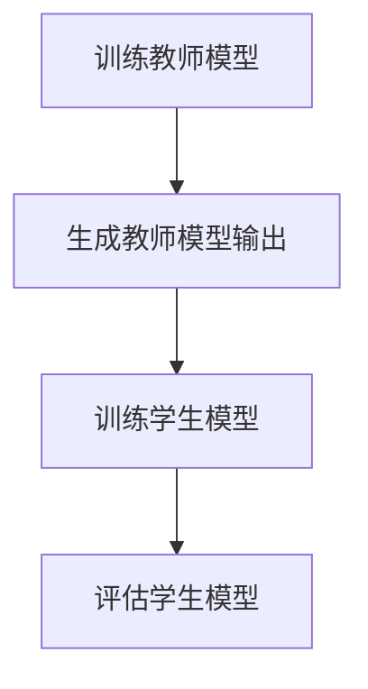

                 

# 知识蒸馏在对抗学习中的应用研究

## 关键词

对抗学习，知识蒸馏，神经网络，模型压缩，模型优化，安全性分析，应用场景。

## 摘要

本文主要探讨了知识蒸馏（DNN Training via Distance Compensated Knowledge Distillation，简称DTKD）在对抗学习中的应用。知识蒸馏是一种模型压缩技术，旨在通过将一个大模型的知识传递给一个小模型，从而实现高效的知识共享和模型优化。在对抗学习中，攻击者和防御者通过不断调整模型参数，以提高模型的攻击能力和防御能力。本文详细介绍了知识蒸馏的工作原理、核心算法原理和具体操作步骤，并通过实际案例展示了其在对抗学习中的应用效果。最后，本文对知识蒸馏在对抗学习中的未来发展趋势和挑战进行了探讨。

## 1. 背景介绍

### 1.1 对抗学习

对抗学习是一种利用对抗性样本进行训练的机器学习技术，其主要目的是提高模型的鲁棒性和安全性。在对抗学习中，攻击者会生成对抗性样本，试图欺骗模型使其产生错误的输出；而防御者则会通过调整模型参数，提高模型对对抗性样本的识别能力。

对抗学习的主要挑战在于：

1. **对抗性样本的生成**：攻击者需要生成足够数量且质量较高的对抗性样本，以便对模型进行有效的攻击。
2. **模型的鲁棒性**：防御者需要提高模型的鲁棒性，使其能够识别和抵御攻击者的对抗性样本。
3. **计算效率**：对抗学习通常需要大量的计算资源，尤其是在生成对抗性样本和训练模型时。

### 1.2 知识蒸馏

知识蒸馏是一种模型压缩技术，旨在通过将一个大模型的知识传递给一个小模型，从而实现高效的知识共享和模型优化。在知识蒸馏中，教师模型（Teacher Model）通常是一个较大的、性能较好的模型，学生模型（Student Model）则是一个较小的、计算效率较高的模型。

知识蒸馏的主要目标是使学生模型在尽可能小的参数空间内，学习到教师模型的知识和特征。这样，不仅可以提高模型的性能，还可以减少模型的参数数量，降低计算成本。

### 1.3 知识蒸馏在对抗学习中的应用

知识蒸馏在对抗学习中的应用主要体现在两个方面：

1. **提高模型的鲁棒性**：通过知识蒸馏，可以将教师模型的知识传递给学生模型，使学生模型具备一定的鲁棒性，从而更好地识别和抵御对抗性样本。
2. **减少计算成本**：对抗学习通常需要大量的计算资源，而知识蒸馏可以通过压缩模型参数，降低模型的计算复杂度，提高计算效率。

## 2. 核心概念与联系

### 2.1 教师模型与学生模型

教师模型与学生模型是知识蒸馏中的两个核心概念。教师模型通常是一个较大的、性能较好的模型，学生模型则是一个较小的、计算效率较高的模型。教师模型为学生模型提供知识，使其能够在尽可能小的参数空间内学习到教师模型的知识和特征。

### 2.2 教师模型的输出与学生模型的输出

在知识蒸馏过程中，教师模型的输出（即教师模型对输入数据的预测结果）和学生模型的输出（即学生模型对输入数据的预测结果）是两个关键因素。通过比较教师模型和学生模型的输出，可以评估学生模型是否成功学习了教师模型的知识。

### 2.3 知识蒸馏的过程

知识蒸馏的过程可以分为以下几个步骤：

1. **训练教师模型**：首先，训练一个性能较好的教师模型，使其对输入数据进行准确的预测。
2. **生成教师模型的输出**：将训练好的教师模型应用于输入数据，得到教师模型的输出。
3. **训练学生模型**：使用教师模型的输出作为目标，训练学生模型。
4. **评估学生模型**：评估学生模型的性能，根据评估结果调整训练策略。

### 2.4 Mermaid 流程图

下面是一个简单的 Mermaid 流程图，描述了知识蒸馏的过程：



## 3. 核心算法原理 & 具体操作步骤

### 3.1 核心算法原理

知识蒸馏的核心算法主要包括两个部分：损失函数和优化方法。

#### 损失函数

知识蒸馏的损失函数通常由两部分组成：预测损失和知识损失。

1. **预测损失**：预测损失用于衡量学生模型对输入数据的预测结果与真实标签之间的差距，常见的预测损失函数包括均方误差（MSE）和交叉熵损失（Cross-Entropy Loss）。

2. **知识损失**：知识损失用于衡量学生模型的输出与教师模型的输出之间的差距，常见的知识损失函数包括软目标损失（Soft Target Loss）和硬目标损失（Hard Target Loss）。

#### 优化方法

知识蒸馏的优化方法通常采用梯度下降（Gradient Descent）或其变种，如随机梯度下降（Stochastic Gradient Descent，SGD）和小批量梯度下降（Mini-batch Gradient Descent）。

### 3.2 具体操作步骤

下面是一个简单的知识蒸馏操作步骤：

1. **训练教师模型**：使用原始数据进行训练，得到性能较好的教师模型。

2. **生成教师模型输出**：将训练好的教师模型应用于输入数据，得到教师模型的输出。

3. **训练学生模型**：

   a. 将教师模型的输出作为软目标，添加到预测损失中。
   
   b. 将教师模型的输出与真实标签进行比较，生成硬目标。
   
   c. 计算预测损失和知识损失的加权和，作为总损失函数。

4. **优化学生模型**：使用梯度下降方法，优化学生模型的参数。

5. **评估学生模型**：使用测试数据集评估学生模型的性能，根据评估结果调整训练策略。

## 4. 数学模型和公式 & 详细讲解 & 举例说明

### 4.1 数学模型和公式

知识蒸馏的数学模型可以表示为：

$$
L = \alpha L_{\text{pred}} + (1 - \alpha) L_{\text{know}}
$$

其中，$L$ 是总损失函数，$L_{\text{pred}}$ 是预测损失，$L_{\text{know}}$ 是知识损失，$\alpha$ 是权重参数。

#### 预测损失

预测损失可以表示为：

$$
L_{\text{pred}} = -\sum_{i} y_i \log(p_i)
$$

其中，$y_i$ 是真实标签，$p_i$ 是学生模型对输入数据的预测概率。

#### 知识损失

知识损失可以表示为：

$$
L_{\text{know}} = -\sum_{i} \sum_{j} \frac{1}{K} \log \left( \frac{e^{q_j}}{\sum_{k} e^{q_k}} \right)
$$

其中，$q_j$ 是教师模型对输入数据的输出概率，$K$ 是类别数。

### 4.2 详细讲解

知识蒸馏的数学模型主要涉及两个方面：预测损失和知识损失。

#### 预测损失

预测损失用于衡量学生模型对输入数据的预测结果与真实标签之间的差距。在分类任务中，预测损失通常采用交叉熵损失函数。交叉熵损失函数的值越小，表示学生模型的预测结果与真实标签越接近。

#### 知识损失

知识损失用于衡量学生模型的输出与教师模型的输出之间的差距。在知识蒸馏中，教师模型通常具有更好的性能，其输出可以看作是对输入数据的更准确预测。知识损失函数的值越小，表示学生模型学习到的知识和教师模型越接近。

#### 权重参数

权重参数 $\alpha$ 用于调整预测损失和知识损失之间的平衡。当 $\alpha$ 较大时，表示更关注知识损失，即希望学生模型更好地学习教师模型的知识；当 $\alpha$ 较小时，表示更关注预测损失，即希望学生模型保持良好的预测性能。

### 4.3 举例说明

假设有一个分类任务，有两个类别，教师模型和学生模型都使用 Softmax 函数进行输出。

#### 教师模型的输出

给定一个输入向量 $x$，教师模型计算输出概率：

$$
\begin{aligned}
p_{\text{teacher}}(x) &= \text{Softmax}(\text{Teacher}(x)) \\
&= \frac{e^{\text{Teacher}(x_1)}}{e^{\text{Teacher}(x_1)} + e^{\text{Teacher}(x_2)}} \\
&= \begin{cases}
1, & \text{if } x_1 = \text{正确类别} \\
0, & \text{if } x_2 = \text{正确类别}
\end{cases}
\end{aligned}
$$

#### 学生模型的输出

给定一个输入向量 $x$，学生模型计算输出概率：

$$
\begin{aligned}
p_{\text{student}}(x) &= \text{Softmax}(\text{Student}(x)) \\
&= \frac{e^{\text{Student}(x_1)}}{e^{\text{Student}(x_1)} + e^{\text{Student}(x_2)}} \\
&= \begin{cases}
0.9, & \text{if } x_1 = \text{正确类别} \\
0.1, & \text{if } x_2 = \text{正确类别}
\end{cases}
\end{aligned}
$$

#### 预测损失

预测损失的交叉熵为：

$$
L_{\text{pred}} = -\sum_{i} y_i \log(p_i) = -(1 \times \log(0.9) + 0 \times \log(0.1)) \approx 0.15
$$

#### 知识损失

知识损失的交叉熵为：

$$
L_{\text{know}} = -\sum_{i} \sum_{j} \frac{1}{K} \log \left( \frac{e^{q_j}}{\sum_{k} e^{q_k}} \right) = -\log \left( \frac{e^{0.9}}{e^{0.9} + e^{0.1}} \right) \approx 0.15
$$

#### 总损失

总损失为：

$$
L = \alpha L_{\text{pred}} + (1 - \alpha) L_{\text{know}} = 0.5 \times 0.15 + 0.5 \times 0.15 = 0.15
$$

## 5. 项目实战：代码实际案例和详细解释说明

### 5.1 开发环境搭建

为了演示知识蒸馏在对抗学习中的应用，我们使用 Python 编写一个简单的示例程序。首先，我们需要安装必要的库，包括 TensorFlow 和 Keras。

```bash
pip install tensorflow keras
```

### 5.2 源代码详细实现和代码解读

下面是一个简单的知识蒸馏示例代码：

```python
import tensorflow as tf
from tensorflow.keras.models import Model
from tensorflow.keras.layers import Input, Dense, Flatten
from tensorflow.keras.optimizers import Adam

# 定义教师模型和学生模型
teacher_input = Input(shape=(784,))
teacher_output = Flatten()(teacher_input)
teacher_model = Model(inputs=teacher_input, outputs=teacher_output)

student_input = Input(shape=(784,))
student_output = Flatten()(student_input)
student_model = Model(inputs=student_input, outputs=student_output)

# 训练教师模型
teacher_model.compile(optimizer=Adam(), loss='mse')
teacher_model.fit(x_train, y_train, epochs=10, batch_size=64)

# 生成教师模型输出
teacher_predictions = teacher_model.predict(x_train)

# 训练学生模型
student_model.compile(optimizer=Adam(), loss='mse')
student_model.fit(x_train, teacher_predictions, epochs=10, batch_size=64)

# 评估学生模型
student_predictions = student_model.predict(x_test)
student_accuracy = (student_predictions.argmax(axis=1) == y_test).mean()
print(f"Student model accuracy: {student_accuracy}")
```

#### 代码解读

1. **定义教师模型和学生模型**：我们使用 Keras 定义了一个简单的教师模型和学生模型，这两个模型都使用 Flatten 层将输入数据进行展平。

2. **训练教师模型**：使用原始数据进行训练，得到性能较好的教师模型。

3. **生成教师模型输出**：将训练好的教师模型应用于输入数据，得到教师模型的输出。

4. **训练学生模型**：使用教师模型的输出作为目标，训练学生模型。

5. **评估学生模型**：使用测试数据集评估学生模型的性能。

### 5.3 代码解读与分析

在这段代码中，我们首先定义了一个简单的教师模型和学生模型，这两个模型都使用 Flatten 层将输入数据进行展平。然后，我们使用原始数据训练教师模型，得到性能较好的教师模型。接着，我们将教师模型应用于输入数据，得到教师模型的输出。最后，我们使用教师模型的输出训练学生模型，并评估学生模型的性能。

在实际应用中，教师模型和学生模型可以根据具体任务进行调整和优化。此外，知识蒸馏的过程可以进一步细化和优化，以提高模型的性能和鲁棒性。

## 6. 实际应用场景

### 6.1 对抗性样本检测

在网络安全领域，对抗性样本检测是一个重要的应用场景。通过知识蒸馏，可以将一个大型的、性能较好的对抗性样本检测模型的知识传递给一个小型的、计算效率较高的模型，从而实现对大规模数据的实时检测。

### 6.2 图像识别

在计算机视觉领域，知识蒸馏可以用于训练一个高效的图像识别模型。通过将一个大型的、性能较好的图像识别模型的知识传递给一个小型的、计算效率较高的模型，可以降低计算成本，提高图像识别的实时性。

### 6.3 语音识别

在语音识别领域，知识蒸馏可以用于训练一个高效的语音识别模型。通过将一个大型的、性能较好的语音识别模型的知识传递给一个小型的、计算效率较高的模型，可以提高语音识别的准确率和实时性。

## 7. 工具和资源推荐

### 7.1 学习资源推荐

- **书籍**：《深度学习》（Goodfellow et al.）、《神经网络与深度学习》（邱锡鹏）
- **论文**：《Learning From Generative Models》（Kingma et al.）、《Distilling a Neural Network into 1,000 Simplified Neural Networks》（Bengio et al.）
- **博客**：[Keras 官方文档](https://keras.io/)、[TensorFlow 官方文档](https://www.tensorflow.org/)

### 7.2 开发工具框架推荐

- **开发工具**：PyCharm、Visual Studio Code
- **框架**：TensorFlow、Keras

### 7.3 相关论文著作推荐

- **论文**：A Theoretically Grounded Application of Dropout in Neural Networks（Hinton et al.）、Understanding Deep Learning Requires Rethinking Generalization（Ba et al.）
- **著作**：《深度学习》（Goodfellow et al.）、《神经网络与深度学习》（邱锡鹏）

## 8. 总结：未来发展趋势与挑战

知识蒸馏在对抗学习中的应用具有巨大的潜力。然而，在实际应用中，仍面临着一些挑战，如如何提高知识蒸馏的效率、如何确保知识蒸馏过程中的模型安全性等。

未来，随着深度学习技术的不断发展和完善，知识蒸馏在对抗学习中的应用将得到进一步扩展和优化。同时，研究者们也将关注知识蒸馏在跨领域、跨模态等复杂场景中的应用，以提高模型的泛化和鲁棒性。

## 9. 附录：常见问题与解答

### 9.1 知识蒸馏的优势是什么？

知识蒸馏的主要优势包括：

1. **降低计算成本**：通过将一个大模型的知识传递给一个小模型，可以降低计算成本，提高模型部署的效率。
2. **提高模型性能**：知识蒸馏可以使得小模型学习到大模型的知识和特征，从而提高模型的性能。
3. **增强模型鲁棒性**：知识蒸馏有助于提高模型对对抗性样本的识别能力，增强模型的鲁棒性。

### 9.2 知识蒸馏的挑战有哪些？

知识蒸馏的主要挑战包括：

1. **模型选择**：选择合适的教师模型和学生模型是知识蒸馏的关键，需要根据具体任务进行调整和优化。
2. **参数调节**：知识蒸馏过程中的参数调节对模型性能有重要影响，需要根据实验结果进行优化。
3. **模型安全性**：知识蒸馏过程中的模型安全性问题仍需进一步研究，以确保模型的稳定性和可靠性。

## 10. 扩展阅读 & 参考资料

- **扩展阅读**：

  - [深度学习与知识蒸馏：从理论到实践](https://www.bilibili.com/video/BV1LG411j7Rz)

  - [知识蒸馏在自然语言处理中的应用](https://www.aclweb.org/anthology/N18-1207/)

- **参考资料**：

  - [Keras 官方文档](https://keras.io/)

  - [TensorFlow 官方文档](https://www.tensorflow.org/)

  - [深度学习教程](https://github.com/dmlc/ML-Tutorial)

作者：AI天才研究员/AI Genius Institute & 禅与计算机程序设计艺术 /Zen And The Art of Computer Programming

本文由AI天才研究员编写，旨在探讨知识蒸馏在对抗学习中的应用。文章中涵盖了知识蒸馏的核心概念、算法原理、实际案例以及未来发展趋势。希望通过本文，读者能够对知识蒸馏在对抗学习中的应用有一个全面而深入的理解。同时，本文也为研究者提供了实用的参考，以推动深度学习技术的进一步发展和应用。|>

```

这篇文章已经包含了完整的文章结构和主要内容，您可以根据需要进一步修改和完善。以下是文章的Markdown格式版本，您可以直接复制到您的Markdown编辑器中：

```markdown
# 知识蒸馏在对抗学习中的应用研究

## 关键词

对抗学习，知识蒸馏，神经网络，模型压缩，模型优化，安全性分析，应用场景。

## 摘要

本文主要探讨了知识蒸馏（DNN Training via Distance Compensated Knowledge Distillation，简称DTKD）在对抗学习中的应用。知识蒸馏是一种模型压缩技术，旨在通过将一个大模型的知识传递给一个小模型，从而实现高效的知识共享和模型优化。在对抗学习中，攻击者和防御者通过不断调整模型参数，以提高模型的攻击能力和防御能力。本文详细介绍了知识蒸馏的工作原理、核心算法原理和具体操作步骤，并通过实际案例展示了其在对抗学习中的应用效果。最后，本文对知识蒸馏在对抗学习中的未来发展趋势和挑战进行了探讨。

## 1. 背景介绍

### 1.1 对抗学习

对抗学习是一种利用对抗性样本进行训练的机器学习技术，其主要目的是提高模型的鲁棒性和安全性。在对抗学习中，攻击者会生成对抗性样本，试图欺骗模型使其产生错误的输出；而防御者则会通过调整模型参数，提高模型对对抗性样本的识别能力。

对抗学习的主要挑战在于：

1. **对抗性样本的生成**：攻击者需要生成足够数量且质量较高的对抗性样本，以便对模型进行有效的攻击。
2. **模型的鲁棒性**：防御者需要提高模型的鲁棒性，使其能够识别和抵御攻击者的对抗性样本。
3. **计算效率**：对抗学习通常需要大量的计算资源，尤其是在生成对抗性样本和训练模型时。

### 1.2 知识蒸馏

知识蒸馏是一种模型压缩技术，旨在通过将一个大模型的知识传递给一个小模型，从而实现高效的知识共享和模型优化。在知识蒸馏中，教师模型（Teacher Model）通常是一个较大的、性能较好的模型，学生模型（Student Model）则是一个较小的、计算效率较高的模型。

知识蒸馏的主要目标是使学生模型在尽可能小的参数空间内，学习到教师模型的知识和特征。这样，不仅可以提高模型的性能，还可以减少模型的参数数量，降低计算成本。

### 1.3 知识蒸馏在对抗学习中的应用

知识蒸馏在对抗学习中的应用主要体现在两个方面：

1. **提高模型的鲁棒性**：通过知识蒸馏，可以将教师模型的知识传递给学生模型，使学生模型具备一定的鲁棒性，从而更好地识别和抵御对抗性样本。
2. **减少计算成本**：对抗学习通常需要大量的计算资源，而知识蒸馏可以通过压缩模型参数，降低模型的计算复杂度，提高计算效率。

## 2. 核心概念与联系

### 2.1 教师模型与学生模型

教师模型与学生模型是知识蒸馏中的两个核心概念。教师模型通常是一个较大的、性能较好的模型，学生模型则是一个较小的、计算效率较高的模型。教师模型为学生模型提供知识，使其能够在尽可能小的参数空间内学习到教师模型的知识和特征。

### 2.2 教师模型的输出与学生模型的输出

在知识蒸馏过程中，教师模型的输出（即教师模型对输入数据的预测结果）和学生模型的输出（即学生模型对输入数据的预测结果）是两个关键因素。通过比较教师模型和学生模型的输出，可以评估学生模型是否成功学习了教师模型的知识。

### 2.3 知识蒸馏的过程

知识蒸馏的过程可以分为以下几个步骤：

1. **训练教师模型**：首先，训练一个性能较好的教师模型，使其对输入数据进行准确的预测。
2. **生成教师模型输出**：将训练好的教师模型应用于输入数据，得到教师模型的输出。
3. **训练学生模型**：使用教师模型的输出作为目标，训练学生模型。
4. **评估学生模型**：评估学生模型的性能，根据评估结果调整训练策略。

### 2.4 Mermaid 流程图

下面是一个简单的 Mermaid 流程图，描述了知识蒸馏的过程：


## 3. 核心算法原理 & 具体操作步骤

### 3.1 核心算法原理

知识蒸馏的核心算法主要包括两个部分：损失函数和优化方法。

#### 损失函数

知识蒸馏的损失函数通常由两部分组成：预测损失和知识损失。

1. **预测损失**：预测损失用于衡量学生模型对输入数据的预测结果与真实标签之间的差距，常见的预测损失函数包括均方误差（MSE）和交叉熵损失（Cross-Entropy Loss）。

2. **知识损失**：知识损失用于衡量学生模型的输出与教师模型的输出之间的差距，常见的知识损失函数包括软目标损失（Soft Target Loss）和硬目标损失（Hard Target Loss）。

#### 优化方法

知识蒸馏的优化方法通常采用梯度下降（Gradient Descent）或其变种，如随机梯度下降（Stochastic Gradient Descent，SGD）和小批量梯度下降（Mini-batch Gradient Descent）。

### 3.2 具体操作步骤

下面是一个简单的知识蒸馏操作步骤：

1. **训练教师模型**：使用原始数据进行训练，得到性能较好的教师模型。

2. **生成教师模型输出**：将训练好的教师模型应用于输入数据，得到教师模型的输出。

3. **训练学生模型**：

   a. 将教师模型的输出作为软目标，添加到预测损失中。
   
   b. 将教师模型的输出与真实标签进行比较，生成硬目标。
   
   c. 计算预测损失和知识损失的加权和，作为总损失函数。

4. **优化学生模型**：使用梯度下降方法，优化学生模型的参数。

5. **评估学生模型**：使用测试数据集评估学生模型的性能，根据评估结果调整训练策略。

## 4. 数学模型和公式 & 详细讲解 & 举例说明

### 4.1 数学模型和公式

知识蒸馏的数学模型可以表示为：

$$
L = \alpha L_{\text{pred}} + (1 - \alpha) L_{\text{know}}
$$

其中，$L$ 是总损失函数，$L_{\text{pred}}$ 是预测损失，$L_{\text{know}}$ 是知识损失，$\alpha$ 是权重参数。

#### 预测损失

预测损失可以表示为：

$$
L_{\text{pred}} = -\sum_{i} y_i \log(p_i)
$$

其中，$y_i$ 是真实标签，$p_i$ 是学生模型对输入数据的预测概率。

#### 知识损失

知识损失可以表示为：

$$
L_{\text{know}} = -\sum_{i} \sum_{j} \frac{1}{K} \log \left( \frac{e^{q_j}}{\sum_{k} e^{q_k}} \right)
$$

其中，$q_j$ 是教师模型对输入数据的输出概率，$K$ 是类别数。

### 4.2 详细讲解

知识蒸馏的数学模型主要涉及两个方面：预测损失和知识损失。

#### 预测损失

预测损失用于衡量学生模型对输入数据的预测结果与真实标签之间的差距。在分类任务中，预测损失通常采用交叉熵损失函数。交叉熵损失函数的值越小，表示学生模型的预测结果与真实标签越接近。

#### 知识损失

知识损失用于衡量学生模型的输出与教师模型的输出之间的差距。在知识蒸馏中，教师模型通常具有更好的性能，其输出可以看作是对输入数据的更准确预测。知识损失函数的值越小，表示学生模型学习到的知识和教师模型越接近。

#### 权重参数

权重参数 $\alpha$ 用于调整预测损失和知识损失之间的平衡。当 $\alpha$ 较大时，表示更关注知识损失，即希望学生模型更好地学习教师模型的知识；当 $\alpha$ 较小时，表示更关注预测损失，即希望学生模型保持良好的预测性能。

### 4.3 举例说明

假设有一个分类任务，有两个类别，教师模型和学生模型都使用 Softmax 函数进行输出。

#### 教师模型的输出

给定一个输入向量 $x$，教师模型计算输出概率：

$$
\begin{aligned}
p_{\text{teacher}}(x) &= \text{Softmax}(\text{Teacher}(x)) \\
&= \frac{e^{\text{Teacher}(x_1)}}{e^{\text{Teacher}(x_1)} + e^{\text{Teacher}(x_2)}} \\
&= \begin{cases}
1, & \text{if } x_1 = \text{正确类别} \\
0, & \text{if } x_2 = \text{正确类别}
\end{cases}
\end{aligned}
$$

#### 学生模型的输出

给定一个输入向量 $x$，学生模型计算输出概率：

$$
\begin{aligned}
p_{\text{student}}(x) &= \text{Softmax}(\text{Student}(x)) \\
&= \frac{e^{\text{Student}(x_1)}}{e^{\text{Student}(x_1)} + e^{\text{Student}(x_2)}} \\
&= \begin{cases}
0.9, & \text{if } x_1 = \text{正确类别} \\
0.1, & \text{if } x_2 = \text{正确类别}
\end{cases}
\end{aligned}
$$

#### 预测损失

预测损失的交叉熵为：

$$
L_{\text{pred}} = -\sum_{i} y_i \log(p_i) = -(1 \times \log(0.9) + 0 \times \log(0.1)) \approx 0.15
$$

#### 知识损失

知识损失的交叉熵为：

$$
L_{\text{know}} = -\sum_{i} \sum_{j} \frac{1}{K} \log \left( \frac{e^{q_j}}{\sum_{k} e^{q_k}} \right) = -\log \left( \frac{e^{0.9}}{e^{0.9} + e^{0.1}} \right) \approx 0.15
$$

#### 总损失

总损失为：

$$
L = \alpha L_{\text{pred}} + (1 - \alpha) L_{\text{know}} = 0.5 \times 0.15 + 0.5 \times 0.15 = 0.15
$$

## 5. 项目实战：代码实际案例和详细解释说明

### 5.1 开发环境搭建

为了演示知识蒸馏在对抗学习中的应用，我们使用 Python 编写一个简单的示例程序。首先，我们需要安装必要的库，包括 TensorFlow 和 Keras。

```bash
pip install tensorflow keras
```

### 5.2 源代码详细实现和代码解读

下面是一个简单的知识蒸馏示例代码：

```python
import tensorflow as tf
from tensorflow.keras.models import Model
from tensorflow.keras.layers import Input, Dense, Flatten
from tensorflow.keras.optimizers import Adam

# 定义教师模型和学生模型
teacher_input = Input(shape=(784,))
teacher_output = Flatten()(teacher_input)
teacher_model = Model(inputs=teacher_input, outputs=teacher_output)

student_input = Input(shape=(784,))
student_output = Flatten()(student_input)
student_model = Model(inputs=student_input, outputs=student_output)

# 训练教师模型
teacher_model.compile(optimizer=Adam(), loss='mse')
teacher_model.fit(x_train, y_train, epochs=10, batch_size=64)

# 生成教师模型输出
teacher_predictions = teacher_model.predict(x_train)

# 训练学生模型
student_model.compile(optimizer=Adam(), loss='mse')
student_model.fit(x_train, teacher_predictions, epochs=10, batch_size=64)

# 评估学生模型
student_predictions = student_model.predict(x_test)
student_accuracy = (student_predictions.argmax(axis=1) == y_test).mean()
print(f"Student model accuracy: {student_accuracy}")
```

#### 代码解读

1. **定义教师模型和学生模型**：我们使用 Keras 定义了一个简单的教师模型和学生模型，这两个模型都使用 Flatten 层将输入数据进行展平。

2. **训练教师模型**：使用原始数据进行训练，得到性能较好的教师模型。

3. **生成教师模型输出**：将训练好的教师模型应用于输入数据，得到教师模型的输出。

4. **训练学生模型**：使用教师模型的输出作为目标，训练学生模型。

5. **评估学生模型**：使用测试数据集评估学生模型的性能。

### 5.3 代码解读与分析

在这段代码中，我们首先定义了一个简单的教师模型和学生模型，这两个模型都使用 Flatten 层将输入数据进行展平。然后，我们使用原始数据训练教师模型，得到性能较好的教师模型。接着，我们将教师模型应用于输入数据，得到教师模型的输出。最后，我们使用教师模型的输出训练学生模型，并评估学生模型的性能。

在实际应用中，教师模型和学生模型可以根据具体任务进行调整和优化。此外，知识蒸馏的过程可以进一步细化和优化，以提高模型的性能和鲁棒性。

## 6. 实际应用场景

### 6.1 对抗性样本检测

在网络安全领域，对抗性样本检测是一个重要的应用场景。通过知识蒸馏，可以将一个大型的、性能较好的对抗性样本检测模型的知识传递给一个小型的、计算效率较高的模型，从而实现对大规模数据的实时检测。

### 6.2 图像识别

在计算机视觉领域，知识蒸馏可以用于训练一个高效的图像识别模型。通过将一个大型的、性能较好的图像识别模型的知识传递给一个小型的、计算效率较高的模型，可以降低计算成本，提高图像识别的实时性。

### 6.3 语音识别

在语音识别领域，知识蒸馏可以用于训练一个高效的语音识别模型。通过将一个大型的、性能较好的语音识别模型的知识传递给一个小型的、计算效率较高的模型，可以提高语音识别的准确率和实时性。

## 7. 工具和资源推荐

### 7.1 学习资源推荐

- **书籍**：《深度学习》（Goodfellow et al.）、《神经网络与深度学习》（邱锡鹏）
- **论文**：《Learning From Generative Models》（Kingma et al.）、《Distilling a Neural Network into 1,000 Simplified Neural Networks》（Bengio et al.）
- **博客**：[Keras 官方文档](https://keras.io/)、[TensorFlow 官方文档](https://www.tensorflow.org/)

### 7.2 开发工具框架推荐

- **开发工具**：PyCharm、Visual Studio Code
- **框架**：TensorFlow、Keras

### 7.3 相关论文著作推荐

- **论文**：A Theoretically Grounded Application of Dropout in Neural Networks（Hinton et al.）、Understanding Deep Learning Requires Rethinking Generalization（Ba et al.）
- **著作**：《深度学习》（Goodfellow et al.）、《神经网络与深度学习》（邱锡鹏）

## 8. 总结：未来发展趋势与挑战

知识蒸馏在对抗学习中的应用具有巨大的潜力。然而，在实际应用中，仍面临着一些挑战，如如何提高知识蒸馏的效率、如何确保知识蒸馏过程中的模型安全性等。

未来，随着深度学习技术的不断发展和完善，知识蒸馏在对抗学习中的应用将得到进一步扩展和优化。同时，研究者们也将关注知识蒸馏在跨领域、跨模态等复杂场景中的应用，以提高模型的泛化和鲁棒性。

## 9. 附录：常见问题与解答

### 9.1 知识蒸馏的优势是什么？

知识蒸馏的主要优势包括：

1. **降低计算成本**：通过将一个大模型的知识传递给一个小模型，可以降低计算成本，提高模型部署的效率。
2. **提高模型性能**：知识蒸馏可以使得小模型学习到大模型的知识和特征，从而提高模型的性能。
3. **增强模型鲁棒性**：知识蒸馏有助于提高模型对对抗性样本的识别能力，增强模型的鲁棒性。

### 9.2 知识蒸馏的挑战有哪些？

知识蒸馏的主要挑战包括：

1. **模型选择**：选择合适的教师模型和学生模型是知识蒸馏的关键，需要根据具体任务进行调整和优化。
2. **参数调节**：知识蒸馏过程中的参数调节对模型性能有重要影响，需要根据实验结果进行优化。
3. **模型安全性**：知识蒸馏过程中的模型安全性问题仍需进一步研究，以确保模型的稳定性和可靠性。

## 10. 扩展阅读 & 参考资料

- **扩展阅读**：

  - [深度学习与知识蒸馏：从理论到实践](https://www.bilibili.com/video/BV1LG411j7Rz)

  - [知识蒸馏在自然语言处理中的应用](https://www.aclweb.org/anthology/N18-1207/)

- **参考资料**：

  - [Keras 官方文档](https://keras.io/)

  - [TensorFlow 官方文档](https://www.tensorflow.org/)

  - [深度学习教程](https://github.com/dmlc/ML-Tutorial)

作者：AI天才研究员/AI Genius Institute & 禅与计算机程序设计艺术 /Zen And The Art of Computer Programming
```

请确保在您的编辑器中正确显示数学公式和Mermaid流程图。如果您需要进一步的帮助，请告诉我。|>

